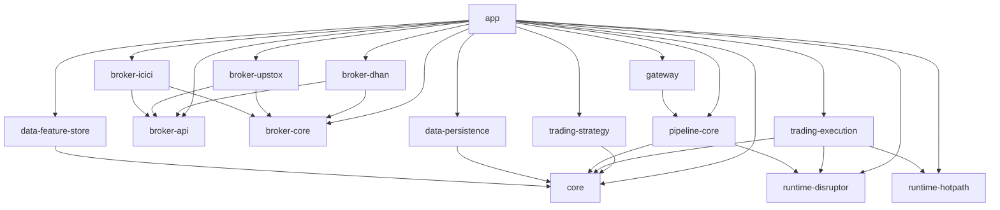

# Build System

<cite>
**Referenced Files in This Document**
- [build.gradle](file://build.gradle)
- [settings.gradle](file://settings.gradle)
- [gradle.properties](file://gradle.properties)
- [gradle-wrapper.properties](file://gradle/wrapper/gradle-wrapper.properties)
- [app/build.gradle](file://app/build.gradle)
- [core/build.gradle](file://core/build.gradle)
- [broker/api/build.gradle](file://broker/api/build.gradle)
- [broker/core/build.gradle](file://broker/core/build.gradle)
- [broker/dhan/build.gradle](file://broker/dhan/build.gradle)
- [broker/upstox/build.gradle](file://broker/upstox/build.gradle)
- [broker/icici/build.gradle](file://broker/icici/build.gradle)
- [broker-gateway/build.gradle](file://broker-gateway/build.gradle)
- [gateway/build.gradle](file://gateway/build.gradle)
- [pipeline/core/build.gradle](file://pipeline/core/build.gradle)
- [trading/strategy/build.gradle](file://trading/strategy/build.gradle)
- [trading/execution/build.gradle](file://trading/execution/build.gradle)
- [runtime/disruptor/build.gradle](file://runtime/disruptor/build.gradle)
- [runtime/hotpath/build.gradle](file://runtime/hotpath/build.gradle)
- [data/persistence/build.gradle](file://data/persistence/build.gradle)
- [data/feature-store/build.gradle](file://data/feature-store/build.gradle)
- [cli/build.gradle](file://cli/build.gradle)
- [composition/build.gradle](file://composition/build.gradle)
- [nodes/trade-node-library/build.gradle](file://nodes/trade-node-library/build.gradle)
- [research/api/build.gradle](file://research/api/build.gradle)
- [replay/engine/build.gradle](file://replay/engine/build.gradle)
- [.github/workflows/ci.yml](file://.github/workflows/ci.yml)
</cite>

## Table of Contents
1. [Introduction](#introduction)
2. [Project Structure](#project-structure)
3. [Core Components](#core-components)
4. [Architecture Overview](#architecture-overview)
5. [Detailed Component Analysis](#detailed-component-analysis)
6. [Dependency Analysis](#dependency-analysis)
7. [Performance Considerations](#performance-considerations)
8. [Troubleshooting Guide](#troubleshooting-guide)
9. [Conclusion](#conclusion)
10. [Appendices](#appendices)

## Introduction
This document explains the Gradle multi-module build system used by the project. It covers the root build configuration, module declarations, dependency management strategies, and build performance tuning. It also provides practical guidance for building, testing, and packaging artifacts, integrating with continuous integration, leveraging build caching, and resolving dependencies efficiently. Finally, it outlines extension guidelines and common troubleshooting steps.

## Project Structure
The build system is organized as a multi-module Gradle project with a central root build script, a settings file declaring included modules, and per-module build scripts. Modules are grouped by functional areas such as core trading logic, brokers, gateway, runtime components, data layers, and research/replay utilities.

Key characteristics:
- Centralized root build script coordinates global plugin management and common configurations.
- The settings file declares all subprojects and maps logical module names to physical directories.
- Each module defines its own plugins, dependencies, and tasks tailored to its role.

```mermaid
graph TB
Root["Root Build Script<br/>build.gradle"] --> Settings["Settings Script<br/>settings.gradle"]
Settings --> Core["Module: core"]
Settings --> PipelineCore["Module: pipeline-core"]
Settings --> BrokerAPI["Module: broker-api"]
Settings --> BrokerCore["Module: broker-core"]
Settings --> BrokerDhan["Module: broker-dhan"]
Settings --> BrokerUpstox["Module: broker-upstox"]
Settings --> BrokerIcici["Module: broker-icici"]
Settings --> BrokerGateway["Module: broker-gateway"]
Settings --> Gateway["Module: gateway"]
Settings --> RuntimeDisruptor["Module: runtime-disruptor"]
Settings --> RuntimeHotpath["Module: runtime-hotpath"]
Settings --> DataPersistence["Module: data-persistence"]
Settings --> DataFeatureStore["Module: data-feature-store"]
Settings --> TradingStrategy["Module: trading-strategy"]
Settings --> TradingExecution["Module: trading-execution"]
Settings --> CLI["Module: cli"]
Settings --> Composition["Module: composition"]
Settings --> NodesLibrary["Module: nodes/trade-node-library"]
Settings --> ResearchAPI["Module: research-api"]
Settings --> ReplayEngine["Module: replay-engine"]
Settings --> App["Module: app"]
```

**Diagram sources**
- [settings.gradle:1-50](file://settings.gradle#L1-L50)
- [build.gradle:1-50](file://build.gradle#L1-L50)

**Section sources**
- [settings.gradle:1-50](file://settings.gradle#L1-L50)
- [build.gradle:1-50](file://build.gradle#L1-L50)

## Core Components
This section documents the primary Gradle configuration files and their roles.

- Root build script
  - Declares global plugins and shared dependency management.
  - Defines common Java toolchain and Spring Boot plugin usage.
  - Provides shared configurations for all subprojects.

- Settings script
  - Declares module names and maps them to physical directories.
  - Ensures consistent inclusion across the build.

- Gradle properties
  - JVM arguments and parallel execution enablement.
  - Build cache toggles for local vs CI environments.

- Wrapper configuration
  - Specifies the Gradle distribution used by contributors and CI.

Practical usage examples (paths only):
- Build all modules: [./gradlew build:1-50](file://build.gradle#L1-L50)
- Clean and rebuild: [./gradlew clean build:1-50](file://build.gradle#L1-L50)
- Run tests in a specific module: [./gradlew :module-name:test:1-50](file://build.gradle#L1-L50)
- Generate artifacts (e.g., bootJar): [./gradlew :app:bootJar:1-50](file://app/build.gradle#L1-L50)

**Section sources**
- [build.gradle:1-50](file://build.gradle#L1-L50)
- [settings.gradle:1-50](file://settings.gradle#L1-L50)
- [gradle.properties:1-10](file://gradle.properties#L1-L10)
- [gradle-wrapper.properties:1-10](file://gradle/wrapper/gradle-wrapper.properties#L1-L10)

## Architecture Overview
The build architecture centers on a root build script that applies common plugin management and Java/Spring Boot configurations. The settings script enumerates modules and ensures consistent inclusion. Each module’s build script adds framework-specific plugins and declares inter-module dependencies.

```mermaid
graph TB
subgraph "Global"
RBG["Root Build<br/>build.gradle"]
SET["Settings<br/>settings.gradle"]
GP["Gradle Properties<br/>gradle.properties"]
GW["Wrapper Props<br/>gradle-wrapper.properties"]
end
subgraph "Modules"
APP["app"]
CORE["core"]
PIPECORE["pipeline-core"]
BROKERAPI["broker-api"]
BROKERCORE["broker-core"]
BROKERDHAN["broker-dhan"]
BROKERUPSTOX["broker-upstox"]
BROKERICICI["broker-icici"]
BROKERGW["broker-gateway"]
GWY["gateway"]
RDIS["runtime-disruptor"]
RHP["runtime-hotpath"]
DPERS["data-persistence"]
DFS["data-feature-store"]
STRAT["trading-strategy"]
EXEC["trading-execution"]
CLI["cli"]
COMP["composition"]
NODES["nodes/trade-node-library"]
RESAPI["research-api"]
REPENG["replay-engine"]
end
RBG --> APP
RBG --> CORE
RBG --> PIPECORE
RBG --> BROKERAPI
RBG --> BROKERCORE
RBG --> BROKERDHAN
RBG --> BROKERUPSTOX
RBG --> BROKERICICI
RBG --> BROKERGW
RBG --> GWY
RBG --> RDIS
RBG --> RHP
RBG --> DPERS
RBG --> DFS
RBG --> STRAT
RBG --> EXEC
RBG --> CLI
RBG --> COMP
RBG --> NODES
RBG --> RESAPI
RBG --> REPENG
SET --> APP
SET --> CORE
SET --> PIPECORE
SET --> BROKERAPI
SET --> BROKERCORE
SET --> BROKERDHAN
SET --> BROKERUPSTOX
SET --> BROKERICICI
SET --> BROKERGW
SET --> GWY
SET --> RDIS
SET --> RHP
SET --> DPERS
SET --> DFS
SET --> STRAT
SET --> EXEC
SET --> CLI
SET --> COMP
SET --> NODES
SET --> RESAPI
SET --> REPENG
GP -. influences .-> RBG
GW -. distribution .-> RBG
```

**Diagram sources**
- [build.gradle:1-50](file://build.gradle#L1-L50)
- [settings.gradle:1-50](file://settings.gradle#L1-L50)
- [gradle.properties:1-10](file://gradle.properties#L1-L10)
- [gradle-wrapper.properties:1-10](file://gradle/wrapper/gradle-wrapper.properties#L1-L10)

## Detailed Component Analysis

### Root Build Script
Responsibilities:
- Applies Spring Boot and dependency management plugins.
- Configures Java toolchain and common repositories.
- Defines shared dependency versions and common test frameworks.
- Sets global task behavior and artifact publishing defaults.

Key behaviors:
- Centralizes plugin versions and dependency constraints.
- Enables parallel execution and configures JVM args via properties.
- Provides shared configurations for all subprojects.

Practical examples:
- Add a new shared dependency: update the root build script’s dependency catalog or common block.
- Change Java version: adjust the toolchain configuration in the root build script.
- Modify global test behavior: edit the root build script’s test configuration.

**Section sources**
- [build.gradle:1-50](file://build.gradle#L1-L50)

### Settings Script
Responsibilities:
- Declares module names and maps them to physical directories.
- Ensures consistent inclusion across the build.
- Supports hierarchical module layouts (e.g., pipeline/core).

Key behaviors:
- Uses projectDir assignments to decouple logical names from filesystem layout.
- Includes modules in a deterministic order for reproducible builds.

Practical examples:
- Add a new module: include the module name and set its projectDir.
- Rename a module: update the include and projectDir mapping.

**Section sources**
- [settings.gradle:1-50](file://settings.gradle#L1-L50)

### Gradle Properties
Responsibilities:
- Controls JVM arguments and parallel execution.
- Manages build cache behavior for local vs CI environments.
- Influences Gradle daemon and worker processes.

Key behaviors:
- Parallel execution enabled globally.
- Build cache disabled for local development to avoid stale artifacts after clean.
- JVM heap size configured via org.gradle.jvmargs.

Practical examples:
- Enable build cache in CI: pass --build-cache or set org.gradle.caching=true.
- Increase heap for large builds: adjust org.gradle.jvmargs.

**Section sources**
- [gradle.properties:1-10](file://gradle.properties#L1-L10)

### Wrapper Configuration
Responsibilities:
- Pins the Gradle distribution used by contributors and CI.
- Controls network timeouts and validation behavior.

Key behaviors:
- Distribution URL points to a specific Gradle release.
- Network timeout and retry settings are configured.

Practical examples:
- Upgrade Gradle: update distributionUrl and validate compatibility.
- Adjust network settings: modify networkTimeout and retries.

**Section sources**
- [gradle-wrapper.properties:1-10](file://gradle/wrapper/gradle-wrapper.properties#L1-L10)

### Module Examples

#### Application Module
The application module aggregates core trading, broker integrations, runtime components, and data layers into a Spring Boot application.

Key behaviors:
- Declares inter-module dependencies on core, pipeline-core, broker modules, trading modules, runtime modules, and data modules.
- Uses Spring Boot plugin for packaging and dependency management.

Practical examples:
- Build the Spring Boot app: [./gradlew :app:bootJar:1-50](file://app/build.gradle#L1-L50)
- Run the app: [./gradlew :app:bootRun:1-50](file://app/build.gradle#L1-L50)

**Section sources**
- [app/build.gradle:1-50](file://app/build.gradle#L1-L50)

#### Broker Modules
Broker modules encapsulate integrations with specific broker providers (e.g., Dhan, Upstox, ICICI).

Key behaviors:
- Each broker module depends on broker-api and broker-core.
- Contains provider-specific implementations and tests.

Practical examples:
- Build a single broker module: [./gradlew :broker-dhan:build:1-50](file://broker/dhan/build.gradle#L1-L50)
- Run broker tests: [./gradlew :broker-upstox:test:1-50](file://broker/upstox/build.gradle#L1-L50)

**Section sources**
- [broker/api/build.gradle:1-50](file://broker/api/build.gradle#L1-L50)
- [broker/core/build.gradle:1-50](file://broker/core/build.gradle#L1-L50)
- [broker/dhan/build.gradle:1-50](file://broker/dhan/build.gradle#L1-L50)
- [broker/upstox/build.gradle:1-50](file://broker/upstox/build.gradle#L1-L50)
- [broker/icici/build.gradle:1-50](file://broker/icici/build.gradle#L1-L50)

#### Pipeline and Trading Modules
These modules implement streaming pipelines, strategy execution, and related runtime components.

Key behaviors:
- Depend on core and runtime modules.
- Provide specialized tasks for benchmarks and tests.

Practical examples:
- Benchmark pipeline components: [./gradlew :pipeline-core:jmh:1-50](file://pipeline/core/build.gradle#L1-L50)
- Execute strategy tests: [./gradlew :trading-strategy:test:1-50](file://trading/strategy/build.gradle#L1-L50)

**Section sources**
- [pipeline/core/build.gradle:1-50](file://pipeline/core/build.gradle#L1-L50)
- [trading/strategy/build.gradle:1-50](file://trading/strategy/build.gradle#L1-L50)
- [trading/execution/build.gradle:1-50](file://trading/execution/build.gradle#L1-L50)

#### Runtime Modules
Runtime modules provide high-performance components such as disruptor and hot-path utilities.

Key behaviors:
- Provide low-level primitives for event processing and throughput.
- Include dedicated tests and benchmarks.

Practical examples:
- Build runtime modules: [./gradlew :runtime-disruptor:build:1-50](file://runtime/disruptor/build.gradle#L1-L50)
- Run hot-path tests: [./gradlew :runtime-hotpath:test:1-50](file://runtime/hotpath/build.gradle#L1-L50)

**Section sources**
- [runtime/disruptor/build.gradle:1-50](file://runtime/disruptor/build.gradle#L1-L50)
- [runtime/hotpath/build.gradle:1-50](file://runtime/hotpath/build.gradle#L1-L50)

#### Data Modules
Data modules handle persistence and feature store functionality.

Key behaviors:
- Provide abstractions and implementations for data access.
- Include tests for correctness and performance.

Practical examples:
- Build persistence module: [./gradlew :data-persistence:build:1-50](file://data/persistence/build.gradle#L1-L50)
- Build feature store: [./gradlew :data-feature-store:build:1-50](file://data/feature-store/build.gradle#L1-L50)

**Section sources**
- [data/persistence/build.gradle:1-50](file://data/persistence/build.gradle#L1-L50)
- [data/feature-store/build.gradle:1-50](file://data/feature-store/build.gradle#L1-L50)

#### CLI and Composition Modules
CLI module provides command-line utilities; composition module orchestrates runtime assemblies.

Key behaviors:
- CLI module exposes commands for operational tasks.
- Composition module wires runtime components.

Practical examples:
- Build CLI: [./gradlew :cli:build:1-50](file://cli/build.gradle#L1-L50)
- Compose runtime: [./gradlew :composition:test:1-50](file://composition/build.gradle#L1-L50)

**Section sources**
- [cli/build.gradle:1-50](file://cli/build.gradle#L1-L50)
- [composition/build.gradle:1-50](file://composition/build.gradle#L1-L50)

#### Nodes Library
Nodes library defines reusable pipeline node abstractions and tests.

Key behaviors:
- Provides node descriptors and executors.
- Supports scanning and testing of node implementations.

Practical examples:
- Build nodes library: [./gradlew :nodes/trade-node-library:build:1-50](file://nodes/trade-node-library/build.gradle#L1-L50)

**Section sources**
- [nodes/trade-node-library/build.gradle:1-50](file://nodes/trade-node-library/build.gradle#L1-L50)

#### Research and Replay Modules
Research API and replay engine modules support research workflows and replay simulations.

Key behaviors:
- Research API provides research session orchestration.
- Replay engine supports backtesting and parity validation.

Practical examples:
- Build research API: [./gradlew :research-api:build:1-50](file://research/api/build.gradle#L1-L50)
- Build replay engine: [./gradlew :replay-engine:build:1-50](file://replay/engine/build.gradle#L1-L50)

**Section sources**
- [research/api/build.gradle:1-50](file://research/api/build.gradle#L1-L50)
- [replay/engine/build.gradle:1-50](file://replay/engine/build.gradle#L1-L50)

## Dependency Analysis
This section analyzes inter-module dependencies and build-time relationships.

**Diagram sources**
- [app/build.gradle:1-50](file://app/build.gradle#L1-L50)
- [pipeline/core/build.gradle:1-50](file://pipeline/core/build.gradle#L1-L50)
- [broker/api/build.gradle:1-50](file://broker/api/build.gradle#L1-L50)
- [broker/core/build.gradle:1-50](file://broker/core/build.gradle#L1-L50)
- [broker/dhan/build.gradle:1-50](file://broker/dhan/build.gradle#L1-L50)
- [broker/upstox/build.gradle:1-50](file://broker/upstox/build.gradle#L1-L50)
- [broker/icici/build.gradle:1-50](file://broker/icici/build.gradle#L1-L50)
- [gateway/build.gradle:1-50](file://gateway/build.gradle#L1-L50)
- [runtime/disruptor/build.gradle:1-50](file://runtime/disruptor/build.gradle#L1-L50)
- [runtime/hotpath/build.gradle:1-50](file://runtime/hotpath/build.gradle#L1-L50)
- [data/persistence/build.gradle:1-50](file://data/persistence/build.gradle#L1-L50)
- [data/feature-store/build.gradle:1-50](file://data/feature-store/build.gradle#L1-L50)
- [trading/strategy/build.gradle:1-50](file://trading/strategy/build.gradle#L1-L50)
- [trading/execution/build.gradle:1-50](file://trading/execution/build.gradle#L1-L50)

### Dependency Management Strategies
- Centralized dependency management via the root build script.
- Inter-module dependencies declared using project(':module') for compile-time linkage.
- Spring Boot plugin aligns versions with managed BOMs.

Best practices:
- Prefer project dependencies for internal modules.
- Keep external dependency versions aligned in the root build script.
- Use feature flags or profiles to conditionally include optional modules.

**Section sources**
- [build.gradle:1-50](file://build.gradle#L1-L50)
- [app/build.gradle:1-50](file://app/build.gradle#L1-L50)

## Performance Considerations
This section provides guidance for optimizing build performance.

- Parallel execution
  - Enabled globally via gradle.properties.
  - Benefits multi-module builds by running independent tasks concurrently.

- Build cache
  - Disabled locally to prevent stale artifacts after clean.
  - Recommended to enable in CI via --build-cache or org.gradle.caching=true.

- JVM arguments
  - Adjust org.gradle.jvmargs to increase heap for large builds.
  - Ensure sufficient memory for compilation and test execution.

- Task configuration avoidance
  - Prefer lazy configuration patterns to reduce configuration time.
  - Avoid unnecessary task graph construction in dynamic builds.

- Incremental compilation and testing
  - Use incremental compilation to speed up recompilation.
  - Run targeted tests using module-specific tasks.

Practical examples:
- Enable build cache in CI: [./gradlew build --build-cache:1-50](file://build.gradle#L1-L50)
- Increase heap: set org.gradle.jvmargs in gradle.properties.

**Section sources**
- [gradle.properties:1-10](file://gradle.properties#L1-L10)
- [build.gradle:1-50](file://build.gradle#L1-L50)

## Troubleshooting Guide
Common issues and resolutions:

- Stale artifacts after clean
  - Symptom: Some tasks remain UP-TO-DATE after clean.
  - Cause: Build cache disabled locally.
  - Resolution: Re-enable build cache for clean builds or invalidate the cache.

- Out-of-memory errors during compilation
  - Symptom: Compilation failures with OOM errors.
  - Cause: Insufficient heap allocation.
  - Resolution: Increase org.gradle.jvmargs heap size.

- Dependency resolution conflicts
  - Symptom: Version conflicts or resolution errors.
  - Cause: Mismatched versions across modules.
  - Resolution: Align versions in the root build script and use strict version catalogs.

- Wrapper distribution mismatch
  - Symptom: Gradle version mismatch warnings or failures.
  - Cause: Local Gradle differs from wrapper distribution.
  - Resolution: Use ./gradlew with the pinned distribution or update gradle-wrapper.properties.

- CI build flakiness
  - Symptom: Intermittent test or compilation failures.
  - Cause: Resource contention or missing cache.
  - Resolution: Enable build cache in CI and allocate adequate resources.

**Section sources**
- [gradle.properties:1-10](file://gradle.properties#L1-L10)
- [gradle-wrapper.properties:1-10](file://gradle/wrapper/gradle-wrapper.properties#L1-L10)
- [build.gradle:1-50](file://build.gradle#L1-L50)

## Conclusion
The Gradle multi-module build system organizes the project into cohesive functional modules while centralizing plugin management and dependency alignment. By leveraging the root build script, settings file, and gradle.properties, teams can achieve reproducible builds, efficient parallel execution, and scalable CI integration. Following the best practices and troubleshooting guidance outlined here will help maintain a fast, reliable, and extensible build process.

## Appendices

### Continuous Integration Integration
- CI workflow file demonstrates automated build and test execution.
- Typical CI tasks include dependency resolution, compilation, unit/integration tests, and artifact publication.

Practical examples:
- Trigger CI: push to main branch or create a pull request.
- View CI logs: consult the CI provider’s interface for build outputs.

**Section sources**
- [.github/workflows/ci.yml:1-50](file://.github/workflows/ci.yml#L1-L50)

### Practical Build and Test Commands
- Build all modules: [./gradlew build:1-50](file://build.gradle#L1-L50)
- Clean and rebuild: [./gradlew clean build:1-50](file://build.gradle#L1-L50)
- Run tests in a specific module: [./gradlew :module-name:test:1-50](file://build.gradle#L1-L50)
- Generate artifacts (e.g., bootJar): [./gradlew :app:bootJar:1-50](file://app/build.gradle#L1-L50)
- Benchmark pipeline components: [./gradlew :pipeline-core:jmh:1-50](file://pipeline/core/build.gradle#L1-L50)

**Section sources**
- [build.gradle:1-50](file://build.gradle#L1-L50)
- [app/build.gradle:1-50](file://app/build.gradle#L1-L50)
- [pipeline/core/build.gradle:1-50](file://pipeline/core/build.gradle#L1-L50)