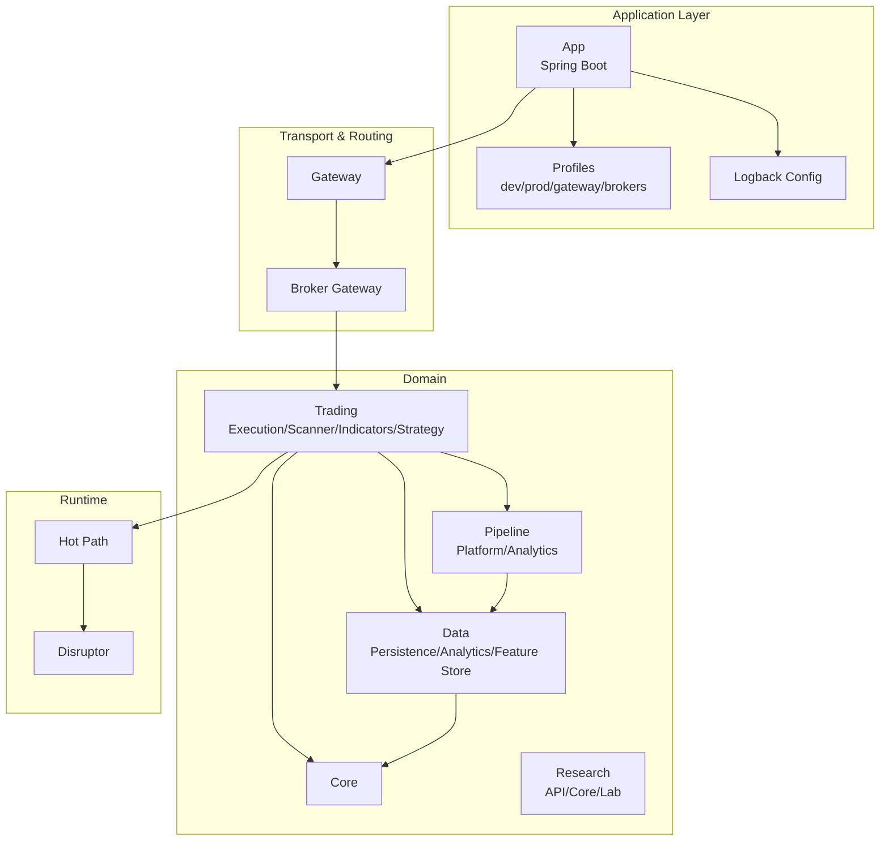
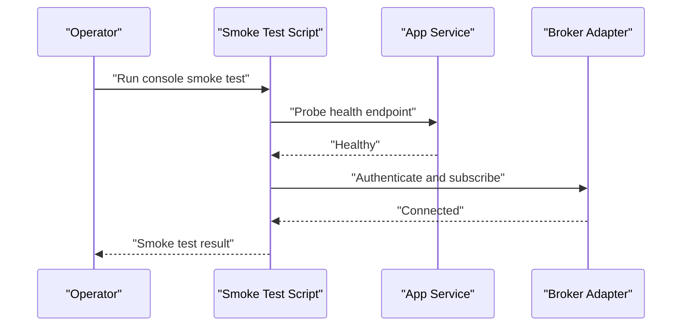
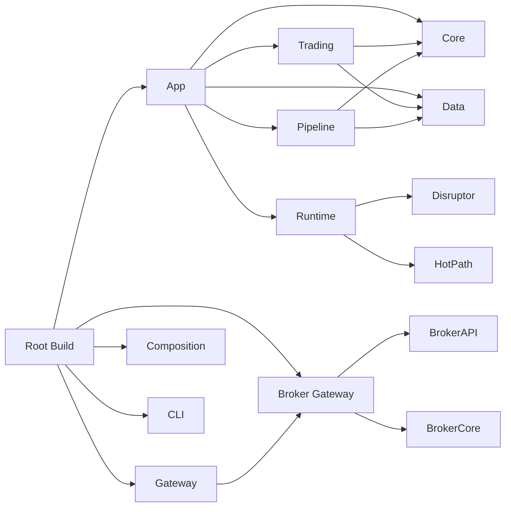

# Deployment and Operations

<cite>
**Referenced Files in This Document**
- [build.gradle](file://build.gradle)
- [settings.gradle](file://settings.gradle)
- [gradle.properties](file://gradle.properties)
- [app/src/main/resources/application.yml](file://app/src/main/resources/application.yml)
- [app/src/main/resources/application-prod.yml](file://app/src/main/resources/application-prod.yml)
- [app/src/main/resources/application-dev.yml](file://app/src/main/resources/application-dev.yml)
- [app/src/main/resources/application-gateway.yml](file://app/src/main/resources/application-gateway.yml)
- [app/src/main/resources/application-icici-prod.yml](file://app/src/main/resources/application-icici-prod.yml)
- [app/src/main/resources/application-upstox-prod.yml](file://app/src/main/resources/application-upstox-prod.yml)
- [app/src/main/resources/application-upstox-analytics.yml](file://app/src/main/resources/application-upstox-analytics.yml)
- [app/src/main/resources/logback-spring.xml](file://app/src/main/resources/logback-spring.xml)
- [.github/workflows/ci.yml](file://.github/workflows/ci.yml)
- [scripts/console-smoke.sh](file://scripts/console-smoke.sh)
- [scripts/production-smoke-test.sh](file://scripts/production-smoke-test.sh)
- [docs/PRODUCTION_DEPLOYMENT.md](file://docs/PRODUCTION_DEPLOYMENT.md)
- [docs/runtime-mode-audit.md](file://docs/runtime-mode-audit.md)
- [docs/CONSOLE_SMOKE.md](file://docs/CONSOLE_SMOKE.md)
- [docs/BROKER_GATEWAY_ARCHITECTURE_REVIEW.md](file://docs/BROKER_GATEWAY_ARCHITECTURE_REVIEW.md)
- [docs/HORIZONTAL_SCALING_DESIGN.md](file://docs/HORIZONTAL_SCALING_DESIGN.md)
- [docs/PIPELINE_DESIGN.md](file://docs/PIPELINE_DEPLOYMENT.md)
- [docs/API_DOCUMENTATION.md](file://docs/API_DOCUMENTATION.md)
- [docs/openapi.yaml](file://docs/openapi.yaml)
- [gateway/build.gradle](file://gateway/build.gradle)
- [broker-gateway/build.gradle](file://broker-gateway/build.gradle)
- [composition/build.gradle](file://composition/build.gradle)
- [cli/build.gradle](file://cli/build.gradle)
- [app/build.gradle](file://app/build.gradle)
- [core/build.gradle](file://core/build.gradle)
- [data/persistence/build.gradle](file://data/persistence/build.gradle)
- [pipeline/platform/trade-pipeline-platform/build.gradle](file://pipeline/platform/trade-pipeline-platform/build.gradle)
- [trading/execution/build.gradle](file://trading/execution/build.gradle)
- [runtime/disruptor/build.gradle](file://runtime/disruptor/build.gradle)
- [runtime/hotpath/build.gradle](file://runtime/hotpath/build.gradle)
- [research/api/build.gradle](file://research/api/build.gradle)
- [mcp-server/build.gradle](file://mcp-server/build.gradle)
- [nodes/trade-node-library/build.gradle](file://nodes/trade-node-library/build.gradle)
- [broker/api/build.gradle](file://broker/api/build.gradle)
- [broker/core/build.gradle](file://broker/core/build.gradle)
- [broker/dhan/build.gradle](file://broker/dhan/build.gradle)
- [broker/icici/build.gradle](file://broker/icici/build.gradle)
- [broker/upstox/build.gradle](file://broker/upstox/build.gradle)
- [data/feature-store/build.gradle](file://data/feature-store/build.gradle)
- [data/historical-ingest/build.gradle](file://data/historical-ingest/build.gradle)
- [data/analytics/build.gradle](file://data/analytics/build.gradle)
- [trading/indicators/build.gradle](file://trading/indicators/build.gradle)
- [trading/scanner/build.gradle](file://trading/scanner/build.gradle)
- [trading/simulation/build.gradle](file://trading/simulation/build.gradle)
- [trading/strategy/build.gradle](file://trading/strategy/build.gradle)
- [replay/engine/build.gradle](file://replay/engine/build.gradle)
- [research/core/build.gradle](file://research/core/build.gradle)
- [research/lab/build.gradle](file://research/lab/build.gradle)
- [architecture-test/build.gradle](file://architecture-test/build.gradle)
</cite>

## Table of Contents
1. [Introduction](#introduction)
2. [Project Structure](#project-structure)
3. [Core Components](#core-components)
4. [Architecture Overview](#architecture-overview)
5. [Detailed Component Analysis](#detailed-component-analysis)
6. [Dependency Analysis](#dependency-analysis)
7. [Performance Considerations](#performance-considerations)
8. [Troubleshooting Guide](#troubleshooting-guide)
9. [Conclusion](#conclusion)
10. [Appendices](#appendices)

## Introduction
This document provides comprehensive guidance for deploying and operating the Trade-J platform. It explains the Gradle multi-module build system, dependency management, and build configuration. It documents production deployment architecture, containerization options, and monitoring setup. It also details runtime mode audit, smoke testing procedures, and operational checklists, along with practical examples of deployment scripts, environment setup, and maintenance procedures. Finally, it outlines CI/CD integration, health monitoring, and operational dashboards, and provides best practices, troubleshooting tips, and performance tuning recommendations.

## Project Structure
Trade-J is a multi-module Gradle project organized by functional domains and runtime layers. Modules are grouped under core, data, trading, runtime, pipeline, broker, gateway, and supporting utilities. The root build orchestrates submodules, while individual module build.gradle files define dependencies and packaging. Application profiles for development, gateway, and broker-specific environments are configured via Spring Boot application YAML files.

```mermaid
graph TB
Root["Root Build<br/>build.gradle + settings.gradle"] --> App["App Module<br/>app/build.gradle"]
Root --> Gateway["Gateway Module<br/>gateway/build.gradle"]
Root --> BrokerGateway["Broker Gateway Module<br/>broker-gateway/build.gradle"]
Root --> Composition["Composition Module<br/>composition/build.gradle"]
Root --> CLI["CLI Module<br/>cli/build.gradle"]
App --> Profiles["Profiles<br/>application-*.yml"]
App --> Logging["Logging Config<br/>logback-spring.xml"]
subgraph "Core Domain"
Core["Core Module<br/>core/build.gradle"]
Data["Data Modules<br/>data/*"]
Trading["Trading Modules<br/>trading/*"]
Pipeline["Pipeline Modules<br/>pipeline/*"]
Runtime["Runtime Modules<br/>runtime/*"]
Research["Research Modules<br/>research/*"]
end
Root --> Core
Root --> Data
Root --> Trading
Root --> Pipeline
Root --> Runtime
Root --> Research
subgraph "Broker Integrations"
BrokerAPI["Broker API<br/>broker/api/build.gradle"]
BrokerCore["Broker Core<br/>broker/core/build.gradle"]
Dhan["Dhan<br/>broker/dhan/build.gradle"]
Icici["ICICI<br/>broker/icici/build.gradle"]
Upstox["Upstox<br/>broker/upstox/build.gradle"]
end
Root --> BrokerAPI
Root --> BrokerCore
Root --> Dhan
Root --> Icici
Root --> Upstox
```

**Diagram sources**
- [build.gradle](file://build.gradle)
- [settings.gradle](file://settings.gradle)
- [app/build.gradle](file://app/build.gradle)
- [gateway/build.gradle](file://gateway/build.gradle)
- [broker-gateway/build.gradle](file://broker-gateway/build.gradle)
- [composition/build.gradle](file://composition/build.gradle)
- [cli/build.gradle](file://cli/build.gradle)
- [core/build.gradle](file://core/build.gradle)
- [data/persistence/build.gradle](file://data/persistence/build.gradle)
- [pipeline/platform/trade-pipeline-platform/build.gradle](file://pipeline/platform/trade-pipeline-platform/build.gradle)
- [trading/execution/build.gradle](file://trading/execution/build.gradle)
- [runtime/disruptor/build.gradle](file://runtime/disruptor/build.gradle)
- [runtime/hotpath/build.gradle](file://runtime/hotpath/build.gradle)
- [research/api/build.gradle](file://research/api/build.gradle)
- [broker/api/build.gradle](file://broker/api/build.gradle)
- [broker/core/build.gradle](file://broker/core/build.gradle)
- [broker/dhan/build.gradle](file://broker/dhan/build.gradle)
- [broker/icici/build.gradle](file://broker/icici/build.gradle)
- [broker/upstox/build.gradle](file://broker/upstox/build.gradle)

**Section sources**
- [build.gradle](file://build.gradle)
- [settings.gradle](file://settings.gradle)
- [gradle.properties](file://gradle.properties)

## Core Components
- Root build and settings orchestrate the multi-module structure and define shared plugin management and dependency versions.
- Application profile configuration supports development, production, gateway, and broker-specific environments.
- Logging is centralized via Logback Spring configuration.
- CI/CD is defined in GitHub Actions for automated quality gates and release workflows.

Key operational artifacts:
- Application YAML profiles for environment-specific configuration.
- Shell scripts for smoke tests and production verification.
- Architectural and deployment documentation for production hardening and runtime audits.

**Section sources**
- [build.gradle](file://build.gradle)
- [settings.gradle](file://settings.gradle)
- [gradle.properties](file://gradle.properties)
- [app/src/main/resources/application.yml](file://app/src/main/resources/application.yml)
- [app/src/main/resources/application-prod.yml](file://app/src/main/resources/application-prod.yml)
- [app/src/main/resources/application-dev.yml](file://app/src/main/resources/application-dev.yml)
- [app/src/main/resources/application-gateway.yml](file://app/src/main/resources/application-gateway.yml)
- [app/src/main/resources/application-icici-prod.yml](file://app/src/main/resources/application-icici-prod.yml)
- [app/src/main/resources/application-upstox-prod.yml](file://app/src/main/resources/application-upstox-prod.yml)
- [app/src/main/resources/application-upstox-analytics.yml](file://app/src/main/resources/application-upstox-analytics.yml)
- [app/src/main/resources/logback-spring.xml](file://app/src/main/resources/logback-spring.xml)
- [.github/workflows/ci.yml](file://.github/workflows/ci.yml)

## Architecture Overview
The platform is composed of:
- Application runtime with Spring Boot profiles for dev/prod/gateway and broker integrations.
- Gateway and Broker Gateway layers for protocol bridging and routing.
- Composition layer wiring domain modules into runtime assemblies.
- Data ingestion, persistence, and analytics pipelines.
- Trading engines for execution, scanning, indicators, and strategy.
- Research APIs and labs for experimentation.
- Runtime hot-path and disruptor components for high-frequency processing.

**Diagram sources**
- [app/src/main/resources/application.yml](file://app/src/main/resources/application.yml)
- [gateway/build.gradle](file://gateway/build.gradle)
- [broker-gateway/build.gradle](file://broker-gateway/build.gradle)
- [composition/build.gradle](file://composition/build.gradle)
- [core/build.gradle](file://core/build.gradle)
- [data/persistence/build.gradle](file://data/persistence/build.gradle)
- [data/feature-store/build.gradle](file://data/feature-store/build.gradle)
- [data/analytics/build.gradle](file://data/analytics/build.gradle)
- [trading/execution/build.gradle](file://trading/execution/build.gradle)
- [trading/scanner/build.gradle](file://trading/scanner/build.gradle)
- [trading/indicators/build.gradle](file://trading/indicators/build.gradle)
- [trading/strategy/build.gradle](file://trading/strategy/build.gradle)
- [pipeline/platform/trade-pipeline-platform/build.gradle](file://pipeline/platform/trade-pipeline-platform/build.gradle)
- [research/api/build.gradle](file://research/api/build.gradle)
- [research/core/build.gradle](file://research/core/build.gradle)
- [research/lab/build.gradle](file://research/lab/build.gradle)
- [runtime/hotpath/build.gradle](file://runtime/hotpath/build.gradle)
- [runtime/disruptor/build.gradle](file://runtime/disruptor/build.gradle)

## Detailed Component Analysis

### Gradle Multi-Module Build System
- Root build defines plugin management and shared dependency versions.
- settings.gradle aggregates included builds for all modules.
- Each module’s build.gradle declares its own dependencies and packaging.
- Properties in gradle.properties centralize JVM and build options.

Operational implications:
- Consistent dependency alignment across modules.
- Centralized Java toolchain and test framework configuration.
- Modular packaging enables independent releases and deployments.

**Section sources**
- [build.gradle](file://build.gradle)
- [settings.gradle](file://settings.gradle)
- [gradle.properties](file://gradle.properties)

### Dependency Management and Build Configuration
- Shared versions and plugin versions are managed at the root level.
- Module-level build.gradle files declare internal and external dependencies.
- Lockfiles ensure reproducible builds across environments.

Best practices:
- Keep root-level versions aligned with module-specific needs.
- Prefer constrained versions for stability.
- Use lockfiles in CI and local development.

**Section sources**
- [build.gradle](file://build.gradle)
- [app/build.gradle](file://app/build.gradle)
- [gateway/build.gradle](file://gateway/build.gradle)
- [broker-gateway/build.gradle](file://broker-gateway/build.gradle)
- [composition/build.gradle](file://composition/build.gradle)
- [cli/build.gradle](file://cli/build.gradle)
- [core/build.gradle](file://core/build.gradle)
- [data/persistence/build.gradle](file://data/persistence/build.gradle)
- [data/feature-store/build.gradle](file://data/feature-store/build.gradle)
- [data/analytics/build.gradle](file://data/analytics/build.gradle)
- [trading/execution/build.gradle](file://trading/execution/build.gradle)
- [trading/scanner/build.gradle](file://trading/scanner/build.gradle)
- [trading/indicators/build.gradle](file://trading/indicators/build.gradle)
- [trading/strategy/build.gradle](file://trading/strategy/build.gradle)
- [pipeline/platform/trade-pipeline-platform/build.gradle](file://pipeline/platform/trade-pipeline-platform/build.gradle)
- [research/api/build.gradle](file://research/api/build.gradle)
- [research/core/build.gradle](file://research/core/build.gradle)
- [research/lab/build.gradle](file://research/lab/build.gradle)
- [runtime/disruptor/build.gradle](file://runtime/disruptor/build.gradle)
- [runtime/hotpath/build.gradle](file://runtime/hotpath/build.gradle)
- [broker/api/build.gradle](file://broker/api/build.gradle)
- [broker/core/build.gradle](file://broker/core/build.gradle)
- [broker/dhan/build.gradle](file://broker/dhan/build.gradle)
- [broker/icici/build.gradle](file://broker/icici/build.gradle)
- [broker/upstox/build.gradle](file://broker/upstox/build.gradle)
- [architecture-test/build.gradle](file://architecture-test/build.gradle)

### Production Deployment Architecture
- Environment-specific Spring profiles configure database connections, broker credentials, logging, and observability.
- Production profile consolidates secure defaults for runtime operation.
- Gateway profile isolates transport and routing concerns.
- Broker-specific profiles enable sandbox and live environments per provider.

Containerization options:
- Package modules as Docker images using multi-stage builds.
- Use separate containers for app, gateway, and broker adapters.
- Persist configuration via mounted volumes or secret managers.

Monitoring setup:
- Enable health checks and metrics exposure.
- Integrate with dashboards for latency, throughput, and error rates.
- Capture structured logs with correlation IDs.

**Section sources**
- [app/src/main/resources/application-prod.yml](file://app/src/main/resources/application-prod.yml)
- [app/src/main/resources/application-gateway.yml](file://app/src/main/resources/application-gateway.yml)
- [app/src/main/resources/application-icici-prod.yml](file://app/src/main/resources/application-icici-prod.yml)
- [app/src/main/resources/application-upstox-prod.yml](file://app/src/main/resources/application-upstox-prod.yml)
- [app/src/main/resources/application-upstox-analytics.yml](file://app/src/main/resources/application-upstox-analytics.yml)
- [docs/PRODUCTION_DEPLOYMENT.md](file://docs/PRODUCTION_DEPLOYMENT.md)
- [docs/BROKER_GATEWAY_ARCHITECTURE_REVIEW.md](file://docs/BROKER_GATEWAY_ARCHITECTURE_REVIEW.md)
- [docs/HORIZONTAL_SCALING_DESIGN.md](file://docs/HORIZONTAL_SCALING_DESIGN.md)

### Containerization Options
- Build images per module with minimal base images.
- Use environment-specific Dockerfiles or compose files.
- Externalize secrets and configuration via environment variables or mounted files.
- Implement readiness/liveness probes aligned with health indicators.

[No sources needed since this section provides general guidance]

### Monitoring Setup
- Expose health endpoints and metrics for dashboards.
- Configure alerting thresholds for latency, error rates, and resource utilization.
- Correlate logs with distributed tracing for incident investigations.

**Section sources**
- [app/src/main/resources/logback-spring.xml](file://app/src/main/resources/logback-spring.xml)
- [docs/API_DOCUMENTATION.md](file://docs/API_DOCUMENTATION.md)
- [docs/openapi.yaml](file://docs/openapi.yaml)

### Runtime Mode Audit
- Review runtime modes and startup sequences to ensure isolation and correctness.
- Validate profile activation and environment variable precedence.
- Confirm broker adapter initialization order and fail-open/fail-close behavior.

**Section sources**
- [docs/runtime-mode-audit.md](file://docs/runtime-mode-audit.md)

### Smoke Testing Procedures
- Console smoke tests validate basic UI and API connectivity.
- Production smoke tests exercise end-to-end flows against live or sandbox endpoints.
- Scripts encapsulate pre-flight checks for connectivity, authentication, and basic operations.

**Diagram sources**
- [scripts/console-smoke.sh](file://scripts/console-smoke.sh)
- [scripts/production-smoke-test.sh](file://scripts/production-smoke-test.sh)

**Section sources**
- [scripts/console-smoke.sh](file://scripts/console-smoke.sh)
- [scripts/production-smoke-test.sh](file://scripts/production-smoke-test.sh)
- [docs/CONSOLE_SMOKE.md](file://docs/CONSOLE_SMOKE.md)

### Operational Checklists
- Pre-deploy: verify configuration profiles, secrets rotation, and dependency compatibility.
- Post-deploy: run smoke tests, confirm metrics ingestion, and validate alerts.
- Incident response: isolate failing components, roll back if necessary, and escalate based on severity.

[No sources needed since this section provides general guidance]

### Practical Examples
- Deployment scripts: use shell scripts to automate smoke tests and environment verification.
- Environment setup: load appropriate Spring profiles and set broker credentials.
- Maintenance procedures: rotate tokens, refresh sessions, and reconcile production state.

**Section sources**
- [scripts/console-smoke.sh](file://scripts/console-smoke.sh)
- [scripts/production-smoke-test.sh](file://scripts/production-smoke-test.sh)

### CI/CD Integration
- GitHub Actions workflow defines build, test, and release stages.
- Quality gates enforce code coverage, architecture tests, and contract compliance.
- Artifacts and container images are published for downstream environments.

**Section sources**
- [.github/workflows/ci.yml](file://.github/workflows/ci.yml)
- [architecture-test/build.gradle](file://architecture-test/build.gradle)

### Health Monitoring and Dashboards
- Health indicators expose application and broker adapter status.
- OpenAPI documentation describes endpoints for monitoring and management.
- Dashboards track key operational metrics and alert thresholds.

**Section sources**
- [docs/API_DOCUMENTATION.md](file://docs/API_DOCUMENTATION.md)
- [docs/openapi.yaml](file://docs/openapi.yaml)

## Dependency Analysis
The build depends on a layered structure:
- Root manages plugins and versions.
- Modules depend on core and domain libraries.
- Broker modules depend on broker API and core.
- Pipeline and trading modules depend on data and core.
- Runtime modules depend on disruptor and hot-path.

**Diagram sources**
- [build.gradle](file://build.gradle)
- [settings.gradle](file://settings.gradle)
- [app/build.gradle](file://app/build.gradle)
- [gateway/build.gradle](file://gateway/build.gradle)
- [broker-gateway/build.gradle](file://broker-gateway/build.gradle)
- [composition/build.gradle](file://composition/build.gradle)
- [cli/build.gradle](file://cli/build.gradle)
- [core/build.gradle](file://core/build.gradle)
- [data/persistence/build.gradle](file://data/persistence/build.gradle)
- [data/feature-store/build.gradle](file://data/feature-store/build.gradle)
- [data/analytics/build.gradle](file://data/analytics/build.gradle)
- [trading/execution/build.gradle](file://trading/execution/build.gradle)
- [trading/scanner/build.gradle](file://trading/scanner/build.gradle)
- [trading/indicators/build.gradle](file://trading/indicators/build.gradle)
- [trading/strategy/build.gradle](file://trading/strategy/build.gradle)
- [pipeline/platform/trade-pipeline-platform/build.gradle](file://pipeline/platform/trade-pipeline-platform/build.gradle)
- [runtime/disruptor/build.gradle](file://runtime/disruptor/build.gradle)
- [runtime/hotpath/build.gradle](file://runtime/hotpath/build.gradle)
- [broker/api/build.gradle](file://broker/api/build.gradle)
- [broker/core/build.gradle](file://broker/core/build.gradle)

**Section sources**
- [build.gradle](file://build.gradle)
- [settings.gradle](file://settings.gradle)

## Performance Considerations
- Use disruptor-based hot-path components for low-latency processing.
- Tune JVM heap and GC settings via gradle.properties for production workloads.
- Monitor broker adapter throughput and apply rate limiting where required.
- Scale horizontally using the horizontal scaling design principles.

[No sources needed since this section provides general guidance]

## Troubleshooting Guide
Common operational issues and resolutions:
- Authentication failures: verify broker credentials and token lifecycle in production profiles.
- Connectivity problems: check gateway and broker adapter health endpoints.
- Latency spikes: review hot-path and disruptor configurations; validate JVM tuning.
- Logging gaps: ensure logback configuration is applied and log levels are appropriate.

**Section sources**
- [app/src/main/resources/application-prod.yml](file://app/src/main/resources/application-prod.yml)
- [app/src/main/resources/application-icici-prod.yml](file://app/src/main/resources/application-icici-prod.yml)
- [app/src/main/resources/application-upstox-prod.yml](file://app/src/main/resources/application-upstox-prod.yml)
- [app/src/main/resources/logback-spring.xml](file://app/src/main/resources/logback-spring.xml)

## Conclusion
Trade-J’s deployment and operations rely on a robust Gradle multi-module build, environment-aware Spring profiles, and modular architecture. By following the documented deployment patterns, containerization options, monitoring setup, and operational checklists, teams can achieve reliable, scalable, and observable production operations. CI/CD integration ensures consistent quality, while runtime audits and smoke tests provide confidence in day-to-day operations.

[No sources needed since this section summarizes without analyzing specific files]

## Appendices

### Appendix A: Example Deployment Scripts
- Console smoke test script validates UI and API connectivity.
- Production smoke test script verifies end-to-end flows against broker adapters.

**Section sources**
- [scripts/console-smoke.sh](file://scripts/console-smoke.sh)
- [scripts/production-smoke-test.sh](file://scripts/production-smoke-test.sh)

### Appendix B: Environment Profiles Reference
- application.yml: base configuration.
- application-dev.yml: developer environment overrides.
- application-prod.yml: production defaults.
- application-gateway.yml: gateway-only runtime.
- application-icici-prod.yml: ICICI broker production.
- application-upstox-prod.yml: Upstox broker production.
- application-upstox-analytics.yml: Upstox analytics profile.

**Section sources**
- [app/src/main/resources/application.yml](file://app/src/main/resources/application.yml)
- [app/src/main/resources/application-dev.yml](file://app/src/main/resources/application-dev.yml)
- [app/src/main/resources/application-prod.yml](file://app/src/main/resources/application-prod.yml)
- [app/src/main/resources/application-gateway.yml](file://app/src/main/resources/application-gateway.yml)
- [app/src/main/resources/application-icici-prod.yml](file://app/src/main/resources/application-icici-prod.yml)
- [app/src/main/resources/application-upstox-prod.yml](file://app/src/main/resources/application-upstox-prod.yml)
- [app/src/main/resources/application-upstox-analytics.yml](file://app/src/main/resources/application-upstox-analytics.yml)