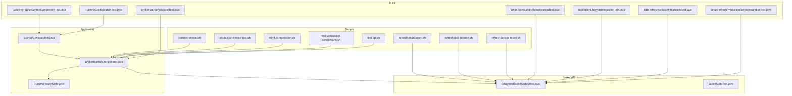
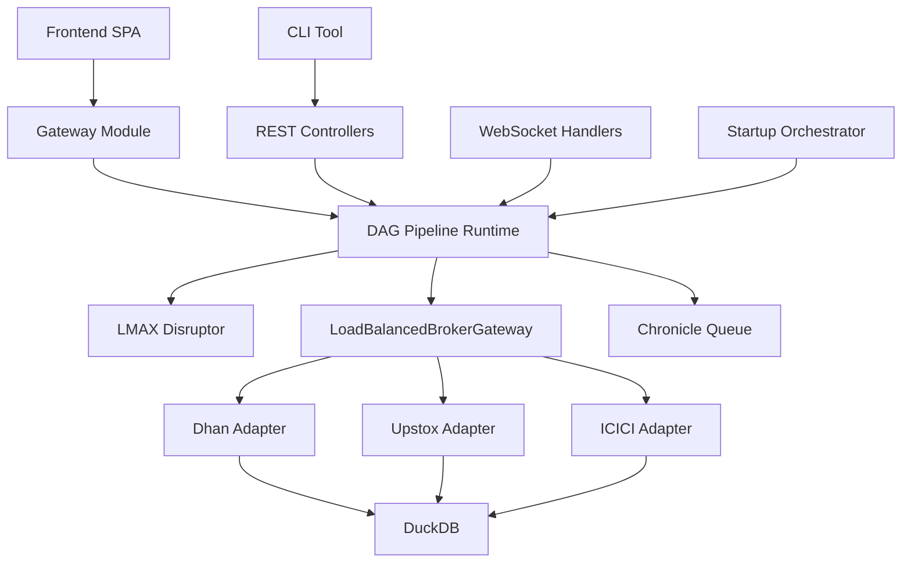
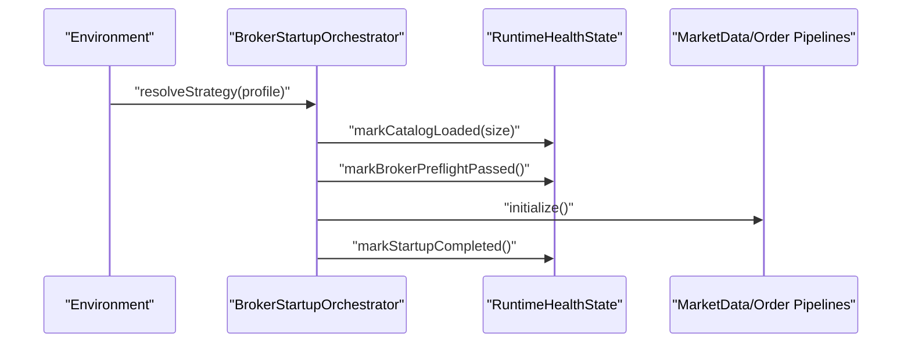
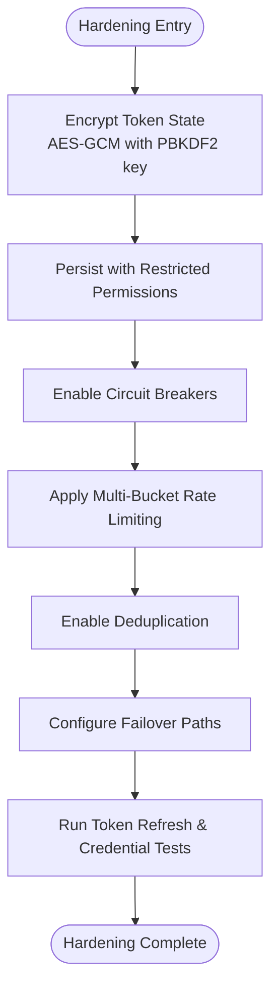
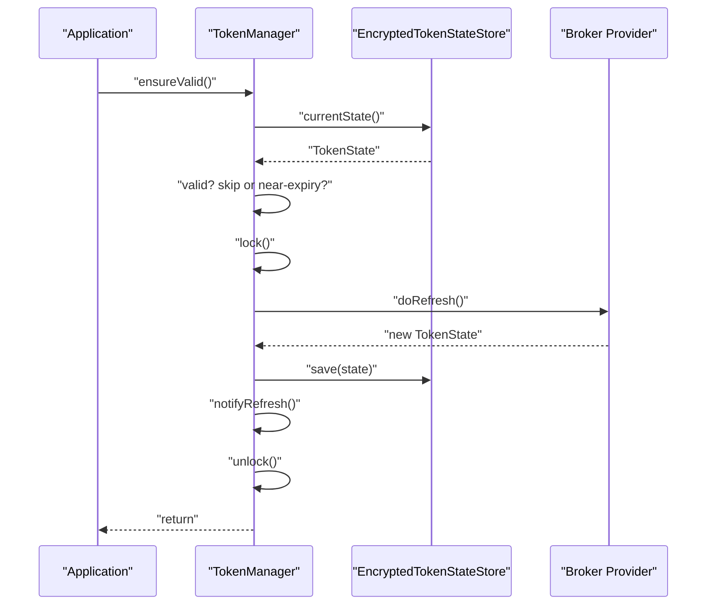
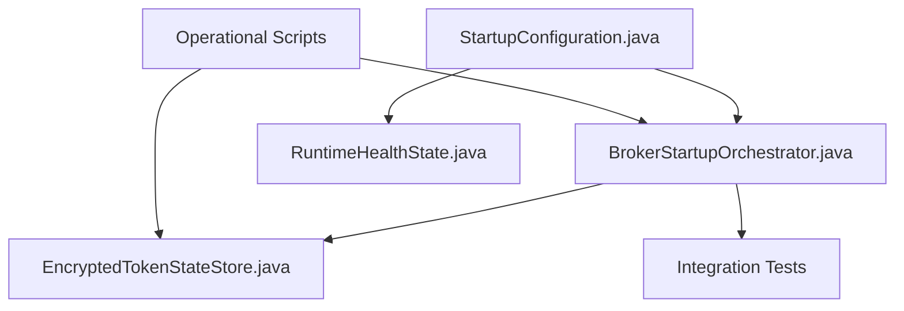

# Maintenance Procedures

<cite>
**Referenced Files in This Document**
- [runtime-mode-audit.md](file://docs/runtime-mode-audit.md)
- [BROKER_INTEGRATION_AUDIT_REPORT.md](file://docs/BROKER_INTEGRATION_AUDIT_REPORT.md)
- [PRODUCTION_HARDENING_PLAN_2026-06-06.md](file://docs/PRODUCTION_HARDENING_PLAN_2026-06-06.md)
- [StartupConfiguration.java](file://app/src/main/java/com/tradej/app/config/StartupConfiguration.java)
- [BrokerStartupOrchestrator.java](file://app/src/main/java/com/tradej/app/startup/BrokerStartupOrchestrator.java)
- [RuntimeHealthState.java](file://app/src/main/java/com/tradej/app/admin/RuntimeHealthState.java)
- [refresh-dhan-token.sh](file://scripts/refresh-dhan-token.sh)
- [refresh-icici-session.sh](file://scripts/refresh-icici-session.sh)
- [refresh-upstox-token.sh](file://scripts/refresh-upstox-token.sh)
- [console-smoke.sh](file://scripts/console-smoke.sh)
- [production-smoke-test.sh](file://scripts/production-smoke-test.sh)
- [run-full-regression.sh](file://scripts/run-full-regression.sh)
- [test-websocket-connections.sh](file://scripts/test-websocket-connections.sh)
- [test-api.sh](file://scripts/test-api.sh)
- [BrokerStartupValidatorTest.java](file://app/src/test/java/com/tradej/app/startup/BrokerStartupValidatorTest.java)
- [GatewayProfileContextComponentTest.java](file://app/src/test/java/com/tradej/app/config/GatewayProfileContextComponentTest.java)
- [RuntimeConfigurationTest.java](file://app/src/test/java/com/tradej/app/config/RuntimeConfigurationTest.java)
- [DhanTokenLifecycleIntegrationTest.java](file://app/src/test/java/com/tradej/app/integration/DhanTokenLifecycleIntegrationTest.java)
- [IciciTokenLifecycleIntegrationTest.java](file://app/src/test/java/com/tradej/app/integration/IciciTokenLifecycleIntegrationTest.java)
- [IciciRefreshSessionIntegrationTest.java](file://app/src/test/java/com/tradej/app/integration/IciciRefreshSessionIntegrationTest.java)
- [DhanRefreshProductionTokenIntegrationTest.java](file://app/src/test/java/com/tradej/app/integration/DhanRefreshProductionTokenIntegrationTest.java)
- [DhanKillSwitchIntegrationTest.java](file://app/src/test/java/com/tradej/app/integration/DhanKillSwitchIntegrationTest.java)
- [DhanRuntimeSmokeIntegrationTest.java](file://app/src/test/java/com/tradej/app/integration/DhanRuntimeSmokeIntegrationTest.java)
- [UpstoxOrderLifecycleIntegrationTest.java](file://app/src/test/java/com/tradej/app/integration/UpstoxOrderLifecycleIntegrationTest.java)
- [IciciOrderLifecycleIntegrationTest.java](file://app/src/test/java/com/tradej/app/integration/IciciOrderLifecycleIntegrationTest.java)
- [EncryptedTokenStateStore.java](file://broker/api/src/main/java/com/tradej/broker/api/auth/EncryptedTokenStateStore.java)
- [TokenStateTest.java](file://broker/api/src/test/java/com/tradej/broker/api/auth/TokenStateTest.java)
- [ARCHITECTURE.md](file://ARCHITECTURE.md)
</cite>

## Table of Contents
1. [Introduction](#introduction)
2. [Project Structure](#project-structure)
3. [Core Components](#core-components)
4. [Architecture Overview](#architecture-overview)
5. [Detailed Component Analysis](#detailed-component-analysis)
6. [Dependency Analysis](#dependency-analysis)
7. [Performance Considerations](#performance-considerations)
8. [Troubleshooting Guide](#troubleshooting-guide)
9. [Conclusion](#conclusion)
10. [Appendices](#appendices)

## Introduction
This document provides comprehensive maintenance procedures and operational best practices for the system. It explains the runtime mode audit process, system hardening procedures, and maintenance scheduling. It documents token refresh procedures for different brokers, system updates, and configuration changes. It also details startup validation processes, system initialization, and maintenance workflows. Practical examples of routine maintenance tasks, emergency procedures, and system recovery operations are included, along with production hardening plans, security updates, and performance optimization procedures. Guidelines for preventive maintenance, system health monitoring, and operational troubleshooting are provided.

## Project Structure
The maintenance-related functionality spans several modules:
- Application startup orchestration and runtime health tracking
- Broker integration and token lifecycle management
- Scripts for token refresh, smoke testing, and regression runs
- Integration tests validating runtime behavior and token lifecycle
- Architectural documentation supporting maintenance and hardening

**Diagram sources**
- [StartupConfiguration.java:33-74](file://app/src/main/java/com/tradej/app/config/StartupConfiguration.java#L33-L74)
- [BrokerStartupOrchestrator.java:83-109](file://app/src/main/java/com/tradej/app/startup/BrokerStartupOrchestrator.java#L83-L109)
- [RuntimeHealthState.java:1-37](file://app/src/main/java/com/tradej/app/admin/RuntimeHealthState.java#L1-L37)
- [EncryptedTokenStateStore.java:1106-1149](file://broker/api/src/main/java/com/tradej/broker/api/auth/EncryptedTokenStateStore.java#L1106-L1149)
- [TokenStateTest.java:1-39](file://broker/api/src/test/java/com/tradej/broker/api/auth/TokenStateTest.java#L1-L39)
- [refresh-dhan-token.sh](file://scripts/refresh-dhan-token.sh)
- [refresh-icici-session.sh](file://scripts/refresh-icici-session.sh)
- [refresh-upstox-token.sh](file://scripts/refresh-upstox-token.sh)
- [console-smoke.sh](file://scripts/console-smoke.sh)
- [production-smoke-test.sh](file://scripts/production-smoke-test.sh)
- [run-full-regression.sh](file://scripts/run-full-regression.sh)
- [test-websocket-connections.sh](file://scripts/test-websocket-connections.sh)
- [test-api.sh](file://scripts/test-api.sh)
- [DhanTokenLifecycleIntegrationTest.java](file://app/src/test/java/com/tradej/app/integration/DhanTokenLifecycleIntegrationTest.java)
- [IciciTokenLifecycleIntegrationTest.java](file://app/src/test/java/com/tradej/app/integration/IciciTokenLifecycleIntegrationTest.java)
- [IciciRefreshSessionIntegrationTest.java](file://app/src/test/java/com/tradej/app/integration/IciciRefreshSessionIntegrationTest.java)
- [DhanRefreshProductionTokenIntegrationTest.java](file://app/src/test/java/com/tradej/app/integration/DhanRefreshProductionTokenIntegrationTest.java)
- [BrokerStartupValidatorTest.java](file://app/src/test/java/com/tradej/app/startup/BrokerStartupValidatorTest.java)
- [GatewayProfileContextComponentTest.java](file://app/src/test/java/com/tradej/app/config/GatewayProfileContextComponentTest.java)
- [RuntimeConfigurationTest.java](file://app/src/test/java/com/tradej/app/config/RuntimeConfigurationTest.java)

**Section sources**
- [StartupConfiguration.java:33-74](file://app/src/main/java/com/tradej/app/config/StartupConfiguration.java#L33-L74)
- [BrokerStartupOrchestrator.java:83-109](file://app/src/main/java/com/tradej/app/startup/BrokerStartupOrchestrator.java#L83-L109)
- [RuntimeHealthState.java:1-37](file://app/src/main/java/com/tradej/app/admin/RuntimeHealthState.java#L1-L37)

## Core Components
- Startup orchestration and runtime health state:
  - StartupConfiguration wires runtime components and exposes RuntimeHealthState for tracking catalog load, broker preflight, and startup completion.
  - BrokerStartupOrchestrator coordinates startup across broker profiles and pipelines.
- Token lifecycle and secure storage:
  - EncryptedTokenStateStore persists token state securely with AES-GCM encryption and restricted file permissions.
  - TokenStateTest validates refresh recommendation logic under various lifespans and buffers.
- Operational scripts:
  - Token refresh scripts for Dhan, ICICI, and Upstox.
  - Smoke and regression scripts for console, production, and backend connectivity.
- Integration tests:
  - Validate token lifecycle, session refresh, kill switch behavior, and runtime smoke scenarios.

**Section sources**
- [StartupConfiguration.java:33-74](file://app/src/main/java/com/tradej/app/config/StartupConfiguration.java#L33-L74)
- [BrokerStartupOrchestrator.java:83-109](file://app/src/main/java/com/tradej/app/startup/BrokerStartupOrchestrator.java#L83-L109)
- [RuntimeHealthState.java:1-37](file://app/src/main/java/com/tradej/app/admin/RuntimeHealthState.java#L1-L37)
- [EncryptedTokenStateStore.java:1106-1149](file://broker/api/src/main/java/com/tradej/broker/api/auth/EncryptedTokenStateStore.java#L1106-L1149)
- [TokenStateTest.java:1-39](file://broker/api/src/test/java/com/tradej/broker/api/auth/TokenStateTest.java#L1-L39)

## Architecture Overview
The system architecture integrates client-facing layers with gateway, pipeline, event bus, broker adapters, and data stores. Maintenance procedures rely on health indicators, startup orchestrators, and robust token lifecycle management.

**Diagram sources**
- [ARCHITECTURE.md:1418-1544](file://ARCHITECTURE.md#L1418-L1544)

**Section sources**
- [ARCHITECTURE.md:1418-1544](file://ARCHITECTURE.md#L1418-L1544)

## Detailed Component Analysis

### Runtime Mode Audit Process
- Purpose: Validate runtime mode configurations and startup order across environments.
- Inputs: Environment profiles, broker transport profiles, and runtime properties.
- Outputs: Verified startup sequence, health state transitions, and readiness flags.
- Key steps:
  - Resolve broker transport profile and startup strategy.
  - Initialize broker capabilities and connections.
  - Track catalog load, broker preflight, and startup completion via RuntimeHealthState.
  - Gate pipelines and subsystems until health criteria are met.

**Diagram sources**
- [BrokerStartupOrchestrator.java:83-109](file://app/src/main/java/com/tradej/app/startup/BrokerStartupOrchestrator.java#L83-L109)
- [RuntimeHealthState.java:1-37](file://app/src/main/java/com/tradej/app/admin/RuntimeHealthState.java#L1-L37)

**Section sources**
- [BrokerStartupOrchestrator.java:83-109](file://app/src/main/java/com/tradej/app/startup/BrokerStartupOrchestrator.java#L83-L109)
- [RuntimeHealthState.java:1-37](file://app/src/main/java/com/tradej/app/admin/RuntimeHealthState.java#L1-L37)

### System Hardening Procedures
- Security hardening:
  - Token state persistence with AES-GCM encryption and restricted file permissions.
  - PBKDF2-derived keys for encryption key material.
- Resilience hardening:
  - Circuit breakers, rate limiters, and deduplication reduce overload and duplication.
  - Failover mechanisms for WebSocket multiplexing and order commands.
- Test coverage:
  - Token refresh validation across brokers, invalid credentials handling, and gateway/router isolation.

**Diagram sources**
- [EncryptedTokenStateStore.java:1106-1149](file://broker/api/src/main/java/com/tradej/broker/api/auth/EncryptedTokenStateStore.java#L1106-L1149)
- [PRODUCTION_HARDENING_PLAN_2026-06-06.md:134-177](file://docs/PRODUCTION_HARDENING_PLAN_2026-06-06.md#L134-L177)

**Section sources**
- [EncryptedTokenStateStore.java:1106-1149](file://broker/api/src/main/java/com/tradej/broker/api/auth/EncryptedTokenStateStore.java#L1106-L1149)
- [PRODUCTION_HARDENING_PLAN_2026-06-06.md:134-177](file://docs/PRODUCTION_HARDENING_PLAN_2026-06-06.md#L134-L177)

### Maintenance Scheduling
- Routine tasks:
  - Daily: console smoke tests and WebSocket connection checks.
  - Weekly: production smoke tests and regression runs.
  - Monthly: full regression suite and token lifecycle validation across brokers.
- Change windows:
  - Schedule maintenance during low-activity periods.
  - Use kill switch and preflight validations to minimize risk.
- Monitoring:
  - Track health flags and alert thresholds to trigger remediation.

**Section sources**
- [console-smoke.sh](file://scripts/console-smoke.sh)
- [production-smoke-test.sh](file://scripts/production-smoke-test.sh)
- [run-full-regression.sh](file://scripts/run-full-regression.sh)
- [test-websocket-connections.sh](file://scripts/test-websocket-connections.sh)

### Token Refresh Procedures
- General flow:
  - Ensure token validity with refresh buffer consideration.
  - Acquire lock to prevent concurrent refresh storms.
  - Refresh via broker provider and persist new state.
  - Notify dependents and release lock.
- Broker-specific scripts:
  - Dhan: refresh-dhan-token.sh
  - ICICI: refresh-icici-session.sh
  - Upstox: refresh-upstox-token.sh
- Integration tests:
  - Validate token lifecycle and session refresh behavior.

**Diagram sources**
- [BROKER_INTEGRATION_AUDIT_REPORT.md:127-145](file://docs/BROKER_INTEGRATION_AUDIT_REPORT.md#L127-L145)
- [EncryptedTokenStateStore.java:1106-1149](file://broker/api/src/main/java/com/tradej/broker/api/auth/EncryptedTokenStateStore.java#L1106-L1149)

**Section sources**
- [BROKER_INTEGRATION_AUDIT_REPORT.md:127-145](file://docs/BROKER_INTEGRATION_AUDIT_REPORT.md#L127-L145)
- [refresh-dhan-token.sh](file://scripts/refresh-dhan-token.sh)
- [refresh-icici-session.sh](file://scripts/refresh-icici-session.sh)
- [refresh-upstox-token.sh](file://scripts/refresh-upstox-token.sh)
- [DhanTokenLifecycleIntegrationTest.java](file://app/src/test/java/com/tradej/app/integration/DhanTokenLifecycleIntegrationTest.java)
- [IciciTokenLifecycleIntegrationTest.java](file://app/src/test/java/com/tradej/app/integration/IciciTokenLifecycleIntegrationTest.java)
- [IciciRefreshSessionIntegrationTest.java](file://app/src/test/java/com/tradej/app/integration/IciciRefreshSessionIntegrationTest.java)
- [DhanRefreshProductionTokenIntegrationTest.java](file://app/src/test/java/com/tradej/app/integration/DhanRefreshProductionTokenIntegrationTest.java)

### System Updates and Configuration Changes
- Update process:
  - Validate runtime mode and startup order before applying changes.
  - Use integration tests to confirm behavior after updates.
- Configuration:
  - Environment-specific profiles drive startup strategy and broker capabilities.
  - Health state flags gate subsystem initialization.

**Section sources**
- [GatewayProfileContextComponentTest.java](file://app/src/test/java/com/tradej/app/config/GatewayProfileContextComponentTest.java)
- [RuntimeConfigurationTest.java](file://app/src/test/java/com/tradej/app/config/RuntimeConfigurationTest.java)
- [BrokerStartupValidatorTest.java](file://app/src/test/java/com/tradej/app/startup/BrokerStartupValidatorTest.java)

### Startup Validation and Initialization
- Validation steps:
  - Catalog load verification and size tracking.
  - Broker preflight pass confirmation.
  - Startup completion flag set upon readiness.
- Orchestration:
  - BrokerStartupOrchestrator resolves profile and strategy, initializes components, and sets health state.

**Section sources**
- [RuntimeHealthState.java:1-37](file://app/src/main/java/com/tradej/app/admin/RuntimeHealthState.java#L1-L37)
- [BrokerStartupOrchestrator.java:83-109](file://app/src/main/java/com/tradej/app/startup/BrokerStartupOrchestrator.java#L83-L109)

### Maintenance Workflows
- Routine maintenance:
  - Daily: console smoke and WebSocket checks.
  - Weekly: production smoke and regression runs.
  - Monthly: full regression and token lifecycle validation.
- Emergency procedures:
  - Activate kill switch and isolate failing components.
  - Revert configuration changes and re-run preflight validation.
- Recovery operations:
  - Restart affected pipelines and reinitialize broker connections.
  - Rebuild position state and reconcile orders if needed.

**Section sources**
- [DhanKillSwitchIntegrationTest.java](file://app/src/test/java/com/tradej/app/integration/DhanKillSwitchIntegrationTest.java)
- [DhanRuntimeSmokeIntegrationTest.java](file://app/src/test/java/com/tradej/app/integration/DhanRuntimeSmokeIntegrationTest.java)
- [UpstoxOrderLifecycleIntegrationTest.java](file://app/src/test/java/com/tradej/app/integration/UpstoxOrderLifecycleIntegrationTest.java)
- [IciciOrderLifecycleIntegrationTest.java](file://app/src/test/java/com/tradej/app/integration/IciciOrderLifecycleIntegrationTest.java)

### Production Hardening Plan
- Focus areas:
  - Circuit breakers, deduplication, reconnect logic, and rate limiting.
  - Token refresh validation and invalid credentials handling.
  - Gateway/router isolation and multi-broker path coverage.
- Completion summary:
  - P0 findings verified fixed; unit tests pass; real data validation suite created.

**Section sources**
- [PRODUCTION_HARDENING_PLAN_2026-06-06.md:134-177](file://docs/PRODUCTION_HARDENING_PLAN_2026-06-06.md#L134-L177)

### Security Updates and Token Lifecycle
- Security measures:
  - Encrypted token state store with AES-GCM and PBKDF2-derived keys.
  - Restrictive file permissions on persisted state.
- Lifecycle logic:
  - TokenState determines validity and refresh recommendation based on issuance time, expiry, and buffer.
  - Integration tests assert behavior across normal and short-lived tokens.

**Section sources**
- [EncryptedTokenStateStore.java:1106-1149](file://broker/api/src/main/java/com/tradej/broker/api/auth/EncryptedTokenStateStore.java#L1106-L1149)
- [TokenStateTest.java:1-39](file://broker/api/src/test/java/com/tradej/broker/api/auth/TokenStateTest.java#L1-L39)

### Performance Optimization Procedures
- Event bus optimization:
  - LMAX Disruptor ring buffer with deduplication and backpressure-aware publishing.
- Pipeline optimization:
  - DAG pipeline runtime with node factories for scanning, strategy, candles, and portfolio nodes.
- Gateway optimization:
  - Load-balanced broker gateway with failover and capability registry.

**Section sources**
- [ARCHITECTURE.md:1418-1544](file://ARCHITECTURE.md#L1418-L1544)

## Dependency Analysis
The maintenance procedures depend on:
- StartupConfiguration wiring runtime components and exposing RuntimeHealthState.
- BrokerStartupOrchestrator coordinating startup and health state transitions.
- Token lifecycle services and encrypted state store for secure token management.
- Scripts and integration tests validating runtime behavior and token refresh.

**Diagram sources**
- [StartupConfiguration.java:33-74](file://app/src/main/java/com/tradej/app/config/StartupConfiguration.java#L33-L74)
- [BrokerStartupOrchestrator.java:83-109](file://app/src/main/java/com/tradej/app/startup/BrokerStartupOrchestrator.java#L83-L109)
- [RuntimeHealthState.java:1-37](file://app/src/main/java/com/tradej/app/admin/RuntimeHealthState.java#L1-L37)
- [EncryptedTokenStateStore.java:1106-1149](file://broker/api/src/main/java/com/tradej/broker/api/auth/EncryptedTokenStateStore.java#L1106-L1149)

**Section sources**
- [StartupConfiguration.java:33-74](file://app/src/main/java/com/tradej/app/config/StartupConfiguration.java#L33-L74)
- [BrokerStartupOrchestrator.java:83-109](file://app/src/main/java/com/tradej/app/startup/BrokerStartupOrchestrator.java#L83-L109)
- [RuntimeHealthState.java:1-37](file://app/src/main/java/com/tradej/app/admin/RuntimeHealthState.java#L1-L37)
- [EncryptedTokenStateStore.java:1106-1149](file://broker/api/src/main/java/com/tradej/broker/api/auth/EncryptedTokenStateStore.java#L1106-L1149)

## Performance Considerations
- Event bus throughput:
  - Use LMAX Disruptor for high-throughput, low-latency event processing.
  - Enable deduplication and backpressure-aware publishing to avoid overload.
- Pipeline efficiency:
  - Optimize DAG node factories and reuse shared components.
- Gateway isolation:
  - Per-transport queues and capability registries help isolate slow clients and manage broker load.

[No sources needed since this section provides general guidance]

## Troubleshooting Guide
- Health state tracking:
  - Monitor catalogLoaded, brokerPreflightPassed, and startupCompleted flags to identify initialization bottlenecks.
- Token lifecycle issues:
  - Validate refresh recommendation logic and ensure encrypted state store persists correctly.
- Script-based diagnostics:
  - Use console-smoke.sh, production-smoke-test.sh, test-websocket-connections.sh, and test-api.sh for quick checks.
- Integration tests:
  - Leverage token lifecycle and session refresh tests to pinpoint regressions.

**Section sources**
- [RuntimeHealthState.java:1-37](file://app/src/main/java/com/tradej/app/admin/RuntimeHealthState.java#L1-L37)
- [TokenStateTest.java:1-39](file://broker/api/src/test/java/com/tradej/broker/api/auth/TokenStateTest.java#L1-L39)
- [console-smoke.sh](file://scripts/console-smoke.sh)
- [production-smoke-test.sh](file://scripts/production-smoke-test.sh)
- [test-websocket-connections.sh](file://scripts/test-websocket-connections.sh)
- [test-api.sh](file://scripts/test-api.sh)

## Conclusion
This document outlined comprehensive maintenance procedures and operational best practices, including runtime mode audits, system hardening, maintenance scheduling, token refresh procedures, system updates, and configuration changes. It detailed startup validation, initialization workflows, and practical examples for routine maintenance, emergency procedures, and recovery operations. The production hardening plan, security updates, and performance optimization procedures were summarized with references to architectural and test artifacts.

[No sources needed since this section summarizes without analyzing specific files]

## Appendices
- Operational scripts:
  - Token refresh: refresh-dhan-token.sh, refresh-icici-session.sh, refresh-upstox-token.sh
  - Smoke and regression: console-smoke.sh, production-smoke-test.sh, run-full-regression.sh
  - Connectivity: test-websocket-connections.sh, test-api.sh
- Integration tests:
  - Token lifecycle and session refresh validations
  - Kill switch and runtime smoke tests
  - Order lifecycle tests for Upstox and ICICI

[No sources needed since this section aggregates references already cited above]