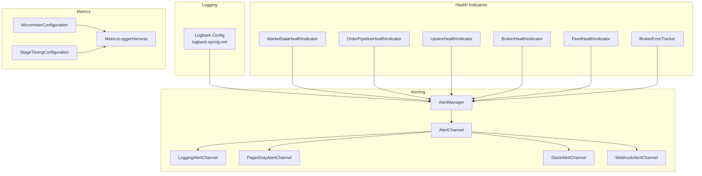
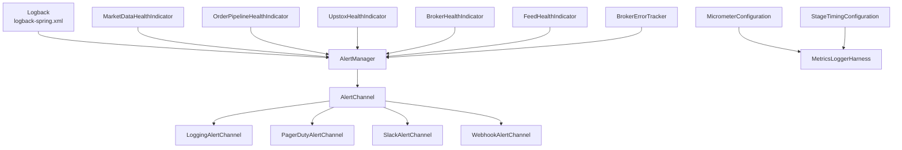
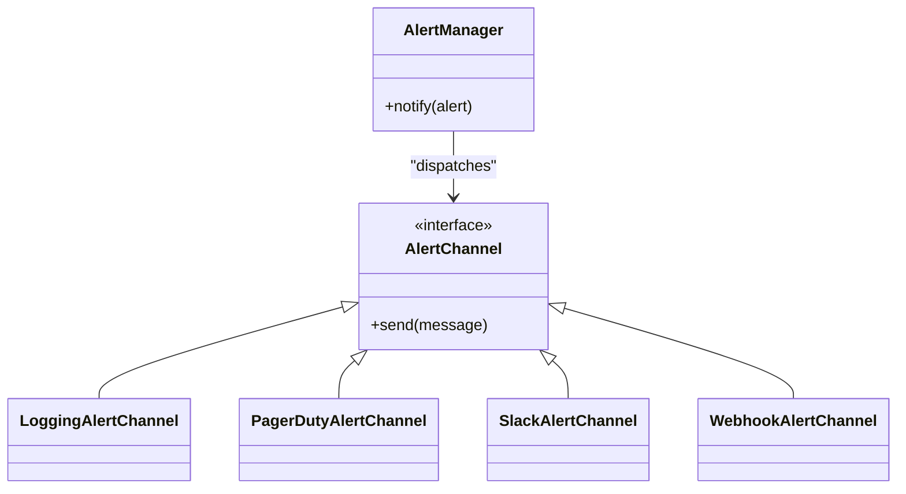
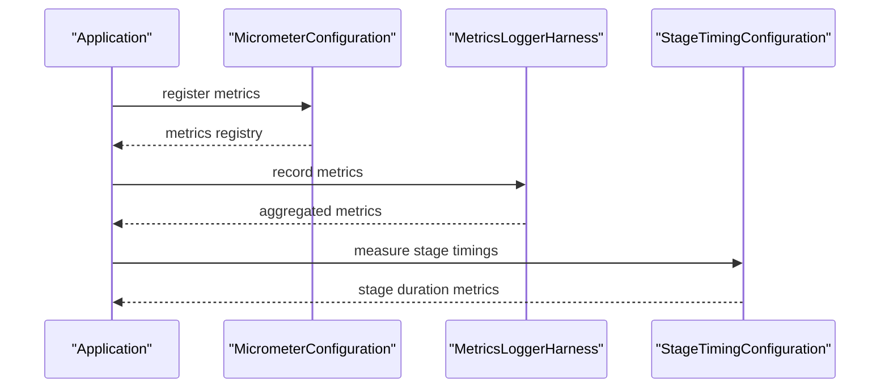
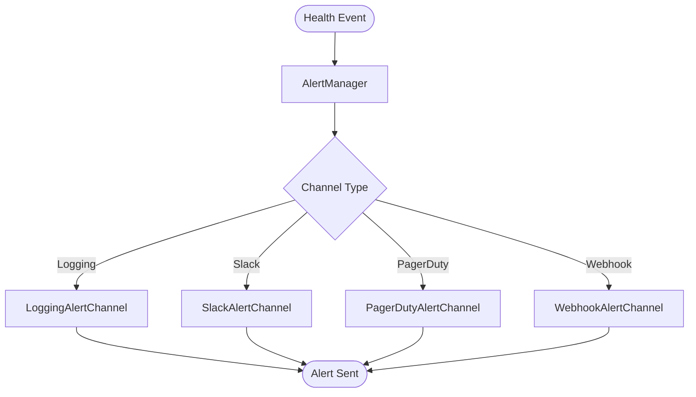
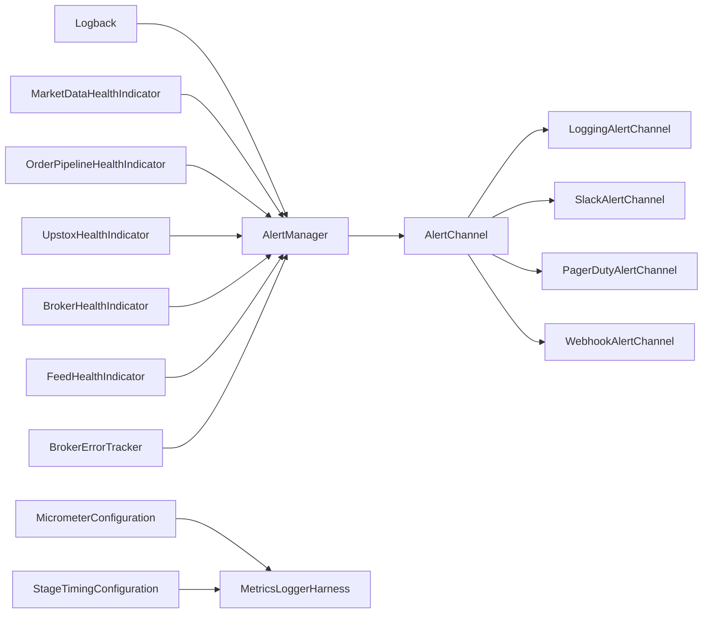

# Monitoring and Logging

<cite>
**Referenced Files in This Document**
- [logback-spring.xml](file://app/src/main/resources/logback-spring.xml)
- [application.yml](file://app/src/main/resources/application.yml)
- [application-dev.yml](file://app/src/main/resources/application-dev.yml)
- [application-prod.yml](file://app/src/main/resources/application-prod.yml)
- [AlertManager.java](file://app/src/main/java/com/tradej/app/health/AlertManager.java)
- [AlertChannel.java](file://app/src/main/java/com/tradej/app/health/AlertChannel.java)
- [LoggingAlertChannel.java](file://app/src/main/java/com/tradej/app/health/LoggingAlertChannel.java)
- [PagerDutyAlertChannel.java](file://app/src/main/java/com/tradej/app/health/PagerDutyAlertChannel.java)
- [SlackAlertChannel.java](file://app/src/main/java/com/tradej/app/health/SlackAlertChannel.java)
- [WebhookAlertChannel.java](file://app/src/main/java/com/tradej/app/health/WebhookAlertChannel.java)
- [MarketDataHealthIndicator.java](file://app/src/main/java/com/tradej/app/health/MarketDataHealthIndicator.java)
- [OrderPipelineHealthIndicator.java](file://app/src/main/java/com/tradej/app/health/OrderPipelineHealthIndicator.java)
- [UpstoxHealthIndicator.java](file://app/src/main/java/com/tradej/app/health/UpstoxHealthIndicator.java)
- [BrokerHealthIndicator.java](file://app/src/main/java/com/tradej/app/health/BrokerHealthIndicator.java)
- [FeedHealthIndicator.java](file://app/src/main/java/com/tradej/app/health/FeedHealthIndicator.java)
- [BrokerErrorTracker.java](file://app/src/main/java/com/tradej/app/health/BrokerErrorTracker.java)
- [MetricsLoggerHarness.java](file://app/src/main/java/com/tradej/app/metrics/MetricsLoggerHarness.java)
- [MicrometerConfiguration.java](file://app/src/main/java/com/tradej/app/metrics/MicrometerConfiguration.java)
- [StageTimingConfiguration.java](file://app/src/main/java/com/tradej/app/metrics/StageTimingConfiguration.java)
- [soak-test-metrics.log](file://app/build/soak-test-metrics.log)
- [health.json](file://health.json)
</cite>

## Table of Contents
1. [Introduction](#introduction)
2. [Project Structure](#project-structure)
3. [Core Components](#core-components)
4. [Architecture Overview](#architecture-overview)
5. [Detailed Component Analysis](#detailed-component-analysis)
6. [Dependency Analysis](#dependency-analysis)
7. [Performance Considerations](#performance-considerations)
8. [Troubleshooting Guide](#troubleshooting-guide)
9. [Conclusion](#conclusion)
10. [Appendices](#appendices)

## Introduction
This document explains the monitoring and logging systems in the project, focusing on Logback configuration, log levels, and structured logging setup. It also documents the health indicator system, metrics collection via Micrometer, and observability reporting. Practical examples demonstrate log analysis, health check interpretation, and system monitoring workflows. Finally, it provides guidelines for setting up monitoring infrastructure, configuring alerts, and maintaining system health.

## Project Structure
The monitoring and logging stack spans configuration files, Java packages for health indicators and metrics, and alert channels. Key areas:
- Logging: Logback configuration under application resources
- Health indicators: Multiple broker and pipeline health checks
- Metrics: Micrometer integration and stage timing configuration
- Alerts: Pluggable alert channels (logging, Slack, PagerDuty, webhook)
- Observability artifacts: Soak test metrics logs and health JSON

**Diagram sources**
- [logback-spring.xml:1-200](file://app/src/main/resources/logback-spring.xml#L1-L200)
- [AlertManager.java:1-200](file://app/src/main/java/com/tradej/app/health/AlertManager.java#L1-L200)
- [AlertChannel.java:1-120](file://app/src/main/java/com/tradej/app/health/AlertChannel.java#L1-L120)
- [LoggingAlertChannel.java:1-120](file://app/src/main/java/com/tradej/app/health/LoggingAlertChannel.java#L1-L120)
- [PagerDutyAlertChannel.java:1-120](file://app/src/main/java/com/tradej/app/health/PagerDutyAlertChannel.java#L1-L120)
- [SlackAlertChannel.java:1-120](file://app/src/main/java/com/tradej/app/health/SlackAlertChannel.java#L1-L120)
- [WebhookAlertChannel.java:1-120](file://app/src/main/java/com/tradej/app/health/WebhookAlertChannel.java#L1-L120)
- [MarketDataHealthIndicator.java:1-200](file://app/src/main/java/com/tradej/app/health/MarketDataHealthIndicator.java#L1-L200)
- [OrderPipelineHealthIndicator.java:1-200](file://app/src/main/java/com/tradej/app/health/OrderPipelineHealthIndicator.java#L1-L200)
- [UpstoxHealthIndicator.java:1-200](file://app/src/main/java/com/tradej/app/health/UpstoxHealthIndicator.java#L1-L200)
- [BrokerHealthIndicator.java:1-200](file://app/src/main/java/com/tradej/app/health/BrokerHealthIndicator.java#L1-L200)
- [FeedHealthIndicator.java:1-200](file://app/src/main/java/com/tradej/app/health/FeedHealthIndicator.java#L1-L200)
- [BrokerErrorTracker.java:1-200](file://app/src/main/java/com/tradej/app/health/BrokerErrorTracker.java#L1-L200)
- [MetricsLoggerHarness.java:1-200](file://app/src/main/java/com/tradej/app/metrics/MetricsLoggerHarness.java#L1-L200)
- [MicrometerConfiguration.java:1-200](file://app/src/main/java/com/tradej/app/metrics/MicrometerConfiguration.java#L1-L200)
- [StageTimingConfiguration.java:1-200](file://app/src/main/java/com/tradej/app/metrics/StageTimingConfiguration.java#L1-L200)

**Section sources**
- [logback-spring.xml:1-200](file://app/src/main/resources/logback-spring.xml#L1-L200)
- [application.yml:1-200](file://app/src/main/resources/application.yml#L1-L200)

## Core Components
- Logback configuration defines appenders, loggers, and formatting for structured logging and environment-specific behavior.
- Health indicators monitor market data feeds, order pipeline, broker connectivity, and feed availability, reporting composite health status.
- Alert channels deliver notifications via logging, Slack, PagerDuty, or webhooks.
- Metrics collection integrates Micrometer for application metrics and stage timing for pipeline stages.
- Observability artifacts include soak test metrics logs and health JSON for diagnostics.

**Section sources**
- [logback-spring.xml:1-200](file://app/src/main/resources/logback-spring.xml#L1-L200)
- [AlertManager.java:1-200](file://app/src/main/java/com/tradej/app/health/AlertManager.java#L1-L200)
- [MetricsLoggerHarness.java:1-200](file://app/src/main/java/com/tradej/app/metrics/MetricsLoggerHarness.java#L1-L200)
- [MicrometerConfiguration.java:1-200](file://app/src/main/java/com/tradej/app/metrics/MicrometerConfiguration.java#L1-L200)
- [StageTimingConfiguration.java:1-200](file://app/src/main/java/com/tradej/app/metrics/StageTimingConfiguration.java#L1-L200)
- [soak-test-metrics.log:1-200](file://app/build/soak-test-metrics.log#L1-L200)
- [health.json:1-200](file://health.json#L1-L200)

## Architecture Overview
The monitoring and logging architecture connects Logback to health indicators and metrics, with alert channels triggered by AlertManager. Observability artifacts support post-run analysis.

**Diagram sources**
- [logback-spring.xml:1-200](file://app/src/main/resources/logback-spring.xml#L1-L200)
- [AlertManager.java:1-200](file://app/src/main/java/com/tradej/app/health/AlertManager.java#L1-L200)
- [AlertChannel.java:1-120](file://app/src/main/java/com/tradej/app/health/AlertChannel.java#L1-L120)
- [LoggingAlertChannel.java:1-120](file://app/src/main/java/com/tradej/app/health/LoggingAlertChannel.java#L1-L120)
- [PagerDutyAlertChannel.java:1-120](file://app/src/main/java/com/tradej/app/health/PagerDutyAlertChannel.java#L1-L120)
- [SlackAlertChannel.java:1-120](file://app/src/main/java/com/tradej/app/health/SlackAlertChannel.java#L1-L120)
- [WebhookAlertChannel.java:1-120](file://app/src/main/java/com/tradej/app/health/WebhookAlertChannel.java#L1-L120)
- [MarketDataHealthIndicator.java:1-200](file://app/src/main/java/com/tradej/app/health/MarketDataHealthIndicator.java#L1-L200)
- [OrderPipelineHealthIndicator.java:1-200](file://app/src/main/java/com/tradej/app/health/OrderPipelineHealthIndicator.java#L1-L200)
- [UpstoxHealthIndicator.java:1-200](file://app/src/main/java/com/tradej/app/health/UpstoxHealthIndicator.java#L1-L200)
- [BrokerHealthIndicator.java:1-200](file://app/src/main/java/com/tradej/app/health/BrokerHealthIndicator.java#L1-L200)
- [FeedHealthIndicator.java:1-200](file://app/src/main/java/com/tradej/app/health/FeedHealthIndicator.java#L1-L200)
- [BrokerErrorTracker.java:1-200](file://app/src/main/java/com/tradej/app/health/BrokerErrorTracker.java#L1-L200)
- [MetricsLoggerHarness.java:1-200](file://app/src/main/java/com/tradej/app/metrics/MetricsLoggerHarness.java#L1-L200)
- [MicrometerConfiguration.java:1-200](file://app/src/main/java/com/tradej/app/metrics/MicrometerConfiguration.java#L1-L200)
- [StageTimingConfiguration.java:1-200](file://app/src/main/java/com/tradej/app/metrics/StageTimingConfiguration.java#L1-L200)

## Detailed Component Analysis

### Logback Configuration and Structured Logging
- Appenders define output destinations and layouts for logs.
- Loggers configure per-package or per-class logging levels.
- Environment-specific profiles control logging behavior for development, production, and specialized modes.
- Structured logging supports machine parsing and downstream enrichment.

Practical usage:
- Adjust root and package loggers to increase verbosity during investigations.
- Use environment-specific application YAML files to toggle log levels and output formats.
- Verify appender configuration to ensure logs reach intended sinks (console, files, or external systems).

**Section sources**
- [logback-spring.xml:1-200](file://app/src/main/resources/logback-spring.xml#L1-L200)
- [application.yml:1-200](file://app/src/main/resources/application.yml#L1-L200)
- [application-dev.yml:1-200](file://app/src/main/resources/application-dev.yml#L1-L200)
- [application-prod.yml:1-200](file://app/src/main/resources/application-prod.yml#L1-L200)

### Health Indicator System
Health indicators assess subsystem reliability and expose composite health status:
- MarketDataHealthIndicator monitors market data feed availability and latency.
- OrderPipelineHealthIndicator tracks order processing throughput and backpressure.
- UpstoxHealthIndicator validates Upstox broker connectivity and response times.
- BrokerHealthIndicator aggregates broker-related health signals.
- FeedHealthIndicator evaluates feed quality and subscription status.
- BrokerErrorTracker records and exposes broker-side error rates and patterns.

AlertManager coordinates health events and triggers appropriate alert channels.

**Diagram sources**
- [AlertManager.java:1-200](file://app/src/main/java/com/tradej/app/health/AlertManager.java#L1-L200)
- [AlertChannel.java:1-120](file://app/src/main/java/com/tradej/app/health/AlertChannel.java#L1-L120)
- [LoggingAlertChannel.java:1-120](file://app/src/main/java/com/tradej/app/health/LoggingAlertChannel.java#L1-L120)
- [PagerDutyAlertChannel.java:1-120](file://app/src/main/java/com/tradej/app/health/PagerDutyAlertChannel.java#L1-L120)
- [SlackAlertChannel.java:1-120](file://app/src/main/java/com/tradej/app/health/SlackAlertChannel.java#L1-L120)
- [WebhookAlertChannel.java:1-120](file://app/src/main/java/com/tradej/app/health/WebhookAlertChannel.java#L1-L120)

Interpretation examples:
- If MarketDataHealthIndicator reports degraded, inspect feed latency and subscription counts.
- If OrderPipelineHealthIndicator indicates backpressure, review stage timings and throughput metrics.
- If UpstoxHealthIndicator fails, validate credentials and network connectivity.

**Section sources**
- [MarketDataHealthIndicator.java:1-200](file://app/src/main/java/com/tradej/app/health/MarketDataHealthIndicator.java#L1-L200)
- [OrderPipelineHealthIndicator.java:1-200](file://app/src/main/java/com/tradej/app/health/OrderPipelineHealthIndicator.java#L1-L200)
- [UpstoxHealthIndicator.java:1-200](file://app/src/main/java/com/tradej/app/health/UpstoxHealthIndicator.java#L1-L200)
- [BrokerHealthIndicator.java:1-200](file://app/src/main/java/com/tradej/app/health/BrokerHealthIndicator.java#L1-L200)
- [FeedHealthIndicator.java:1-200](file://app/src/main/java/com/tradej/app/health/FeedHealthIndicator.java#L1-L200)
- [BrokerErrorTracker.java:1-200](file://app/src/main/java/com/tradej/app/health/BrokerErrorTracker.java#L1-L200)
- [AlertManager.java:1-200](file://app/src/main/java/com/tradej/app/health/AlertManager.java#L1-L200)

### Metrics Collection and Observability Reporting
MicrometerConfiguration registers application metrics with a registry, enabling collection and export. MetricsLoggerHarness centralizes metric logging and aggregation. StageTimingConfiguration measures pipeline stage durations and bottlenecks.

**Diagram sources**
- [MicrometerConfiguration.java:1-200](file://app/src/main/java/com/tradej/app/metrics/MicrometerConfiguration.java#L1-L200)
- [MetricsLoggerHarness.java:1-200](file://app/src/main/java/com/tradej/app/metrics/MetricsLoggerHarness.java#L1-L200)
- [StageTimingConfiguration.java:1-200](file://app/src/main/java/com/tradej/app/metrics/StageTimingConfiguration.java#L1-L200)

Observability artifacts:
- Soak test metrics logs capture long-running session performance and anomalies.
- Health JSON provides structured health snapshots for diagnostics and automation.

**Section sources**
- [MicrometerConfiguration.java:1-200](file://app/src/main/java/com/tradej/app/metrics/MicrometerConfiguration.java#L1-L200)
- [MetricsLoggerHarness.java:1-200](file://app/src/main/java/com/tradej/app/metrics/MetricsLoggerHarness.java#L1-L200)
- [StageTimingConfiguration.java:1-200](file://app/src/main/java/com/tradej/app/metrics/StageTimingConfiguration.java#L1-L200)
- [soak-test-metrics.log:1-200](file://app/build/soak-test-metrics.log#L1-L200)
- [health.json:1-200](file://health.json#L1-L200)

### Alerting Mechanisms
AlertManager routes health events to configured channels. Channels include:
- LoggingAlertChannel: emits alerts to application logs
- SlackAlertChannel: posts alerts to Slack
- PagerDutyAlertChannel: escalates incidents via PagerDuty
- WebhookAlertChannel: forwards alerts to external systems

**Diagram sources**
- [AlertManager.java:1-200](file://app/src/main/java/com/tradej/app/health/AlertManager.java#L1-L200)
- [AlertChannel.java:1-120](file://app/src/main/java/com/tradej/app/health/AlertChannel.java#L1-L120)
- [LoggingAlertChannel.java:1-120](file://app/src/main/java/com/tradej/app/health/LoggingAlertChannel.java#L1-L120)
- [SlackAlertChannel.java:1-120](file://app/src/main/java/com/tradej/app/health/SlackAlertChannel.java#L1-L120)
- [PagerDutyAlertChannel.java:1-120](file://app/src/main/java/com/tradej/app/health/PagerDutyAlertChannel.java#L1-L120)
- [WebhookAlertChannel.java:1-120](file://app/src/main/java/com/tradej/app/health/WebhookAlertChannel.java#L1-L120)

**Section sources**
- [AlertManager.java:1-200](file://app/src/main/java/com/tradej/app/health/AlertManager.java#L1-L200)
- [AlertChannel.java:1-120](file://app/src/main/java/com/tradej/app/health/AlertChannel.java#L1-L120)
- [LoggingAlertChannel.java:1-120](file://app/src/main/java/com/tradej/app/health/LoggingAlertChannel.java#L1-L120)
- [SlackAlertChannel.java:1-120](file://app/src/main/java/com/tradej/app/health/SlackAlertChannel.java#L1-L120)
- [PagerDutyAlertChannel.java:1-120](file://app/src/main/java/com/tradej/app/health/PagerDutyAlertChannel.java#L1-L120)
- [WebhookAlertChannel.java:1-120](file://app/src/main/java/com/tradej/app/health/WebhookAlertChannel.java#L1-L120)

## Dependency Analysis
The system exhibits low coupling between logging, health, metrics, and alerting modules. Health indicators depend on AlertManager for escalation, while metrics rely on MicrometerConfiguration and StageTimingConfiguration for collection and timing.

**Diagram sources**
- [logback-spring.xml:1-200](file://app/src/main/resources/logback-spring.xml#L1-L200)
- [AlertManager.java:1-200](file://app/src/main/java/com/tradej/app/health/AlertManager.java#L1-L200)
- [AlertChannel.java:1-120](file://app/src/main/java/com/tradej/app/health/AlertChannel.java#L1-L120)
- [LoggingAlertChannel.java:1-120](file://app/src/main/java/com/tradej/app/health/LoggingAlertChannel.java#L1-L120)
- [SlackAlertChannel.java:1-120](file://app/src/main/java/com/tradej/app/health/SlackAlertChannel.java#L1-L120)
- [PagerDutyAlertChannel.java:1-120](file://app/src/main/java/com/tradej/app/health/PagerDutyAlertChannel.java#L1-L120)
- [WebhookAlertChannel.java:1-120](file://app/src/main/java/com/tradej/app/health/WebhookAlertChannel.java#L1-L120)
- [MarketDataHealthIndicator.java:1-200](file://app/src/main/java/com/tradej/app/health/MarketDataHealthIndicator.java#L1-L200)
- [OrderPipelineHealthIndicator.java:1-200](file://app/src/main/java/com/tradej/app/health/OrderPipelineHealthIndicator.java#L1-L200)
- [UpstoxHealthIndicator.java:1-200](file://app/src/main/java/com/tradej/app/health/UpstoxHealthIndicator.java#L1-L200)
- [BrokerHealthIndicator.java:1-200](file://app/src/main/java/com/tradej/app/health/BrokerHealthIndicator.java#L1-L200)
- [FeedHealthIndicator.java:1-200](file://app/src/main/java/com/tradej/app/health/FeedHealthIndicator.java#L1-L200)
- [BrokerErrorTracker.java:1-200](file://app/src/main/java/com/tradej/app/health/BrokerErrorTracker.java#L1-L200)
- [MetricsLoggerHarness.java:1-200](file://app/src/main/java/com/tradej/app/metrics/MetricsLoggerHarness.java#L1-L200)
- [MicrometerConfiguration.java:1-200](file://app/src/main/java/com/tradej/app/metrics/MicrometerConfiguration.java#L1-L200)
- [StageTimingConfiguration.java:1-200](file://app/src/main/java/com/tradej/app/metrics/StageTimingConfiguration.java#L1-L200)

**Section sources**
- [AlertManager.java:1-200](file://app/src/main/java/com/tradej/app/health/AlertManager.java#L1-L200)
- [MetricsLoggerHarness.java:1-200](file://app/src/main/java/com/tradej/app/metrics/MetricsLoggerHarness.java#L1-L200)
- [MicrometerConfiguration.java:1-200](file://app/src/main/java/com/tradej/app/metrics/MicrometerConfiguration.java#L1-L200)
- [StageTimingConfiguration.java:1-200](file://app/src/main/java/com/tradej/app/metrics/StageTimingConfiguration.java#L1-L200)

## Performance Considerations
- Keep log levels appropriate for environment to avoid excessive I/O overhead.
- Use structured logging to enable efficient parsing and filtering.
- Monitor health indicator thresholds to detect performance regressions early.
- Track stage timings to identify pipeline bottlenecks and optimize hot paths.
- Export metrics via Micrometer to external monitoring systems for trend analysis.

[No sources needed since this section provides general guidance]

## Troubleshooting Guide
Common scenarios and actions:
- Excessive warnings or errors: Increase log level temporarily and filter by logger name to isolate the source.
- Health degradation: Inspect the corresponding health indicator logs and metrics; correlate with upstream broker connectivity.
- Alert storms: Review AlertManager configuration and channel delivery; adjust thresholds or deduplication.
- Soak test anomalies: Analyze soak-test metrics logs for spikes in latency or error rates; compare against baseline runs.
- Health snapshot issues: Validate health JSON formatting and completeness; ensure all subsystems are reporting.

**Section sources**
- [logback-spring.xml:1-200](file://app/src/main/resources/logback-spring.xml#L1-L200)
- [AlertManager.java:1-200](file://app/src/main/java/com/tradej/app/health/AlertManager.java#L1-L200)
- [soak-test-metrics.log:1-200](file://app/build/soak-test-metrics.log#L1-L200)
- [health.json:1-200](file://health.json#L1-L200)

## Conclusion
The project’s monitoring and logging system combines Logback for structured logging, health indicators for subsystem visibility, Micrometer for metrics, and pluggable alert channels for incident response. Observability artifacts support continuous improvement and rapid incident resolution. Adopting the recommended practices ensures reliable operations across environments.

[No sources needed since this section summarizes without analyzing specific files]

## Appendices
- Practical examples:
  - Log analysis: Filter by logger name and correlation ID; examine structured fields for timestamps and severity.
  - Health check interpretation: Compare current health status against baselines; drill down into failing components.
  - System monitoring: Set up dashboards for key metrics (latency, error rates, throughput); configure alerts for threshold breaches.
- Setup guidelines:
  - Configure Logback appenders and log levels per environment.
  - Define health indicator thresholds aligned with operational SLOs.
  - Integrate Micrometer with your metrics backend and set up exporters.
  - Provision alert channels with appropriate credentials and routing rules.
- Maintenance tips:
  - Periodically review log retention and rotation policies.
  - Audit health indicator coverage and update thresholds as system evolves.
  - Validate alert delivery and test escalation procedures regularly.

[No sources needed since this section provides general guidance]