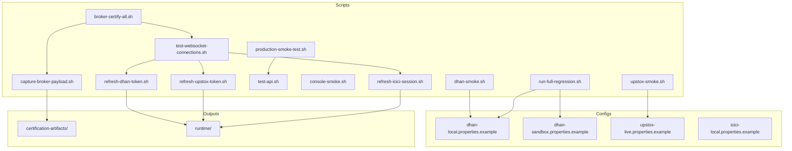
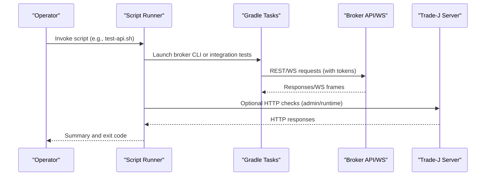
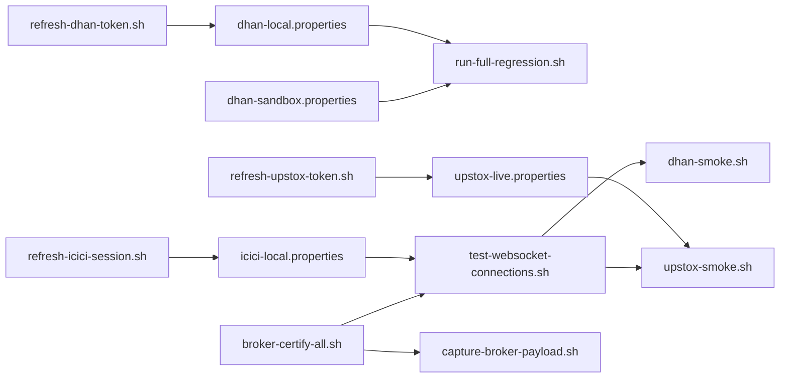

# Operational Scripts

<cite>
**Referenced Files in This Document**
- [production-smoke-test.sh](file://scripts/production-smoke-test.sh)
- [dhan-smoke.sh](file://scripts/dhan-smoke.sh)
- [upstox-smoke.sh](file://scripts/upstox-smoke.sh)
- [run-full-regression.sh](file://scripts/run-full-regression.sh)
- [test-api.sh](file://scripts/test-api.sh)
- [test-websocket-connections.sh](file://scripts/test-websocket-connections.sh)
- [console-smoke.sh](file://scripts/console-smoke.sh)
- [broker-certify-all.sh](file://scripts/broker-certify-all.sh)
- [refresh-dhan-token.sh](file://scripts/refresh-dhan-token.sh)
- [refresh-upstox-token.sh](file://scripts/refresh-upstox-token.sh)
- [refresh-icici-session.sh](file://scripts/refresh-icici-session.sh)
- [capture-broker-payload.sh](file://scripts/capture-broker-payload.sh)
- [dhan-local.properties.example](file://config/dhan-local.properties.example)
- [dhan-sandbox.properties.example](file://config/dhan-sandbox.properties.example)
- [upstox-live.properties.example](file://config/upstox-live.properties.example)
- [icici-local.properties.example](file://config/icici-local.properties.example)
</cite>

## Table of Contents
1. [Introduction](#introduction)
2. [Project Structure](#project-structure)
3. [Core Components](#core-components)
4. [Architecture Overview](#architecture-overview)
5. [Detailed Component Analysis](#detailed-component-analysis)
6. [Dependency Analysis](#dependency-analysis)
7. [Performance Considerations](#performance-considerations)
8. [Troubleshooting Guide](#troubleshooting-guide)
9. [Conclusion](#conclusion)
10. [Appendices](#appendices)

## Introduction
This document explains the operational scripts and automation tools used to verify Trade-J’s production readiness, broker integrations, API surfaces, WebSocket connectivity, and regression testing. It covers purpose, parameters, environment prerequisites, execution procedures, CI/CD integration patterns, and maintenance guidelines. Practical examples show how to run scripts across development, staging, and production-like environments, interpret results, and troubleshoot common failures.

## Project Structure
Operational automation is primarily located under the scripts directory. Supporting configuration files reside under config/, and token/session state files are stored under runtime/. Broker certification and payload capture artifacts are written to certification-artifacts/.

**Diagram sources**
- [production-smoke-test.sh:1-21](file://scripts/production-smoke-test.sh#L1-L21)
- [dhan-smoke.sh:1-181](file://scripts/dhan-smoke.sh#L1-L181)
- [upstox-smoke.sh:1-280](file://scripts/upstox-smoke.sh#L1-L280)
- [run-full-regression.sh:1-39](file://scripts/run-full-regression.sh#L1-L39)
- [test-api.sh:1-197](file://scripts/test-api.sh#L1-L197)
- [test-websocket-connections.sh:1-321](file://scripts/test-websocket-connections.sh#L1-L321)
- [console-smoke.sh:1-38](file://scripts/console-smoke.sh#L1-L38)
- [broker-certify-all.sh:1-225](file://scripts/broker-certify-all.sh#L1-L225)
- [refresh-dhan-token.sh:1-75](file://scripts/refresh-dhan-token.sh#L1-L75)
- [refresh-upstox-token.sh:1-91](file://scripts/refresh-upstox-token.sh#L1-L91)
- [refresh-icici-session.sh:1-61](file://scripts/refresh-icici-session.sh#L1-L61)
- [capture-broker-payload.sh:1-119](file://scripts/capture-broker-payload.sh#L1-L119)
- [dhan-local.properties.example:1-23](file://config/dhan-local.properties.example#L1-L23)
- [dhan-sandbox.properties.example:1-10](file://config/dhan-sandbox.properties.example#L1-L10)
- [upstox-live.properties.example:1-9](file://config/upstox-live.properties.example#L1-L9)
- [icici-local.properties.example:1-16](file://config/icici-local.properties.example#L1-L16)

**Section sources**
- [production-smoke-test.sh:1-21](file://scripts/production-smoke-test.sh#L1-L21)
- [dhan-smoke.sh:1-181](file://scripts/dhan-smoke.sh#L1-L181)
- [upstox-smoke.sh:1-280](file://scripts/upstox-smoke.sh#L1-L280)
- [run-full-regression.sh:1-39](file://scripts/run-full-regression.sh#L1-L39)
- [test-api.sh:1-197](file://scripts/test-api.sh#L1-L197)
- [test-websocket-connections.sh:1-321](file://scripts/test-websocket-connections.sh#L1-L321)
- [console-smoke.sh:1-38](file://scripts/console-smoke.sh#L1-L38)
- [broker-certify-all.sh:1-225](file://scripts/broker-certify-all.sh#L1-L225)
- [refresh-dhan-token.sh:1-75](file://scripts/refresh-dhan-token.sh#L1-L75)
- [refresh-upstox-token.sh:1-91](file://scripts/refresh-upstox-token.sh#L1-L91)
- [refresh-icici-session.sh:1-61](file://scripts/refresh-icici-session.sh#L1-L61)
- [capture-broker-payload.sh:1-119](file://scripts/capture-broker-payload.sh#L1-L119)
- [dhan-local.properties.example:1-23](file://config/dhan-local.properties.example#L1-L23)
- [dhan-sandbox.properties.example:1-10](file://config/dhan-sandbox.properties.example#L1-L10)
- [upstox-live.properties.example:1-9](file://config/upstox-live.properties.example#L1-L9)
- [icici-local.properties.example:1-16](file://config/icici-local.properties.example#L1-L16)

## Core Components
- Production smoke test: Validates core endpoints and basic runtime behavior of the Trade-J server.
- Broker-specific smoke tests: Exercise broker APIs directly (Dhan) or via CLI (Upstox), optionally against a running server.
- Regression runner: Enables full regression suite with configurable broker credentials and feature flags.
- API tester: Comprehensive REST API coverage for endpoints, SSE streams, and admin controls.
- WebSocket connection verifier: End-to-end verification of broker WebSocket feeds and order streams.
- Console smoke: Verifies console SPA and admin endpoints.
- Broker certification orchestrator: Aggregates token refresh, REST certification, WebSocket tests, unit tests, and payload capture into a single workflow.
- Token/session refreshers: Automated token minting and session acquisition for Dhan, Upstox, and ICICI.
- Payload capture: Real broker payload capture for certification baselines with secret sanitization.

**Section sources**
- [production-smoke-test.sh:1-21](file://scripts/production-smoke-test.sh#L1-L21)
- [dhan-smoke.sh:1-181](file://scripts/dhan-smoke.sh#L1-L181)
- [upstox-smoke.sh:1-280](file://scripts/upstox-smoke.sh#L1-L280)
- [run-full-regression.sh:1-39](file://scripts/run-full-regression.sh#L1-L39)
- [test-api.sh:1-197](file://scripts/test-api.sh#L1-L197)
- [test-websocket-connections.sh:1-321](file://scripts/test-websocket-connections.sh#L1-L321)
- [console-smoke.sh:1-38](file://scripts/console-smoke.sh#L1-L38)
- [broker-certify-all.sh:1-225](file://scripts/broker-certify-all.sh#L1-L225)
- [refresh-dhan-token.sh:1-75](file://scripts/refresh-dhan-token.sh#L1-L75)
- [refresh-upstox-token.sh:1-91](file://scripts/refresh-upstox-token.sh#L1-L91)
- [refresh-icici-session.sh:1-61](file://scripts/refresh-icici-session.sh#L1-L61)
- [capture-broker-payload.sh:1-119](file://scripts/capture-broker-payload.sh#L1-L119)

## Architecture Overview
The operational toolchain integrates shell scripts, Gradle tasks, and broker CLI to validate end-to-end flows across REST and WebSocket channels, while managing authentication state and generating certification artifacts.

**Diagram sources**
- [test-api.sh:1-197](file://scripts/test-api.sh#L1-L197)
- [test-websocket-connections.sh:1-321](file://scripts/test-websocket-connections.sh#L1-L321)
- [broker-certify-all.sh:1-225](file://scripts/broker-certify-all.sh#L1-L225)

## Detailed Component Analysis

### Production Smoke Test
Purpose:
- Verify server health, admin summary, read model, and basic replay guard behavior.

Parameters:
- BASE_URL: Override target URL (defaults to local server).

Execution:
- Curl checks actuator health, admin summary, read model.
- POST to admin historical replay endpoint to validate LIVE-mode guard (expects conflict).

Environment:
- None required beyond network access to BASE_URL.

Example:
- Set BASE_URL and run the script to validate a deployed instance.

Interpretation:
- Non-zero exit indicates failure; inspect printed HTTP codes and response previews.

**Section sources**
- [production-smoke-test.sh:1-21](file://scripts/production-smoke-test.sh#L1-L21)

### Dhan Smoke Test (Direct API)
Purpose:
- Validate Dhan REST endpoints directly against api.dhan.co using local credentials.

Parameters:
- Reads dhan-local.properties for clientId and accessToken.
- Expects jq for field validation.

Execution:
- Performs multiple checks: fund limits, historical and intraday charts, option chain, holdings, positions, orders, trades, ledger, market feed quote, and margin calculation.

Environment:
- dhan-local.properties must exist and contain clientId and accessToken.
- jq recommended for field validation.

Example:
- Ensure credentials are present, then run the script.

Interpretation:
- PASS/FAIL counters indicate outcome; failures print response previews.

**Section sources**
- [dhan-smoke.sh:1-181](file://scripts/dhan-smoke.sh#L1-L181)
- [dhan-local.properties.example:1-23](file://config/dhan-local.properties.example#L1-L23)

### Upstox Smoke Test (CLI + Optional HTTP)
Purpose:
- End-to-end smoke via CLI for Upstox endpoints; optionally validates HTTP admin endpoints.

Parameters:
- --profile: live or sandbox.
- --attach: base URL for HTTP checks.
- --verbose: show full responses.
- --endpoint: run a specific endpoint group.

Execution:
- Uses CLI to fetch instruments, profile, portfolio, market data, candles, orders, PnL, options, and margin.
- Optionally queries HTTP admin endpoints if attached.

Environment:
- UPSTOX_SMOKE_PROFILE and TRADEJ_ATTACH_URL supported.
- Requires broker profile configuration.

Example:
- Run with --profile sandbox and optional --attach for combined CLI+HTTP verification.

Interpretation:
- Color-coded PASS/FAIL/SKIP; failures include response previews when verbose.

**Section sources**
- [upstox-smoke.sh:1-280](file://scripts/upstox-smoke.sh#L1-L280)
- [upstox-live.properties.example:1-9](file://config/upstox-live.properties.example#L1-L9)

### Regression Runner
Purpose:
- Execute full regression suite with configurable broker credentials and feature flags.

Parameters:
- Exports flags to enable various order and cross-layer tests.
- Requires dhan-local.properties and dhan-sandbox.properties.

Execution:
- Sets JAVA_HOME if unset and invokes Gradle task for fullRegressionTest.

Environment:
- dhan-local.properties and dhan-sandbox.properties must be present.
- JAVA_HOME should point to a compatible JDK.

Example:
- Copy examples to config/ and run the script to trigger integration tests.

Interpretation:
- Exit code reflects test outcomes; review Gradle logs for details.

**Section sources**
- [run-full-regression.sh:1-39](file://scripts/run-full-regression.sh#L1-L39)
- [dhan-local.properties.example:1-23](file://config/dhan-local.properties.example#L1-L23)
- [dhan-sandbox.properties.example:1-10](file://config/dhan-sandbox.properties.example#L1-L10)

### API Tester
Purpose:
- Comprehensive REST API coverage for endpoints, SSE streams, and admin controls.

Parameters:
- Accepts base URL and optional --verbose flag.

Execution:
- Tests actuator health, symbols, market data, read model, analytics, pipeline, options scan, studio, admin endpoints, historical admin, download jobs, SSE streams, and console redirects.

Environment:
- Requires a running Trade-J server.

Example:
- Run against local or remote server; use --verbose to inspect responses.

Interpretation:
- PASS/FAIL counters; failures include response previews.

**Section sources**
- [test-api.sh:1-197](file://scripts/test-api.sh#L1-L197)

### WebSocket Connection Verifier
Purpose:
- End-to-end verification of broker WebSocket connections and order streams.

Parameters:
- Token refresh phase supports Dhan (TOTP), Upstox (OAuth PKCE), and ICICI (browser automation).
- Subsequent phases test broker-specific WS feeds.

Execution:
- Token refresh: checks JWT expiry and runs refresh scripts as needed.
- Dhan: market feed, 20-level depth, order stream.
- Upstox: market data feed and portfolio stream.
- ICICI: placeholder for quote/order WS (requires session).

Environment:
- Broker credential files and optional session state files.
- jq required for token expiry checks.

Example:
- Ensure credentials are present; run the script to validate WS connectivity.

Interpretation:
- PASS/FAIL/SKIP per WS; saves JSON report under certification-artifacts/.

**Section sources**
- [test-websocket-connections.sh:1-321](file://scripts/test-websocket-connections.sh#L1-L321)
- [refresh-dhan-token.sh:1-75](file://scripts/refresh-dhan-token.sh#L1-L75)
- [refresh-upstox-token.sh:1-91](file://scripts/refresh-upstox-token.sh#L1-L91)
- [refresh-icici-session.sh:1-61](file://scripts/refresh-icici-session.sh#L1-L61)

### Console Smoke
Purpose:
- Verify console SPA and admin endpoints.

Parameters:
- TRADEJ_ATTACH_URL overrides base URL.

Execution:
- Checks health, console SPA, admin runtime, strategies, summary, pipeline templates, and node types.

Environment:
- Running Trade-J server.

Example:
- Run against a deployed console to validate SPA and admin routes.

Interpretation:
- Non-zero exit indicates failure; prints response previews.

**Section sources**
- [console-smoke.sh:1-38](file://scripts/console-smoke.sh#L1-L38)

### Broker Certification Orchestrator
Purpose:
- Unified workflow to certify all brokers: token refresh, REST certification, WebSocket tests, unit tests, and payload capture.

Parameters:
- --skip-token-refresh and --skip-soak supported.

Execution:
- Phase 1: Token refresh for Dhan, Upstox, ICICI.
- Phase 2: REST certification via CLI.
- Phase 3: WebSocket tests.
- Phase 4: Unit tests for subscription and reconnect, plus Upstox URL encoding.
- Phase 5: Payload capture for Dhan.
- Phase 6: Summary and JSON report generation.

Environment:
- Broker credential files and optional session state files.
- jq required for token expiry checks.

Example:
- Run without arguments to execute full certification; use flags to skip phases.

Interpretation:
- PASS/PARTIAL/FAIL per broker; JSON report saved under certification-artifacts/.

**Section sources**
- [broker-certify-all.sh:1-225](file://scripts/broker-certify-all.sh#L1-L225)
- [test-websocket-connections.sh:1-321](file://scripts/test-websocket-connections.sh#L1-L321)
- [capture-broker-payload.sh:1-119](file://scripts/capture-broker-payload.sh#L1-L119)

### Token and Session Refreshers
Purpose:
- Automated token/session acquisition and synchronization.

Dhan:
- Mint live token via TOTP, persist state, and update config.
- Enforces minimum cooldown between mints.

Upstox:
- Interactive OAuth PKCE flow; opens browser; persists tokens and updates config.

ICICI:
- Browser automation via Selenium; exchanges API session for signed session; persists state.

Environment:
- Java and browser requirements; broker credential files.

Example:
- Prepare config files, then run refresh scripts to acquire valid tokens/sessions.

**Section sources**
- [refresh-dhan-token.sh:1-75](file://scripts/refresh-dhan-token.sh#L1-L75)
- [refresh-upstox-token.sh:1-91](file://scripts/refresh-upstox-token.sh#L1-L91)
- [refresh-icici-session.sh:1-61](file://scripts/refresh-icici-session.sh#L1-L61)
- [dhan-local.properties.example:1-23](file://config/dhan-local.properties.example#L1-L23)
- [upstox-live.properties.example:1-9](file://config/upstox-live.properties.example#L1-L9)
- [icici-local.properties.example:1-16](file://config/icici-local.properties.example#L1-L16)

### Payload Capture
Purpose:
- Capture real broker payloads for certification baselines and parity testing.

Execution:
- Runs CLI commands to fetch market feed, depth, options, historical, orders, and portfolio data.
- Sanitizes secrets and generates manifest.

Environment:
- Broker credentials configured; output under certification-artifacts/<broker>.

Example:
- Run capture-broker-payload.sh to produce sanitized artifacts.

**Section sources**
- [capture-broker-payload.sh:1-119](file://scripts/capture-broker-payload.sh#L1-L119)

## Dependency Analysis
Operational scripts depend on:
- Broker credential files (config/*) and token/session state files (runtime/*).
- Gradle tasks for CLI and integration tests.
- External broker APIs and WebSocket endpoints.
- jq for token expiry parsing and JSON field validation.

**Diagram sources**
- [run-full-regression.sh:1-39](file://scripts/run-full-regression.sh#L1-L39)
- [upstox-smoke.sh:1-280](file://scripts/upstox-smoke.sh#L1-L280)
- [test-websocket-connections.sh:1-321](file://scripts/test-websocket-connections.sh#L1-L321)
- [refresh-dhan-token.sh:1-75](file://scripts/refresh-dhan-token.sh#L1-L75)
- [refresh-upstox-token.sh:1-91](file://scripts/refresh-upstox-token.sh#L1-L91)
- [refresh-icici-session.sh:1-61](file://scripts/refresh-icici-session.sh#L1-L61)
- [broker-certify-all.sh:1-225](file://scripts/broker-certify-all.sh#L1-L225)
- [capture-broker-payload.sh:1-119](file://scripts/capture-broker-payload.sh#L1-L119)

**Section sources**
- [run-full-regression.sh:1-39](file://scripts/run-full-regression.sh#L1-L39)
- [upstox-smoke.sh:1-280](file://scripts/upstox-smoke.sh#L1-L280)
- [test-websocket-connections.sh:1-321](file://scripts/test-websocket-connections.sh#L1-L321)
- [refresh-dhan-token.sh:1-75](file://scripts/refresh-dhan-token.sh#L1-L75)
- [refresh-upstox-token.sh:1-91](file://scripts/refresh-upstox-token.sh#L1-L91)
- [refresh-icici-session.sh:1-61](file://scripts/refresh-icici-session.sh#L1-L61)
- [broker-certify-all.sh:1-225](file://scripts/broker-certify-all.sh#L1-L225)
- [capture-broker-payload.sh:1-119](file://scripts/capture-broker-payload.sh#L1-L119)

## Performance Considerations
- Prefer sandbox profiles for frequent smoke tests to reduce broker-side throttling.
- Cache and reuse valid tokens/sessions to avoid repeated authentication overhead.
- Limit verbose logging in CI to reduce noise and improve throughput.
- Batch related checks (e.g., WebSocket) to minimize cold-start costs.

## Troubleshooting Guide
Common issues and resolutions:
- Missing credentials:
  - Ensure config files exist and contain required fields.
  - Example: dhan-local.properties, upstox-live.properties, icici-local.properties.
- Expired tokens:
  - Use refresh scripts to mint or refresh tokens.
  - Dhan: wait minimum cooldown before minting again.
- Network or firewall restrictions:
  - Verify outbound access to broker endpoints and WebSocket URLs.
- jq not installed:
  - Install jq for token expiry checks and JSON validation.
- Browser automation failures:
  - Confirm Chrome installation and credentials for ICICI automation.
- CI environment:
  - Set JAVA_HOME and ensure Gradle tasks are executable.
  - Persist token/session state files between job steps if needed.

**Section sources**
- [dhan-local.properties.example:1-23](file://config/dhan-local.properties.example#L1-L23)
- [upstox-live.properties.example:1-9](file://config/upstox-live.properties.example#L1-L9)
- [icici-local.properties.example:1-16](file://config/icici-local.properties.example#L1-L16)
- [refresh-dhan-token.sh:1-75](file://scripts/refresh-dhan-token.sh#L1-L75)
- [refresh-upstox-token.sh:1-91](file://scripts/refresh-upstox-token.sh#L1-L91)
- [refresh-icici-session.sh:1-61](file://scripts/refresh-icici-session.sh#L1-L61)

## Conclusion
The operational scripts provide a robust framework for validating Trade-J’s production readiness, broker integrations, API surfaces, and WebSocket connectivity. By combining targeted smoke tests, comprehensive API coverage, end-to-end WebSocket verification, and unified certification workflows, teams can maintain high confidence in system stability across environments.

## Appendices

### CI/CD Integration Patterns
- Trigger smoke tests after deployments to validate health and core endpoints.
- Schedule periodic WebSocket verification to detect connectivity regressions.
- Run regression suites nightly with sandbox credentials to prevent drift.
- Store certification artifacts and reports for audit trails.

### Extending Scripts and Adding New Test Cases
- Add new endpoints to test-api.sh with appropriate HTTP expectations.
- Introduce broker-specific checks in broker-certify-all.sh and test-websocket-connections.sh.
- Use capture-broker-payload.sh to generate new baselines for certification.
- Maintain backward compatibility by keeping existing parameters and exit codes.

### Best Practices
- Keep credential files out of version control; rely on examples and CI secrets.
- Use sandbox profiles for development and pre-production testing.
- Automate token/session refresh in CI to avoid flaky tests.
- Document environment prerequisites and expected outputs for each script.