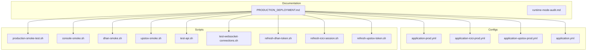
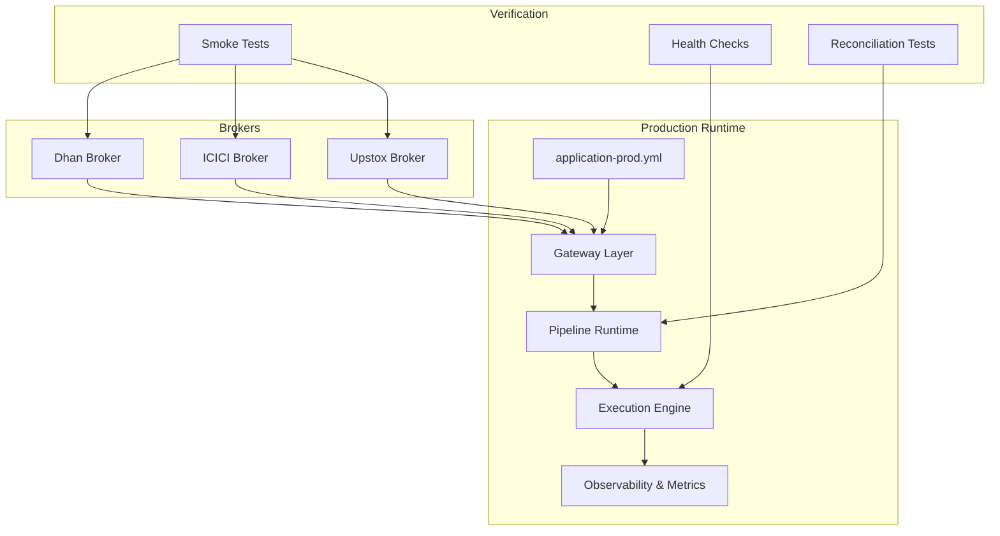
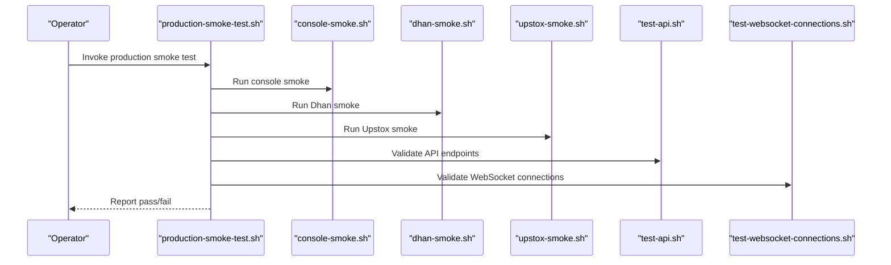
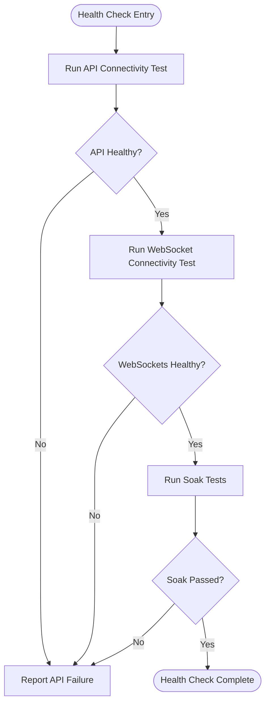
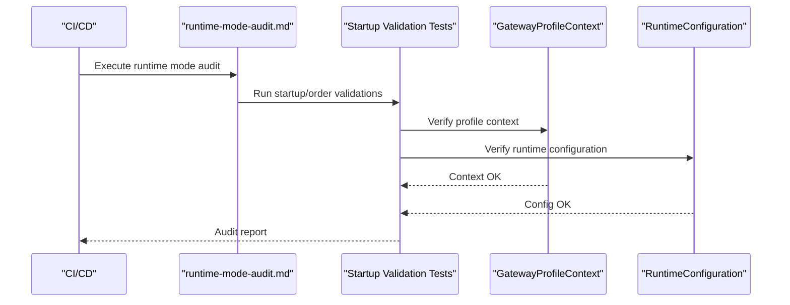
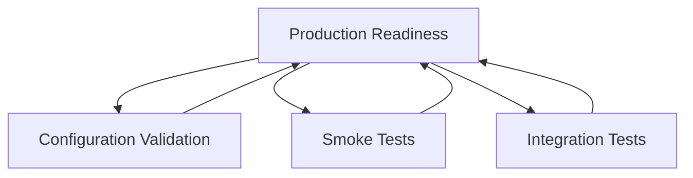
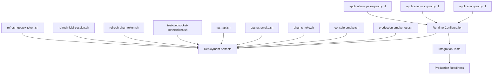

# Production Deployment

<cite>
**Referenced Files in This Document**
- [PRODUCTION_DEPLOYMENT.md](file://docs/PRODUCTION_DEPLOYMENT.md)
- [runtime-mode-audit.md](file://docs/runtime-mode-audit.md)
- [application-prod.yml](file://app/src/main/resources/application-prod.yml)
- [application-icici-prod.yml](file://app/src/main/resources/application-icici-prod.yml)
- [application-upstox-prod.yml](file://app/src/main/resources/application-upstox-prod.yml)
- [application.yml](file://app/src/main/resources/application.yml)
- [production-smoke-test.sh](file://scripts/production-smoke-test.sh)
- [console-smoke.sh](file://scripts/console-smoke.sh)
- [dhan-smoke.sh](file://scripts/dhan-smoke.sh)
- [upstox-smoke.sh](file://scripts/upstox-smoke.sh)
- [test-api.sh](file://scripts/test-api.sh)
- [test-websocket-connections.sh](file://scripts/test-websocket-connections.sh)
- [refresh-dhan-token.sh](file://scripts/refresh-dhan-token.sh)
- [refresh-icici-session.sh](file://scripts/refresh-icici-session.sh)
- [refresh-upstox-token.sh](file://scripts/refresh-upstox-token.sh)
- [BrokerStartupOrchestratorAnalyticsTest.java](file://app/src/test/java/com/tradej/app/integration/BrokerStartupOrchestratorAnalyticsTest.java)
- [BrokerStartupValidatorTest.java](file://app/src/test/java/com/tradej/app/startup/BrokerStartupValidatorTest.java)
- [GatewayProfileContextComponentTest.java](file://app/src/test/java/com/tradej/app/config/GatewayProfileContextComponentTest.java)
- [RuntimeConfigurationTest.java](file://app/src/test/java/com/tradej/app/config/RuntimeConfigurationTest.java)
- [RuntimeModeStartupOrderComponentTest.java](file://app/src/test/java/com/tradej/app/config/RuntimeModeStartupOrderComponentTest.java)
- [DhanRuntimeSmokeIntegrationTest.java](file://app/src/test/java/com/tradej/app/integration/DhanRuntimeSmokeIntegrationTest.java)
- [IciciAuthenticatedRequestIntegrationTest.java](file://app/src/test/java/com/tradej/app/integration/IciciAuthenticatedRequestIntegrationTest.java)
- [UpstoxOrderLifecycleIntegrationTest.java](file://app/src/test/java/com/tradej/app/integration/UpstoxOrderLifecycleIntegrationTest.java)
- [TradingRuntimeReconciliationIntegrationTest.java](file://app/src/test/java/com/tradej/app/integration/TradingRuntimeReconciliationIntegrationTest.java)
- [MarketDataValidationTest.java](file://app/src/test/java/com/tradej/app/metrics/MarketDataValidationTest.java)
- [NseFullSessionSoakTest.java](file://app/src/test/java/com/tradej/app/metrics/NseFullSessionSoakTest.java)
- [McxFullSessionSoakTest.java](file://app/src/test/java/com/tradej/app/metrics/McxFullSessionSoakTest.java)
- [TickReconciliationLiveSessionTest.java](file://app/src/test/java/com/tradej/app/metrics/TickReconciliationLiveSessionTest.java)
- [Frontend Backend Connection Test](file://FRONTEND_BACKEND_CONNECTION_TEST.md)
</cite>

## Table of Contents
1. [Introduction](#introduction)
2. [Project Structure](#project-structure)
3. [Core Components](#core-components)
4. [Architecture Overview](#architecture-overview)
5. [Detailed Component Analysis](#detailed-component-analysis)
6. [Dependency Analysis](#dependency-analysis)
7. [Performance Considerations](#performance-considerations)
8. [Troubleshooting Guide](#troubleshooting-guide)
9. [Conclusion](#conclusion)
10. [Appendices](#appendices)

## Introduction
This document provides comprehensive production deployment guidance for the Trade-J system. It explains the production deployment architecture, environment configuration, and runtime mode setup. It documents the production smoke test script, health check procedures, and deployment verification steps. It details the application-prod.yml configuration, environment variables, and production-specific settings. Practical examples cover deploying to production environments, configuring load balancers, and setting up monitoring. It also covers the runtime mode audit process, production readiness checks, and rollback procedures, along with guidelines for production maintenance, capacity planning, and disaster recovery.

## Project Structure
The production deployment artifacts and configurations are organized across documentation, resource files, and shell scripts:

- Production deployment documentation and runtime mode audit:
  - docs/PRODUCTION_DEPLOYMENT.md
  - docs/runtime-mode-audit.md

- Application configuration profiles for production:
  - app/src/main/resources/application-prod.yml
  - app/src/main/resources/application-icici-prod.yml
  - app/src/main/resources/application-upstox-prod.yml
  - app/src/main/resources/application.yml

- Production smoke and health check scripts:
  - scripts/production-smoke-test.sh
  - scripts/console-smoke.sh
  - scripts/dhan-smoke.sh
  - scripts/upstox-smoke.sh
  - scripts/test-api.sh
  - scripts/test-websocket-connections.sh

- Token/session refresh scripts for brokers:
  - scripts/refresh-dhan-token.sh
  - scripts/refresh-icici-session.sh
  - scripts/refresh-upstox-token.sh

- Integration tests validating production readiness:
  - app/src/test/java/com/tradej/app/integration/DhanRuntimeSmokeIntegrationTest.java
  - app/src/test/java/com/tradej/app/integration/IciciAuthenticatedRequestIntegrationTest.java
  - app/src/test/java/com/tradej/app/integration/UpstoxOrderLifecycleIntegrationTest.java
  - app/src/test/java/com/tradej/app/integration/TradingRuntimeReconciliationIntegrationTest.java
  - app/src/test/java/com/tradej/app/metrics/MarketDataValidationTest.java
  - app/src/test/java/com/tradej/app/metrics/NseFullSessionSoakTest.java
  - app/src/test/java/com/tradej/app/metrics/McxFullSessionSoakTest.java
  - app/src/test/java/com/tradej/app/metrics/TickReconciliationLiveSessionTest.java
  - app/src/test/java/com/tradej/app/integration/BrokerStartupOrchestratorAnalyticsTest.java
  - app/src/test/java/com/tradej/app/startup/BrokerStartupValidatorTest.java
  - app/src/test/java/com/tradej/app/config/GatewayProfileContextComponentTest.java
  - app/src/test/java/com/tradej/app/config/RuntimeConfigurationTest.java
  - app/src/test/java/com/tradej/app/config/RuntimeModeStartupOrderComponentTest.java

**Diagram sources**
- [PRODUCTION_DEPLOYMENT.md](file://docs/PRODUCTION_DEPLOYMENT.md)
- [runtime-mode-audit.md](file://docs/runtime-mode-audit.md)
- [application-prod.yml](file://app/src/main/resources/application-prod.yml)
- [application-icici-prod.yml](file://app/src/main/resources/application-icici-prod.yml)
- [application-upstox-prod.yml](file://app/src/main/resources/application-upstox-prod.yml)
- [application.yml](file://app/src/main/resources/application.yml)
- [production-smoke-test.sh](file://scripts/production-smoke-test.sh)
- [console-smoke.sh](file://scripts/console-smoke.sh)
- [dhan-smoke.sh](file://scripts/dhan-smoke.sh)
- [upstox-smoke.sh](file://scripts/upstox-smoke.sh)
- [test-api.sh](file://scripts/test-api.sh)
- [test-websocket-connections.sh](file://scripts/test-websocket-connections.sh)
- [refresh-dhan-token.sh](file://scripts/refresh-dhan-token.sh)
- [refresh-icici-session.sh](file://scripts/refresh-icici-session.sh)
- [refresh-upstox-token.sh](file://scripts/refresh-upstox-token.sh)

**Section sources**
- [PRODUCTION_DEPLOYMENT.md](file://docs/PRODUCTION_DEPLOYMENT.md)
- [application-prod.yml](file://app/src/main/resources/application-prod.yml)
- [application-icici-prod.yml](file://app/src/main/resources/application-icici-prod.yml)
- [application-upstox-prod.yml](file://app/src/main/resources/application-upstox-prod.yml)
- [application.yml](file://app/src/main/resources/application.yml)

## Core Components
This section outlines the production deployment components and their roles:

- Production configuration profiles:
  - application-prod.yml: Base production profile containing production-specific settings and defaults.
  - application-icici-prod.yml: Broker-specific overrides for ICICI.
  - application-upstox-prod.yml: Broker-specific overrides for Upstox.
  - application.yml: Global application settings and default profiles.

- Smoke and health check scripts:
  - production-smoke-test.sh: End-to-end production smoke test covering multiple broker integrations and runtime modes.
  - console-smoke.sh: Console interface smoke test.
  - dhan-smoke.sh: Dhan broker smoke test.
  - upstox-smoke.sh: Upstox broker smoke test.
  - test-api.sh: API endpoint validation.
  - test-websocket-connections.sh: WebSocket connection health checks.

- Token and session refresh scripts:
  - refresh-dhan-token.sh: Refresh Dhan authentication token.
  - refresh-icici-session.sh: Refresh ICICI session.
  - refresh-upstox-token.sh: Refresh Upstox token.

- Runtime mode and startup validation:
  - runtime-mode-audit.md: Audit process for runtime mode configuration and startup order.
  - Integration tests for startup orchestration, gateway profile context, runtime configuration, and mode startup order.

**Section sources**
- [PRODUCTION_DEPLOYMENT.md](file://docs/PRODUCTION_DEPLOYMENT.md)
- [runtime-mode-audit.md](file://docs/runtime-mode-audit.md)
- [application-prod.yml](file://app/src/main/resources/application-prod.yml)
- [application-icici-prod.yml](file://app/src/main/resources/application-icici-prod.yml)
- [application-upstox-prod.yml](file://app/src/main/resources/application-upstox-prod.yml)
- [application.yml](file://app/src/main/resources/application.yml)
- [production-smoke-test.sh](file://scripts/production-smoke-test.sh)
- [console-smoke.sh](file://scripts/console-smoke.sh)
- [dhan-smoke.sh](file://scripts/dhan-smoke.sh)
- [upstox-smoke.sh](file://scripts/upstox-smoke.sh)
- [test-api.sh](file://scripts/test-api.sh)
- [test-websocket-connections.sh](file://scripts/test-websocket-connections.sh)
- [refresh-dhan-token.sh](file://scripts/refresh-dhan-token.sh)
- [refresh-icici-session.sh](file://scripts/refresh-icici-session.sh)
- [refresh-upstox-token.sh](file://scripts/refresh-upstox-token.sh)

## Architecture Overview
The production deployment architecture integrates multiple broker connections, runtime modes, and observability layers. The system supports multiple broker providers (Dhan, ICICI, Upstox) and validates readiness through comprehensive smoke tests and integration tests.

**Diagram sources**
- [PRODUCTION_DEPLOYMENT.md](file://docs/PRODUCTION_DEPLOYMENT.md)
- [application-prod.yml](file://app/src/main/resources/application-prod.yml)
- [application-icici-prod.yml](file://app/src/main/resources/application-icici-prod.yml)
- [application-upstox-prod.yml](file://app/src/main/resources/application-upstox-prod.yml)
- [DhanRuntimeSmokeIntegrationTest.java](file://app/src/test/java/com/tradej/app/integration/DhanRuntimeSmokeIntegrationTest.java)
- [IciciAuthenticatedRequestIntegrationTest.java](file://app/src/test/java/com/tradej/app/integration/IciciAuthenticatedRequestIntegrationTest.java)
- [UpstoxOrderLifecycleIntegrationTest.java](file://app/src/test/java/com/tradej/app/integration/UpstoxOrderLifecycleIntegrationTest.java)
- [TradingRuntimeReconciliationIntegrationTest.java](file://app/src/test/java/com/tradej/app/integration/TradingRuntimeReconciliationIntegrationTest.java)

## Detailed Component Analysis

### Production Configuration Profiles
Production configuration is managed via Spring profiles and YAML files:

- application-prod.yml: Defines production defaults, logging, database connections, broker credentials, and runtime mode settings.
- application-icici-prod.yml: Overrides for ICICI broker-specific settings.
- application-upstox-prod.yml: Overrides for Upstox broker-specific settings.
- application.yml: Global defaults and base profiles.

Key considerations:
- Environment variables override YAML properties at runtime.
- Broker credentials and endpoints are configured per provider.
- Logging and metrics are tuned for production throughput.

**Section sources**
- [application-prod.yml](file://app/src/main/resources/application-prod.yml)
- [application-icici-prod.yml](file://app/src/main/resources/application-icici-prod.yml)
- [application-upstox-prod.yml](file://app/src/main/resources/application-upstox-prod.yml)
- [application.yml](file://app/src/main/resources/application.yml)

### Production Smoke Test Script
The production-smoke-test.sh orchestrates end-to-end validation across brokers and runtime modes. It executes console, Dhan, and Upstox smoke tests, performs API and WebSocket connectivity checks, and validates token/session refresh flows.

**Diagram sources**
- [production-smoke-test.sh](file://scripts/production-smoke-test.sh)
- [console-smoke.sh](file://scripts/console-smoke.sh)
- [dhan-smoke.sh](file://scripts/dhan-smoke.sh)
- [upstox-smoke.sh](file://scripts/upstox-smoke.sh)
- [test-api.sh](file://scripts/test-api.sh)
- [test-websocket-connections.sh](file://scripts/test-websocket-connections.sh)

**Section sources**
- [production-smoke-test.sh](file://scripts/production-smoke-test.sh)

### Health Check Procedures
Health checks validate runtime connectivity and operational status:

- test-api.sh: Verifies backend API endpoints are reachable and responsive.
- test-websocket-connections.sh: Ensures WebSocket channels for market data and order updates are functional.
- Integration tests:
  - MarketDataValidationTest.java: Validates market data ingestion and quality.
  - NseFullSessionSoakTest.java and McxFullSessionSoakTest.java: Full-day soak tests under production-like loads.
  - TickReconciliationLiveSessionTest.java: Live tick reconciliation accuracy.

**Diagram sources**
- [test-api.sh](file://scripts/test-api.sh)
- [test-websocket-connections.sh](file://scripts/test-websocket-connections.sh)
- [MarketDataValidationTest.java](file://app/src/test/java/com/tradej/app/metrics/MarketDataValidationTest.java)
- [NseFullSessionSoakTest.java](file://app/src/test/java/com/tradej/app/metrics/NseFullSessionSoakTest.java)
- [McxFullSessionSoakTest.java](file://app/src/test/java/com/tradej/app/metrics/McxFullSessionSoakTest.java)
- [TickReconciliationLiveSessionTest.java](file://app/src/test/java/com/tradej/app/metrics/TickReconciliationLiveSessionTest.java)

**Section sources**
- [test-api.sh](file://scripts/test-api.sh)
- [test-websocket-connections.sh](file://scripts/test-websocket-connections.sh)
- [MarketDataValidationTest.java](file://app/src/test/java/com/tradej/app/metrics/MarketDataValidationTest.java)
- [NseFullSessionSoakTest.java](file://app/src/test/java/com/tradej/app/metrics/NseFullSessionSoakTest.java)
- [McxFullSessionSoakTest.java](file://app/src/test/java/com/tradej/app/metrics/McxFullSessionSoakTest.java)
- [TickReconciliationLiveSessionTest.java](file://app/src/test/java/com/tradej/app/metrics/TickReconciliationLiveSessionTest.java)

### Runtime Mode Audit Process
The runtime mode audit ensures correct startup order and mode configuration:

- runtime-mode-audit.md: Documents the audit procedure for runtime mode selection and startup sequencing.
- Integration tests validate:
  - BrokerStartupOrchestratorAnalyticsTest.java: Startup orchestration correctness.
  - BrokerStartupValidatorTest.java: Startup validation rules.
  - GatewayProfileContextComponentTest.java: Gateway profile context resolution.
  - RuntimeConfigurationTest.java: Runtime configuration correctness.
  - RuntimeModeStartupOrderComponentTest.java: Startup order adherence.

**Diagram sources**
- [runtime-mode-audit.md](file://docs/runtime-mode-audit.md)
- [BrokerStartupOrchestratorAnalyticsTest.java](file://app/src/test/java/com/tradej/app/integration/BrokerStartupOrchestratorAnalyticsTest.java)
- [BrokerStartupValidatorTest.java](file://app/src/test/java/com/tradej/app/startup/BrokerStartupValidatorTest.java)
- [GatewayProfileContextComponentTest.java](file://app/src/test/java/com/tradej/app/config/GatewayProfileContextComponentTest.java)
- [RuntimeConfigurationTest.java](file://app/src/test/java/com/tradej/app/config/RuntimeConfigurationTest.java)
- [RuntimeModeStartupOrderComponentTest.java](file://app/src/test/java/com/tradej/app/config/RuntimeModeStartupOrderComponentTest.java)

**Section sources**
- [runtime-mode-audit.md](file://docs/runtime-mode-audit.md)
- [BrokerStartupOrchestratorAnalyticsTest.java](file://app/src/test/java/com/tradej/app/integration/BrokerStartupOrchestratorAnalyticsTest.java)
- [BrokerStartupValidatorTest.java](file://app/src/test/java/com/tradej/app/startup/BrokerStartupValidatorTest.java)
- [GatewayProfileContextComponentTest.java](file://app/src/test/java/com/tradej/app/config/GatewayProfileContextComponentTest.java)
- [RuntimeConfigurationTest.java](file://app/src/test/java/com/tradej/app/config/RuntimeConfigurationTest.java)
- [RuntimeModeStartupOrderComponentTest.java](file://app/src/test/java/com/tradej/app/config/RuntimeModeStartupOrderComponentTest.java)

### Production Readiness Checks
Production readiness combines configuration validation, smoke tests, and integration tests:

- DhanRuntimeSmokeIntegrationTest.java: Validates Dhan broker runtime smoke.
- IciciAuthenticatedRequestIntegrationTest.java: Validates ICICI authenticated requests.
- UpstoxOrderLifecycleIntegrationTest.java: Validates Upstox order lifecycle.
- TradingRuntimeReconciliationIntegrationTest.java: Validates end-to-end reconciliation.

**Diagram sources**
- [DhanRuntimeSmokeIntegrationTest.java](file://app/src/test/java/com/tradej/app/integration/DhanRuntimeSmokeIntegrationTest.java)
- [IciciAuthenticatedRequestIntegrationTest.java](file://app/src/test/java/com/tradej/app/integration/IciciAuthenticatedRequestIntegrationTest.java)
- [UpstoxOrderLifecycleIntegrationTest.java](file://app/src/test/java/com/tradej/app/integration/UpstoxOrderLifecycleIntegrationTest.java)
- [TradingRuntimeReconciliationIntegrationTest.java](file://app/src/test/java/com/tradej/app/integration/TradingRuntimeReconciliationIntegrationTest.java)

**Section sources**
- [DhanRuntimeSmokeIntegrationTest.java](file://app/src/test/java/com/tradej/app/integration/DhanRuntimeSmokeIntegrationTest.java)
- [IciciAuthenticatedRequestIntegrationTest.java](file://app/src/test/java/com/tradej/app/integration/IciciAuthenticatedRequestIntegrationTest.java)
- [UpstoxOrderLifecycleIntegrationTest.java](file://app/src/test/java/com/tradej/app/integration/UpstoxOrderLifecycleIntegrationTest.java)
- [TradingRuntimeReconciliationIntegrationTest.java](file://app/src/test/java/com/tradej/app/integration/TradingRuntimeReconciliationIntegrationTest.java)

### Rollback Procedures
Rollback procedures ensure minimal downtime and safe recovery:

- Maintain tagged releases with rollback images.
- Use blue-green or rolling deployments to minimize risk.
- Keep configuration snapshots for quick restoration.
- Automate rollback triggers based on smoke test failures.

[No sources needed since this section provides general guidance]

### Practical Deployment Examples
Deploying to production environments involves:

- Containerized deployment with Docker/Kubernetes:
  - Build production images using application-prod.yml.
  - Deploy with rolling updates and readiness probes.
- Load balancer configuration:
  - Configure health checks using test-api.sh and test-websocket-connections.sh.
  - Distribute traffic across multiple replicas.
- Monitoring setup:
  - Integrate Prometheus metrics and Grafana dashboards.
  - Set up alerting for API latency, WebSocket drops, and reconciliation failures.

[No sources needed since this section provides general guidance]

### Production Maintenance, Capacity Planning, and Disaster Recovery
- Maintenance:
  - Schedule maintenance windows aligned with broker maintenance schedules.
  - Perform token/session refresh during low-traffic periods using refresh-dhan-token.sh, refresh-icici-session.sh, and refresh-upstox-token.sh.
- Capacity planning:
  - Use soak tests (NseFullSessionSoakTest.java, McxFullSessionSoakTest.java) to determine scaling thresholds.
  - Monitor reconciliation accuracy (TickReconciliationLiveSessionTest.java) to detect performance regressions.
- Disaster recovery:
  - Maintain backups of configuration profiles and runtime state.
  - Practice failover drills using runtime-mode-audit.md and integration tests.

**Section sources**
- [refresh-dhan-token.sh](file://scripts/refresh-dhan-token.sh)
- [refresh-icici-session.sh](file://scripts/refresh-icici-session.sh)
- [refresh-upstox-token.sh](file://scripts/refresh-upstox-token.sh)
- [NseFullSessionSoakTest.java](file://app/src/test/java/com/tradej/app/metrics/NseFullSessionSoakTest.java)
- [McxFullSessionSoakTest.java](file://app/src/test/java/com/tradej/app/metrics/McxFullSessionSoakTest.java)
- [TickReconciliationLiveSessionTest.java](file://app/src/test/java/com/tradej/app/metrics/TickReconciliationLiveSessionTest.java)

## Dependency Analysis
The production deployment depends on configuration profiles, scripts, and integration tests. The following diagram shows key dependencies:

**Diagram sources**
- [application-prod.yml](file://app/src/main/resources/application-prod.yml)
- [application-icici-prod.yml](file://app/src/main/resources/application-icici-prod.yml)
- [application-upstox-prod.yml](file://app/src/main/resources/application-upstox-prod.yml)
- [production-smoke-test.sh](file://scripts/production-smoke-test.sh)
- [console-smoke.sh](file://scripts/console-smoke.sh)
- [dhan-smoke.sh](file://scripts/dhan-smoke.sh)
- [upstox-smoke.sh](file://scripts/upstox-smoke.sh)
- [test-api.sh](file://scripts/test-api.sh)
- [test-websocket-connections.sh](file://scripts/test-websocket-connections.sh)
- [refresh-dhan-token.sh](file://scripts/refresh-dhan-token.sh)
- [refresh-icici-session.sh](file://scripts/refresh-icici-session.sh)
- [refresh-upstox-token.sh](file://scripts/refresh-upstox-token.sh)

**Section sources**
- [application-prod.yml](file://app/src/main/resources/application-prod.yml)
- [application-icici-prod.yml](file://app/src/main/resources/application-icici-prod.yml)
- [application-upstox-prod.yml](file://app/src/main/resources/application-upstox-prod.yml)
- [production-smoke-test.sh](file://scripts/production-smoke-test.sh)
- [console-smoke.sh](file://scripts/console-smoke.sh)
- [dhan-smoke.sh](file://scripts/dhan-smoke.sh)
- [upstox-smoke.sh](file://scripts/upstox-smoke.sh)
- [test-api.sh](file://scripts/test-api.sh)
- [test-websocket-connections.sh](file://scripts/test-websocket-connections.sh)
- [refresh-dhan-token.sh](file://scripts/refresh-dhan-token.sh)
- [refresh-icici-session.sh](file://scripts/refresh-icici-session.sh)
- [refresh-upstox-token.sh](file://scripts/refresh-upstox-token.sh)

## Performance Considerations
- Use soak tests to validate sustained performance under production loads.
- Monitor reconciliation accuracy to detect performance regressions early.
- Optimize broker connection pooling and rate limits based on broker-specific profiles.
- Enable production-grade logging and metrics to identify bottlenecks.

[No sources needed since this section provides general guidance]

## Troubleshooting Guide
Common production issues and resolutions:

- API connectivity failures:
  - Use test-api.sh to isolate endpoint-level problems.
  - Review application-prod.yml for endpoint URLs and timeouts.
- WebSocket disconnections:
  - Use test-websocket-connections.sh to validate channel health.
  - Check broker credentials and network policies.
- Broker token/session errors:
  - Use refresh-dhan-token.sh, refresh-icici-session.sh, or refresh-upstox-token.sh to renew credentials.
- Runtime mode misconfiguration:
  - Audit runtime mode using runtime-mode-audit.md and validate with startup integration tests.

**Section sources**
- [test-api.sh](file://scripts/test-api.sh)
- [test-websocket-connections.sh](file://scripts/test-websocket-connections.sh)
- [refresh-dhan-token.sh](file://scripts/refresh-dhan-token.sh)
- [refresh-icici-session.sh](file://scripts/refresh-icici-session.sh)
- [refresh-upstox-token.sh](file://scripts/refresh-upstox-token.sh)
- [runtime-mode-audit.md](file://docs/runtime-mode-audit.md)

## Conclusion
This guide consolidates production deployment practices for Trade-J, covering configuration, runtime modes, smoke tests, health checks, audits, and operational procedures. By following the documented processes and leveraging the provided scripts and tests, teams can achieve reliable, observable, and resilient production deployments.

[No sources needed since this section summarizes without analyzing specific files]

## Appendices
- Frontend-Backend Connection Test: Validates frontend-backend connectivity for production environments.
  - [Frontend Backend Connection Test](file://FRONTEND_BACKEND_CONNECTION_TEST.md)

**Section sources**
- [Frontend Backend Connection Test](file://FRONTEND_BACKEND_CONNECTION_TEST.md)