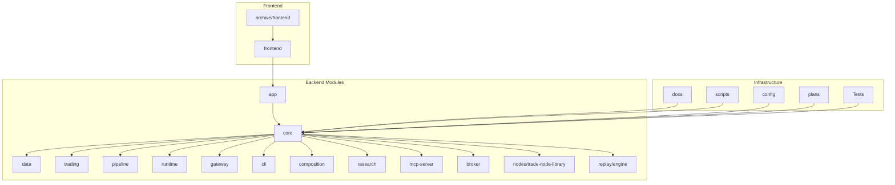
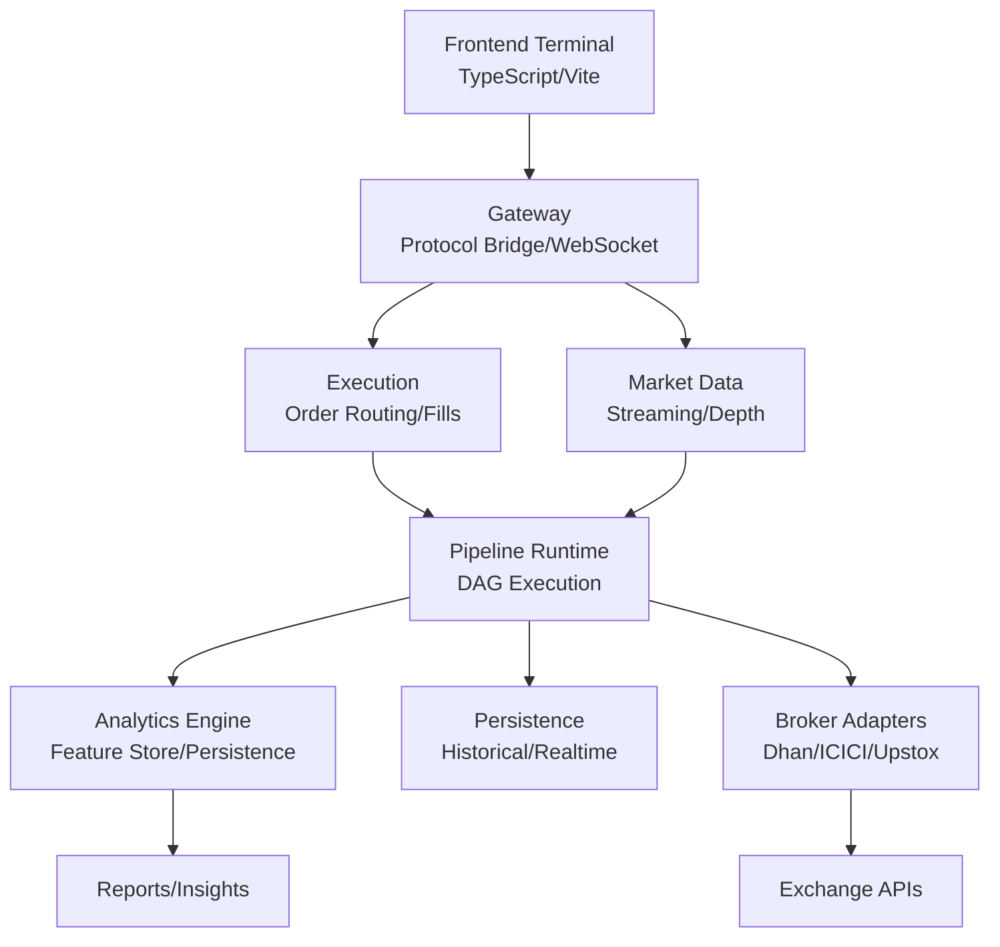
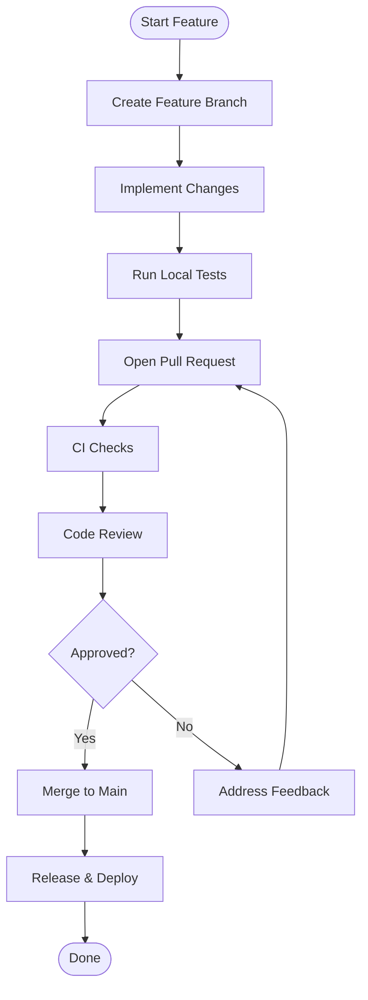
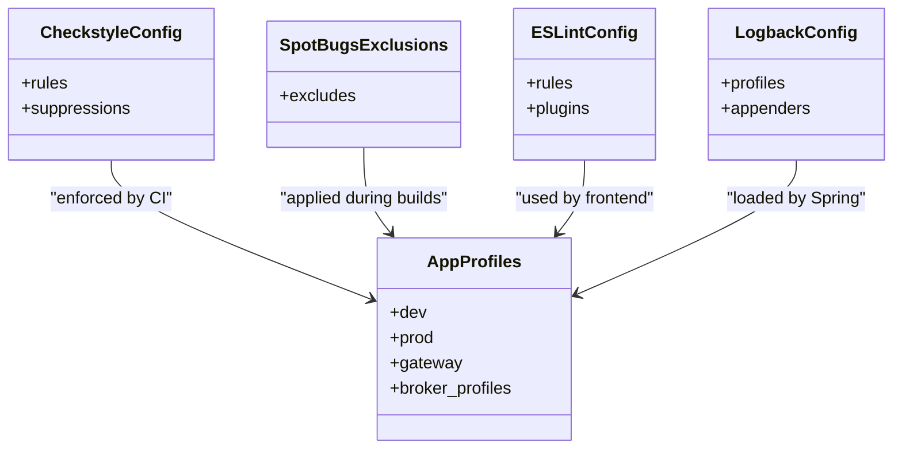
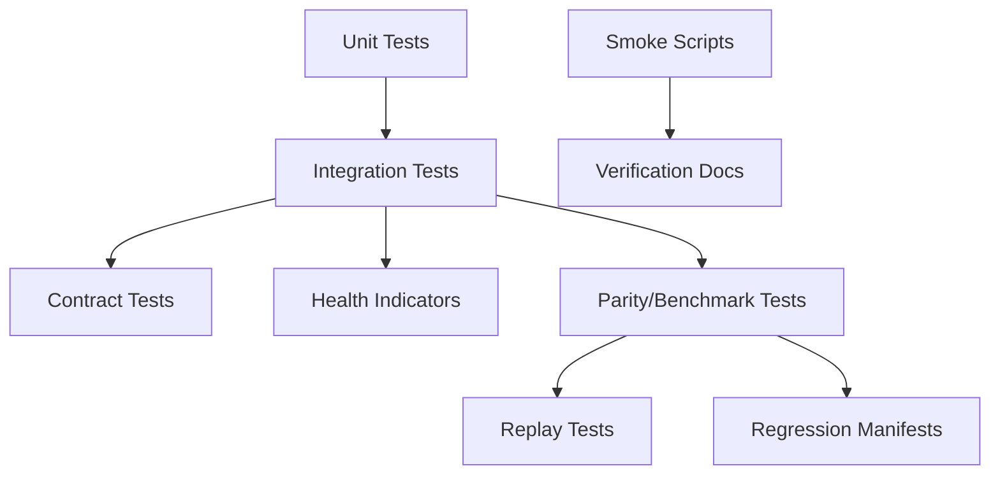
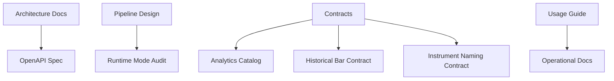
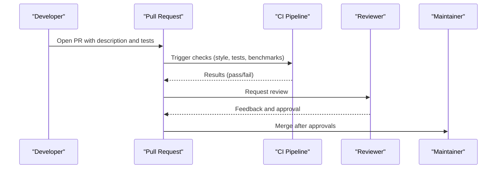
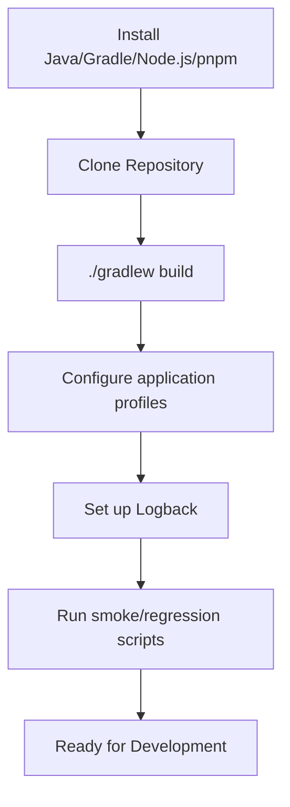
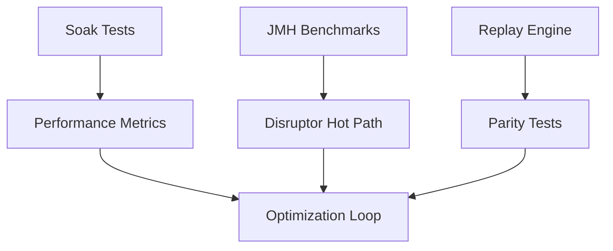

# Developer Guidelines

<cite>
**Referenced Files in This Document**
- [README.md](file://README.md)
- [ARCHITECTURE.md](file://ARCHITECTURE.md)
- [docs/ARCHITECTURE.md](file://docs/ARCHITECTURE.md)
- [TESTING.md](file://TESTING.md)
- [CLI.md](file://CLI.md)
- [CONFIG.md](file://CONFIG.md)
- [IMPLEMENTATION_ROADMAP.md](file://IMPLEMENTATION_ROADMAP.md)
- [.github/workflows/ci.yml](file://.github/workflows/ci.yml)
- [build.gradle](file://build.gradle)
- [settings.gradle](file://settings.gradle)
- [gradle.properties](file://gradle.properties)
- [app/build.gradle](file://app/build.gradle)
- [app/src/main/resources/application.yml](file://app/src/main/resources/application.yml)
- [app/src/main/resources/application-dev.yml](file://app/src/main/resources/application-dev.yml)
- [app/src/main/resources/application-prod.yml](file://app/src/main/resources/application-prod.yml)
- [app/src/main/resources/logback-spring.xml](file://app/src/main/resources/logback-spring.xml)
- [config/checkstyle/checkstyle.xml](file://config/checkstyle/checkstyle.xml)
- [config/checkstyle/suppressions.xml](file://config/checkstyle/suppressions.xml)
- [config/spotbugs/exclude.xml](file://config/spotbugs/exclude.xml)
- [frontend/eslint.config.js](file://frontend/eslint.config.js)
- [frontend/package.json](file://frontend/package.json)
- [frontend/vite.config.ts](file://frontend/vite.config.ts)
- [frontend/tsconfig.json](file://frontend/tsconfig.json)
- [scripts/console-smoke.sh](file://scripts/console-smoke.sh)
- [scripts/run-full-regression.sh](file://scripts/run-full-regression.sh)
- [scripts/test-api.sh](file://scripts/test-api.sh)
- [docs/API_DOCUMENTATION.md](file://docs/API_DOCUMENTATION.md)
- [docs/PIPELINE_DESIGN.md](file://docs/PIPELINE_DESIGN.md)
- [docs/USAGE_GUIDE.md](file://docs/USAGE_GUIDE.md)
- [docs/CONSOLE_SMOKE.md](file://docs/CONSOLE_SMOKE.md)
- [docs/E2E_VERIFICATION.md](file://docs/E2E_VERIFICATION.md)
- [docs/PRODUCTION_DEPLOYMENT.md](file://docs/PRODUCTION_DEPLOYMENT.md)
- [docs/runtime-mode-audit.md](file://docs/runtime-mode-audit.md)
- [docs/openapi.yaml](file://docs/openapi.yaml)
- [docs/contracts/ANALYTICS_CATALOG.md](file://docs/contracts/ANALYTICS_CATALOG.md)
- [docs/contracts/HISTORICAL_BAR_CONTRACT.md](file://docs/contracts/HISTORICAL_BAR_CONTRACT.md)
- [docs/contracts/INSTRUMENT_NAMING_CONTRACT.md](file://docs/contracts/INSTRUMENT_NAMING_CONTRACT.md)
- [plans/TRADE_J_ARCHITECTURE_REVIEW.md](file://plans/TRADE_J_ARCHITECTURE_REVIEW.md)
- [plans/BROKER_COVERAGE_AND_REVIEW_PLAN.md](file://plans/BROKER_COVERAGE_AND_REVIEW_PLAN.md)
- [plans/ICICI_BREEZE_REMEDIATION_PLAN.md](file://plans/ICICI_BREEZE_REMEDIATION_PLAN.md)
- [plans/JAVA26_MODERNIZATION_PLAN.md](file://plans/JAVA26_MODERNIZATION_PLAN.md)
- [broker/README.md](file://broker/README.md)
- [core/README.md](file://core/README.md)
- [data/README.md](file://data/README.md)
- [trading/README.md](file://trading/README.md)
- [runtime/README.md](file://runtime/README.md)
- [gateway/README.md](file://gateway/README.md)
- [pipeline/README.md](file://pipeline/README.md)
- [cli/README.md](file://cli/README.md)
- [composition/README.md](file://composition/README.md)
- [nodes/trade-node-library/README.md](file://nodes/trade-node-library/README.md)
- [replay/engine/README.md](file://replay/engine/README.md)
- [research/README.md](file://research/README.md)
- [mcp-server/README.md](file://mcp-server/README.md)
</cite>

## Table of Contents
1. [Introduction](#introduction)
2. [Project Structure](#project-structure)
3. [Core Components](#core-components)
4. [Architecture Overview](#architecture-overview)
5. [Development Workflow](#development-workflow)
6. [Code Style and Standards](#code-style-and-standards)
7. [Testing Requirements](#testing-requirements)
8. [Documentation Standards](#documentation-standards)
9. [Code Review Process](#code-review-process)
10. [Contribution Process](#contribution-process)
11. [Release Procedures](#release-procedures)
12. [Development Environment Setup](#development-environment-setup)
13. [Debugging Techniques](#debugging-techniques)
14. [Performance Optimization Practices](#performance-optimization-practices)
15. [Architectural Decision Records](#architectural-decision-records)
16. [Best Practices for Extending the Platform](#best-practices-for-extending-the-platform)
17. [Troubleshooting Guide](#troubleshooting-guide)
18. [Conclusion](#conclusion)

## Introduction
This document provides comprehensive developer guidelines and contribution standards for the Trade-J platform. It consolidates architecture principles, development workflow, testing requirements, documentation standards, code review processes, contribution procedures, release practices, environment setup, debugging techniques, performance optimization, architectural decisions, and extension best practices. The guidance is derived from the repository's official documentation, CI configuration, build scripts, and module-specific READMEs.

## Project Structure
Trade-J is a multi-module Java/Spring Boot application with a frontend built using TypeScript/Vite. The repository includes backend modules for brokerage integrations, data ingestion, analytics, pipeline orchestration, trading logic, runtime systems, gateway services, CLI tools, and composition layers. Frontend modules provide the terminal interface and associated UI components. Supporting directories include configuration, scripts, documentation, and plans.

**Section sources**
- [README.md](file://README.md)
- [ARCHITECTURE.md](file://ARCHITECTURE.md)
- [docs/ARCHITECTURE.md](file://docs/ARCHITECTURE.md)

## Core Components
- Application Layer: Central Spring Boot application managing profiles, logging, and runtime modes.
- Core Domain: Business domain models, services, infrastructure, and pipeline runtime.
- Data Modules: Analytics, feature store, historical ingest, and persistence.
- Trading Modules: Execution, indicators, scanner, simulation, strategy, and options analytics.
- Runtime Systems: Disruptor-based hot path, pipeline runtime, and replay engine.
- Gateway: Protocol bridging and WebSocket transport.
- Broker Integrations: Dhan, ICICI, Upstox adapters and authentication.
- CLI Tools: Command-line utilities for data, scanning, trading, and maintenance.
- Composition: Runtime composition of brokers, clocks, data, execution, pipelines, and storage.
- Frontend: Terminal application with panels, widgets, and state management.
- Research: Research APIs, core session management, and lab components.
- MCP Server: Minimal Control Plane server controller.

**Section sources**
- [core/README.md](file://core/README.md)
- [data/README.md](file://data/README.md)
- [trading/README.md](file://trading/README.md)
- [runtime/README.md](file://runtime/README.md)
- [gateway/README.md](file://gateway/README.md)
- [broker/README.md](file://broker/README.md)
- [cli/README.md](file://cli/README.md)
- [composition/README.md](file://composition/README.md)
- [nodes/trade-node-library/README.md](file://nodes/trade-node-library/README.md)
- [replay/engine/README.md](file://replay/engine/README.md)
- [research/README.md](file://research/README.md)
- [mcp-server/README.md](file://mcp-server/README.md)

## Architecture Overview
The platform follows a modular, layered architecture with clear separation of concerns:
- Domain-driven design in core modules.
- Reactive pipeline orchestration for real-time data processing.
- Broker-agnostic adapters with unified authentication and streaming.
- Frontend-Backend integration via REST and WebSockets.
- CI-driven quality gates with static analysis and tests.

**Diagram sources**
- [docs/ARCHITECTURE.md](file://docs/ARCHITECTURE.md)
- [ARCHITECTURE.md](file://ARCHITECTURE.md)

**Section sources**
- [docs/ARCHITECTURE.md](file://docs/ARCHITECTURE.md)
- [ARCHITECTURE.md](file://ARCHITECTURE.md)

## Development Workflow
- Branching: Feature branches from develop; merge via pull requests.
- Commit hygiene: Clear messages, focused commits; reference issues.
- CI: Automated checks on pull requests and main branch.
- Testing: Unit, integration, and contract tests per module.
- Code review: Mandatory peer review before merging.
- Release: Tagged releases with changelog and deployment artifacts.

**Section sources**
- [.github/workflows/ci.yml](file://.github/workflows/ci.yml)
- [TESTING.md](file://TESTING.md)

## Code Style and Standards
- Backend Java:
  - Checkstyle configuration enforces style rules and suppressions for specific files.
  - SpotBugs exclusions define false-positive allowances.
- Frontend TypeScript:
  - ESLint configuration governs linting rules.
  - Vite and TypeScript configurations define build and type-checking behavior.
- Logging:
  - Logback configuration for Spring profiles and environments.
- Property files:
  - Multiple application profiles for dev, prod, gateway, and broker-specific environments.

**Diagram sources**
- [config/checkstyle/checkstyle.xml](file://config/checkstyle/checkstyle.xml)
- [config/checkstyle/suppressions.xml](file://config/checkstyle/suppressions.xml)
- [config/spotbugs/exclude.xml](file://config/spotbugs/exclude.xml)
- [frontend/eslint.config.js](file://frontend/eslint.config.js)
- [app/src/main/resources/logback-spring.xml](file://app/src/main/resources/logback-spring.xml)
- [app/src/main/resources/application.yml](file://app/src/main/resources/application.yml)

**Section sources**
- [config/checkstyle/checkstyle.xml](file://config/checkstyle/checkstyle.xml)
- [config/checkstyle/suppressions.xml](file://config/checkstyle/suppressions.xml)
- [config/spotbugs/exclude.xml](file://config/spotbugs/exclude.xml)
- [frontend/eslint.config.js](file://frontend/eslint.config.js)
- [frontend/package.json](file://frontend/package.json)
- [frontend/vite.config.ts](file://frontend/vite.config.ts)
- [frontend/tsconfig.json](file://frontend/tsconfig.json)
- [app/src/main/resources/logback-spring.xml](file://app/src/main/resources/logback-spring.xml)
- [app/src/main/resources/application.yml](file://app/src/main/resources/application.yml)

## Testing Requirements
- Test categories:
  - Unit tests for individual components.
  - Integration tests for cross-module behavior.
  - Contract tests for API and gateway behavior.
  - Health indicator tests for broker connectivity.
  - Soak and benchmark tests for performance.
- Test coverage and parity:
  - Replay parity tests and regression manifests ensure behavioral consistency.
- Smoke and verification:
  - Console smoke tests and end-to-end verification documents.
- Scripts:
  - Shell scripts automate smoke and regression runs.

**Diagram sources**
- [TESTING.md](file://TESTING.md)
- [docs/E2E_VERIFICATION.md](file://docs/E2E_VERIFICATION.md)
- [docs/CONSOLE_SMOKE.md](file://docs/CONSOLE_SMOKE.md)
- [scripts/console-smoke.sh](file://scripts/console-smoke.sh)
- [scripts/run-full-regression.sh](file://scripts/run-full-regression.sh)
- [scripts/test-api.sh](file://scripts/test-api.sh)

**Section sources**
- [TESTING.md](file://TESTING.md)
- [docs/E2E_VERIFICATION.md](file://docs/E2E_VERIFICATION.md)
- [docs/CONSOLE_SMOKE.md](file://docs/CONSOLE_SMOKE.md)
- [scripts/console-smoke.sh](file://scripts/console-smoke.sh)
- [scripts/run-full-regression.sh](file://scripts/run-full-regression.sh)
- [scripts/test-api.sh](file://scripts/test-api.sh)

## Documentation Standards
- Architecture and design:
  - Central architecture documents and visuals.
- API documentation:
  - OpenAPI specification and API documentation.
- Pipeline design:
  - Pipeline design and runtime mode audit.
- Contracts:
  - Analytics catalog, historical bar contract, and instrument naming contract.
- Usage and guides:
  - Usage guide and operational documentation.

**Diagram sources**
- [docs/ARCHITECTURE.md](file://docs/ARCHITECTURE.md)
- [docs/API_DOCUMENTATION.md](file://docs/API_DOCUMENTATION.md)
- [docs/openapi.yaml](file://docs/openapi.yaml)
- [docs/PIPELINE_DESIGN.md](file://docs/PIPELINE_DESIGN.md)
- [docs/runtime-mode-audit.md](file://docs/runtime-mode-audit.md)
- [docs/contracts/ANALYTICS_CATALOG.md](file://docs/contracts/ANALYTICS_CATALOG.md)
- [docs/contracts/HISTORICAL_BAR_CONTRACT.md](file://docs/contracts/HISTORICAL_BAR_CONTRACT.md)
- [docs/contracts/INSTRUMENT_NAMING_CONTRACT.md](file://docs/contracts/INSTRUMENT_NAMING_CONTRACT.md)
- [docs/USAGE_GUIDE.md](file://docs/USAGE_GUIDE.md)

**Section sources**
- [docs/ARCHITECTURE.md](file://docs/ARCHITECTURE.md)
- [docs/API_DOCUMENTATION.md](file://docs/API_DOCUMENTATION.md)
- [docs/openapi.yaml](file://docs/openapi.yaml)
- [docs/PIPELINE_DESIGN.md](file://docs/PIPELINE_DESIGN.md)
- [docs/runtime-mode-audit.md](file://docs/runtime-mode-audit.md)
- [docs/contracts/ANALYTICS_CATALOG.md](file://docs/contracts/ANALYTICS_CATALOG.md)
- [docs/contracts/HISTORICAL_BAR_CONTRACT.md](file://docs/contracts/HISTORICAL_BAR_CONTRACT.md)
- [docs/contracts/INSTRUMENT_NAMING_CONTRACT.md](file://docs/contracts/INSTRUMENT_NAMING_CONTRACT.md)
- [docs/USAGE_GUIDE.md](file://docs/USAGE_GUIDE.md)

## Code Review Process
- Pull Request requirements:
  - Focused scope, clear description, and passing CI checks.
- Review criteria:
  - Code correctness, adherence to style and architecture, test coverage, and documentation updates.
- Approval policy:
  - Required approvals before merging; address feedback promptly.

**Section sources**
- [.github/workflows/ci.yml](file://.github/workflows/ci.yml)

## Contribution Process
- Fork and branch: Work from feature branches targeting main.
- Commits: Atomic, descriptive commits; reference issues.
- Pull requests: Include testing evidence and documentation updates.
- CI and reviews: Ensure all checks pass and approvals are obtained.

**Section sources**
- [.github/workflows/ci.yml](file://.github/workflows/ci.yml)

## Release Procedures
- Versioning: Semantic versioning aligned with changes.
- Artifacts: Build artifacts produced via Gradle; deployment via documented procedures.
- Post-release: Update release notes and verify production smoke tests.

**Section sources**
- [docs/PRODUCTION_DEPLOYMENT.md](file://docs/PRODUCTION_DEPLOYMENT.md)

## Development Environment Setup
- Prerequisites:
  - Java, Gradle, Node.js, and pnpm as indicated by module configurations.
- Build:
  - Root build and settings define modules and properties.
- Profiles:
  - Multiple application profiles for dev, prod, gateway, and broker environments.
- Logging:
  - Logback configuration for Spring profiles.
- Scripts:
  - Shell scripts for smoke and regression testing.

**Diagram sources**
- [build.gradle](file://build.gradle)
- [settings.gradle](file://settings.gradle)
- [gradle.properties](file://gradle.properties)
- [app/src/main/resources/application.yml](file://app/src/main/resources/application.yml)
- [app/src/main/resources/application-dev.yml](file://app/src/main/resources/application-dev.yml)
- [app/src/main/resources/application-prod.yml](file://app/src/main/resources/application-prod.yml)
- [app/src/main/resources/logback-spring.xml](file://app/src/main/resources/logback-spring.xml)
- [scripts/console-smoke.sh](file://scripts/console-smoke.sh)
- [scripts/run-full-regression.sh](file://scripts/run-full-regression.sh)

**Section sources**
- [build.gradle](file://build.gradle)
- [settings.gradle](file://settings.gradle)
- [gradle.properties](file://gradle.properties)
- [app/src/main/resources/application.yml](file://app/src/main/resources/application.yml)
- [app/src/main/resources/application-dev.yml](file://app/src/main/resources/application-dev.yml)
- [app/src/main/resources/application-prod.yml](file://app/src/main/resources/application-prod.yml)
- [app/src/main/resources/logback-spring.xml](file://app/src/main/resources/logback-spring.xml)
- [scripts/console-smoke.sh](file://scripts/console-smoke.sh)
- [scripts/run-full-regression.sh](file://scripts/run-full-regression.sh)

## Debugging Techniques
- Logging:
  - Configure log levels and appenders via Logback for targeted debugging.
- Tests:
  - Use unit and integration tests to isolate issues.
- Scripts:
  - Utilize smoke and regression scripts to reproduce and verify problems.
- Broker-specific:
  - Broker READMEs provide integration-specific debugging tips.

**Section sources**
- [app/src/main/resources/logback-spring.xml](file://app/src/main/resources/logback-spring.xml)
- [broker/README.md](file://broker/README.md)

## Performance Optimization Practices
- Benchmarking:
  - JMH benchmarks in broker core for load-balanced gateway, subscription lookup, and token lifecycle.
- Soak and benchmark tests:
  - Market data and pipeline performance tests.
- Hot path optimization:
  - Disruptor-based hot path components.
- Replay and parity:
  - Replay engine and parity tests ensure performance under realistic loads.

**Diagram sources**
- [broker/core/src/jmh/java/com/tradej/broker/core/benchmark/LoadBalancedGatewayBenchmark.java](file://broker/core/src/jmh/java/com/tradej/broker/core/benchmark/LoadBalancedGatewayBenchmark.java)
- [broker/core/src/jmh/java/com/tradej/broker/core/benchmark/SubscriptionLookupBenchmark.java](file://broker/core/src/jmh/java/com/tradej/broker/core/benchmark/SubscriptionLookupBenchmark.java)
- [broker/core/src/jmh/java/com/tradej/broker/core/benchmark/TokenLifecycleBenchmark.java](file://broker/core/src/jmh/java/com/tradej/broker/core/benchmark/TokenLifecycleBenchmark.java)
- [runtime/hotpath/README.md](file://runtime/hotpath/README.md)
- [runtime/disruptor/README.md](file://runtime/disruptor/README.md)
- [replay/engine/README.md](file://replay/engine/README.md)

**Section sources**
- [broker/core/src/jmh/java/com/tradej/broker/core/benchmark/LoadBalancedGatewayBenchmark.java](file://broker/core/src/jmh/java/com/tradej/broker/core/benchmark/LoadBalancedGatewayBenchmark.java)
- [broker/core/src/jmh/java/com/tradej/broker/core/benchmark/SubscriptionLookupBenchmark.java](file://broker/core/src/jmh/java/com/tradej/broker/core/benchmark/SubscriptionLookupBenchmark.java)
- [broker/core/src/jmh/java/com/tradej/broker/core/benchmark/TokenLifecycleBenchmark.java](file://broker/core/src/jmh/java/com/tradej/broker/core/benchmark/TokenLifecycleBenchmark.java)
- [runtime/hotpath/README.md](file://runtime/hotpath/README.md)
- [runtime/disruptor/README.md](file://runtime/disruptor/README.md)
- [replay/engine/README.md](file://replay/engine/README.md)

## Architectural Decision Records
- Architecture review and modernization plans:
  - Trade-J architecture review, broker coverage plan, ICICI remediation plan, and Java 26 modernization plan.
- Implementation roadmap:
  - Implementation roadmap outlines current and future directions.

**Section sources**
- [plans/TRADE_J_ARCHITECTURE_REVIEW.md](file://plans/TRADE_J_ARCHITECTURE_REVIEW.md)
- [plans/BROKER_COVERAGE_AND_REVIEW_PLAN.md](file://plans/BROKER_COVERAGE_AND_REVIEW_PLAN.md)
- [plans/ICICI_BREEZE_REMEDIATION_PLAN.md](file://plans/ICICI_BREEZE_REMEDIATION_PLAN.md)
- [plans/JAVA26_MODERNIZATION_PLAN.md](file://plans/JAVA26_MODERNIZATION_PLAN.md)
- [IMPLEMENTATION_ROADMAP.md](file://IMPLEMENTATION_ROADMAP.md)

## Best Practices for Extending the Platform
- Follow module boundaries:
  - Respect domain and layer boundaries; introduce new modules when crossing boundaries.
- Use composition:
  - Leverage composition layers for runtime assembly.
- Adhere to contracts:
  - Follow analytics, historical bar, and instrument naming contracts.
- Keep tests current:
  - Add unit, integration, and contract tests alongside new features.
- Document changes:
  - Update architecture and API documentation as applicable.

**Section sources**
- [docs/ARCHITECTURE.md](file://docs/ARCHITECTURE.md)
- [docs/API_DOCUMENTATION.md](file://docs/API_DOCUMENTATION.md)
- [docs/contracts/ANALYTICS_CATALOG.md](file://docs/contracts/ANALYTICS_CATALOG.md)
- [docs/contracts/HISTORICAL_BAR_CONTRACT.md](file://docs/contracts/HISTORICAL_BAR_CONTRACT.md)
- [docs/contracts/INSTRUMENT_NAMING_CONTRACT.md](file://docs/contracts/INSTRUMENT_NAMING_CONTRACT.md)

## Troubleshooting Guide
- Broker integration issues:
  - Consult broker READMEs for troubleshooting steps.
- Smoke and regression failures:
  - Use smoke scripts and regression manifests to isolate regressions.
- Logging:
  - Adjust Logback configuration for verbose logging during investigations.

**Section sources**
- [broker/README.md](file://broker/README.md)
- [scripts/console-smoke.sh](file://scripts/console-smoke.sh)
- [scripts/run-full-regression.sh](file://scripts/run-full-regression.sh)
- [app/src/main/resources/logback-spring.xml](file://app/src/main/resources/logback-spring.xml)

## Conclusion
These guidelines consolidate the repository’s established practices for building, testing, documenting, reviewing, and releasing features in Trade-J. By adhering to the outlined workflows, standards, and best practices, contributors can efficiently extend the platform while maintaining architectural integrity and operational reliability.