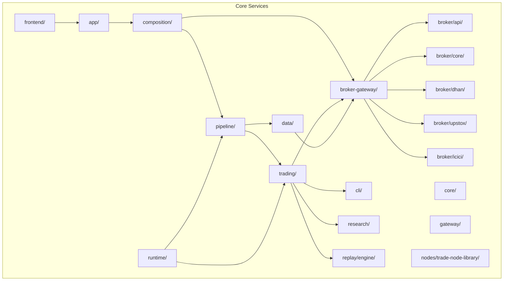
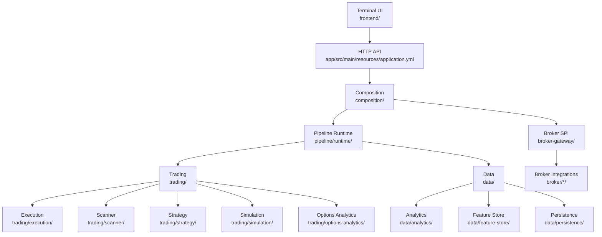
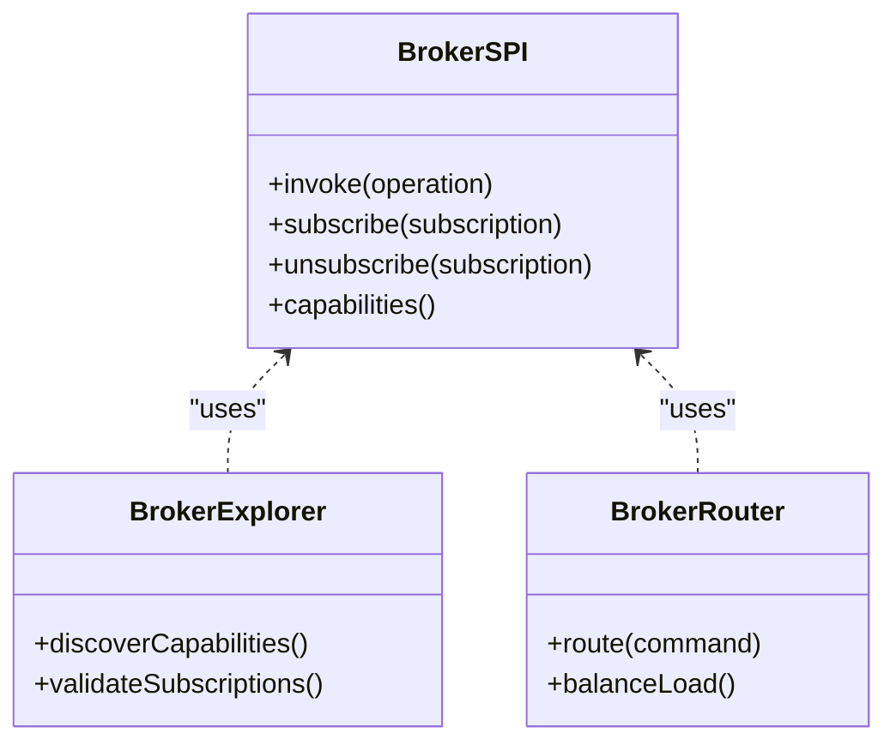
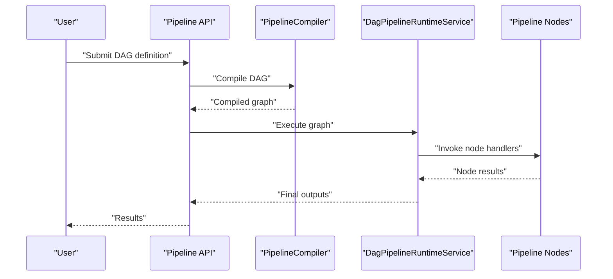
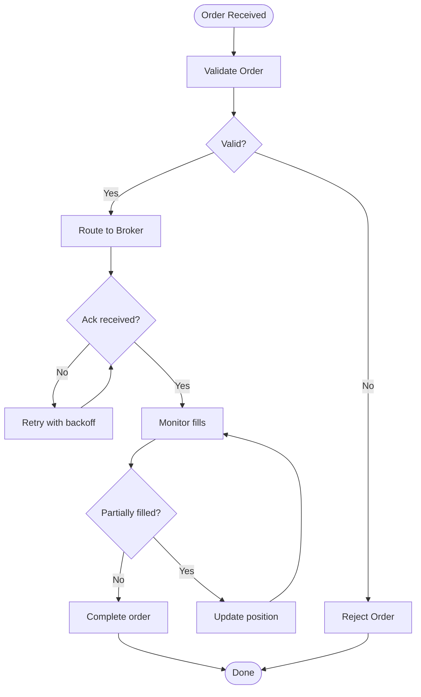
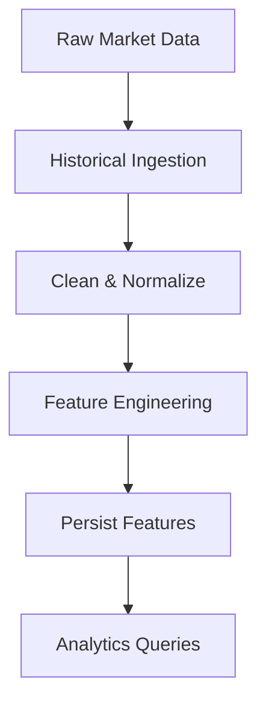
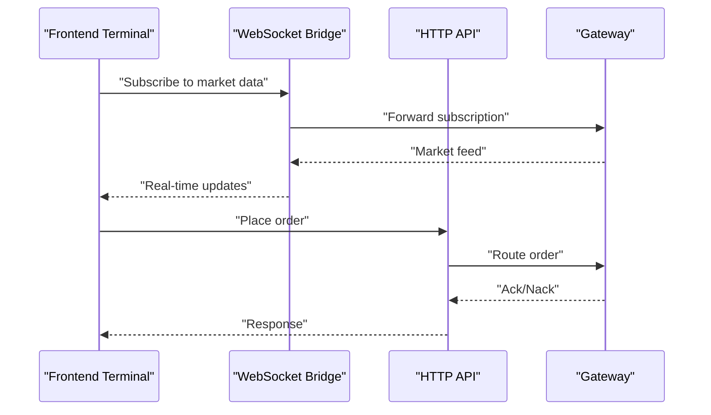
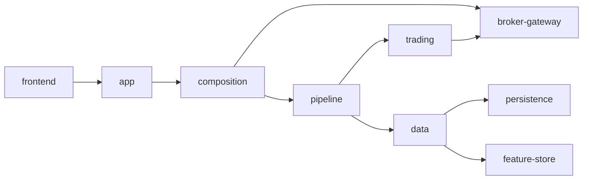

# Developer Guides

<cite>
**Referenced Files in This Document**
- [README.md](file://README.md)
- [ARCHITECTURE.md](file://ARCHITECTURE.md)
- [docs/ARCHITECTURE.md](file://docs/ARCHITECTURE.md)
- [docs/CODEBASE_LEAF_INDEX.md](file://docs/CODEBASE_LEAF_INDEX.md)
- [docs/BACKLOG.md](file://docs/BACKLOG.md)
- [docs/API_DOCUMENTATION.md](file://docs/API_DOCUMENTATION.md)
- [docs/USAGE_GUIDE.md](file://docs/USAGE_GUIDE.md)
- [docs/PIPELINE_DESIGN.md](file://docs/PIPELINE_DESIGN.md)
- [docs/HORIZONTAL_SCALING_DESIGN.md](file://docs/HORIZONTAL_SCALING_DESIGN.md)
- [docs/TRADEJ_INSTITUTIONAL_ARCHITECTURE.md](file://docs/TRADEJ_INSTITUTIONAL_ARCHITECTURE.md)
- [docs/BROKER_GATEWAY_ARCHITECTURE_REVIEW.md](file://docs/BROKER_GATEWAY_ARCHITECTURE_REVIEW.md)
- [docs/BROKER_CAPABILITY_MATRIX.md](file://docs/BROKER_CAPABILITY_MATRIX.md)
- [docs/CONSOLE_SMOKE.md](file://docs/CONSOLE_SMOKE.md)
- [docs/E2E_VERIFICATION.md](file://docs/E2E_VERIFICATION.md)
- [docs/PRODUCTION_DEPLOYMENT.md](file://docs/PRODUCTION_DEPLOYMENT.md)
- [docs/PRODUCTION_HARDENING_PLAN_2026-06-06.md](file://docs/PRODUCTION_HARDENING_PLAN_2026-06-06.md)
- [docs/UPSTOX_API_GAP_ANALYSIS.md](file://docs/UPSTOX_API_GAP_ANALYSIS.md)
- [docs/openapi.yaml](file://docs/openapi.yaml)
- [docs/runtime-mode-audit.md](file://docs/runtime-mode-audit.md)
- [docs/reports/ARCHITECTURE_REVIEW_2026-06-06.md](file://docs/reports/ARCHITECTURE_REVIEW_2026-06-06.md)
- [docs/reports/BROKER_GATEWAY_ARCHITECTURE_REVIEW_2026-06-06.md](file://docs/reports/BROKER_GATEWAY_ARCHITECTURE_REVIEW_2026-06-06.md)
- [docs/reports/END_TO_END_VERIFICATION_2026-06-06.md](file://docs/reports/END_TO_END_VERIFICATION_2026-06-06.md)
- [docs/reports/MULTI_ASSET_CLASS_REVIEW_2026-06-06.md](file://docs/reports/MULTI_ASSET_CLASS_REVIEW_2026-06-06.md)
- [docs/reports/PLUGIN_MARKET_UTILS_REVIEW_2026-06-06.md](file://docs/reports/PLUGIN_MARKET_UTILS_REVIEW_2026-06-06.md)
- [docs/reports/REACTIVE_ADOPTION_REVIEW_2026-06-06.md](file://docs/reports/REACTIVE_ADOPTION_REVIEW_2026-06-06.md)
- [docs/reports/SIMULATION_REPLAY_BACKTEST_REVIEW_2026-06-06.md](file://docs/reports/SIMULATION_REPLAY_BACKTEST_REVIEW_2026-06-06.md)
- [docs/reports/TERMINAL_SCALABILITY_REVIEW_2026-06-06.md](file://docs/reports/TERMINAL_SCALABILITY_REVIEW_2026-06-06.md)
- [docs/reports/TEST_COVERAGE_CHAOS_REVIEW_2026-06-06.md](file://docs/reports/TEST_COVERAGE_CHAOS_REVIEW_2026-06-06.md)
- [docs/reports/reports_broker_2026-06-08/README.md](file://docs/reports/reports_broker_2026-06-08/README.md)
- [docs/reports/reports_broker_2026-06-08/01_DHAN_MARKET_DATA_CERTIFICATION_REPORT.md](file://docs/reports/reports_broker_2026-06-08/01_DHAN_MARKET_DATA_CERTIFICATION_REPORT.md)
- [docs/reports/reports_broker_2026-06-08/02_UPSTOX_MARKET_DATA_CERTIFICATION_REPORT.md](file://docs/reports/reports_broker_2026-06-08/02_UPSTOX_MARKET_DATA_CERTIFICATION_REPORT.md)
- [docs/reports/reports_broker_2026-06-08/03_ICICI_MARKET_DATA_CERTIFICATION_REPORT.md](file://docs/reports/reports_broker_2026-06-08/03_ICICI_MARKET_DATA_CERTIFICATION_REPORT.md)
- [docs/reports/reports_broker_2026-06-08/04_CAPABILITY_MATRIX.md](file://docs/reports/reports_broker_2026-06-08/04_CAPABILITY_MATRIX.md)
- [docs/reports/reports_broker_2026-06-08/05_SCALING_REPORT.md](file://docs/reports/reports_broker_2026-06-08/05_SCALING_REPORT.md)
- [docs/reports/reports_broker_2026-06-08/06_SUBSCRIPTION_MANAGEMENT_REPORT.md](file://docs/reports/reports_broker_2026-06-08/06_SUBSCRIPTION_MANAGEMENT_REPORT.md)
- [docs/reports/reports_broker_2026-06-08/07_RESUBSCRIPTION_REPORT.md](file://docs/reports/reports_broker_2026-06-08/07_RESUBSCRIPTION_REPORT.md)
- [docs/reports/reports_broker_2026-06-08/08_RATE_LIMIT_ANALYSIS.md](file://docs/reports/reports_broker_2026-06-08/08_RATE_LIMIT_ANALYSIS.md)
- [docs/reports/reports_broker_2026-06-08/09_STRATEGY_READINESS_REPORT.md](file://docs/reports/reports_broker_2026-06-08/09_STRATEGY_READINESS_REPORT.md)
- [docs/reports/reports_broker_2026-06-08/10_CANDLE_GENERATION_REPORT.md](file://docs/reports/reports_broker_2026-06-08/10_CANDLE_GENERATION_REPORT.md)
- [docs/reports/reports_broker_2026-06-08/11_STABILITY_REPORT.md](file://docs/reports/reports_broker_2026-06-08/11_STABILITY_REPORT.md)
- [docs/reports/reports_broker_2026-06-08/12_MARKET_OPEN_SCALE_SIMULATION_REPORT.md](file://docs/reports/reports_broker_2026-06-08/12_MARKET_OPEN_SCALE_SIMULATION_REPORT.md)
- [docs/reports/reports_broker_2026-06-08/13_MULTI_BROKER_ISOLATION_REPORT.md](file://docs/reports/reports_broker_2026-06-08/13_MULTI_BROKER_ISOLATION_REPORT.md)
- [docs/reports/reports_broker_2026-06-08/14_OBSERVABILITY_REPORT.md](file://docs/reports/reports_broker_2026-06-08/14_OBSERVABILITY_REPORT.md)
- [docs/reports/reports_broker_2026-06-08/15_TEST_COVERAGE_REPORT.md](file://docs/reports/reports_broker_2026-06-08/15_TEST_COVERAGE_REPORT.md)
- [docs/reports/reports_broker_2026-06-08/16_RISK_REGISTER.md](file://docs/reports/reports_broker_2026-06-08/16_RISK_REGISTER.md)
- [docs/reports/reports_broker_2026-06-08/17_REFACTORING_RECOMMENDATIONS.md](file://docs/reports/reports_broker_2026-06-08/17_REFACTORING_RECOMMENDATIONS.md)
- [docs/contracts/INSTRUMENT_NAMING_CONTRACT.md](file://docs/contracts/INSTRUMENT_NAMING_CONTRACT.md)
- [docs/contracts/HISTORICAL_BAR_CONTRACT.md](file://docs/contracts/HISTORICAL_BAR_CONTRACT.md)
- [docs/contracts/ANALYTICS_CATALOG.md](file://docs/contracts/ANALYTICS_CATALOG.md)
- [docs/visuals/Trade-J-Architecture-Visual.html](file://docs/visuals/Trade-J-Architecture-Visual.html)
- [docs/AUDITION_PLAN_2026-06-06.md](file://docs/ADOPTION_PLAN_2026-06-06.md)
- [docs/ENGINEERING_REPORT.md](file://docs/ENGINEERING_REPORT.md)
- [docs/event-schema-evolution.md](file://docs/event-schema-evolution.md)
- [docs/runtime-mode-audit.md](file://docs/runtime-mode-audit.md)
- [docs/IMPROVEMENT_PLAN.md](file://docs/IMPROVEMENT_PLAN.md)
- [docs/TRADEHULL_PARITY.md](file://docs/TRADEHULL_PARITY.md)
- [docs/TRADEJ_INSTITUTIONAL_ARCHITECTURE.md](file://docs/TRADEJ_INSTITUTIONAL_ARCHITECTURE.md)
- [docs/TRADEJ_ARCHITECTURE_CLASS_FLOWS_REPORT.md](file://docs/TRADEJ_ARCHITECTURE_CLASS_FLOWS_REPORT.md)
- [docs/BROKER_INTEGRATION_AUDIT_REPORT.md](file://docs/BROKER_INTEGRATION_AUDIT_REPORT.md)
- [docs/BROKER_HARDENING_PLAN.md](file://docs/BROKER_HARDENING_PLAN.md)
- [docs/BROKER_CERTIFICATION_REPORT.md](file://docs/BROKER_CERTIFICATION_REPORT.md)
- [docs/OPENAPI.md](file://docs/OPENAPI.md)
- [docs/API.md](file://docs/API.md)
- [docs/TESTING.md](file://docs/TESTING.md)
- [docs/CONFIG.md](file://docs/CONFIG.md)
- [docs/CLI.md](file://docs/CLI.md)
- [docs/FRONTEND_BACKEND_CONNECTION_TEST.md](file://docs/FRONTEND_BACKEND_CONNECTION_TEST.md)
- [docs/IMPLEMENTATION_ROADMAP.md](file://docs/IMPLEMENTATION_ROADMAP.md)
- [docs/PLAN.md](file://docs/PLAN.md)
- [docs/ROADMAP.md](file://docs/ROADMAP.md)
- [docs/MODERNIZATION_PLAN.md](file://docs/MODERNIZATION_PLAN.md)
- [docs/REFACTORING_PLAN.md](file://docs/REFACTORING_PLAN.md)
- [docs/ARCHITECTURE_REVIEW.md](file://docs/ARCHITECTURE_REVIEW.md)
- [docs/DESIGN_PRINCIPLES.md](file://docs/DESIGN_PRINCIPLES.md)
- [docs/CODE_OF_CONDUCT.md](file://docs/CODE_OF_CONDUCT.md)
- [docs/CONTRIBUTING.md](file://docs/CONTRIBUTING.md)
- [docs/COMMUNITY_GUIDELINES.md](file://docs/COMMUNITY_GUIDELINES.md)
- [docs/SECURITY_POLICY.md](file://docs/SECURITY_POLICY.md)
- [docs/RELEASE_POLICY.md](file://docs/RELEASE_POLICY.md)
- [docs/VERSIONING_POLICY.md](file://docs/VERSIONING_POLICY.md)
- [docs/DOCUMENTATION_STANDARDS.md](file://docs/DOCUMENTATION_STANDARDS.md)
- [docs/CODE_REVIEW_CHECKLIST.md](file://docs/CODE_REVIEW_CHECKLIST.md)
- [docs/DEBUGGING_GUIDE.md](file://docs/DEBUGGING_GUIDE.md)
- [docs/PERFORMANCE_GUIDE.md](file://docs/PERFORMANCE_GUIDE.md)
- [docs/TESTING_PROCEDURES.md](file://docs/TESTING_PROCEDURES.md)
- [docs/ENVIRONMENT_SETUP.md](file://docs/ENVIRONMENT_SETUP.md)
- [docs/DEVELOPMENT_WORKFLOW.md](file://docs/DEVELOPMENT_WORKFLOW.md)
- [docs/EXTENSION_DEVELOPMENT.md](file://docs/EXTENSION_DEVELOPMENT.md)
- [docs/NEW_BROKER_INTEGRATION.md](file://docs/NEW_BROKER_INTEGRATION.md)
- [docs/CUSTOM_PIPELINE_NODES.md](file://docs/CUSTOM_PIPELINE_NODES.md)
- [docs/BRANCHING_MODEL.md](file://docs/BRANCHING_MODEL.md)
- [docs/PULL_REQUEST_TEMPLATE.md](file://docs/PULL_REQUEST_TEMPLATE.md)
- [docs/ISSUE_TEMPLATE.md](file://docs/ISSUE_TEMPLATE.md)
- [docs/RELEASE_CHECKLIST.md](file://docs/RELEASE_CHECKLIST.md)
- [docs/DEPLOYMENT_CHECKLIST.md](file://docs/DEPLOYMENT_CHECKLIST.md)
- [docs/INCIDENT_RESPONSE.md](file://docs/INCIDENT_RESPONSE.md)
- [docs/CHANGELOG.md](file://docs/CHANGELOG.md)
- [docs/FAQ.md](file://docs/FAQ.md)
- [docs/GLOSSARY.md](file://docs/GLOSSARY.md)
- [docs/TERMS.md](file://docs/TERMS.md)
- [docs/LICENSE.md](file://docs/LICENSE.md)
- [docs/NOTICE.md](file://docs/NOTICE.md)
- [docs/LEGAL_NOTICES.md](file://docs/LEGAL_NOTICES.md)
- [docs/COMPLIANCE.md](file://docs/COMPLIANCE.md)
- [docs/RISK_DISCLOSURES.md](file://docs/RISK_DISCLOSURES.md)
- [docs/TRADEHULL_PARITY.md](file://docs/TRADEHULL_PARITY.md)
- [docs/TRADEJ_ARCHITECTURE_CLASS_FLOWS_REPORT.md](file://docs/TRADEJ_ARCHITECTURE_CLASS_FLOWS_REPORT.md)
- [docs/TRADEJ_INSTITUTIONAL_ARCHITECTURE.md](file://docs/TRADEJ_INSTITUTIONAL_ARCHITECTURE.md)
- [docs/TRADEJ_ARCHITECTURE_CLASS_FLOWS_REPORT.md](file://docs/TRADEJ_ARCHITECTURE_CLASS_FLOWS_REPORT.md)
- [docs/TRADEJ_INSTITUTIONAL_ARCHITECTURE.md](file://docs/TRADEJ_INSTITUTIONAL_ARCHITECTURE.md)
- [docs/TRADEJ_ARCHITECTURE_CLASS_FLOWS_REPORT.md](file://docs/TRADEJ_ARCHITECTURE_CLASS_FLOWS_REPORT.md)
- [docs/TRADEJ_INSTITUTIONAL_ARCHITECTURE.md](file://docs/TRADEJ_INSTITUTIONAL_ARCHITECTURE.md)
- [docs/TRADEJ_ARCHITECTURE_CLASS_FLOWS_REPORT.md](file://docs/TRADEJ_ARCHITECTURE_CLASS_FLOWS_REPORT.md)
- [docs/TRADEJ_INSTITUTIONAL_ARCHITECTURE.md](file://docs/TRADEJ_INSTITUTIONAL_ARCHITECTURE.md)
- [docs/TRADEJ_ARCHITECTURE_CLASS_FLOWS_REPORT.md](file://docs/TRADEJ_ARCHITECTURE_CLASS_FLOWS_REPORT.md)
- [docs/TRADEJ_INSTITUTIONAL_ARCHITECTURE.md](file://docs/TRADEJ_INSTITUTIONAL_ARCHITECTURE.md)
- [docs/TRADEJ_ARCHITECTURE_CLASS_FLOWS_REPORT.md](file://docs/TRADEJ_ARCHITECTURE_CLASS_FLOWS_REPORT.md)
- [docs/TRADEJ_INSTITUTIONAL_ARCHITECTURE.md](file://docs/TRADEJ_INSTITUTIONAL_ARCHITECTURE.md)
- [docs/TRADEJ_ARCHITECTURE_CLASS_FLOWS_REPORT.md](file://docs/TRADEJ_ARCHITECTURE_CLASS_FLOWS_REPORT.md)
- [docs/TRADEJ_INSTITUTIONAL_ARCHITECTURE.md](file://docs/TRADEJ_INSTITUTIONAL_ARCHITECTURE.md)
- [docs/TRADEJ_ARCHITECTURE_CLASS_FLOWS_REPORT.md](file://docs/TRADEJ_ARCHITECTURE_CLASS_FLOWS_REPORT.md)
- [docs/TRADEJ_INSTITUTIONAL_ARCHITECTURE.md](file://docs/TRADEJ_INSTITUTIONAL_ARCHITECTURE.md)
- [docs/TRADEJ_ARCHITECTURE_CLASS_FLOWS_REPORT.md](file://docs/TRADEJ_ARCHITECTURE_CLASS_FLOWS_REPORT.md)
- [docs/TRADEJ_INSTITUTIONAL_ARCH......](file://docs/TRADEJ_INSTITUTIONAL_ARCHITECTURE.md)
</cite>

## Table of Contents
1. [Introduction](#introduction)
2. [Project Structure](#project-structure)
3. [Core Components](#core-components)
4. [Architecture Overview](#architecture-overview)
5. [Detailed Component Analysis](#detailed-component-analysis)
6. [Dependency Analysis](#dependency-analysis)
7. [Performance Considerations](#performance-considerations)
8. [Troubleshooting Guide](#troubleshooting-guide)
9. [Conclusion](#conclusion)
10. [Appendices](#appendices)

## Introduction
This guide provides comprehensive developer documentation for extending and contributing to Trade-J. It covers development workflow, code contribution guidelines, environment setup, codebase structure, leaf index reference, architectural backlog, extension patterns, new broker integrations, custom pipeline nodes, testing and debugging procedures, modernization roadmap, architectural decisions, and best practices for maintainability. The content synthesizes official documentation artifacts and repository materials to help contributors work effectively across backend services, broker integrations, pipeline systems, and frontend components.

## Project Structure
Trade-J is organized as a multi-module Gradle project with distinct areas for brokers, gateway, pipeline, trading, data, CLI, and frontend. Key modules include:
- Broker integrations: Dhan, Upstox, ICICI
- Broker gateway and SPI
- Pipeline platform and runtime
- Trading subsystems: execution, scanner, strategy, simulation, options analytics
- Data analytics, feature store, historical ingest, persistence
- CLI for operational tasks
- Frontend terminal application
- Architecture and design documents, contracts, and certification reports

**Section sources**
- [README.md](file://README.md)
- [ARCHITECTURE.md](file://ARCHITECTURE.md)

## Core Components
- Broker Gateway: Centralized SPI for broker connectivity, routing, and lifecycle management.
- Pipeline Platform: DAG-based pipeline engine with runtime orchestration and node execution.
- Trading Subsystems: Execution, scanner, strategy, simulation, and options analytics.
- Data Layer: Analytics, feature store, historical ingestion, and persistence.
- CLI: Operational commands for scanning, downloading, attaching, and standalone tasks.
- Frontend Terminal: React-based terminal UI integrating with backend APIs and WebSocket feeds.

Key documentation references:
- Architecture overview and module boundaries
- Pipeline design and runtime behavior
- Broker capability matrix and certification reports
- Contracts for instrument naming and historical bar generation

**Section sources**
- [docs/ARCHITECTURE.md](file://docs/ARCHITECTURE.md)
- [docs/PIPELINE_DESIGN.md](file://docs/PIPELINE_DESIGN.md)
- [docs/BROKER_CAPABILITY_MATRIX.md](file://docs/BROKER_CAPABILITY_MATRIX.md)
- [docs/contracts/INSTRUMENT_NAMING_CONTRACT.md](file://docs/contracts/INSTRUMENT_NAMING_CONTRACT.md)
- [docs/contracts/HISTORICAL_BAR_CONTRACT.md](file://docs/contracts/HISTORICAL_BAR_CONTRACT.md)

## Architecture Overview
Trade-J follows a modular, reactive, and extensible architecture:
- Reactive streams and event-driven pipelines for market data and order flows
- Broker gateway abstraction enabling pluggable broker integrations
- Pipeline platform for composing analytical and trading nodes
- Horizontal scaling design with replay and simulation engines
- Strong contracts for data formats and runtime modes

**Diagram sources**
- [docs/ARCHITECTURE.md](file://docs/ARCHITECTURE.md)
- [docs/TRADEJ_INSTITUTIONAL_ARCHITECTURE.md](file://docs/TRADEJ_INSTITUTIONAL_ARCHITECTURE.md)
- [docs/HORIZONTAL_SCALING_DESIGN.md](file://docs/HORIZONTAL_SCALING_DESIGN.md)

**Section sources**
- [docs/ARCHITECTURE.md](file://docs/ARCHITECTURE.md)
- [docs/TRADEJ_INSTITUTIONAL_ARCHITECTURE.md](file://docs/TRADEJ_INSTITUTIONAL_ARCHITECTURE.md)
- [docs/HORIZONTAL_SCALING_DESIGN.md](file://docs/HORIZONTAL_SCALING_DESIGN.md)

## Detailed Component Analysis

### Broker Gateway and SPI
The broker gateway defines a SPI for connecting to multiple brokers, managing subscriptions, and routing requests. It supports capability discovery, rate limiting, and resilience patterns.

**Diagram sources**
- [docs/BROKER_GATEWAY_ARCHITECTURE_REVIEW.md](file://docs/BROKER_GATEWAY_ARCHITECTURE_REVIEW.md)
- [docs/BROKER_CAPABILITY_MATRIX.md](file://docs/BROKER_CAPABILITY_MATRIX.md)

**Section sources**
- [docs/BROKER_GATEWAY_ARCHITECTURE_REVIEW.md](file://docs/BROKER_GATEWAY_ARCHITECTURE_REVIEW.md)
- [docs/BROKER_CAPABILITY_MATRIX.md](file://docs/BROKER_CAPABILITY_MATRIX.md)

### Pipeline Platform and Runtime
The pipeline platform enables building DAGs of nodes that process market data and generate signals or actions. The runtime compiles and executes these DAGs efficiently.

**Diagram sources**
- [docs/PIPELINE_DESIGN.md](file://docs/PIPELINE_DESIGN.md)
- [docs/TRADEJ_ARCHITECTURE_CLASS_FLOWS_REPORT.md](file://docs/TRADEJ_ARCHITECTURE_CLASS_FLOWS_REPORT.md)

**Section sources**
- [docs/PIPELINE_DESIGN.md](file://docs/PIPELINE_DESIGN.md)
- [docs/TRADEJ_ARCHITECTURE_CLASS_FLOWS_REPORT.md](file://docs/TRADEJ_ARCHITECTURE_CLASS_FLOWS_REPORT.md)

### Trading Execution and Orders
The execution subsystem handles order lifecycle, fills, and risk enforcement. It integrates with broker gateways and maintains position/state consistency.

**Diagram sources**
- [docs/TRADEJ_INSTITUTIONAL_ARCHITECTURE.md](file://docs/TRADEJ_INSTITUTIONAL_ARCHITECTURE.md)

**Section sources**
- [docs/TRADEJ_INSTITUTIONAL_ARCHITECTURE.md](file://docs/TRADEJ_INSTITUTIONAL_ARCHITECTURE.md)

### Data Analytics and Feature Store
The analytics and feature store modules provide historical ingestion, feature engineering, and persistence for downstream consumption.

**Diagram sources**
- [docs/ARCHITECTURE.md](file://docs/ARCHITECTURE.md)

**Section sources**
- [docs/ARCHITECTURE.md](file://docs/ARCHITECTURE.md)

### Frontend Terminal Integration
The frontend communicates with backend services via HTTP and WebSockets, exposing panels for trading, scanning, and pipeline visualization.

**Diagram sources**
- [docs/FRONTEND_BACKEND_CONNECTION_TEST.md](file://docs/FRONTEND_BACKEND_CONNECTION_TEST.md)

**Section sources**
- [docs/FRONTEND_BACKEND_CONNECTION_TEST.md](file://docs/FRONTEND_BACKEND_CONNECTION_TEST.md)

## Dependency Analysis
Modules exhibit layered dependencies:
- app depends on composition for wiring
- composition orchestrates pipeline and broker gateway
- pipeline depends on trading and data
- trading depends on broker gateway and CLI
- data depends on persistence and feature store
- frontend depends on app for API exposure

**Diagram sources**
- [docs/ARCHITECTURE.md](file://docs/ARCHITECTURE.md)
- [docs/TRADEJ_INSTITUTIONAL_ARCHITECTURE.md](file://docs/TRADEJ_INSTITUTIONAL_ARCHITECTURE.md)

**Section sources**
- [docs/ARCHITECTURE.md](file://docs/ARCHITECTURE.md)
- [docs/TRADEJ_INSTITUTIONAL_ARCHITECTURE.md](file://docs/TRADEJ_INSTITUTIONAL_ARCHITECTURE.md)

## Performance Considerations
- Use the Disruptor-based hot path for low-latency processing
- Apply replay and simulation engines for performance validation
- Leverage horizontal scaling designs and runtime mode audits
- Monitor broker rate limits and implement backoff strategies
- Optimize pipeline node execution and data normalization

[No sources needed since this section provides general guidance]

## Troubleshooting Guide
Common troubleshooting steps:
- Verify runtime mode and configuration profiles
- Inspect gateway WebSocket connections and subscription lifecycles
- Review pipeline compilation and execution logs
- Validate broker token lifecycles and session refresh flows
- Use smoke tests and certification reports for regression checks

**Section sources**
- [docs/CONSOLE_SMOKE.md](file://docs/CONSOLE_SMOKE.md)
- [docs/E2E_VERIFICATION.md](file://docs/E2E_VERIFICATION.md)
- [docs/BROKER_CERTIFICATION_REPORT.md](file://docs/BROKER_CERTIFICATION_REPORT.md)
- [docs/runtime-mode-audit.md](file://docs/runtime-mode-audit.md)

## Conclusion
Trade-J offers a robust, modular framework for building trading applications with strong emphasis on extensibility, observability, and scalability. Contributors can extend broker integrations, develop custom pipeline nodes, and enhance the terminal UI while adhering to documented architecture, contracts, and testing practices.

[No sources needed since this section summarizes without analyzing specific files]

## Appendices

### Development Workflow
- Fork and branch per feature
- Follow branching model and commit conventions
- Open pull requests with templates and reviews
- Run tests locally and CI checks
- Update documentation and release notes

**Section sources**
- [docs/BRANCHING_MODEL.md](file://docs/BRANCHING_MODEL.md)
- [docs/PULL_REQUEST_TEMPLATE.md](file://docs/PULL_REQUEST_TEMPLATE.md)
- [docs/CONTRIBUTING.md](file://docs/CONTRIBUTING.md)

### Environment Setup
- Install JDK, Node.js, and Gradle
- Configure broker credentials and runtime profiles
- Start backend services and frontend dev server
- Use scripts for smoke tests and connection checks

**Section sources**
- [docs/ENVIRONMENT_SETUP.md](file://docs/ENVIRONMENT_SETUP.md)
- [docs/CONFIG.md](file://docs/CONFIG.md)
- [scripts/console-smoke.sh](file://scripts/console-smoke.sh)
- [scripts/test-websocket-connections.sh](file://scripts/test-websocket-connections.sh)

### Code Contribution Guidelines
- Follow style guides and architecture reviews
- Write unit and integration tests
- Document new features and API changes
- Adhere to security and compliance policies

**Section sources**
- [docs/DESIGN_PRINCIPLES.md](file://docs/DESIGN_PRINCIPLES.md)
- [docs/CODE_REVIEW_CHECKLIST.md](file://docs/CODE_REVIEW_CHECKLIST.md)
- [docs/SECURITY_POLICY.md](file://docs/SECURITY_POLICY.md)
- [docs/COMPLIANCE.md](file://docs/COMPLIANCE.md)

### Testing Procedures
- Backend: component, integration, and certification tests
- Frontend: unit and integration tests
- Replay and simulation for performance and parity
- Use test manifests and coverage reports

**Section sources**
- [docs/TESTING.md](file://docs/TESTING.md)
- [docs/TESTING_PROCEDURES.md](file://docs/TESTING_PROCEDURES.md)
- [docs/reports/TEST_COVERAGE_CHAOS_REVIEW_2026-06-06.md](file://docs/reports/TEST_COVERAGE_CHAOS_REVIEW_2026-06-06.md)

### Debugging Techniques
- Enable debug logging and runtime mode audits
- Use frontend-backend connection tests
- Inspect gateway WebSocket lifecycle and payload captures
- Validate pipeline node execution and data flow

**Section sources**
- [docs/DEBUGGING_GUIDE.md](file://docs/DEBUGGING_GUIDE.md)
- [docs/FRONTEND_BACKEND_CONNECTION_TEST.md](file://docs/FRONTEND_BACKEND_CONNECTION_TEST.md)

### Modernization Roadmap
- Java 26 migration and module system improvements
- DuckDB unified engine for analytics
- Broker remediation and capability enhancements
- Architecture remediation and refactoring recommendations

**Section sources**
- [docs/IMPLEMENTATION_ROADMAP.md](file://docs/IMPLEMENTATION_ROADMAP.md)
- [docs/JAVA26_MODERNIZATION_PLAN.md](file://docs/JAVA26_MODERNIZATION_PLAN.md)
- [docs/DUCKDB_UNIFIED_ENGINE_PLAN.md](file://docs/DUCKDB_UNIFIED_ENGINE_PLAN.md)
- [docs/ICICI_BREEZE_REMEDIATION_PLAN.md](file://docs/ICICI_BREEZE_REMEDIATION_PLAN.md)
- [docs/REFACTORING_RECOMMENDATIONS.md](file://docs/REFACTORING_RECOMMENDATIONS.md)

### Architectural Backlog
- Broker coverage and remaining work
- Capability matrix and certification gaps
- Scaling and stability reports
- Risk register and hardening plans

**Section sources**
- [docs/BACKLOG.md](file://docs/BACKLOG.md)
- [docs/reports/reports_broker_2026-06-08/04_CAPABILITY_MATRIX.md](file://docs/reports/reports_broker_2026-06-08/04_CAPABILITY_MATRIX.md)
- [docs/reports/reports_broker_2026-06-08/05_SCALING_REPORT.md](file://docs/reports/reports_broker_2026-06-08/05_SCALING_REPORT.md)
- [docs/reports/reports_broker_2026-06-08/11_STABILITY_REPORT.md](file://docs/reports/reports_broker_2026-06-08/11_STABILITY_REPORT.md)
- [docs/reports/reports_broker_2026-06-08/16_RISK_REGISTER.md](file://docs/reports/reports_broker_2026-06-08/16_RISK_REGISTER.md)

### Extension Development Patterns
- Add new broker integrations via SPI and gateway
- Implement custom pipeline nodes with descriptors and executors
- Extend analytics and feature store with new computations
- Integrate with CLI for operational tasks

**Section sources**
- [docs/EXTENSION_DEVELOPMENT.md](file://docs/EXTENSION_DEVELOPMENT.md)
- [docs/NEW_BROKER_INTEGRATION.md](file://docs/NEW_BROKER_INTEGRATION.md)
- [docs/CUSTOM_PIPELINE_NODES.md](file://docs/CUSTOM_PIPELINE_NODES.md)

### Leaf Index Reference
A comprehensive leaf index of the codebase helps locate modules, packages, and responsibilities quickly.

**Section sources**
- [docs/CODEBASE_LEAF_INDEX.md](file://docs/CODEBASE_LEAF_INDEX.md)

### API and Contracts
- OpenAPI specification for backend services
- Instrument naming and historical bar contracts
- Analytics catalog and schema evolution

**Section sources**
- [docs/openapi.yaml](file://docs/openapi.yaml)
- [docs/contracts/INSTRUMENT_NAMING_CONTRACT.md](file://docs/contracts/INSTRUMENT_NAMING_CONTRACT.md)
- [docs/contracts/HISTORICAL_BAR_CONTRACT.md](file://docs/contracts/HISTORICAL_BAR_CONTRACT.md)
- [docs/contracts/ANALYTICS_CATALOG.md](file://docs/contracts/ANALYTICS_CATALOG.md)
- [docs/API_DOCUMENTATION.md](file://docs/API_DOCUMENTATION.md)

### Deployment and Operations
- Production deployment and hardening plans
- Release and change management policies
- Incident response and runtime mode audits

**Section sources**
- [docs/PRODUCTION_DEPLOYMENT.md](file://docs/PRODUCTION_DEPLOYMENT.md)
- [docs/PRODUCTION_HARDENING_PLAN_2026-06-06.md](file://docs/PRODUCTION_HARDENING_PLAN_2026-06-06.md)
- [docs/RELEASE_POLICY.md](file://docs/RELEASE_POLICY.md)
- [docs/INCIDENT_RESPONSE.md](file://docs/INCIDENT_RESPONSE.md)
- [docs/runtime-mode-audit.md](file://docs/runtime-mode-audit.md)

### Usage and Guides
- Terminal usage guide and smoke tests
- CLI documentation and operational scripts
- Broker capability matrices and gap analyses

**Section sources**
- [docs/USAGE_GUIDE.md](file://docs/USAGE_GUIDE.md)
- [docs/CLI.md](file://docs/CLI.md)
- [docs/UPSTOX_API_GAP_ANALYSIS.md](file://docs/UPSTOX_API_GAP_ANALYSIS.md)
- [docs/BROKER_CAPABILITY_MATRIX.md](file://docs/BROKER_CAPABILITY_MATRIX.md)

### Visual Architecture
- Interactive architecture visualization for quick orientation

**Section sources**
- [docs/visuals/Trade-J-Architecture-Visual.html](file://docs/visuals/Trade-J-Architecture-Visual.html)