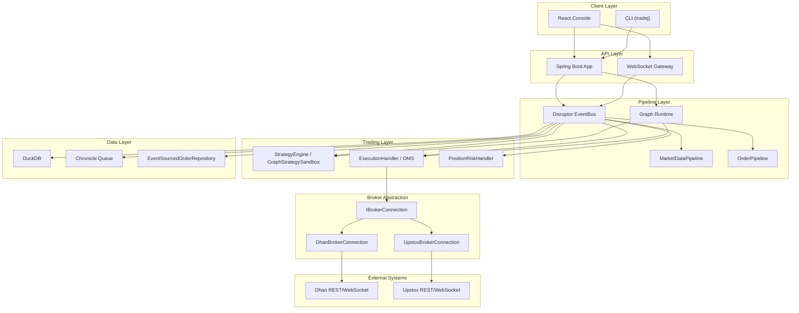
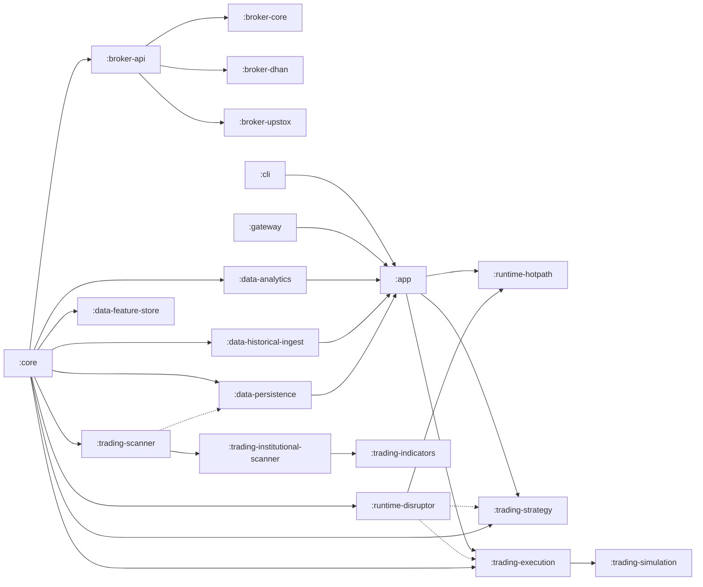

# Development Workflow

<cite>
**Referenced Files in This Document**
- [build.gradle](file://build.gradle)
- [settings.gradle](file://settings.gradle)
- [gradle.properties](file://gradle.properties)
- [README.md](file://README.md)
- [CONFIG.md](file://CONFIG.md)
- [TESTING.md](file://TESTING.md)
- [ARCHITECTURE.md](file://docs/ARCHITECTURE.md)
- [ARCHITECTURE_REPORT.md](file://docs/ARCHITECTURE_REPORT.md)
- [CODEBASE_LEAF_INDEX.md](file://docs/CODEBASE_LEAF_INDEX.md)
- [app/build.gradle](file://app/build.gradle)
- [checkstyle.xml](file://config/checkstyle/checkstyle.xml)
- [pnpm-workspace.yaml](file://pnpm-workspace.yaml)
</cite>

## Table of Contents
1. [Introduction](#introduction)
2. [Project Structure](#project-structure)
3. [Core Components](#core-components)
4. [Architecture Overview](#architecture-overview)
5. [Detailed Component Analysis](#detailed-component-analysis)
6. [Dependency Analysis](#dependency-analysis)
7. [Performance Considerations](#performance-considerations)
8. [Troubleshooting Guide](#troubleshooting-guide)
9. [Conclusion](#conclusion)
10. [Appendices](#appendices)

## Introduction
This document describes the end-to-end development workflow for Trade-J contributors. It explains the codebase structure using the leaf index reference, how to set up the development environment, and how the multi-module Gradle build works. It also covers the development lifecycle from code changes to testing and deployment, with practical examples for common tasks. Guidance is included for working with the hexagonal architecture, module boundaries, and layer separation, along with IDE setup recommendations, code formatting standards, and best practices.

## Project Structure
Trade-J is a multi-module Gradle project organized around a hexagonal architecture with clear layer separation:
- Core domain and pipeline types
- Broker adapters (Dhan, Upstox, ICICI)
- Runtime hot path and Disruptor event bus
- Trading subsystems (strategy, execution, scanner, simulation, indicators)
- Data layer (persistence, feature store, historical ingest, analytics)
- Application, gateway, and CLI
- Pipeline platform and analytics modules
- Node library for DAG nodes

```mermaid
graph TB
ROOT["Root build.gradle<br/>Java 21, Spring Boot 3.4.x, BOM"] --> SETTINGS["settings.gradle<br/>24 subprojects"]
SETTINGS --> CORE[":core"]
SETTINGS --> BROKER_API[":broker-api"]
SETTINGS --> BROKER_CORE[":broker-core"]
SETTINGS --> BROKER_DHAN[":broker-dhan"]
SETTINGS --> BROKER_UPSTOX[":broker-upstox"]
SETTINGS --> BROKER_ICICI[":broker-icici"]
SETTINGS --> RT_DISRUPTOR[":runtime-disruptor"]
SETTINGS --> RT_HOTPATH[":runtime-hotpath"]
SETTINGS --> TRADING_STRAT[":trading-strategy"]
SETTINGS --> TRADING_EXEC[":trading-execution"]
SETTINGS --> TRADING_SCANNER[":trading-scanner"]
SETTINGS --> TRADING_INST[":trading-institutional-scanner"]
SETTINGS --> TRADING_IND[":trading-indicators"]
SETTINGS --> TRADING_SIM[":trading-simulation"]
SETTINGS --> DATA_PERSIST[":data-persistence"]
SETTINGS --> DATA_FEATURE[":data-feature-store"]
SETTINGS --> DATA_INGEST[":data-historical-ingest"]
SETTINGS --> DATA_ANALYTICS[":data-analytics"]
SETTINGS --> PIPE_PLATFORM[":trade-pipeline-platform"]
SETTINGS --> PIPE_RUNTIME[":pipeline-runtime"]
SETTINGS --> PIPE_ANALYTICS[":trade-analytics"]
SETTINGS --> NODE_LIB[":trade-node-library"]
SETTINGS --> APP[":app"]
SETTINGS --> GATEWAY[":gateway"]
SETTINGS --> CLI[":cli"]
APP --> FE["Frontend build integration<br/>Vite + React console"]
```

**Diagram sources**
- [settings.gradle:1-95](file://settings.gradle#L1-L95)
- [build.gradle:1-301](file://build.gradle#L1-L301)
- [app/build.gradle:1-115](file://app/build.gradle#L1-L115)

**Section sources**
- [settings.gradle:1-95](file://settings.gradle#L1-L95)
- [README.md:37-47](file://README.md#L37-L47)
- [ARCHITECTURE.md:24-62](file://docs/ARCHITECTURE.md#L24-L62)

## Core Components
- Core domain and ports define the event model, pipeline graph types, and OMS state machine. See the leaf index for the full package/class inventory.
- Broker adapters implement the IBrokerConnection port for Dhan and Upstox, with shared auth and resilience utilities.
- Runtime hot path and Disruptor event bus provide the high-throughput event pipeline for market data and order events.
- Trading subsystems implement strategy plugins, execution nodes, scanners, and simulation.
- Data layer persists events and features using DuckDB and Chronicle, and ingests historical data.
- Application integrates all modules behind Spring Boot controllers, the WebSocket gateway, and Micrometer metrics.
- Pipeline platform and runtime enable DAG-based composable pipelines alongside the legacy hot path.

Practical references:
- Leaf index by module and package: [CODEBASE_LEAF_INDEX.md](file://docs/CODEBASE_LEAF_INDEX.md)
- Module dependency overview: [ARCHITECTURE_REPORT.md](file://docs/ARCHITECTURE_REPORT.md)

**Section sources**
- [CODEBASE_LEAF_INDEX.md:1-262](file://docs/CODEBASE_LEAF_INDEX.md#L1-L262)
- [ARCHITECTURE_REPORT.md:209-284](file://docs/ARCHITECTURE_REPORT.md#L209-L284)

## Architecture Overview
Trade-J follows a layered, event-driven hexagonal architecture:
- Clients (React console and CLI) communicate with the Spring Boot application and the WebSocket gateway.
- The API layer exposes REST endpoints and orchestrates pipelines.
- The Pipeline layer runs both the legacy hot path (Disruptor ring) and the DAG graph runtime.
- Trading, Execution, and Risk layers process domain events.
- Broker adapters encapsulate external broker APIs behind the IBrokerConnection port.
- The Data layer persists and retrieves events and features.

**Diagram sources**
- [ARCHITECTURE_REPORT.md:288-384](file://docs/ARCHITECTURE_REPORT.md#L288-L384)
- [ARCHITECTURE.md:11-62](file://docs/ARCHITECTURE.md#L11-L62)

**Section sources**
- [ARCHITECTURE.md:11-62](file://docs/ARCHITECTURE.md#L11-L62)
- [ARCHITECTURE_REPORT.md:288-384](file://docs/ARCHITECTURE_REPORT.md#L288-L384)

## Detailed Component Analysis

### Build System and Multi-Module Setup
- Root build defines Java 21 toolchain, Spring dependency management, and shared plugins (SpotBugs, Checkstyle). It registers per-subproject tasks for unit, component, integration, and broker-specific test suites.
- settings.gradle declares 24 subprojects and supports an optional research set enabled via a Gradle property.
- app/build.gradle wires all modules into the Spring Boot application and integrates frontend build via npm/pnpm/Vite.

Key tasks and tags:
- Unit tests: unitTest
- Component tests: componentTest
- Integration tests: integrationTest
- Broker REST: brokerRestTest
- Broker WebSocket: brokerWsTest
- Broker order: brokerOrderTest
- Runtime E2E: runtimeE2eTest
- Preflight: regressionPreflightTest
- Cross-layer: crossLayerRegressionTest
- Full regression: fullRegressionTest

**Section sources**
- [build.gradle:1-301](file://build.gradle#L1-L301)
- [settings.gradle:1-95](file://settings.gradle#L1-L95)
- [app/build.gradle:1-115](file://app/build.gradle#L1-L115)

### Development Environment Setup
- Java 21 is required; the build enforces toolchain and passes JVM args for Chronicle compatibility.
- Gradle properties configure parallel builds and disable build cache for local development.
- Frontend build integration uses pnpm and Vite; the app module compiles and syncs the console into static resources.

Recommended steps:
- Install Java 21 and set JAVA_HOME appropriately.
- Ensure Gradle wrapper is available; use ./gradlew for tasks.
- For frontend development, install pnpm and run frontend tasks as needed.

**Section sources**
- [build.gradle:43-49](file://build.gradle#L43-L49)
- [gradle.properties:1-7](file://gradle.properties#L1-L7)
- [app/build.gradle:52-115](file://app/build.gradle#L52-L115)
- [pnpm-workspace.yaml:1-379](file://pnpm-workspace.yaml#L1-L379)

### Configuration and Spring Profiles
- Profiles control broker type, environment, and runtime storage roots.
- Credential files are gitignored and loaded from config/*.properties and *.txt files.
- Upstox analytics-only mode uses a read-only token for REST market data.

Common commands:
- Default sandbox: ./gradlew :app:bootRun
- Live market data: ./gradlew :app:bootRun --args='--spring.profiles.active=dev-live'
- Production: SPRING_PROFILES_ACTIVE=prod ./gradlew :app:bootRun
- Upstox analytics-only: ./gradlew :app:bootRun --args='--spring.profiles.active=upstox-analytics'

**Section sources**
- [CONFIG.md:1-120](file://CONFIG.md#L1-L120)
- [README.md:5-16](file://README.md#L5-L16)

### Testing Architecture and Lifecycle
- Three-tier test pyramid: unit, component, integration.
- Tagged tests target specific environments and capabilities.
- Regression scripts and parity suites automate end-to-end coverage.

Typical workflow:
- Run unit tests: ./gradlew unitTest
- Run component tests: ./gradlew componentTest
- Run integration tests: ./gradlew integrationTest
- Run full regression: ./scripts/run-full-regression.sh

**Section sources**
- [TESTING.md:1-273](file://TESTING.md#L1-L273)
- [build.gradle:146-301](file://build.gradle#L146-L301)

### Working with Hexagonal Architecture and Module Boundaries
- IBrokerConnection defines the port contract; adapters implement it for Dhan and Upstox.
- Core domain is framework-free and defines events, ports, and pipeline graph types.
- Runtime hot path and Disruptor bus isolate hot-path logic from Spring annotations.
- Data persistence and analytics modules are decoupled from trading logic.

Guidelines:
- Add new capabilities by implementing ports in core and adapting them in broker modules.
- Keep domain logic in :core and avoid framework dependencies.
- Use the DAG runtime for composable pipelines; legacy hot path remains for production wiring.

**Section sources**
- [ARCHITECTURE_REPORT.md:534-691](file://docs/ARCHITECTURE_REPORT.md#L534-L691)
- [ARCHITECTURE.md:196-206](file://docs/ARCHITECTURE.md#L196-L206)

### Practical Development Tasks
- Add a new broker capability:
  - Define a new port in :broker-api.
  - Implement the port in the appropriate adapter (:broker-dhan or :broker-upstox).
  - Wire the adapter in the application configuration.
- Extend the DAG runtime:
  - Create a new PipelineNode in :core or :trade-node-library.
  - Register the node in the pipeline template or graph definition.
- Integrate a new data source:
  - Add a repository in :data-persistence or :data-analytics.
  - Expose a controller in :app if needed.
- Run targeted tests:
  - Broker REST: ./gradlew :app:brokerRestTest
  - Broker WS: ./gradlew :app:brokerWsTest
  - Broker order: ./gradlew :app:brokerOrderTest
  - Runtime E2E: ./gradlew :app:runtimeE2eTest

**Section sources**
- [build.gradle:179-236](file://build.gradle#L179-L236)
- [TESTING.md:12-273](file://TESTING.md#L12-L273)

### Code Navigation Patterns
- Use the leaf index to locate classes by module and package quickly.
- Follow module IDs in settings.gradle to navigate source trees efficiently.
- For frontend assets, note that the React console is built and synced into app/src/main/resources/static/console.

**Section sources**
- [CODEBASE_LEAF_INDEX.md:1-262](file://docs/CODEBASE_LEAF_INDEX.md#L1-L262)
- [settings.gradle:1-95](file://settings.gradle#L1-L95)
- [app/build.gradle:79-102](file://app/build.gradle#L79-L102)

### Debugging Workflows
- Use tagged test tasks to reproduce issues in isolation.
- For live broker debugging, enable verbose logging and run broker-specific suites.
- Use parity suites to compare behavior across broker adapters.

**Section sources**
- [TESTING.md:229-273](file://TESTING.md#L229-L273)

## Dependency Analysis
The module dependency graph shows how core, runtime, trading, data, and application modules depend on each other. Known couplings include:
- :data-persistence → :trading-scanner (scan store models)
- :runtime-disruptor → :trading-execution + :trading-strategy (stage list)

**Diagram sources**
- [ARCHITECTURE_REPORT.md:387-444](file://docs/ARCHITECTURE_REPORT.md#L387-L444)

**Section sources**
- [ARCHITECTURE_REPORT.md:387-444](file://docs/ARCHITECTURE_REPORT.md#L387-L444)

## Performance Considerations
- The hot path isolates critical logic outside Spring to minimize overhead.
- Disruptor ring buffers and sharding can be tuned via properties.
- DuckDB and Chronicle provide efficient persistence for replay and analytics.
- Prefer DAG runtime for composability while validating parity with the hot path.

[No sources needed since this section provides general guidance]

## Troubleshooting Guide
Common issues and remedies:
- Credential errors: verify config/*.properties and *.txt files; use refresh scripts for tokens.
- Live broker connectivity: run broker-specific test tasks and parity suites.
- Frontend build failures: ensure pnpm and Vite are available; rebuild frontend assets.
- Static analysis failures: SpotBugs and Checkstyle are integrated into the check lifecycle; review reports in build/reports.

**Section sources**
- [CONFIG.md:23-47](file://CONFIG.md#L23-L47)
- [TESTING.md:171-194](file://TESTING.md#L171-L194)
- [build.gradle:71-129](file://build.gradle#L71-L129)

## Conclusion
Trade-J’s development workflow centers on a robust multi-module Gradle build, clear hexagonal boundaries, and a layered runtime architecture. By following the testing pyramid, leveraging tagged tasks, and adhering to formatting standards, contributors can efficiently implement features, validate behavior, and maintain system reliability.

[No sources needed since this section summarizes without analyzing specific files]

## Appendices

### Appendix A: Development Lifecycle Checklist
- Set up Java 21 and Gradle.
- Copy credential examples to gitignored property files.
- Run unit and component tests.
- Execute broker parity suites.
- Build and run the app with desired profile.
- Verify frontend assets are synced.

**Section sources**
- [CONFIG.md:36-47](file://CONFIG.md#L36-L47)
- [TESTING.md:64-81](file://TESTING.md#L64-L81)
- [README.md:5-16](file://README.md#L5-L16)
- [app/build.gradle:79-102](file://app/build.gradle#L79-L102)

### Appendix B: Code Formatting Standards
- Checkstyle enforces Google Java Style with project-specific allowances for CLI annotations, magic numbers, and enum switches.
- Use @SuppressWarnings selectively for justified exemptions.

**Section sources**
- [checkstyle.xml:1-151](file://config/checkstyle/checkstyle.xml#L1-L151)