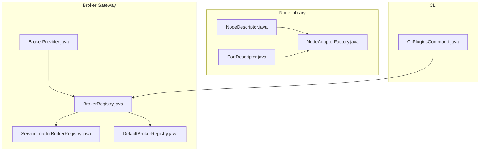
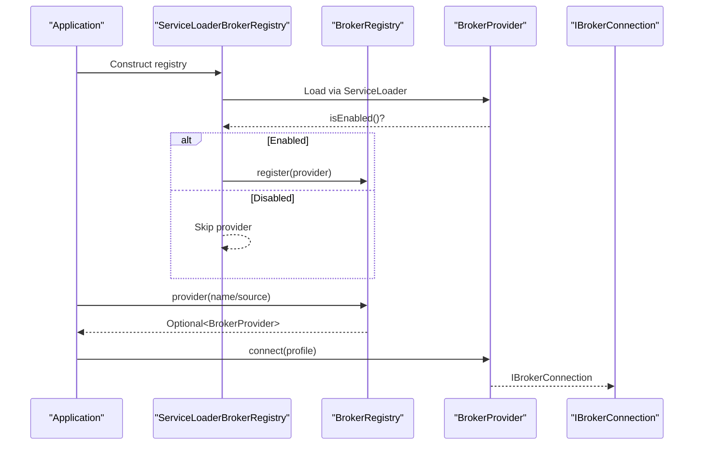
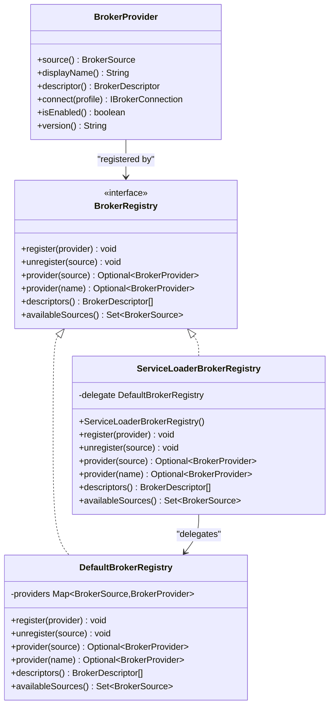
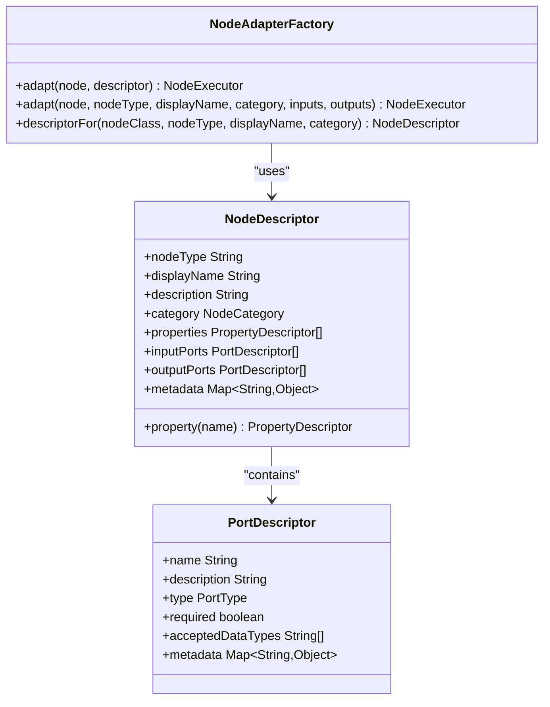
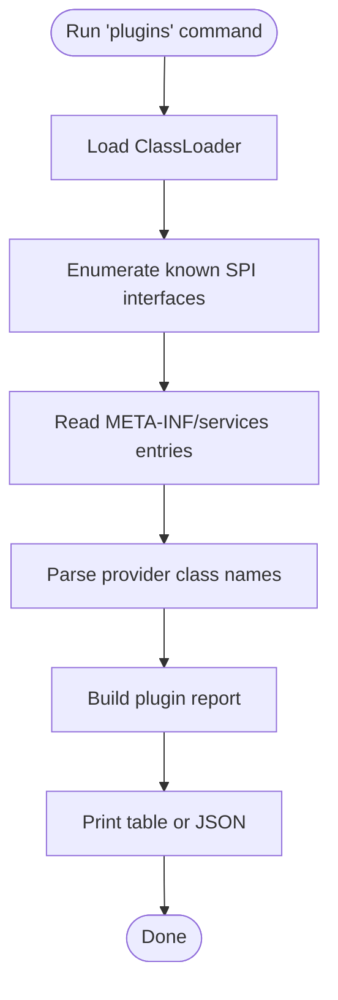
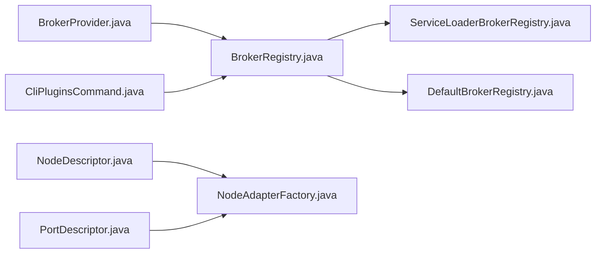

# Extension Development

<cite>
**Referenced Files in This Document**
- [BrokerProvider.java](file://broker-gateway/src/main/java/com/tradej/brokergateway/spi/BrokerProvider.java)
- [BrokerRegistry.java](file://broker-gateway/src/main/java/com/tradej/brokergateway/spi/BrokerRegistry.java)
- [ServiceLoaderBrokerRegistry.java](file://broker-gateway/src/main/java/com/tradej/brokergateway/spi/ServiceLoaderBrokerRegistry.java)
- [DefaultBrokerRegistry.java](file://broker-gateway/src/main/java/com/tradej/brokergateway/spi/DefaultBrokerRegistry.java)
- [NodeDescriptor.java](file://nodes/trade-node-library/src/main/java/com/tradej/node/NodeDescriptor.java)
- [PortDescriptor.java](file://nodes/trade-node-library/src/main/java/com/tradej/node/PortDescriptor.java)
- [NodeAdapterFactory.java](file://nodes/trade-node-library/src/main/java/com/tradej/node/adapter/NodeAdapterFactory.java)
- [CliPluginsCommand.java](file://cli/src/main/java/com/tradej/cli/command/CliPluginsCommand.java)
- [PIPELINE_DESIGN.md](file://docs/PIPELINE_DESIGN.md)
- [BROKER_GATEWAY_ARCHITECTURE_REVIEW_2026-06-06.md](file://docs/reports/BROKER_GATEWAY_ARCHITECTURE_REVIEW_2026-06-06.md)
- [PLUGIN_MARKET_UTILS_REVIEW_2026-06-06.md](file://docs/reports/PLUGIN_MARKET_UTILS_REVIEW_2026-06-06.md)
- [ARCHITECTURE.md](file://docs/ARCHITECTURE.md)
- [META-INF/services/com.tradej.brokergateway.spi.BrokerProvider](file://broker-gateway/src/main/resources/META-INF/services/com.tradej.brokergateway.spi.BrokerProvider)
</cite>

## Table of Contents
1. [Introduction](#introduction)
2. [Project Structure](#project-structure)
3. [Core Components](#core-components)
4. [Architecture Overview](#architecture-overview)
5. [Detailed Component Analysis](#detailed-component-analysis)
6. [Dependency Analysis](#dependency-analysis)
7. [Performance Considerations](#performance-considerations)
8. [Troubleshooting Guide](#troubleshooting-guide)
9. [Conclusion](#conclusion)
10. [Appendices](#appendices)

## Introduction
This document explains how to extend Trade-J with new broker integrations and custom pipeline nodes. It focuses on the Service Provider Interfaces (SPIs) that power plugin-style extensibility, including the BrokerProvider SPI for broker adapters and the NodeDescriptor contract for pipeline nodes. You will learn how to implement new broker adapters, develop custom trading nodes, and extend the pipeline platform. The guide also covers configuration, lifecycle management, dependency injection patterns, and testing strategies for extensions.

## Project Structure
Trade-J organizes extension points across several modules:
- Broker gateway SPI and registries under broker-gateway
- Node library and adapter factory under nodes/trade-node-library
- Pipeline platform and runtime under pipeline
- CLI utilities for discovering SPI registrations under cli

**Diagram sources**
- [BrokerProvider.java:19-59](file://broker-gateway/src/main/java/com/tradej/brokergateway/spi/BrokerProvider.java#L19-L59)
- [BrokerRegistry.java:12-43](file://broker-gateway/src/main/java/com/tradej/brokergateway/spi/BrokerRegistry.java#L12-L43)
- [ServiceLoaderBrokerRegistry.java:17-74](file://broker-gateway/src/main/java/com/tradej/brokergateway/spi/ServiceLoaderBrokerRegistry.java#L17-L74)
- [DefaultBrokerRegistry.java:15-61](file://broker-gateway/src/main/java/com/tradej/brokergateway/spi/DefaultBrokerRegistry.java#L15-L61)
- [NodeDescriptor.java:10-36](file://nodes/trade-node-library/src/main/java/com/tradej/node/NodeDescriptor.java#L10-L36)
- [PortDescriptor.java:10-30](file://nodes/trade-node-library/src/main/java/com/tradej/node/PortDescriptor.java#L10-L30)
- [NodeAdapterFactory.java:24-64](file://nodes/trade-node-library/src/main/java/com/tradej/node/adapter/NodeAdapterFactory.java#L24-L64)
- [CliPluginsCommand.java:19-74](file://cli/src/main/java/com/tradej/cli/command/CliPluginsCommand.java#L19-L74)

**Section sources**
- [BrokerProvider.java:19-59](file://broker-gateway/src/main/java/com/tradej/brokergateway/spi/BrokerProvider.java#L19-L59)
- [BrokerRegistry.java:12-43](file://broker-gateway/src/main/java/com/tradej/brokergateway/spi/BrokerRegistry.java#L12-L43)
- [ServiceLoaderBrokerRegistry.java:17-74](file://broker-gateway/src/main/java/com/tradej/brokergateway/spi/ServiceLoaderBrokerRegistry.java#L17-L74)
- [DefaultBrokerRegistry.java:15-61](file://broker-gateway/src/main/java/com/tradej/brokergateway/spi/DefaultBrokerRegistry.java#L15-L61)
- [NodeDescriptor.java:10-36](file://nodes/trade-node-library/src/main/java/com/tradej/node/NodeDescriptor.java#L10-L36)
- [PortDescriptor.java:10-30](file://nodes/trade-node-library/src/main/java/com/tradej/node/PortDescriptor.java#L10-L30)
- [NodeAdapterFactory.java:24-64](file://nodes/trade-node-library/src/main/java/com/tradej/node/adapter/NodeAdapterFactory.java#L24-L64)
- [CliPluginsCommand.java:19-74](file://cli/src/main/java/com/tradej/cli/command/CliPluginsCommand.java#L19-L74)

## Core Components
- BrokerProvider SPI: Defines how broker adapters register capabilities, display identity, and produce connections from broker profiles.
- BrokerRegistry: Central registry for broker providers, supporting lookup by source or name.
- ServiceLoaderBrokerRegistry: Discovers providers via Java’s ServiceLoader mechanism.
- NodeDescriptor: Contract for self-describing pipeline nodes, including properties, ports, and metadata.
- NodeAdapterFactory: Adapts BasePipelineNode instances to NodeExecutor using a NodeDescriptor.

These components enable modular, pluggable extensions without hardcoding broker or node implementations.

**Section sources**
- [BrokerProvider.java:19-59](file://broker-gateway/src/main/java/com/tradej/brokergateway/spi/BrokerProvider.java#L19-L59)
- [BrokerRegistry.java:12-43](file://broker-gateway/src/main/java/com/tradej/brokergateway/spi/BrokerRegistry.java#L12-L43)
- [ServiceLoaderBrokerRegistry.java:17-74](file://broker-gateway/src/main/java/com/tradej/brokergateway/spi/ServiceLoaderBrokerRegistry.java#L17-L74)
- [DefaultBrokerRegistry.java:15-61](file://broker-gateway/src/main/java/com/tradej/brokergateway/spi/DefaultBrokerRegistry.java#L15-L61)
- [NodeDescriptor.java:10-36](file://nodes/trade-node-library/src/main/java/com/tradej/node/NodeDescriptor.java#L10-L36)
- [NodeAdapterFactory.java:24-64](file://nodes/trade-node-library/src/main/java/com/tradej/node/adapter/NodeAdapterFactory.java#L24-L64)

## Architecture Overview
Trade-J uses SPIs to decouple core systems from broker implementations and node libraries. Broker providers are discovered at runtime and registered centrally. Pipeline nodes expose descriptors that define configuration and connectivity, enabling dynamic composition and UI rendering.

**Diagram sources**
- [ServiceLoaderBrokerRegistry.java:24-31](file://broker-gateway/src/main/java/com/tradej/brokergateway/spi/ServiceLoaderBrokerRegistry.java#L24-L31)
- [BrokerRegistry.java:17-32](file://broker-gateway/src/main/java/com/tradej/brokergateway/spi/BrokerRegistry.java#L17-L32)
- [BrokerProvider.java:42-42](file://broker-gateway/src/main/java/com/tradej/brokergateway/spi/BrokerProvider.java#L42-L42)

## Detailed Component Analysis

### BrokerProvider SPI and BrokerRegistry
- BrokerProvider defines the contract for broker adapters, including identification, display name, descriptor, connection creation, and optional enablement/version hooks.
- BrokerRegistry provides registration and lookup by source or name.
- ServiceLoaderBrokerRegistry integrates with Java’s ServiceLoader to auto-discover providers and delegates registration to a DefaultBrokerRegistry.

**Diagram sources**
- [BrokerProvider.java:19-59](file://broker-gateway/src/main/java/com/tradej/brokergateway/spi/BrokerProvider.java#L19-L59)
- [BrokerRegistry.java:12-43](file://broker-gateway/src/main/java/com/tradej/brokergateway/spi/BrokerRegistry.java#L12-L43)
- [ServiceLoaderBrokerRegistry.java:17-74](file://broker-gateway/src/main/java/com/tradej/brokergateway/spi/ServiceLoaderBrokerRegistry.java#L17-L74)
- [DefaultBrokerRegistry.java:15-61](file://broker-gateway/src/main/java/com/tradej/brokergateway/spi/DefaultBrokerRegistry.java#L15-L61)

Implementation steps for a new broker adapter:
1. Implement BrokerProvider in your module.
2. Provide a BrokerDescriptor describing capabilities and metadata.
3. Implement connect(profile) to return an IBrokerConnection configured from the broker-specific profile.
4. Optionally override isEnabled() and version().
5. Register your provider via META-INF/services/com.tradej.brokergateway.spi.BrokerProvider.

Testing strategies:
- Use ServiceLoaderBrokerRegistry with an explicit provider collection for deterministic tests.
- Validate provider registration and descriptor exposure through BrokerRegistry methods.
- Mock IBrokerConnection to isolate provider logic.

**Section sources**
- [BrokerProvider.java:19-59](file://broker-gateway/src/main/java/com/tradej/brokergateway/spi/BrokerProvider.java#L19-L59)
- [BrokerRegistry.java:12-43](file://broker-gateway/src/main/java/com/tradej/brokergateway/spi/BrokerRegistry.java#L12-L43)
- [ServiceLoaderBrokerRegistry.java:17-74](file://broker-gateway/src/main/java/com/tradej/brokergateway/spi/ServiceLoaderBrokerRegistry.java#L17-L74)
- [DefaultBrokerRegistry.java:15-61](file://broker-gateway/src/main/java/com/tradej/brokergateway/spi/DefaultBrokerRegistry.java#L15-L61)
- [META-INF/services/com.tradej.brokergateway.spi.BrokerProvider](file://broker-gateway/src/main/resources/META-INF/services/com.tradej.brokergateway.spi.BrokerProvider)

### Pipeline Nodes: NodeDescriptor and NodeAdapterFactory
- NodeDescriptor encapsulates a node’s type, display name, description, category, properties, input/output ports, and metadata.
- PortDescriptor describes typed ports with acceptance rules and metadata.
- NodeAdapterFactory adapts BasePipelineNode instances to NodeExecutor using a NodeDescriptor, enabling consistent execution and introspection.

**Diagram sources**
- [NodeDescriptor.java:10-36](file://nodes/trade-node-library/src/main/java/com/tradej/node/NodeDescriptor.java#L10-L36)
- [PortDescriptor.java:10-30](file://nodes/trade-node-library/src/main/java/com/tradej/node/PortDescriptor.java#L10-L30)
- [NodeAdapterFactory.java:24-64](file://nodes/trade-node-library/src/main/java/com/tradej/node/adapter/NodeAdapterFactory.java#L24-L64)

Implementation steps for a custom trading node:
1. Define a BasePipelineNode subclass implementing your processing logic.
2. Create a NodeDescriptor describing inputs, outputs, and configurable properties.
3. Use NodeAdapterFactory.adapt(...) to obtain a NodeExecutor for runtime execution.
4. Expose the descriptor via NodeAdapterFactory.descriptorFor(...) for platform integration.

Testing strategies:
- Use NodeAdapterFactory.adapt with a minimal descriptor to validate execution paths.
- Verify property and port validation through PropertyDescriptor and PortDescriptor semantics.
- Integrate with pipeline runtime services to test end-to-end behavior.

**Section sources**
- [NodeDescriptor.java:10-36](file://nodes/trade-node-library/src/main/java/com/tradej/node/NodeDescriptor.java#L10-L36)
- [PortDescriptor.java:10-30](file://nodes/trade-node-library/src/main/java/com/tradej/node/PortDescriptor.java#L10-L30)
- [NodeAdapterFactory.java:24-64](file://nodes/trade-node-library/src/main/java/com/tradej/node/adapter/NodeAdapterFactory.java#L24-L64)

### CLI Discovery of SPI Registrations
The CLI provides a command to enumerate all SPI provider registrations on the classpath, aiding verification of broker and indicator plugins.

**Diagram sources**
- [CliPluginsCommand.java:53-74](file://cli/src/main/java/com/tradej/cli/command/CliPluginsCommand.java#L53-L74)

**Section sources**
- [CliPluginsCommand.java:19-74](file://cli/src/main/java/com/tradej/cli/command/CliPluginsCommand.java#L19-L74)

## Dependency Analysis
Broker and node extensions depend on core contracts defined in SPI interfaces and platform models. The broker gateway registry pattern centralizes provider discovery and registration, while the node library provides a standardized descriptor model for pipeline composition.

**Diagram sources**
- [BrokerProvider.java:19-59](file://broker-gateway/src/main/java/com/tradej/brokergateway/spi/BrokerProvider.java#L19-L59)
- [BrokerRegistry.java:12-43](file://broker-gateway/src/main/java/com/tradej/brokergateway/spi/BrokerRegistry.java#L12-L43)
- [ServiceLoaderBrokerRegistry.java:17-74](file://broker-gateway/src/main/java/com/tradej/brokergateway/spi/ServiceLoaderBrokerRegistry.java#L17-L74)
- [DefaultBrokerRegistry.java:15-61](file://broker-gateway/src/main/java/com/tradej/brokergateway/spi/DefaultBrokerRegistry.java#L15-L61)
- [NodeDescriptor.java:10-36](file://nodes/trade-node-library/src/main/java/com/tradej/node/NodeDescriptor.java#L10-L36)
- [PortDescriptor.java:10-30](file://nodes/trade-node-library/src/main/java/com/tradej/node/PortDescriptor.java#L10-L30)
- [NodeAdapterFactory.java:24-64](file://nodes/trade-node-library/src/main/java/com/tradej/node/adapter/NodeAdapterFactory.java#L24-L64)
- [CliPluginsCommand.java:19-74](file://cli/src/main/java/com/tradej/cli/command/CliPluginsCommand.java#L19-L74)

**Section sources**
- [BrokerProvider.java:19-59](file://broker-gateway/src/main/java/com/tradej/brokergateway/spi/BrokerProvider.java#L19-L59)
- [BrokerRegistry.java:12-43](file://broker-gateway/src/main/java/com/tradej/brokergateway/spi/BrokerRegistry.java#L12-L43)
- [ServiceLoaderBrokerRegistry.java:17-74](file://broker-gateway/src/main/java/com/tradej/brokergateway/spi/ServiceLoaderBrokerRegistry.java#L17-L74)
- [DefaultBrokerRegistry.java:15-61](file://broker-gateway/src/main/java/com/tradej/brokergateway/spi/DefaultBrokerRegistry.java#L15-L61)
- [NodeDescriptor.java:10-36](file://nodes/trade-node-library/src/main/java/com/tradej/node/NodeDescriptor.java#L10-L36)
- [PortDescriptor.java:10-30](file://nodes/trade-node-library/src/main/java/com/tradej/node/PortDescriptor.java#L10-L30)
- [NodeAdapterFactory.java:24-64](file://nodes/trade-node-library/src/main/java/com/tradej/node/adapter/NodeAdapterFactory.java#L24-L64)
- [CliPluginsCommand.java:19-74](file://cli/src/main/java/com/tradej/cli/command/CliPluginsCommand.java#L19-L74)

## Performance Considerations
- BrokerProvider.isEnabled() and lazy connection creation reduce unnecessary initialization costs and network calls during startup.
- Use ServiceLoaderBrokerRegistry with explicit provider collections in tests to avoid loading unused providers.
- Keep NodeDescriptor property and port definitions concise to minimize UI rendering overhead.

[No sources needed since this section provides general guidance]

## Troubleshooting Guide
Common issues and resolutions:
- Silent provider drops: Ensure all configured broker profiles have registered providers; consider logging warnings for missing providers.
- Eager network calls in constructors: Prefer lazy connection proxies or explicit connect() methods to defer network initialization.
- Hand-maintained capability descriptors: Derive capability metadata from port interfaces to prevent drift across modules.
- Runtime disabling: Add configuration flags to control provider activation without code changes.

**Section sources**
- [BROKER_GATEWAY_ARCHITECTURE_REVIEW_2026-06-06.md:200-223](file://docs/reports/BROKER_GATEWAY_ARCHITECTURE_REVIEW_2026-06-06.md#L200-L223)
- [PLUGIN_MARKET_UTILS_REVIEW_2026-06-06.md:101-133](file://docs/reports/PLUGIN_MARKET_UTILS_REVIEW_2026-06-06.md#L101-L133)
- [PLUGIN_MARKET_UTILS_REVIEW_2026-06-06.md:386-393](file://docs/reports/PLUGIN_MARKET_UTILS_REVIEW_2026-06-06.md#L386-L393)
- [PLUGIN_MARKET_UTILS_REVIEW_2026-06-06.md:417-434](file://docs/reports/PLUGIN_MARKET_UTILS_REVIEW_2026-06-06.md#L417-L434)

## Conclusion
Trade-J’s extension model leverages SPIs and standardized descriptors to enable modular broker integrations and custom pipeline nodes. By adhering to BrokerProvider and NodeDescriptor contracts, implementing lazy initialization, and using CLI tools for verification, you can build robust, maintainable extensions that integrate seamlessly with the platform.

[No sources needed since this section summarizes without analyzing specific files]

## Appendices

### Step-by-Step: New Broker Adapter
- Implement BrokerProvider in your module.
- Provide a BrokerDescriptor describing capabilities and metadata.
- Implement connect(profile) to return an IBrokerConnection configured from the broker-specific profile.
- Optionally override isEnabled() and version().
- Register via META-INF/services/com.tradej.brokergateway.spi.BrokerProvider.
- Validate with CLI plugins command and tests using ServiceLoaderBrokerRegistry with explicit providers.

**Section sources**
- [BrokerProvider.java:19-59](file://broker-gateway/src/main/java/com/tradej/brokergateway/spi/BrokerProvider.java#L19-L59)
- [ServiceLoaderBrokerRegistry.java:17-74](file://broker-gateway/src/main/java/com/tradej/brokergateway/spi/ServiceLoaderBrokerRegistry.java#L17-L74)
- [META-INF/services/com.tradej.brokergateway.spi.BrokerProvider](file://broker-gateway/src/main/resources/META-INF/services/com.tradej.brokergateway.spi.BrokerProvider)

### Step-by-Step: Custom Trading Node
- Define a BasePipelineNode subclass implementing your processing logic.
- Create a NodeDescriptor describing inputs, outputs, and configurable properties.
- Use NodeAdapterFactory.adapt(...) to obtain a NodeExecutor for runtime execution.
- Expose the descriptor via NodeAdapterFactory.descriptorFor(...) for platform integration.

**Section sources**
- [NodeDescriptor.java:10-36](file://nodes/trade-node-library/src/main/java/com/tradej/node/NodeDescriptor.java#L10-L36)
- [PortDescriptor.java:10-30](file://nodes/trade-node-library/src/main/java/com/tradej/node/PortDescriptor.java#L10-L30)
- [NodeAdapterFactory.java:24-64](file://nodes/trade-node-library/src/main/java/com/tradej/node/adapter/NodeAdapterFactory.java#L24-L64)

### Configuration and Lifecycle
- Broker profiles are supplied to BrokerProvider.connect(profile).
- Providers can be disabled via isEnabled() or configuration flags (recommended fixes).
- Connections should be lazily initialized to avoid hidden side effects during construction.

**Section sources**
- [BrokerProvider.java:42-50](file://broker-gateway/src/main/java/com/tradej/brokergateway/spi/BrokerProvider.java#L42-L50)
- [PLUGIN_MARKET_UTILS_REVIEW_2026-06-06.md:101-133](file://docs/reports/PLUGIN_MARKET_UTILS_REVIEW_2026-06-06.md#L101-L133)
- [PLUGIN_MARKET_UTILS_REVIEW_2026-06-06.md:417-434](file://docs/reports/PLUGIN_MARKET_UTILS_REVIEW_2026-06-06.md#L417-L434)

### Testing Strategies
- Use ServiceLoaderBrokerRegistry with explicit provider collections for deterministic tests.
- Validate provider registration and descriptor exposure through BrokerRegistry methods.
- Mock IBrokerConnection to isolate provider logic.
- Use CLI plugins command to verify SPI registrations.

**Section sources**
- [ServiceLoaderBrokerRegistry.java:36-43](file://broker-gateway/src/main/java/com/tradej/brokergateway/spi/ServiceLoaderBrokerRegistry.java#L36-L43)
- [CliPluginsCommand.java:19-74](file://cli/src/main/java/com/tradej/cli/command/CliPluginsCommand.java#L19-L74)