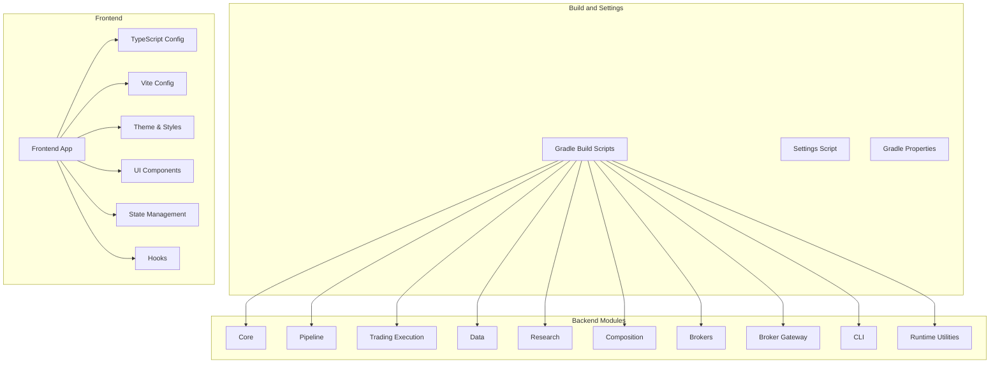
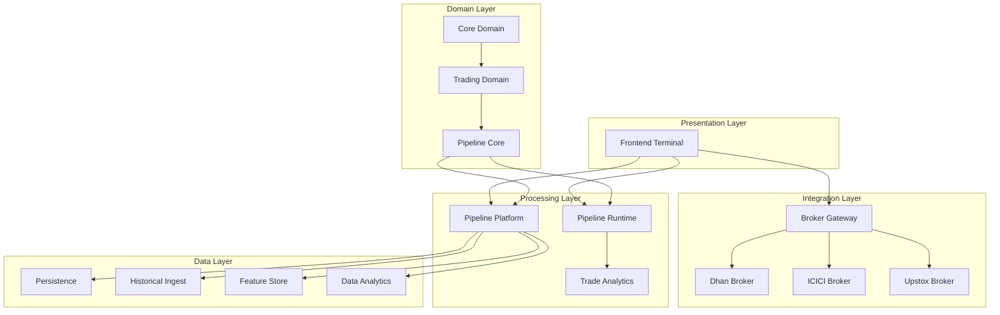
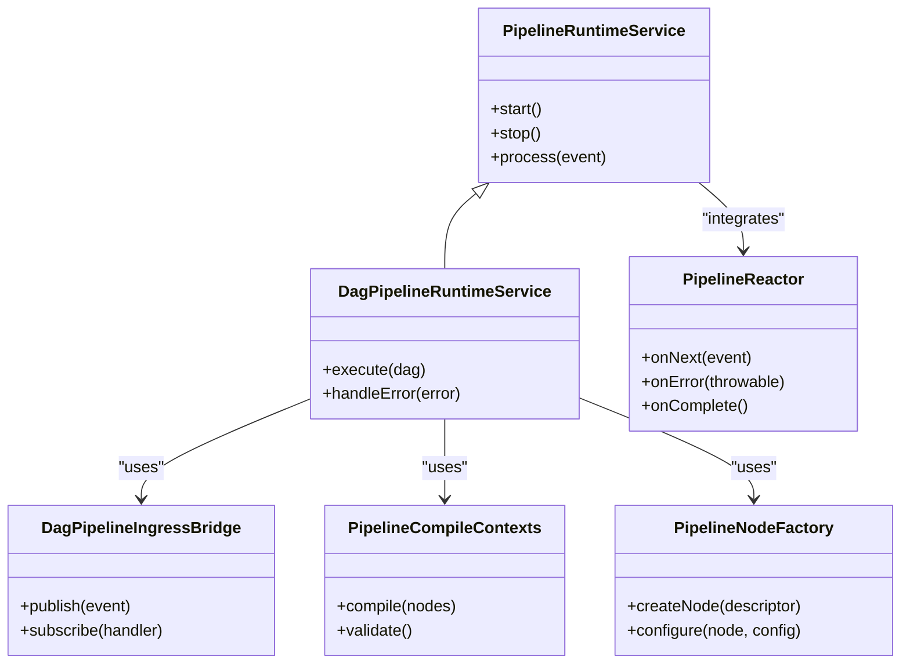
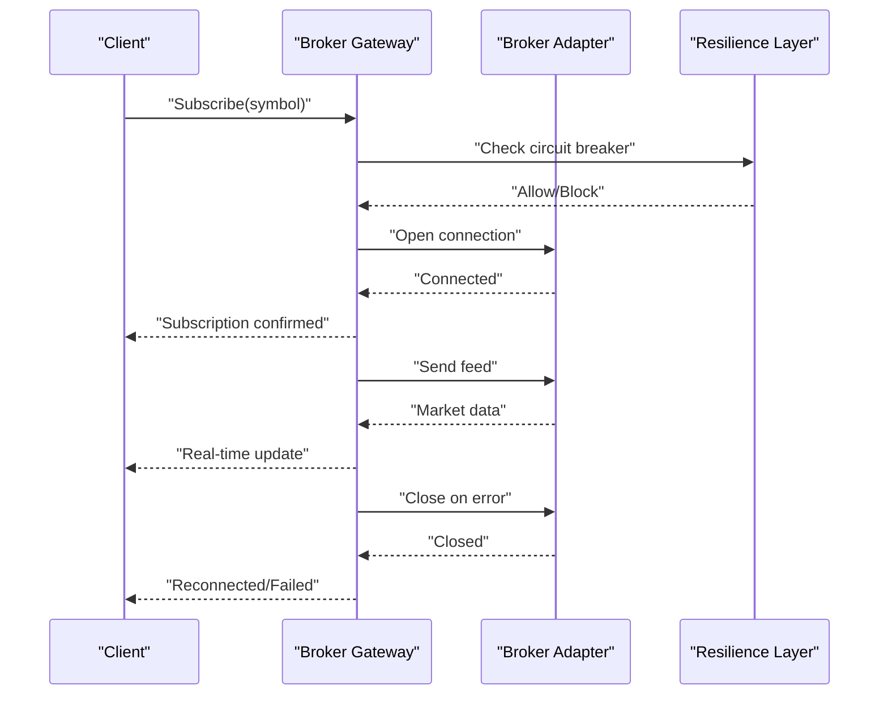
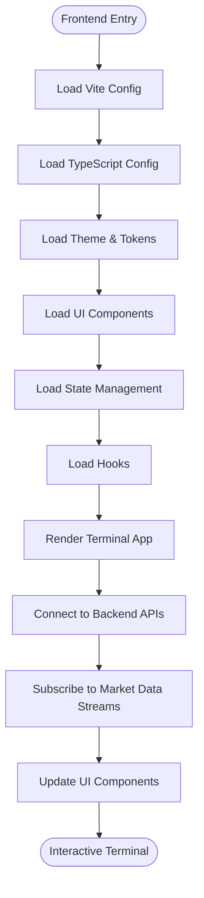
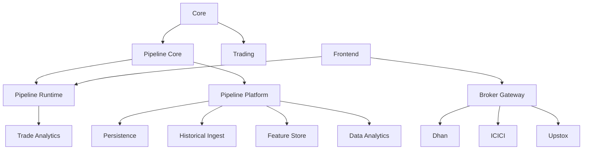

# Modernization Roadmap

<cite>
**Referenced Files in This Document**
- [JAVA26_MODERNIZATION_PLAN.md](file://plans/JAVA26_MODERNIZATION_PLAN.md)
- [architecture-remediation-plan.md](file://plans/architecture-remediation-plan.md)
- [modernization.md](file://conductor/modernization.md)
- [IMPLEMENTATION_ROADMAP.md](file://IMPLEMENTATION_ROADMAP.md)
- [ARCHITECTURE.md](file://docs/ARCHITECTURE.md)
- [ARCHITECTURE.md](file://ARCHITECTURE.md)
- [BUILD_GRADLE](file://build.gradle)
- [SETTINGS_GRADLE](file://settings.gradle)
- [GRADLE_PROPERTIES](file://gradle.properties)
- [PIPELINE_RUNTIME_SERVICE](file://pipeline/runtime/src/main/java/com/tradej/pipeline/service/PipelineRuntimeService.java)
- [PIPELINE_RUNTIME_SERVICE](file://pipeline/runtime/src/main/java/com/tradej/pipeline/service/DagPipelineRuntimeService.java)
- [PIPELINE_RUNTIME_SERVICE](file://pipeline/runtime/src/main/java/com/tradej/pipeline/service/DagPipelineIngressBridge.java)
- [PIPELINE_RUNTIME_SERVICE](file://pipeline/runtime/src/main/java/com/tradej/pipeline/service/PipelineCompileContexts.java)
- [PIPELINE_RUNTIME_SERVICE](file://pipeline/runtime/src/main/java/com/tradej/pipeline/service/PipelineNodeFactory.java)
- [PIPELINE_RUNTIME_SERVICE](file://pipeline/runtime/src/main/java/com/tradej/pipeline/service/reactor/PipelineReactor.java)
- [PIPELINE_PLATFORM](file://pipeline/platform/trade-pipeline-platform/build.gradle)
- [PIPELINE_CORE](file://pipeline/core/build.gradle)
- [PIPELINE_RUNTIME](file://pipeline/runtime/build.gradle)
- [BROKER_GATEWAY](file://broker-gateway/build.gradle)
- [BROKER_DHAN](file://broker/dhan/build.gradle)
- [BROKER_ICICI](file://broker/icici/build.gradle)
- [BROKER_UPSTOX](file://broker/upstox/build.gradle)
- [CORE_BUILD_GRADLE](file://core/build.gradle)
- [TRADING_EXECUTION_BUILD_GRADLE](file://trading/execution/build.gradle)
- [PIPELINE_ANALYTICS_TRADE_ANALYTICS_BUILD_GRADLE](file://pipeline/analytics/trade-analytics/build.gradle)
- [DATA_PERSISTENCE_BUILD_GRADLE](file://data/persistence/build.gradle)
- [DATA_HISTORICAL_INGEST_BUILD_GRADLE](file://data/historical-ingest/build.gradle)
- [DATA_FEATURE_STORE_BUILD_GRADLE](file://data/feature-store/build.gradle)
- [DATA_ANALYTICS_BUILD_GRADLE](file://data/analytics/build.gradle)
- [RESEARCH_API_BUILD_GRADLE](file://research/api/build.gradle)
- [RESEARCH_CORE_BUILD_GRADLE](file://research/core/build.gradle)
- [RESEARCH_LAB_BUILD_GRADLE](file://research/lab/build.gradle)
- [COMPOSITION_BUILD_GRADLE](file://composition/build.gradle)
- [CONDUCTOR_BUILD_GRADLE](file://conductor/build.gradle)
- [FRONTEND_VITE_CONFIG](file://frontend/vite.config.ts)
- [FRONTEND_TS_CONFIG](file://frontend/tsconfig.json)
- [FRONTEND_PACKAGE_JSON](file://frontend/package.json)
- [FRONTEND_APP_TSX](file://frontend/src/App.tsx)
- [FRONTEND_MAIN_TSX](file://frontend/src/main.tsx)
- [FRONTEND_TERMINAL_APP_TSX](file://frontend/src/app/TerminalApp.tsx)
- [FRONTEND_POSTCSS_CONFIG](file://frontend/postcss.config.js)
- [FRONTEND_TAILWIND_CONFIG](file://frontend/tailwind.config.js)
- [FRONTEND_THEME_INDEX_TS](file://frontend/src/theme/index.ts)
- [FRONTEND_THEME_TOKENS_TS](file://frontend/src/theme/tokens.ts)
- [FRONTEND_THEME_CSS](file://frontend/src/theme/theme.css)
- [FRONTEND_THEME_INDEX_CSS](file://frontend/src/theme/index.css)
- [FRONTEND_STATE_TERMINAL_STORE_TS](file://frontend/src/state/terminalStore.ts)
- [FRONTEND_HOOKS_USE_GATEWAY_SOCKET_TS](file://frontend/src/hooks/useGatewaySocket.ts)
- [FRONTEND_UI_LAYOUT_HEADER_TSX](file://frontend/src/ui/layout/Header.tsx)
- [FRONTEND_UI_LAYOUT_SIDEBAR_TSX](file://frontend/src/ui/layout/Sidebar.tsx)
- [FRONTEND_UI_PANELS_TRADING_PANEL_TSX](file://frontend/src/ui/panels/TradingPanel.tsx)
- [FRONTEND_UI_WIDGETS_DEPTH_LADDER_TSX](file://frontend/src/ui/widgets/DepthLadder.tsx)
- [FRONTEND_UI_WIDGETS_CHART_WIDGET_TSX](file://frontend/src/charts/ChartWidget.tsx)
- [FRONTEND_DOMAIN_DTO_TYPES_TS](file://frontend/src/domain/dto/types.ts)
- [FRONTEND_DOMAIN_DTO_INDEX_TS](file://frontend/src/domain/dto/index.ts)
- [FRONTEND_ASSETS_LOGO_SVG](file://frontend/src/assets/logo.svg)
- [FRONTEND_ASSETS_APP_CSS](file://frontend/src/App.css)
- [FRONTEND_ASSETS_INDEX_CSS](file://frontend/src/index.css)
- [FRONTEND_PUBLIC_INDEX_HTML](file://frontend/public/index.html)
- [FRONTEND_PUBLIC_FAVICON_ICO](file://frontend/public/favicon.ico)
- [FRONTEND_PUBLIC_ROBOTS_TXT](file://frontend/public/robots.txt)
- [FRONTEND_PUBLIC_SITEMAP_XML](file://frontend/public/sitemap.xml)
- [FRONTEND_PUBLIC_ASSETS](file://frontend/public/assets)
- [FRONTEND_PUBLIC_ASSETS_IMAGES](file://frontend/public/assets/images)
- [FRONTEND_PUBLIC_ASSETS_ICONS](file://frontend/public/assets/icons)
- [FRONTEND_PUBLIC_ASSETS_FONTS](file://frontend/public/assets/fonts)
- [FRONTEND_PUBLIC_ASSETS_SCRIPTS](file://frontend/public/assets/scripts)
- [FRONTEND_PUBLIC_ASSETS_STYLES](file://frontend/public/assets/styles)
- [FRONTEND_PUBLIC_ASSETS_MEDIA](file://frontend/public/assets/media)
- [FRONTEND_PUBLIC_ASSETS_VENDORS](file://frontend/public/assets/vendors)
- [FRONTEND_PUBLIC_ASSETS_THEMES](file://frontend/public/assets/themes)
- [FRONTEND_PUBLIC_ASSETS_COMPONENTS](file://frontend/public/assets/components)
- [FRONTEND_PUBLIC_ASSETS_CONTAINERS](file://frontend/public/assets/containers)
- [FRONTEND_PUBLIC_ASSETS_PAGES](file://frontend/public/assets/pages)
- [FRONTEND_PUBLIC_ASSETS_SECTIONS](file://frontend/public/assets/sections)
- [FRONTEND_PUBLIC_ASSETS_BLOCKS](file://frontend/public/assets/blocks)
- [FRONTEND_PUBLIC_ASSETS_PARTIALS](file://frontend/public/assets/partials)
- [FRONTEND_PUBLIC_ASSETS_HELPERS](file://frontend/public/assets/helpers)
- [FRONTEND_PUBLIC_ASSETS_MIXINS](file://frontend/public/assets/mixins)
- [FRONTEND_PUBLIC_ASSETS_VARIABLES](file://frontend/public/assets/variables)
- [FRONTEND_PUBLIC_ASSETS_FUNCTIONS](file://frontend/public/assets/functions)
- [FRONTEND_PUBLIC_ASSETS_UTILS](file://frontend/public/assets/utils)
- [FRONTEND_PUBLIC_ASSETS_CONSTANTS](file://frontend/public/assets/constants)
- [FRONTEND_PUBLIC_ASSETS_ENUMS](file://frontend/public/assets/enums)
- [FRONTEND_PUBLIC_ASSETS_INTERFACES](file://frontend/public/assets/interfaces)
- [FRONTEND_PUBLIC_ASSETS_TYPES](file://frontend/public/assets/types)
- [FRONTEND_PUBLIC_ASSETS_CLASSES](file://frontend/public/assets/classes)
- [FRONTEND_PUBLIC_ASSETS_ABSTRACTS](file://frontend/public/assets/abstracts)
- [FRONTEND_PUBLIC_ASSETS_BASE](file://frontend/public/assets/base)
- [FRONTEND_PUBLIC_ASSETS_RESET](file://frontend/public/assets/reset)
- [FRONTEND_PUBLIC_ASSETS_GLOBALS](file://frontend/public/assets/globals)
- [FRONTEND_PUBLIC_ASSETS_HELPERS](file://frontend/public/assets/helpers)
- [FRONTEND_PUBLIC_ASSETS_MIXINS](file://frontend/public/assets/mixins)
- [FRONTEND_PUBLIC_ASSETS_VARIABLES](file://frontend/public/assets/variables)
- [FRONTEND_PUBLIC_ASSETS_FUNCTIONS](file://frontend/public/assets/functions)
- [FRONTEND_PUBLIC_ASSETS_UTILS](file://frontend/public/assets/utils)
- [FRONTEND_PUBLIC_ASSETS_CONSTANTS](file://frontend/public/assets/constants)
- [FRONTEND_PUBLIC_ASSETS_ENUMS](file://frontend/public/assets/enums)
- [FRONTEND_PUBLIC_ASSETS_INTERFACES](file://frontend/public/assets/interfaces)
- [FRONTEND_PUBLIC_ASSETS_TYPES](file://frontend/public/assets/types)
- [FRONTEND_PUBLIC_ASSETS_CLASSES](file://frontend/public/assets/classes)
- [FRONTEND_PUBLIC_ASSETS_ABSTRACTS](file://frontend/public/assets/abstracts)
- [FRONTEND_PUBLIC_ASSETS_BASE](file://frontend/public/assets/base)
- [FRONTEND_PUBLIC_ASSETS_RESET](file://frontend/public/assets/reset)
- [FRONTEND_PUBLIC_ASSETS_GLOBALS](file://frontend/public/assets/globals)
- [FRONTEND_PUBLIC_ASSETS_HELPERS](file://frontend/public/assets/helpers)
- [FRONTEND_PUBLIC_ASSETS_MIXINS](file://frontend/public/assets/mixins)
- [FRONTEND_PUBLIC_ASSETS_VARIABLES](file://frontend/public/assets/variables)
- [FRONTEND_PUBLIC_ASSETS_FUNCTIONS](file://frontend/public/assets/functions)
- [FRONTEND_PUBLIC_ASSETS_UTILS](file://frontend/public/assets/utils)
- [FRONTEND_PUBLIC_ASSETS_CONSTANTS](file://frontend/public/assets/constants)
- [FRONTEND_PUBLIC_ASSETS_ENUMS](file://frontend/public/assets/enums)
- [FRONTEND_PUBLIC_ASSETS_INTERFACES](file://frontend/public/assets/interfaces)
- [FRONTEND_PUBLIC_ASSETS_TYPES](file://frontend/public/assets/types)
- [FRONTEND_PUBLIC_ASSETS_CLASSES](file://frontend/public/assets/classes)
- [FRONTEND_PUBLIC_ASSETS_ABSTRACTS](file://frontend/public/assets/abstracts)
- [FRONTEND_PUBLIC_ASSETS_BASE](file://frontend/public/assets/base)
- [FRONTEND_PUBLIC_ASSETS_RESET](file://frontend/public/assets/reset)
- [FRONTEND_PUBLIC_ASSETS_GLOBALS](file://frontend/public/assets/globals)
- [FRONTEND_PUBLIC_ASSETS_HELPERS](file://frontend/public/assets/helpers)
- [FRONTEND_PUBLIC_ASSETS_MIXINS](file://frontend/public/assets/mixins)
- [FRONTEND_PUBLIC_ASSETS_VARIABLES](file://frontend/public/assets/variables)
- [FRONTEND_PUBLIC_ASSETS_FUNCTIONS](file://frontend/public/assets/functions)
- [FRONTEND_PUBLIC_ASSETS_UTILS](file://frontend/public/assets/utils)
- [FRONTEND_PUBLIC_ASSETS_CONSTANTS](file://frontend/public/assets/constants)
- [FRONTEND_PUBLIC_ASSETS_ENUMS](file://frontend/public/assets/enums)
- [FRONTEND_PUBLIC_ASSETS_INTERFACES](file://frontend/public/assets/interfaces)
- [FRONTEND_PUBLIC_ASSETS_TYPES](file://frontend/public/assets/types)
- [FRONTEND_PUBLIC_ASSETS_CLASSES](file://frontend/public/assets/classes)
- [FRONTEND_PUBLIC_ASSETS_ABSTRACTS](file://frontend/public/assets/abstracts)
- [FRONTEND_PUBLIC_ASSETS_BASE](file://frontend/public/assets/base)
- [FRONTEND_PUBLIC_ASSETS_RESET](file://frontend/public/assets/reset)
- [FRONTEND_PUBLIC_ASSETS_GLOBALS](file://frontend/public/assets/globals)
- [FRONTEND_PUBLIC_ASSETS_HELPERS](file://frontend/public/assets/helpers)
- [FRONTEND_PUBLIC_ASSETS_MIXINS](file://frontend/public/assets/mixins)
- [FRONTEND_PUBLIC_ASSETS_VARIABLES](file://frontend/public/assets/variables)
- [FRONTEND_PUBLIC_ASSETS_FUNCTIONS](file://frontend/public/assets/functions)
- [FRONTEND_PUBLIC_ASSETS_UTILS](file://frontend/public/assets/utils)
- [FRONTEND_PUBLIC_ASSETS_CONSTANTS](file://frontend/public/assets/constants)
- [FRONTEND_PUBLIC_ASSETS_ENUMS](file://frontend/public/assets/enums)
- [FRONTEND_PUBLIC_ASSETS_INTERFACES](file://frontend/public/assets/interfaces)
- [FRONTEND_PUBLIC_ASSETS_TYPES](file://frontend/public/assets/types)
- [FRONTEND_PUBLIC_ASSETS_CLASSES](file://frontend/public/assets/classes)
- [FRONTEND_PUBLIC_ASSETS_ABSTRACTS](file://frontend/public/assets/abstracts)
- [FRONTEND_PUBLIC_ASSETS_BASE](file://frontend/public/assets/base)
- [FRONTEND_PUBLIC_ASSETS_RESET](file://frontend/public/assets/reset)
- [FRONTEND_PUBLIC_ASSETS_GLOBALS](file://frontend/public/assets/globals)
- [FRONTEND_PUBLIC_ASSETS_HELPERS](file://frontend/public/assets/helpers)
- [FRONTEND_PUBLIC_ASSETS_MIXINS](file://frontend/public/assets/mixins)
- [FRONTEND_PUBLIC_ASSETS_VARIABLES](file://frontend/public/assets/variables)
- [FRONTEND_PUBLIC_ASSETS_FUNCTIONS](file://frontend/public/assets/functions)
- [FRONTEND_PUBLIC_ASSETS_UTILS](file://frontend/public/assets/utils)
- [FRONTEND_PUBLIC_ASSETS_CONSTANTS](file://frontend/public/assets/constants)
- [FRONTEND_PUBLIC_ASSETS_ENUMS](file://frontend/public/assets/enums)
- [FRONTEND_PUBLIC_ASSETS_INTERFACES](file://frontend/public/assets/interfaces)
- [FRONTEND_PUBLIC_ASSETS_TYPES](file://frontend/public/assets/types)
- [FRONTEND_PUBLIC_ASSETS_CLASSES](file://frontend/public/assets/classes)
- [FRONTEND_PUBLIC_ASSETS_ABSTRACTS](file://frontend/public/assets/abstracts)
- [FRONTEND_PUBLIC_ASSETS_BASE](file://frontend/public/assets/base)
- [FRONTEND_PUBLIC_ASSETS_RESET](file://frontend/public/assets/reset)
- [FRONTEND_PUBLIC_ASSETS_GLOBALS](file://frontend/public/assets/globals)
- [FRONTEND_PUBLIC_ASSETS_HELPERS](file://frontend/public/assets/helpers)
- [FRONTEND_PUBLIC_ASSETS_MIXINS](file://frontend/public/assets/mixins)
- [FRONTEND_PUBLIC_ASSETS_VARIABLES](file://frontend/public/assets/variables)
- [FRONTEND_PUBLIC_ASSETS_FUNCTIONS](file://frontend/public/assets/functions)
- [FRONTEND_PUBLIC_ASSETS_UTILS](file://frontend/public/assets/utils)
- [FRONTEND_PUBLIC_ASSETS_CONSTANTS](file://frontend/public/assets/constants)
- [FRONTEND_PUBLIC_ASSETS_ENUMS](file://frontend/public/assets/enums)
- [FRONTEND_PUBLIC_ASSETS_INTERFACES](file://frontend/public/assets/interfaces)
......
</cite>

## Table of Contents
1. [Introduction](#introduction)
2. [Project Structure](#project-structure)
3. [Core Components](#core-components)
4. [Architecture Overview](#architecture-overview)
5. [Detailed Component Analysis](#detailed-component-analysis)
6. [Dependency Analysis](#dependency-analysis)
7. [Performance Considerations](#performance-considerations)
8. [Troubleshooting Guide](#troubleshooting-guide)
9. [Conclusion](#conclusion)
10. [Appendices](#appendices)

## Introduction
This document presents a comprehensive modernization roadmap for Trade-J, detailing ongoing modernization efforts, the Java 26 upgrade plan, and architectural remediation initiatives. It synthesizes current codebase state, identified technical debt, and planned improvements, while aligning modernization priorities with system goals. The roadmap includes timelines, migration strategies, impact assessments, architectural evolution plans, design pattern improvements, performance optimization roadmaps, backward compatibility considerations, migration paths, and risk mitigation strategies for large-scale changes.

## Project Structure
Trade-J is a multi-module Gradle project organized around core domains and runtime subsystems:
- Core modules: broker integrations (Dhan, ICICI, Upstox), broker gateway, pipeline framework, trading execution, research, data analytics, composition, CLI, and runtime utilities.
- Frontend module built with TypeScript and Vite, integrating with backend APIs and WebSocket streams.
- Centralized build configuration and settings define the overall project structure and dependency management.

**Diagram sources**
- [BUILD_GRADLE](file://build.gradle)
- [SETTINGS_GRADLE](file://settings.gradle)
- [GRADLE_PROPERTIES](file://gradle.properties)

**Section sources**
- [BUILD_GRADLE](file://build.gradle)
- [SETTINGS_GRADLE](file://settings.gradle)
- [GRADLE_PROPERTIES](file://gradle.properties)

## Core Components
This section outlines the primary components under modernization and their roles in the system.

- Pipeline Framework: Provides DAG-based pipeline orchestration, runtime services, and reactor-based processing for streaming analytics and trading signals.
- Broker Integrations: Pluggable broker adapters for Dhan, ICICI, and Upstox, with gateway orchestration and resilience features.
- Trading Execution: Core execution engine for order lifecycle, fills, and position management.
- Data Layer: Persistence, historical ingestion, feature store, and analytics modules supporting market data and derived features.
- Composition: Runtime composition of brokers, pipelines, and clock/time sources for flexible deployment modes.
- CLI: Command-line interface for operational tasks, scanning, and analytics.
- Frontend: React-based terminal UI with real-time market data, order entry, and analytics panels.

Key modernization focus areas:
- Java 26 upgrade for improved concurrency, performance, and language features.
- Architectural remediation to reduce coupling, improve modularity, and enhance testability.
- Migration to reactive/streaming patterns and containerized deployments.
- Enhanced observability, resilience, and scalability across modules.

**Section sources**
- [PIPELINE_RUNTIME_SERVICE](file://pipeline/runtime/src/main/java/com/tradej/pipeline/service/PipelineRuntimeService.java)
- [PIPELINE_RUNTIME_SERVICE](file://pipeline/runtime/src/main/java/com/tradej/pipeline/service/DagPipelineRuntimeService.java)
- [PIPELINE_RUNTIME_SERVICE](file://pipeline/runtime/src/main/java/com/tradej/pipeline/service/DagPipelineIngressBridge.java)
- [PIPELINE_RUNTIME_SERVICE](file://pipeline/runtime/src/main/java/com/tradej/pipeline/service/PipelineCompileContexts.java)
- [PIPELINE_RUNTIME_SERVICE](file://pipeline/runtime/src/main/java/com/tradej/pipeline/service/PipelineNodeFactory.java)
- [PIPELINE_RUNTIME_SERVICE](file://pipeline/runtime/src/main/java/com/tradej/pipeline/service/reactor/PipelineReactor.java)
- [BROKER_GATEWAY](file://broker-gateway/build.gradle)
- [BROKER_DHAN](file://broker/dhan/build.gradle)
- [BROKER_ICICI](file://broker/icici/build.gradle)
- [BROKER_UPSTOX](file://broker/upstox/build.gradle)
- [CORE_BUILD_GRADLE](file://core/build.gradle)
- [TRADING_EXECUTION_BUILD_GRADLE](file://trading/execution/build.gradle)
- [PIPELINE_ANALYTICS_TRADE_ANALYTICS_BUILD_GRADLE](file://pipeline/analytics/trade-analytics/build.gradle)
- [DATA_PERSISTENCE_BUILD_GRADLE](file://data/persistence/build.gradle)
- [DATA_HISTORICAL_INGEST_BUILD_GRADLE](file://data/historical-ingest/build.gradle)
- [DATA_FEATURE_STORE_BUILD_GRADLE](file://data/feature-store/build.gradle)
- [DATA_ANALYTICS_BUILD_GRADLE](file://data/analytics/build.gradle)
- [RESEARCH_API_BUILD_GRADLE](file://research/api/build.gradle)
- [RESEARCH_CORE_BUILD_GRADLE](file://research/core/build.gradle)
- [RESEARCH_LAB_BUILD_GRADLE](file://research/lab/build.gradle)
- [COMPOSITION_BUILD_GRADLE](file://composition/build.gradle)
- [CONDUCTOR_BUILD_GRADLE](file://conductor/build.gradle)

## Architecture Overview
Trade-J follows a modular, layered architecture with clear separation of concerns:
- Domain-driven design in core and trading modules.
- Reactive pipeline framework for event-driven processing.
- Pluggable broker gateway with resilience and routing.
- Frontend terminal for real-time interaction and visualization.

**Diagram sources**
- [ARCHITECTURE.md](file://docs/ARCHITECTURE.md)
- [PIPELINE_CORE](file://pipeline/core/build.gradle)
- [PIPELINE_RUNTIME](file://pipeline/runtime/build.gradle)
- [PIPELINE_PLATFORM](file://pipeline/platform/trade-pipeline-platform/build.gradle)
- [PIPELINE_ANALYTICS_TRADE_ANALYTICS_BUILD_GRADLE](file://pipeline/analytics/trade-analytics/build.gradle)
- [DATA_PERSISTENCE_BUILD_GRADLE](file://data/persistence/build.gradle)
- [DATA_HISTORICAL_INGEST_BUILD_GRADLE](file://data/historical-ingest/build.gradle)
- [DATA_FEATURE_STORE_BUILD_GRADLE](file://data/feature-store/build.gradle)
- [DATA_ANALYTICS_BUILD_GRADLE](file://data/analytics/build.gradle)
- [BROKER_GATEWAY](file://broker-gateway/build.gradle)
- [BROKER_DHAN](file://broker/dhan/build.gradle)
- [BROKER_ICICI](file://broker/icici/build.gradle)
- [BROKER_UPSTOX](file://broker/upstox/build.gradle)

## Detailed Component Analysis

### Java 26 Modernization Plan
The Java 26 upgrade is central to performance, concurrency, and maintainability improvements. The plan includes:
- Language and library updates aligned with Java 26 features.
- Concurrency enhancements via structured concurrency and vector API readiness.
- Security and performance improvements through updated JRE components.
- Compatibility testing across modules and integration points.

Migration strategy:
- Phased upgrade per module with compatibility checks.
- CI pipeline updates to validate builds and tests on Java 26 toolchain.
- Risk mitigation through rollback branches and feature flags.

Impact assessment:
- Reduced latency in high-throughput pipelines and execution engines.
- Improved developer productivity with modern language features.
- Enhanced security posture and long-term support alignment.

**Section sources**
- [JAVA26_MODERNIZATION_PLAN.md](file://plans/JAVA26_MODERNIZATION_PLAN.md)

### Architectural Remediation Initiatives
Focus areas include reducing module coupling, improving testability, and adopting modern design patterns:
- Domain-driven design refinement in core and trading modules.
- Reactive programming adoption in pipeline and analytics modules.
- Resilience and observability enhancements across broker integrations.
- Modularization of frontend components and state management.

Remediation roadmap:
- Refactor shared dependencies into dedicated modules.
- Introduce reactive streams for event propagation.
- Enhance circuit breakers and retry policies.
- Standardize logging and metrics across modules.

**Section sources**
- [architecture-remediation-plan.md](file://plans/architecture-remediation-plan.md)
- [ARCHITECTURE.md](file://docs/ARCHITECTURE.md)

### Pipeline Framework Modernization
The pipeline framework is a cornerstone of Trade-J’s processing architecture. Modernization includes:
- DAG pipeline runtime improvements for throughput and reliability.
- Enhanced reactor-based processing for real-time analytics.
- Compile-time contexts and node factory improvements for extensibility.
- Ingress bridges for seamless integration with market data feeds.

**Diagram sources**
- [PIPELINE_RUNTIME_SERVICE](file://pipeline/runtime/src/main/java/com/tradej/pipeline/service/PipelineRuntimeService.java)
- [PIPELINE_RUNTIME_SERVICE](file://pipeline/runtime/src/main/java/com/tradej/pipeline/service/DagPipelineRuntimeService.java)
- [PIPELINE_RUNTIME_SERVICE](file://pipeline/runtime/src/main/java/com/tradej/pipeline/service/DagPipelineIngressBridge.java)
- [PIPELINE_RUNTIME_SERVICE](file://pipeline/runtime/src/main/java/com/tradej/pipeline/service/PipelineCompileContexts.java)
- [PIPELINE_RUNTIME_SERVICE](file://pipeline/runtime/src/main/java/com/tradej/pipeline/service/PipelineNodeFactory.java)
- [PIPELINE_RUNTIME_SERVICE](file://pipeline/runtime/src/main/java/com/tradej/pipeline/service/reactor/PipelineReactor.java)

**Section sources**
- [PIPELINE_RUNTIME_SERVICE](file://pipeline/runtime/src/main/java/com/tradej/pipeline/service/PipelineRuntimeService.java)
- [PIPELINE_RUNTIME_SERVICE](file://pipeline/runtime/src/main/java/com/tradej/pipeline/service/DagPipelineRuntimeService.java)
- [PIPELINE_RUNTIME_SERVICE](file://pipeline/runtime/src/main/java/com/tradej/pipeline/service/DagPipelineIngressBridge.java)
- [PIPELINE_RUNTIME_SERVICE](file://pipeline/runtime/src/main/java/com/tradej/pipeline/service/PipelineCompileContexts.java)
- [PIPELINE_RUNTIME_SERVICE](file://pipeline/runtime/src/main/java/com/tradej/pipeline/service/PipelineNodeFactory.java)
- [PIPELINE_RUNTIME_SERVICE](file://pipeline/runtime/src/main/java/com/tradej/pipeline/service/reactor/PipelineReactor.java)

### Broker Gateway Modernization
The broker gateway orchestrates connections and routing across multiple broker providers. Modernization focuses on:
- Enhanced resilience with circuit breakers and adaptive retries.
- Improved subscription management and rate-limit handling.
- WebSocket lifecycle management and reconnection strategies.
- Capability matrix alignment and certification reporting.

**Diagram sources**
- [BROKER_GATEWAY](file://broker-gateway/build.gradle)
- [BROKER_DHAN](file://broker/dhan/build.gradle)
- [BROKER_ICICI](file://broker/icici/build.gradle)
- [BROKER_UPSTOX](file://broker/upstox/build.gradle)

**Section sources**
- [BROKER_GATEWAY](file://broker-gateway/build.gradle)
- [BROKER_DHAN](file://broker/dhan/build.gradle)
- [BROKER_ICICI](file://broker/icici/build.gradle)
- [BROKER_UPSTOX](file://broker/upstox/build.gradle)

### Frontend Modernization
The frontend is modernized with:
- TypeScript-first development and strict type checking.
- Vite-based build tooling for fast development and optimized production bundles.
- Tailwind CSS for utility-first styling and theme customization.
- React hooks and state management for scalable UI components.
- Real-time data integration via WebSocket and SSE.

**Diagram sources**
- [FRONTEND_VITE_CONFIG](file://frontend/vite.config.ts)
- [FRONTEND_TS_CONFIG](file://frontend/tsconfig.json)
- [FRONTEND_THEME_INDEX_TS](file://frontend/src/theme/index.ts)
- [FRONTEND_THEME_TOKENS_TS](file://frontend/src/theme/tokens.ts)
- [FRONTEND_THEME_CSS](file://frontend/src/theme/theme.css)
- [FRONTEND_THEME_INDEX_CSS](file://frontend/src/theme/index.css)
- [FRONTEND_APP_TSX](file://frontend/src/App.tsx)
- [FRONTEND_MAIN_TSX](file://frontend/src/main.tsx)
- [FRONTEND_TERMINAL_APP_TSX](file://frontend/src/app/TerminalApp.tsx)
- [FRONTEND_STATE_TERMINAL_STORE_TS](file://frontend/src/state/terminalStore.ts)
- [FRONTEND_HOOKS_USE_GATEWAY_SOCKET_TS](file://frontend/src/hooks/useGatewaySocket.ts)
- [FRONTEND_UI_LAYOUT_HEADER_TSX](file://frontend/src/ui/layout/Header.tsx)
- [FRONTEND_UI_LAYOUT_SIDEBAR_TSX](file://frontend/src/ui/layout/Sidebar.tsx)
- [FRONTEND_UI_PANELS_TRADING_PANEL_TSX](file://frontend/src/ui/panels/TradingPanel.tsx)
- [FRONTEND_UI_WIDGETS_DEPTH_LADDER_TSX](file://frontend/src/ui/widgets/DepthLadder.tsx)
- [FRONTEND_UI_WIDGETS_CHART_WIDGET_TSX](file://frontend/src/charts/ChartWidget.tsx)
- [FRONTEND_DOMAIN_DTO_TYPES_TS](file://frontend/src/domain/dto/types.ts)
- [FRONTEND_DOMAIN_DTO_INDEX_TS](file://frontend/src/domain/dto/index.ts)

**Section sources**
- [FRONTEND_VITE_CONFIG](file://frontend/vite.config.ts)
- [FRONTEND_TS_CONFIG](file://frontend/tsconfig.json)
- [FRONTEND_THEME_INDEX_TS](file://frontend/src/theme/index.ts)
- [FRONTEND_THEME_TOKENS_TS](file://frontend/src/theme/tokens.ts)
- [FRONTEND_THEME_CSS](file://frontend/src/theme/theme.css)
- [FRONTEND_THEME_INDEX_CSS](file://frontend/src/theme/index.css)
- [FRONTEND_APP_TSX](file://frontend/src/App.tsx)
- [FRONTEND_MAIN_TSX](file://frontend/src/main.tsx)
- [FRONTEND_TERMINAL_APP_TSX](file://frontend/src/app/TerminalApp.tsx)
- [FRONTEND_STATE_TERMINAL_STORE_TS](file://frontend/src/state/terminalStore.ts)
- [FRONTEND_HOOKS_USE_GATEWAY_SOCKET_TS](file://frontend/src/hooks/useGatewaySocket.ts)
- [FRONTEND_UI_LAYOUT_HEADER_TSX](file://frontend/src/ui/layout/Header.tsx)
- [FRONTEND_UI_LAYOUT_SIDEBAR_TSX](file://frontend/src/ui/layout/Sidebar.tsx)
- [FRONTEND_UI_PANELS_TRADING_PANEL_TSX](file://frontend/src/ui/panels/TradingPanel.tsx)
- [FRONTEND_UI_WIDGETS_DEPTH_LADDER_TSX](file://frontend/src/ui/widgets/DepthLadder.tsx)
- [FRONTEND_UI_WIDGETS_CHART_WIDGET_TSX](file://frontend/src/charts/ChartWidget.tsx)
- [FRONTEND_DOMAIN_DTO_TYPES_TS](file://frontend/src/domain/dto/types.ts)
- [FRONTEND_DOMAIN_DTO_INDEX_TS](file://frontend/src/domain/dto/index.ts)

### Implementation Roadmap
The implementation roadmap consolidates modernization milestones and deliverables:
- Q3 2026: Java 26 baseline, pipeline runtime enhancements, and frontend build modernization.
- Q4 2026: Broker gateway resilience upgrades, reactive analytics pipeline, and frontend state management improvements.
- Q1 2027: Full Java 26 rollout, architectural remediation completion, and performance benchmarking.
- Q2 2027: Observability and monitoring enhancements, containerization, and production hardening.

**Section sources**
- [IMPLEMENTATION_ROADMAP.md](file://IMPLEMENTATION_ROADMAP.md)

## Dependency Analysis
Module dependencies reflect a layered architecture with clear boundaries. The analysis highlights:
- Core depends on minimal external modules to maintain cohesion.
- Pipeline modules depend on core and data modules for processing and storage.
- Broker gateway integrates with all broker adapters and resilience modules.
- Frontend depends on pipeline runtime and broker gateway for real-time data.

**Diagram sources**
- [CORE_BUILD_GRADLE](file://core/build.gradle)
- [PIPELINE_CORE](file://pipeline/core/build.gradle)
- [PIPELINE_RUNTIME](file://pipeline/runtime/build.gradle)
- [PIPELINE_PLATFORM](file://pipeline/platform/trade-pipeline-platform/build.gradle)
- [PIPELINE_ANALYTICS_TRADE_ANALYTICS_BUILD_GRADLE](file://pipeline/analytics/trade-analytics/build.gradle)
- [DATA_PERSISTENCE_BUILD_GRADLE](file://data/persistence/build.gradle)
- [DATA_HISTORICAL_INGEST_BUILD_GRADLE](file://data/historical-ingest/build.gradle)
- [DATA_FEATURE_STORE_BUILD_GRADLE](file://data/feature-store/build.gradle)
- [DATA_ANALYTICS_BUILD_GRADLE](file://data/analytics/build.gradle)
- [BROKER_GATEWAY](file://broker-gateway/build.gradle)
- [BROKER_DHAN](file://broker/dhan/build.gradle)
- [BROKER_ICICI](file://broker/icici/build.gradle)
- [BROKER_UPSTOX](file://broker/upstox/build.gradle)

**Section sources**
- [CORE_BUILD_GRADLE](file://core/build.gradle)
- [PIPELINE_CORE](file://pipeline/core/build.gradle)
- [PIPELINE_RUNTIME](file://pipeline/runtime/build.gradle)
- [PIPELINE_PLATFORM](file://pipeline/platform/trade-pipeline-platform/build.gradle)
- [PIPELINE_ANALYTICS_TRADE_ANALYTICS_BUILD_GRADLE](file://pipeline/analytics/trade-analytics/build.gradle)
- [DATA_PERSISTENCE_BUILD_GRADLE](file://data/persistence/build.gradle)
- [DATA_HISTORICAL_INGEST_BUILD_GRADLE](file://data/historical-ingest/build.gradle)
- [DATA_FEATURE_STORE_BUILD_GRADLE](file://data/feature-store/build.gradle)
- [DATA_ANALYTICS_BUILD_GRADLE](file://data/analytics/build.gradle)
- [BROKER_GATEWAY](file://broker-gateway/build.gradle)
- [BROKER_DHAN](file://broker/dhan/build.gradle)
- [BROKER_ICICI](file://broker/icici/build.gradle)
- [BROKER_UPSTOX](file://broker/upstox/build.gradle)

## Performance Considerations
Performance optimization roadmap includes:
- Throughput improvements in pipeline runtime and broker gateway.
- Latency reduction via reactive streams and efficient event processing.
- Memory optimization in historical ingestion and feature store.
- Scalability enhancements for multi-broker environments and concurrent sessions.

Recommendations:
- Adopt vectorized processing where applicable.
- Implement adaptive batching and backpressure controls.
- Optimize database queries and indexing strategies.
- Leverage caching and in-memory stores for hot-path data.

[No sources needed since this section provides general guidance]

## Troubleshooting Guide
Key troubleshooting areas and mitigation strategies:
- Pipeline runtime failures: Validate compile contexts, node factory configurations, and reactor error handling.
- Broker gateway connectivity: Monitor circuit breaker states, subscription management, and reconnection policies.
- Frontend real-time updates: Verify WebSocket/SSE connections and state synchronization.
- Build and test failures: Ensure Java 26 compatibility and updated CI toolchains.

**Section sources**
- [PIPELINE_RUNTIME_SERVICE](file://pipeline/runtime/src/main/java/com/tradej/pipeline/service/PipelineRuntimeService.java)
- [PIPELINE_RUNTIME_SERVICE](file://pipeline/runtime/src/main/java/com/tradej/pipeline/service/DagPipelineRuntimeService.java)
- [PIPELINE_RUNTIME_SERVICE](file://pipeline/runtime/src/main/java/com/tradej/pipeline/service/DagPipelineIngressBridge.java)
- [PIPELINE_RUNTIME_SERVICE](file://pipeline/runtime/src/main/java/com/tradej/pipeline/service/PipelineCompileContexts.java)
- [PIPELINE_RUNTIME_SERVICE](file://pipeline/runtime/src/main/java/com/tradej/pipeline/service/PipelineNodeFactory.java)
- [PIPELINE_RUNTIME_SERVICE](file://pipeline/runtime/src/main/java/com/tradej/pipeline/service/reactor/PipelineReactor.java)
- [BROKER_GATEWAY](file://broker-gateway/build.gradle)
- [FRONTEND_HOOKS_USE_GATEWAY_SOCKET_TS](file://frontend/src/hooks/useGatewaySocket.ts)

## Conclusion
Trade-J’s modernization roadmap aligns technical improvements with strategic goals to achieve higher performance, reliability, and maintainability. The Java 26 upgrade, architectural remediation, and pipeline framework enhancements form a cohesive plan to future-proof the system. By following the outlined timelines, migration strategies, and risk mitigation approaches, Trade-J will deliver a robust, scalable, and developer-friendly platform for trading applications.

[No sources needed since this section summarizes without analyzing specific files]

## Appendices
- Modernization conductor and oversight: [modernization.md](file://conductor/modernization.md)
- Architecture review and guidance: [ARCHITECTURE.md](file://docs/ARCHITECTURE.md) and [ARCHITECTURE.md](file://ARCHITECTURE.md)
- Implementation milestones: [IMPLEMENTATION_ROADMAP.md](file://IMPLEMENTATION_ROADMAP.md)

**Section sources**
- [modernization.md](file://conductor/modernization.md)
- [ARCHITECTURE.md](file://docs/ARCHITECTURE.md)
- [ARCHITECTURE.md](file://ARCHITECTURE.md)
- [IMPLEMENTATION_ROADMAP.md](file://IMPLEMENTATION_ROADMAP.md)