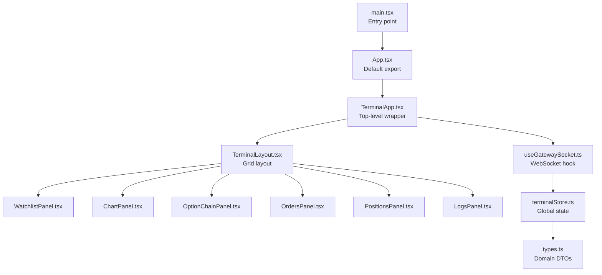
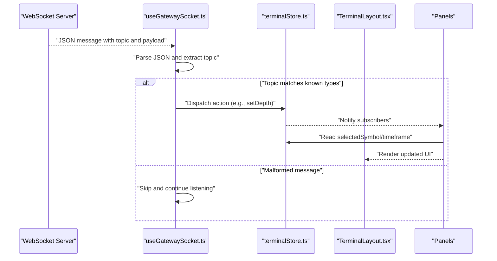
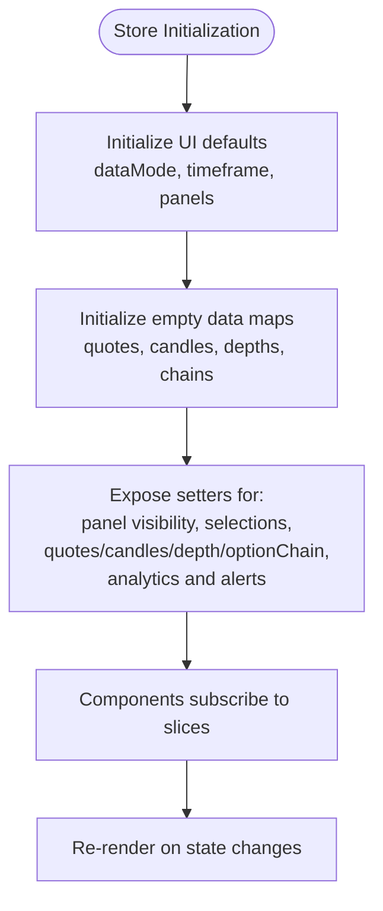
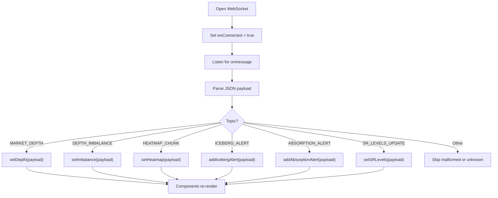
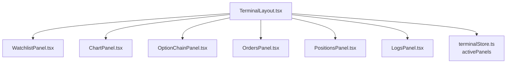
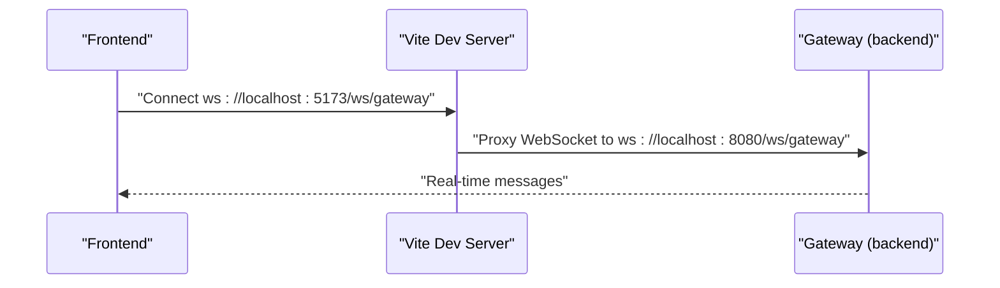
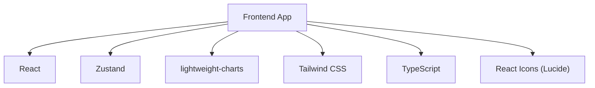

# Frontend Trading Terminal

<cite>
**Referenced Files in This Document**
- [App.tsx](file://frontend/src/App.tsx)
- [main.tsx](file://frontend/src/main.tsx)
- [TerminalApp.tsx](file://frontend/src/app/TerminalApp.tsx)
- [TerminalLayout.tsx](file://frontend/src/ui/layout/TerminalLayout.tsx)
- [ChartPanel.tsx](file://frontend/src/ui/panels/ChartPanel.tsx)
- [WatchlistPanel.tsx](file://frontend/src/ui/panels/WatchlistPanel.tsx)
- [OptionChainPanel.tsx](file://frontend/src/ui/panels/OptionChainPanel.tsx)
- [useGatewaySocket.ts](file://frontend/src/hooks/useGatewaySocket.ts)
- [terminalStore.ts](file://frontend/src/state/terminalStore.ts)
- [types.ts](file://frontend/src/domain/dto/types.ts)
- [package.json](file://frontend/package.json)
- [vite.config.ts](file://frontend/vite.config.ts)
</cite>

## Table of Contents
1. [Introduction](#introduction)
2. [Project Structure](#project-structure)
3. [Core Components](#core-components)
4. [Architecture Overview](#architecture-overview)
5. [Detailed Component Analysis](#detailed-component-analysis)
6. [Dependency Analysis](#dependency-analysis)
7. [Performance Considerations](#performance-considerations)
8. [Troubleshooting Guide](#troubleshooting-guide)
9. [Conclusion](#conclusion)

## Introduction
This document describes the frontend trading terminal built with React and TypeScript. It explains the application architecture, component hierarchy, state management patterns, WebSocket integration for real-time data streaming, and message routing. It also documents trading components such as the order entry interface, market data visualization, and portfolio management panels. Practical examples of component usage, state management, and WebSocket communication are included, along with guidelines for component development, styling, and performance optimization.

## Project Structure
The frontend is organized around a clean separation of concerns:
- Application bootstrap and entry point
- Top-level application wrapper and layout
- Domain DTOs for market data and alerts
- Zustand-based global state store
- React hooks for WebSocket integration
- UI panels and widgets for charts, watchlist, option chain, orders, positions, and logs
- Build configuration with Vite and proxy settings

**Diagram sources**
- [main.tsx:1-11](file://frontend/src/main.tsx#L1-L11)
- [App.tsx:1-6](file://frontend/src/App.tsx#L1-L6)
- [TerminalApp.tsx:1-8](file://frontend/src/app/TerminalApp.tsx#L1-L8)
- [TerminalLayout.tsx:1-73](file://frontend/src/ui/layout/TerminalLayout.tsx#L1-L73)
- [ChartPanel.tsx:1-16](file://frontend/src/ui/panels/ChartPanel.tsx#L1-L16)
- [WatchlistPanel.tsx:1-6](file://frontend/src/ui/panels/WatchlistPanel.tsx#L1-L6)
- [OptionChainPanel.tsx:1-16](file://frontend/src/ui/panels/OptionChainPanel.tsx#L1-L16)
- [useGatewaySocket.ts:1-63](file://frontend/src/hooks/useGatewaySocket.ts#L1-L63)
- [terminalStore.ts:1-170](file://frontend/src/state/terminalStore.ts#L1-L170)
- [types.ts:1-128](file://frontend/src/domain/dto/types.ts#L1-L128)

**Section sources**
- [main.tsx:1-11](file://frontend/src/main.tsx#L1-L11)
- [App.tsx:1-6](file://frontend/src/App.tsx#L1-L6)
- [TerminalApp.tsx:1-8](file://frontend/src/app/TerminalApp.tsx#L1-L8)
- [TerminalLayout.tsx:1-73](file://frontend/src/ui/layout/TerminalLayout.tsx#L1-L73)
- [ChartPanel.tsx:1-16](file://frontend/src/ui/panels/ChartPanel.tsx#L1-L16)
- [WatchlistPanel.tsx:1-6](file://frontend/src/ui/panels/WatchlistPanel.tsx#L1-L6)
- [OptionChainPanel.tsx:1-16](file://frontend/src/ui/panels/OptionChainPanel.tsx#L1-L16)
- [useGatewaySocket.ts:1-63](file://frontend/src/hooks/useGatewaySocket.ts#L1-L63)
- [terminalStore.ts:1-170](file://frontend/src/state/terminalStore.ts#L1-L170)
- [types.ts:1-128](file://frontend/src/domain/dto/types.ts#L1-L128)

## Core Components
- Application bootstrap: Initializes React root and renders the top-level App component.
- TerminalApp: Sets up the WebSocket connection and renders the layout.
- TerminalLayout: Defines the responsive grid layout with collapsible panels.
- Panels: Dedicated containers for watchlist, charts, option chain, orders, positions, and logs.
- Global state: Centralized store for UI state, selected symbol/timeframe, and market data keyed by symbol.
- WebSocket hook: Manages WebSocket lifecycle and routes messages to state updates.
- DTOs: Strongly typed domain models for quotes, candles, option chains, market depth, and alerts.

Practical usage examples:
- To subscribe to market depth updates, the WebSocket hook parses incoming messages and dispatches to the store via a setter for market depth.
- To render charts, the ChartPanel delegates to a candlestick widget and accesses the store for selected symbol and timeframe.
- To manage visibility of panels, the layout reads from the store and conditionally renders panels.

**Section sources**
- [main.tsx:1-11](file://frontend/src/main.tsx#L1-L11)
- [TerminalApp.tsx:1-8](file://frontend/src/app/TerminalApp.tsx#L1-L8)
- [TerminalLayout.tsx:1-73](file://frontend/src/ui/layout/TerminalLayout.tsx#L1-L73)
- [ChartPanel.tsx:1-16](file://frontend/src/ui/panels/ChartPanel.tsx#L1-L16)
- [WatchlistPanel.tsx:1-6](file://frontend/src/ui/panels/WatchlistPanel.tsx#L1-L6)
- [OptionChainPanel.tsx:1-16](file://frontend/src/ui/panels/OptionChainPanel.tsx#L1-L16)
- [terminalStore.ts:1-170](file://frontend/src/state/terminalStore.ts#L1-L170)
- [useGatewaySocket.ts:1-63](file://frontend/src/hooks/useGatewaySocket.ts#L1-L63)
- [types.ts:1-128](file://frontend/src/domain/dto/types.ts#L1-L128)

## Architecture Overview
The frontend follows a unidirectional data flow:
- WebSocket messages arrive and are parsed by the hook.
- The hook dispatches actions to the global store.
- UI components subscribe to relevant slices of the store and re-render.
- Layout composes panels and widgets, delegating data access to the store.

**Diagram sources**
- [useGatewaySocket.ts:24-53](file://frontend/src/hooks/useGatewaySocket.ts#L24-L53)
- [terminalStore.ts:118-136](file://frontend/src/state/terminalStore.ts#L118-L136)
- [TerminalLayout.tsx:9-71](file://frontend/src/ui/layout/TerminalLayout.tsx#L9-L71)

**Section sources**
- [useGatewaySocket.ts:1-63](file://frontend/src/hooks/useGatewaySocket.ts#L1-L63)
- [terminalStore.ts:1-170](file://frontend/src/state/terminalStore.ts#L1-L170)
- [TerminalLayout.tsx:1-73](file://frontend/src/ui/layout/TerminalLayout.tsx#L1-L73)

## Detailed Component Analysis

### State Management with Zustand
The global store encapsulates:
- UI state: active panels, selected symbol, timeframe, replay controls.
- Data state: quotes, candles, option chains, market depth, and analytics (imbalance, heatmap, alerts, S/R levels, order book snapshots).
- Actions: setters for each data slice and UI toggles.

Design patterns:
- Slice-based reducers: Each setter manages a single slice of state.
- Derived UI state: Active panels visibility is controlled centrally.
- Immutable updates: Spread operators maintain immutability.

**Diagram sources**
- [terminalStore.ts:78-169](file://frontend/src/state/terminalStore.ts#L78-L169)

**Section sources**
- [terminalStore.ts:1-170](file://frontend/src/state/terminalStore.ts#L1-L170)

### WebSocket Integration and Message Routing
The hook establishes a WebSocket connection and routes messages by topic:
- Topics handled: market depth, depth imbalance, heatmap chunk, iceberg alert, absorption alert, S/R levels update.
- On open/close/error, the store updates the connection status.
- Messages are parsed and dispatched to the appropriate store setters.

**Diagram sources**
- [useGatewaySocket.ts:16-59](file://frontend/src/hooks/useGatewaySocket.ts#L16-L59)
- [terminalStore.ts:118-168](file://frontend/src/state/terminalStore.ts#L118-L168)

**Section sources**
- [useGatewaySocket.ts:1-63](file://frontend/src/hooks/useGatewaySocket.ts#L1-L63)
- [terminalStore.ts:1-170](file://frontend/src/state/terminalStore.ts#L1-L170)

### Layout and Panel Composition
The layout defines a responsive grid:
- Top bar displays status indicators for WebSocket and mode.
- Left column: watchlist panel.
- Center-right area: charts and option chain panels.
- Bottom row: orders, positions, and logs panels arranged in a compact grid.

Visibility of panels is controlled by the store, enabling dynamic toggling.

**Diagram sources**
- [TerminalLayout.tsx:38-67](file://frontend/src/ui/layout/TerminalLayout.tsx#L38-L67)
- [WatchlistPanel.tsx:1-6](file://frontend/src/ui/panels/WatchlistPanel.tsx#L1-L6)
- [ChartPanel.tsx:1-16](file://frontend/src/ui/panels/ChartPanel.tsx#L1-L16)
- [OptionChainPanel.tsx:1-16](file://frontend/src/ui/panels/OptionChainPanel.tsx#L1-L16)
- [terminalStore.ts:87-104](file://frontend/src/state/terminalStore.ts#L87-L104)

**Section sources**
- [TerminalLayout.tsx:1-73](file://frontend/src/ui/layout/TerminalLayout.tsx#L1-L73)
- [WatchlistPanel.tsx:1-6](file://frontend/src/ui/panels/WatchlistPanel.tsx#L1-L6)
- [ChartPanel.tsx:1-16](file://frontend/src/ui/panels/ChartPanel.tsx#L1-L16)
- [OptionChainPanel.tsx:1-16](file://frontend/src/ui/panels/OptionChainPanel.tsx#L1-L16)
- [terminalStore.ts:1-170](file://frontend/src/state/terminalStore.ts#L1-L170)

### Trading Components
- Order entry interface: Not implemented in the current codebase snapshot; placeholder panels exist for orders and positions.
- Market data visualization: Charts panel integrates a lightweight chart library; data is keyed by symbol in the store.
- Portfolio management: Positions panel exists as a placeholder; portfolio holdings and balances are modeled in DTOs.

Guidelines for implementation:
- Use the store to centralize selected symbol and timeframe for chart rendering.
- For order entry, introduce a dedicated panel with forms and submit actions that integrate with backend APIs via the configured proxy.
- For portfolio views, populate the store with portfolio DTOs and render summaries and positions.

**Section sources**
- [ChartPanel.tsx:1-16](file://frontend/src/ui/panels/ChartPanel.tsx#L1-L16)
- [OptionChainPanel.tsx:1-16](file://frontend/src/ui/panels/OptionChainPanel.tsx#L1-L16)
- [types.ts:51-76](file://frontend/src/domain/dto/types.ts#L51-L76)
- [types.ts:121-127](file://frontend/src/domain/dto/types.ts#L121-L127)

### Backend API and WebSocket Proxy
The Vite configuration proxies:
- WebSocket endpoint: /ws/gateway → ws://localhost:8080
- HTTP API: /api → http://localhost:8080

This enables local development against a backend gateway while keeping the frontend codebase unchanged.

**Diagram sources**
- [vite.config.ts:12-17](file://frontend/vite.config.ts#L12-L17)
- [useGatewaySocket.ts:4](file://frontend/src/hooks/useGatewaySocket.ts#L4)

**Section sources**
- [vite.config.ts:1-19](file://frontend/vite.config.ts#L1-L19)
- [useGatewaySocket.ts:1-63](file://frontend/src/hooks/useGatewaySocket.ts#L1-L63)

## Dependency Analysis
External dependencies include React, lightweight-charts for visualization, Lucide icons, Tailwind CSS, TypeScript, and Zustand for state management. The build system uses Vite with React plugin and automatic JSX runtime.

**Diagram sources**
- [package.json:12-36](file://frontend/package.json#L12-L36)

**Section sources**
- [package.json:1-38](file://frontend/package.json#L1-L38)

## Performance Considerations
- Prefer immutable updates in the store to enable efficient re-renders.
- Batch updates when receiving multiple related messages to minimize re-renders.
- Virtualize large lists (e.g., option chain rows) to reduce DOM overhead.
- Debounce or throttle frequent UI interactions (e.g., timeframe changes).
- Use memoization for expensive computations derived from market data.
- Keep message parsing minimal and avoid synchronous heavy work in the WebSocket handler.

## Troubleshooting Guide
Common issues and resolutions:
- WebSocket connection fails:
  - Verify backend gateway is running and reachable.
  - Confirm proxy configuration in Vite dev server.
  - Check browser console for WebSocket errors.
- No real-time updates:
  - Ensure topic routing in the hook matches incoming message topics.
  - Validate payload shape conforms to DTOs.
- UI not reflecting data:
  - Confirm components subscribe to the correct store slices.
  - Check that setters are invoked with valid keys (e.g., symbol presence).

**Section sources**
- [useGatewaySocket.ts:16-59](file://frontend/src/hooks/useGatewaySocket.ts#L16-L59)
- [terminalStore.ts:118-168](file://frontend/src/state/terminalStore.ts#L118-L168)

## Conclusion
The frontend trading terminal employs a modular, state-driven architecture with clear separation between layout, panels, widgets, and global state. WebSocket integration is centralized in a dedicated hook that routes messages to the store, enabling reactive UI updates. The current snapshot focuses on market data visualization and panel layouts, with placeholders for order entry and portfolio management. The provided patterns and guidelines offer a solid foundation for extending trading functionality, integrating backend APIs, and optimizing performance.