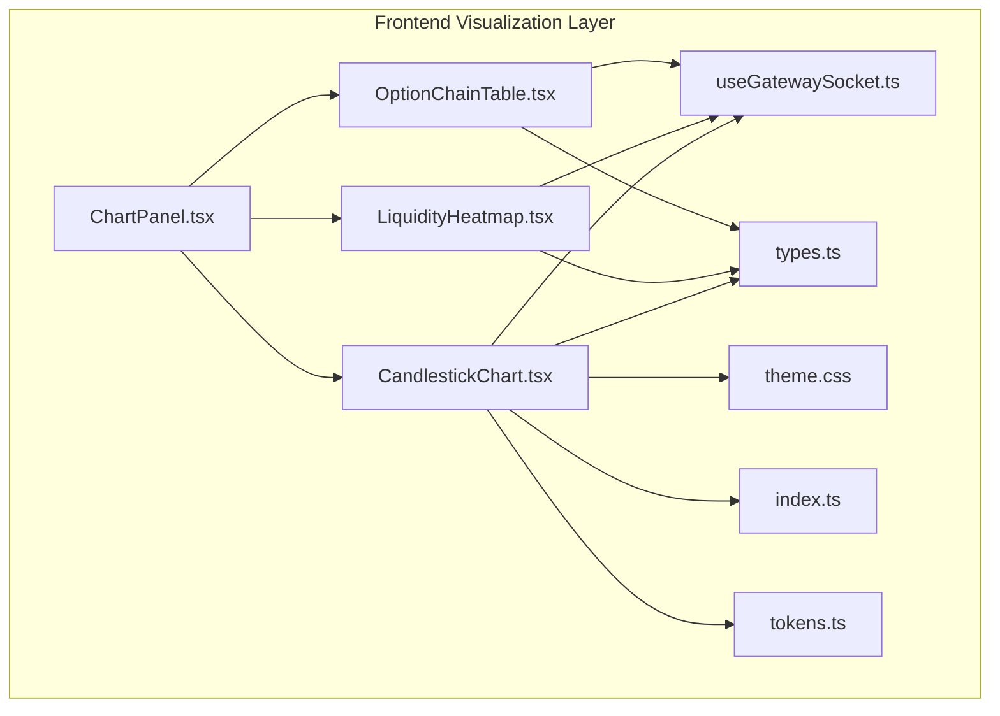
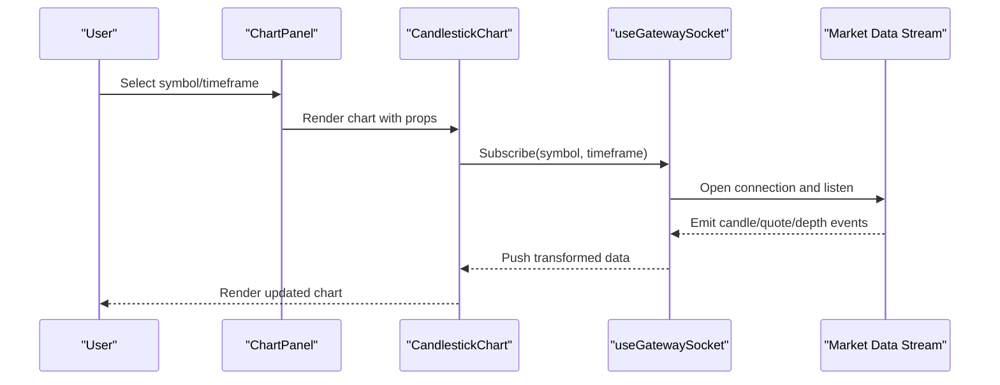
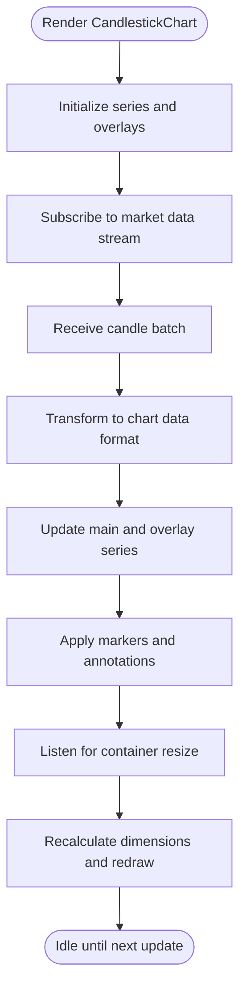
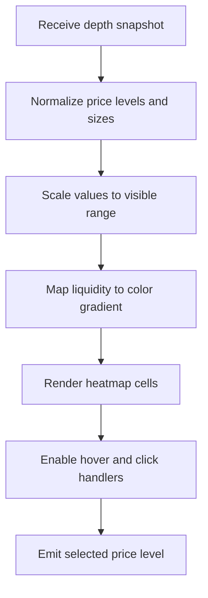
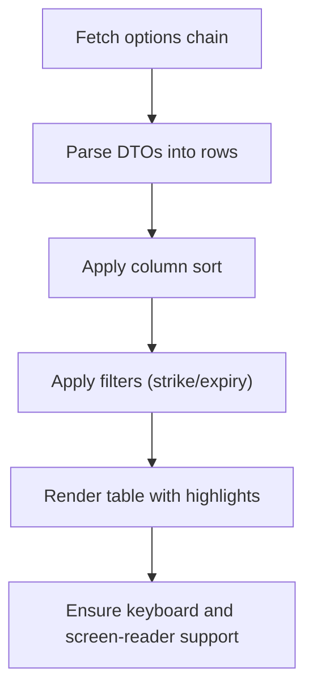
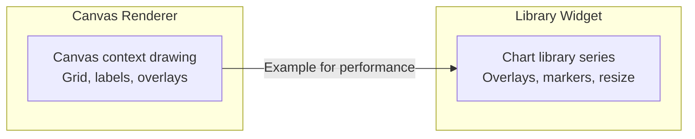
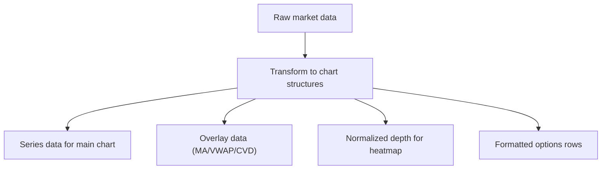
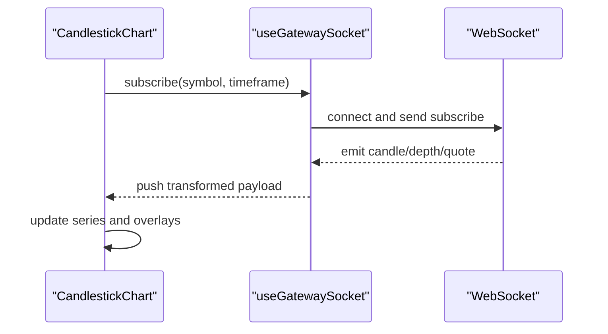
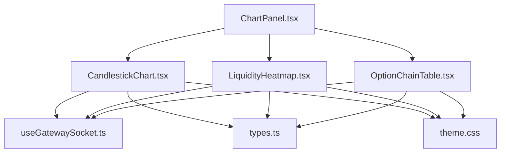

# Market Data Visualization

<cite>
**Referenced Files in This Document**
- [CandlestickChart.tsx](file://frontend/src/ui/widgets/charts/CandlestickChart.tsx)
- [ChartPanel.tsx](file://frontend/src/ui/panels/ChartPanel.tsx)
- [LiquidityHeatmap.tsx](file://frontend/src/ui/widgets/Heatmap/LiquidityHeatmap.tsx)
- [OptionChainTable.tsx](file://frontend/src/ui/widgets/OptionChain/OptionChainTable.tsx)
- [useGatewaySocket.ts](file://frontend/src/hooks/useGatewaySocket.ts)
- [types.ts](file://frontend/src/domain/dto/types.ts)
- [theme.css](file://frontend/src/theme/theme.css)
- [index.ts](file://frontend/src/theme/index.ts)
- [tokens.ts](file://frontend/src/theme/tokens.ts)
- [TerminalApp.tsx](file://frontend/src/app/TerminalApp.tsx)
- [sample.html](file://sample.html)
</cite>

## Table of Contents
1. [Introduction](#introduction)
2. [Project Structure](#project-structure)
3. [Core Components](#core-components)
4. [Architecture Overview](#architecture-overview)
5. [Detailed Component Analysis](#detailed-component-analysis)
6. [Dependency Analysis](#dependency-analysis)
7. [Performance Considerations](#performance-considerations)
8. [Troubleshooting Guide](#troubleshooting-guide)
9. [Conclusion](#conclusion)

## Introduction
This document explains the market data visualization subsystem, focusing on candlestick charting, liquidity heatmap rendering, and option chain visualization. It covers charting library integration, data transformation patterns, real-time updates, configuration examples, custom indicators, interactive features, integration with market data streams, performance optimization for large datasets, responsive sizing, customization, theme integration, and accessibility considerations.

## Project Structure
The visualization stack is primarily implemented in the frontend module under the UI widgets and panels directories. The key components are:
- CandlestickChart widget for OHLC visualization
- ChartPanel container for chart presentation and controls
- LiquidityHeatmap widget for depth-of-market heat visualization
- OptionChainTable widget for options chain display
- WebSocket hook for real-time market data ingestion
- Domain DTOs for typed market data contracts
- Theme system for styling and accessibility

**Diagram sources**
- [ChartPanel.tsx](file://frontend/src/ui/panels/ChartPanel.tsx)
- [CandlestickChart.tsx](file://frontend/src/ui/widgets/charts/CandlestickChart.tsx)
- [LiquidityHeatmap.tsx](file://frontend/src/ui/widgets/Heatmap/LiquidityHeatmap.tsx)
- [OptionChainTable.tsx](file://frontend/src/ui/widgets/OptionChain/OptionChainTable.tsx)
- [useGatewaySocket.ts](file://frontend/src/hooks/useGatewaySocket.ts)
- [types.ts](file://frontend/src/domain/dto/types.ts)
- [theme.css](file://frontend/src/theme/theme.css)
- [index.ts](file://frontend/src/theme/index.ts)
- [tokens.ts](file://frontend/src/theme/tokens.ts)

**Section sources**
- [ChartPanel.tsx](file://frontend/src/ui/panels/ChartPanel.tsx)
- [CandlestickChart.tsx](file://frontend/src/ui/widgets/charts/CandlestickChart.tsx)
- [LiquidityHeatmap.tsx](file://frontend/src/ui/widgets/Heatmap/LiquidityHeatmap.tsx)
- [OptionChainTable.tsx](file://frontend/src/ui/widgets/OptionChain/OptionChainTable.tsx)
- [useGatewaySocket.ts](file://frontend/src/hooks/useGatewaySocket.ts)
- [types.ts](file://frontend/src/domain/dto/types.ts)
- [theme.css](file://frontend/src/theme/theme.css)
- [index.ts](file://frontend/src/theme/index.ts)
- [tokens.ts](file://frontend/src/theme/tokens.ts)

## Core Components
- CandlestickChart: Renders OHLC candles with optional overlays (e.g., moving averages, VWAP, markers). Integrates with WebSocket data via a hook and supports responsive sizing and theme-aware styling.
- ChartPanel: Hosts the chart widget(s), manages toolbar controls, timeframe selection, and layout.
- LiquidityHeatmap: Visualizes bid/ask depth with color intensity representing liquidity density.
- OptionChainTable: Displays options chain data (strike prices, greeks, volumes) with sorting and filtering.
- useGatewaySocket: Provides real-time market data subscription and streaming updates.
- Domain DTOs: Define typed contracts for candles, quotes, depth, and options chain data.
- Theme System: Centralized tokens and CSS for consistent styling, dark/light modes, and accessibility.

**Section sources**
- [CandlestickChart.tsx](file://frontend/src/ui/widgets/charts/CandlestickChart.tsx)
- [ChartPanel.tsx](file://frontend/src/ui/panels/ChartPanel.tsx)
- [LiquidityHeatmap.tsx](file://frontend/src/ui/widgets/Heatmap/LiquidityHeatmap.tsx)
- [OptionChainTable.tsx](file://frontend/src/ui/widgets/OptionChain/OptionChainTable.tsx)
- [useGatewaySocket.ts](file://frontend/src/hooks/useGatewaySocket.ts)
- [types.ts](file://frontend/src/domain/dto/types.ts)
- [theme.css](file://frontend/src/theme/theme.css)
- [index.ts](file://frontend/src/theme/index.ts)
- [tokens.ts](file://frontend/src/theme/tokens.ts)

## Architecture Overview
The visualization architecture follows a layered pattern:
- Presentation Layer: Panels and widgets encapsulate UI concerns.
- Data Layer: WebSocket hook streams market data; DTOs define contracts.
- Theming Layer: Tokens and CSS modules enable consistent styling and responsive behavior.
- Integration Layer: Widgets subscribe to data streams and render visualizations.

**Diagram sources**
- [ChartPanel.tsx](file://frontend/src/ui/panels/ChartPanel.tsx)
- [CandlestickChart.tsx](file://frontend/src/ui/widgets/charts/CandlestickChart.tsx)
- [useGatewaySocket.ts](file://frontend/src/hooks/useGatewaySocket.ts)

## Detailed Component Analysis

### CandlestickChart Implementation
CandlestickChart renders OHLC bars and overlays, handles responsive sizing, and applies theme styles. It subscribes to market data via the WebSocket hook and transforms incoming data into chart-ready structures.

Key behaviors:
- Real-time updates: Subscribes to candle streams and updates series data incrementally.
- Overlays: Supports secondary series (e.g., moving average, VWAP) and markers (e.g., breakout signals).
- Responsive sizing: Adapts to container size using resize observers.
- Theme integration: Uses theme tokens for colors and contrast.

**Diagram sources**
- [CandlestickChart.tsx](file://frontend/src/ui/widgets/charts/CandlestickChart.tsx)
- [useGatewaySocket.ts](file://frontend/src/hooks/useGatewaySocket.ts)

**Section sources**
- [CandlestickChart.tsx](file://frontend/src/ui/widgets/charts/CandlestickChart.tsx)
- [useGatewaySocket.ts](file://frontend/src/hooks/useGatewaySocket.ts)
- [types.ts](file://frontend/src/domain/dto/types.ts)
- [theme.css](file://frontend/src/theme/theme.css)
- [index.ts](file://frontend/src/theme/index.ts)
- [tokens.ts](file://frontend/src/theme/tokens.ts)

### Liquidity Heatmap Rendering
LiquidityHeatmap visualizes depth-of-market with color intensity indicating liquidity. It consumes bid/ask depth snapshots and renders a grid-like representation.

Key behaviors:
- Data ingestion: Receives depth snapshots and normalizes price levels.
- Color mapping: Uses theme tokens to encode liquidity density.
- Interaction: Supports hover tooltips and click-to-order actions.
- Responsiveness: Adapts to viewport and panel width.

**Diagram sources**
- [LiquidityHeatmap.tsx](file://frontend/src/ui/widgets/Heatmap/LiquidityHeatmap.tsx)
- [types.ts](file://frontend/src/domain/dto/types.ts)
- [theme.css](file://frontend/src/theme/theme.css)
- [tokens.ts](file://frontend/src/theme/tokens.ts)

**Section sources**
- [LiquidityHeatmap.tsx](file://frontend/src/ui/widgets/Heatmap/LiquidityHeatmap.tsx)
- [types.ts](file://frontend/src/domain/dto/types.ts)
- [theme.css](file://frontend/src/theme/theme.css)
- [tokens.ts](file://frontend/src/theme/tokens.ts)

### Option Chain Visualization
OptionChainTable displays options chain data with columns for strike, greeks, volume, open interest, and pricing metrics. It supports sorting, filtering, and highlighting.

Key behaviors:
- Data binding: Maps DTOs to table rows with numeric formatting.
- Sorting/filtering: Column headers toggle sort order; filters refine strikes/expiries.
- Highlighting: Highlights ITM/OTM/ATM options and selected strike.
- Accessibility: Keyboard navigation and screen-reader friendly markup.

**Diagram sources**
- [OptionChainTable.tsx](file://frontend/src/ui/widgets/OptionChain/OptionChainTable.tsx)
- [types.ts](file://frontend/src/domain/dto/types.ts)
- [theme.css](file://frontend/src/theme/theme.css)
- [tokens.ts](file://frontend/src/theme/tokens.ts)

**Section sources**
- [OptionChainTable.tsx](file://frontend/src/ui/widgets/OptionChain/OptionChainTable.tsx)
- [types.ts](file://frontend/src/domain/dto/types.ts)
- [theme.css](file://frontend/src/theme/theme.css)
- [tokens.ts](file://frontend/src/theme/tokens.ts)

### Charting Library Integration
The charting implementation integrates with a lightweight canvas-based renderer and a modern charting library. The canvas-based approach demonstrates efficient rendering for dense datasets, while the library-based widget shows advanced interactivity and overlays.

Highlights:
- Canvas-based renderer: Efficiently draws candles, overlays, and recent trades with manual layout calculations.
- Library-based widget: Manages series, overlays, markers, and responsive resizing with a charting library.

**Diagram sources**
- [sample.html](file://sample.html)
- [CandlestickChart.tsx](file://frontend/src/ui/widgets/charts/CandlestickChart.tsx)

**Section sources**
- [sample.html](file://sample.html)
- [CandlestickChart.tsx](file://frontend/src/ui/widgets/charts/CandlestickChart.tsx)

### Data Transformation Patterns
Market data arrives in raw formats and is transformed into chart-friendly structures:
- Candle transformation: Converts timestamps to time units and OHLC values to series points.
- Overlay calculation: Computes moving averages, VWAP, and cumulative volume delta.
- Depth normalization: Scales price levels and sizes for heatmap rendering.
- Options mapping: Formats strikes, greeks, and metrics for table display.

**Diagram sources**
- [CandlestickChart.tsx](file://frontend/src/ui/widgets/charts/CandlestickChart.tsx)
- [LiquidityHeatmap.tsx](file://frontend/src/ui/widgets/Heatmap/LiquidityHeatmap.tsx)
- [OptionChainTable.tsx](file://frontend/src/ui/widgets/OptionChain/OptionChainTable.tsx)
- [types.ts](file://frontend/src/domain/dto/types.ts)

**Section sources**
- [CandlestickChart.tsx](file://frontend/src/ui/widgets/charts/CandlestickChart.tsx)
- [LiquidityHeatmap.tsx](file://frontend/src/ui/widgets/Heatmap/LiquidityHeatmap.tsx)
- [OptionChainTable.tsx](file://frontend/src/ui/widgets/OptionChain/OptionChainTable.tsx)
- [types.ts](file://frontend/src/domain/dto/types.ts)

### Real-Time Update Mechanisms
Real-time updates are handled via a WebSocket hook:
- Subscription: Widgets call subscribe with symbol and timeframe.
- Streaming: Incoming events trigger incremental updates to series data.
- Batch updates: Periodic batches reduce render overhead.
- Cleanup: Unsubscribe and cleanup on component unmount.

**Diagram sources**
- [CandlestickChart.tsx](file://frontend/src/ui/widgets/charts/CandlestickChart.tsx)
- [useGatewaySocket.ts](file://frontend/src/hooks/useGatewaySocket.ts)

**Section sources**
- [CandlestickChart.tsx](file://frontend/src/ui/widgets/charts/CandlestickChart.tsx)
- [useGatewaySocket.ts](file://frontend/src/hooks/useGatewaySocket.ts)

### Practical Examples
- Chart configuration: Set timeframe, overlay visibility, and indicator toggles via panel controls.
- Custom indicators: Add moving averages, RSI, or volume profiles by extending overlay series.
- Interactive features: Enable crosshair, scale, and selection tools; bind click handlers to depth levels and option strikes.
- Responsive sizing: Use container queries or resize observers to adapt chart dimensions.
- Accessibility: Ensure sufficient color contrast, ARIA labels, and keyboard navigation for all interactive elements.

[No sources needed since this section provides general guidance]

## Dependency Analysis
The visualization components depend on:
- WebSocket hook for real-time data
- Domain DTOs for type safety
- Theme system for styling and responsiveness
- Charting library for advanced rendering and overlays

**Diagram sources**
- [CandlestickChart.tsx](file://frontend/src/ui/widgets/charts/CandlestickChart.tsx)
- [ChartPanel.tsx](file://frontend/src/ui/panels/ChartPanel.tsx)
- [LiquidityHeatmap.tsx](file://frontend/src/ui/widgets/Heatmap/LiquidityHeatmap.tsx)
- [OptionChainTable.tsx](file://frontend/src/ui/widgets/OptionChain/OptionChainTable.tsx)
- [useGatewaySocket.ts](file://frontend/src/hooks/useGatewaySocket.ts)
- [types.ts](file://frontend/src/domain/dto/types.ts)
- [theme.css](file://frontend/src/theme/theme.css)

**Section sources**
- [CandlestickChart.tsx](file://frontend/src/ui/widgets/charts/CandlestickChart.tsx)
- [ChartPanel.tsx](file://frontend/src/ui/panels/ChartPanel.tsx)
- [LiquidityHeatmap.tsx](file://frontend/src/ui/widgets/Heatmap/LiquidityHeatmap.tsx)
- [OptionChainTable.tsx](file://frontend/src/ui/widgets/OptionChain/OptionChainTable.tsx)
- [useGatewaySocket.ts](file://frontend/src/hooks/useGatewaySocket.ts)
- [types.ts](file://frontend/src/domain/dto/types.ts)
- [theme.css](file://frontend/src/theme/theme.css)

## Performance Considerations
- Efficient rendering: Prefer canvas-based drawing for dense datasets; limit DOM nodes.
- Incremental updates: Apply delta updates to series data instead of full redraws.
- Batching: Coalesce frequent updates to reduce reflow and repaint costs.
- Virtualization: For large option chains, virtualize table rows to minimize DOM.
- Memory management: Dispose of observers and subscriptions on unmount.
- Theme caching: Reuse computed theme values to avoid repeated calculations.

[No sources needed since this section provides general guidance]

## Troubleshooting Guide
Common issues and resolutions:
- No data displayed: Verify WebSocket subscription and symbol availability.
- Stale data: Confirm periodic updates and batch handling.
- Poor performance: Reduce overlay complexity and enable virtualization for large datasets.
- Theme inconsistencies: Ensure theme tokens are applied consistently across components.
- Accessibility problems: Add ARIA attributes and keyboard handlers; test with screen readers.

**Section sources**
- [CandlestickChart.tsx](file://frontend/src/ui/widgets/charts/CandlestickChart.tsx)
- [LiquidityHeatmap.tsx](file://frontend/src/ui/widgets/Heatmap/LiquidityHeatmap.tsx)
- [OptionChainTable.tsx](file://frontend/src/ui/widgets/OptionChain/OptionChainTable.tsx)
- [useGatewaySocket.ts](file://frontend/src/hooks/useGatewaySocket.ts)
- [theme.css](file://frontend/src/theme/theme.css)

## Conclusion
The market data visualization system combines efficient rendering, real-time streaming, and a cohesive theme system to deliver responsive, accessible, and customizable charts. CandlestickChart, LiquidityHeatmap, and OptionChainTable provide comprehensive coverage of equity and options markets, with clear extension points for custom indicators and interactive features.