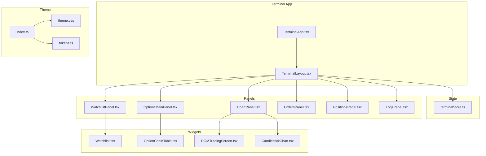
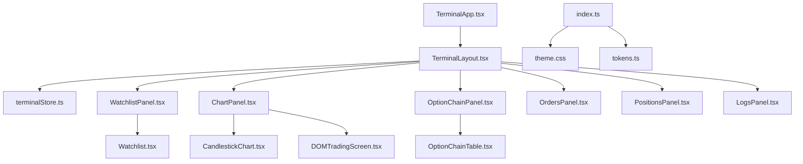
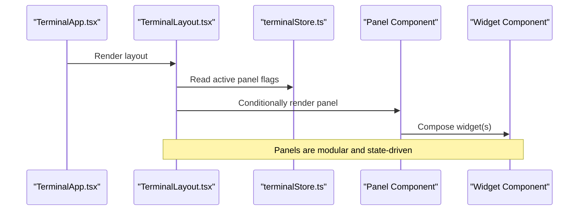
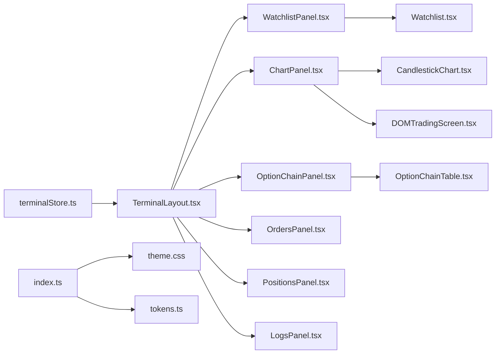

# Panel System

<cite>
**Referenced Files in This Document**
- [TerminalLayout.tsx](file://frontend/src/ui/layout/TerminalLayout.tsx)
- [TerminalApp.tsx](file://frontend/src/app/TerminalApp.tsx)
- [terminalStore.ts](file://frontend/src/state/terminalStore.ts)
- [WatchlistPanel.tsx](file://frontend/src/ui/panels/WatchlistPanel.tsx)
- [ChartPanel.tsx](file://frontend/src/ui/panels/ChartPanel.tsx)
- [OptionChainPanel.tsx](file://frontend/src/ui/panels/OptionChainPanel.tsx)
- [OrdersPanel.tsx](file://frontend/src/ui/panels/OrdersPanel.tsx)
- [PositionsPanel.tsx](file://frontend/src/ui/panels/PositionsPanel.tsx)
- [LogsPanel.tsx](file://frontend/src/ui/panels/LogsPanel.tsx)
- [DOMTradingScreen.tsx](file://frontend/src/ui/widgets/DOM/DOMTradingScreen.tsx)
- [OptionChainTable.tsx](file://frontend/src/ui/widgets/OptionChain/OptionChainTable.tsx)
- [Watchlist.tsx](file://frontend/src/ui/widgets/Watchlist/Watchlist.tsx)
- [CandlestickChart.tsx](file://frontend/src/ui/widgets/charts/CandlestickChart.tsx)
- [useGatewaySocket.ts](file://frontend/src/hooks/useGatewaySocket.ts)
- [index.ts](file://frontend/src/theme/index.ts)
- [theme.css](file://frontend/src/theme/theme.css)
- [tokens.ts](file://frontend/src/theme/tokens.ts)
- [TERMINAL_SCALABILITY_REVIEW_2026-06-06.md](file://docs/reports/TERMINAL_SCALABILITY_REVIEW_2026-06-06.md)
</cite>

## Table of Contents
1. [Introduction](#introduction)
2. [Project Structure](#project-structure)
3. [Core Components](#core-components)
4. [Architecture Overview](#architecture-overview)
5. [Detailed Component Analysis](#detailed-component-analysis)
6. [Dependency Analysis](#dependency-analysis)
7. [Performance Considerations](#performance-considerations)
8. [Troubleshooting Guide](#troubleshooting-guide)
9. [Conclusion](#conclusion)
10. [Appendices](#appendices)

## Introduction
This document describes the panel-based layout system and modular UI components that compose the terminal interface. It explains the terminal layout architecture, panel positioning, and resizable component management. It documents the orders panel, positions panel, watchlist panel, and logs panel implementations, and outlines practical examples of panel configuration, drag-and-drop functionality, and responsive layout adaptation. It also details panel state management, data synchronization, and inter-panel communication patterns, along with customization options, theme integration, and performance optimization for complex panel arrangements.

## Project Structure
The terminal UI is organized around a central layout container that orchestrates multiple panels. Panels are grouped under a dedicated directory and composed by the terminal layout. State management coordinates which panels are visible and how they are arranged. Theme and tokens define the visual language.

**Diagram sources**
- [TerminalApp.tsx:1-6](file://frontend/src/app/TerminalApp.tsx#L1-L6)
- [TerminalLayout.tsx:1-100](file://frontend/src/ui/layout/TerminalLayout.tsx#L1-L100)
- [terminalStore.ts:1-200](file://frontend/src/state/terminalStore.ts#L1-L200)
- [WatchlistPanel.tsx:1-200](file://frontend/src/ui/panels/WatchlistPanel.tsx#L1-L200)
- [ChartPanel.tsx:1-200](file://frontend/src/ui/panels/ChartPanel.tsx#L1-L200)
- [OptionChainPanel.tsx:1-200](file://frontend/src/ui/panels/OptionChainPanel.tsx#L1-L200)
- [OrdersPanel.tsx:1-200](file://frontend/src/ui/panels/OrdersPanel.tsx#L1-L200)
- [PositionsPanel.tsx:1-200](file://frontend/src/ui/panels/PositionsPanel.tsx#L1-L200)
- [LogsPanel.tsx:1-200](file://frontend/src/ui/panels/LogsPanel.tsx#L1-L200)
- [Watchlist.tsx:1-200](file://frontend/src/ui/widgets/Watchlist/Watchlist.tsx#L1-L200)
- [OptionChainTable.tsx:1-200](file://frontend/src/ui/widgets/OptionChain/OptionChainTable.tsx#L1-L200)
- [DOMTradingScreen.tsx:1-200](file://frontend/src/ui/widgets/DOM/DOMTradingScreen.tsx#L1-L200)
- [CandlestickChart.tsx:1-200](file://frontend/src/ui/widgets/charts/CandlestickChart.tsx#L1-L200)
- [index.ts:1-200](file://frontend/src/theme/index.ts#L1-L200)
- [theme.css:1-200](file://frontend/src/theme/theme.css#L1-L200)
- [tokens.ts:1-200](file://frontend/src/theme/tokens.ts#L1-L200)

**Section sources**
- [TerminalApp.tsx:1-6](file://frontend/src/app/TerminalApp.tsx#L1-L6)
- [TerminalLayout.tsx:1-100](file://frontend/src/ui/layout/TerminalLayout.tsx#L1-L100)
- [terminalStore.ts:1-200](file://frontend/src/state/terminalStore.ts#L1-L200)

## Core Components
- TerminalLayout: Central layout container that renders panels based on active panel flags and applies grid-based arrangement.
- Panel components: Modular UI units for watchlist, chart, option chain, orders, positions, and logs.
- Widgets: Reusable UI elements inside panels (watchlist table, option chain table, DOM screen, candlestick chart).
- State management: Stores active panel visibility and layout preferences.
- Theme: Provides color tokens and styles for consistent visual design.

Key responsibilities:
- Layout orchestration and responsive arrangement
- Panel visibility toggling via state
- Data subscription wiring for live updates
- Drag-and-drop and resizing integration
- Inter-panel communication patterns

**Section sources**
- [TerminalLayout.tsx:1-100](file://frontend/src/ui/layout/TerminalLayout.tsx#L1-L100)
- [WatchlistPanel.tsx:1-200](file://frontend/src/ui/panels/WatchlistPanel.tsx#L1-L200)
- [ChartPanel.tsx:1-200](file://frontend/src/ui/panels/ChartPanel.tsx#L1-L200)
- [OptionChainPanel.tsx:1-200](file://frontend/src/ui/panels/OptionChainPanel.tsx#L1-L200)
- [OrdersPanel.tsx:1-200](file://frontend/src/ui/panels/OrdersPanel.tsx#L1-L200)
- [PositionsPanel.tsx:1-200](file://frontend/src/ui/panels/PositionsPanel.tsx#L1-L200)
- [LogsPanel.tsx:1-200](file://frontend/src/ui/panels/LogsPanel.tsx#L1-L200)
- [Watchlist.tsx:1-200](file://frontend/src/ui/widgets/Watchlist/Watchlist.tsx#L1-L200)
- [OptionChainTable.tsx:1-200](file://frontend/src/ui/widgets/OptionChain/OptionChainTable.tsx#L1-L200)
- [DOMTradingScreen.tsx:1-200](file://frontend/src/ui/widgets/DOM/DOMTradingScreen.tsx#L1-L200)
- [CandlestickChart.tsx:1-200](file://frontend/src/ui/widgets/charts/CandlestickChart.tsx#L1-L200)
- [terminalStore.ts:1-200](file://frontend/src/state/terminalStore.ts#L1-L200)
- [index.ts:1-200](file://frontend/src/theme/index.ts#L1-L200)
- [theme.css:1-200](file://frontend/src/theme/theme.css#L1-L200)
- [tokens.ts:1-200](file://frontend/src/theme/tokens.ts#L1-L200)

## Architecture Overview
The terminal architecture centers on a single-page application that composes panels into a responsive grid. The layout reads active panel flags from state and conditionally renders panels. Panels encapsulate widget components and can be extended to support live data subscriptions and drag-and-drop resizing.

**Diagram sources**
- [TerminalApp.tsx:1-6](file://frontend/src/app/TerminalApp.tsx#L1-L6)
- [TerminalLayout.tsx:1-100](file://frontend/src/ui/layout/TerminalLayout.tsx#L1-L100)
- [terminalStore.ts:1-200](file://frontend/src/state/terminalStore.ts#L1-L200)
- [WatchlistPanel.tsx:1-200](file://frontend/src/ui/panels/WatchlistPanel.tsx#L1-L200)
- [ChartPanel.tsx:1-200](file://frontend/src/ui/panels/ChartPanel.tsx#L1-L200)
- [OptionChainPanel.tsx:1-200](file://frontend/src/ui/panels/OptionChainPanel.tsx#L1-L200)
- [OrdersPanel.tsx:1-200](file://frontend/src/ui/panels/OrdersPanel.tsx#L1-L200)
- [PositionsPanel.tsx:1-200](file://frontend/src/ui/panels/PositionsPanel.tsx#L1-L200)
- [LogsPanel.tsx:1-200](file://frontend/src/ui/panels/LogsPanel.tsx#L1-L200)
- [Watchlist.tsx:1-200](file://frontend/src/ui/widgets/Watchlist/Watchlist.tsx#L1-L200)
- [OptionChainTable.tsx:1-200](file://frontend/src/ui/widgets/OptionChain/OptionChainTable.tsx#L1-L200)
- [DOMTradingScreen.tsx:1-200](file://frontend/src/ui/widgets/DOM/DOMTradingScreen.tsx#L1-L200)
- [CandlestickChart.tsx:1-200](file://frontend/src/ui/widgets/charts/CandlestickChart.tsx#L1-L200)
- [index.ts:1-200](file://frontend/src/theme/index.ts#L1-L200)
- [theme.css:1-200](file://frontend/src/theme/theme.css#L1-L200)
- [tokens.ts:1-200](file://frontend/src/theme/tokens.ts#L1-L200)

## Detailed Component Analysis

### TerminalLayout
TerminalLayout defines the grid-based arrangement of panels and controls visibility via active panel flags. It currently uses a fixed grid with predefined column widths and a bottom row for three panels. The review highlights the lack of resizable splitters and live data subscriptions.

Responsibilities:
- Render header branding and status indicators
- Compose left sidebar (watchlist), center area (chart + option chain), and bottom row (orders/positions/logs)
- Toggle panels based on active panel flags from state
- Provide a foundation for future resizable splitter integration

Practical examples:
- Panel configuration: Enable/disable panels by setting flags in state
- Responsive layout adaptation: Grid rows/columns adapt to available space
- Drag-and-drop: Not implemented; requires replacing fixed grid with resizable panels library

**Section sources**
- [TerminalLayout.tsx:1-100](file://frontend/src/ui/layout/TerminalLayout.tsx#L1-L100)
- [TERMINAL_SCALABILITY_REVIEW_2026-06-06.md:76-127](file://docs/reports/TERMINAL_SCALABILITY_REVIEW_2026-06-06.md#L76-L127)

### Panel Components
Each panel is a self-contained module that renders a specific domain view. Panels are conditionally rendered by the layout based on active flags.

- WatchlistPanel: Renders a watchlist widget for instrument monitoring
- ChartPanel: Hosts chart widgets (candlesticks, DOM)
- OptionChainPanel: Displays option chain data
- OrdersPanel: Shows order book and lifecycle
- PositionsPanel: Displays current holdings and positions
- LogsPanel: Displays terminal logs

Implementation patterns:
- Stateless functional components returning JSX
- Composition of smaller widgets
- Conditional rendering based on active flags

**Section sources**
- [WatchlistPanel.tsx:1-200](file://frontend/src/ui/panels/WatchlistPanel.tsx#L1-L200)
- [ChartPanel.tsx:1-200](file://frontend/src/ui/panels/ChartPanel.tsx#L1-L200)
- [OptionChainPanel.tsx:1-200](file://frontend/src/ui/panels/OptionChainPanel.tsx#L1-L200)
- [OrdersPanel.tsx:1-200](file://frontend/src/ui/panels/OrdersPanel.tsx#L1-L200)
- [PositionsPanel.tsx:1-200](file://frontend/src/ui/panels/PositionsPanel.tsx#L1-L200)
- [LogsPanel.tsx:1-200](file://frontend/src/ui/panels/LogsPanel.tsx#L1-L200)

### Widgets
Widgets are reusable UI elements embedded within panels.

- Watchlist.tsx: Displays instrument lists and selection
- OptionChainTable.tsx: Presents option chain data in tabular form
- DOMTradingScreen.tsx: Shows depth-of-market visualization
- CandlestickChart.tsx: Renders candlestick charts

These components encapsulate rendering logic and can be composed independently or within panels.

**Section sources**
- [Watchlist.tsx:1-200](file://frontend/src/ui/widgets/Watchlist/Watchlist.tsx#L1-L200)
- [OptionChainTable.tsx:1-200](file://frontend/src/ui/widgets/OptionChain/OptionChainTable.tsx#L1-L200)
- [DOMTradingScreen.tsx:1-200](file://frontend/src/ui/widgets/DOM/DOMTradingScreen.tsx#L1-L200)
- [CandlestickChart.tsx:1-200](file://frontend/src/ui/widgets/charts/CandlestickChart.tsx#L1-L200)

### State Management
The terminal state manages active panel visibility and layout preferences. The layout consumes these flags to decide which panels to render.

Responsibilities:
- Store active panel flags (watchlist, charts, option chain, orders, positions, logs)
- Persist layout preferences
- Provide reactive updates to the layout

Integration points:
- Layout subscribes to state changes
- Panels remain decoupled from state, promoting modularity

**Section sources**
- [terminalStore.ts:1-200](file://frontend/src/state/terminalStore.ts#L1-L200)
- [TerminalLayout.tsx:1-100](file://frontend/src/ui/layout/TerminalLayout.tsx#L1-L100)

### Theme Integration
The theme system provides consistent styling across panels and widgets.

- index.ts: Exports theme configuration
- theme.css: Global CSS variables and base styles
- tokens.ts: Color and sizing tokens

Customization options:
- Adjust tokens to change brand colors and spacing
- Extend CSS for panel-specific overrides
- Maintain accessibility by preserving contrast ratios

**Section sources**
- [index.ts:1-200](file://frontend/src/theme/index.ts#L1-L200)
- [theme.css:1-200](file://frontend/src/theme/theme.css#L1-L200)
- [tokens.ts:1-200](file://frontend/src/theme/tokens.ts#L1-L200)

## Architecture Overview
The terminal layout composes panels into a responsive grid. Panels are modular and can be toggled via state. Widgets encapsulate rendering logic and can be reused across panels. The theme system ensures consistent visual design.

**Diagram sources**
- [TerminalApp.tsx:1-6](file://frontend/src/app/TerminalApp.tsx#L1-L6)
- [TerminalLayout.tsx:1-100](file://frontend/src/ui/layout/TerminalLayout.tsx#L1-L100)
- [terminalStore.ts:1-200](file://frontend/src/state/terminalStore.ts#L1-L200)
- [WatchlistPanel.tsx:1-200](file://frontend/src/ui/panels/WatchlistPanel.tsx#L1-L200)
- [ChartPanel.tsx:1-200](file://frontend/src/ui/panels/ChartPanel.tsx#L1-L200)
- [OptionChainPanel.tsx:1-200](file://frontend/src/ui/panels/OptionChainPanel.tsx#L1-L200)
- [OrdersPanel.tsx:1-200](file://frontend/src/ui/panels/OrdersPanel.tsx#L1-L200)
- [PositionsPanel.tsx:1-200](file://frontend/src/ui/panels/PositionsPanel.tsx#L1-L200)
- [LogsPanel.tsx:1-200](file://frontend/src/ui/panels/LogsPanel.tsx#L1-L200)
- [Watchlist.tsx:1-200](file://frontend/src/ui/widgets/Watchlist/Watchlist.tsx#L1-L200)
- [OptionChainTable.tsx:1-200](file://frontend/src/ui/widgets/OptionChain/OptionChainTable.tsx#L1-L200)
- [DOMTradingScreen.tsx:1-200](file://frontend/src/ui/widgets/DOM/DOMTradingScreen.tsx#L1-L200)
- [CandlestickChart.tsx:1-200](file://frontend/src/ui/widgets/charts/CandlestickChart.tsx#L1-L200)

## Detailed Component Analysis

### Watchlist Panel
The watchlist panel displays instrument lists and supports selection. It is composed of a watchlist widget and integrated into the terminal layout.

Responsibilities:
- Render watchlist entries
- Handle selection and navigation
- Integrate with terminal state for visibility

Practical examples:
- Add/remove instruments via state
- Customize columns and sorting in the underlying widget

**Section sources**
- [WatchlistPanel.tsx:1-200](file://frontend/src/ui/panels/WatchlistPanel.tsx#L1-L200)
- [Watchlist.tsx:1-200](file://frontend/src/ui/widgets/Watchlist/Watchlist.tsx#L1-L200)
- [TerminalLayout.tsx:1-100](file://frontend/src/ui/layout/TerminalLayout.tsx#L1-L100)

### Chart Panel
The chart panel hosts chart widgets including candlestick charts and DOM screens. It serves as a canvas for visualizing market data.

Responsibilities:
- Render chart widgets
- Manage chart lifecycle and updates
- Coordinate with data providers for live updates

Practical examples:
- Switch between candlestick and DOM views
- Configure chart overlays and indicators

**Section sources**
- [ChartPanel.tsx:1-200](file://frontend/src/ui/panels/ChartPanel.tsx#L1-L200)
- [CandlestickChart.tsx:1-200](file://frontend/src/ui/widgets/charts/CandlestickChart.tsx#L1-L200)
- [DOMTradingScreen.tsx:1-200](file://frontend/src/ui/widgets/DOM/DOMTradingScreen.tsx#L1-L200)
- [TerminalLayout.tsx:1-100](file://frontend/src/ui/layout/TerminalLayout.tsx#L1-L100)

### Option Chain Panel
The option chain panel presents option chain data in a tabular format, enabling filtering and selection.

Responsibilities:
- Render option chain table
- Support filtering and sorting
- Integrate with option chain widgets

Practical examples:
- Filter by strike price, expiration, or greeks
- Select an option for further action

**Section sources**
- [OptionChainPanel.tsx:1-200](file://frontend/src/ui/panels/OptionChainPanel.tsx#L1-L200)
- [OptionChainTable.tsx:1-200](file://frontend/src/ui/widgets/OptionChain/OptionChainTable.tsx#L1-L200)
- [TerminalLayout.tsx:1-100](file://frontend/src/ui/layout/TerminalLayout.tsx#L1-L100)

### Orders Panel
The orders panel displays order book and lifecycle events. It is designed for monitoring and managing orders.

Responsibilities:
- Render order book and recent trades
- Reflect order state transitions
- Provide actionable controls

Practical examples:
- Cancel or modify orders
- Monitor fills and rejections

**Section sources**
- [OrdersPanel.tsx:1-200](file://frontend/src/ui/panels/OrdersPanel.tsx#L1-L200)
- [TerminalLayout.tsx:1-100](file://frontend/src/ui/layout/TerminalLayout.tsx#L1-L100)

### Positions Panel
The positions panel shows current holdings and positions, enabling risk monitoring and management.

Responsibilities:
- Render position summaries
- Display PnL and exposure metrics
- Support position sizing and adjustments

Practical examples:
- View unrealized and realized PnL
- Set stop-loss or take-profit targets

**Section sources**
- [PositionsPanel.tsx:1-200](file://frontend/src/ui/panels/PositionsPanel.tsx#L1-L200)
- [TerminalLayout.tsx:1-100](file://frontend/src/ui/layout/TerminalLayout.tsx#L1-L100)

### Logs Panel
The logs panel displays terminal logs for diagnostics and auditing.

Responsibilities:
- Render log entries
- Support filtering and search
- Provide timestamps and severity levels

Practical examples:
- Filter by log level or module
- Export logs for analysis

**Section sources**
- [LogsPanel.tsx:1-200](file://frontend/src/ui/panels/LogsPanel.tsx#L1-L200)
- [TerminalLayout.tsx:1-100](file://frontend/src/ui/layout/TerminalLayout.tsx#L1-L100)

### Panel State Management and Inter-Panel Communication
Panel state management is centralized in the terminal store. Panels are decoupled from state, receiving only visibility flags. Inter-panel communication can be achieved through shared state updates or event buses.

Patterns:
- Centralized state for visibility and layout preferences
- Decoupled panels for maintainability
- Optional event bus for cross-panel actions

**Section sources**
- [terminalStore.ts:1-200](file://frontend/src/state/terminalStore.ts#L1-L200)
- [TerminalLayout.tsx:1-100](file://frontend/src/ui/layout/TerminalLayout.tsx#L1-L100)

### Data Synchronization and Live Subscriptions
The current layout review indicates that panels do not subscribe to live data; they render placeholder or static content. To align with a "Trading Terminal," panels should subscribe to WebSocket feeds and synchronize state reactively.

Recommendations:
- Integrate WebSocket hooks for live data
- Normalize incoming data into shared stores
- Debounce and batch updates for performance
- Implement error handling and reconnection logic

**Section sources**
- [TERMINAL_SCALABILITY_REVIEW_2026-06-06.md:121-127](file://docs/reports/TERMINAL_SCALABILITY_REVIEW_2026-06-06.md#L121-L127)
- [useGatewaySocket.ts:1-200](file://frontend/src/hooks/useGatewaySocket.ts#L1-L200)

### Resizable Component Management and Drag-and-Drop
The layout currently uses a fixed grid and lacks resizable splitters or drag-and-drop docking. The review recommends adopting a layout library that supports resizable splitters to match Bloomberg-style terminals.

Recommended libraries:
- react-resizable-panels (popular, lightweight, good TypeScript support)
- dockview (VSCode-like docking and pinning)
- react-grid-layout (mature drag-to-resize)

Implementation steps:
- Replace fixed grid with resizable panel groups
- Define minimum and maximum sizes per panel
- Persist splitter positions in state
- Ensure responsive behavior across breakpoints

**Section sources**
- [TERMINAL_SCALABILITY_REVIEW_2026-06-06.md:76-127](file://docs/reports/TERMINAL_SCALABILITY_REVIEW_2026-06-06.md#L76-L127)
- [TerminalLayout.tsx:1-100](file://frontend/src/ui/layout/TerminalLayout.tsx#L1-L100)

### Practical Examples
- Panel configuration: Toggle visibility by updating active panel flags in state
- Drag-and-drop: Implement resizable splitters using a recommended library
- Responsive layout adaptation: Use CSS grid/fr units and media queries to adapt to screen size
- Data synchronization: Subscribe to WebSocket feeds and update panel widgets reactively
- Inter-panel communication: Use shared state or event bus for coordinated actions

**Section sources**
- [terminalStore.ts:1-200](file://frontend/src/state/terminalStore.ts#L1-L200)
- [TerminalLayout.tsx:1-100](file://frontend/src/ui/layout/TerminalLayout.tsx#L1-L100)
- [TERMINAL_SCALABILITY_REVIEW_2026-06-06.md:76-127](file://docs/reports/TERMINAL_SCALABILITY_REVIEW_2026-06-06.md#L76-L127)

## Dependency Analysis
The layout depends on state for visibility flags and composes panel components. Panels depend on widgets for rendering. The theme system is independent but influences visual consistency.

**Diagram sources**
- [terminalStore.ts:1-200](file://frontend/src/state/terminalStore.ts#L1-L200)
- [TerminalLayout.tsx:1-100](file://frontend/src/ui/layout/TerminalLayout.tsx#L1-L100)
- [WatchlistPanel.tsx:1-200](file://frontend/src/ui/panels/WatchlistPanel.tsx#L1-L200)
- [ChartPanel.tsx:1-200](file://frontend/src/ui/panels/ChartPanel.tsx#L1-L200)
- [OptionChainPanel.tsx:1-200](file://frontend/src/ui/panels/OptionChainPanel.tsx#L1-L200)
- [OrdersPanel.tsx:1-200](file://frontend/src/ui/panels/OrdersPanel.tsx#L1-L200)
- [PositionsPanel.tsx:1-200](file://frontend/src/ui/panels/PositionsPanel.tsx#L1-L200)
- [LogsPanel.tsx:1-200](file://frontend/src/ui/panels/LogsPanel.tsx#L1-L200)
- [Watchlist.tsx:1-200](file://frontend/src/ui/widgets/Watchlist/Watchlist.tsx#L1-L200)
- [OptionChainTable.tsx:1-200](file://frontend/src/ui/widgets/OptionChain/OptionChainTable.tsx#L1-L200)
- [DOMTradingScreen.tsx:1-200](file://frontend/src/ui/widgets/DOM/DOMTradingScreen.tsx#L1-L200)
- [CandlestickChart.tsx:1-200](file://frontend/src/ui/widgets/charts/CandlestickChart.tsx#L1-L200)
- [index.ts:1-200](file://frontend/src/theme/index.ts#L1-L200)
- [theme.css:1-200](file://frontend/src/theme/theme.css#L1-L200)
- [tokens.ts:1-200](file://frontend/src/theme/tokens.ts#L1-L200)

**Section sources**
- [terminalStore.ts:1-200](file://frontend/src/state/terminalStore.ts#L1-L200)
- [TerminalLayout.tsx:1-100](file://frontend/src/ui/layout/TerminalLayout.tsx#L1-L100)

## Performance Considerations
- Lazy loading: Defer heavy widgets until panels are visible
- Virtualization: Use virtualized lists for large datasets in watchlist and logs
- Memoization: Memoize expensive computations in panel components
- Debouncing: Debounce frequent updates (e.g., chart resizes) to avoid layout thrashing
- Efficient state updates: Batch state changes to minimize re-renders
- Web Workers: Offload intensive computations to workers when applicable

[No sources needed since this section provides general guidance]

## Troubleshooting Guide
Common issues and resolutions:
- Panels not appearing: Verify active panel flags in state
- Layout not resizing: Confirm resizable splitter integration
- No live data: Ensure WebSocket subscriptions are established
- Theme inconsistencies: Check theme exports and token usage
- Performance degradation: Audit heavy computations and optimize rendering

**Section sources**
- [terminalStore.ts:1-200](file://frontend/src/state/terminalStore.ts#L1-L200)
- [TERMINAL_SCALABILITY_REVIEW_2026-06-06.md:121-127](file://docs/reports/TERMINAL_SCALABILITY_REVIEW_2026-06-06.md#L121-L127)
- [index.ts:1-200](file://frontend/src/theme/index.ts#L1-L200)

## Conclusion
The panel system provides a modular, state-driven foundation for a terminal UI. While the current layout is fixed and lacks live data subscriptions, it offers a clear path forward for resizable splitters, WebSocket integration, and enhanced inter-panel communication. By leveraging the existing state and theme systems, teams can iteratively improve the terminal to meet Bloomberg-style expectations while maintaining code quality and performance.

[No sources needed since this section summarizes without analyzing specific files]

## Appendices
- Customization options: Adjust tokens and CSS for brand alignment; extend theme exports for new palettes
- Accessibility: Ensure sufficient contrast and keyboard navigation support
- Testing: Unit tests for panel components and integration tests for layout behavior

[No sources needed since this section provides general guidance]