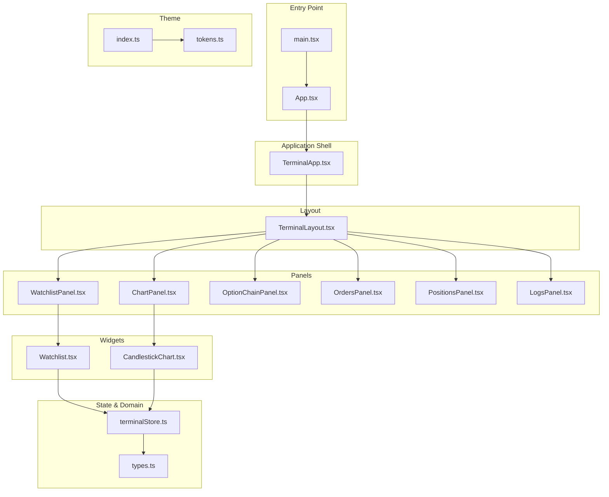
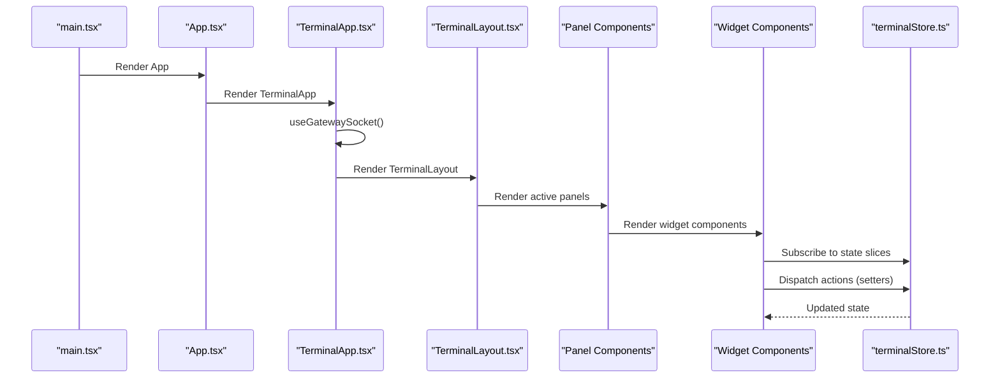
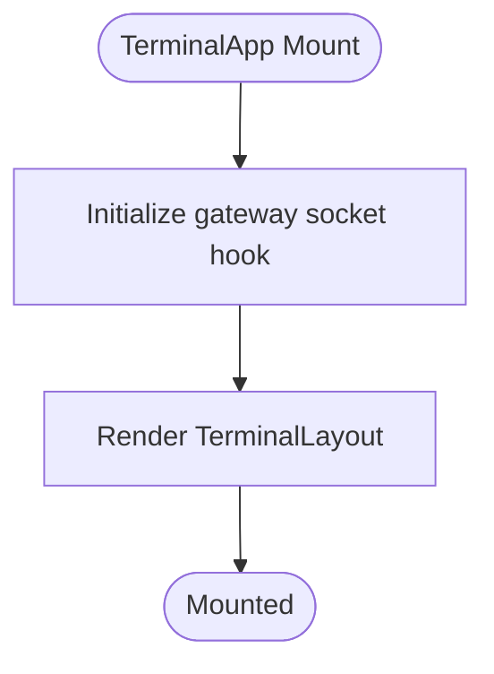
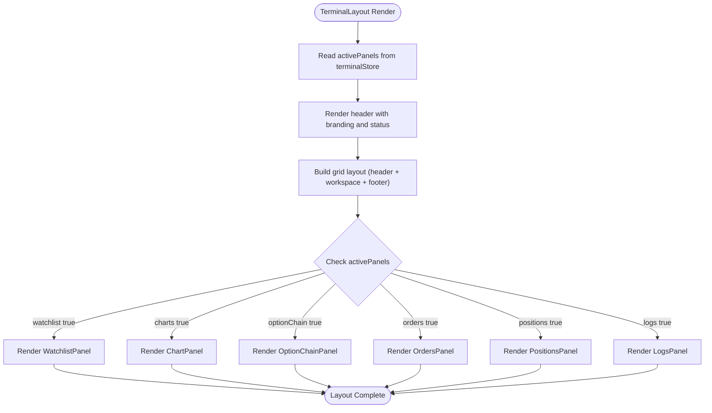
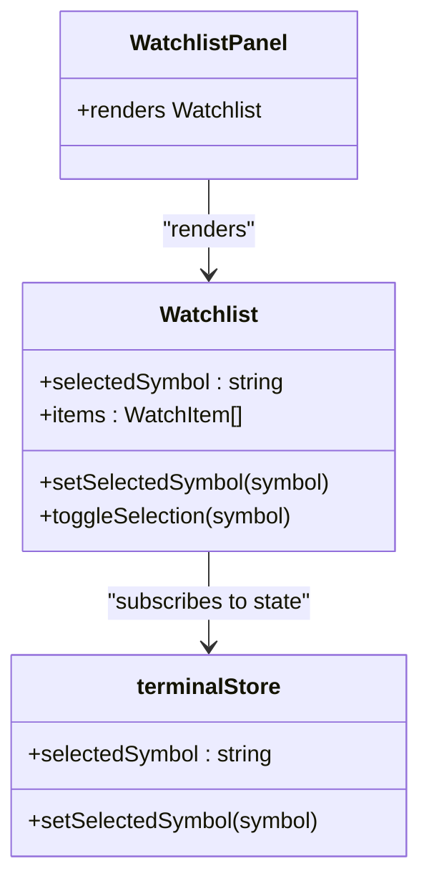
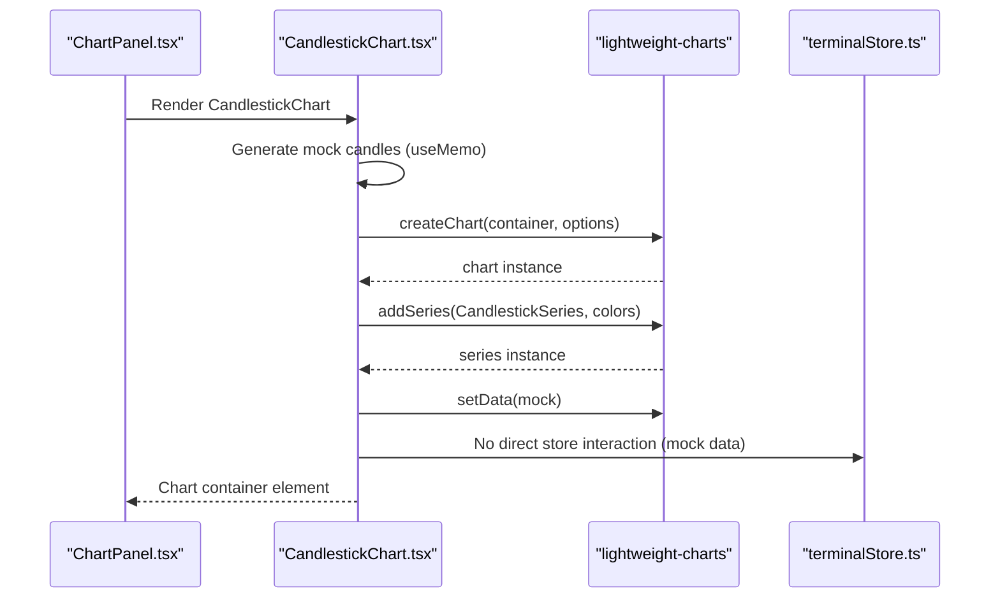
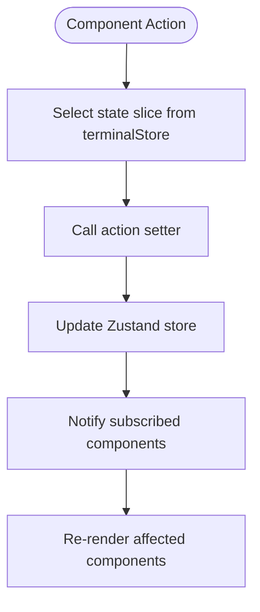
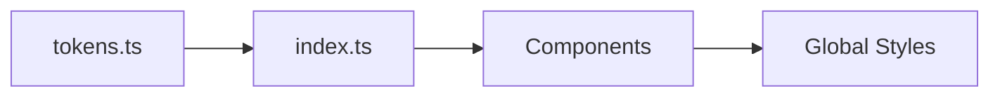
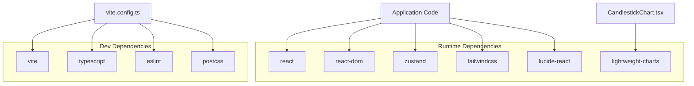

# React Application Architecture

<cite>
**Referenced Files in This Document**
- [main.tsx](file://frontend/src/main.tsx)
- [App.tsx](file://frontend/src/App.tsx)
- [TerminalApp.tsx](file://frontend/src/app/TerminalApp.tsx)
- [TerminalLayout.tsx](file://frontend/src/ui/layout/TerminalLayout.tsx)
- [WatchlistPanel.tsx](file://frontend/src/ui/panels/WatchlistPanel.tsx)
- [ChartPanel.tsx](file://frontend/src/ui/panels/ChartPanel.tsx)
- [Watchlist.tsx](file://frontend/src/ui/widgets/Watchlist/Watchlist.tsx)
- [CandlestickChart.tsx](file://frontend/src/ui/widgets/charts/CandlestickChart.tsx)
- [terminalStore.ts](file://frontend/src/state/terminalStore.ts)
- [types.ts](file://frontend/src/domain/dto/types.ts)
- [tokens.ts](file://frontend/src/theme/tokens.ts)
- [index.ts](file://frontend/src/theme/index.ts)
- [package.json](file://frontend/package.json)
- [vite.config.ts](file://frontend/vite.config.ts)
</cite>

## Table of Contents
1. [Introduction](#introduction)
2. [Project Structure](#project-structure)
3. [Core Components](#core-components)
4. [Architecture Overview](#architecture-overview)
5. [Detailed Component Analysis](#detailed-component-analysis)
6. [Dependency Analysis](#dependency-analysis)
7. [Performance Considerations](#performance-considerations)
8. [Troubleshooting Guide](#troubleshooting-guide)
9. [Conclusion](#conclusion)

## Introduction
This document provides comprehensive documentation for the React application architecture used in the Trade-J terminal interface. The application follows a modular, component-driven design with a focus on clean separation of concerns, efficient state management, and extensible theming. It leverages modern tooling including Vite for build and development, Tailwind CSS for styling, lightweight-charts for financial charting, and Zustand for state management. The architecture emphasizes composability, with layout components orchestrating multiple functional panels that encapsulate specific trading capabilities such as watchlists, charts, and order management.

## Project Structure
The frontend application is organized into distinct layers that promote maintainability and scalability:
- Entry point: Initializes the React root and renders the main application component.
- Application shell: Provides the top-level application wrapper and integrates gateway socket hooks.
- Layout system: Defines the primary screen layout and panel orchestration.
- Panels: Functional containers that host specific trading features.
- Widgets: Reusable UI components implementing individual features.
- State management: Centralized store for UI state and domain data.
- Domain DTOs: Type-safe data structures representing market data and trading entities.
- Theme system: Centralized tokens and styles for consistent theming.
- Tooling: Vite configuration, TypeScript setup, and development server proxy.

**Diagram sources**
- [main.tsx:1-11](file://frontend/src/main.tsx#L1-L11)
- [App.tsx:1-6](file://frontend/src/App.tsx#L1-L6)
- [TerminalApp.tsx:1-8](file://frontend/src/app/TerminalApp.tsx#L1-L8)
- [TerminalLayout.tsx:1-73](file://frontend/src/ui/layout/TerminalLayout.tsx#L1-L73)
- [WatchlistPanel.tsx:1-6](file://frontend/src/ui/panels/WatchlistPanel.tsx#L1-L6)
- [ChartPanel.tsx:1-16](file://frontend/src/ui/panels/ChartPanel.tsx#L1-L16)
- [Watchlist.tsx:1-89](file://frontend/src/ui/widgets/Watchlist/Watchlist.tsx#L1-L89)
- [CandlestickChart.tsx:1-78](file://frontend/src/ui/widgets/charts/CandlestickChart.tsx#L1-L78)
- [terminalStore.ts:1-170](file://frontend/src/state/terminalStore.ts#L1-L170)
- [types.ts:1-128](file://frontend/src/domain/dto/types.ts#L1-L128)
- [tokens.ts:1-6](file://frontend/src/theme/tokens.ts#L1-L6)
- [index.ts:1-2](file://frontend/src/theme/index.ts#L1-L2)

**Section sources**
- [main.tsx:1-11](file://frontend/src/main.tsx#L1-L11)
- [App.tsx:1-6](file://frontend/src/App.tsx#L1-L6)
- [TerminalApp.tsx:1-8](file://frontend/src/app/TerminalApp.tsx#L1-L8)
- [TerminalLayout.tsx:1-73](file://frontend/src/ui/layout/TerminalLayout.tsx#L1-L73)

## Core Components
This section documents the primary building blocks of the application and their responsibilities:

- Application entry point: Creates the React root and renders the main App component.
- App wrapper: Delegates rendering to the TerminalApp component.
- Terminal application: Initializes gateway socket integration and renders the layout.
- Terminal layout: Orchestrates the main screen structure with header, workspace, and bottom panels.
- Panel components: Thin wrappers around widget components for consistent spacing and headers.
- Widget components: Implement specific features such as watchlist navigation and candlestick chart rendering.
- State store: Centralized Zustand store managing UI state, data modes, selections, and domain data.
- Domain DTOs: Strongly typed definitions for quotes, candles, option chains, market depth, and analytics data.
- Theme tokens: Centralized typography and color tokens for consistent theming.

Key implementation patterns:
- Composition over inheritance: Panels wrap widgets to provide consistent headers and spacing.
- Hook-based state extraction: Components subscribe to specific slices of the Zustand store.
- Memoization for performance: useMemo is used to prevent unnecessary recalculations.
- External library integration: lightweight-charts is integrated via widget components.

**Section sources**
- [main.tsx:1-11](file://frontend/src/main.tsx#L1-L11)
- [App.tsx:1-6](file://frontend/src/App.tsx#L1-L6)
- [TerminalApp.tsx:1-8](file://frontend/src/app/TerminalApp.tsx#L1-L8)
- [TerminalLayout.tsx:1-73](file://frontend/src/ui/layout/TerminalLayout.tsx#L1-L73)
- [WatchlistPanel.tsx:1-6](file://frontend/src/ui/panels/WatchlistPanel.tsx#L1-L6)
- [ChartPanel.tsx:1-16](file://frontend/src/ui/panels/ChartPanel.tsx#L1-L16)
- [Watchlist.tsx:1-89](file://frontend/src/ui/widgets/Watchlist/Watchlist.tsx#L1-L89)
- [CandlestickChart.tsx:1-78](file://frontend/src/ui/widgets/charts/CandlestickChart.tsx#L1-L78)
- [terminalStore.ts:1-170](file://frontend/src/state/terminalStore.ts#L1-L170)
- [types.ts:1-128](file://frontend/src/domain/dto/types.ts#L1-L128)
- [tokens.ts:1-6](file://frontend/src/theme/tokens.ts#L1-L6)

## Architecture Overview
The application follows a unidirectional data flow pattern:
- Entry point initializes the React application.
- TerminalApp integrates gateway socket hooks and renders TerminalLayout.
- TerminalLayout manages the grid-based layout and conditionally renders active panels.
- Panel components render widget components responsible for specific features.
- Widget components read from and write to the Zustand store via selectors and actions.
- Domain DTOs provide type safety for incoming data.
- Theme tokens enable consistent styling across components.

**Diagram sources**
- [main.tsx:1-11](file://frontend/src/main.tsx#L1-L11)
- [App.tsx:1-6](file://frontend/src/App.tsx#L1-L6)
- [TerminalApp.tsx:1-8](file://frontend/src/app/TerminalApp.tsx#L1-L8)
- [TerminalLayout.tsx:1-73](file://frontend/src/ui/layout/TerminalLayout.tsx#L1-L73)
- [WatchlistPanel.tsx:1-6](file://frontend/src/ui/panels/WatchlistPanel.tsx#L1-L6)
- [ChartPanel.tsx:1-16](file://frontend/src/ui/panels/ChartPanel.tsx#L1-L16)
- [Watchlist.tsx:1-89](file://frontend/src/ui/widgets/Watchlist/Watchlist.tsx#L1-L89)
- [CandlestickChart.tsx:1-78](file://frontend/src/ui/widgets/charts/CandlestickChart.tsx#L1-L78)
- [terminalStore.ts:1-170](file://frontend/src/state/terminalStore.ts#L1-L170)

## Detailed Component Analysis

### Terminal Application Shell
The TerminalApp component serves as the application shell, integrating gateway socket hooks and delegating rendering to the layout system. It ensures that the terminal remains connected to the data feed during its lifecycle.

**Diagram sources**
- [TerminalApp.tsx:1-8](file://frontend/src/app/TerminalApp.tsx#L1-L8)

**Section sources**
- [TerminalApp.tsx:1-8](file://frontend/src/app/TerminalApp.tsx#L1-L8)

### Terminal Layout System
The TerminalLayout component defines the primary screen structure using a CSS Grid layout:
- Header row: Branding and status indicators for WebSocket connection and operational mode.
- Main workspace: Split into left sidebar (watchlist) and right workspace (charts and option chain).
- Bottom row: Collapsible area for orders, positions, and logs panels.
- Conditional rendering: Panels are rendered only when marked active in the store.

**Diagram sources**
- [TerminalLayout.tsx:1-73](file://frontend/src/ui/layout/TerminalLayout.tsx#L1-L73)
- [terminalStore.ts:1-170](file://frontend/src/state/terminalStore.ts#L1-L170)

**Section sources**
- [TerminalLayout.tsx:1-73](file://frontend/src/ui/layout/TerminalLayout.tsx#L1-L73)
- [terminalStore.ts:1-170](file://frontend/src/state/terminalStore.ts#L1-L170)

### Watchlist Panel and Widget
The WatchlistPanel is a thin wrapper around the Watchlist widget, providing consistent spacing and a header. The Watchlist widget implements:
- Mock data initialization for demonstration.
- Selection state via the Zustand store.
- Memoized item list to avoid re-renders.
- Visual feedback for active selections and directional changes.

**Diagram sources**
- [WatchlistPanel.tsx:1-6](file://frontend/src/ui/panels/WatchlistPanel.tsx#L1-L6)
- [Watchlist.tsx:1-89](file://frontend/src/ui/widgets/Watchlist/Watchlist.tsx#L1-L89)
- [terminalStore.ts:1-170](file://frontend/src/state/terminalStore.ts#L1-L170)

**Section sources**
- [WatchlistPanel.tsx:1-6](file://frontend/src/ui/panels/WatchlistPanel.tsx#L1-L6)
- [Watchlist.tsx:1-89](file://frontend/src/ui/widgets/Watchlist/Watchlist.tsx#L1-L89)
- [terminalStore.ts:1-170](file://frontend/src/state/terminalStore.ts#L1-L170)

### Chart Panel and Candlestick Widget
The ChartPanel provides a structured container for the CandlestickChart widget, ensuring consistent headers and padding. The CandlestickChart widget:
- Integrates lightweight-charts for rendering candlestick data.
- Generates mock candle data using a deterministic algorithm.
- Manages chart lifecycle via useEffect cleanup.
- Applies dark theme styling consistent with the application palette.

**Diagram sources**
- [ChartPanel.tsx:1-16](file://frontend/src/ui/panels/ChartPanel.tsx#L1-L16)
- [CandlestickChart.tsx:1-78](file://frontend/src/ui/widgets/charts/CandlestickChart.tsx#L1-L78)
- [terminalStore.ts:1-170](file://frontend/src/state/terminalStore.ts#L1-L170)

**Section sources**
- [ChartPanel.tsx:1-16](file://frontend/src/ui/panels/ChartPanel.tsx#L1-L16)
- [CandlestickChart.tsx:1-78](file://frontend/src/ui/widgets/charts/CandlestickChart.tsx#L1-L78)
- [terminalStore.ts:1-170](file://frontend/src/state/terminalStore.ts#L1-L170)

### State Management Integration
The Zustand store centralizes UI state and domain data:
- UI state: Selected symbol, timeframe, panel visibility, and WebSocket connection status.
- Data state: Market data keyed by symbol (quotes, candles, option chains, depth).
- Analytics state: DOM analytics data including depth imbalances, heatmaps, alerts, and order book snapshots.
- Actions: Setters for all state slices, enabling components to update state declaratively.

**Diagram sources**
- [terminalStore.ts:1-170](file://frontend/src/state/terminalStore.ts#L1-L170)

**Section sources**
- [terminalStore.ts:1-170](file://frontend/src/state/terminalStore.ts#L1-L170)

### Theme System Implementation
The theme system provides centralized tokens and styles:
- Typography tokens: Define monospaced fonts for consistent readability.
- Index export: Facilitates easy imports across components.
- Global CSS: Tailwind-based styling applied at the root level.

**Diagram sources**
- [tokens.ts:1-6](file://frontend/src/theme/tokens.ts#L1-L6)
- [index.ts:1-2](file://frontend/src/theme/index.ts#L1-L2)

**Section sources**
- [tokens.ts:1-6](file://frontend/src/theme/tokens.ts#L1-L6)
- [index.ts:1-2](file://frontend/src/theme/index.ts#L1-L2)

### Domain Data Types
The domain DTOs define strongly typed structures for market data and trading entities:
- Market data: Quote, Candle, OptionChain, MarketDepth.
- Positions and holdings: Position, Holding.
- Orders and news: Order, NewsItem.
- Strategy signals: StrategySignal.
- DOM analytics: DepthImbalance, HeatmapChunk, IcebergAlert, AbsorptionAlert, SRLevelsUpdate, OrderBookSnapshot.

These types ensure type safety and improve developer experience across the application.

**Section sources**
- [types.ts:1-128](file://frontend/src/domain/dto/types.ts#L1-L128)

## Dependency Analysis
External dependencies and integrations:
- React and ReactDOM: Core framework and DOM renderer.
- lightweight-charts: Financial charting library integrated via the CandlestickChart widget.
- lucide-react: Icon library for UI elements.
- Tailwind CSS: Utility-first CSS framework for styling.
- Zustand: Lightweight state management solution.
- Vite: Build tool and development server with proxy configuration for API and WebSocket connections.

**Diagram sources**
- [package.json:1-38](file://frontend/package.json#L1-L38)
- [vite.config.ts:1-19](file://frontend/vite.config.ts#L1-L19)

**Section sources**
- [package.json:1-38](file://frontend/package.json#L1-L38)
- [vite.config.ts:1-19](file://frontend/vite.config.ts#L1-L19)

## Performance Considerations
- Memoization: useMemo is used in components like CandlestickChart and Watchlist to prevent unnecessary recalculations and re-renders.
- Conditional rendering: Panels are only mounted when active, reducing DOM overhead.
- Efficient state updates: Zustand enables granular updates, minimizing re-renders by subscribing to specific slices.
- External library lifecycle: Chart instances are properly cleaned up in useEffect cleanup functions to prevent memory leaks.
- Development server proxy: Vite's proxy configuration reduces network overhead during development by routing requests to backend services.

## Troubleshooting Guide
Common issues and resolutions:
- Chart not rendering: Verify that the container element exists and that the chart instance is created within a useEffect with proper cleanup.
- Panel visibility issues: Ensure activePanels keys match the expected PanelKey union and that setters are called correctly.
- WebSocket connection status: Confirm that the gateway socket hook is initialized in TerminalApp and that the wsConnected state is updated appropriately.
- Styling inconsistencies: Check Tailwind configuration and ensure theme tokens are imported and applied consistently across components.
- Build errors: Validate Vite configuration and ensure aliases resolve correctly to the src directory.

**Section sources**
- [CandlestickChart.tsx:1-78](file://frontend/src/ui/widgets/charts/CandlestickChart.tsx#L1-L78)
- [terminalStore.ts:1-170](file://frontend/src/state/terminalStore.ts#L1-L170)
- [TerminalApp.tsx:1-8](file://frontend/src/app/TerminalApp.tsx#L1-L8)
- [vite.config.ts:1-19](file://frontend/vite.config.ts#L1-L19)

## Conclusion
The React application architecture demonstrates a clean, modular design that prioritizes component composition, efficient state management, and consistent theming. The layout system provides a flexible grid-based structure, while panel and widget components encapsulate specific functionalities. The integration of lightweight-charts and Zustand enhances the application's capabilities and performance. With strong typing through domain DTOs and a robust build setup via Vite, the architecture supports scalable development and maintenance.