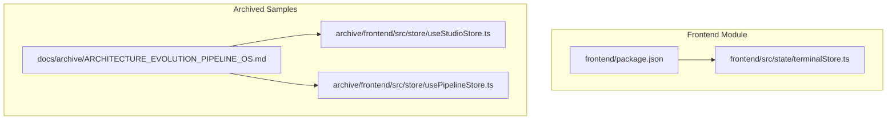
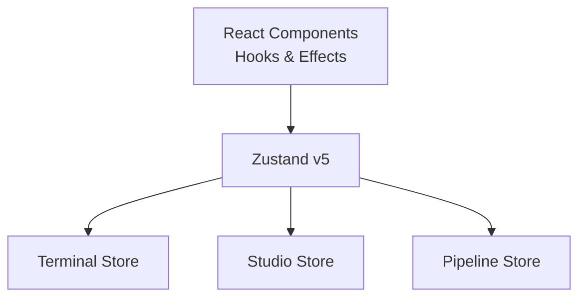
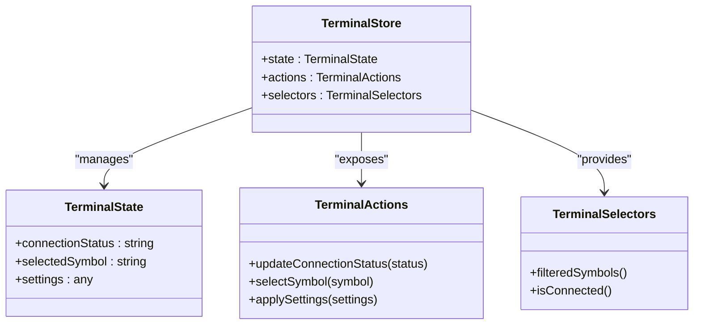
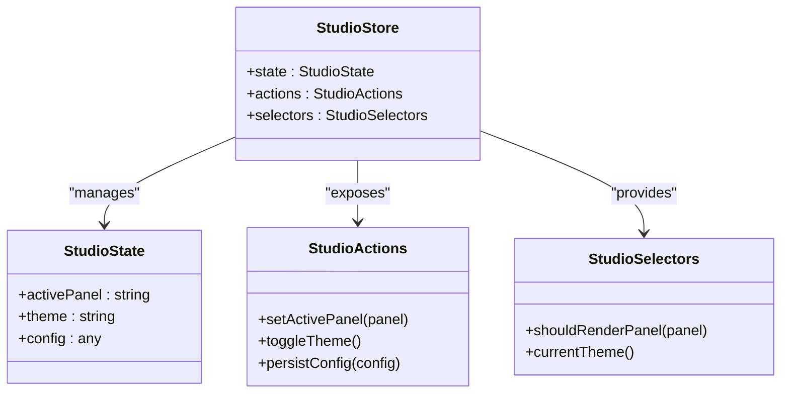
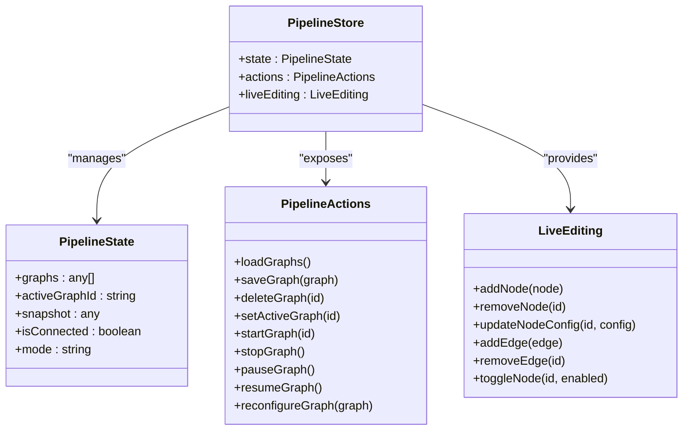
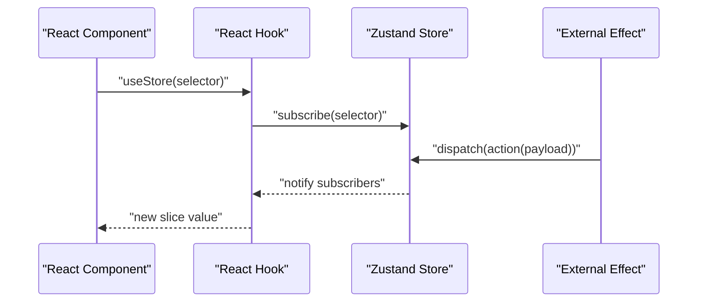
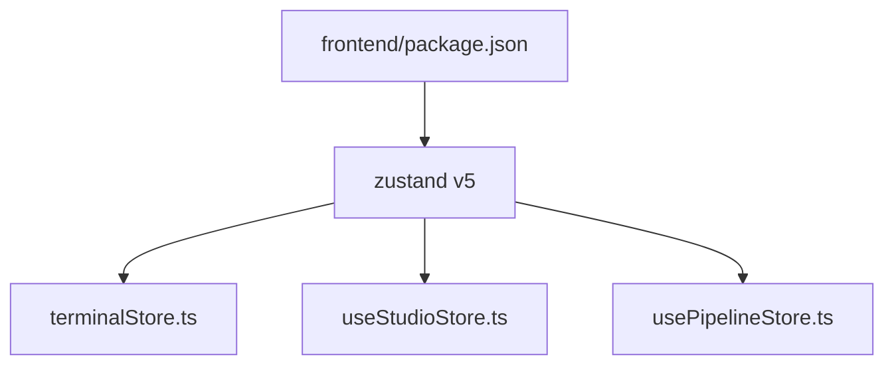

# State Management

<cite>
**Referenced Files in This Document**
- [terminalStore.ts](file://frontend/src/state/terminalStore.ts)
- [useStudioStore.ts](file://archive/frontend/src/store/useStudioStore.ts)
- [usePipelineStore.ts](file://archive/frontend/src/store/usePipelineStore.ts)
- [package.json](file://frontend/package.json)
- [ARCHITECTURE_EVOLUTION_PIPELINE_OS.md](file://docs/archive/ARCHITECTURE_EVOLUTION_PIPELINE_OS.md)
</cite>

## Table of Contents
1. [Introduction](#introduction)
2. [Project Structure](#project-structure)
3. [Core Components](#core-components)
4. [Architecture Overview](#architecture-overview)
5. [Detailed Component Analysis](#detailed-component-analysis)
6. [Dependency Analysis](#dependency-analysis)
7. [Performance Considerations](#performance-considerations)
8. [Troubleshooting Guide](#troubleshooting-guide)
9. [Conclusion](#conclusion)

## Introduction
This document explains the frontend state management system used in the Trade-J project. It focuses on the store architecture, state slices, and data flow patterns. It documents the terminal store implementation, studio store functionality, and pipeline store integration. Practical examples of state updates, selector usage, and effect handling are included, along with integration with React hooks, performance optimization strategies, and state persistence mechanisms. Common state management patterns, debugging techniques, and best practices for scalable state architecture are also addressed.

## Project Structure
The frontend state management is primarily implemented using Zustand v5. The key store files are located under the frontend module, while additional store patterns and documentation are available in archived frontend samples and architecture docs.

**Diagram sources**
- [terminalStore.ts](file://frontend/src/state/terminalStore.ts)
- [useStudioStore.ts](file://archive/frontend/src/store/useStudioStore.ts)
- [usePipelineStore.ts](file://archive/frontend/src/store/usePipelineStore.ts)
- [package.json](file://frontend/package.json)
- [ARCHITECTURE_EVOLUTION_PIPELINE_OS.md](file://docs/archive/ARCHITECTURE_EVOLUTION_PIPELINE_OS.md)

**Section sources**
- [package.json:12-36](file://frontend/package.json#L12-L36)
- [terminalStore.ts:1-50](file://frontend/src/state/terminalStore.ts#L1-L50)

## Core Components
- Terminal Store: Implements a Zustand store for terminal-related state and actions. It exposes state slices and methods to update terminal state.
- Studio Store (Archived Sample): Demonstrates a Zustand store pattern for studio-related state, including actions and selectors.
- Pipeline Store (Archived Sample): Demonstrates a Zustand store pattern for pipeline graph management, including live editing and runtime controls.

Key characteristics:
- Stores are created via Zustand’s create function.
- Actions update immutable state slices.
- Selectors enable efficient subscription to specific parts of the state.
- Optional middleware supports persistence and development tools.

**Section sources**
- [terminalStore.ts:1-50](file://frontend/src/state/terminalStore.ts#L1-L50)
- [useStudioStore.ts:1-200](file://archive/frontend/src/store/useStudioStore.ts#L1-L200)
- [usePipelineStore.ts:1-200](file://archive/frontend/src/store/usePipelineStore.ts#L1-L200)

## Architecture Overview
The state management architecture leverages Zustand v5 for minimal boilerplate and strong TypeScript support. Stores encapsulate domain-specific state slices and expose pure update functions and derived selectors. Effects (e.g., SSE streaming, WebSocket connections) are integrated by invoking store actions from React components or hooks.

**Diagram sources**
- [package.json:35](file://frontend/package.json#L35)
- [terminalStore.ts:1-50](file://frontend/src/state/terminalStore.ts#L1-L50)
- [useStudioStore.ts:1-200](file://archive/frontend/src/store/useStudioStore.ts#L1-L200)
- [usePipelineStore.ts:1-200](file://archive/frontend/src/store/usePipelineStore.ts#L1-L200)

## Detailed Component Analysis

### Terminal Store
The terminal store defines terminal state slices and actions. Typical patterns include:
- State slices: terminal state, connection status, selected symbol, etc.
- Actions: update terminal state, switch symbol, apply settings.
- Selectors: derive computed values (e.g., filtered lists, derived metrics).
- Effects: integrate SSE/WebSocket updates by dispatching actions on events.

**Diagram sources**
- [terminalStore.ts:1-50](file://frontend/src/state/terminalStore.ts#L1-L50)

**Section sources**
- [terminalStore.ts:1-50](file://frontend/src/state/terminalStore.ts#L1-L50)

### Studio Store (Archived Sample)
The studio store demonstrates a comprehensive Zustand store pattern:
- State slices: studio configuration, active panel, theme, etc.
- Actions: update configuration, toggle panels, persist settings.
- Selectors: derived UI state for rendering.
- Middleware: optional persistence and devtools integration.

**Diagram sources**
- [useStudioStore.ts:1-200](file://archive/frontend/src/store/useStudioStore.ts#L1-L200)

**Section sources**
- [useStudioStore.ts:1-200](file://archive/frontend/src/store/useStudioStore.ts#L1-L200)

### Pipeline Store (Archived Sample)
The pipeline store manages pipeline graphs and runtime controls:
- State slices: graphs list, active graph, runtime mode, connection status.
- Actions: load/save graphs, start/stop/pause/resume graphs, reconfigure.
- Live editing: add/remove/update nodes and edges.
- Effects: SSE-driven runtime updates.

**Diagram sources**
- [usePipelineStore.ts:1-200](file://archive/frontend/src/store/usePipelineStore.ts#L1-L200)
- [ARCHITECTURE_EVOLUTION_PIPELINE_OS.md:1622-1680](file://docs/archive/ARCHITECTURE_EVOLUTION_PIPELINE_OS.md#L1622-L1680)

**Section sources**
- [usePipelineStore.ts:1-200](file://archive/frontend/src/store/usePipelineStore.ts#L1-L200)
- [ARCHITECTURE_EVOLUTION_PIPELINE_OS.md:1622-1680](file://docs/archive/ARCHITECTURE_EVOLUTION_PIPELINE_OS.md#L1622-L1680)

### Data Flow Patterns
Common patterns observed across stores:
- Pure actions update immutable state slices.
- Selectors compute derived values and minimize re-renders.
- Effects trigger actions on external events (e.g., SSE, WebSocket).
- Optional middleware enables persistence and devtools.

[No sources needed since this diagram shows conceptual workflow, not actual code structure]

## Dependency Analysis
Zustand v5 is declared as a dependency in the frontend module. The terminal store and archived sample stores demonstrate how to structure state slices, actions, and selectors. The pipeline store documentation outlines advanced patterns such as live editing and runtime controls.

**Diagram sources**
- [package.json:35](file://frontend/package.json#L35)
- [terminalStore.ts:1-50](file://frontend/src/state/terminalStore.ts#L1-L50)
- [useStudioStore.ts:1-200](file://archive/frontend/src/store/useStudioStore.ts#L1-L200)
- [usePipelineStore.ts:1-200](file://archive/frontend/src/store/usePipelineStore.ts#L1-L200)

**Section sources**
- [package.json:35](file://frontend/package.json#L35)
- [terminalStore.ts:1-50](file://frontend/src/state/terminalStore.ts#L1-L50)
- [useStudioStore.ts:1-200](file://archive/frontend/src/store/useStudioStore.ts#L1-L200)
- [usePipelineStore.ts:1-200](file://archive/frontend/src/store/usePipelineStore.ts#L1-L200)

## Performance Considerations
- Prefer narrow selectors to reduce re-renders.
- Use subscribeWithSelector middleware to subscribe to specific slices.
- Batch updates with a single action when possible.
- Avoid unnecessary deep equality checks; keep state flat where feasible.
- Persist only frequently accessed slices to localStorage/sessionStorage.
- Debounce or throttle high-frequency effects (e.g., SSE) before updating state.

[No sources needed since this section provides general guidance]

## Troubleshooting Guide
- Verify Zustand installation and version compatibility.
- Confirm store initialization and middleware registration.
- Use devtools middleware to inspect state transitions and actions.
- Validate selectors to ensure they return stable references when unchanged.
- For effects, ensure cleanup handlers prevent memory leaks and redundant subscriptions.
- For persistence, confirm storage keys and serialization formats align with store shape.

**Section sources**
- [package.json:35](file://frontend/package.json#L35)
- [useStudioStore.ts:1-200](file://archive/frontend/src/store/useStudioStore.ts#L1-L200)
- [usePipelineStore.ts:1-200](file://archive/frontend/src/store/usePipelineStore.ts#L1-L200)

## Conclusion
The Trade-J frontend employs a clean, scalable state management architecture using Zustand v5. The terminal store encapsulates terminal-specific state and actions, while archived samples illustrate studio and pipeline store patterns. By leveraging selectors, middleware, and effect-driven updates, the system achieves predictable data flow and maintainable state slices. Adopting the recommended performance and debugging practices ensures long-term scalability and reliability.