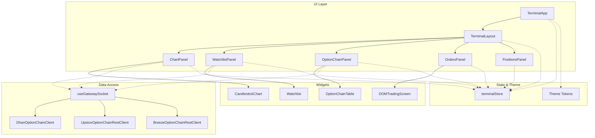
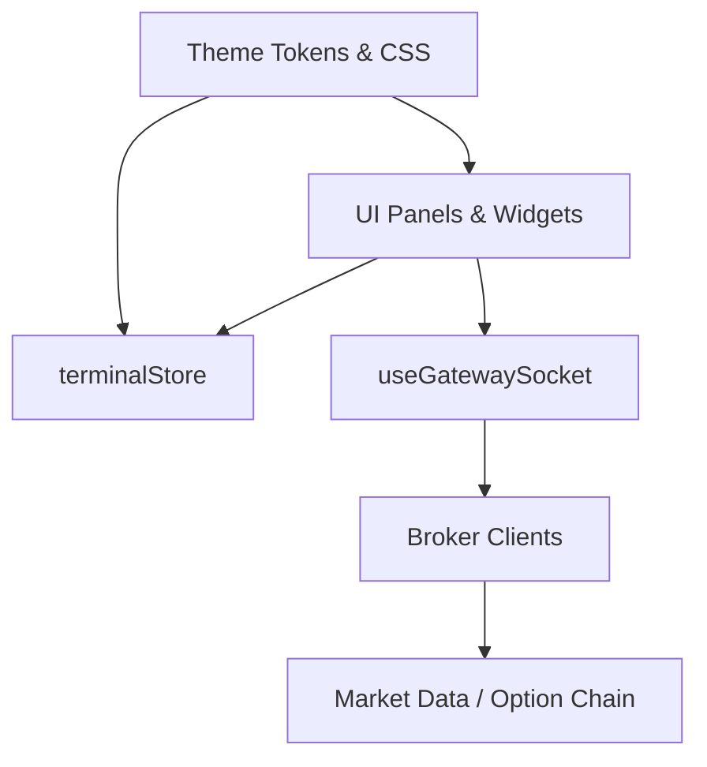
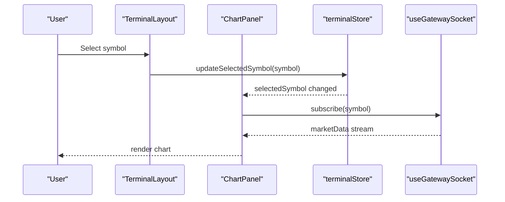
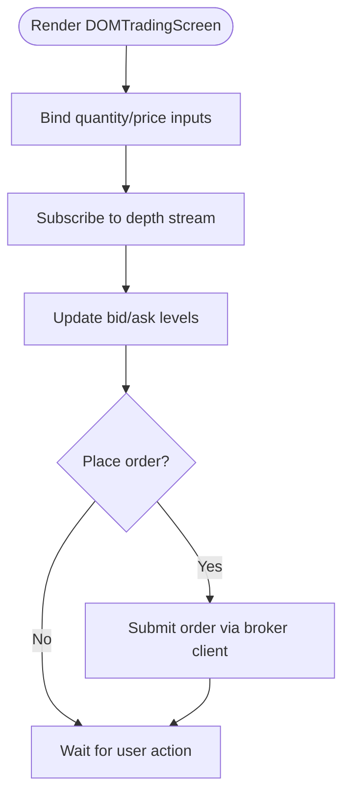
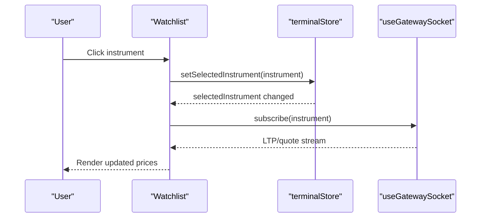
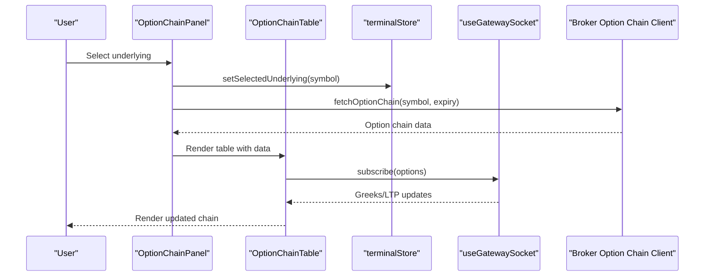
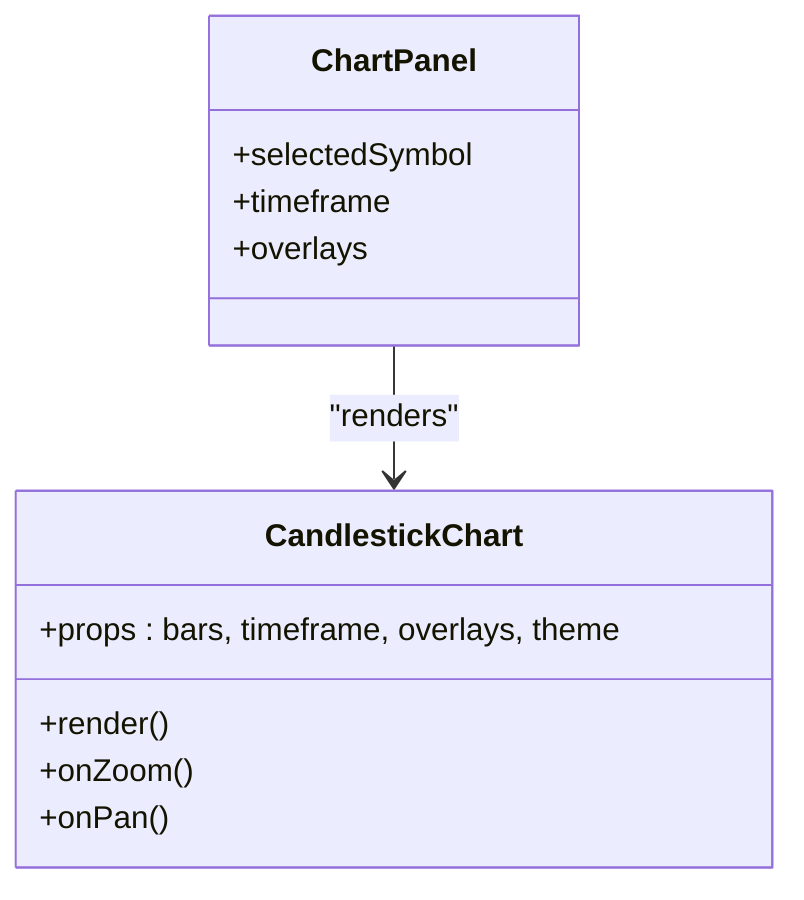
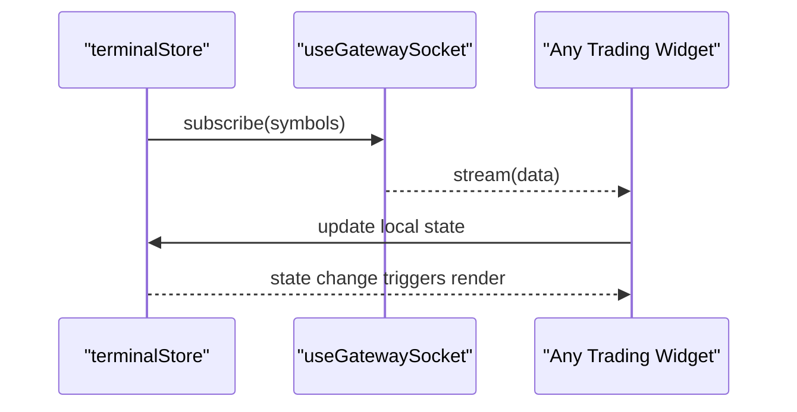
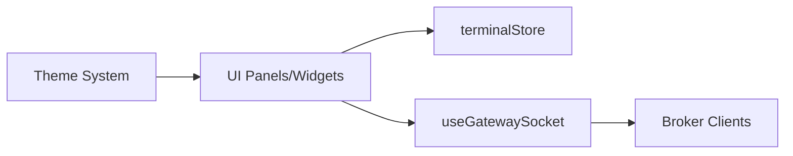

# Trading Components

<cite>
**Referenced Files in This Document**
- [TerminalApp.tsx](file://frontend/src/app/TerminalApp.tsx)
- [TerminalLayout.tsx](file://frontend/src/ui/layout/TerminalLayout.tsx)
- [DOMTradingScreen.tsx](file://frontend/src/ui/widgets/DOM/DOMTradingScreen.tsx)
- [OptionChainTable.tsx](file://frontend/src/ui/widgets/OptionChain/OptionChainTable.tsx)
- [OptionChainPanel.tsx](file://frontend/src/ui/panels/OptionChainPanel.tsx)
- [Watchlist.tsx](file://frontend/src/ui/widgets/Watchlist/Watchlist.tsx)
- [WatchlistPanel.tsx](file://frontend/src/ui/panels/WatchlistPanel.tsx)
- [CandlestickChart.tsx](file://frontend/src/ui/widgets/charts/CandlestickChart.tsx)
- [ChartPanel.tsx](file://frontend/src/ui/panels/ChartPanel.tsx)
- [OrdersPanel.tsx](file://frontend/src/ui/panels/OrdersPanel.tsx)
- [PositionsPanel.tsx](file://frontend/src/ui/panels/PositionsPanel.tsx)
- [terminalStore.ts](file://frontend/src/state/terminalStore.ts)
- [types.ts](file://frontend/src/domain/dto/types.ts)
- [useGatewaySocket.ts](file://frontend/src/hooks/useGatewaySocket.ts)
- [theme.css](file://frontend/src/theme/theme.css)
- [tokens.ts](file://frontend/src/theme/tokens.ts)
- [index.ts](file://frontend/src/theme/index.ts)
- [index.css](file://frontend/src/theme/index.css)
- [App.tsx](file://frontend/src/App.tsx)
- [main.tsx](file://frontend/src/main.tsx)
- [DhanOptionChainClient.java](file://broker/dhan/src/main/java/com/tradej/broker/dhan/options/DhanOptionChainClient.java)
- [DhanOptionChainResponseMapper.java](file://broker/dhan/src/main/java/com/tradej/broker/dhan/options/DhanOptionChainResponseMapper.java)
- [UpstoxOptionChainRestClient.java](file://broker/upstox/src/main/java/com/tradej/broker/upstox/rest/UpstoxOptionChainRestClient.java)
- [BreezeOptionChainRestClient.java](file://broker/icici/src/main/java/com/tradej/broker/icici/rest/BreezeOptionChainRestClient.java)
</cite>

## Table of Contents
1. [Introduction](#introduction)
2. [Project Structure](#project-structure)
3. [Core Components](#core-components)
4. [Architecture Overview](#architecture-overview)
5. [Detailed Component Analysis](#detailed-component-analysis)
6. [Dependency Analysis](#dependency-analysis)
7. [Performance Considerations](#performance-considerations)
8. [Troubleshooting Guide](#troubleshooting-guide)
9. [Conclusion](#conclusion)
10. [Appendices](#appendices)

## Introduction
This document explains the trading components and user interface elements of the terminal front end, focusing on the trading panel architecture, DOM trading screen, watchlist, and option chain display. It documents component props, event handlers, data binding patterns, and real-time update mechanisms. Practical usage, customization, and integration patterns are included, along with styling and responsive design considerations.

## Project Structure
The trading UI is organized around reusable widgets and panels, orchestrated by a terminal layout and state store. Market data visualization is provided by chart widgets, while option chain and watchlist are implemented as dedicated panels and widgets. Real-time updates are driven by a gateway socket hook.

**Diagram sources**
- [TerminalLayout.tsx](file://frontend/src/ui/layout/TerminalLayout.tsx)
- [TerminalApp.tsx](file://frontend/src/app/TerminalApp.tsx)
- [ChartPanel.tsx](file://frontend/src/ui/panels/ChartPanel.tsx)
- [WatchlistPanel.tsx](file://frontend/src/ui/panels/WatchlistPanel.tsx)
- [OptionChainPanel.tsx](file://frontend/src/ui/panels/OptionChainPanel.tsx)
- [OrdersPanel.tsx](file://frontend/src/ui/panels/OrdersPanel.tsx)
- [PositionsPanel.tsx](file://frontend/src/ui/panels/PositionsPanel.tsx)
- [DOMTradingScreen.tsx](file://frontend/src/ui/widgets/DOM/DOMTradingScreen.tsx)
- [Watchlist.tsx](file://frontend/src/ui/widgets/Watchlist/Watchlist.tsx)
- [OptionChainTable.tsx](file://frontend/src/ui/widgets/OptionChain/OptionChainTable.tsx)
- [CandlestickChart.tsx](file://frontend/src/ui/widgets/charts/CandlestickChart.tsx)
- [terminalStore.ts](file://frontend/src/state/terminalStore.ts)
- [useGatewaySocket.ts](file://frontend/src/hooks/useGatewaySocket.ts)
- [DhanOptionChainClient.java](file://broker/dhan/src/main/java/com/tradej/broker/dhan/options/DhanOptionChainClient.java)
- [UpstoxOptionChainRestClient.java](file://broker/upstox/src/main/java/com/tradej/broker/upstox/rest/UpstoxOptionChainRestClient.java)
- [BreezeOptionChainRestClient.java](file://broker/icici/src/main/java/com/tradej/broker/icici/rest/BreezeOptionChainRestClient.java)

**Section sources**
- [TerminalApp.tsx](file://frontend/src/app/TerminalApp.tsx)
- [TerminalLayout.tsx](file://frontend/src/ui/layout/TerminalLayout.tsx)
- [terminalStore.ts](file://frontend/src/state/terminalStore.ts)
- [useGatewaySocket.ts](file://frontend/src/hooks/useGatewaySocket.ts)

## Core Components
- Trading Panel orchestration: The terminal layout composes panels for charts, watchlist, option chain, orders, and positions.
- DOM Trading Screen: Interactive depth-of-market trading widget.
- Option Chain Table: Displays strike prices, greeks, and bid/ask levels for options.
- Watchlist: Displays instruments and market data for quick monitoring.
- Chart Panel: Renders candlestick charts with configurable overlays.
- State Management: Centralized store for selected symbols, layouts, and UI state.
- Real-time Data Hook: Provides WebSocket-driven updates for market data and order feeds.

Key responsibilities:
- Component props define symbol selection, broker provider, and display preferences.
- Event handlers manage user actions (select symbol, place orders, filter watchlist).
- Data binding patterns connect store state to widget props and chart rendering.

**Section sources**
- [TerminalLayout.tsx](file://frontend/src/ui/layout/TerminalLayout.tsx)
- [DOMTradingScreen.tsx](file://frontend/src/ui/widgets/DOM/DOMTradingScreen.tsx)
- [OptionChainTable.tsx](file://frontend/src/ui/widgets/OptionChain/OptionChainTable.tsx)
- [Watchlist.tsx](file://frontend/src/ui/widgets/Watchlist/Watchlist.tsx)
- [CandlestickChart.tsx](file://frontend/src/ui/widgets/charts/CandlestickChart.tsx)
- [terminalStore.ts](file://frontend/src/state/terminalStore.ts)

## Architecture Overview
The trading UI follows a layered pattern:
- Presentation layer: Panels and widgets encapsulate UI concerns.
- State layer: Store manages global selections and UI state.
- Data layer: Socket hook streams real-time updates; broker clients fetch option chain data.
- Theming layer: CSS modules and tokens provide consistent styling.

**Diagram sources**
- [TerminalLayout.tsx](file://frontend/src/ui/layout/TerminalLayout.tsx)
- [terminalStore.ts](file://frontend/src/state/terminalStore.ts)
- [useGatewaySocket.ts](file://frontend/src/hooks/useGatewaySocket.ts)
- [DhanOptionChainClient.java](file://broker/dhan/src/main/java/com/tradej/broker/dhan/options/DhanOptionChainClient.java)
- [UpstoxOptionChainRestClient.java](file://broker/upstox/src/main/java/com/tradej/broker/upstox/rest/UpstoxOptionChainRestClient.java)
- [BreezeOptionChainRestClient.java](file://broker/icici/src/main/java/com/tradej/broker/icici/rest/BreezeOptionChainRestClient.java)
- [theme.css](file://frontend/src/theme/theme.css)
- [tokens.ts](file://frontend/src/theme/tokens.ts)

## Detailed Component Analysis

### Trading Panel Architecture
The terminal layout composes multiple panels. Each panel is responsible for a distinct aspect of the trading workflow:
- ChartPanel renders candlesticks and overlays.
- WatchlistPanel displays instrument lists and current prices.
- OptionChainPanel shows options chain for the selected underlying.
- OrdersPanel and PositionsPanel handle order entry and position tracking.

Props and interactions:
- Props include selected symbol, broker provider, and layout preferences.
- Interactions trigger state updates and real-time subscriptions.

**Diagram sources**
- [TerminalLayout.tsx](file://frontend/src/ui/layout/TerminalLayout.tsx)
- [ChartPanel.tsx](file://frontend/src/ui/panels/ChartPanel.tsx)
- [terminalStore.ts](file://frontend/src/state/terminalStore.ts)
- [useGatewaySocket.ts](file://frontend/src/hooks/useGatewaySocket.ts)

**Section sources**
- [TerminalLayout.tsx](file://frontend/src/ui/layout/TerminalLayout.tsx)
- [ChartPanel.tsx](file://frontend/src/ui/panels/ChartPanel.tsx)
- [terminalStore.ts](file://frontend/src/state/terminalStore.ts)

### DOM Trading Screen Implementation
The DOM trading screen presents depth-of-market data and supports order entry actions. Typical props include:
- Symbol identifier
- Bid/ask levels
- Selected order size and price
- Broker provider and credentials

Event handlers:
- Click handlers for price levels
- Input handlers for quantity and price
- Submit handler for placing orders

Data binding:
- Two-way binding for quantity and price inputs
- One-way binding for market depth data from the socket

**Diagram sources**
- [DOMTradingScreen.tsx](file://frontend/src/ui/widgets/DOM/DOMTradingScreen.tsx)
- [useGatewaySocket.ts](file://frontend/src/hooks/useGatewaySocket.ts)

**Section sources**
- [DOMTradingScreen.tsx](file://frontend/src/ui/widgets/DOM/DOMTradingScreen.tsx)
- [useGatewaySocket.ts](file://frontend/src/hooks/useGatewaySocket.ts)

### Watchlist Functionality
The watchlist widget displays a list of instruments with current prices and change indicators. Props include:
- List of instruments
- Selected instrument
- Sorting/filtering options

Event handlers:
- On instrument click to set as selected
- Filtering by exchange, segment, or symbol substring

Data binding:
- List items bound to instrument DTOs
- Selected item highlighted via store state

**Diagram sources**
- [Watchlist.tsx](file://frontend/src/ui/widgets/Watchlist/Watchlist.tsx)
- [WatchlistPanel.tsx](file://frontend/src/ui/panels/WatchlistPanel.tsx)
- [terminalStore.ts](file://frontend/src/state/terminalStore.ts)
- [useGatewaySocket.ts](file://frontend/src/hooks/useGatewaySocket.ts)

**Section sources**
- [Watchlist.tsx](file://frontend/src/ui/widgets/Watchlist/Watchlist.tsx)
- [WatchlistPanel.tsx](file://frontend/src/ui/panels/WatchlistPanel.tsx)
- [terminalStore.ts](file://frontend/src/state/terminalStore.ts)
- [useGatewaySocket.ts](file://frontend/src/hooks/useGatewaySocket.ts)

### Option Chain Display
The option chain panel integrates an option chain table with real-time market data. Props include:
- Underlying symbol
- Expiry dates
- Strike filters
- Greeks visibility

Event handlers:
- Change expiry to refresh chain
- Toggle columns (IV, Delta, Gamma, etc.)
- Click a row to view details or place orders

Data binding:
- Table rows bound to option chain DTOs
- Real-time updates via socket for IV, volume, open interest

**Diagram sources**
- [OptionChainPanel.tsx](file://frontend/src/ui/panels/OptionChainPanel.tsx)
- [OptionChainTable.tsx](file://frontend/src/ui/widgets/OptionChain/OptionChainTable.tsx)
- [terminalStore.ts](file://frontend/src/state/terminalStore.ts)
- [useGatewaySocket.ts](file://frontend/src/hooks/useGatewaySocket.ts)
- [DhanOptionChainClient.java](file://broker/dhan/src/main/java/com/tradej/broker/dhan/options/DhanOptionChainClient.java)
- [UpstoxOptionChainRestClient.java](file://broker/upstox/src/main/java/com/tradej/broker/upstox/rest/UpstoxOptionChainRestClient.java)
- [BreezeOptionChainRestClient.java](file://broker/icici/src/main/java/com/tradej/broker/icici/rest/BreezeOptionChainRestClient.java)

**Section sources**
- [OptionChainPanel.tsx](file://frontend/src/ui/panels/OptionChainPanel.tsx)
- [OptionChainTable.tsx](file://frontend/src/ui/widgets/OptionChain/OptionChainTable.tsx)
- [terminalStore.ts](file://frontend/src/state/terminalStore.ts)
- [useGatewaySocket.ts](file://frontend/src/hooks/useGatewaySocket.ts)

### Market Data Visualization Components
The candlestick chart widget renders OHLC bars and overlays. Props include:
- Bars data
- Timeframe
- Overlays (e.g., moving averages)
- Theme and sizing

Event handlers:
- Zoom and pan gestures
- Toggle overlays
- Switch timeframe

Data binding:
- Bars mapped to SVG paths
- Overlay series computed from OHLC

**Diagram sources**
- [CandlestickChart.tsx](file://frontend/src/ui/widgets/charts/CandlestickChart.tsx)
- [ChartPanel.tsx](file://frontend/src/ui/panels/ChartPanel.tsx)

**Section sources**
- [CandlestickChart.tsx](file://frontend/src/ui/widgets/charts/CandlestickChart.tsx)
- [ChartPanel.tsx](file://frontend/src/ui/panels/ChartPanel.tsx)

### Real-Time Updates and Data Binding Patterns
Real-time updates are handled by a socket hook that subscribes to symbols and emits streams. Components bind to these streams and update state accordingly.

Patterns:
- One component subscribes per symbol
- Store consolidates selections and active subscriptions
- Widgets re-render based on store and socket events

**Diagram sources**
- [terminalStore.ts](file://frontend/src/state/terminalStore.ts)
- [useGatewaySocket.ts](file://frontend/src/hooks/useGatewaySocket.ts)

**Section sources**
- [terminalStore.ts](file://frontend/src/state/terminalStore.ts)
- [useGatewaySocket.ts](file://frontend/src/hooks/useGatewaySocket.ts)

### Component Composition, Styling, and Responsive Design
- Composition: Panels wrap widgets; widgets are reusable across panels.
- Styling: Theme tokens and CSS modules ensure consistent spacing, colors, and typography.
- Responsive: Panels adapt layout via grid/flex; charts resize with container bounds.

Practical examples:
- Compose a custom panel by importing a widget and wiring it to the store.
- Override theme tokens for brand-specific colors.
- Use responsive breakpoints to stack panels on small screens.

**Section sources**
- [TerminalLayout.tsx](file://frontend/src/ui/layout/TerminalLayout.tsx)
- [theme.css](file://frontend/src/theme/theme.css)
- [tokens.ts](file://frontend/src/theme/tokens.ts)
- [index.css](file://frontend/src/theme/index.css)

## Dependency Analysis
The trading UI depends on:
- State store for centralized selections and UI state
- Socket hook for real-time data
- Broker clients for option chain retrieval
- Theme system for styling

**Diagram sources**
- [terminalStore.ts](file://frontend/src/state/terminalStore.ts)
- [useGatewaySocket.ts](file://frontend/src/hooks/useGatewaySocket.ts)
- [DhanOptionChainClient.java](file://broker/dhan/src/main/java/com/tradej/broker/dhan/options/DhanOptionChainClient.java)
- [UpstoxOptionChainRestClient.java](file://broker/upstox/src/main/java/com/tradej/broker/upstox/rest/UpstoxOptionChainRestClient.java)
- [BreezeOptionChainRestClient.java](file://broker/icici/src/main/java/com/tradej/broker/icici/rest/BreezeOptionChainRestClient.java)
- [theme.css](file://frontend/src/theme/theme.css)

**Section sources**
- [terminalStore.ts](file://frontend/src/state/terminalStore.ts)
- [useGatewaySocket.ts](file://frontend/src/hooks/useGatewaySocket.ts)

## Performance Considerations
- Debounce frequent UI interactions (e.g., zoom/pan) to avoid excessive re-renders.
- Virtualize long lists (watchlist, option chain) to limit DOM nodes.
- Batch socket updates to reduce render churn.
- Use memoization for derived data (e.g., overlays) to prevent unnecessary recalculations.

## Troubleshooting Guide
Common issues and resolutions:
- No real-time data: Verify socket subscription and symbol validity; check broker connectivity.
- Option chain empty: Confirm underlying selection and expiry; ensure broker client is configured.
- Rendering lag: Reduce overlay complexity; disable heavy visualizations during high-frequency updates.
- Styling inconsistencies: Ensure theme tokens are applied and CSS modules are imported.

**Section sources**
- [useGatewaySocket.ts](file://frontend/src/hooks/useGatewaySocket.ts)
- [terminalStore.ts](file://frontend/src/state/terminalStore.ts)

## Conclusion
The trading UI is modular, reactive, and extensible. Panels and widgets encapsulate functionality, state drives data flow, and sockets enable real-time updates. The theme system ensures consistent styling, and responsive layouts accommodate diverse screen sizes. Integrations with broker clients provide option chain data, while DOM and chart widgets deliver actionable insights.

## Appendices
- Example usage patterns:
  - Add a new panel by composing existing widgets and connecting to the store.
  - Customize visuals by adjusting theme tokens and CSS variables.
  - Extend option chain with additional greeks by updating the table props and socket mapping.

**Section sources**
- [TerminalApp.tsx](file://frontend/src/app/TerminalApp.tsx)
- [App.tsx](file://frontend/src/App.tsx)
- [main.tsx](file://frontend/src/main.tsx)
- [types.ts](file://frontend/src/domain/dto/types.ts)