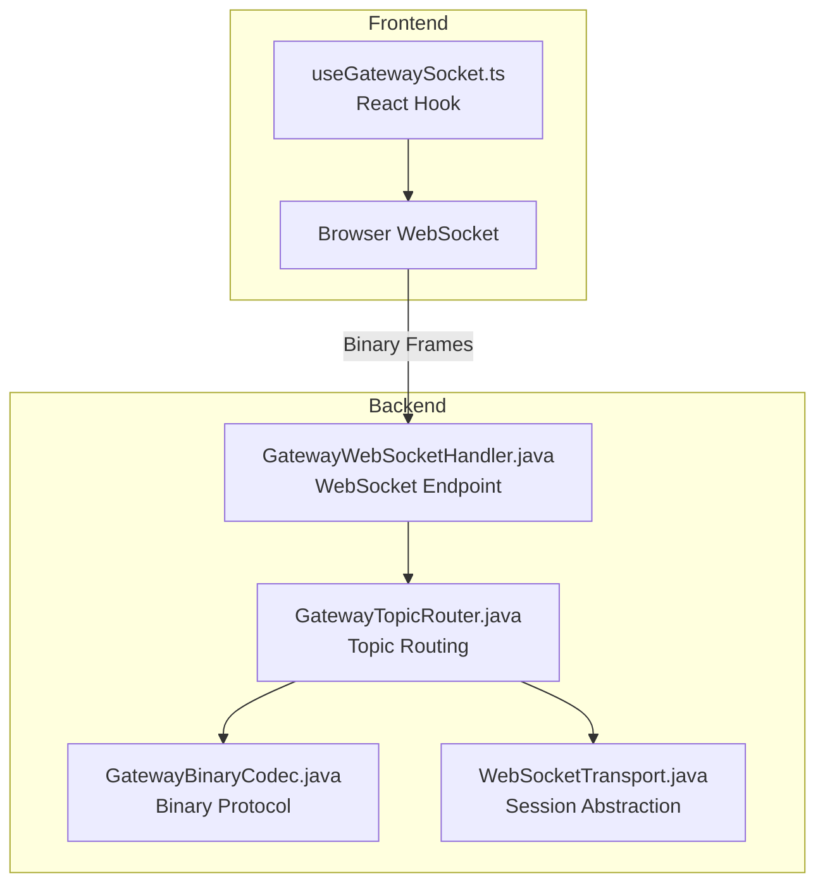
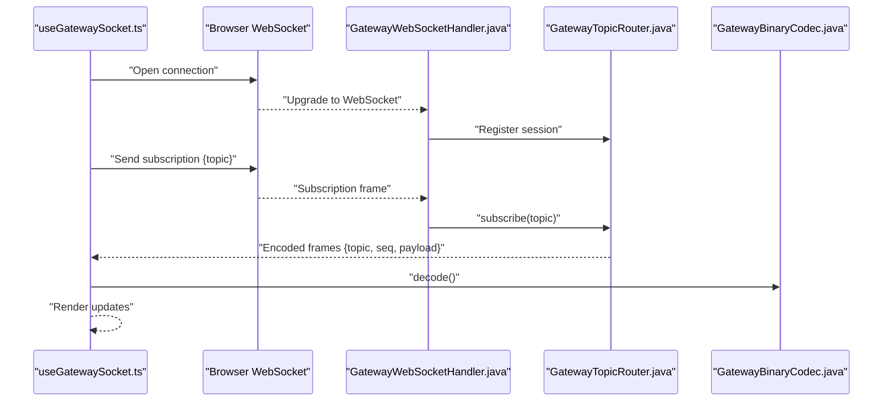
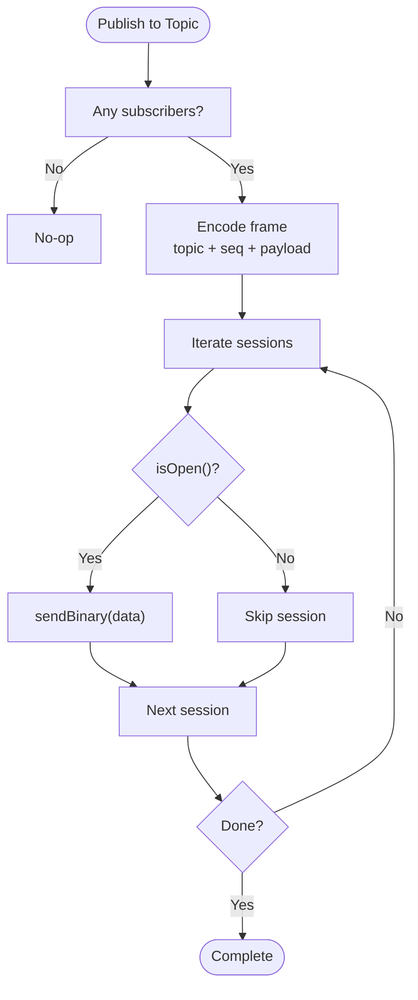
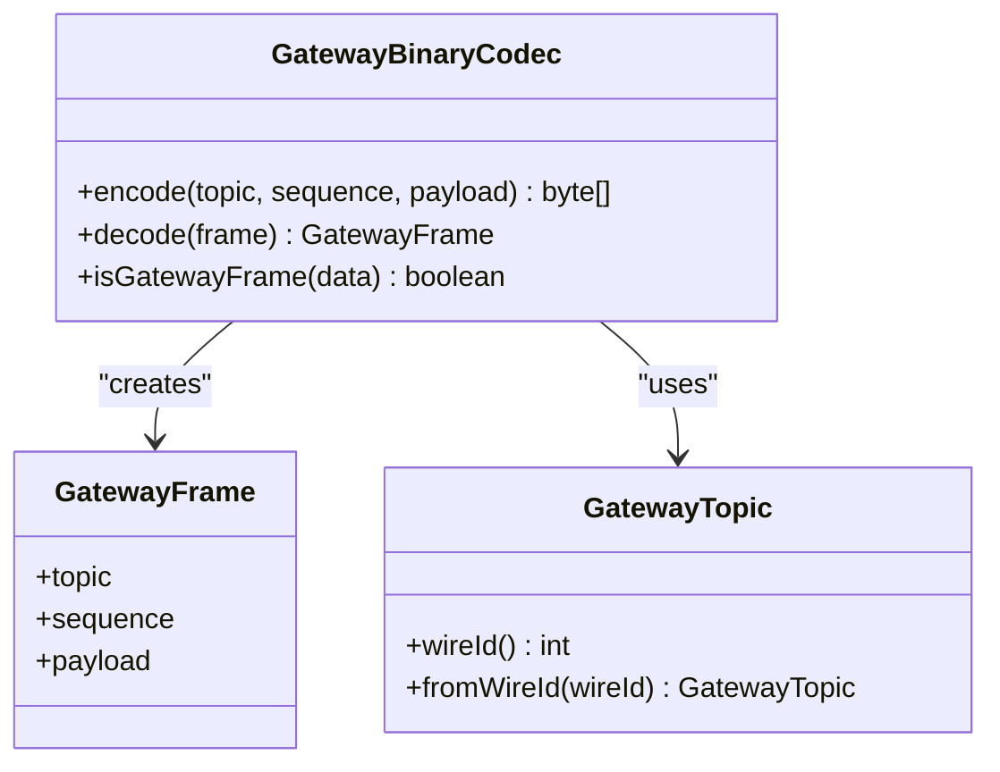
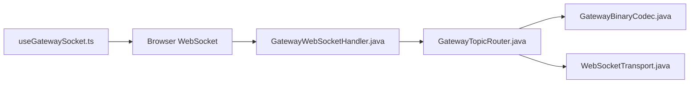

# WebSocket Integration

<cite>
**Referenced Files in This Document**
- [useGatewaySocket.ts](file://frontend/src/hooks/useGatewaySocket.ts)
- [GatewayWebSocketHandler.java](file://gateway/src/main/java/com/tradej/gateway/websocket/GatewayWebSocketHandler.java)
- [GatewayTopicRouter.java](file://gateway/src/main/java/com/tradej/gateway/router/GatewayTopicRouter.java)
- [GatewayBinaryCodec.java](file://gateway/src/main/java/com/tradej/gateway/protocol/GatewayBinaryCodec.java)
- [WebSocketTransport.java](file://gateway/src/main/java/com/tradej/gateway/transport/WebSocketTransport.java)
- [GatewayTopicRouterTest.java](file://gateway/src/test/java/com/tradej/gateway/router/GatewayTopicRouterTest.java)
- [GatewayTopicRouterTest.java (replay)](file://gateway/src/test/java/com/tradej/gateway/router/GatewayTopicRouterTest.java)
- [GatewayWebSocketLifecycleTest.java](file://app/src/test/java/com/tradej/app/integration/GatewayWebSocketLifecycleTest.java)
- [websocket.ts](file://archive/frontend/src/api/websocket.ts)
</cite>

## Table of Contents
1. [Introduction](#introduction)
2. [Project Structure](#project-structure)
3. [Core Components](#core-components)
4. [Architecture Overview](#architecture-overview)
5. [Detailed Component Analysis](#detailed-component-analysis)
6. [Dependency Analysis](#dependency-analysis)
7. [Performance Considerations](#performance-considerations)
8. [Troubleshooting Guide](#troubleshooting-guide)
9. [Conclusion](#conclusion)

## Introduction
This document explains the WebSocket integration and real-time communication in the trading system. It covers the socket connection lifecycle, message handling, topic-based routing, and the frontend useGatewaySocket hook. It also documents backend integration with the gateway, protocol specifications, connection recovery, message queuing, and debugging strategies.

## Project Structure
The WebSocket integration spans the frontend and backend:

- Frontend: A React hook manages the WebSocket lifecycle and real-time updates.
- Backend: A WebSocket handler bridges the transport layer to a topic router, which encodes/decodes messages using a binary protocol and dispatches them to subscribed sessions.

**Diagram sources**
- [useGatewaySocket.ts:1-200](file://frontend/src/hooks/useGatewaySocket.ts#L1-L200)
- [GatewayWebSocketHandler.java:1-200](file://gateway/src/main/java/com/tradej/gateway/websocket/GatewayWebSocketHandler.java#L1-L200)
- [GatewayTopicRouter.java:1-200](file://gateway/src/main/java/com/tradej/gateway/router/GatewayTopicRouter.java#L1-L200)
- [GatewayBinaryCodec.java:1-69](file://gateway/src/main/java/com/tradej/gateway/protocol/GatewayBinaryCodec.java#L1-L69)
- [WebSocketTransport.java:1-20](file://gateway/src/main/java/com/tradej/gateway/transport/WebSocketTransport.java#L1-L20)

**Section sources**
- [useGatewaySocket.ts:1-200](file://frontend/src/hooks/useGatewaySocket.ts#L1-L200)
- [GatewayWebSocketHandler.java:1-200](file://gateway/src/main/java/com/tradej/gateway/websocket/GatewayWebSocketHandler.java#L1-L200)
- [GatewayTopicRouter.java:1-200](file://gateway/src/main/java/com/tradej/gateway/router/GatewayTopicRouter.java#L1-L200)
- [GatewayBinaryCodec.java:1-69](file://gateway/src/main/java/com/tradej/gateway/protocol/GatewayBinaryCodec.java#L1-L69)
- [WebSocketTransport.java:1-20](file://gateway/src/main/java/com/tradej/gateway/transport/WebSocketTransport.java#L1-L20)

## Core Components
- useGatewaySocket.ts: Manages the WebSocket connection lifecycle, message handling, reconnection, and subscription to topics in the frontend.
- GatewayWebSocketHandler.java: Bridges the incoming WebSocket connection to the backend routing and transport layers.
- GatewayTopicRouter.java: Maintains subscriptions per topic and dispatches encoded frames to subscribed sessions with filtering and concurrency safeguards.
- GatewayBinaryCodec.java: Defines the binary wire protocol with topic, sequence, and payload framing.
- WebSocketTransport.java: Abstracts a single WebSocket session for decoupling routing logic from transport specifics.

**Section sources**
- [useGatewaySocket.ts:1-200](file://frontend/src/hooks/useGatewaySocket.ts#L1-L200)
- [GatewayWebSocketHandler.java:1-200](file://gateway/src/main/java/com/tradej/gateway/websocket/GatewayWebSocketHandler.java#L1-L200)
- [GatewayTopicRouter.java:1-200](file://gateway/src/main/java/com/tradej/gateway/router/GatewayTopicRouter.java#L1-L200)
- [GatewayBinaryCodec.java:1-69](file://gateway/src/main/java/com/tradej/gateway/protocol/GatewayBinaryCodec.java#L1-L69)
- [WebSocketTransport.java:1-20](file://gateway/src/main/java/com/tradej/gateway/transport/WebSocketTransport.java#L1-L20)

## Architecture Overview
The system routes real-time market data via topics. Publishers dispatch frames to a router, which encodes them using the binary protocol and sends them to subscribed sessions. The frontend hook subscribes to topics and renders updates.

**Diagram sources**
- [useGatewaySocket.ts:1-200](file://frontend/src/hooks/useGatewaySocket.ts#L1-L200)
- [GatewayWebSocketHandler.java:1-200](file://gateway/src/main/java/com/tradej/gateway/websocket/GatewayWebSocketHandler.java#L1-L200)
- [GatewayTopicRouter.java:1-200](file://gateway/src/main/java/com/tradej/gateway/router/GatewayTopicRouter.java#L1-L200)
- [GatewayBinaryCodec.java:1-69](file://gateway/src/main/java/com/tradej/gateway/protocol/GatewayBinaryCodec.java#L1-L69)

## Detailed Component Analysis

### Frontend: useGatewaySocket Hook
Responsibilities:
- Establish and maintain a WebSocket connection with retry/backoff policies.
- Subscribe/unsubscribe to topics and route incoming frames to consumers.
- Decode binary frames using the shared protocol and handle errors gracefully.
- Provide a stable API for UI components to consume real-time data.

Key behaviors:
- Connection lifecycle: open, onmessage, onerror, onclose with reconnection logic.
- Topic subscription: send subscription commands to the backend.
- Message handling: decode frames, route by topic, update state, and notify subscribers.
- Error handling: distinguish transient vs fatal errors, trigger reconnection or fallback.

Practical examples:
- Real-time data streaming: subscribe to a market tick topic; render updates as they arrive.
- Event subscription: register multiple topic handlers; unsubscribe on unmount.
- Message broadcasting: broadcast decoded messages to UI stores or local state.

**Section sources**
- [useGatewaySocket.ts:1-200](file://frontend/src/hooks/useGatewaySocket.ts#L1-L200)

### Backend: WebSocket Endpoint and Router
Responsibilities:
- Accept WebSocket upgrades and manage session lifecycles.
- Route incoming frames to the topic router and deliver outgoing frames to sessions.
- Enforce protocol boundaries and handle malformed frames.

Key behaviors:
- Session registration and cleanup.
- Dispatching to router with topic and payload.
- Encoding frames with topic, sequence, and payload before sending.

**Section sources**
- [GatewayWebSocketHandler.java:1-200](file://gateway/src/main/java/com/tradej/gateway/websocket/GatewayWebSocketHandler.java#L1-L200)

### Topic-Based Routing
Responsibilities:
- Maintain topic-to-session mappings.
- Publish frames to all subscribers or filtered subsets.
- Encode frames with the binary protocol header.
- Handle concurrency, missing sessions, and IO exceptions during delivery.

Key behaviors:
- subscribe(topic, session)
- publish(topic, payload)
- publishFiltered(topic, payload, filterFn)
- Graceful handling of closed sessions and IO exceptions.

**Diagram sources**
- [GatewayTopicRouter.java:1-200](file://gateway/src/main/java/com/tradej/gateway/router/GatewayTopicRouter.java#L1-L200)
- [GatewayBinaryCodec.java:1-69](file://gateway/src/main/java/com/tradej/gateway/protocol/GatewayBinaryCodec.java#L1-L69)
- [WebSocketTransport.java:1-20](file://gateway/src/main/java/com/tradej/gateway/transport/WebSocketTransport.java#L1-L20)

**Section sources**
- [GatewayTopicRouter.java:1-200](file://gateway/src/main/java/com/tradej/gateway/router/GatewayTopicRouter.java#L1-L200)
- [GatewayTopicRouterTest.java:194-231](file://gateway/src/test/java/com/tradej/gateway/router/GatewayTopicRouterTest.java#L194-L231)
- [GatewayTopicRouterTest.java:351-390](file://gateway/src/test/java/com/tradej/gateway/router/GatewayTopicRouterTest.java#L351-L390)

### Binary Protocol Specification
The wire protocol encodes frames with a fixed header followed by a payload:
- Header: topic (1 byte), sequence (8 bytes), payload (N bytes).
- Topic enumeration is mapped to wire IDs.
- Sequence numbers are monotonically increasing per topic.

**Diagram sources**
- [GatewayBinaryCodec.java:1-69](file://gateway/src/main/java/com/tradej/gateway/protocol/GatewayBinaryCodec.java#L1-L69)

**Section sources**
- [GatewayBinaryCodec.java:1-69](file://gateway/src/main/java/com/tradej/gateway/protocol/GatewayBinaryCodec.java#L1-L69)

### Transport Abstraction
WebSocketTransport abstracts a single session, enabling decoupling from the underlying transport library. It exposes:
- sendBinary(data): transmit a frame.
- isOpen(): check liveness.
- id(): session identity.
- close(): terminate the session.

**Section sources**
- [WebSocketTransport.java:1-20](file://gateway/src/main/java/com/tradej/gateway/transport/WebSocketTransport.java#L1-L20)

### Legacy Frontend WebSocket Client
An archived frontend WebSocket client demonstrates earlier patterns for connection and message handling. It can serve as a reference for understanding protocol expectations and basic lifecycle.

**Section sources**
- [websocket.ts:1-200](file://archive/frontend/src/api/websocket.ts#L1-L200)

## Dependency Analysis
The frontend hook depends on the backend handler and router. The router depends on the codec and transport abstractions. The handler depends on the router to process subscriptions and dispatch messages.

**Diagram sources**
- [useGatewaySocket.ts:1-200](file://frontend/src/hooks/useGatewaySocket.ts#L1-L200)
- [GatewayWebSocketHandler.java:1-200](file://gateway/src/main/java/com/tradej/gateway/websocket/GatewayWebSocketHandler.java#L1-L200)
- [GatewayTopicRouter.java:1-200](file://gateway/src/main/java/com/tradej/gateway/router/GatewayTopicRouter.java#L1-L200)
- [GatewayBinaryCodec.java:1-69](file://gateway/src/main/java/com/tradej/gateway/protocol/GatewayBinaryCodec.java#L1-L69)
- [WebSocketTransport.java:1-20](file://gateway/src/main/java/com/tradej/gateway/transport/WebSocketTransport.java#L1-L20)

**Section sources**
- [GatewayTopicRouterTest.java:194-231](file://gateway/src/test/java/com/tradej/gateway/router/GatewayTopicRouterTest.java#L194-L231)

## Performance Considerations
- Frame encoding overhead: The binary header adds minimal overhead; batching or compression is not used in the current protocol.
- Queue sizing: Router queue capacity affects throughput under bursty publishing; tests demonstrate small and normal queue sizes.
- Concurrency: Router supports concurrent subscribe/publish operations; ensure sufficient queue capacity and avoid blocking handlers.
- Backpressure: Router skips closed sessions and handles IO exceptions; consider tuning queue sizes and adding explicit backpressure signaling if needed.
- Reconnection: Frontend hook should implement exponential backoff and jitter to reduce thundering herd on server restarts.

[No sources needed since this section provides general guidance]

## Troubleshooting Guide
Common issues and remedies:
- Connection drops: Verify reconnection logic in the frontend hook; ensure the backend handler registers sessions promptly after upgrade.
- No data received: Confirm topic subscriptions are sent and acknowledged; check router logs for publish calls and subscriber counts.
- Malformed frames: Validate binary frames against the protocol header; ensure topic IDs are recognized and payloads are complete.
- Delivery failures: Inspect IO exceptions during sendBinary; closed sessions are skipped; investigate network interruptions or client-side errors.
- Lifecycle tests: Use integration tests to validate connection establishment, subscription propagation, and graceful shutdown.

**Section sources**
- [GatewayTopicRouterTest.java:351-390](file://gateway/src/test/java/com/tradej/gateway/router/GatewayTopicRouterTest.java#L351-L390)
- [GatewayWebSocketLifecycleTest.java:1-200](file://app/src/test/java/com/tradej/app/integration/GatewayWebSocketLifecycleTest.java#L1-L200)

## Conclusion
The WebSocket integration combines a robust binary protocol, a topic-based router, and a frontend hook designed for reliability and scalability. By adhering to the protocol, managing subscriptions carefully, and leveraging the built-in error handling and recovery mechanisms, teams can implement efficient real-time data streaming and event-driven UI updates.