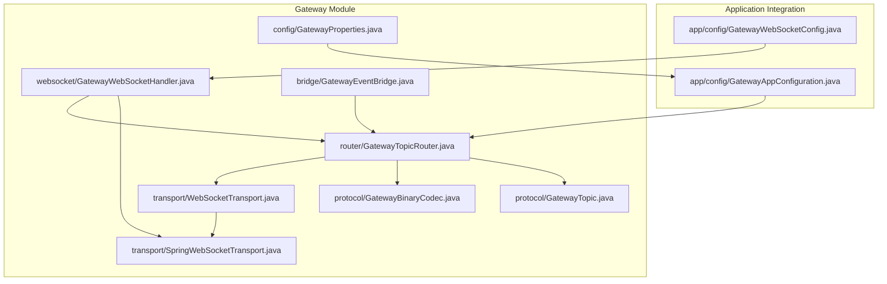
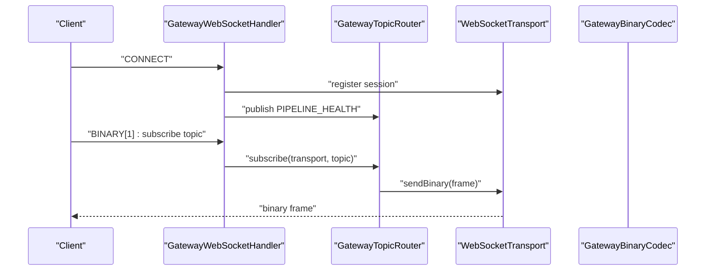
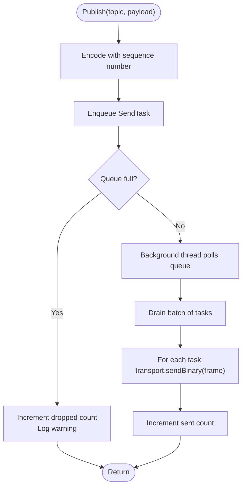
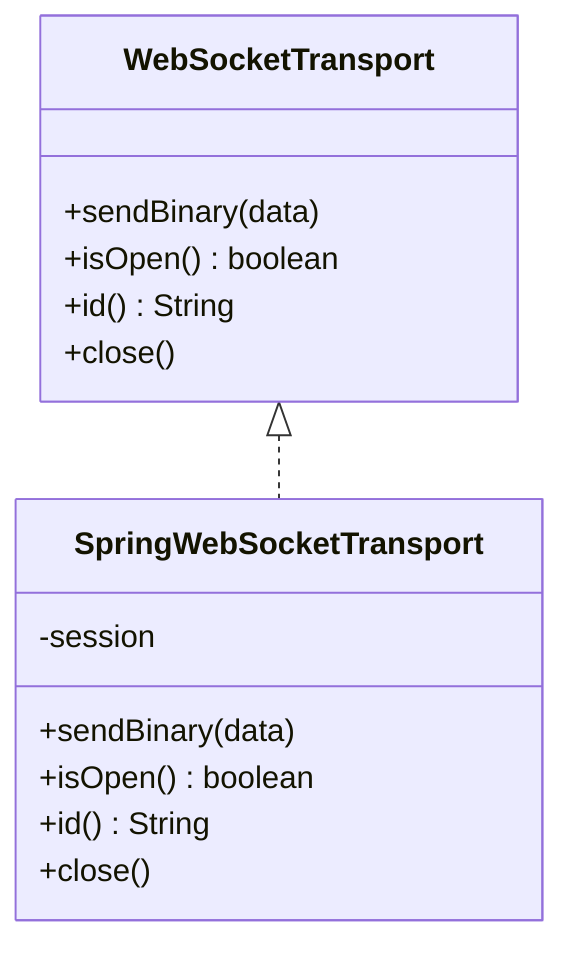
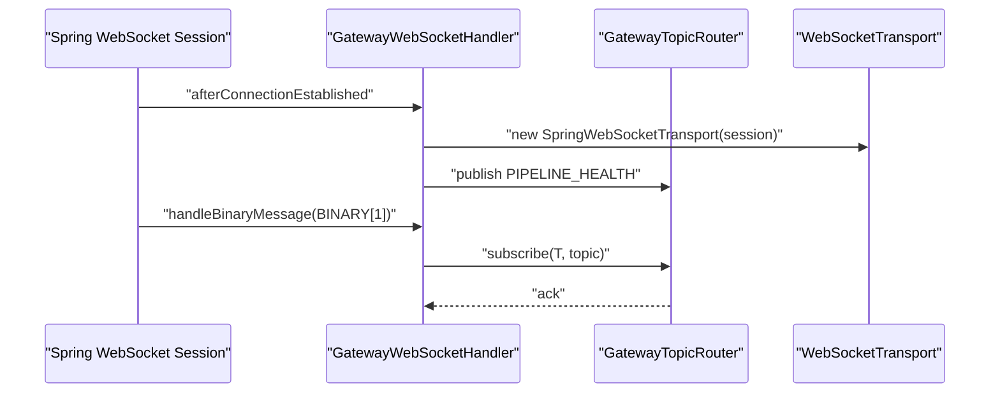
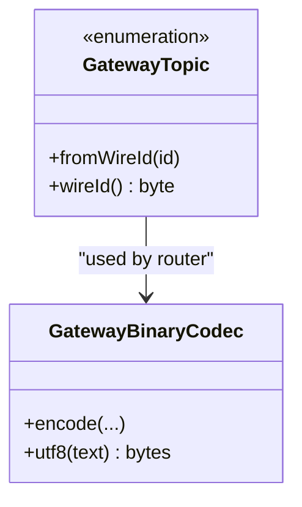
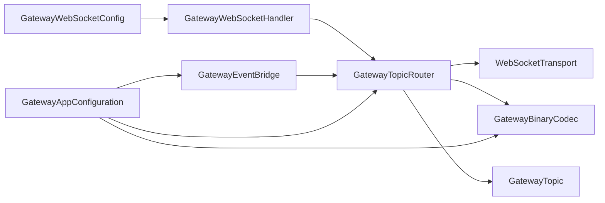

# Gateway and Communication

<cite>
**Referenced Files in This Document**
- [GatewayTopicRouter.java](file://gateway/src/main/java/com/tradej/gateway/router/GatewayTopicRouter.java)
- [WebSocketTransport.java](file://gateway/src/main/java/com/tradej/gateway/transport/WebSocketTransport.java)
- [SpringWebSocketTransport.java](file://gateway/src/main/java/com/tradej/gateway/transport/SpringWebSocketTransport.java)
- [GatewayWebSocketHandler.java](file://gateway/src/main/java/com/tradej/gateway/websocket/GatewayWebSocketHandler.java)
- [GatewayBinaryCodec.java](file://gateway/src/main/java/com/tradej/gateway/protocol/GatewayBinaryCodec.java)
- [GatewayTopic.java](file://gateway/src/main/java/com/tradej/gateway/protocol/GatewayTopic.java)
- [GatewayEventBridge.java](file://gateway/src/main/java/com/tradej/gateway/bridge/GatewayEventBridge.java)
- [GatewayProperties.java](file://gateway/src/main/java/com/tradej/gateway/config/GatewayProperties.java)
- [GatewayWebSocketConfig.java](file://app/src/main/java/com/tradej/app/config/GatewayWebSocketConfig.java)
- [GatewayAppConfiguration.java](file://app/src/main/java/com/tradej/app/config/GatewayAppConfiguration.java)
- [GatewayLiveBenchmark.java](file://app/src/test/java/com/tradej/app/integration/GatewayLiveBenchmark.java)
- [GatewayWebSocketLifecycleTest.java](file://app/src/test/java/com/tradej/app/integration/GatewayWebSocketLifecycleTest.java)
- [GatewayTopicRouterTest.java](file://gateway/src/test/java/com/tradej/gateway/router/GatewayTopicRouterTest.java)
- [GatewayEventBridgeTest.java](file://gateway/src/test/java/com/tradej/gateway/bridge/GatewayEventBridgeTest.java)
</cite>

## Table of Contents
1. [Introduction](#introduction)
2. [Project Structure](#project-structure)
3. [Core Components](#core-components)
4. [Architecture Overview](#architecture-overview)
5. [Detailed Component Analysis](#detailed-component-analysis)
6. [Dependency Analysis](#dependency-analysis)
7. [Performance Considerations](#performance-considerations)
8. [Security Considerations](#security-considerations)
9. [Troubleshooting Guide](#troubleshooting-guide)
10. [Conclusion](#conclusion)

## Introduction
This document describes the gateway and communication subsystems responsible for real-time market data distribution and client connectivity. It covers the WebSocket bridge, request routing, protocol translation, transport abstractions, and operational characteristics such as connection lifecycle, load handling, and resilience. The gateway exposes a compact binary protocol over WebSocket, routes messages by topic, and integrates with the broader application configuration and testing framework.

## Project Structure
The gateway module is organized around four primary domains:
- Protocol: binary encoding/decoding and topic enumeration
- Transport: transport-agnostic WebSocket abstraction and Spring integration
- Router: topic-based routing with non-blocking publish/subscribe semantics
- WebSocket: Spring WebSocket handler for connection lifecycle and subscription commands
- Bridge: event bridging between internal systems and WebSocket transports
- Config: gateway properties and Spring WebSocket configuration

**Diagram sources**
- [GatewayTopicRouter.java:1-120](file://gateway/src/main/java/com/tradej/gateway/router/GatewayTopicRouter.java#L1-L120)
- [WebSocketTransport.java:1-20](file://gateway/src/main/java/com/tradej/gateway/transport/WebSocketTransport.java#L1-L20)
- [SpringWebSocketTransport.java](file://gateway/src/main/java/com/tradej/gateway/transport/SpringWebSocketTransport.java)
- [GatewayWebSocketHandler.java:1-120](file://gateway/src/main/java/com/tradej/gateway/websocket/GatewayWebSocketHandler.java#L1-L120)
- [GatewayBinaryCodec.java:1-120](file://gateway/src/main/java/com/tradej/gateway/protocol/GatewayBinaryCodec.java#L1-L120)
- [GatewayTopic.java:1-120](file://gateway/src/main/java/com/tradej/gateway/protocol/GatewayTopic.java#L1-L120)
- [GatewayEventBridge.java:1-120](file://gateway/src/main/java/com/tradej/gateway/bridge/GatewayEventBridge.java#L1-L120)
- [GatewayProperties.java:1-120](file://gateway/src/main/java/com/tradej/gateway/config/GatewayProperties.java#L1-L120)
- [GatewayWebSocketConfig.java:1-120](file://app/src/main/java/com/tradej/app/config/GatewayWebSocketConfig.java#L1-L120)
- [GatewayAppConfiguration.java:1-120](file://app/src/main/java/com/tradej/app/config/GatewayAppConfiguration.java#L1-L120)

**Section sources**
- [GatewayTopicRouter.java:1-120](file://gateway/src/main/java/com/tradej/gateway/router/GatewayTopicRouter.java#L1-L120)
- [GatewayWebSocketHandler.java:1-120](file://gateway/src/main/java/com/tradej/gateway/websocket/GatewayWebSocketHandler.java#L1-L120)
- [GatewayBinaryCodec.java:1-120](file://gateway/src/main/java/com/tradej/gateway/protocol/GatewayBinaryCodec.java#L1-L120)
- [GatewayTopic.java:1-120](file://gateway/src/main/java/com/tradej/gateway/protocol/GatewayTopic.java#L1-L120)
- [GatewayEventBridge.java:1-120](file://gateway/src/main/java/com/tradej/gateway/bridge/GatewayEventBridge.java#L1-L120)
- [GatewayProperties.java:1-120](file://gateway/src/main/java/com/tradej/gateway/config/GatewayProperties.java#L1-L120)
- [GatewayWebSocketConfig.java:1-120](file://app/src/main/java/com/tradej/app/config/GatewayWebSocketConfig.java#L1-L120)
- [GatewayAppConfiguration.java:1-120](file://app/src/main/java/com/tradej/app/config/GatewayAppConfiguration.java#L1-L120)

## Core Components
- WebSocketTransport: transport-agnostic interface for sending binary frames, checking connection state, identifying sessions, and closing connections.
- SpringWebSocketTransport: concrete implementation that adapts Spring WebSocket sessions to the transport interface.
- GatewayWebSocketHandler: Spring WebSocket handler managing connection establishment, binary message handling, subscription commands, and lifecycle events.
- GatewayTopicRouter: topic-based router maintaining bidirectional topic-to-transports and transport-to-topics mappings, with a non-blocking publish queue and background sender thread.
- GatewayBinaryCodec: binary encoding/decoding utilities and UTF-8 helpers used for lightweight protocol framing.
- GatewayTopic: enumeration of topics used for routing and subscription.
- GatewayEventBridge: bridges internal events to WebSocket transports via the router.
- GatewayProperties: configuration properties for the gateway.

Key operational characteristics:
- Non-blocking publishing with bounded queue and drop-on-backpressure behavior.
- Monotonically increasing sequence numbers for published frames.
- Topic-based subscription via single-byte wire identifiers.
- Health broadcasting on connect to inform subscribers of gateway connectivity.

**Section sources**
- [WebSocketTransport.java:1-20](file://gateway/src/main/java/com/tradej/gateway/transport/WebSocketTransport.java#L1-L20)
- [SpringWebSocketTransport.java](file://gateway/src/main/java/com/tradej/gateway/transport/SpringWebSocketTransport.java)
- [GatewayWebSocketHandler.java:1-120](file://gateway/src/main/java/com/tradej/gateway/websocket/GatewayWebSocketHandler.java#L1-L120)
- [GatewayTopicRouter.java:1-120](file://gateway/src/main/java/com/tradej/gateway/router/GatewayTopicRouter.java#L1-L120)
- [GatewayBinaryCodec.java:1-120](file://gateway/src/main/java/com/tradej/gateway/protocol/GatewayBinaryCodec.java#L1-L120)
- [GatewayTopic.java:1-120](file://gateway/src/main/java/com/tradej/gateway/protocol/GatewayTopic.java#L1-L120)
- [GatewayEventBridge.java:1-120](file://gateway/src/main/java/com/tradej/gateway/bridge/GatewayEventBridge.java#L1-L120)
- [GatewayProperties.java:1-120](file://gateway/src/main/java/com/tradej/gateway/config/GatewayProperties.java#L1-L120)

## Architecture Overview
The gateway implements a publish-subscribe model over WebSocket:
- Clients establish WebSocket connections and subscribe to topics by sending a single-byte topic identifier.
- The router publishes encoded frames to all subscribed transports, batching and draining via a background thread.
- The transport layer abstracts the underlying WebSocket implementation, enabling reuse across frameworks.

**Diagram sources**
- [GatewayWebSocketHandler.java:1-120](file://gateway/src/main/java/com/tradej/gateway/websocket/GatewayWebSocketHandler.java#L1-L120)
- [GatewayTopicRouter.java:1-120](file://gateway/src/main/java/com/tradej/gateway/router/GatewayTopicRouter.java#L1-L120)
- [WebSocketTransport.java:1-20](file://gateway/src/main/java/com/tradej/gateway/transport/WebSocketTransport.java#L1-L20)
- [GatewayBinaryCodec.java:1-120](file://gateway/src/main/java/com/tradej/gateway/protocol/GatewayBinaryCodec.java#L1-L120)

## Detailed Component Analysis

### Topic Routing and Publish Pipeline
The router maintains:
- Topic-to-transports mapping for efficient fan-out
- Transport-to-topics mapping for cleanup and diagnostics
- A bounded blocking queue for non-blocking publish
- A background thread draining the queue and invoking transport.sendBinary
- Drop-on-overflow behavior with counters and logging

**Diagram sources**
- [GatewayTopicRouter.java:1-120](file://gateway/src/main/java/com/tradej/gateway/router/GatewayTopicRouter.java#L1-L120)

**Section sources**
- [GatewayTopicRouter.java:1-120](file://gateway/src/main/java/com/tradej/gateway/router/GatewayTopicRouter.java#L1-L120)

### WebSocket Transport Abstraction
The transport abstraction decouples routing logic from the underlying WebSocket library:
- sendBinary: writes a binary frame
- isOpen: checks liveness
- id: identifies the session
- close: tears down the connection

The Spring integration wraps Spring WebSocket sessions into this interface, enabling reuse across handlers and tests.

**Diagram sources**
- [WebSocketTransport.java:1-20](file://gateway/src/main/java/com/tradej/gateway/transport/WebSocketTransport.java#L1-L20)
- [SpringWebSocketTransport.java](file://gateway/src/main/java/com/tradej/gateway/transport/SpringWebSocketTransport.java)

**Section sources**
- [WebSocketTransport.java:1-20](file://gateway/src/main/java/com/tradej/gateway/transport/WebSocketTransport.java#L1-L20)
- [SpringWebSocketTransport.java](file://gateway/src/main/java/com/tradej/gateway/transport/SpringWebSocketTransport.java)

### WebSocket Handler Lifecycle and Subscription
The handler:
- Registers new sessions and tracks transports by session ID
- Publishes a health message upon connection
- Subscribes transports to topics when receiving a single-byte subscription command
- Ignores empty or malformed messages gracefully

**Diagram sources**
- [GatewayWebSocketHandler.java:1-120](file://gateway/src/main/java/com/tradej/gateway/websocket/GatewayWebSocketHandler.java#L1-L120)
- [GatewayTopicRouter.java:1-120](file://gateway/src/main/java/com/tradej/gateway/router/GatewayTopicRouter.java#L1-L120)

**Section sources**
- [GatewayWebSocketHandler.java:1-120](file://gateway/src/main/java/com/tradej/gateway/websocket/GatewayWebSocketHandler.java#L1-L120)

### Protocol Translation and Message Serialization
The binary codec provides:
- Encoding utilities for frames
- UTF-8 helpers for lightweight text payloads
- Sequence numbering for published frames

Topics are represented as an enumeration with wire IDs, enabling compact subscription commands.

**Diagram sources**
- [GatewayBinaryCodec.java:1-120](file://gateway/src/main/java/com/tradej/gateway/protocol/GatewayBinaryCodec.java#L1-L120)
- [GatewayTopic.java:1-120](file://gateway/src/main/java/com/tradej/gateway/protocol/GatewayTopic.java#L1-L120)
- [GatewayTopicRouter.java:1-120](file://gateway/src/main/java/com/tradej/gateway/router/GatewayTopicRouter.java#L1-L120)

**Section sources**
- [GatewayBinaryCodec.java:1-120](file://gateway/src/main/java/com/tradej/gateway/protocol/GatewayBinaryCodec.java#L1-L120)
- [GatewayTopic.java:1-120](file://gateway/src/main/java/com/tradej/gateway/protocol/GatewayTopic.java#L1-L120)

### Bridge Integration
The event bridge connects internal systems to WebSocket transports:
- Bridges events to the router for publication
- Leverages the same topic and transport mechanisms as client-driven traffic

**Section sources**
- [GatewayEventBridge.java:1-120](file://gateway/src/main/java/com/tradej/gateway/bridge/GatewayEventBridge.java#L1-L120)
- [GatewayTopicRouter.java:1-120](file://gateway/src/main/java/com/tradej/gateway/router/GatewayTopicRouter.java#L1-L120)

### Application Configuration and Properties
- GatewayWebSocketConfig: registers WebSocket endpoints and handlers with the Spring application context.
- GatewayAppConfiguration: wires the router, codecs, and bridge into the application lifecycle.
- GatewayProperties: externalizes configuration for the gateway behavior.

**Section sources**
- [GatewayWebSocketConfig.java:1-120](file://app/src/main/java/com/tradej/app/config/GatewayWebSocketConfig.java#L1-L120)
- [GatewayAppConfiguration.java:1-120](file://app/src/main/java/com/tradej/app/config/GatewayAppConfiguration.java#L1-L120)
- [GatewayProperties.java:1-120](file://gateway/src/main/java/com/tradej/gateway/config/GatewayProperties.java#L1-L120)

## Dependency Analysis
The gateway components exhibit clean separation of concerns:
- Router depends on Transport and Protocol abstractions
- Handler depends on Router and Transport
- Bridge depends on Router
- Application configuration composes Router, Codec, and Bridge

**Diagram sources**
- [GatewayWebSocketHandler.java:1-120](file://gateway/src/main/java/com/tradej/gateway/websocket/GatewayWebSocketHandler.java#L1-L120)
- [GatewayTopicRouter.java:1-120](file://gateway/src/main/java/com/tradej/gateway/router/GatewayTopicRouter.java#L1-L120)
- [WebSocketTransport.java:1-20](file://gateway/src/main/java/com/tradej/gateway/transport/WebSocketTransport.java#L1-L20)
- [GatewayBinaryCodec.java:1-120](file://gateway/src/main/java/com/tradej/gateway/protocol/GatewayBinaryCodec.java#L1-L120)
- [GatewayTopic.java:1-120](file://gateway/src/main/java/com/tradej/gateway/protocol/GatewayTopic.java#L1-L120)
- [GatewayEventBridge.java:1-120](file://gateway/src/main/java/com/tradej/gateway/bridge/GatewayEventBridge.java#L1-L120)
- [GatewayAppConfiguration.java:1-120](file://app/src/main/java/com/tradej/app/config/GatewayAppConfiguration.java#L1-L120)
- [GatewayWebSocketConfig.java:1-120](file://app/src/main/java/com/tradej/app/config/GatewayWebSocketConfig.java#L1-L120)

**Section sources**
- [GatewayTopicRouter.java:1-120](file://gateway/src/main/java/com/tradej/gateway/router/GatewayTopicRouter.java#L1-L120)
- [GatewayWebSocketHandler.java:1-120](file://gateway/src/main/java/com/tradej/gateway/websocket/GatewayWebSocketHandler.java#L1-L120)
- [GatewayEventBridge.java:1-120](file://gateway/src/main/java/com/tradej/gateway/bridge/GatewayEventBridge.java#L1-L120)
- [GatewayAppConfiguration.java:1-120](file://app/src/main/java/com/tradej/app/config/GatewayAppConfiguration.java#L1-L120)
- [GatewayWebSocketConfig.java:1-120](file://app/src/main/java/com/tradej/app/config/GatewayWebSocketConfig.java#L1-L120)

## Performance Considerations
- Non-blocking publish: bounded queue prevents unbounded memory growth under bursty traffic; overflow results in dropped events with warnings.
- Background sender: a dedicated thread drains the queue in batches, reducing contention and improving throughput.
- Sequence numbers: enable downstream consumers to detect gaps and maintain ordering awareness.
- Topic fan-out: O(1) lookup per topic via EnumMap and concurrent sets for scalable subscription management.
- Transport abstraction: allows plugging in optimized WebSocket implementations without changing routing logic.

[No sources needed since this section provides general guidance]

## Security Considerations
- Authentication and authorization: integrate Spring Security filters or interceptors at the WebSocket endpoint to validate client credentials before allowing subscriptions.
- Rate limiting: apply per-session or per-client limits on subscription requests and message rates to prevent abuse.
- Input validation: reject oversized or malformed binary frames; enforce maximum message sizes at the handler level.
- Transport security: ensure WebSocket endpoints use secure channels (WSS) in production environments.
- Audit logging: record subscription changes, connection events, and errors for monitoring and incident response.

[No sources needed since this section provides general guidance]

## Troubleshooting Guide
Common issues and diagnostics:
- No messages received: verify subscription command was sent and topic exists; confirm router has registered transports for the topic.
- Frequent drops under load: inspect dropped event counters and queue capacity; consider tuning queue size or adding back-pressure at upstream producers.
- Stalled delivery: check background sender thread state and poll timeouts; ensure transports remain open.
- Connection lifecycle problems: review handler logs for connect/disconnect events and transport registration failures.

Validation and testing:
- Integration benchmarks measure live performance characteristics.
- Lifecycle tests verify connection establishment and teardown.
- Router and bridge unit tests validate routing correctness and event propagation.

**Section sources**
- [GatewayLiveBenchmark.java:1-120](file://app/src/test/java/com/tradej/app/integration/GatewayLiveBenchmark.java#L1-L120)
- [GatewayWebSocketLifecycleTest.java:1-120](file://app/src/test/java/com/tradej/app/integration/GatewayWebSocketLifecycleTest.java#L1-L120)
- [GatewayTopicRouterTest.java:1-120](file://gateway/src/test/java/com/tradej/gateway/router/GatewayTopicRouterTest.java#L1-L120)
- [GatewayEventBridgeTest.java:1-120](file://gateway/src/test/java/com/tradej/gateway/bridge/GatewayEventBridgeTest.java#L1-L120)

## Conclusion
The gateway provides a robust, non-blocking foundation for real-time data distribution over WebSocket. Its modular design separates transport, routing, and protocol concerns, enabling scalability, maintainability, and extensibility. With proper configuration, security controls, and monitoring, it supports high-throughput, low-latency communication for market data and operational signals.