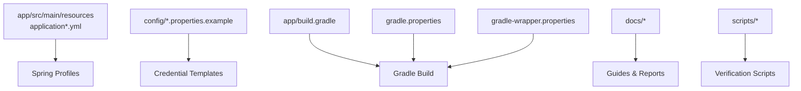
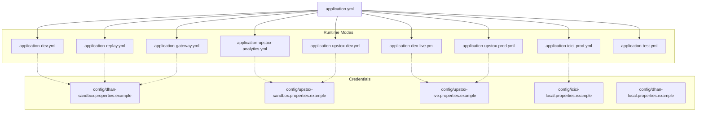
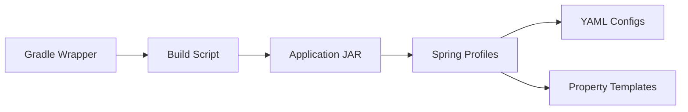

# Getting Started

<cite>
**Referenced Files in This Document**
- [application.yml](file://app/src/main/resources/application.yml)
- [application-dev.yml](file://app/src/main/resources/application-dev.yml)
- [application-dev-live.yml](file://app/src/main/resources/application-dev-live.yml)
- [application-upstox-analytics.yml](file://app/src/main/resources/application-upstox-analytics.yml)
- [application-upstox-dev.yml](file://app/src/main/resources/application-upstox-dev.yml)
- [application-upstox-prod.yml](file://app/src/main/resources/application-upstox-prod.yml)
- [application-icici-prod.yml](file://app/src/main/resources/application-icici-prod.yml)
- [application-gateway.yml](file://app/src/main/resources/application-gateway.yml)
- [application-replay.yml](file://app/src/main/resources/application-replay.yml)
- [application-test.yml](file://app/src/main/resources/application-test.yml)
- [logback-spring.xml](file://app/src/main/resources/logback-spring.xml)
- [dhan-sandbox.properties.example](file://config/dhan-sandbox.properties.example)
- [upstox-live.properties.example](file://config/upstox-live.properties.example)
- [upstox-sandbox.properties.example](file://config/upstox-sandbox.properties.example)
- [icici-local.properties.example](file://config/icici-local.properties.example)
- [dhan-local.properties.example](file://config/dhan-local.properties.example)
- [build.gradle](file://app/build.gradle)
- [gradle.properties](file://gradle.properties)
- [gradle-wrapper.properties](file://gradle/wrapper/gradle-wrapper.properties)
- [README.md](file://README.md)
- [CONFIG.md](file://CONFIG.md)
- [USAGE_GUIDE.md](file://docs/USAGE_GUIDE.md)
- [BROKER_CAPABILITY_MATRIX.md](file://docs/BROKER_CAPABILITY_MATRIX.md)
- [PRODUCTION_DEPLOYMENT.md](file://docs/PRODUCTION_DEPLOYMENT.md)
- [runtime-mode-audit.md](file://docs/runtime-mode-audit.md)
- [console-smoke.sh](file://scripts/console-smoke.sh)
- [dhan-smoke.sh](file://scripts/dhan-smoke.sh)
- [upstox-smoke.sh](file://scripts/upstox-smoke.sh)
- [test-api.sh](file://scripts/test-api.sh)
- [test-backend-connection.sh](file://test-backend-connection.sh)
</cite>

## Table of Contents
1. [Introduction](#introduction)
2. [Project Structure](#project-structure)
3. [Core Components](#core-components)
4. [Architecture Overview](#architecture-overview)
5. [Detailed Component Analysis](#detailed-component-analysis)
6. [Dependency Analysis](#dependency-analysis)
7. [Performance Considerations](#performance-considerations)
8. [Troubleshooting Guide](#troubleshooting-guide)
9. [Conclusion](#conclusion)
10. [Appendices](#appendices)

## Introduction
This guide helps you install, configure, and run Trade-J for the first time. It covers prerequisites, environment setup, configuration management, and three quick start options: default Dhan sandbox, live market data mode, and Upstox analytics-only mode. You will learn how to set credentials via config files, activate Spring profiles, and verify your installation.

## Project Structure
Trade-J is a multi-module Gradle project with a Spring Boot application at the center. Configuration is managed via Spring profiles and external property files. The primary runtime configuration files reside under app/src/main/resources, while broker-specific property templates are under config/.

Key locations:
- Application configuration YAML files under app/src/main/resources
- Broker property templates under config/
- Build and wrapper configuration under app/build.gradle and gradle properties
- Documentation under docs/ and scripts/

**Diagram sources**
- [application.yml:1-200](file://app/src/main/resources/application.yml#L1-L200)
- [build.gradle:1-200](file://app/build.gradle#L1-L200)
- [gradle.properties:1-100](file://gradle.properties#L1-L100)
- [gradle-wrapper.properties:1-50](file://gradle/wrapper/gradle-wrapper.properties#L1-L50)

**Section sources**
- [application.yml:1-200](file://app/src/main/resources/application.yml#L1-L200)
- [build.gradle:1-200](file://app/build.gradle#L1-L200)
- [gradle.properties:1-100](file://gradle.properties#L1-L100)
- [gradle-wrapper.properties:1-50](file://gradle/wrapper/gradle-wrapper.properties#L1-L50)

## Core Components
- Spring Boot application with multiple profiles for development, production, replay, gateway, and broker-specific modes
- Broker integrations for Dhan, Upstox, and ICICI
- CLI and scripts for smoke testing and verification
- Logging configured via logback-spring.xml

Quick-start options:
- Default Dhan sandbox mode
- Live market data mode
- Upstox analytics-only mode

**Section sources**
- [application.yml:1-200](file://app/src/main/resources/application.yml#L1-L200)
- [application-dev.yml:1-200](file://app/src/main/resources/application-dev.yml#L1-L200)
- [application-dev-live.yml:1-200](file://app/src/main/resources/application-dev-live.yml#L1-L200)
- [application-upstox-analytics.yml:1-200](file://app/src/main/resources/application-upstox-analytics.yml#L1-L200)
- [application-upstox-dev.yml:1-200](file://app/src/main/resources/application-upstox-dev.yml#L1-L200)
- [application-upstox-prod.yml:1-200](file://app/src/main/resources/application-upstox-prod.yml#L1-L200)
- [application-icici-prod.yml:1-200](file://app/src/main/resources/application-icici-prod.yml#L1-L200)
- [application-gateway.yml:1-200](file://app/src/main/resources/application-gateway.yml#L1-L200)
- [application-replay.yml:1-200](file://app/src/main/resources/application-replay.yml#L1-L200)
- [application-test.yml:1-200](file://app/src/main/resources/application-test.yml#L1-L200)

## Architecture Overview
Trade-J uses Spring profiles to select runtime modes and broker configurations. The application loads a base configuration and overlays broker-specific settings. Credential templates under config/ provide placeholders for API keys and tokens.

**Diagram sources**
- [application.yml:1-200](file://app/src/main/resources/application.yml#L1-L200)
- [application-dev.yml:1-200](file://app/src/main/resources/application-dev.yml#L1-L200)
- [application-dev-live.yml:1-200](file://app/src/main/resources/application-dev-live.yml#L1-L200)
- [application-upstox-analytics.yml:1-200](file://app/src/main/resources/application-upstox-analytics.yml#L1-L200)
- [application-upstox-dev.yml:1-200](file://app/src/main/resources/application-upstox-dev.yml#L1-L200)
- [application-upstox-prod.yml:1-200](file://app/src/main/resources/application-upstox-prod.yml#L1-L200)
- [application-icici-prod.yml:1-200](file://app/src/main/resources/application-icici-prod.yml#L1-L200)
- [application-gateway.yml:1-200](file://app/src/main/resources/application-gateway.yml#L1-L200)
- [application-replay.yml:1-200](file://app/src/main/resources/application-replay.yml#L1-L200)
- [application-test.yml:1-200](file://app/src/main/resources/application-test.yml#L1-L200)
- [dhan-sandbox.properties.example:1-200](file://config/dhan-sandbox.properties.example#L1-L200)
- [upstox-sandbox.properties.example:1-200](file://config/upstox-sandbox.properties.example#L1-L200)
- [upstox-live.properties.example:1-200](file://config/upstox-live.properties.example#L1-L200)
- [icici-local.properties.example:1-200](file://config/icici-local.properties.example#L1-L200)
- [dhan-local.properties.example:1-200](file://config/dhan-local.properties.example#L1-L200)

## Detailed Component Analysis

### Prerequisites
- Java 21 JDK
- Gradle (version managed by wrapper)
- Git (for cloning and updates)

Verify your environment:
- java -version
- ./gradlew --version

**Section sources**
- [gradle-wrapper.properties:1-50](file://gradle/wrapper/gradle-wrapper.properties#L1-L50)
- [gradle.properties:1-100](file://gradle.properties#L1-L100)

### Environment Setup
1. Clone the repository and enter the project directory.
2. Ensure Java 21 is installed and selected as your default JDK.
3. Confirm Gradle wrapper compatibility.

Build and run:
- ./gradlew clean build
- ./gradlew bootRun

Logs are written using logback-spring.xml.

**Section sources**
- [build.gradle:1-200](file://app/build.gradle#L1-L200)
- [logback-spring.xml:1-200](file://app/src/main/resources/logback-spring.xml#L1-L200)

### Configuration Management
- Base configuration: application.yml
- Mode-specific overlays: application-*.yml
- Broker credentials: config/*.properties.example

Credential setup:
- Copy the appropriate *.example file to remove .example
- Populate required fields (API keys, tokens, URLs) as indicated by the template comments
- Keep secrets out of version control

Spring profile activation:
- Use spring.profiles.active to select a mode
- Example: application-dev.yml activates development mode
- For broker-specific modes, use the corresponding application-*.yml

Logging:
- Logback configuration is applied via logback-spring.xml

**Section sources**
- [application.yml:1-200](file://app/src/main/resources/application.yml#L1-L200)
- [application-dev.yml:1-200](file://app/src/main/resources/application-dev.yml#L1-L200)
- [application-dev-live.yml:1-200](file://app/src/main/resources/application-dev-live.yml#L1-L200)
- [application-upstox-analytics.yml:1-200](file://app/src/main/resources/application-upstox-analytics.yml#L1-L200)
- [application-upstox-dev.yml:1-200](file://app/src/main/resources/application-upstox-dev.yml#L1-L200)
- [application-upstox-prod.yml:1-200](file://app/src/main/resources/application-upstox-prod.yml#L1-L200)
- [application-icici-prod.yml:1-200](file://app/src/main/resources/application-icici-prod.yml#L1-L200)
- [application-gateway.yml:1-200](file://app/src/main/resources/application-gateway.yml#L1-L200)
- [application-replay.yml:1-200](file://app/src/main/resources/application-replay.yml#L1-L200)
- [application-test.yml:1-200](file://app/src/main/resources/application-test.yml#L1-L200)
- [dhan-sandbox.properties.example:1-200](file://config/dhan-sandbox.properties.example#L1-L200)
- [upstox-sandbox.properties.example:1-200](file://config/upstox-sandbox.properties.example#L1-L200)
- [upstox-live.properties.example:1-200](file://config/upstox-live.properties.example#L1-L200)
- [icici-local.properties.example:1-200](file://config/icici-local.properties.example#L1-L200)
- [dhan-local.properties.example:1-200](file://config/dhan-local.properties.example#L1-L200)
- [logback-spring.xml:1-200](file://app/src/main/resources/logback-spring.xml#L1-L200)

### Quick Start Options

#### Option 1: Default Dhan Sandbox
- Purpose: Evaluate core functionality with Dhan’s sandbox
- Steps:
  - Activate development mode via application-dev.yml
  - Copy config/dhan-sandbox.properties.example to dhan-sandbox.properties
  - Fill in sandbox credentials per template comments
  - Run the application
- Verification:
  - Use scripts/dhan-smoke.sh to validate connectivity and basic market data
  - Check logs for successful broker initialization

**Section sources**
- [application-dev.yml:1-200](file://app/src/main/resources/application-dev.yml#L1-L200)
- [dhan-sandbox.properties.example:1-200](file://config/dhan-sandbox.properties.example#L1-L200)
- [dhan-smoke.sh:1-200](file://scripts/dhan-smoke.sh#L1-L200)

#### Option 2: Live Market Data Mode
- Purpose: Connect to live market data feeds
- Steps:
  - Activate live development mode via application-dev-live.yml
  - Configure Upstox live credentials using config/upstox-live.properties.example
  - Run the application
- Verification:
  - Use scripts/upstox-smoke.sh to confirm live feed reception
  - Review logs for health indicators and subscription confirmations

**Section sources**
- [application-dev-live.yml:1-200](file://app/src/main/resources/application-dev-live.yml#L1-L200)
- [upstox-live.properties.example:1-200](file://config/upstox-live.properties.example#L1-L200)
- [upstox-smoke.sh:1-200](file://scripts/upstox-smoke.sh#L1-L200)

#### Option 3: Upstox Analytics-Only Mode
- Purpose: Enable analytics features without placing live orders
- Steps:
  - Activate Upstox analytics mode via application-upstox-analytics.yml
  - Use config/upstox-sandbox.properties.example for sandbox analytics
  - Run the application
- Verification:
  - Use scripts/console-smoke.sh to validate console and analytics endpoints
  - Confirm analytics dashboards load without order execution

**Section sources**
- [application-upstox-analytics.yml:1-200](file://app/src/main/resources/application-upstox-analytics.yml#L1-L200)
- [upstox-sandbox.properties.example:1-200](file://config/upstox-sandbox.properties.example#L1-L200)
- [console-smoke.sh:1-200](file://scripts/console-smoke.sh#L1-L200)

### Basic Usage Examples
- Start the application with the chosen profile
- Access the console/dashboard via the embedded server
- Use scripts/test-api.sh to validate backend endpoints
- Use scripts/test-backend-connection.sh to verify internal connectivity

**Section sources**
- [test-api.sh:1-200](file://scripts/test-api.sh#L1-L200)
- [test-backend-connection.sh:1-200](file://test-backend-connection.sh#L1-L200)

## Dependency Analysis
Trade-J relies on Gradle for building and managing dependencies. The Gradle wrapper ensures consistent builds across environments. Spring profiles overlay configuration files to tailor runtime behavior.

**Diagram sources**
- [build.gradle:1-200](file://app/build.gradle#L1-L200)
- [gradle-wrapper.properties:1-50](file://gradle/wrapper/gradle-wrapper.properties#L1-L50)
- [application.yml:1-200](file://app/src/main/resources/application.yml#L1-L200)

**Section sources**
- [build.gradle:1-200](file://app/build.gradle#L1-L200)
- [gradle-wrapper.properties:1-50](file://gradle/wrapper/gradle-wrapper.properties#L1-L50)

## Performance Considerations
- Prefer sandbox or replay modes during initial setup to reduce network overhead
- Use application-replay.yml for offline validation of pipeline behavior
- Monitor logs for latency and throughput metrics during live mode

[No sources needed since this section provides general guidance]

## Troubleshooting Guide
Common issues and resolutions:
- Java version mismatch: Ensure Java 21 is installed and selected
- Gradle sync failures: Run ./gradlew clean build and ./gradlew --refresh-dependencies
- Missing credentials: Populate the copied .properties files with required values
- Profile activation: Verify spring.profiles.active matches the intended application-*.yml
- Network connectivity: Use scripts/test-backend-connection.sh to validate internal services
- Endpoint verification: Use scripts/test-api.sh to confirm API availability

**Section sources**
- [gradle-wrapper.properties:1-50](file://gradle/wrapper/gradle-wrapper.properties#L1-L50)
- [test-backend-connection.sh:1-200](file://test-backend-connection.sh#L1-L200)
- [test-api.sh:1-200](file://scripts/test-api.sh#L1-L200)

## Conclusion
You now have the essentials to install Trade-J, configure credentials, activate the desired runtime mode, and verify your setup. Start with the Dhan sandbox for a safe evaluation, then progress to live or analytics-only modes as needed.

[No sources needed since this section summarizes without analyzing specific files]

## Appendices

### Verification Checklist
- Java 21 is installed and selected
- Gradle wrapper resolves correctly
- Credentials populated in the appropriate .properties file
- Spring profile matches the intended application-*.yml
- Logs show successful broker initialization
- Smoke scripts report success

**Section sources**
- [dhan-smoke.sh:1-200](file://scripts/dhan-smoke.sh#L1-L200)
- [upstox-smoke.sh:1-200](file://scripts/upstox-smoke.sh#L1-L200)
- [console-smoke.sh:1-200](file://scripts/console-smoke.sh#L1-L200)
- [test-api.sh:1-200](file://scripts/test-api.sh#L1-L200)
- [test-backend-connection.sh:1-200](file://test-backend-connection.sh#L1-L200)

### Additional References
- Runtime mode audit and deployment guidance are available in docs/
- Broker capability matrix and usage guides are included in docs/

**Section sources**
- [runtime-mode-audit.md:1-200](file://docs/runtime-mode-audit.md#L1-L200)
- [PRODUCTION_DEPLOYMENT.md:1-200](file://docs/PRODUCTION_DEPLOYMENT.md#L1-L200)
- [BROKER_CAPABILITY_MATRIX.md:1-200](file://docs/BROKER_CAPABILITY_MATRIX.md#L1-L200)
- [USAGE_GUIDE.md:1-200](file://docs/USAGE_GUIDE.md#L1-L200)