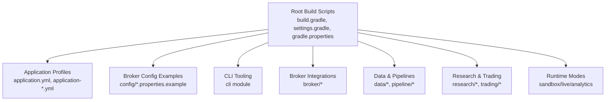
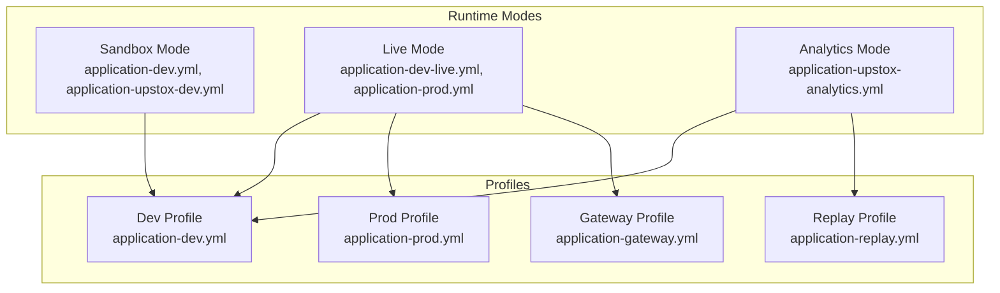
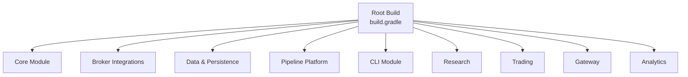

# Getting Started

<cite>
**Referenced Files in This Document**
- [README.md](file://README.md)
- [CONFIG.md](file://CONFIG.md)
- [CLI.md](file://CLI.md)
- [application.yml](file://app/src/main/resources/application.yml)
- [application-dev.yml](file://app/src/main/resources/application-dev.yml)
- [application-prod.yml](file://app/src/main/resources/application-prod.yml)
- [application-replay.yml](file://app/src/main/resources/application-replay.yml)
- [application-upstox-dev.yml](file://app/src/main/resources/application-upstox-dev.yml)
- [application-upstox-prod.yml](file://app/src/main/resources/application-upstox-prod.yml)
- [application-upstox-analytics.yml](file://app/src/main/resources/application-upstox-analytics.yml)
- [application-icici-prod.yml](file://app/src/main/resources/application-icici-prod.yml)
- [application-dev-live.yml](file://app/src/main/resources/application-dev-live.yml)
- [application-gateway.yml](file://app/src/main/resources/application-gateway.yml)
- [dhan-local.properties.example](file://config/dhan-local.properties.example)
- [dhan-sandbox.properties.example](file://config/dhan-sandbox.properties.example)
- [icici-local.properties.example](file://config/icici-local.properties.example)
- [upstox-live.properties.example](file://config/upstox-live.properties.example)
- [upstox-sandbox.properties.example](file://config/upstox-sandbox.properties.example)
- [build.gradle](file://build.gradle)
- [gradle.properties](file://gradle.properties)
- [settings.gradle](file://settings.gradle)
- [console-smoke.sh](file://scripts/console-smoke.sh)
- [production-smoke-test.sh](file://scripts/production-smoke-test.sh)
- [run-full-regression.sh](file://scripts/run-full-regression.sh)
- [test-api.sh](file://scripts/test-api.sh)
- [upstox-smoke.sh](file://scripts/upstox-smoke.sh)
- [dhan-smoke.sh](file://scripts/dhan-smoke.sh)
- [tradej-smoke-test.sh](file://scripts/tradej-smoke-test.sh)
</cite>

## Table of Contents
1. [Introduction](#introduction)
2. [Project Structure](#project-structure)
3. [Core Components](#core-components)
4. [Architecture Overview](#architecture-overview)
5. [Detailed Component Analysis](#detailed-component-analysis)
6. [Dependency Analysis](#dependency-analysis)
7. [Performance Considerations](#performance-considerations)
8. [Troubleshooting Guide](#troubleshooting-guide)
9. [Conclusion](#conclusion)
10. [Appendices](#appendices)

## Introduction
This guide helps you install, configure, and deploy the Trade-J trading platform for the first time. It covers prerequisites, environment setup, credential configuration, and basic usage across the three main runtime modes: sandbox, live, and analytics. You will also find verification steps and troubleshooting tips to ensure a smooth start.

## Project Structure
Trade-J is a multi-module Gradle project with distinct areas for core trading logic, broker integrations, data pipelines, analytics, and CLI tooling. The application’s runtime profiles and broker configurations are primarily managed via Spring Boot configuration files under the resources directory and property files under the config directory.

**Section sources**
- [build.gradle](file://build.gradle)
- [settings.gradle](file://settings.gradle)
- [gradle.properties](file://gradle.properties)

## Core Components
- Application configuration: Centralized in Spring Boot YAML files under app/src/main/resources. These define runtime profiles and broker-specific settings.
- Broker credentials: Provided via property files under config/, with examples for Dhan, Upstox, and ICICI.
- CLI tooling: Offers commands for attaching sessions, downloading data, scanning, and trading operations.
- Modules: Core, broker integrations, data, analytics, pipeline, research, and trading form the platform’s functional layers.

**Section sources**
- [application.yml](file://app/src/main/resources/application.yml)
- [CLI.md](file://CLI.md)

## Architecture Overview
The platform supports three primary runtime modes, each tailored to a specific operational goal:

- Sandbox mode: Safe testing and development with simulated environments.
- Live mode: Real market connectivity and order execution.
- Analytics mode: Aggregated analytics and reporting across feeds and pipelines.

**Diagram sources**
- [application-dev.yml](file://app/src/main/resources/application-dev.yml)
- [application-prod.yml](file://app/src/main/resources/application-prod.yml)
- [application-replay.yml](file://app/src/main/resources/application-replay.yml)
- [application-gateway.yml](file://app/src/main/resources/application-gateway.yml)
- [application-upstox-dev.yml](file://app/src/main/resources/application-upstox-dev.yml)
- [application-upstox-prod.yml](file://app/src/main/resources/application-upstox-prod.yml)
- [application-upstox-analytics.yml](file://app/src/main/resources/application-upstox-analytics.yml)
- [application-dev-live.yml](file://app/src/main/resources/application-dev-live.yml)

## Detailed Component Analysis

### Prerequisites and Environment Setup
- Java: Use Java 21 as required by the project.
- Gradle: Build and run tasks are orchestrated via Gradle; ensure Gradle wrapper is available.
- Node.js (frontend): Required for building the frontend assets; see frontend-related scripts and packages.
- Git: Clone the repository and keep up to date with upstream branches.

Verification steps:
- Confirm Java version and Gradle availability.
- Build the project to validate dependencies resolve correctly.

**Section sources**
- [gradle.properties](file://gradle.properties)
- [build.gradle](file://build.gradle)

### Initial Installation and First-Time Deployment
- Clone the repository and navigate to the project root.
- Sync submodules if applicable.
- Build the project using the Gradle wrapper to fetch dependencies and compile modules.
- Verify the build completes successfully across all modules.

Optional: Build frontend assets if you plan to use the web interface locally.

**Section sources**
- [README.md](file://README.md)
- [build.gradle](file://build.gradle)

### Credential Setup Using Config Examples
Configure broker credentials using the provided property examples. Copy the relevant example file to a local properties file and fill in your broker-specific keys and tokens.

- Dhan
  - Example: [dhan-local.properties.example](file://config/dhan-local.properties.example)
  - Sandbox example: [dhan-sandbox.properties.example](file://config/dhan-sandbox.properties.example)
- ICICI
  - Example: [icici-local.properties.example](file://config/icici-local.properties.example)
- Upstox
  - Live example: [upstox-live.properties.example](file://config/upstox-live.properties.example)
  - Sandbox example: [upstox-sandbox.properties.example](file://config/upstox-sandbox.properties.example)

Notes:
- Replace placeholder values with your actual API keys, tokens, and endpoints.
- Keep secrets out of version control; use environment variables or secure vaults in production.

**Section sources**
- [dhan-local.properties.example](file://config/dhan-local.properties.example)
- [dhan-sandbox.properties.example](file://config/dhan-sandbox.properties.example)
- [icici-local.properties.example](file://config/icici-local.properties.example)
- [upstox-live.properties.example](file://config/upstox-live.properties.example)
- [upstox-sandbox.properties.example](file://config/upstox-sandbox.properties.example)

### Environment Configuration
Runtime behavior is controlled by Spring profiles and broker-specific application YAML files. Select the appropriate profile for your environment and broker.

Key configuration files:
- Base application: [application.yml](file://app/src/main/resources/application.yml)
- Dev sandbox: [application-dev.yml](file://app/src/main/resources/application-dev.yml)
- Production: [application-prod.yml](file://app/src/main/resources/application-prod.yml)
- Replay: [application-replay.yml](file://app/src/main/resources/application-replay.yml)
- Upstox dev: [application-upstox-dev.yml](file://app/src/main/resources/application-upstox-dev.yml)
- Upstox prod: [application-upstox-prod.yml](file://app/src/main/resources/application-upstox-prod.yml)
- Upstox analytics: [application-upstox-analytics.yml](file://app/src/main/resources/application-upstox-analytics.yml)
- ICICI prod: [application-icici-prod.yml](file://app/src/main/resources/application-icici-prod.yml)
- Dev live: [application-dev-live.yml](file://app/src/main/resources/application-dev-live.yml)
- Gateway: [application-gateway.yml](file://app/src/main/resources/application-gateway.yml)

How to apply:
- Set the active Spring profile via JVM arguments or environment variables.
- Point the application to the correct broker configuration file per the selected runtime mode.

**Section sources**
- [application.yml](file://app/src/main/resources/application.yml)
- [application-dev.yml](file://app/src/main/resources/application-dev.yml)
- [application-prod.yml](file://app/src/main/resources/application-prod.yml)
- [application-replay.yml](file://app/src/main/resources/application-replay.yml)
- [application-upstox-dev.yml](file://app/src/main/resources/application-upstox-dev.yml)
- [application-upstox-prod.yml](file://app/src/main/resources/application-upstox-prod.yml)
- [application-upstox-analytics.yml](file://app/src/main/resources/application-upstox-analytics.yml)
- [application-icici-prod.yml](file://app/src/main/resources/application-icici-prod.yml)
- [application-dev-live.yml](file://app/src/main/resources/application-dev-live.yml)
- [application-gateway.yml](file://app/src/main/resources/application-gateway.yml)

### Basic Usage Examples
Use the CLI to interact with the platform for common tasks such as attaching broker sessions, downloading instruments, scanning, and trading.

- CLI overview and commands: [CLI.md](file://CLI.md)
- Broker session attachment and management are exposed via CLI commands.
- Download and import equity instruments for trading.
- Run scans and portfolio queries.
- Place and manage orders in supported modes.

Tip: Start with sandbox mode to validate your setup before moving to live.

**Section sources**
- [CLI.md](file://CLI.md)

### Three Main Runtime Modes

#### Sandbox Mode
Purpose: Safe testing and development with simulated environments.
- Use dev sandbox profile: [application-dev.yml](file://app/src/main/resources/application-dev.yml)
- Optional Upstox sandbox: [application-upstox-dev.yml](file://app/src/main/resources/application-upstox-dev.yml)
- Configure sandbox credentials using the sandbox property examples.

Verification:
- Run smoke tests for sandbox components.
- Use scripts to validate connectivity and data flow.

**Section sources**
- [application-dev.yml](file://app/src/main/resources/application-dev.yml)
- [application-upstox-dev.yml](file://app/src/main/resources/application-upstox-dev.yml)
- [dhan-sandbox.properties.example](file://config/dhan-sandbox.properties.example)
- [upstox-sandbox.properties.example](file://config/upstox-sandbox.properties.example)

#### Live Mode
Purpose: Real market connectivity and order execution.
- Use dev live profile: [application-dev-live.yml](file://app/src/main/resources/application-dev-live.yml)
- Production profile: [application-prod.yml](file://app/src/main/resources/application-prod.yml)
- Configure live credentials using the live property examples.

Verification:
- Run production smoke tests.
- Execute basic order lifecycle checks.

**Section sources**
- [application-dev-live.yml](file://app/src/main/resources/application-dev-live.yml)
- [application-prod.yml](file://app/src/main/resources/application-prod.yml)
- [upstox-live.properties.example](file://config/upstox-live.properties.example)
- [dhan-local.properties.example](file://config/dhan-local.properties.example)
- [icici-local.properties.example](file://config/icici-local.properties.example)

#### Analytics Mode
Purpose: Aggregated analytics and reporting across feeds and pipelines.
- Use Upstox analytics profile: [application-upstox-analytics.yml](file://app/src/main/resources/application-upstox-analytics.yml)
- Replay profile: [application-replay.yml](file://app/src/main/resources/application-replay.yml)
- Gateway profile: [application-gateway.yml](file://app/src/main/resources/application-gateway.yml)

Verification:
- Validate analytics ingestion and catalog updates.
- Confirm replay parity and pipeline correctness.

**Section sources**
- [application-upstox-analytics.yml](file://app/src/main/resources/application-upstox-analytics.yml)
- [application-replay.yml](file://app/src/main/resources/application-replay.yml)
- [application-gateway.yml](file://app/src/main/resources/application-gateway.yml)

## Dependency Analysis
The project uses Gradle for multi-module builds. The root build script coordinates subprojects and shared configurations.

**Diagram sources**
- [build.gradle](file://build.gradle)
- [settings.gradle](file://settings.gradle)

**Section sources**
- [build.gradle](file://build.gradle)
- [settings.gradle](file://settings.gradle)

## Performance Considerations
- Prefer sandbox mode for iterative development to reduce resource usage.
- Use replay mode to validate performance and throughput without live market impact.
- Monitor broker rate limits and adjust request pacing accordingly.
- Keep frontend assets built and cached for faster local iteration.

## Troubleshooting Guide
Common setup issues and remedies:

- Java version mismatch
  - Symptom: Build fails with incompatible class files.
  - Fix: Ensure Java 21 is installed and configured in your environment.

- Gradle sync failures
  - Symptom: Dependencies fail to resolve.
  - Fix: Clean and rebuild; invalidate caches if using an IDE; verify network connectivity.

- Missing broker credentials
  - Symptom: Authentication errors or empty sessions.
  - Fix: Copy the relevant example property file and populate your keys and tokens.

- Incorrect Spring profile selection
  - Symptom: Wrong broker or mode loaded.
  - Fix: Set the active profile explicitly via JVM arguments or environment variables.

- Frontend asset build issues
  - Symptom: Blank UI or missing assets.
  - Fix: Install Node.js dependencies and rebuild frontend assets.

Verification scripts:
- Console smoke: [console-smoke.sh](file://scripts/console-smoke.sh)
- Production smoke: [production-smoke-test.sh](file://scripts/production-smoke-test.sh)
- Full regression: [run-full-regression.sh](file://scripts/run-full-regression.sh)
- API tests: [test-api.sh](file://scripts/test-api.sh)
- Upstox smoke: [upstox-smoke.sh](file://scripts/upstox-smoke.sh)
- Dhan smoke: [dhan-smoke.sh](file://scripts/dhan-smoke.sh)
- TradeJ smoke: [tradej-smoke-test.sh](file://scripts/tradej-smoke-test.sh)

**Section sources**
- [console-smoke.sh](file://scripts/console-smoke.sh)
- [production-smoke-test.sh](file://scripts/production-smoke-test.sh)
- [run-full-regression.sh](file://scripts/run-full-regression.sh)
- [test-api.sh](file://scripts/test-api.sh)
- [upstox-smoke.sh](file://scripts/upstox-smoke.sh)
- [dhan-smoke.sh](file://scripts/dhan-smoke.sh)
- [tradej-smoke-test.sh](file://scripts/tradej-smoke-test.sh)

## Conclusion
You now have the essentials to install Trade-J, configure credentials, select runtime modes, and verify your setup. Start in sandbox mode, progress to live after validation, and leverage analytics mode for insights. Use the provided scripts and configuration files to streamline deployment and troubleshooting.

## Appendices

### Appendix A: Quick Reference Checklist
- Installed Java 21 and verified with the build.
- Copied and filled broker credential examples.
- Selected and applied the correct Spring profile.
- Built and verified the project.
- Ran a smoke test script for your chosen mode.

### Appendix B: Configuration Files Index
- Base application: [application.yml](file://app/src/main/resources/application.yml)
- Dev sandbox: [application-dev.yml](file://app/src/main/resources/application-dev.yml)
- Production: [application-prod.yml](file://app/src/main/resources/application-prod.yml)
- Replay: [application-replay.yml](file://app/src/main/resources/application-replay.yml)
- Upstox dev: [application-upstox-dev.yml](file://app/src/main/resources/application-upstox-dev.yml)
- Upstox prod: [application-upstox-prod.yml](file://app/src/main/resources/application-upstox-prod.yml)
- Upstox analytics: [application-upstox-analytics.yml](file://app/src/main/resources/application-upstox-analytics.yml)
- ICICI prod: [application-icici-prod.yml](file://app/src/main/resources/application-icici-prod.yml)
- Dev live: [application-dev-live.yml](file://app/src/main/resources/application-dev-live.yml)
- Gateway: [application-gateway.yml](file://app/src/main/resources/application-gateway.yml)