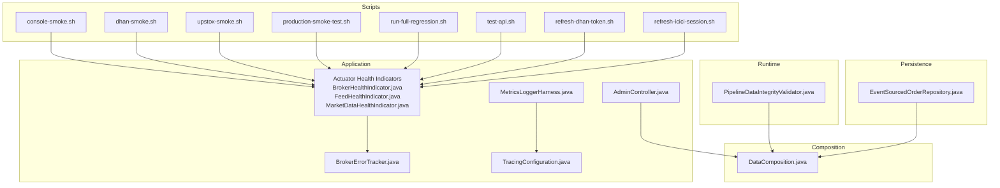
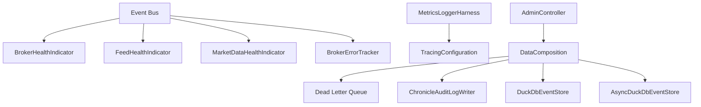
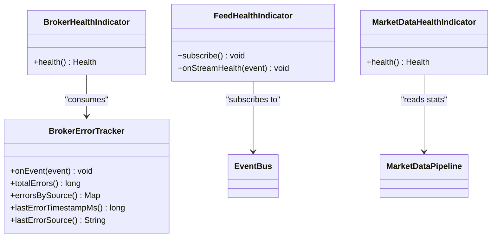
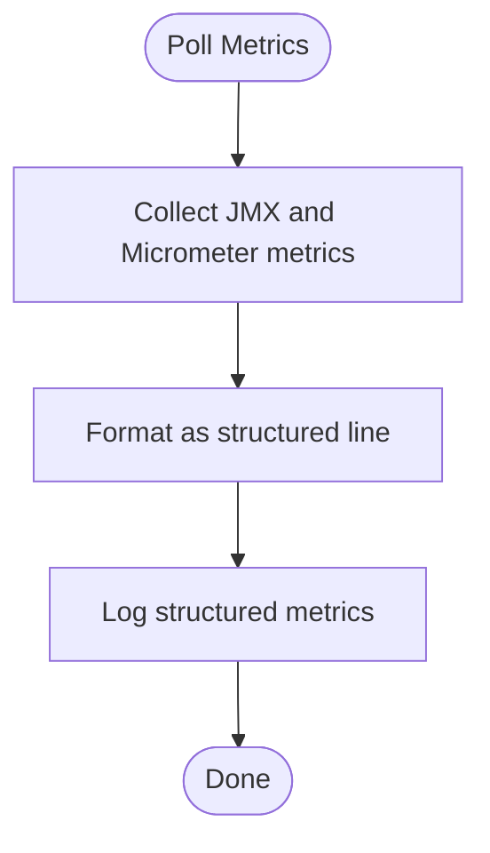
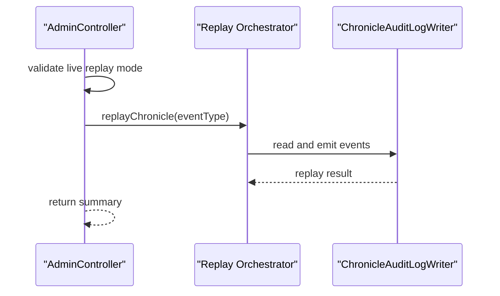
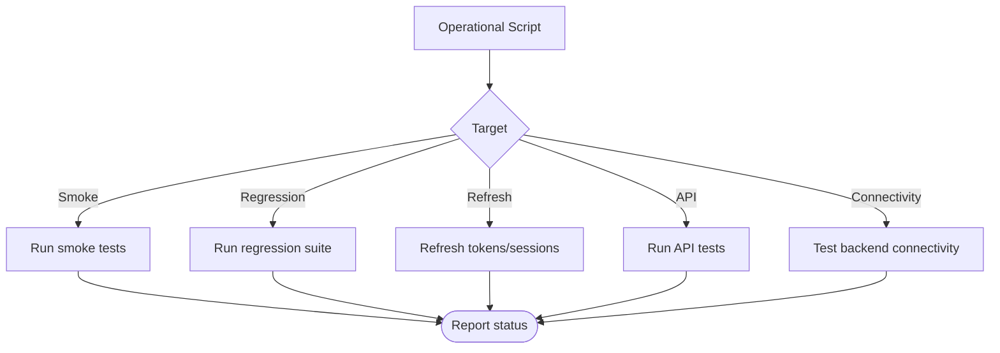
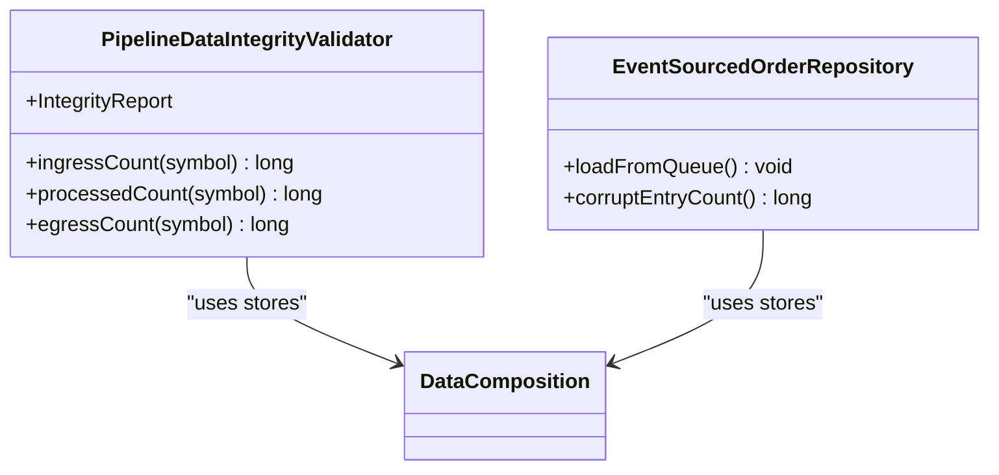
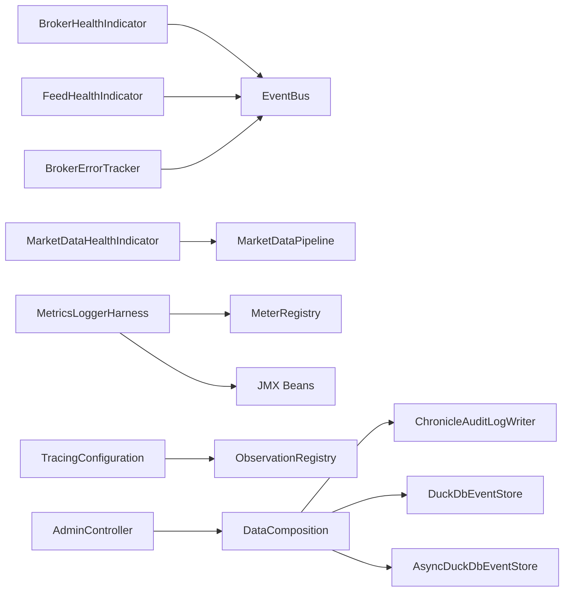

# Monitoring and Operations

<cite>
**Referenced Files in This Document**
- [BrokerErrorTracker.java](file://app/src/main/java/com/tradej/app/health/BrokerErrorTracker.java)
- [BrokerHealthIndicator.java](file://app/src/main/java/com/tradej/app/health/BrokerHealthIndicator.java)
- [FeedHealthIndicator.java](file://app/src/main/java/com/tradej/app/health/FeedHealthIndicator.java)
- [MarketDataHealthIndicator.java](file://app/src/main/java/com/tradej/app/health/MarketDataHealthIndicator.java)
- [MetricsLoggerHarness.java](file://app/src/main/java/com/tradej/app/metrics/MetricsLoggerHarness.java)
- [TracingConfiguration.java](file://app/src/main/java/com/tradej/app/config/TracingConfiguration.java)
- [DataComposition.java](file://composition/src/main/java/com/tradej/composition/DataComposition.java)
- [AdminController.java](file://app/src/main/java/com/tradej/app/admin/AdminController.java)
- [PipelineDataIntegrityValidator.java](file://runtime/hotpath/src/main/java/com/tradej/hotpath/PipelineDataIntegrityValidator.java)
- [EventSourcedOrderRepository.java](file://data/persistence/src/main/java/com/tradej/persistence/oms/EventSourcedOrderRepository.java)
- [ReconciliationAlertLoggerUnitTest.java](file://trading/execution/src/test/java/com/tradej/execution/reconcile/ReconciliationAlertLoggerUnitTest.java)
- [dashboard.html](file://app/src/main/resources/static/dashboard.html)
- [console-smoke.sh](file://scripts/console-smoke.sh)
- [dhan-smoke.sh](file://scripts/dhan-smoke.sh)
- [upstox-smoke.sh](file://scripts/upstox-smoke.sh)
- [production-smoke-test.sh](file://scripts/production-smoke-test.sh)
- [run-full-regression.sh](file://scripts/run-full-regression.sh)
- [test-api.sh](file://scripts/test-api.sh)
- [refresh-dhan-token.sh](file://scripts/refresh-dhan-token.sh)
- [refresh-icici-session.sh](file://scripts/refresh-icici-session.sh)
- [test-backend-connection.sh](file://test-backend-connection.sh)
- [logback-spring.xml](file://app/src/main/resources/logback-spring.xml)
- [application.yml](file://app/src/main/resources/application.yml)
- [application-dev.yml](file://app/src/main/resources/application-dev.yml)
- [application-prod.yml](file://app/src/main/resources/application-prod.yml)
- [application-gateway.yml](file://app/src/main/resources/application-gateway.yml)
- [application-upstox-prod.yml](file://app/src/main/resources/application-upstox-prod.yml)
- [application-upstox-dev.yml](file://app/src/main/resources/application-upstox-dev.yml)
- [application-icici-prod.yml](file://app/src/main/resources/application-icici-prod.yml)
- [application-replay.yml](file://app/src/main/resources/application-replay.yml)
- [application-dev-live.yml](file://app/src/main/resources/application-dev-live.yml)
- [BROKER_INTEGRATION_AUDIT_REPORT.md](file://docs/BROKER_INTEGRATION_AUDIT_REPORT.md)
- [ARCHITECTURE.md](file://ARCHITECTURE.md)
- [PRODUCTION_DEPLOYMENT.md](file://docs/PRODUCTION_DEPLOYMENT.md)
- [USAGE_GUIDE.md](file://docs/USAGE_GUIDE.md)
</cite>

## Table of Contents
1. [Introduction](#introduction)
2. [Project Structure](#project-structure)
3. [Core Components](#core-components)
4. [Architecture Overview](#architecture-overview)
5. [Detailed Component Analysis](#detailed-component-analysis)
6. [Dependency Analysis](#dependency-analysis)
7. [Performance Considerations](#performance-considerations)
8. [Troubleshooting Guide](#troubleshooting-guide)
9. [Conclusion](#conclusion)
10. [Appendices](#appendices)

## Introduction
This document provides comprehensive guidance for monitoring and operations of the system. It covers health checks for broker connectivity and market data, performance metrics collection, structured logging and auditing, operational scripts, startup/shutdown procedures, maintenance tasks, troubleshooting, performance tuning, alerting configuration, and disaster recovery considerations. The goal is to enable reliable day-2 operations with clear procedures and actionable insights.

## Project Structure
The monitoring and operations surface spans several modules:
- Health indicators and trackers under the application module
- Metrics logging harness and tracing configuration
- Data composition for audit logging and event stores
- Administrative endpoints for replay and diagnostics
- Operational scripts for smoke tests, token/session refresh, and regression runs
- Logging configuration and environment-specific application profiles

**Diagram sources**
- [BrokerHealthIndicator.java:1-34](file://app/src/main/java/com/tradej/app/health/BrokerHealthIndicator.java#L1-L34)
- [FeedHealthIndicator.java:1-32](file://app/src/main/java/com/tradej/app/health/FeedHealthIndicator.java#L1-L32)
- [MarketDataHealthIndicator.java:38-75](file://app/src/main/java/com/tradej/app/health/MarketDataHealthIndicator.java#L38-L75)
- [BrokerErrorTracker.java:1-64](file://app/src/main/java/com/tradej/app/health/BrokerErrorTracker.java#L1-L64)
- [MetricsLoggerHarness.java:70-161](file://app/src/main/java/com/tradej/app/metrics/MetricsLoggerHarness.java#L70-L161)
- [TracingConfiguration.java:1-20](file://app/src/main/java/com/tradej/app/config/TracingConfiguration.java#L1-L20)
- [DataComposition.java:31-84](file://composition/src/main/java/com/tradej/composition/DataComposition.java#L31-L84)
- [AdminController.java:459-487](file://app/src/main/java/com/tradej/app/admin/AdminController.java#L459-L487)
- [PipelineDataIntegrityValidator.java:103-145](file://runtime/hotpath/src/main/java/com/tradej/hotpath/PipelineDataIntegrityValidator.java#L103-L145)
- [EventSourcedOrderRepository.java:163-195](file://data/persistence/src/main/java/com/tradej/persistence/oms/EventSourcedOrderRepository.java#L163-L195)
- [console-smoke.sh](file://scripts/console-smoke.sh)
- [dhan-smoke.sh](file://scripts/dhan-smoke.sh)
- [upstox-smoke.sh](file://scripts/upstox-smoke.sh)
- [production-smoke-test.sh](file://scripts/production-smoke-test.sh)
- [run-full-regression.sh](file://scripts/run-full-regression.sh)
- [test-api.sh](file://scripts/test-api.sh)
- [refresh-dhan-token.sh](file://scripts/refresh-dhan-token.sh)
- [refresh-icici-session.sh](file://scripts/refresh-icici-session.sh)

**Section sources**
- [BrokerHealthIndicator.java:1-34](file://app/src/main/java/com/tradej/app/health/BrokerHealthIndicator.java#L1-L34)
- [FeedHealthIndicator.java:1-32](file://app/src/main/java/com/tradej/app/health/FeedHealthIndicator.java#L1-L32)
- [MarketDataHealthIndicator.java:38-75](file://app/src/main/java/com/tradej/app/health/MarketDataHealthIndicator.java#L38-L75)
- [BrokerErrorTracker.java:1-64](file://app/src/main/java/com/tradej/app/health/BrokerErrorTracker.java#L1-L64)
- [MetricsLoggerHarness.java:70-161](file://app/src/main/java/com/tradej/app/metrics/MetricsLoggerHarness.java#L70-L161)
- [TracingConfiguration.java:1-20](file://app/src/main/java/com/tradej/app/config/TracingConfiguration.java#L1-L20)
- [DataComposition.java:31-84](file://composition/src/main/java/com/tradej/composition/DataComposition.java#L31-L84)
- [AdminController.java:459-487](file://app/src/main/java/com/tradej/app/admin/AdminController.java#L459-L487)
- [PipelineDataIntegrityValidator.java:103-145](file://runtime/hotpath/src/main/java/com/tradej/hotpath/PipelineDataIntegrityValidator.java#L103-L145)
- [EventSourcedOrderRepository.java:163-195](file://data/persistence/src/main/java/com/tradej/persistence/oms/EventSourcedOrderRepository.java#L163-L195)
- [console-smoke.sh](file://scripts/console-smoke.sh)
- [dhan-smoke.sh](file://scripts/dhan-smoke.sh)
- [upstox-smoke.sh](file://scripts/upstox-smoke.sh)
- [production-smoke-test.sh](file://scripts/production-smoke-test.sh)
- [run-full-regression.sh](file://scripts/run-full-regression.sh)
- [test-api.sh](file://scripts/test-api.sh)
- [refresh-dhan-token.sh](file://scripts/refresh-dhan-token.sh)
- [refresh-icici-session.sh](file://scripts/refresh-icici-session.sh)

## Core Components
- Health indicators expose system status via Spring Boot Actuator:
  - Broker connectivity and circuit breaker state
  - Market data freshness and transport capabilities
  - Stream health updates for feed sources
- Broker error tracking aggregates adapter errors for health reporting
- Metrics logging harness collects JVM and Micrometer metrics and emits structured lines
- Tracing configuration enables hot-path observations when enabled
- Data composition wires audit logging and event stores for replay and diagnostics
- Administrative endpoints support audit replay and diagnostics
- Operational scripts automate smoke tests, token/session refresh, and regression runs

**Section sources**
- [BrokerHealthIndicator.java:1-34](file://app/src/main/java/com/tradej/app/health/BrokerHealthIndicator.java#L1-L34)
- [FeedHealthIndicator.java:1-32](file://app/src/main/java/com/tradej/app/health/FeedHealthIndicator.java#L1-L32)
- [MarketDataHealthIndicator.java:38-75](file://app/src/main/java/com/tradej/app/health/MarketDataHealthIndicator.java#L38-L75)
- [BrokerErrorTracker.java:1-64](file://app/src/main/java/com/tradej/app/health/BrokerErrorTracker.java#L1-L64)
- [MetricsLoggerHarness.java:70-161](file://app/src/main/java/com/tradej/app/metrics/MetricsLoggerHarness.java#L70-L161)
- [TracingConfiguration.java:1-20](file://app/src/main/java/com/tradej/app/config/TracingConfiguration.java#L1-L20)
- [DataComposition.java:31-84](file://composition/src/main/java/com/tradej/composition/DataComposition.java#L31-L84)
- [AdminController.java:459-487](file://app/src/main/java/com/tradej/app/admin/AdminController.java#L459-L487)

## Architecture Overview
The monitoring and operations architecture integrates health checks, metrics, tracing, audit logging, and administrative controls. Health indicators subscribe to domain events and expose status. Metrics are collected periodically and logged as structured lines. Audit logs are persisted for replay and diagnostics. Scripts orchestrate operational tasks.

**Diagram sources**
- [BrokerHealthIndicator.java:1-34](file://app/src/main/java/com/tradej/app/health/BrokerHealthIndicator.java#L1-L34)
- [FeedHealthIndicator.java:1-32](file://app/src/main/java/com/tradej/app/health/FeedHealthIndicator.java#L1-L32)
- [MarketDataHealthIndicator.java:38-75](file://app/src/main/java/com/tradej/app/health/MarketDataHealthIndicator.java#L38-L75)
- [BrokerErrorTracker.java:1-64](file://app/src/main/java/com/tradej/app/health/BrokerErrorTracker.java#L1-L64)
- [MetricsLoggerHarness.java:70-161](file://app/src/main/java/com/tradej/app/metrics/MetricsLoggerHarness.java#L70-L161)
- [TracingConfiguration.java:1-20](file://app/src/main/java/com/tradej/app/config/TracingConfiguration.java#L1-L20)
- [DataComposition.java:31-84](file://composition/src/main/java/com/tradej/composition/DataComposition.java#L31-L84)
- [AdminController.java:459-487](file://app/src/main/java/com/tradej/app/admin/AdminController.java#L459-L487)

## Detailed Component Analysis

### Health Checks and Broker Connectivity Monitoring
- BrokerHealthIndicator evaluates WebSocket connectivity and circuit breaker state to determine overall broker health.
- FeedHealthIndicator subscribes to stream health events and tracks per-broker status and timestamps.
- MarketDataHealthIndicator assesses freshness thresholds and transport capabilities, reporting up/down states with details.
- BrokerErrorTracker aggregates adapter errors and exposes totals, per-source counts, and last error metadata for health reporting.

**Diagram sources**
- [BrokerHealthIndicator.java:1-34](file://app/src/main/java/com/tradej/app/health/BrokerHealthIndicator.java#L1-L34)
- [FeedHealthIndicator.java:1-32](file://app/src/main/java/com/tradej/app/health/FeedHealthIndicator.java#L1-L32)
- [MarketDataHealthIndicator.java:38-75](file://app/src/main/java/com/tradej/app/health/MarketDataHealthIndicator.java#L38-L75)
- [BrokerErrorTracker.java:1-64](file://app/src/main/java/com/tradej/app/health/BrokerErrorTracker.java#L1-L64)

**Section sources**
- [BrokerHealthIndicator.java:1-34](file://app/src/main/java/com/tradej/app/health/BrokerHealthIndicator.java#L1-L34)
- [FeedHealthIndicator.java:1-32](file://app/src/main/java/com/tradej/app/health/FeedHealthIndicator.java#L1-L32)
- [MarketDataHealthIndicator.java:38-75](file://app/src/main/java/com/tradej/app/health/MarketDataHealthIndicator.java#L38-L75)
- [BrokerErrorTracker.java:1-64](file://app/src/main/java/com/tradej/app/health/BrokerErrorTracker.java#L1-L64)

### Performance Metrics Collection
- MetricsLoggerHarness periodically collects JVM JMX metrics and Micrometer gauges/counters/timers, formats them as structured lines, and logs them. It safely reads metric values and falls back on defaults when unavailable.

**Diagram sources**
- [MetricsLoggerHarness.java:70-161](file://app/src/main/java/com/tradej/app/metrics/MetricsLoggerHarness.java#L70-L161)

**Section sources**
- [MetricsLoggerHarness.java:70-161](file://app/src/main/java/com/tradej/app/metrics/MetricsLoggerHarness.java#L70-L161)

### Logging and Auditing
- Structured logging is configured via Logback; metrics and alerts are emitted as structured lines for ingestion.
- DataComposition wires audit logging and event stores for persistent audit trails and replay.
- Administrative endpoints support replay of Chronicle audit logs for diagnostics.

**Diagram sources**
- [AdminController.java:459-487](file://app/src/main/java/com/tradej/app/admin/AdminController.java#L459-L487)
- [DataComposition.java:31-84](file://composition/src/main/java/com/tradej/composition/DataComposition.java#L31-L84)

**Section sources**
- [DataComposition.java:31-84](file://composition/src/main/java/com/tradej/composition/DataComposition.java#L31-L84)
- [AdminController.java:459-487](file://app/src/main/java/com/tradej/app/admin/AdminController.java#L459-L487)

### Operational Scripts and Maintenance Tasks
- Smoke tests for console, Dhan, Upstox, and production environments
- Regression runs and API tests
- Token/session refresh scripts for brokers
- Backend connectivity checks

**Diagram sources**
- [console-smoke.sh](file://scripts/console-smoke.sh)
- [dhan-smoke.sh](file://scripts/dhan-smoke.sh)
- [upstox-smoke.sh](file://scripts/upstox-smoke.sh)
- [production-smoke-test.sh](file://scripts/production-smoke-test.sh)
- [run-full-regression.sh](file://scripts/run-full-regression.sh)
- [test-api.sh](file://scripts/test-api.sh)
- [refresh-dhan-token.sh](file://scripts/refresh-dhan-token.sh)
- [refresh-icici-session.sh](file://scripts/refresh-icici-session.sh)
- [test-backend-connection.sh](file://test-backend-connection.sh)

**Section sources**
- [console-smoke.sh](file://scripts/console-smoke.sh)
- [dhan-smoke.sh](file://scripts/dhan-smoke.sh)
- [upstox-smoke.sh](file://scripts/upstox-smoke.sh)
- [production-smoke-test.sh](file://scripts/production-smoke-test.sh)
- [run-full-regression.sh](file://scripts/run-full-regression.sh)
- [test-api.sh](file://scripts/test-api.sh)
- [refresh-dhan-token.sh](file://scripts/refresh-dhan-token.sh)
- [refresh-icici-session.sh](file://scripts/refresh-icici-session.sh)
- [test-backend-connection.sh](file://test-backend-connection.sh)

### Startup and Shutdown Procedures
- Environment-specific application profiles define runtime behavior for development, production, gateway, and broker-specific modes.
- Logging configuration supports structured logging and environment-specific overrides.

**Section sources**
- [application.yml](file://app/src/main/resources/application.yml)
- [application-dev.yml](file://app/src/main/resources/application-dev.yml)
- [application-prod.yml](file://app/src/main/resources/application-prod.yml)
- [application-gateway.yml](file://app/src/main/resources/application-gateway.yml)
- [application-upstox-prod.yml](file://app/src/main/resources/application-upstox-prod.yml)
- [application-upstox-dev.yml](file://app/src/main/resources/application-upstox-dev.yml)
- [application-icici-prod.yml](file://app/src/main/resources/application-icici-prod.yml)
- [application-replay.yml](file://app/src/main/resources/application-replay.yml)
- [application-dev-live.yml](file://app/src/main/resources/application-dev-live.yml)
- [logback-spring.xml](file://app/src/main/resources/logback-spring.xml)

### Data Integrity and Pipeline Observability
- PipelineDataIntegrityValidator provides per-symbol ingress, processed, and egress counts and generates integrity reports for validation.
- EventSourcedOrderRepository loads events from Chronicle Queue on startup, with robust error handling for corrupt entries and informative logs.

**Diagram sources**
- [PipelineDataIntegrityValidator.java:103-145](file://runtime/hotpath/src/main/java/com/tradej/hotpath/PipelineDataIntegrityValidator.java#L103-L145)
- [EventSourcedOrderRepository.java:163-195](file://data/persistence/src/main/java/com/tradej/persistence/oms/EventSourcedOrderRepository.java#L163-L195)
- [DataComposition.java:31-84](file://composition/src/main/java/com/tradej/composition/DataComposition.java#L31-L84)

**Section sources**
- [PipelineDataIntegrityValidator.java:103-145](file://runtime/hotpath/src/main/java/com/tradej/hotpath/PipelineDataIntegrityValidator.java#L103-L145)
- [EventSourcedOrderRepository.java:163-195](file://data/persistence/src/main/java/com/tradej/persistence/oms/EventSourcedOrderRepository.java#L163-L195)
- [DataComposition.java:31-84](file://composition/src/main/java/com/tradej/composition/DataComposition.java#L31-L84)

### Alerting and Dashboard Visibility
- The dashboard displays broker status, pipeline metrics, and ring buffer utilization to provide real-time visibility.
- Reconciliation alert logging emits structured warnings for position mismatches.

**Section sources**
- [dashboard.html:324-373](file://app/src/main/resources/static/dashboard.html#L324-L373)
- [ReconciliationAlertLoggerUnitTest.java:1-49](file://trading/execution/src/test/java/com/tradej/execution/reconcile/ReconciliationAlertLoggerUnitTest.java#L1-L49)

## Dependency Analysis
The monitoring stack depends on Spring Boot Actuator for health endpoints, Micrometer for metrics, and Logback for structured logging. Data composition centralizes audit and event store wiring. Administrative endpoints depend on audit logging and replay orchestrators.

**Diagram sources**
- [BrokerHealthIndicator.java:1-34](file://app/src/main/java/com/tradej/app/health/BrokerHealthIndicator.java#L1-L34)
- [FeedHealthIndicator.java:1-32](file://app/src/main/java/com/tradej/app/health/FeedHealthIndicator.java#L1-L32)
- [MarketDataHealthIndicator.java:38-75](file://app/src/main/java/com/tradej/app/health/MarketDataHealthIndicator.java#L38-L75)
- [BrokerErrorTracker.java:1-64](file://app/src/main/java/com/tradej/app/health/BrokerErrorTracker.java#L1-L64)
- [MetricsLoggerHarness.java:70-161](file://app/src/main/java/com/tradej/app/metrics/MetricsLoggerHarness.java#L70-L161)
- [TracingConfiguration.java:1-20](file://app/src/main/java/com/tradej/app/config/TracingConfiguration.java#L1-L20)
- [DataComposition.java:31-84](file://composition/src/main/java/com/tradej/composition/DataComposition.java#L31-L84)
- [AdminController.java:459-487](file://app/src/main/java/com/tradej/app/admin/AdminController.java#L459-L487)

**Section sources**
- [BrokerHealthIndicator.java:1-34](file://app/src/main/java/com/tradej/app/health/BrokerHealthIndicator.java#L1-L34)
- [FeedHealthIndicator.java:1-32](file://app/src/main/java/com/tradej/app/health/FeedHealthIndicator.java#L1-L32)
- [MarketDataHealthIndicator.java:38-75](file://app/src/main/java/com/tradej/app/health/MarketDataHealthIndicator.java#L38-L75)
- [BrokerErrorTracker.java:1-64](file://app/src/main/java/com/tradej/app/health/BrokerErrorTracker.java#L1-L64)
- [MetricsLoggerHarness.java:70-161](file://app/src/main/java/com/tradej/app/metrics/MetricsLoggerHarness.java#L70-L161)
- [TracingConfiguration.java:1-20](file://app/src/main/java/com/tradej/app/config/TracingConfiguration.java#L1-L20)
- [DataComposition.java:31-84](file://composition/src/main/java/com/tradej/composition/DataComposition.java#L31-L84)
- [AdminController.java:459-487](file://app/src/main/java/com/tradej/app/admin/AdminController.java#L459-L487)

## Performance Considerations
- Enable tracing selectively via configuration property to avoid overhead on hot paths.
- Use metrics polling intervals appropriate for workload; avoid excessive collection frequency.
- Monitor JVM heap and thread metrics to detect contention and memory pressure.
- Track pipeline ring buffer utilization and dispatch queue depths to identify backpressure.
- Validate broker transport capabilities and fallback to REST when WebSocket is unavailable.

[No sources needed since this section provides general guidance]

## Troubleshooting Guide
Common scenarios and actions:
- Broker connectivity down:
  - Verify WebSocket connection and circuit breaker state via health indicators.
  - Inspect recent broker errors captured by the error tracker.
- Market data stale:
  - Confirm tick rates and last tick timestamps; check transport capabilities.
- Audit replay issues:
  - Use administrative endpoints to replay Chronicle audit logs and compare replay counts and completeness.
- Startup corruption in event stores:
  - Review logs for corrupt queue entries and note the count of skipped entries.
- Reconciliation mismatches:
  - Review reconciliation alert logs for mismatch details and severity.

**Section sources**
- [BrokerHealthIndicator.java:1-34](file://app/src/main/java/com/tradej/app/health/BrokerHealthIndicator.java#L1-L34)
- [BrokerErrorTracker.java:1-64](file://app/src/main/java/com/tradej/app/health/BrokerErrorTracker.java#L1-L64)
- [MarketDataHealthIndicator.java:38-75](file://app/src/main/java/com/tradej/app/health/MarketDataHealthIndicator.java#L38-L75)
- [AdminController.java:459-487](file://app/src/main/java/com/tradej/app/admin/AdminController.java#L459-L487)
- [EventSourcedOrderRepository.java:163-195](file://data/persistence/src/main/java/com/tradej/persistence/oms/EventSourcedOrderRepository.java#L163-L195)
- [ReconciliationAlertLoggerUnitTest.java:1-49](file://trading/execution/src/test/java/com/tradej/execution/reconcile/ReconciliationAlertLoggerUnitTest.java#L1-L49)

## Conclusion
The system provides robust monitoring and operations capabilities through health indicators, metrics logging, structured audit trails, and administrative controls. Operational scripts streamline routine tasks, while environment-specific configurations tailor behavior across deployment modes. Adhering to the procedures and recommendations herein ensures reliable operation and rapid incident resolution.

[No sources needed since this section summarizes without analyzing specific files]

## Appendices

### Alerting Configuration
- Configure health endpoint exposure and actuator settings in application profiles.
- Use structured logging for metrics and alerts to integrate with downstream systems.
- Leverage tracing configuration to enable hot-path observations when needed.

**Section sources**
- [application.yml](file://app/src/main/resources/application.yml)
- [logback-spring.xml](file://app/src/main/resources/logback-spring.xml)
- [TracingConfiguration.java:1-20](file://app/src/main/java/com/tradej/app/config/TracingConfiguration.java#L1-L20)

### Disaster Recovery Procedures
- Use administrative endpoints to replay Chronicle audit logs for validation parity.
- Maintain audit logs and event stores for forensic analysis and recovery.
- Validate broker transport capabilities and fallback mechanisms to ensure continuity.

**Section sources**
- [AdminController.java:459-487](file://app/src/main/java/com/tradej/app/admin/AdminController.java#L459-L487)
- [DataComposition.java:31-84](file://composition/src/main/java/com/tradej/composition/DataComposition.java#L31-L84)
- [MarketDataHealthIndicator.java:38-75](file://app/src/main/java/com/tradej/app/health/MarketDataHealthIndicator.java#L38-L75)

### References and Related Documents
- Production deployment guidance and operational procedures
- Usage guide for operational tasks
- Broker integration audit report for remediation priorities

**Section sources**
- [PRODUCTION_DEPLOYMENT.md](file://docs/PRODUCTION_DEPLOYMENT.md)
- [USAGE_GUIDE.md](file://docs/USAGE_GUIDE.md)
- [BROKER_INTEGRATION_AUDIT_REPORT.md:1252-1276](file://docs/BROKER_INTEGRATION_AUDIT_REPORT.md#L1252-L1276)