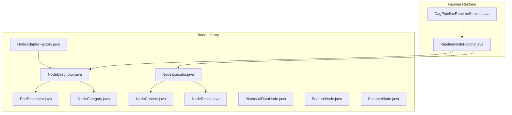
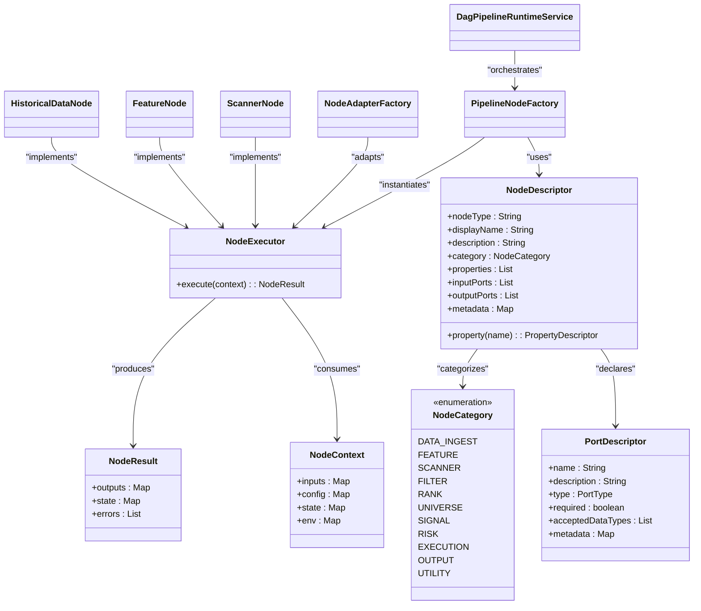
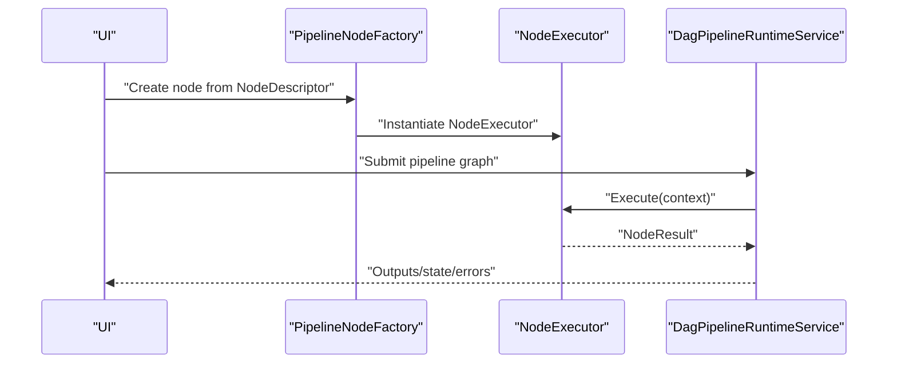
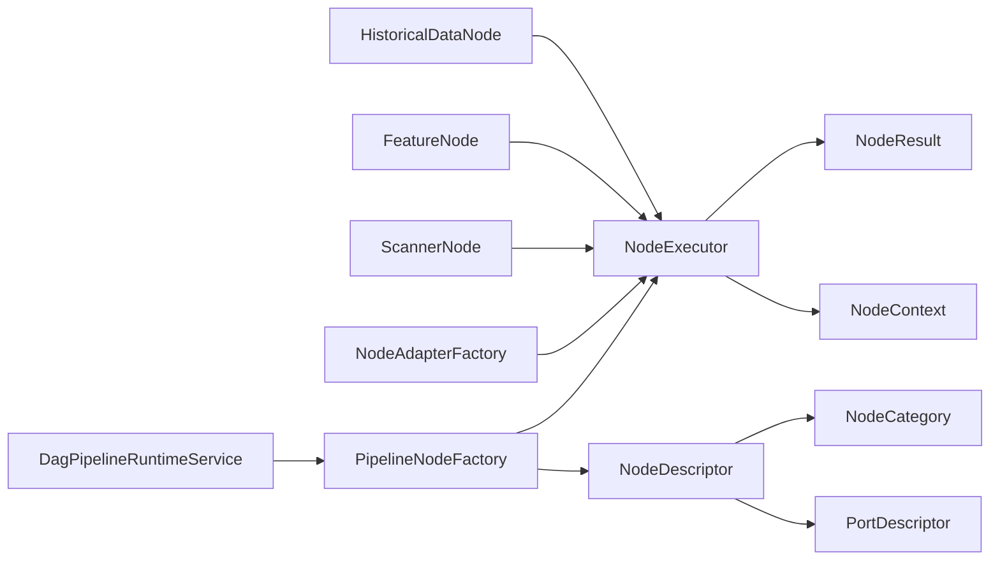
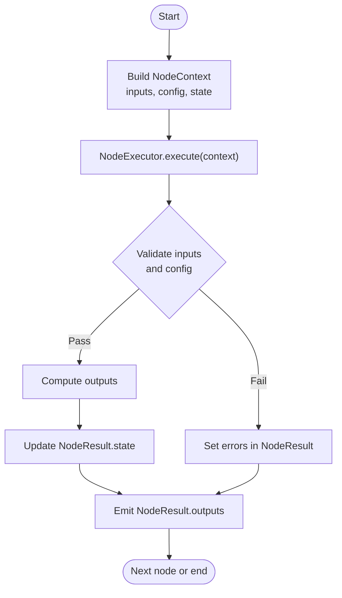

# Node Development Framework

<cite>
**Referenced Files in This Document**
- [NodeDescriptor.java](file://nodes/trade-node-library/src/main/java/com/tradej/node/NodeDescriptor.java)
- [PortDescriptor.java](file://nodes/trade-node-library/src/main/java/com/tradej/node/PortDescriptor.java)
- [NodeCategory.java](file://nodes/trade-node-library/src/main/java/com/tradej/node/NodeCategory.java)
- [NodeContext.java](file://nodes/trade-node-library/src/main/java/com/tradej/node/NodeContext.java)
- [NodeExecutor.java](file://nodes/trade-node-library/src/main/java/com/tradej/node/NodeExecutor.java)
- [NodeResult.java](file://nodes/trade-node-library/src/main/java/com/tradej/node/NodeResult.java)
- [HistoricalDataNode.java](file://nodes/trade-node-library/src/main/java/com/tradej/node/data/HistoricalDataNode.java)
- [FeatureNode.java](file://nodes/trade-node-library/src/main/java/com/tradej/node/feature/FeatureNode.java)
- [ScannerNode.java](file://nodes/trade-node-library/src/main/java/com/tradej/node/scanner/ScannerNode.java)
- [NodeAdapterFactory.java](file://nodes/trade-node-library/src/main/java/com/tradej/node/adapter/NodeAdapterFactory.java)
- [PipelineNodeFactory.java](file://pipeline/runtime/src/main/java/com/tradej/pipeline/service/PipelineNodeFactory.java)
- [DagPipelineRuntimeService.java](file://pipeline/runtime/src/main/java/com/tradej/pipeline/service/DagPipelineRuntimeService.java)
- [NodeDescriptorTest.java](file://nodes/trade-node-library/src/test/java/com/tradej/node/NodeDescriptorTest.java)
</cite>

## Table of Contents
1. [Introduction](#introduction)
2. [Project Structure](#project-structure)
3. [Core Components](#core-components)
4. [Architecture Overview](#architecture-overview)
5. [Detailed Component Analysis](#detailed-component-analysis)
6. [Dependency Analysis](#dependency-analysis)
7. [Performance Considerations](#performance-considerations)
8. [Troubleshooting Guide](#troubleshooting-guide)
9. [Conclusion](#conclusion)
10. [Appendices](#appendices)

## Introduction
This document describes the node development framework used to build self-describing pipeline nodes. It explains the node interface design, descriptor system, and executor architecture. It documents the node factory pattern, port descriptors, and node category classification. It details built-in node types (data nodes, feature nodes, scanner nodes), practical examples of custom node development, node registration, and inter-node communication. It also covers the node execution lifecycle, state management, error handling patterns, guidelines for specialized nodes, testing approaches, workflow integration, performance optimization, and debugging techniques.

## Project Structure
The node framework resides primarily under nodes/trade-node-library. It defines the core abstractions (descriptors, categories, ports, context, executor, results) and includes several built-in node implementations. Pipeline runtime integrates nodes via a factory and runtime service.

**Diagram sources**
- [NodeDescriptor.java:1-36](file://nodes/trade-node-library/src/main/java/com/tradej/node/NodeDescriptor.java#L1-L36)
- [PortDescriptor.java:1-30](file://nodes/trade-node-library/src/main/java/com/tradej/node/PortDescriptor.java#L1-L30)
- [NodeCategory.java:1-16](file://nodes/trade-node-library/src/main/java/com/tradej/node/NodeCategory.java#L1-L16)
- [NodeContext.java](file://nodes/trade-node-library/src/main/java/com/tradej/node/NodeContext.java)
- [NodeExecutor.java](file://nodes/trade-node-library/src/main/java/com/tradej/node/NodeExecutor.java)
- [NodeResult.java](file://nodes/trade-node-library/src/main/java/com/tradej/node/NodeResult.java)
- [NodeAdapterFactory.java](file://nodes/trade-node-library/src/main/java/com/tradej/node/adapter/NodeAdapterFactory.java)
- [HistoricalDataNode.java](file://nodes/trade-node-library/src/main/java/com/tradej/node/data/HistoricalDataNode.java)
- [FeatureNode.java](file://nodes/trade-node-library/src/main/java/com/tradej/node/feature/FeatureNode.java)
- [ScannerNode.java](file://nodes/trade-node-library/src/main/java/com/tradej/node/scanner/ScannerNode.java)
- [PipelineNodeFactory.java](file://pipeline/runtime/src/main/java/com/tradej/pipeline/service/PipelineNodeFactory.java)
- [DagPipelineRuntimeService.java](file://pipeline/runtime/src/main/java/com/tradej/pipeline/service/DagPipelineRuntimeService.java)

**Section sources**
- [NodeDescriptor.java:1-36](file://nodes/trade-node-library/src/main/java/com/tradej/node/NodeDescriptor.java#L1-L36)
- [PortDescriptor.java:1-30](file://nodes/trade-node-library/src/main/java/com/tradej/node/PortDescriptor.java#L1-L30)
- [NodeCategory.java:1-16](file://nodes/trade-node-library/src/main/java/com/tradej/node/NodeCategory.java#L1-L16)
- [NodeAdapterFactory.java](file://nodes/trade-node-library/src/main/java/com/tradej/node/adapter/NodeAdapterFactory.java)
- [PipelineNodeFactory.java](file://pipeline/runtime/src/main/java/com/tradej/pipeline/service/PipelineNodeFactory.java)
- [DagPipelineRuntimeService.java](file://pipeline/runtime/src/main/java/com/tradej/pipeline/service/DagPipelineRuntimeService.java)

## Core Components
- NodeDescriptor: Self-describing contract for every node type. Defines node type, display name, description, category, properties, input ports, output ports, and metadata. Includes a convenience method to retrieve a property by name.
- PortDescriptor: Declares a typed input or output port with name, description, type (single, multi, any), requirement flag, accepted data types, and metadata.
- NodeCategory: Enumerates broad categories such as DATA_INGEST, FEATURE, SCANNER, FILTER, RANK, UNIVERSE, SIGNAL, RISK, EXECUTION, OUTPUT, and UTILITY.
- NodeContext: Provides runtime context for node execution (inputs, configuration, state, and execution environment).
- NodeExecutor: Executes a node given a NodeContext and returns a NodeResult.
- NodeResult: Encapsulates execution outcomes, including emitted outputs, state updates, and error information.
- NodeAdapterFactory: Adapts external node implementations to the framework’s executor interface.
- Built-in Nodes: HistoricalDataNode (data ingestion), FeatureNode (feature computation), ScannerNode (screening/filtering).

Key responsibilities:
- Descriptor system decouples UI and runtime from node internals.
- PortDescriptor enforces type safety and connection compatibility.
- NodeExecutor abstracts execution lifecycle and state transitions.
- Factory and runtime integrate nodes into pipelines.

**Section sources**
- [NodeDescriptor.java:1-36](file://nodes/trade-node-library/src/main/java/com/tradej/node/NodeDescriptor.java#L1-L36)
- [PortDescriptor.java:1-30](file://nodes/trade-node-library/src/main/java/com/tradej/node/PortDescriptor.java#L1-L30)
- [NodeCategory.java:1-16](file://nodes/trade-node-library/src/main/java/com/tradej/node/NodeCategory.java#L1-L16)
- [NodeContext.java](file://nodes/trade-node-library/src/main/java/com/tradej/node/NodeContext.java)
- [NodeExecutor.java](file://nodes/trade-node-library/src/main/java/com/tradej/node/NodeExecutor.java)
- [NodeResult.java](file://nodes/trade-node-library/src/main/java/com/tradej/node/NodeResult.java)
- [NodeAdapterFactory.java](file://nodes/trade-node-library/src/main/java/com/tradej/node/adapter/NodeAdapterFactory.java)
- [HistoricalDataNode.java](file://nodes/trade-node-library/src/main/java/com/tradej/node/data/HistoricalDataNode.java)
- [FeatureNode.java](file://nodes/trade-node-library/src/main/java/com/tradej/node/feature/FeatureNode.java)
- [ScannerNode.java](file://nodes/trade-node-library/src/main/java/com/tradej/node/scanner/ScannerNode.java)

## Architecture Overview
The framework centers on self-describing nodes and a factory/runtime that orchestrates execution. Descriptors define node capabilities; adapters connect implementations; factories instantiate nodes; runtime services schedule and execute them.

**Diagram sources**
- [NodeDescriptor.java:1-36](file://nodes/trade-node-library/src/main/java/com/tradej/node/NodeDescriptor.java#L1-L36)
- [PortDescriptor.java:1-30](file://nodes/trade-node-library/src/main/java/com/tradej/node/PortDescriptor.java#L1-L30)
- [NodeCategory.java:1-16](file://nodes/trade-node-library/src/main/java/com/tradej/node/NodeCategory.java#L1-L16)
- [NodeContext.java](file://nodes/trade-node-library/src/main/java/com/tradej/node/NodeContext.java)
- [NodeExecutor.java](file://nodes/trade-node-library/src/main/java/com/tradej/node/NodeExecutor.java)
- [NodeResult.java](file://nodes/trade-node-library/src/main/java/com/tradej/node/NodeResult.java)
- [HistoricalDataNode.java](file://nodes/trade-node-library/src/main/java/com/tradej/node/data/HistoricalDataNode.java)
- [FeatureNode.java](file://nodes/trade-node-library/src/main/java/com/tradej/node/feature/FeatureNode.java)
- [ScannerNode.java](file://nodes/trade-node-library/src/main/java/com/tradej/node/scanner/ScannerNode.java)
- [NodeAdapterFactory.java](file://nodes/trade-node-library/src/main/java/com/tradej/node/adapter/NodeAdapterFactory.java)
- [PipelineNodeFactory.java](file://pipeline/runtime/src/main/java/com/tradej/pipeline/service/PipelineNodeFactory.java)
- [DagPipelineRuntimeService.java](file://pipeline/runtime/src/main/java/com/tradej/pipeline/service/DagPipelineRuntimeService.java)

## Detailed Component Analysis

### NodeDescriptor and PortDescriptor
- NodeDescriptor encapsulates the node identity and capabilities. It defensively copies collections and enforces non-null fields. It exposes a property lookup method for configuration retrieval.
- PortDescriptor declares input/output ports with type semantics (single vs multi vs any), requirement flags, accepted data types, and metadata. It also defensively copies internal collections.

Practical implications:
- UI can render configuration forms from descriptors without hardcoding.
- Runtime validates connections against accepted data types and port cardinality.

**Section sources**
- [NodeDescriptor.java:1-36](file://nodes/trade-node-library/src/main/java/com/tradej/node/NodeDescriptor.java#L1-L36)
- [PortDescriptor.java:1-30](file://nodes/trade-node-library/src/main/java/com/tradej/node/PortDescriptor.java#L1-L30)
- [NodeDescriptorTest.java:1-77](file://nodes/trade-node-library/src/test/java/com/tradej/node/NodeDescriptorTest.java#L1-L77)

### Node Category Classification
NodeCategory enumerates high-level categories enabling pipeline organization and filtering. Typical categories include DATA_INGEST, FEATURE, SCANNER, FILTER, RANK, UNIVERSE, SIGNAL, RISK, EXECUTION, OUTPUT, and UTILITY.

Usage guidance:
- Choose a category that aligns with the node’s primary responsibility.
- Categories inform UI grouping and pipeline topology validation.

**Section sources**
- [NodeCategory.java:1-16](file://nodes/trade-node-library/src/main/java/com/tradej/node/NodeCategory.java#L1-L16)

### NodeExecutor and NodeContext
- NodeExecutor defines the execution contract. Implementations receive a NodeContext and produce a NodeResult.
- NodeContext carries inputs, configuration, state, and environment. It enables deterministic execution and stateful transformations.

Execution lifecycle:
- Initialization: load configuration and state.
- Processing: transform inputs to outputs.
- State update: persist state changes.
- Error handling: propagate errors via NodeResult.

**Section sources**
- [NodeExecutor.java](file://nodes/trade-node-library/src/main/java/com/tradej/node/NodeExecutor.java)
- [NodeContext.java](file://nodes/trade-node-library/src/main/java/com/tradej/node/NodeContext.java)
- [NodeResult.java](file://nodes/trade-node-library/src/main/java/com/tradej/node/NodeResult.java)

### Built-in Node Types
- HistoricalDataNode: Data ingestion node for historical datasets. Typically emits time-series records conforming to accepted data types declared in output ports.
- FeatureNode: Computes derived features from upstream inputs. Validates input types and produces feature vectors or structured outputs.
- ScannerNode: Applies screening or filtering logic over input universes, emitting filtered sets aligned with output port declarations.

Integration pattern:
- Each built-in node provides a NodeDescriptor describing its capabilities.
- They implement NodeExecutor to process NodeContext and emit NodeResult.

**Section sources**
- [HistoricalDataNode.java](file://nodes/trade-node-library/src/main/java/com/tradej/node/data/HistoricalDataNode.java)
- [FeatureNode.java](file://nodes/trade-node-library/src/main/java/com/tradej/node/feature/FeatureNode.java)
- [ScannerNode.java](file://nodes/trade-node-library/src/main/java/com/tradej/node/scanner/ScannerNode.java)

### Node Factory Pattern and Registration
- NodeAdapterFactory adapts external node implementations to the NodeExecutor interface, enabling heterogeneous node types to coexist.
- PipelineNodeFactory consumes NodeDescriptor and NodeExecutor to instantiate nodes for a pipeline. It coordinates node creation and wiring.
- DagPipelineRuntimeService orchestrates node scheduling, execution, and inter-node communication.

Registration flow:
- Define NodeDescriptor for the node type.
- Implement NodeExecutor for execution logic.
- Register via PipelineNodeFactory so the runtime can construct and execute the node.

**Diagram sources**
- [NodeAdapterFactory.java](file://nodes/trade-node-library/src/main/java/com/tradej/node/adapter/NodeAdapterFactory.java)
- [PipelineNodeFactory.java](file://pipeline/runtime/src/main/java/com/tradej/pipeline/service/PipelineNodeFactory.java)
- [DagPipelineRuntimeService.java](file://pipeline/runtime/src/main/java/com/tradej/pipeline/service/DagPipelineRuntimeService.java)

**Section sources**
- [NodeAdapterFactory.java](file://nodes/trade-node-library/src/main/java/com/tradej/node/adapter/NodeAdapterFactory.java)
- [PipelineNodeFactory.java](file://pipeline/runtime/src/main/java/com/tradej/pipeline/service/PipelineNodeFactory.java)
- [DagPipelineRuntimeService.java](file://pipeline/runtime/src/main/java/com/tradej/pipeline/service/DagPipelineRuntimeService.java)

### Inter-Node Communication
Inter-node communication is governed by:
- PortDescriptor acceptance rules (types and cardinality).
- NodeResult outputs mapped to downstream inputs.
- NodeContext aggregation of upstream outputs and shared state.

Best practices:
- Align output port types with downstream input expectations.
- Use metadata to annotate ports for UI hints.
- Keep state minimal and explicit in NodeResult.state.

**Section sources**
- [PortDescriptor.java:1-30](file://nodes/trade-node-library/src/main/java/com/tradej/node/PortDescriptor.java#L1-L30)
- [NodeResult.java](file://nodes/trade-node-library/src/main/java/com/tradej/node/NodeResult.java)
- [NodeContext.java](file://nodes/trade-node-library/src/main/java/com/tradej/node/NodeContext.java)

### Node Execution Lifecycle and State Management
Lifecycle stages:
1. Creation: NodeDescriptor validated; NodeExecutor instantiated.
2. Initialization: NodeContext prepared with inputs, config, and initial state.
3. Execution: NodeExecutor.execute invoked; NodeResult produced.
4. State update: NodeResult.state merged into NodeContext for subsequent steps.
5. Completion: Outputs forwarded to downstream nodes; errors surfaced.

State management:
- Persist only necessary state in NodeResult.state.
- Use NodeContext.env for shared runtime environment.
- Treat NodeContext.inputs as immutable during a single execution tick.

**Section sources**
- [NodeExecutor.java](file://nodes/trade-node-library/src/main/java/com/tradej/node/NodeExecutor.java)
- [NodeResult.java](file://nodes/trade-node-library/src/main/java/com/tradej/node/NodeResult.java)
- [NodeContext.java](file://nodes/trade-node-library/src/main/java/com/tradej/node/NodeContext.java)

### Error Handling Patterns
- NodeResult.errors collects execution failures.
- Propagate errors early to prevent invalid state updates.
- Use descriptive messages and categorize errors for UI and logging.

Recommendations:
- Validate inputs and configuration in NodeExecutor.execute.
- Fail fast on incompatible port types.
- Log errors with context (node type, input keys, timestamps).

**Section sources**
- [NodeResult.java](file://nodes/trade-node-library/src/main/java/com/tradej/node/NodeResult.java)

### Practical Examples

#### Example: Custom Data Node
- Define NodeDescriptor with NodeCategory.DATA_INGEST, input ports for configuration, and output ports for historical records.
- Implement NodeExecutor to fetch and normalize data according to accepted types.
- Register via PipelineNodeFactory and wire into a pipeline.

#### Example: Custom Feature Node
- Define NodeDescriptor with NodeCategory.FEATURE, input ports for raw series, and output ports for computed features.
- Implement NodeExecutor to derive features and maintain minimal state.
- Validate input types and handle missing data gracefully.

#### Example: Custom Scanner Node
- Define NodeDescriptor with NodeCategory.SCANNER, input ports for universes and filters, and output ports for selected items.
- Implement NodeExecutor to apply selection criteria and emit filtered sets.

Registration and wiring:
- Expose NodeDescriptor statically or via a factory method.
- Provide NodeExecutor implementation.
- Use PipelineNodeFactory to create instances and DagPipelineRuntimeService to schedule execution.

**Section sources**
- [NodeDescriptor.java:1-36](file://nodes/trade-node-library/src/main/java/com/tradej/node/NodeDescriptor.java#L1-L36)
- [NodeExecutor.java](file://nodes/trade-node-library/src/main/java/com/tradej/node/NodeExecutor.java)
- [PipelineNodeFactory.java](file://pipeline/runtime/src/main/java/com/tradej/pipeline/service/PipelineNodeFactory.java)
- [DagPipelineRuntimeService.java](file://pipeline/runtime/src/main/java/com/tradej/pipeline/service/DagPipelineRuntimeService.java)

## Dependency Analysis
The node framework exhibits low coupling and high cohesion:
- NodeDescriptor depends on PortDescriptor and NodeCategory.
- NodeExecutor depends on NodeContext and produces NodeResult.
- Built-in nodes depend on NodeExecutor.
- Adapter and factory layers decouple implementations from runtime orchestration.

Potential risks:
- Circular dependencies are avoided by keeping descriptors immutable and executor stateless.
- PortDescriptor metadata and accepted types act as contracts preventing runtime mismatches.

**Diagram sources**
- [NodeDescriptor.java:1-36](file://nodes/trade-node-library/src/main/java/com/tradej/node/NodeDescriptor.java#L1-L36)
- [PortDescriptor.java:1-30](file://nodes/trade-node-library/src/main/java/com/tradej/node/PortDescriptor.java#L1-L30)
- [NodeCategory.java:1-16](file://nodes/trade-node-library/src/main/java/com/tradej/node/NodeCategory.java#L1-L16)
- [NodeExecutor.java](file://nodes/trade-node-library/src/main/java/com/tradej/node/NodeExecutor.java)
- [NodeContext.java](file://nodes/trade-node-library/src/main/java/com/tradej/node/NodeContext.java)
- [NodeResult.java](file://nodes/trade-node-library/src/main/java/com/tradej/node/NodeResult.java)
- [HistoricalDataNode.java](file://nodes/trade-node-library/src/main/java/com/tradej/node/data/HistoricalDataNode.java)
- [FeatureNode.java](file://nodes/trade-node-library/src/main/java/com/tradej/node/feature/FeatureNode.java)
- [ScannerNode.java](file://nodes/trade-node-library/src/main/java/com/tradej/node/scanner/ScannerNode.java)
- [NodeAdapterFactory.java](file://nodes/trade-node-library/src/main/java/com/tradej/node/adapter/NodeAdapterFactory.java)
- [PipelineNodeFactory.java](file://pipeline/runtime/src/main/java/com/tradej/pipeline/service/PipelineNodeFactory.java)
- [DagPipelineRuntimeService.java](file://pipeline/runtime/src/main/java/com/tradej/pipeline/service/DagPipelineRuntimeService.java)

**Section sources**
- [NodeDescriptor.java:1-36](file://nodes/trade-node-library/src/main/java/com/tradej/node/NodeDescriptor.java#L1-L36)
- [PortDescriptor.java:1-30](file://nodes/trade-node-library/src/main/java/com/tradej/node/PortDescriptor.java#L1-L30)
- [NodeCategory.java:1-16](file://nodes/trade-node-library/src/main/java/com/tradej/node/NodeCategory.java#L1-L16)
- [NodeExecutor.java](file://nodes/trade-node-library/src/main/java/com/tradej/node/NodeExecutor.java)
- [NodeContext.java](file://nodes/trade-node-library/src/main/java/com/tradej/node/NodeContext.java)
- [NodeResult.java](file://nodes/trade-node-library/src/main/java/com/tradej/node/NodeResult.java)
- [NodeAdapterFactory.java](file://nodes/trade-node-library/src/main/java/com/tradej/node/adapter/NodeAdapterFactory.java)
- [PipelineNodeFactory.java](file://pipeline/runtime/src/main/java/com/tradej/pipeline/service/PipelineNodeFactory.java)
- [DagPipelineRuntimeService.java](file://pipeline/runtime/src/main/java/com/tradej/pipeline/service/DagPipelineRuntimeService.java)

## Performance Considerations
- Minimize allocations in NodeExecutor.execute; reuse buffers and avoid deep copying.
- Keep NodeContext small; pass only necessary inputs and state.
- Use single-port semantics when possible to reduce branching overhead.
- Batch outputs where appropriate to reduce inter-node handoffs.
- Cache expensive computations in NodeResult.state and reuse across ticks.

[No sources needed since this section provides general guidance]

## Troubleshooting Guide
Common issues and resolutions:
- Type mismatch at port connections: Verify PortDescriptor.acceptedDataTypes match upstream outputs.
- Missing required ports: Ensure NodeContext.inputs satisfy PortDescriptor.required flags.
- Null or empty NodeDescriptor fields: Confirm defensive copying and non-null validation.
- Execution errors: Inspect NodeResult.errors and correlate with NodeContext inputs and configuration.

Testing tips:
- Unit-test NodeDescriptor construction and property lookup.
- Mock NodeContext and NodeResult to isolate NodeExecutor logic.
- Validate error propagation and state updates.

**Section sources**
- [NodeDescriptorTest.java:1-77](file://nodes/trade-node-library/src/test/java/com/tradej/node/NodeDescriptorTest.java#L1-L77)
- [NodeResult.java](file://nodes/trade-node-library/src/main/java/com/tradej/node/NodeResult.java)

## Conclusion
The node development framework provides a robust, self-describing foundation for building pipeline nodes. Its descriptor-driven design, strict port typing, and factory/runtime integration enable scalable, testable, and maintainable node ecosystems. By adhering to the patterns outlined here—clear descriptors, disciplined executors, and careful state management—you can develop specialized nodes, compose complex workflows, and optimize performance while ensuring reliable error handling and debugging.

[No sources needed since this section summarizes without analyzing specific files]

## Appendices

### Appendix A: Node Execution Flow

[No sources needed since this diagram shows conceptual workflow, not actual code structure]