# Pipeline Graph Compiler

<cite>
**Referenced Files in This Document**
- [GraphNormalizer.java](file://pipeline/core/src/main/java/com/tradej/pipeline/compiler/GraphNormalizer.java)
- [GraphCompiler.java](file://pipeline/core/src/main/java/com/tradej/pipeline/runtime/GraphCompiler.java)
- [GraphRuntime.java](file://pipeline/core/src/main/java/com/tradej/pipeline/runtime/GraphRuntime.java)
- [PipelineGraph.java](file://pipeline/core/src/main/java/com/tradej/pipeline/graph/PipelineGraph.java)
- [PipelineNodeDef.java](file://pipeline/core/src/main/java/com/tradej/pipeline/graph/PipelineNodeDef.java)
- [PipelineEdgeDef.java](file://pipeline/core/src/main/java/com/tradej/pipeline/graph/PipelineEdgeDef.java)
- [PipelineGraphValidator.java](file://pipeline/core/src/main/java/com/tradej/pipeline/graph/PipelineGraphValidator.java)
- [IngressNodeConfig.java](file://pipeline/core/src/main/java/com/tradej/pipeline/graph/IngressNodeConfig.java)
- [PipelineExecutionMode.java](file://pipeline/core/src/main/java/com/tradej/pipeline/graph/PipelineExecutionMode.java)
- [NodeRegistry.java](file://pipeline/core/src/main/java/com/tradej/pipeline/registry/NodeRegistry.java)
- [NodeTypeDescriptor.java](file://pipeline/core/src/main/java/com/tradej/pipeline/registry/NodeTypeDescriptor.java)
- [DagPipelineRuntimeService.java](file://pipeline/runtime/src/main/java/com/tradej/pipeline/service/DagPipelineRuntimeService.java)
- [DagPipelineInstance.java](file://pipeline/runtime/src/main/java/com/tradej/pipeline/service/DagPipelineInstance.java)
- [DagPipelineIngressBridge.java](file://pipeline/runtime/src/main/java/com/tradej/pipeline/service/DagPipelineIngressBridge.java)
- [PipelineNodeFactory.java](file://pipeline/runtime/src/main/java/com/tradej/pipeline/service/PipelineNodeFactory.java)
- [PipelineCompileContexts.java](file://pipeline/runtime/src/main/java/com/tradej/pipeline/service/PipelineCompileContexts.java)
- [PipelineRuntimeBridge.java](file://pipeline/core/src/main/java/com/tradej/pipeline/runtime/PipelineRuntimeBridge.java)
- [PipelineContext.java](file://pipeline/core/src/main/java/com/tradej/pipeline/runtime/PipelineContext.java)
- [ExecutionPlan.java](file://pipeline/core/src/main/java/com/tradej/pipeline/runtime/ExecutionPlan.java)
- [BasePipelineNode.java](file://pipeline/core/src/main/java/com/tradej/pipeline/runtime/BasePipelineNode.java)
- [ReactivePipelineNode.java](file://pipeline/core/src/main/java/com/tradej/pipeline/runtime/ReactivePipelineNode.java)
- [NodeMetrics.java](file://pipeline/core/src/main/java/com/tradej/pipeline/runtime/NodeMetrics.java)
- [PartitionedNode.java](file://pipeline/core/src/main/java/com/tradej/pipeline/runtime/PartitionedNode.java)
- [PipelineNodeTypes.java](file://pipeline/core/src/main/java/com/tradej/pipeline/runtime/PipelineNodeTypes.java)
- [PipelineRuntime.java](file://pipeline/core/src/main/java/com/tradej/pipeline/runtime/PipelineRuntime.java)
- [PipelineRuntimeService.java](file://pipeline/runtime/src/main/java/com/tradej/pipeline/service/PipelineRuntimeService.java)
- [PipelineNode.java](file://pipeline/core/src/main/java/com/tradej/pipeline/runtime/PipelineNode.java)
- [PipelineDefinition.java](file://pipeline/platform/trade-pipeline-platform/src/main/java/com/tradej/pipeline/platform/PipelineDefinition.java)
- [PipelineTemplate.java](file://pipeline/platform/trade-pipeline-platform/src/main/java/com/tradej/pipeline/platform/PipelineTemplate.java)
- [PipelineSnapshot.java](file://pipeline/platform/trade-pipeline-platform/src/main/java/com/tradej/pipeline/platform/PipelineSnapshot.java)
- [PipelineTemplateService.java](file://pipeline/platform/trade-pipeline-platform/src/main/java/com/tradej/pipeline/platform/PipelineTemplateService.java)
- [PipelineType.java](file://pipeline/platform/trade-pipeline-platform/src/main/java/com/tradej/pipeline/platform/PipelineType.java)
- [PipelineVersion.java](file://pipeline/platform/trade-pipeline-platform/src/main/java/com/tradej/pipeline/platform/PipelineVersion.java)
- [DuckDbPipelineGraphStore.java](file://data/persistence/src/main/java/com/tradej/persistence/pipeline/DuckDbPipelineGraphStore.java)
- [GraphStrategyPlugin.java](file://trading/strategy/src/main/java/com/tradej/strategy/api/GraphStrategyPlugin.java)
- [GraphStrategySandbox.java](file://trading/strategy/src/main/java/com/tradej/strategy/service/GraphStrategySandbox.java)
- [GraphPipelineDisruptorHandler.java](file://runtime/disruptor/src/main/java/com/tradej/disruptor/config/GraphPipelineDisruptorHandler.java)
- [GraphStrategyDisruptorHandler.java](file://runtime/disruptor/src/main/java/com/tradej/disruptor/config/GraphStrategyDisruptorHandler.java)
</cite>

## Table of Contents
1. [Introduction](#introduction)
2. [Project Structure](#project-structure)
3. [Core Components](#core-components)
4. [Architecture Overview](#architecture-overview)
5. [Detailed Component Analysis](#detailed-component-analysis)
6. [Dependency Analysis](#dependency-analysis)
7. [Performance Considerations](#performance-considerations)
8. [Troubleshooting Guide](#troubleshooting-guide)
9. [Conclusion](#conclusion)
10. [Appendices](#appendices)

## Introduction
This document describes the pipeline graph compiler and normalization system. It explains how pipeline graphs are represented, how nodes and edges are defined, and how normalization, validation, and compilation transform a user-defined graph into an executable runtime. It also documents the validator, execution modes, ingress node configuration, integration with the runtime engine, node registry, and execution planning. Practical examples, debugging guidelines, and optimization recommendations are included to help developers construct, validate, compile, and operate robust pipeline graphs.

## Project Structure
The pipeline subsystem is organized into three primary areas:
- Core graph model and compiler: graph definitions, normalization, validation, and compilation/runtime
- Runtime services: orchestration of graph execution, ingress bridging, and factory-based node instantiation
- Platform abstractions: pipeline templates, snapshots, and type/version metadata for lifecycle management

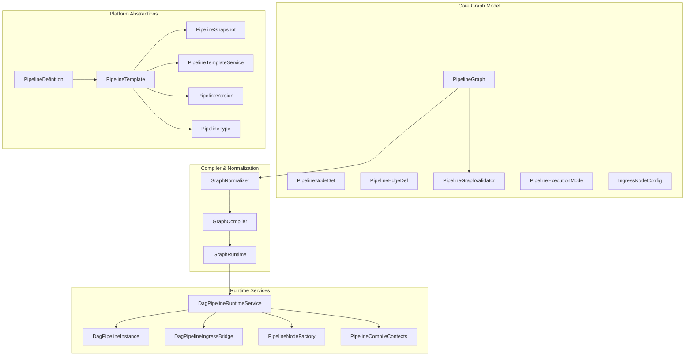

**Diagram sources**
- [PipelineGraph.java:1-200](file://pipeline/core/src/main/java/com/tradej/pipeline/graph/PipelineGraph.java#L1-L200)
- [PipelineNodeDef.java:1-200](file://pipeline/core/src/main/java/com/tradej/pipeline/graph/PipelineNodeDef.java#L1-L200)
- [PipelineEdgeDef.java:1-200](file://pipeline/core/src/main/java/com/tradej/pipeline/graph/PipelineEdgeDef.java#L1-L200)
- [PipelineGraphValidator.java:1-200](file://pipeline/core/src/main/java/com/tradej/pipeline/graph/PipelineGraphValidator.java#L1-L200)
- [PipelineExecutionMode.java:1-200](file://pipeline/core/src/main/java/com/tradej/pipeline/graph/PipelineExecutionMode.java#L1-L200)
- [IngressNodeConfig.java:1-200](file://pipeline/core/src/main/java/com/tradej/pipeline/graph/IngressNodeConfig.java#L1-L200)
- [GraphNormalizer.java:1-200](file://pipeline/core/src/main/java/com/tradej/pipeline/compiler/GraphNormalizer.java#L1-L200)
- [GraphCompiler.java:1-200](file://pipeline/core/src/main/java/com/tradej/pipeline/runtime/GraphCompiler.java#L1-L200)
- [GraphRuntime.java:1-200](file://pipeline/core/src/main/java/com/tradej/pipeline/runtime/GraphRuntime.java#L1-L200)
- [DagPipelineRuntimeService.java:1-200](file://pipeline/runtime/src/main/java/com/tradej/pipeline/service/DagPipelineRuntimeService.java#L1-L200)
- [DagPipelineInstance.java:1-200](file://pipeline/runtime/src/main/java/com/tradej/pipeline/service/DagPipelineInstance.java#L1-L200)
- [DagPipelineIngressBridge.java:1-200](file://pipeline/runtime/src/main/java/com/tradej/pipeline/service/DagPipelineIngressBridge.java#L1-L200)
- [PipelineNodeFactory.java:1-200](file://pipeline/runtime/src/main/java/com/tradej/pipeline/service/PipelineNodeFactory.java#L1-L200)
- [PipelineCompileContexts.java:1-200](file://pipeline/runtime/src/main/java/com/tradej/pipeline/service/PipelineCompileContexts.java#L1-L200)
- [PipelineDefinition.java:1-200](file://pipeline/platform/trade-pipeline-platform/src/main/java/com/tradej/pipeline/platform/PipelineDefinition.java#L1-L200)
- [PipelineTemplate.java:1-200](file://pipeline/platform/trade-pipeline-platform/src/main/java/com/tradej/pipeline/platform/PipelineTemplate.java#L1-L200)
- [PipelineSnapshot.java:1-200](file://pipeline/platform/trade-pipeline-platform/src/main/java/com/tradej/pipeline/platform/PipelineSnapshot.java#L1-L200)
- [PipelineTemplateService.java:1-200](file://pipeline/platform/trade-pipeline-platform/src/main/java/com/tradej/pipeline/platform/PipelineTemplateService.java#L1-L200)
- [PipelineVersion.java:1-200](file://pipeline/platform/trade-pipeline-platform/src/main/java/com/tradej/pipeline/platform/PipelineVersion.java#L1-L200)
- [PipelineType.java:1-200](file://pipeline/platform/trade-pipeline-platform/src/main/java/com/tradej/pipeline/platform/PipelineType.java#L1-L200)

**Section sources**
- [PipelineGraph.java:1-200](file://pipeline/core/src/main/java/com/tradej/pipeline/graph/PipelineGraph.java#L1-L200)
- [GraphNormalizer.java:1-200](file://pipeline/core/src/main/java/com/tradej/pipeline/compiler/GraphNormalizer.java#L1-L200)
- [GraphCompiler.java:1-200](file://pipeline/core/src/main/java/com/tradej/pipeline/runtime/GraphCompiler.java#L1-L200)
- [DagPipelineRuntimeService.java:1-200](file://pipeline/runtime/src/main/java/com/tradej/pipeline/service/DagPipelineRuntimeService.java#L1-L200)

## Core Components
This section introduces the central building blocks of the pipeline graph system.

- PipelineGraph: Encapsulates nodes, edges, and metadata that define the computation DAG. It provides adjacency and traversal primitives for downstream compiler and runtime.
- PipelineNodeDef: Describes a single node’s identity, ports, configuration, and type. It is the atomic unit of computation in the graph.
- PipelineEdgeDef: Defines directed connections between nodes, including port mappings and optional filters or transforms.
- PipelineGraphValidator: Enforces structural and semantic rules (acyclicity, port compatibility, missing dependencies, etc.) to ensure a valid DAG.
- PipelineExecutionMode: Execution semantics (e.g., real-time vs. backtest) that influence scheduling and node behavior.
- IngressNodeConfig: Defines the initial ingestion behavior for incoming data streams into the pipeline.
- GraphNormalizer: Transforms raw graph definitions into normalized form, resolving defaults, canonicalizing types, and preparing for validation.
- GraphCompiler: Converts a validated, normalized graph into a compiled representation suitable for runtime execution.
- GraphRuntime: Executes compiled graphs, managing node lifecycles, scheduling, and metrics.
- Runtime Services: Orchestrate graph lifecycle, instance management, ingress bridging, and node factory creation.
- Platform Abstractions: Provide template, snapshot, and versioning constructs for pipeline lifecycle management.

**Section sources**
- [PipelineGraph.java:1-200](file://pipeline/core/src/main/java/com/tradej/pipeline/graph/PipelineGraph.java#L1-L200)
- [PipelineNodeDef.java:1-200](file://pipeline/core/src/main/java/com/tradej/pipeline/graph/PipelineNodeDef.java#L1-L200)
- [PipelineEdgeDef.java:1-200](file://pipeline/core/src/main/java/com/tradej/pipeline/graph/PipelineEdgeDef.java#L1-L200)
- [PipelineGraphValidator.java:1-200](file://pipeline/core/src/main/java/com/tradej/pipeline/graph/PipelineGraphValidator.java#L1-L200)
- [PipelineExecutionMode.java:1-200](file://pipeline/core/src/main/java/com/tradej/pipeline/graph/PipelineExecutionMode.java#L1-L200)
- [IngressNodeConfig.java:1-200](file://pipeline/core/src/main/java/com/tradej/pipeline/graph/IngressNodeConfig.java#L1-L200)
- [GraphNormalizer.java:1-200](file://pipeline/core/src/main/java/com/tradej/pipeline/compiler/GraphNormalizer.java#L1-L200)
- [GraphCompiler.java:1-200](file://pipeline/core/src/main/java/com/tradej/pipeline/runtime/GraphCompiler.java#L1-L200)
- [GraphRuntime.java:1-200](file://pipeline/core/src/main/java/com/tradej/pipeline/runtime/GraphRuntime.java#L1-L200)

## Architecture Overview
The pipeline system follows a layered architecture:
- Model Layer: Graph definitions and descriptors
- Validation Layer: Structural and semantic checks
- Compilation Layer: Normalization and compilation to executable form
- Runtime Layer: Execution orchestration and node lifecycle management
- Platform Layer: Lifecycle and metadata management

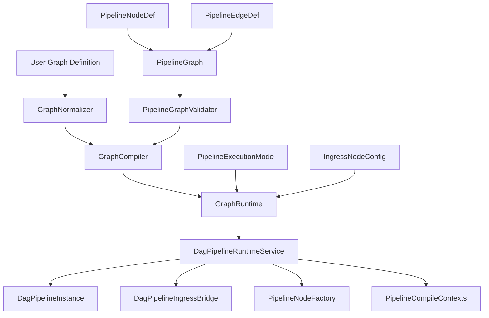

**Diagram sources**
- [GraphNormalizer.java:1-200](file://pipeline/core/src/main/java/com/tradej/pipeline/compiler/GraphNormalizer.java#L1-L200)
- [GraphCompiler.java:1-200](file://pipeline/core/src/main/java/com/tradej/pipeline/runtime/GraphCompiler.java#L1-L200)
- [GraphRuntime.java:1-200](file://pipeline/core/src/main/java/com/tradej/pipeline/runtime/GraphRuntime.java#L1-L200)
- [DagPipelineRuntimeService.java:1-200](file://pipeline/runtime/src/main/java/com/tradej/pipeline/service/DagPipelineRuntimeService.java#L1-L200)
- [DagPipelineInstance.java:1-200](file://pipeline/runtime/src/main/java/com/tradej/pipeline/service/DagPipelineInstance.java#L1-L200)
- [DagPipelineIngressBridge.java:1-200](file://pipeline/runtime/src/main/java/com/tradej/pipeline/service/DagPipelineIngressBridge.java#L1-L200)
- [PipelineNodeFactory.java:1-200](file://pipeline/runtime/src/main/java/com/tradej/pipeline/service/PipelineNodeFactory.java#L1-L200)
- [PipelineCompileContexts.java:1-200](file://pipeline/runtime/src/main/java/com/tradej/pipeline/service/PipelineCompileContexts.java#L1-L200)
- [PipelineGraphValidator.java:1-200](file://pipeline/core/src/main/java/com/tradej/pipeline/graph/PipelineGraphValidator.java#L1-L200)
- [PipelineGraph.java:1-200](file://pipeline/core/src/main/java/com/tradej/pipeline/graph/PipelineGraph.java#L1-L200)
- [PipelineNodeDef.java:1-200](file://pipeline/core/src/main/java/com/tradej/pipeline/graph/PipelineNodeDef.java#L1-L200)
- [PipelineEdgeDef.java:1-200](file://pipeline/core/src/main/java/com/tradej/pipeline/graph/PipelineEdgeDef.java#L1-L200)
- [PipelineExecutionMode.java:1-200](file://pipeline/core/src/main/java/com/tradej/pipeline/graph/PipelineExecutionMode.java#L1-L200)
- [IngressNodeConfig.java:1-200](file://pipeline/core/src/main/java/com/tradej/pipeline/graph/IngressNodeConfig.java#L1-L200)

## Detailed Component Analysis

### Graph Representation and Definitions
- PipelineGraph: Central container holding nodes and edges, with helpers for adjacency, topological traversal, and connectivity checks.
- PipelineNodeDef: Captures node identity, category, ports, and configuration. It is the anchor for node registry resolution and factory instantiation.
- PipelineEdgeDef: Encodes directed edges with port-to-port mapping and optional attributes influencing data flow.
- PipelineExecutionMode: Influences runtime scheduling and node behavior (e.g., backtest vs. live).
- IngressNodeConfig: Configures initial ingestion behavior for stream-based inputs.

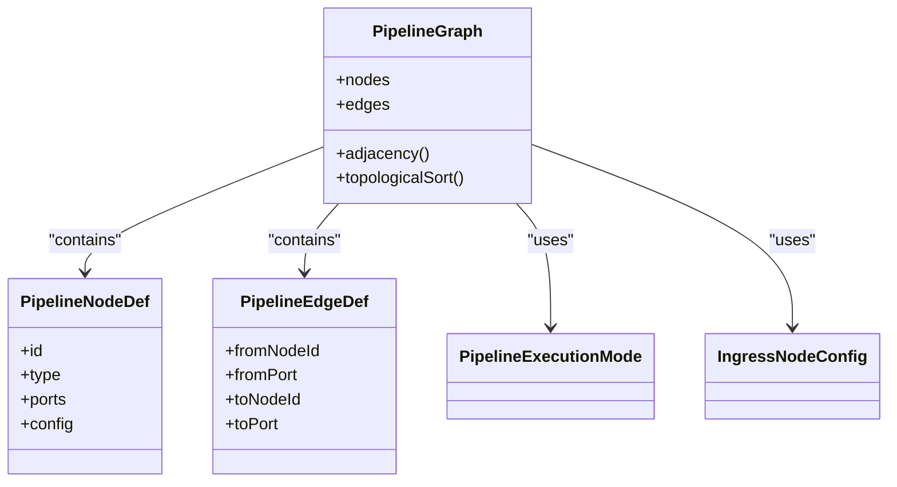

**Diagram sources**
- [PipelineGraph.java:1-200](file://pipeline/core/src/main/java/com/tradej/pipeline/graph/PipelineGraph.java#L1-L200)
- [PipelineNodeDef.java:1-200](file://pipeline/core/src/main/java/com/tradej/pipeline/graph/PipelineNodeDef.java#L1-L200)
- [PipelineEdgeDef.java:1-200](file://pipeline/core/src/main/java/com/tradej/pipeline/graph/PipelineEdgeDef.java#L1-L200)
- [PipelineExecutionMode.java:1-200](file://pipeline/core/src/main/java/com/tradej/pipeline/graph/PipelineExecutionMode.java#L1-L200)
- [IngressNodeConfig.java:1-200](file://pipeline/core/src/main/java/com/tradej/pipeline/graph/IngressNodeConfig.java#L1-L200)

**Section sources**
- [PipelineGraph.java:1-200](file://pipeline/core/src/main/java/com/tradej/pipeline/graph/PipelineGraph.java#L1-L200)
- [PipelineNodeDef.java:1-200](file://pipeline/core/src/main/java/com/tradej/pipeline/graph/PipelineNodeDef.java#L1-L200)
- [PipelineEdgeDef.java:1-200](file://pipeline/core/src/main/java/com/tradej/pipeline/graph/PipelineEdgeDef.java#L1-L200)
- [PipelineExecutionMode.java:1-200](file://pipeline/core/src/main/java/com/tradej/pipeline/graph/PipelineExecutionMode.java#L1-L200)
- [IngressNodeConfig.java:1-200](file://pipeline/core/src/main/java/com/tradej/pipeline/graph/IngressNodeConfig.java#L1-L200)

### Graph Normalization Process
Normalization prepares the graph for validation and compilation by:
- Resolving defaults for node configurations
- Canonicalizing types and identifiers
- Ensuring consistent edge port mappings
- Preparing execution mode and ingress settings

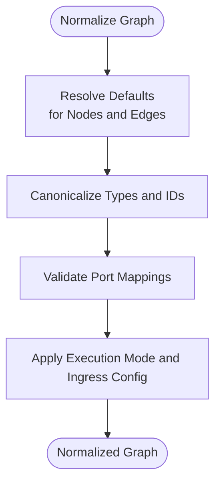

**Diagram sources**
- [GraphNormalizer.java:1-200](file://pipeline/core/src/main/java/com/tradej/pipeline/compiler/GraphNormalizer.java#L1-L200)
- [PipelineNodeDef.java:1-200](file://pipeline/core/src/main/java/com/tradej/pipeline/graph/PipelineNodeDef.java#L1-L200)
- [PipelineEdgeDef.java:1-200](file://pipeline/core/src/main/java/com/tradej/pipeline/graph/PipelineEdgeDef.java#L1-L200)
- [PipelineExecutionMode.java:1-200](file://pipeline/core/src/main/java/com/tradej/pipeline/graph/PipelineExecutionMode.java#L1-L200)
- [IngressNodeConfig.java:1-200](file://pipeline/core/src/main/java/com/tradej/pipeline/graph/IngressNodeConfig.java#L1-L200)

**Section sources**
- [GraphNormalizer.java:1-200](file://pipeline/core/src/main/java/com/tradej/pipeline/compiler/GraphNormalizer.java#L1-L200)

### Graph Validation Rules
Validation ensures the graph is a valid DAG and adheres to semantic constraints:
- Acyclicity: No cycles in the computed DAG
- Port compatibility: Edge port mappings must match node port definitions
- Connectivity: All nodes reachable from ingress; no orphaned nodes
- Configuration completeness: Required node parameters present and valid

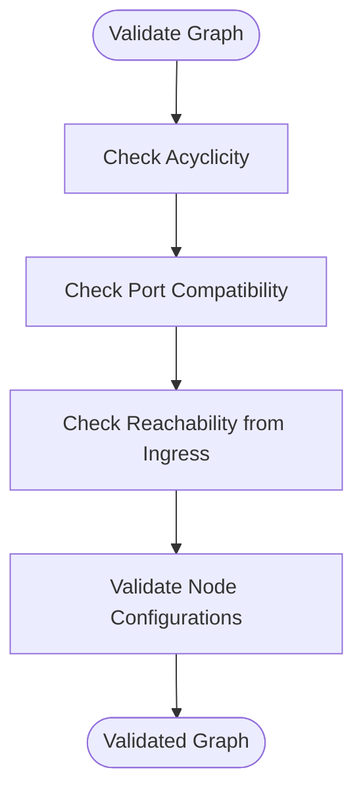

**Diagram sources**
- [PipelineGraphValidator.java:1-200](file://pipeline/core/src/main/java/com/tradej/pipeline/graph/PipelineGraphValidator.java#L1-L200)
- [PipelineGraph.java:1-200](file://pipeline/core/src/main/java/com/tradej/pipeline/graph/PipelineGraph.java#L1-L200)
- [PipelineNodeDef.java:1-200](file://pipeline/core/src/main/java/com/tradej/pipeline/graph/PipelineNodeDef.java#L1-L200)
- [PipelineEdgeDef.java:1-200](file://pipeline/core/src/main/java/com/tradej/pipeline/graph/PipelineEdgeDef.java#L1-L200)
- [IngressNodeConfig.java:1-200](file://pipeline/core/src/main/java/com/tradej/pipeline/graph/IngressNodeConfig.java#L1-L200)

**Section sources**
- [PipelineGraphValidator.java:1-200](file://pipeline/core/src/main/java/com/tradej/pipeline/graph/PipelineGraphValidator.java#L1-L200)

### Compilation Pipeline
Compilation converts a validated, normalized graph into an executable form:
- Build execution plan: Topological ordering, partitioning, and scheduling decisions
- Instantiate nodes: Using the node registry and factory
- Prepare runtime contexts: Compile-time settings and metrics

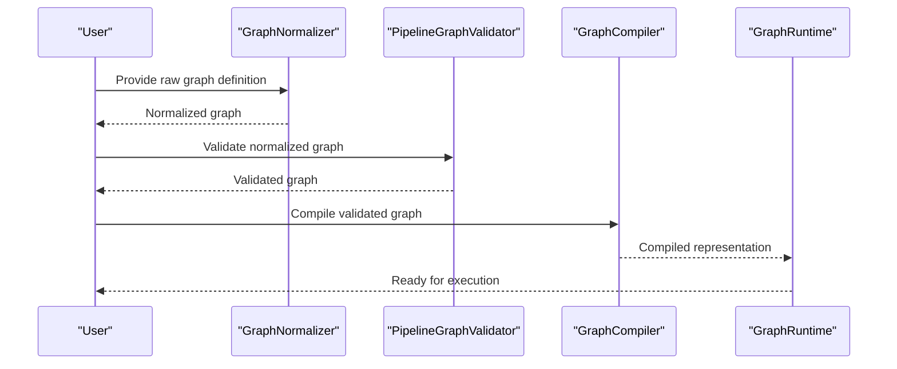

**Diagram sources**
- [GraphNormalizer.java:1-200](file://pipeline/core/src/main/java/com/tradej/pipeline/compiler/GraphNormalizer.java#L1-L200)
- [PipelineGraphValidator.java:1-200](file://pipeline/core/src/main/java/com/tradej/pipeline/graph/PipelineGraphValidator.java#L1-L200)
- [GraphCompiler.java:1-200](file://pipeline/core/src/main/java/com/tradej/pipeline/runtime/GraphCompiler.java#L1-L200)
- [GraphRuntime.java:1-200](file://pipeline/core/src/main/java/com/tradej/pipeline/runtime/GraphRuntime.java#L1-L200)

**Section sources**
- [GraphCompiler.java:1-200](file://pipeline/core/src/main/java/com/tradej/pipeline/runtime/GraphCompiler.java#L1-L200)
- [GraphRuntime.java:1-200](file://pipeline/core/src/main/java/com/tradej/pipeline/runtime/GraphRuntime.java#L1-L200)

### Execution Mode Handling
Execution mode influences runtime behavior:
- Real-time mode: Low-latency, reactive scheduling
- Backtest mode: Deterministic replay with synthetic timestamps and fill modeling
- Strategy sandbox: Controlled environment for strategy development and testing

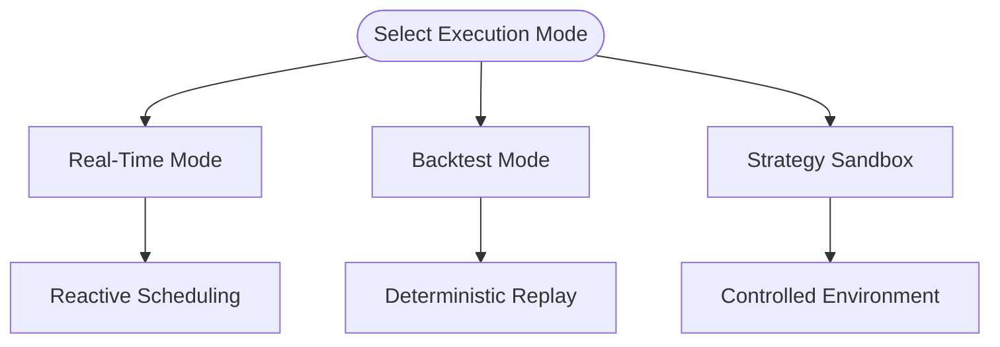

**Diagram sources**
- [PipelineExecutionMode.java:1-200](file://pipeline/core/src/main/java/com/tradej/pipeline/graph/PipelineExecutionMode.java#L1-L200)
- [GraphRuntime.java:1-200](file://pipeline/core/src/main/java/com/tradej/pipeline/runtime/GraphRuntime.java#L1-L200)
- [GraphStrategySandbox.java:1-200](file://trading/strategy/src/main/java/com/tradej/strategy/service/GraphStrategySandbox.java#L1-L200)

**Section sources**
- [PipelineExecutionMode.java:1-200](file://pipeline/core/src/main/java/com/tradej/pipeline/graph/PipelineExecutionMode.java#L1-L200)
- [GraphRuntime.java:1-200](file://pipeline/core/src/main/java/com/tradej/pipeline/runtime/GraphRuntime.java#L1-L200)

### Ingress Node Configuration
Ingress defines how external data enters the pipeline:
- Stream source selection
- Initial port bindings
- Timestamp and watermark handling
- Filtering and pre-processing rules

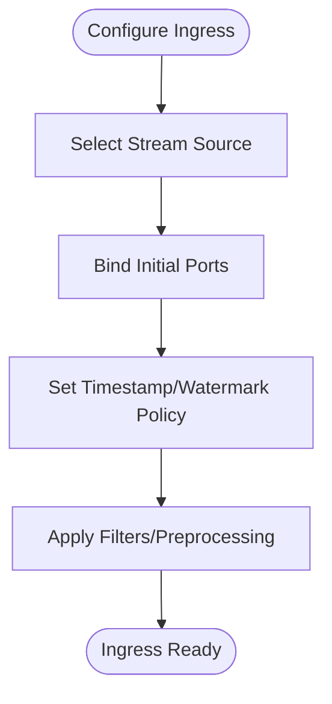

**Diagram sources**
- [IngressNodeConfig.java:1-200](file://pipeline/core/src/main/java/com/tradej/pipeline/graph/IngressNodeConfig.java#L1-L200)
- [DagPipelineIngressBridge.java:1-200](file://pipeline/runtime/src/main/java/com/tradej/pipeline/service/DagPipelineIngressBridge.java#L1-L200)

**Section sources**
- [IngressNodeConfig.java:1-200](file://pipeline/core/src/main/java/com/tradej/pipeline/graph/IngressNodeConfig.java#L1-L200)
- [DagPipelineIngressBridge.java:1-200](file://pipeline/runtime/src/main/java/com/tradej/pipeline/service/DagPipelineIngressBridge.java#L1-L200)

### Node Registry and Factory
The node registry and factory enable dynamic node instantiation:
- NodeRegistry: Maintains node type descriptors and discovery mechanisms
- NodeTypeDescriptor: Encapsulates metadata for node types
- PipelineNodeFactory: Creates node instances from descriptors and configurations
- PipelineRuntimeBridge: Bridges runtime services to node execution

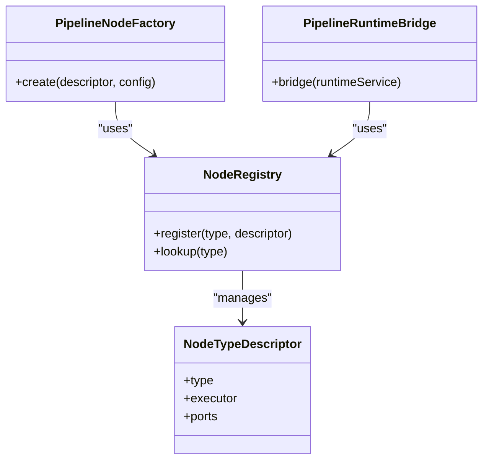

**Diagram sources**
- [NodeRegistry.java:1-200](file://pipeline/core/src/main/java/com/tradej/pipeline/registry/NodeRegistry.java#L1-L200)
- [NodeTypeDescriptor.java:1-200](file://pipeline/core/src/main/java/com/tradej/pipeline/registry/NodeTypeDescriptor.java#L1-L200)
- [PipelineNodeFactory.java:1-200](file://pipeline/runtime/src/main/java/com/tradej/pipeline/service/PipelineNodeFactory.java#L1-L200)
- [PipelineRuntimeBridge.java:1-200](file://pipeline/core/src/main/java/com/tradej/pipeline/runtime/PipelineRuntimeBridge.java#L1-L200)

**Section sources**
- [NodeRegistry.java:1-200](file://pipeline/core/src/main/java/com/tradej/pipeline/registry/NodeRegistry.java#L1-L200)
- [NodeTypeDescriptor.java:1-200](file://pipeline/core/src/main/java/com/tradej/pipeline/registry/NodeTypeDescriptor.java#L1-L200)
- [PipelineNodeFactory.java:1-200](file://pipeline/runtime/src/main/java/com/tradej/pipeline/service/PipelineNodeFactory.java#L1-L200)
- [PipelineRuntimeBridge.java:1-200](file://pipeline/core/src/main/java/com/tradej/pipeline/runtime/PipelineRuntimeBridge.java#L1-L200)

### Execution Planning and Runtime
Execution planning determines how nodes are scheduled and executed:
- ExecutionPlan: Encapsulates scheduling, partitioning, and resource allocation
- GraphRuntime: Manages node lifecycles, metrics, and state
- BasePipelineNode and ReactivePipelineNode: Base classes for node implementations
- PartitionedNode: Supports partition-aware execution
- PipelineNodeTypes: Enumerates supported node types
- PipelineRuntimeService: Coordinates runtime services

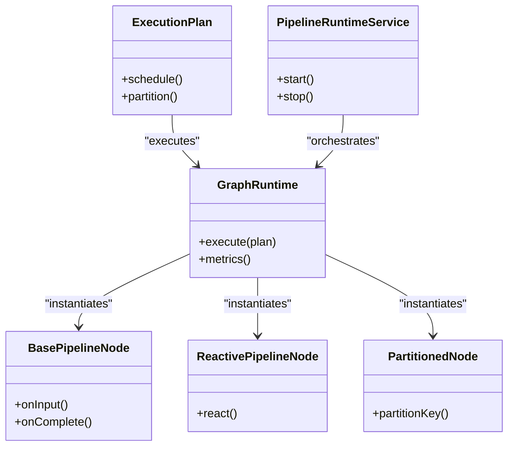

**Diagram sources**
- [ExecutionPlan.java:1-200](file://pipeline/core/src/main/java/com/tradej/pipeline/runtime/ExecutionPlan.java#L1-L200)
- [GraphRuntime.java:1-200](file://pipeline/core/src/main/java/com/tradej/pipeline/runtime/GraphRuntime.java#L1-L200)
- [BasePipelineNode.java:1-200](file://pipeline/core/src/main/java/com/tradej/pipeline/runtime/BasePipelineNode.java#L1-L200)
- [ReactivePipelineNode.java:1-200](file://pipeline/core/src/main/java/com/tradej/pipeline/runtime/ReactivePipelineNode.java#L1-L200)
- [PartitionedNode.java:1-200](file://pipeline/core/src/main/java/com/tradej/pipeline/runtime/PartitionedNode.java#L1-L200)
- [PipelineRuntimeService.java:1-200](file://pipeline/runtime/src/main/java/com/tradej/pipeline/service/PipelineRuntimeService.java#L1-L200)

**Section sources**
- [ExecutionPlan.java:1-200](file://pipeline/core/src/main/java/com/tradej/pipeline/runtime/ExecutionPlan.java#L1-L200)
- [GraphRuntime.java:1-200](file://pipeline/core/src/main/java/com/tradej/pipeline/runtime/GraphRuntime.java#L1-L200)
- [BasePipelineNode.java:1-200](file://pipeline/core/src/main/java/com/tradej/pipeline/runtime/BasePipelineNode.java#L1-L200)
- [ReactivePipelineNode.java:1-200](file://pipeline/core/src/main/java/com/tradej/pipeline/runtime/ReactivePipelineNode.java#L1-L200)
- [PartitionedNode.java:1-200](file://pipeline/core/src/main/java/com/tradej/pipeline/runtime/PartitionedNode.java#L1-L200)
- [PipelineRuntimeService.java:1-200](file://pipeline/runtime/src/main/java/com/tradej/pipeline/service/PipelineRuntimeService.java#L1-L200)

### Platform Abstractions and Lifecycle Management
Platform abstractions provide lifecycle and metadata management:
- PipelineDefinition: High-level pipeline definition
- PipelineTemplate and PipelineSnapshot: Template and snapshot constructs
- PipelineTemplateService: Manages templates and snapshot operations
- PipelineVersion and PipelineType: Versioning and type metadata

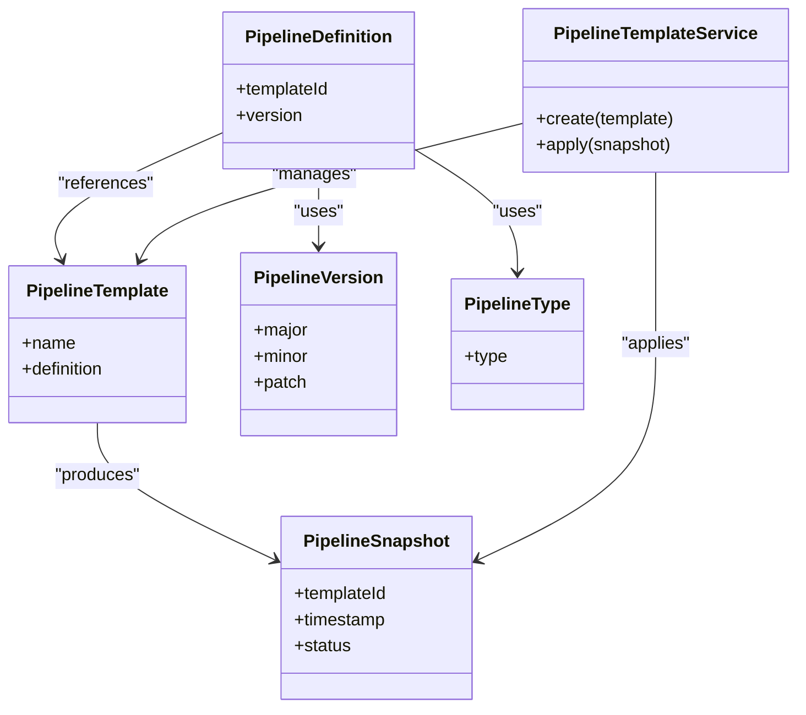

**Diagram sources**
- [PipelineDefinition.java:1-200](file://pipeline/platform/trade-pipeline-platform/src/main/java/com/tradej/pipeline/platform/PipelineDefinition.java#L1-L200)
- [PipelineTemplate.java:1-200](file://pipeline/platform/trade-pipeline-platform/src/main/java/com/tradej/pipeline/platform/PipelineTemplate.java#L1-L200)
- [PipelineSnapshot.java:1-200](file://pipeline/platform/trade-pipeline-platform/src/main/java/com/tradej/pipeline/platform/PipelineSnapshot.java#L1-L200)
- [PipelineTemplateService.java:1-200](file://pipeline/platform/trade-pipeline-platform/src/main/java/com/tradej/pipeline/platform/PipelineTemplateService.java#L1-L200)
- [PipelineVersion.java:1-200](file://pipeline/platform/trade-pipeline-platform/src/main/java/com/tradej/pipeline/platform/PipelineVersion.java#L1-L200)
- [PipelineType.java:1-200](file://pipeline/platform/trade-pipeline-platform/src/main/java/com/tradej/pipeline/platform/PipelineType.java#L1-L200)

**Section sources**
- [PipelineDefinition.java:1-200](file://pipeline/platform/trade-pipeline-platform/src/main/java/com/tradej/pipeline/platform/PipelineDefinition.java#L1-L200)
- [PipelineTemplate.java:1-200](file://pipeline/platform/trade-pipeline-platform/src/main/java/com/tradej/pipeline/platform/PipelineTemplate.java#L1-L200)
- [PipelineSnapshot.java:1-200](file://pipeline/platform/trade-pipeline-platform/src/main/java/com/tradej/pipeline/platform/PipelineSnapshot.java#L1-L200)
- [PipelineTemplateService.java:1-200](file://pipeline/platform/trade-pipeline-platform/src/main/java/com/tradej/pipeline/platform/PipelineTemplateService.java#L1-L200)
- [PipelineVersion.java:1-200](file://pipeline/platform/trade-pipeline-platform/src/main/java/com/tradej/pipeline/platform/PipelineVersion.java#L1-L200)
- [PipelineType.java:1-200](file://pipeline/platform/trade-pipeline-platform/src/main/java/com/tradej/pipeline/platform/PipelineType.java#L1-L200)

### Practical Examples

#### Example 1: Constructing a Graph
- Define nodes using PipelineNodeDef with appropriate ports and configuration
- Connect nodes using PipelineEdgeDef with matching port mappings
- Set execution mode via PipelineExecutionMode
- Configure ingress using IngressNodeConfig

**Section sources**
- [PipelineNodeDef.java:1-200](file://pipeline/core/src/main/java/com/tradej/pipeline/graph/PipelineNodeDef.java#L1-L200)
- [PipelineEdgeDef.java:1-200](file://pipeline/core/src/main/java/com/tradej/pipeline/graph/PipelineEdgeDef.java#L1-L200)
- [PipelineExecutionMode.java:1-200](file://pipeline/core/src/main/java/com/tradej/pipeline/graph/PipelineExecutionMode.java#L1-L200)
- [IngressNodeConfig.java:1-200](file://pipeline/core/src/main/java/com/tradej/pipeline/graph/IngressNodeConfig.java#L1-L200)

#### Example 2: Validation Testing
- Use PipelineGraphValidator to validate a constructed graph
- Verify acyclicity, port compatibility, reachability, and configuration completeness

**Section sources**
- [PipelineGraphValidator.java:1-200](file://pipeline/core/src/main/java/com/tradej/pipeline/graph/PipelineGraphValidator.java#L1-L200)

#### Example 3: Compilation Optimization
- Normalize the graph using GraphNormalizer to resolve defaults and canonicalize types
- Compile using GraphCompiler to produce an optimized ExecutionPlan
- Use PartitionedNode and ExecutionPlan to distribute load across partitions

**Section sources**
- [GraphNormalizer.java:1-200](file://pipeline/core/src/main/java/com/tradej/pipeline/compiler/GraphNormalizer.java#L1-L200)
- [GraphCompiler.java:1-200](file://pipeline/core/src/main/java/com/tradej/pipeline/runtime/GraphCompiler.java#L1-L200)
- [ExecutionPlan.java:1-200](file://pipeline/core/src/main/java/com/tradej/pipeline/runtime/ExecutionPlan.java#L1-L200)
- [PartitionedNode.java:1-200](file://pipeline/core/src/main/java/com/tradej/pipeline/runtime/PartitionedNode.java#L1-L200)

#### Example 4: Runtime Integration
- Initialize DagPipelineRuntimeService and create a DagPipelineInstance
- Bridge ingress via DagPipelineIngressBridge
- Instantiate nodes using PipelineNodeFactory and NodeRegistry
- Monitor execution via NodeMetrics and PipelineRuntimeBridge

**Section sources**
- [DagPipelineRuntimeService.java:1-200](file://pipeline/runtime/src/main/java/com/tradej/pipeline/service/DagPipelineRuntimeService.java#L1-L200)
- [DagPipelineInstance.java:1-200](file://pipeline/runtime/src/main/java/com/tradej/pipeline/service/DagPipelineInstance.java#L1-L200)
- [DagPipelineIngressBridge.java:1-200](file://pipeline/runtime/src/main/java/com/tradej/pipeline/service/DagPipelineIngressBridge.java#L1-L200)
- [PipelineNodeFactory.java:1-200](file://pipeline/runtime/src/main/java/com/tradej/pipeline/service/PipelineNodeFactory.java#L1-L200)
- [NodeMetrics.java:1-200](file://pipeline/core/src/main/java/com/tradej/pipeline/runtime/NodeMetrics.java#L1-L200)
- [PipelineRuntimeBridge.java:1-200](file://pipeline/core/src/main/java/com/tradej/pipeline/runtime/PipelineRuntimeBridge.java#L1-L200)

## Dependency Analysis
The pipeline system exhibits layered dependencies:
- Model layer depends on validation and normalization
- Compiler depends on normalization and validation
- Runtime depends on compiler output and registry/factory
- Platform layer depends on template and snapshot services

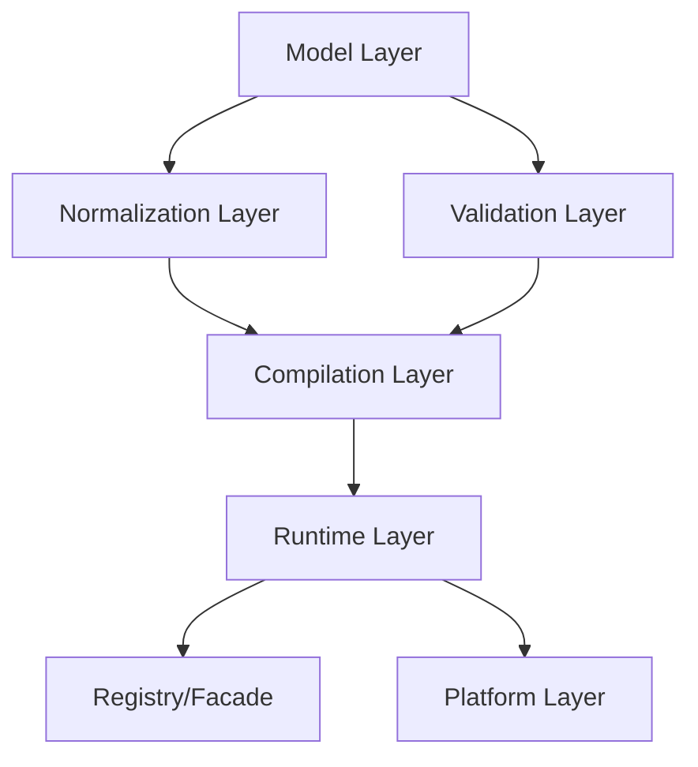

**Diagram sources**
- [PipelineGraph.java:1-200](file://pipeline/core/src/main/java/com/tradej/pipeline/graph/PipelineGraph.java#L1-L200)
- [PipelineGraphValidator.java:1-200](file://pipeline/core/src/main/java/com/tradej/pipeline/graph/PipelineGraphValidator.java#L1-L200)
- [GraphNormalizer.java:1-200](file://pipeline/core/src/main/java/com/tradej/pipeline/compiler/GraphNormalizer.java#L1-L200)
- [GraphCompiler.java:1-200](file://pipeline/core/src/main/java/com/tradej/pipeline/runtime/GraphCompiler.java#L1-L200)
- [GraphRuntime.java:1-200](file://pipeline/core/src/main/java/com/tradej/pipeline/runtime/GraphRuntime.java#L1-L200)
- [NodeRegistry.java:1-200](file://pipeline/core/src/main/java/com/tradej/pipeline/registry/NodeRegistry.java#L1-L200)
- [PipelineNodeFactory.java:1-200](file://pipeline/runtime/src/main/java/com/tradej/pipeline/service/PipelineNodeFactory.java#L1-L200)
- [PipelineTemplateService.java:1-200](file://pipeline/platform/trade-pipeline-platform/src/main/java/com/tradej/pipeline/platform/PipelineTemplateService.java#L1-L200)

**Section sources**
- [PipelineGraph.java:1-200](file://pipeline/core/src/main/java/com/tradej/pipeline/graph/PipelineGraph.java#L1-L200)
- [GraphNormalizer.java:1-200](file://pipeline/core/src/main/java/com/tradej/pipeline/compiler/GraphNormalizer.java#L1-L200)
- [GraphCompiler.java:1-200](file://pipeline/core/src/main/java/com/tradej/pipeline/runtime/GraphCompiler.java#L1-L200)
- [GraphRuntime.java:1-200](file://pipeline/core/src/main/java/com/tradej/pipeline/runtime/GraphRuntime.java#L1-L200)
- [NodeRegistry.java:1-200](file://pipeline/core/src/main/java/com/tradej/pipeline/registry/NodeRegistry.java#L1-L200)
- [PipelineNodeFactory.java:1-200](file://pipeline/runtime/src/main/java/com/tradej/pipeline/service/PipelineNodeFactory.java#L1-L200)
- [PipelineTemplateService.java:1-200](file://pipeline/platform/trade-pipeline-platform/src/main/java/com/tradej/pipeline/platform/PipelineTemplateService.java#L1-L200)

## Performance Considerations
- Prefer normalized graphs to reduce validation overhead
- Use partition-aware nodes to scale horizontally
- Minimize redundant edges and optimize port mappings
- Leverage backtest fill modeling for deterministic performance tuning
- Monitor node metrics to identify bottlenecks

[No sources needed since this section provides general guidance]

## Troubleshooting Guide
Common issues and resolutions:
- Validation failures: Check acyclicity and port compatibility; ensure all nodes are reachable from ingress
- Compilation errors: Verify normalized graph correctness and node type descriptors
- Runtime stalls: Inspect node metrics and partition distribution
- Ingress misconfiguration: Confirm stream source selection and port bindings

**Section sources**
- [PipelineGraphValidator.java:1-200](file://pipeline/core/src/main/java/com/tradej/pipeline/graph/PipelineGraphValidator.java#L1-L200)
- [GraphCompiler.java:1-200](file://pipeline/core/src/main/java/com/tradej/pipeline/runtime/GraphCompiler.java#L1-L200)
- [NodeMetrics.java:1-200](file://pipeline/core/src/main/java/com/tradej/pipeline/runtime/NodeMetrics.java#L1-L200)

## Conclusion
The pipeline graph compiler and normalization system provides a robust framework for constructing, validating, compiling, and executing data pipelines. By leveraging normalized graph definitions, strict validation rules, and efficient runtime orchestration, teams can build scalable and maintainable pipeline systems. Extending the system involves adding new node types via the registry, integrating new execution modes, and enhancing platform abstractions for lifecycle management.

[No sources needed since this section summarizes without analyzing specific files]

## Appendices

### Integration with Runtime Engine and Disruptor
- GraphPipelineDisruptorHandler and GraphStrategyDisruptorHandler integrate pipeline execution with the disruptor event processing model for high-throughput scenarios.

**Section sources**
- [GraphPipelineDisruptorHandler.java:1-200](file://runtime/disruptor/src/main/java/com/tradej/disruptor/config/GraphPipelineDisruptorHandler.java#L1-L200)
- [GraphStrategyDisruptorHandler.java:1-200](file://runtime/disruptor/src/main/java/com/tradej/disruptor/config/GraphStrategyDisruptorHandler.java#L1-L200)

### Persistence and Storage
- DuckDbPipelineGraphStore persists pipeline graphs for auditing and replay.

**Section sources**
- [DuckDbPipelineGraphStore.java:1-200](file://data/persistence/src/main/java/com/tradej/persistence/pipeline/DuckDbPipelineGraphStore.java#L1-L200)

### Strategy Plugins and Sandboxing
- GraphStrategyPlugin and GraphStrategySandbox enable strategy development and controlled testing environments.

**Section sources**
- [GraphStrategyPlugin.java:1-200](file://trading/strategy/src/main/java/com/tradej/strategy/api/GraphStrategyPlugin.java#L1-L200)
- [GraphStrategySandbox.java:1-200](file://trading/strategy/src/main/java/com/tradej/strategy/service/GraphStrategySandbox.java#L1-L200)