# Pipeline Platform Management

<cite>
**Referenced Files in This Document**
- [PipelineCatalogService.java](file://pipeline/platform/trade-pipeline-platform/src/main/java/com/tradej/pipeline/platform/catalog/PipelineCatalogService.java)
- [PipelineStore.java](file://pipeline/platform/trade-pipeline-platform/src/main/java/com/tradej/pipeline/platform/catalog/PipelineStore.java)
- [PipelineTemplateService.java](file://pipeline/platform/trade-pipeline-platform/src/main/java/com/tradej/pipeline/platform/PipelineTemplateService.java)
- [PipelineTemplate.java](file://pipeline/platform/trade-pipeline-platform/src/main/java/com/tradej/pipeline/platform/PipelineTemplate.java)
- [PipelineVersion.java](file://pipeline/platform/trade-pipeline-platform/src/main/java/com/tradej/pipeline/platform/PipelineVersion.java)
- [PipelineDefinition.java](file://pipeline/platform/trade-pipeline-platform/src/main/java/com/tradej/pipeline/platform/PipelineDefinition.java)
- [PipelineSnapshot.java](file://pipeline/platform/trade-pipeline-platform/src/main/java/com/tradej/pipeline/platform/PipelineSnapshot.java)
- [PipelineStatus.java](file://pipeline/platform/trade-pipeline-platform/src/main/java/com/tradej/pipeline/platform/PipelineStatus.java)
- [PipelineType.java](file://pipeline/platform/trade-pipeline-platform/src/main/java/com/tradej/pipeline/platform/PipelineType.java)
- [PipelineExecution.java](file://pipeline/platform/trade-pipeline-platform/src/main/java/com/tradej/pipeline/platform/model/PipelineExecution.java)
- [PipelineExecutionStatus.java](file://pipeline/platform/trade-pipeline-platform/src/main/java/com/tradej/pipeline/platform/model/PipelineExecutionStatus.java)
- [PipelineGraph.java](file://pipeline/core/src/main/java/com/tradej/pipeline/graph/PipelineGraph.java)
- [PipelineGraphValidator.java](file://pipeline/core/src/main/java/com/tradej/pipeline/graph/PipelineGraphValidator.java)
- [PipelineRuntimeService.java](file://pipeline/runtime/src/main/java/com/tradej/pipeline/service/PipelineRuntimeService.java)
- [DagPipelineRuntimeService.java](file://pipeline/runtime/src/main/java/com/tradej/pipeline/service/DagPipelineRuntimeService.java)
- [DagPipelineInstance.java](file://pipeline/runtime/src/main/java/com/tradej/pipeline/service/DagPipelineInstance.java)
- [DuckDbPipelineGraphStore.java](file://data/persistence/src/main/java/com/tradej/persistence/pipeline/DuckDbPipelineGraphStore.java)
- [InMemoryStateStore.java](file://pipeline/core/src/main/java/com/tradej/pipeline/state/InMemoryStateStore.java)
- [PipelineRuntime.java](file://pipeline/core/src/main/java/com/tradej/pipeline/runtime/PipelineRuntime.java)
- [PipelineContext.java](file://pipeline/core/src/main/java/com/tradej/pipeline/runtime/PipelineContext.java)
- [BasePipelineNode.java](file://pipeline/core/src/main/java/com/tradej/pipeline/runtime/BasePipelineNode.java)
- [ReactorBridge.java](file://pipeline/core/src/main/java/com/tradej/pipeline/reactor/ReactorBridge.java)
- [ReactorBridgeMetrics.java](file://pipeline/runtime/src/main/java/com/tradej/pipeline/service/reactor/ReactorBridgeMetrics.java)
- [PipelineCompileContexts.java](file://pipeline/runtime/src/main/java/com/tradej/pipeline/service/PipelineCompileContexts.java)
- [PipelineNodeFactory.java](file://pipeline/runtime/src/main/java/com/tradej/pipeline/service/PipelineNodeFactory.java)
- [PipelineNodeTypes.java](file://pipeline/core/src/main/java/com/tradej/pipeline/runtime/PipelineNodeTypes.java)
- [NodeMetrics.java](file://pipeline/core/src/main/java/com/tradej/pipeline/runtime/NodeMetrics.java)
- [NodeState.java](file://pipeline/core/src/main/java/com/tradej/pipeline/runtime/NodeState.java)
- [ExecutionPlan.java](file://pipeline/core/src/main/java/com/tradej/pipeline/runtime/ExecutionPlan.java)
- [GraphCompiler.java](file://pipeline/core/src/main/java/com/tradej/pipeline/runtime/GraphCompiler.java)
- [GraphRuntime.java](file://pipeline/core/src/main/java/com/tradej/pipeline/runtime/GraphRuntime.java)
- [IngressNode.java](file://pipeline/core/src/main/java/com/tradej/pipeline/runtime/IngressNode.java)
- [ReactivePipelineNode.java](file://pipeline/core/src/main/java/com/tradej/pipeline/runtime/ReactivePipelineNode.java)
- [PartitionedNode.java](file://pipeline/core/src/main/java/com/tradej/pipeline/runtime/PartitionedNode.java)
- [PipelineNode.java](file://pipeline/core/src/main/java/com/tradej/pipeline/runtime/PipelineNode.java)
- [DagPipelineIngressBridge.java](file://pipeline/runtime/src/main/java/com/tradej/pipeline/service/DagPipelineIngressBridge.java)
- [PipelineNodeDescriptor.java](file://nodes/trade-node-library/src/main/java/com/tradej/node/NodeDescriptor.java)
- [PortDescriptor.java](file://nodes/trade-node-library/src/main/java/com/tradej/node/PortDescriptor.java)
- [NodeContext.java](file://nodes/trade-node-library/src/main/java/com/tradej/node/NodeContext.java)
- [NodeExecutor.java](file://nodes/trade-node-library/src/main/java/com/tradej/node/NodeExecutor.java)
- [NodeResult.java](file://nodes/trade-node-library/src/main/java/com/tradej/node/NodeResult.java)
- [PipelineNodeParityComponentTest.java](file://app/src/test/java/com/tradej/app/pipeline/PipelineNodeParityComponentTest.java)
- [ReplayMarketTickParityTest.java](file://app/src/test/java/com/tradej/app/pipeline/ReplayMarketTickParityTest.java)
- [PipelineCompileRoutingTest.java](file://app/src/test/java/com/tradej/app/pipeline/PipelineCompileRoutingTest.java)
- [DagPipelineIngressTest.java](file://app/src/test/java/com/tradej/app/pipeline/DagPipelineIngressTest.java)
- [PipelineCatalogServiceTest.java](file://pipeline/platform/trade-pipeline-platform/src/test/java/com/tradej/pipeline/platform/catalog/PipelineCatalogServiceTest.java)
- [PipelineTemplateServiceTest.java](file://pipeline/platform/trade-pipeline-platform/src/test/java/com/tradej/pipeline/platform/PipelineTemplateServiceTest.java)
- [PipelineVersionTest.java](file://pipeline/platform/trade-pipeline-platform/src/test/java/com/tradej/pipeline/platform/PipelineVersionTest.java)
- [PipelineVersionUnitTest.java](file://pipeline/platform/trade-pipeline-platform/src/test/java/com/tradej/pipeline/platform/PipelineVersionUnitTest.java)
- [PipelineTemplateTest.java](file://pipeline/platform/trade-pipeline-platform/src/test/java/com/tradej/pipeline/platform/PipelineTemplateTest.java)
- [PropertyDescriptorUnitTest.java](file://pipeline/platform/trade-pipeline-platform/src/test/java/com/tradej/pipeline/platform/model/PropertyDescriptorUnitTest.java)
</cite>

## Table of Contents
1. [Introduction](#introduction)
2. [Project Structure](#project-structure)
3. [Core Components](#core-components)
4. [Architecture Overview](#architecture-overview)
5. [Detailed Component Analysis](#detailed-component-analysis)
6. [Dependency Analysis](#dependency-analysis)
7. [Performance Considerations](#performance-considerations)
8. [Troubleshooting Guide](#troubleshooting-guide)
9. [Conclusion](#conclusion)
10. [Appendices](#appendices)

## Introduction
This document describes the pipeline platform management system, focusing on the pipeline definition model, execution tracking, and catalog services. It documents the pipeline template system, version management, and property descriptors. It also covers execution status tracking, snapshot management, template validation rules, integration with the pipeline runtime service, state stores, and execution contexts. Practical examples illustrate pipeline definition creation, execution monitoring, and template development. Finally, it provides guidelines for lifecycle management, debugging execution issues, and optimizing pipeline performance.

## Project Structure
The pipeline platform spans three primary areas:
- Platform models and catalog services: definition, snapshot, status, type, version, and template management
- Core runtime and graph compilation: graph representation, validation, execution planning, and node execution
- Runtime orchestration: DAG runtime service, ingress bridges, and compile-time contexts

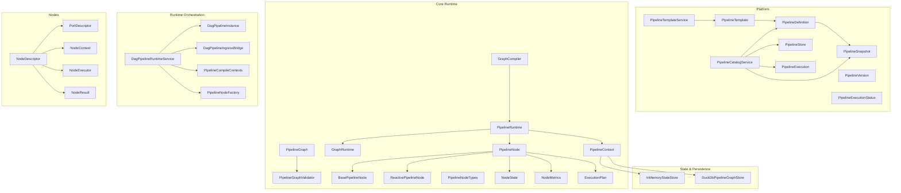

**Diagram sources**
- [PipelineCatalogService.java:1-242](file://pipeline/platform/trade-pipeline-platform/src/main/java/com/tradej/pipeline/platform/catalog/PipelineCatalogService.java#L1-L242)
- [PipelineTemplateService.java:1-97](file://pipeline/platform/trade-pipeline-platform/src/main/java/com/tradej/pipeline/platform/PipelineTemplateService.java#L1-L97)
- [PipelineTemplate.java:46-66](file://pipeline/platform/trade-pipeline-platform/src/main/java/com/tradej/pipeline/platform/PipelineTemplate.java#L46-L66)
- [PipelineVersion.java:1-45](file://pipeline/platform/trade-pipeline-platform/src/main/java/com/tradej/pipeline/platform/PipelineVersion.java#L1-L45)
- [PipelineDefinition.java](file://pipeline/platform/trade-pipeline-platform/src/main/java/com/tradej/pipeline/platform/PipelineDefinition.java)
- [PipelineSnapshot.java](file://pipeline/platform/trade-pipeline-platform/src/main/java/com/tradej/pipeline/platform/PipelineSnapshot.java)
- [PipelineExecution.java](file://pipeline/platform/trade-pipeline-platform/src/main/java/com/tradej/pipeline/platform/model/PipelineExecution.java)
- [PipelineExecutionStatus.java](file://pipeline/platform/trade-pipeline-platform/src/main/java/com/tradej/pipeline/platform/model/PipelineExecutionStatus.java)
- [PipelineGraph.java](file://pipeline/core/src/main/java/com/tradej/pipeline/graph/PipelineGraph.java)
- [PipelineGraphValidator.java](file://pipeline/core/src/main/java/com/tradej/pipeline/graph/PipelineGraphValidator.java)
- [GraphCompiler.java](file://pipeline/core/src/main/java/com/tradej/pipeline/runtime/GraphCompiler.java)
- [GraphRuntime.java](file://pipeline/core/src/main/java/com/tradej/pipeline/runtime/GraphRuntime.java)
- [PipelineRuntime.java](file://pipeline/core/src/main/java/com/tradej/pipeline/runtime/PipelineRuntime.java)
- [PipelineContext.java](file://pipeline/core/src/main/java/com/tradej/pipeline/runtime/PipelineContext.java)
- [BasePipelineNode.java](file://pipeline/core/src/main/java/com/tradej/pipeline/runtime/BasePipelineNode.java)
- [ReactivePipelineNode.java](file://pipeline/core/src/main/java/com/tradej/pipeline/runtime/ReactivePipelineNode.java)
- [PipelineNodeTypes.java](file://pipeline/core/src/main/java/com/tradej/pipeline/runtime/PipelineNodeTypes.java)
- [NodeState.java](file://pipeline/core/src/main/java/com/tradej/pipeline/runtime/NodeState.java)
- [NodeMetrics.java](file://pipeline/core/src/main/java/com/tradej/pipeline/runtime/NodeMetrics.java)
- [ExecutionPlan.java](file://pipeline/core/src/main/java/com/tradej/pipeline/runtime/ExecutionPlan.java)
- [DagPipelineRuntimeService.java](file://pipeline/runtime/src/main/java/com/tradej/pipeline/service/DagPipelineRuntimeService.java)
- [DagPipelineInstance.java](file://pipeline/runtime/src/main/java/com/tradej/pipeline/service/DagPipelineInstance.java)
- [DagPipelineIngressBridge.java](file://pipeline/runtime/src/main/java/com/tradej/pipeline/service/DagPipelineIngressBridge.java)
- [PipelineCompileContexts.java](file://pipeline/runtime/src/main/java/com/tradej/pipeline/service/PipelineCompileContexts.java)
- [PipelineNodeFactory.java](file://pipeline/runtime/src/main/java/com/tradej/pipeline/service/PipelineNodeFactory.java)
- [InMemoryStateStore.java](file://pipeline/core/src/main/java/com/tradej/pipeline/state/InMemoryStateStore.java)
- [DuckDbPipelineGraphStore.java](file://data/persistence/src/main/java/com/tradej/persistence/pipeline/DuckDbPipelineGraphStore.java)
- [PipelineNodeDescriptor.java](file://nodes/trade-node-library/src/main/java/com/tradej/node/NodeDescriptor.java)
- [PortDescriptor.java](file://nodes/trade-node-library/src/main/java/com/tradej/node/PortDescriptor.java)
- [NodeContext.java](file://nodes/trade-node-library/src/main/java/com/tradej/node/NodeContext.java)
- [NodeExecutor.java](file://nodes/trade-node-library/src/main/java/com/tradej/node/NodeExecutor.java)
- [NodeResult.java](file://nodes/trade-node-library/src/main/java/com/tradej/node/NodeResult.java)

**Section sources**
- [PipelineCatalogService.java:1-242](file://pipeline/platform/trade-pipeline-platform/src/main/java/com/tradej/pipeline/platform/catalog/PipelineCatalogService.java#L1-L242)
- [PipelineTemplateService.java:1-97](file://pipeline/platform/trade-pipeline-platform/src/main/java/com/tradej/pipeline/platform/PipelineTemplateService.java#L1-L97)
- [PipelineTemplate.java:46-66](file://pipeline/platform/trade-pipeline-platform/src/main/java/com/tradej/pipeline/platform/PipelineTemplate.java#L46-L66)
- [PipelineVersion.java:1-45](file://pipeline/platform/trade-pipeline-platform/src/main/java/com/tradej/pipeline/platform/PipelineVersion.java#L1-L45)
- [PipelineDefinition.java](file://pipeline/platform/trade-pipeline-platform/src/main/java/com/tradej/pipeline/platform/PipelineDefinition.java)
- [PipelineSnapshot.java](file://pipeline/platform/trade-pipeline-platform/src/main/java/com/tradej/pipeline/platform/PipelineSnapshot.java)
- [PipelineExecution.java](file://pipeline/platform/trade-pipeline-platform/src/main/java/com/tradej/pipeline/platform/model/PipelineExecution.java)
- [PipelineExecutionStatus.java](file://pipeline/platform/trade-pipeline-platform/src/main/java/com/tradej/pipeline/platform/model/PipelineExecutionStatus.java)
- [PipelineGraph.java](file://pipeline/core/src/main/java/com/tradej/pipeline/graph/PipelineGraph.java)
- [PipelineGraphValidator.java](file://pipeline/core/src/main/java/com/tradej/pipeline/graph/PipelineGraphValidator.java)
- [GraphCompiler.java](file://pipeline/core/src/main/java/com/tradej/pipeline/runtime/GraphCompiler.java)
- [GraphRuntime.java](file://pipeline/core/src/main/java/com/tradej/pipeline/runtime/GraphRuntime.java)
- [PipelineRuntime.java](file://pipeline/core/src/main/java/com/tradej/pipeline/runtime/PipelineRuntime.java)
- [PipelineContext.java](file://pipeline/core/src/main/java/com/tradej/pipeline/runtime/PipelineContext.java)
- [BasePipelineNode.java](file://pipeline/core/src/main/java/com/tradej/pipeline/runtime/BasePipelineNode.java)
- [ReactivePipelineNode.java](file://pipeline/core/src/main/java/com/tradej/pipeline/runtime/ReactivePipelineNode.java)
- [PipelineNodeTypes.java](file://pipeline/core/src/main/java/com/tradej/pipeline/runtime/PipelineNodeTypes.java)
- [NodeState.java](file://pipeline/core/src/main/java/com/tradej/pipeline/runtime/NodeState.java)
- [NodeMetrics.java](file://pipeline/core/src/main/java/com/tradej/pipeline/runtime/NodeMetrics.java)
- [ExecutionPlan.java](file://pipeline/core/src/main/java/com/tradej/pipeline/runtime/ExecutionPlan.java)
- [DagPipelineRuntimeService.java](file://pipeline/runtime/src/main/java/com/tradej/pipeline/service/DagPipelineRuntimeService.java)
- [DagPipelineInstance.java](file://pipeline/runtime/src/main/java/com/tradej/pipeline/service/DagPipelineInstance.java)
- [DagPipelineIngressBridge.java](file://pipeline/runtime/src/main/java/com/tradej/pipeline/service/DagPipelineIngressBridge.java)
- [PipelineCompileContexts.java](file://pipeline/runtime/src/main/java/com/tradej/pipeline/service/PipelineCompileContexts.java)
- [PipelineNodeFactory.java](file://pipeline/runtime/src/main/java/com/tradej/pipeline/service/PipelineNodeFactory.java)
- [InMemoryStateStore.java](file://pipeline/core/src/main/java/com/tradej/pipeline/state/InMemoryStateStore.java)
- [DuckDbPipelineGraphStore.java](file://data/persistence/src/main/java/com/tradej/persistence/pipeline/DuckDbPipelineGraphStore.java)
- [PipelineNodeDescriptor.java](file://nodes/trade-node-library/src/main/java/com/tradej/node/NodeDescriptor.java)
- [PortDescriptor.java](file://nodes/trade-node-library/src/main/java/com/tradej/node/PortDescriptor.java)
- [NodeContext.java](file://nodes/trade-node-library/src/main/java/com/tradej/node/NodeContext.java)
- [NodeExecutor.java](file://nodes/trade-node-library/src/main/java/com/tradej/node/NodeExecutor.java)
- [NodeResult.java](file://nodes/trade-node-library/src/main/java/com/tradej/node/NodeResult.java)

## Core Components
This section documents the core building blocks of the pipeline platform.

- PipelineDefinition: Immutable definition of a pipeline with metadata, graph, version, and status. See [PipelineDefinition.java](file://pipeline/platform/trade-pipeline-platform/src/main/java/com/tradej/pipeline/platform/PipelineDefinition.java).
- PipelineSnapshot: Immutable snapshot of a published definition used for rollback and audit. See [PipelineSnapshot.java](file://pipeline/platform/trade-pipeline-platform/src/main/java/com/tradej/pipeline/platform/PipelineSnapshot.java).
- PipelineStatus: Enumerates lifecycle states (DRAFT, PUBLISHED, ARCHIVED). See [PipelineStatus.java](file://pipeline/platform/trade-pipeline-platform/src/main/java/com/tradej/pipeline/platform/PipelineStatus.java).
- PipelineType: Classifies pipeline types (EXECUTION, BACKTEST, REPLAY, OPTIMIZATION). See [PipelineType.java](file://pipeline/platform/trade-pipeline-platform/src/main/java/com/tradej/pipeline/platform/PipelineType.java).
- PipelineVersion: Semantic versioning (major.minor.patch) with increment helpers. See [PipelineVersion.java:1-45](file://pipeline/platform/trade-pipeline-platform/src/main/java/com/tradej/pipeline/platform/PipelineVersion.java#L1-L45).
- PipelineTemplate: Reusable template with defaults and instantiation to a DRAFT definition. See [PipelineTemplate.java:46-66](file://pipeline/platform/trade-pipeline-platform/src/main/java/com/tradej/pipeline/platform/PipelineTemplate.java#L46-L66).
- PipelineTemplateService: Manages templates, updates, and instantiations. See [PipelineTemplateService.java:1-97](file://pipeline/platform/trade-pipeline-platform/src/main/java/com/tradej/pipeline/platform/PipelineTemplateService.java#L1-L97).
- PipelineCatalogService: Central catalog for definitions, snapshots, and executions; orchestrates lifecycle operations. See [PipelineCatalogService.java:1-242](file://pipeline/platform/trade-pipeline-platform/src/main/java/com/tradej/pipeline/platform/catalog/PipelineCatalogService.java#L1-L242).
- PipelineStore: Abstraction for persistence of definitions, snapshots, and executions. See [PipelineStore.java:1-22](file://pipeline/platform/trade-pipeline-platform/src/main/java/com/tradej/pipeline/platform/catalog/PipelineStore.java#L1-L22).
- PipelineExecution: Runtime execution record with status, timing, and metrics. See [PipelineExecution.java](file://pipeline/platform/trade-pipeline-platform/src/main/java/com/tradej/pipeline/platform/model/PipelineExecution.java) and [PipelineExecutionStatus.java](file://pipeline/platform/trade-pipeline-platform/src/main/java/com/tradej/pipeline/platform/model/PipelineExecutionStatus.java).

**Section sources**
- [PipelineDefinition.java](file://pipeline/platform/trade-pipeline-platform/src/main/java/com/tradej/pipeline/platform/PipelineDefinition.java)
- [PipelineSnapshot.java](file://pipeline/platform/trade-pipeline-platform/src/main/java/com/tradej/pipeline/platform/PipelineSnapshot.java)
- [PipelineStatus.java](file://pipeline/platform/trade-pipeline-platform/src/main/java/com/tradej/pipeline/platform/PipelineStatus.java)
- [PipelineType.java](file://pipeline/platform/trade-pipeline-platform/src/main/java/com/tradej/pipeline/platform/PipelineType.java)
- [PipelineVersion.java:1-45](file://pipeline/platform/trade-pipeline-platform/src/main/java/com/tradej/pipeline/platform/PipelineVersion.java#L1-L45)
- [PipelineTemplate.java:46-66](file://pipeline/platform/trade-pipeline-platform/src/main/java/com/tradej/pipeline/platform/PipelineTemplate.java#L46-L66)
- [PipelineTemplateService.java:1-97](file://pipeline/platform/trade-pipeline-platform/src/main/java/com/tradej/pipeline/platform/PipelineTemplateService.java#L1-L97)
- [PipelineCatalogService.java:1-242](file://pipeline/platform/trade-pipeline-platform/src/main/java/com/tradej/pipeline/platform/catalog/PipelineCatalogService.java#L1-L242)
- [PipelineStore.java:1-22](file://pipeline/platform/trade-pipeline-platform/src/main/java/com/tradej/pipeline/platform/catalog/PipelineStore.java#L1-L22)
- [PipelineExecution.java](file://pipeline/platform/trade-pipeline-platform/src/main/java/com/tradej/pipeline/platform/model/PipelineExecution.java)
- [PipelineExecutionStatus.java](file://pipeline/platform/trade-pipeline-platform/src/main/java/com/tradej/pipeline/platform/model/PipelineExecutionStatus.java)

## Architecture Overview
The pipeline platform integrates definition management, template-driven instantiation, graph compilation, and runtime execution orchestrated by DAG services.

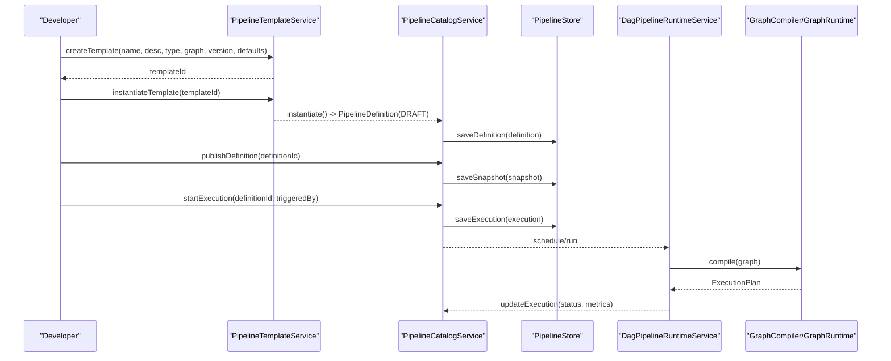

**Diagram sources**
- [PipelineTemplateService.java:1-97](file://pipeline/platform/trade-pipeline-platform/src/main/java/com/tradej/pipeline/platform/PipelineTemplateService.java#L1-L97)
- [PipelineTemplate.java:46-66](file://pipeline/platform/trade-pipeline-platform/src/main/java/com/tradej/pipeline/platform/PipelineTemplate.java#L46-L66)
- [PipelineCatalogService.java:1-242](file://pipeline/platform/trade-pipeline-platform/src/main/java/com/tradej/pipeline/platform/catalog/PipelineCatalogService.java#L1-L242)
- [PipelineStore.java:1-22](file://pipeline/platform/trade-pipeline-platform/src/main/java/com/tradej/pipeline/platform/catalog/PipelineStore.java#L1-L22)
- [DagPipelineRuntimeService.java](file://pipeline/runtime/src/main/java/com/tradej/pipeline/service/DagPipelineRuntimeService.java)
- [GraphCompiler.java](file://pipeline/core/src/main/java/com/tradej/pipeline/runtime/GraphCompiler.java)
- [GraphRuntime.java](file://pipeline/core/src/main/java/com/tradej/pipeline/runtime/GraphRuntime.java)

## Detailed Component Analysis

### Pipeline Definition Model
- Purpose: Encapsulates a pipeline's identity, metadata, structure, version, and lifecycle state.
- Key attributes: id, name, description, type, graph, version, status, timestamps, metadata.
- Lifecycle: Created as DRAFT, published to become immutable Snapshot, archived, and rolled back via Snapshot.

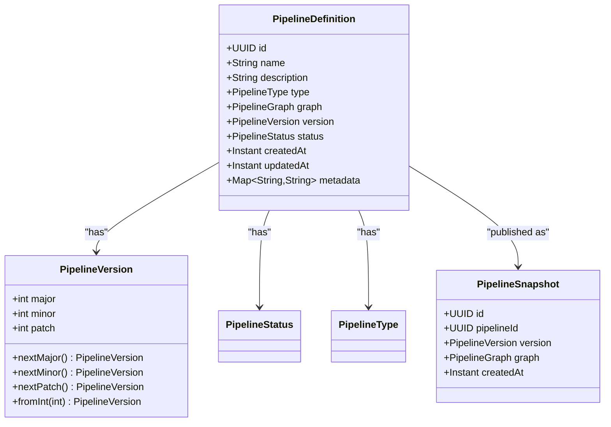

**Diagram sources**
- [PipelineDefinition.java](file://pipeline/platform/trade-pipeline-platform/src/main/java/com/tradej/pipeline/platform/PipelineDefinition.java)
- [PipelineSnapshot.java](file://pipeline/platform/trade-pipeline-platform/src/main/java/com/tradej/pipeline/platform/PipelineSnapshot.java)
- [PipelineVersion.java:1-45](file://pipeline/platform/trade-pipeline-platform/src/main/java/com/tradej/pipeline/platform/PipelineVersion.java#L1-L45)
- [PipelineStatus.java](file://pipeline/platform/trade-pipeline-platform/src/main/java/com/tradej/pipeline/platform/PipelineStatus.java)
- [PipelineType.java](file://pipeline/platform/trade-pipeline-platform/src/main/java/com/tradej/pipeline/platform/PipelineType.java)

**Section sources**
- [PipelineDefinition.java](file://pipeline/platform/trade-pipeline-platform/src/main/java/com/tradej/pipeline/platform/PipelineDefinition.java)
- [PipelineSnapshot.java](file://pipeline/platform/trade-pipeline-platform/src/main/java/com/tradej/pipeline/platform/PipelineSnapshot.java)
- [PipelineVersion.java:1-45](file://pipeline/platform/trade-pipeline-platform/src/main/java/com/tradej/pipeline/platform/PipelineVersion.java#L1-L45)
- [PipelineStatus.java](file://pipeline/platform/trade-pipeline-platform/src/main/java/com/tradej/pipeline/platform/PipelineStatus.java)
- [PipelineType.java](file://pipeline/platform/trade-pipeline-platform/src/main/java/com/tradej/pipeline/platform/PipelineType.java)

### Pipeline Template System and Version Management
- Templates define reusable pipeline structures with default parameters.
- Templates are mutable until instantiation; after instantiation, they produce DRAFT definitions.
- Version management follows semantic versioning with explicit increment methods.

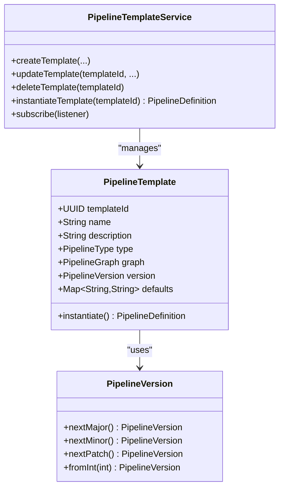

**Diagram sources**
- [PipelineTemplate.java:46-66](file://pipeline/platform/trade-pipeline-platform/src/main/java/com/tradej/pipeline/platform/PipelineTemplate.java#L46-L66)
- [PipelineTemplateService.java:1-97](file://pipeline/platform/trade-pipeline-platform/src/main/java/com/tradej/pipeline/platform/PipelineTemplateService.java#L1-L97)
- [PipelineVersion.java:1-45](file://pipeline/platform/trade-pipeline-platform/src/main/java/com/tradej/pipeline/platform/PipelineVersion.java#L1-L45)

**Section sources**
- [PipelineTemplate.java:46-66](file://pipeline/platform/trade-pipeline-platform/src/main/java/com/tradej/pipeline/platform/PipelineTemplate.java#L46-L66)
- [PipelineTemplateService.java:1-97](file://pipeline/platform/trade-pipeline-platform/src/main/java/com/tradej/pipeline/platform/PipelineTemplateService.java#L1-L97)
- [PipelineVersion.java:1-45](file://pipeline/platform/trade-pipeline-platform/src/main/java/com/tradej/pipeline/platform/PipelineVersion.java#L1-L45)

### Property Descriptors
- Property descriptors define typed parameters for nodes and templates with optional defaults and validation hints.
- Tests demonstrate factory methods for optional and required properties, default value retrieval, and null-name rejection.

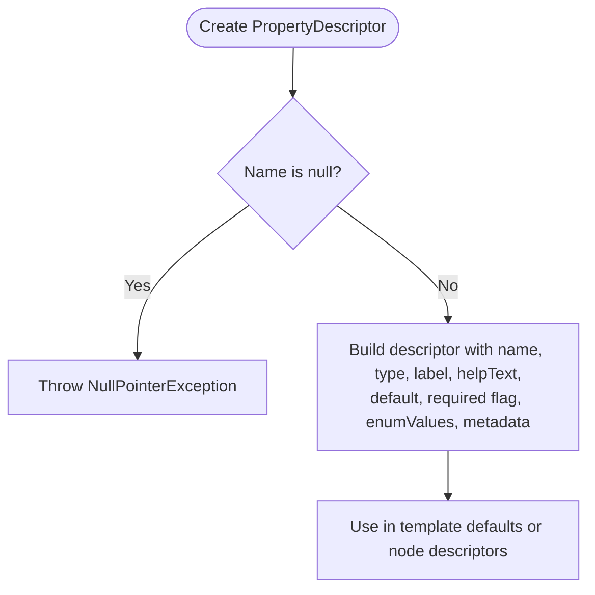

**Diagram sources**
- [PropertyDescriptorUnitTest.java:1-47](file://pipeline/platform/trade-pipeline-platform/src/test/java/com/tradej/pipeline/platform/model/PropertyDescriptorUnitTest.java#L1-L47)

**Section sources**
- [PropertyDescriptorUnitTest.java:1-47](file://pipeline/platform/trade-pipeline-platform/src/test/java/com/tradej/pipeline/platform/model/PropertyDescriptorUnitTest.java#L1-L47)

### Catalog Services: Creation, Cloning, Publishing, Archiving, Rollback
- Creation: Generates a new DRAFT definition with optional initial version and metadata.
- Cloning: Resets status to DRAFT and assigns a new definition id; useful for editing prior versions.
- Publishing: Persists a Snapshot of the current definition; subsequent edits require cloning.
- Archiving: Marks a definition inactive; does not remove Snapshot history.
- Rollback: Creates a new definition referencing a chosen Snapshot’s graph and version.

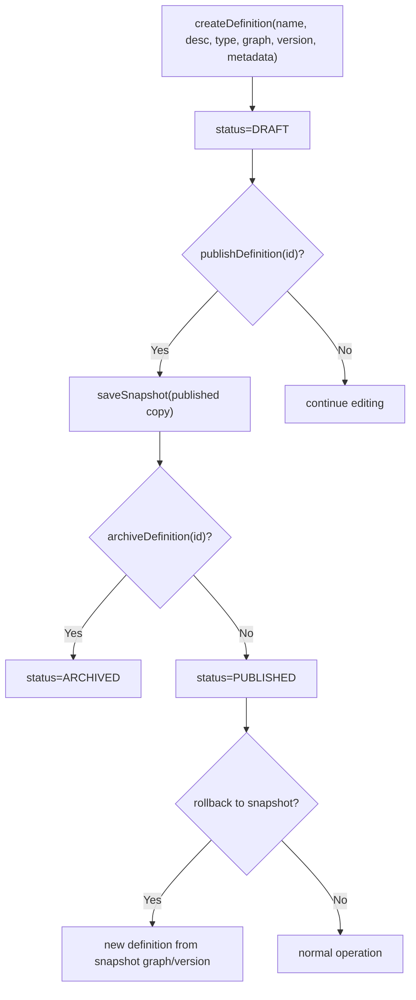

**Diagram sources**
- [PipelineCatalogService.java:1-242](file://pipeline/platform/trade-pipeline-platform/src/main/java/com/tradej/pipeline/platform/catalog/PipelineCatalogService.java#L1-L242)

**Section sources**
- [PipelineCatalogService.java:1-242](file://pipeline/platform/trade-pipeline-platform/src/main/java/com/tradej/pipeline/platform/catalog/PipelineCatalogService.java#L1-L242)

### Execution Tracking and Status Management
- Executions are created per definition with a RUNNING status upon start.
- Executions track trigger source, timestamps, and runtime metrics.
- Catalog service exposes queries for executions linked to a definition.

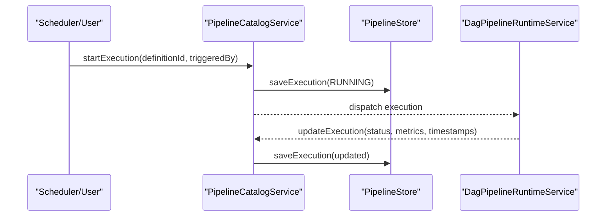

**Diagram sources**
- [PipelineCatalogService.java:210-242](file://pipeline/platform/trade-pipeline-platform/src/main/java/com/tradej/pipeline/platform/catalog/PipelineCatalogService.java#L210-L242)
- [PipelineExecution.java](file://pipeline/platform/trade-pipeline-platform/src/main/java/com/tradej/pipeline/platform/model/PipelineExecution.java)
- [PipelineExecutionStatus.java](file://pipeline/platform/trade-pipeline-platform/src/main/java/com/tradej/pipeline/platform/model/PipelineExecutionStatus.java)

**Section sources**
- [PipelineCatalogService.java:210-242](file://pipeline/platform/trade-pipeline-platform/src/main/java/com/tradej/pipeline/platform/catalog/PipelineCatalogService.java#L210-L242)
- [PipelineExecution.java](file://pipeline/platform/trade-pipeline-platform/src/main/java/com/tradej/pipeline/platform/model/PipelineExecution.java)
- [PipelineExecutionStatus.java](file://pipeline/platform/trade-pipeline-platform/src/main/java/com/tradej/pipeline/platform/model/PipelineExecutionStatus.java)

### Snapshot Management
- Snapshots capture immutable versions of published definitions.
- Snapshots enable rollback to previous working configurations.
- Catalog service lists snapshots per definition and supports lookup by id.

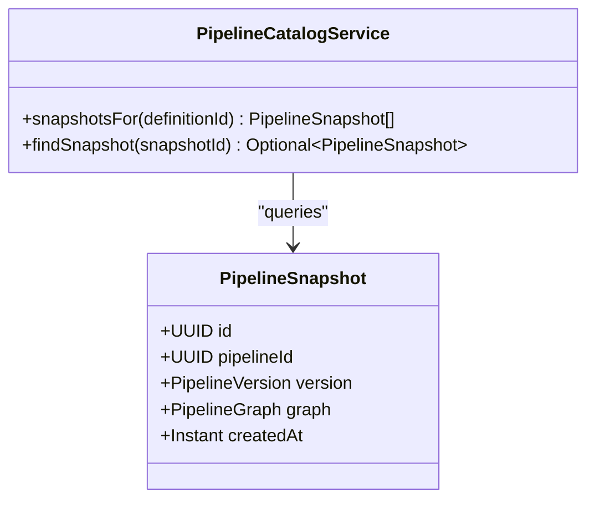

**Diagram sources**
- [PipelineSnapshot.java](file://pipeline/platform/trade-pipeline-platform/src/main/java/com/tradej/pipeline/platform/PipelineSnapshot.java)
- [PipelineCatalogService.java:204-208](file://pipeline/platform/trade-pipeline-platform/src/main/java/com/tradej/pipeline/platform/catalog/PipelineCatalogService.java#L204-L208)

**Section sources**
- [PipelineSnapshot.java](file://pipeline/platform/trade-pipeline-platform/src/main/java/com/tradej/pipeline/platform/PipelineSnapshot.java)
- [PipelineCatalogService.java:204-208](file://pipeline/platform/trade-pipeline-platform/src/main/java/com/tradej/pipeline/platform/catalog/PipelineCatalogService.java#L204-L208)

### Template Validation Rules
- Templates are validated during creation and update to ensure non-null name, type, graph, and version.
- Defaults are copied to prevent external mutation from affecting the template.
- Tests verify immutability of defaults after template creation.

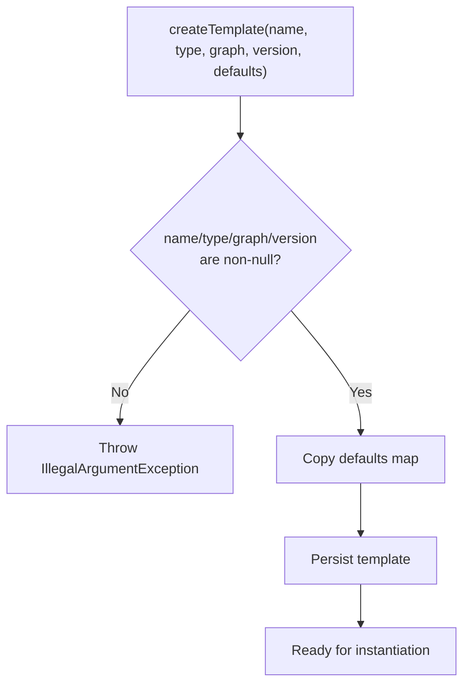

**Diagram sources**
- [PipelineTemplateService.java:19-74](file://pipeline/platform/trade-pipeline-platform/src/main/java/com/tradej/pipeline/platform/PipelineTemplateService.java#L19-L74)
- [PipelineTemplateTest.java:72-83](file://pipeline/platform/trade-pipeline-platform/src/test/java/com/tradej/pipeline/platform/PipelineTemplateTest.java#L72-L83)

**Section sources**
- [PipelineTemplateService.java:19-74](file://pipeline/platform/trade-pipeline-platform/src/main/java/com/tradej/pipeline/platform/PipelineTemplateService.java#L19-L74)
- [PipelineTemplateTest.java:72-83](file://pipeline/platform/trade-pipeline-platform/src/test/java/com/tradej/pipeline/platform/PipelineTemplateTest.java#L72-L83)

### Integration with Pipeline Runtime Service and Execution Contexts
- Runtime services compile the pipeline graph into an execution plan and manage node lifecycles.
- Execution contexts carry state and metrics across nodes.
- Ingress bridges connect external events to pipeline execution.

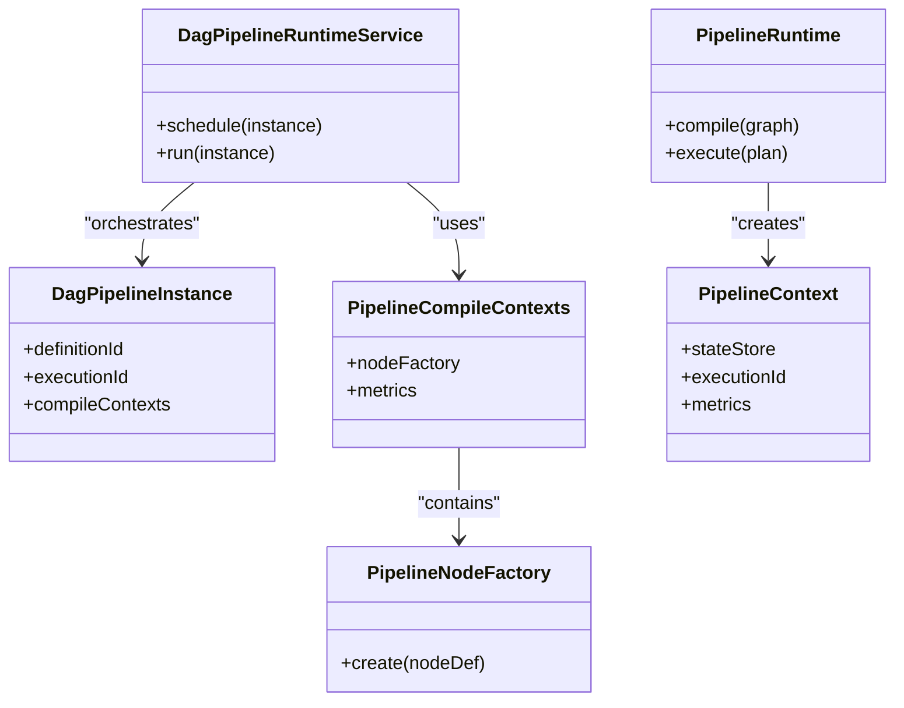

**Diagram sources**
- [DagPipelineRuntimeService.java](file://pipeline/runtime/src/main/java/com/tradej/pipeline/service/DagPipelineRuntimeService.java)
- [DagPipelineInstance.java](file://pipeline/runtime/src/main/java/com/tradej/pipeline/service/DagPipelineInstance.java)
- [PipelineCompileContexts.java](file://pipeline/runtime/src/main/java/com/tradej/pipeline/service/PipelineCompileContexts.java)
- [PipelineNodeFactory.java](file://pipeline/runtime/src/main/java/com/tradej/pipeline/service/PipelineNodeFactory.java)
- [PipelineRuntime.java](file://pipeline/core/src/main/java/com/tradej/pipeline/runtime/PipelineRuntime.java)
- [PipelineContext.java](file://pipeline/core/src/main/java/com/tradej/pipeline/runtime/PipelineContext.java)

**Section sources**
- [DagPipelineRuntimeService.java](file://pipeline/runtime/src/main/java/com/tradej/pipeline/service/DagPipelineRuntimeService.java)
- [DagPipelineInstance.java](file://pipeline/runtime/src/main/java/com/tradej/pipeline/service/DagPipelineInstance.java)
- [PipelineCompileContexts.java](file://pipeline/runtime/src/main/java/com/tradej/pipeline/service/PipelineCompileContexts.java)
- [PipelineNodeFactory.java](file://pipeline/runtime/src/main/java/com/tradej/pipeline/service/PipelineNodeFactory.java)
- [PipelineRuntime.java](file://pipeline/core/src/main/java/com/tradej/pipeline/runtime/PipelineRuntime.java)
- [PipelineContext.java](file://pipeline/core/src/main/java/com/tradej/pipeline/runtime/PipelineContext.java)

### State Stores and Node Execution
- Node state and metrics are maintained via state stores integrated into the execution context.
- Nodes implement base and reactive patterns to handle hot-path and cold-path execution.

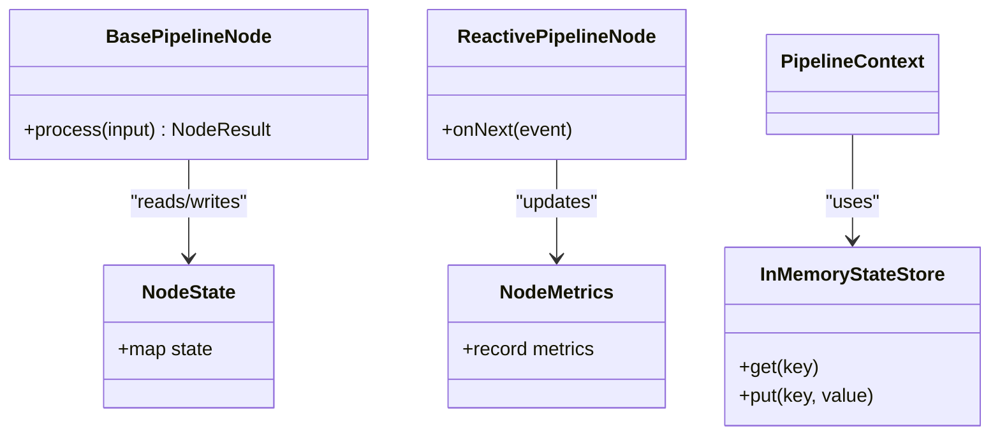

**Diagram sources**
- [InMemoryStateStore.java](file://pipeline/core/src/main/java/com/tradej/pipeline/state/InMemoryStateStore.java)
- [NodeState.java](file://pipeline/core/src/main/java/com/tradej/pipeline/runtime/NodeState.java)
- [NodeMetrics.java](file://pipeline/core/src/main/java/com/tradej/pipeline/runtime/NodeMetrics.java)
- [BasePipelineNode.java](file://pipeline/core/src/main/java/com/tradej/pipeline/runtime/BasePipelineNode.java)
- [ReactivePipelineNode.java](file://pipeline/core/src/main/java/com/tradej/pipeline/runtime/ReactivePipelineNode.java)

**Section sources**
- [InMemoryStateStore.java](file://pipeline/core/src/main/java/com/tradej/pipeline/state/InMemoryStateStore.java)
- [NodeState.java](file://pipeline/core/src/main/java/com/tradej/pipeline/runtime/NodeState.java)
- [NodeMetrics.java](file://pipeline/core/src/main/java/com/tradej/pipeline/runtime/NodeMetrics.java)
- [BasePipelineNode.java](file://pipeline/core/src/main/java/com/tradej/pipeline/runtime/BasePipelineNode.java)
- [ReactivePipelineNode.java](file://pipeline/core/src/main/java/com/tradej/pipeline/runtime/ReactivePipelineNode.java)

### Practical Examples

#### Creating a Pipeline Definition from a Template
- Steps:
  1. Create a template with a graph, type, version, and defaults.
  2. Instantiate the template to produce a DRAFT definition.
  3. Publish the definition to create a Snapshot.
  4. Archive or rollback as needed.

**Section sources**
- [PipelineTemplateService.java:19-86](file://pipeline/platform/trade-pipeline-platform/src/main/java/com/tradej/pipeline/platform/PipelineTemplateService.java#L19-L86)
- [PipelineTemplate.java:46-66](file://pipeline/platform/trade-pipeline-platform/src/main/java/com/tradej/pipeline/platform/PipelineTemplate.java#L46-L66)
- [PipelineCatalogService.java:43-63](file://pipeline/platform/trade-pipeline-platform/src/main/java/com/tradej/pipeline/platform/catalog/PipelineCatalogService.java#L43-L63)
- [PipelineCatalogService.java:120-140](file://pipeline/platform/trade-pipeline-platform/src/main/java/com/tradej/pipeline/platform/catalog/PipelineCatalogService.java#L120-L140)

#### Monitoring Pipeline Execution
- Steps:
  1. Start an execution for a definition.
  2. Poll or subscribe to execution updates.
  3. Inspect status, timestamps, and metrics.

**Section sources**
- [PipelineCatalogService.java:212-232](file://pipeline/platform/trade-pipeline-platform/src/main/java/com/tradej/pipeline/platform/catalog/PipelineCatalogService.java#L212-L232)
- [PipelineExecution.java](file://pipeline/platform/trade-pipeline-platform/src/main/java/com/tradej/pipeline/platform/model/PipelineExecution.java)
- [PipelineExecutionStatus.java](file://pipeline/platform/trade-pipeline-platform/src/main/java/com/tradej/pipeline/platform/model/PipelineExecutionStatus.java)

#### Developing a Pipeline Template
- Steps:
  1. Define a graph with nodes and edges.
  2. Create a template with defaults for parameters.
  3. Validate defaults immutability and update semantics.

**Section sources**
- [PipelineTemplateService.java:19-74](file://pipeline/platform/trade-pipeline-platform/src/main/java/com/tradej/pipeline/platform/PipelineTemplateService.java#L19-L74)
- [PipelineTemplateTest.java:72-83](file://pipeline/platform/trade-pipeline-platform/src/test/java/com/tradej/pipeline/platform/PipelineTemplateTest.java#L72-L83)

## Dependency Analysis
The platform exhibits clear layering:
- Platform models depend on core graph types and runtime primitives.
- Catalog services depend on store abstractions and runtime orchestration.
- Runtime services depend on graph compilers and node factories.

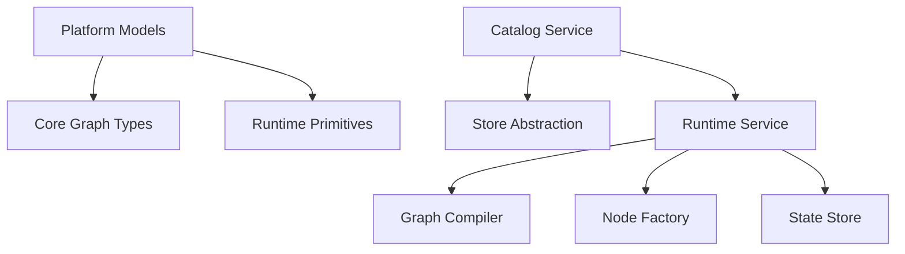

**Diagram sources**
- [PipelineCatalogService.java:1-242](file://pipeline/platform/trade-pipeline-platform/src/main/java/com/tradej/pipeline/platform/catalog/PipelineCatalogService.java#L1-L242)
- [PipelineStore.java:1-22](file://pipeline/platform/trade-pipeline-platform/src/main/java/com/tradej/pipeline/platform/catalog/PipelineStore.java#L1-L22)
- [DagPipelineRuntimeService.java](file://pipeline/runtime/src/main/java/com/tradej/pipeline/service/DagPipelineRuntimeService.java)
- [GraphCompiler.java](file://pipeline/core/src/main/java/com/tradej/pipeline/runtime/GraphCompiler.java)
- [PipelineNodeFactory.java](file://pipeline/runtime/src/main/java/com/tradej/pipeline/service/PipelineNodeFactory.java)
- [InMemoryStateStore.java](file://pipeline/core/src/main/java/com/tradej/pipeline/state/InMemoryStateStore.java)

**Section sources**
- [PipelineCatalogService.java:1-242](file://pipeline/platform/trade-pipeline-platform/src/main/java/com/tradej/pipeline/platform/catalog/PipelineCatalogService.java#L1-L242)
- [PipelineStore.java:1-22](file://pipeline/platform/trade-pipeline-platform/src/main/java/com/tradej/pipeline/platform/catalog/PipelineStore.java#L1-L22)
- [DagPipelineRuntimeService.java](file://pipeline/runtime/src/main/java/com/tradej/pipeline/service/DagPipelineRuntimeService.java)
- [GraphCompiler.java](file://pipeline/core/src/main/java/com/tradej/pipeline/runtime/GraphCompiler.java)
- [PipelineNodeFactory.java](file://pipeline/runtime/src/main/java/com/tradej/pipeline/service/PipelineNodeFactory.java)
- [InMemoryStateStore.java](file://pipeline/core/src/main/java/com/tradej/pipeline/state/InMemoryStateStore.java)

## Performance Considerations
- Prefer immutable structures (records) for versions and descriptors to reduce defensive copying overhead.
- Use concurrent collections for templates and listeners to minimize contention during updates.
- Leverage partitioned nodes and reactive patterns for hot-path throughput.
- Keep state stores lightweight and cacheable; avoid heavy serialization in hot paths.
- Batch updates to execution metrics and snapshots to reduce I/O pressure.

## Troubleshooting Guide
Common issues and resolutions:
- Execution not starting:
  - Verify definition exists and is published.
  - Confirm execution creation succeeded and was persisted.
  - Check runtime scheduling and ingress bridge connectivity.
- Version mismatch:
  - Ensure template version aligns with definition version.
  - Use semantic version increments and validate via unit tests.
- Template defaults mutation:
  - Defaults are copied at template creation; confirm immutability post-creation.
- Snapshot rollback:
  - Ensure snapshot exists for the target definition and re-instantiate from snapshot graph.

**Section sources**
- [PipelineCatalogService.java:212-232](file://pipeline/platform/trade-pipeline-platform/src/main/java/com/tradej/pipeline/platform/catalog/PipelineCatalogService.java#L212-L232)
- [PipelineTemplateService.java:19-74](file://pipeline/platform/trade-pipeline-platform/src/main/java/com/tradej/pipeline/platform/PipelineTemplateService.java#L19-L74)
- [PipelineTemplateTest.java:72-83](file://pipeline/platform/trade-pipeline-platform/src/test/java/com/tradej/pipeline/platform/PipelineTemplateTest.java#L72-L83)
- [PipelineVersionTest.java](file://pipeline/platform/trade-pipeline-platform/src/test/java/com/tradej/pipeline/platform/PipelineVersionTest.java)
- [PipelineVersionUnitTest.java:1-51](file://pipeline/platform/trade-pipeline-platform/src/test/java/com/tradej/pipeline/platform/PipelineVersionUnitTest.java#L1-L51)

## Conclusion
The pipeline platform provides a robust foundation for designing, managing, and executing pipelines. Its template-driven approach accelerates development while maintaining strong versioning and immutability guarantees. The catalog service centralizes lifecycle operations, and the runtime integrates graph compilation, state management, and execution orchestration. By following the guidelines herein, teams can efficiently develop, debug, and optimize pipeline workloads.

## Appendices

### Appendix A: Lifecycle Management Guidelines
- Use templates to standardize common pipeline structures.
- Keep definitions DRAFT until ready; publish to create immutable Snapshots.
- Increment versions semantically; use rollback to recover from regressions.
- Monitor executions closely; maintain clear triggers and metadata.

**Section sources**
- [PipelineTemplateService.java:19-86](file://pipeline/platform/trade-pipeline-platform/src/main/java/com/tradej/pipeline/platform/PipelineTemplateService.java#L19-L86)
- [PipelineCatalogService.java:43-63](file://pipeline/platform/trade-pipeline-platform/src/main/java/com/tradej/pipeline/platform/catalog/PipelineCatalogService.java#L43-L63)
- [PipelineVersion.java:1-45](file://pipeline/platform/trade-pipeline-platform/src/main/java/com/tradej/pipeline/platform/PipelineVersion.java#L1-L45)

### Appendix B: Testing References
- Component-level tests validate catalog operations, template instantiation, and version semantics.
- Integration tests cover runtime parity and ingress behavior.

**Section sources**
- [PipelineCatalogServiceTest.java:1-89](file://pipeline/platform/trade-pipeline-platform/src/test/java/com/tradej/pipeline/platform/catalog/PipelineCatalogServiceTest.java#L1-L89)
- [PipelineTemplateServiceTest.java](file://pipeline/platform/trade-pipeline-platform/src/test/java/com/tradej/pipeline/platform/PipelineTemplateServiceTest.java)
- [PipelineVersionTest.java](file://pipeline/platform/trade-pipeline-platform/src/test/java/com/tradej/pipeline/platform/PipelineVersionTest.java)
- [PipelineVersionUnitTest.java:1-51](file://pipeline/platform/trade-pipeline-platform/src/test/java/com/tradej/pipeline/platform/PipelineVersionUnitTest.java#L1-L51)
- [PipelineNodeParityComponentTest.java](file://app/src/test/java/com/tradej/app/pipeline/PipelineNodeParityComponentTest.java)
- [ReplayMarketTickParityTest.java](file://app/src/test/java/com/tradej/app/pipeline/ReplayMarketTickParityTest.java)
- [PipelineCompileRoutingTest.java](file://app/src/test/java/com/tradej/app/pipeline/PipelineCompileRoutingTest.java)
- [DagPipelineIngressTest.java](file://app/src/test/java/com/tradej/app/pipeline/DagPipelineIngressTest.java)