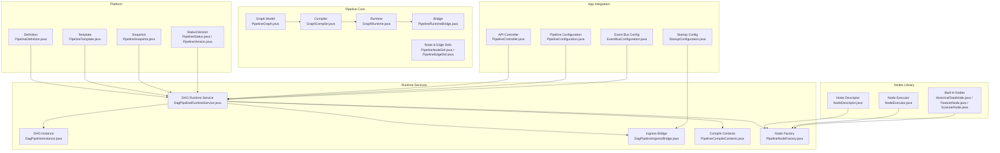
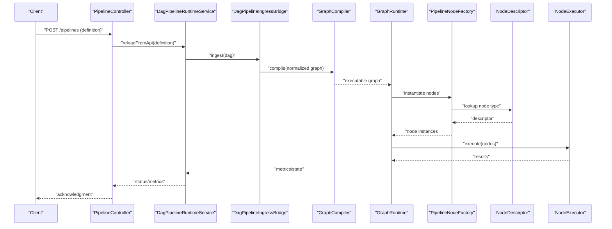
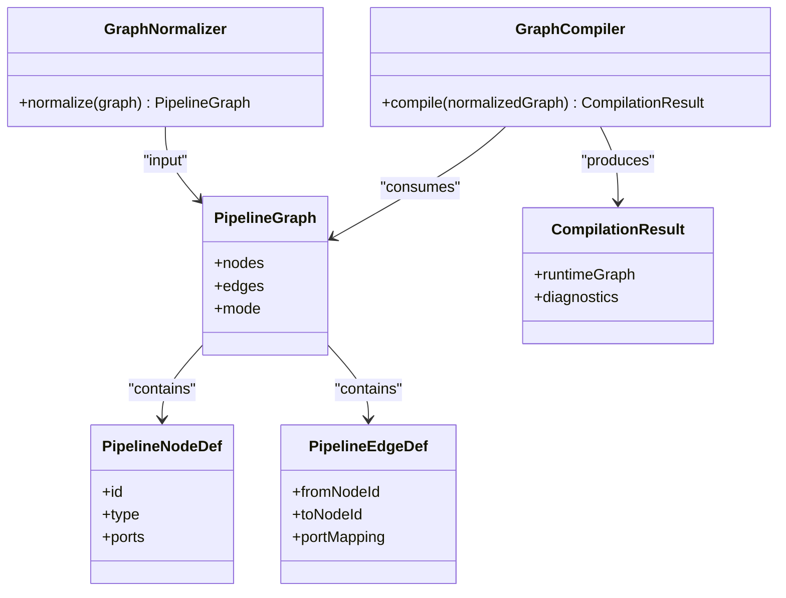
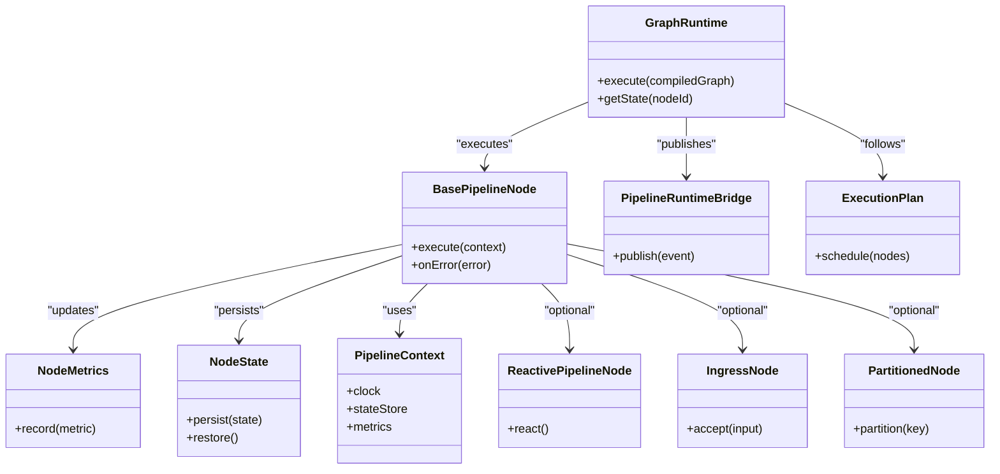
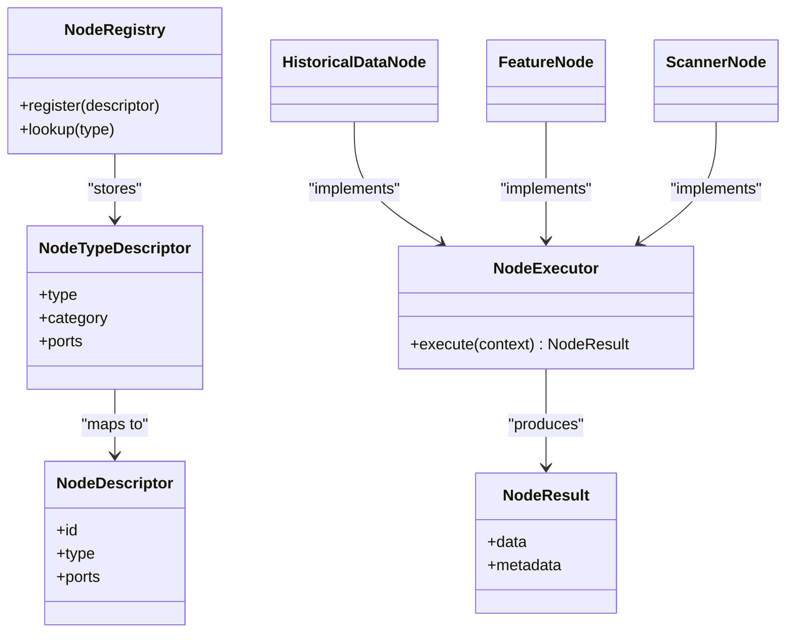
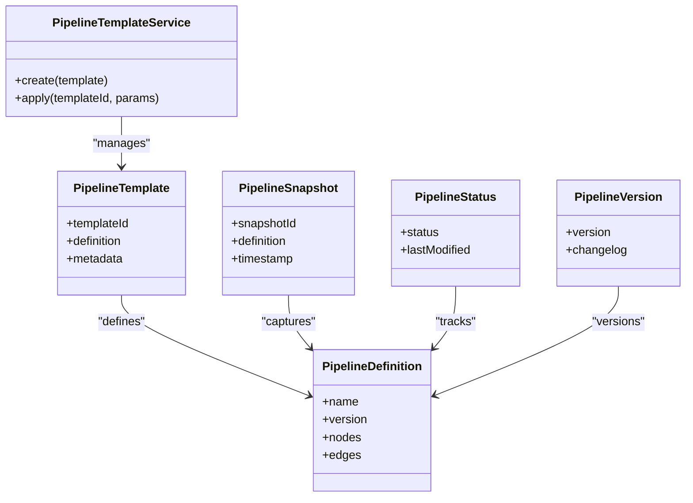
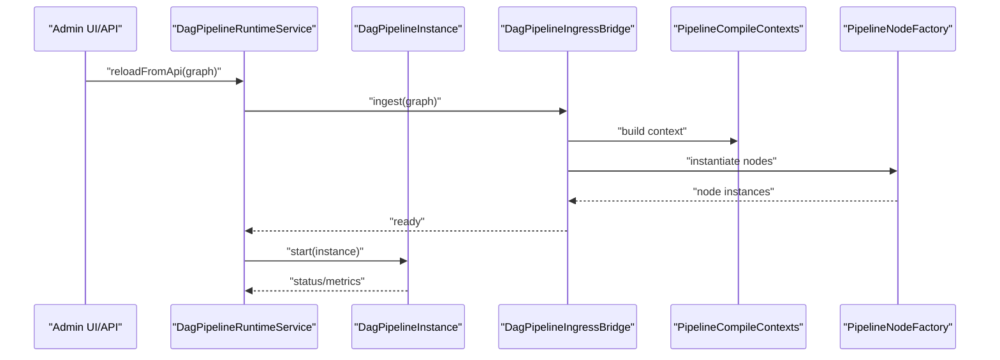
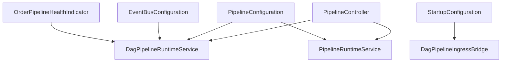
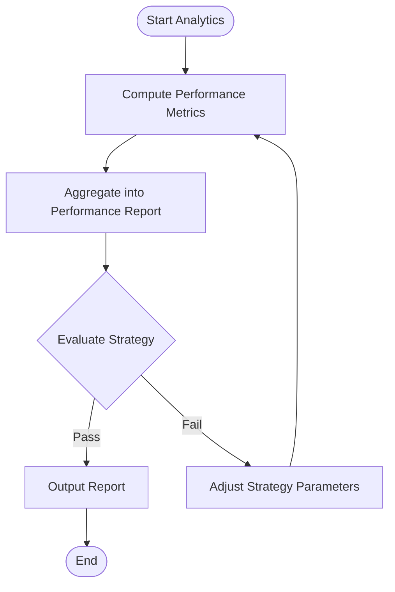
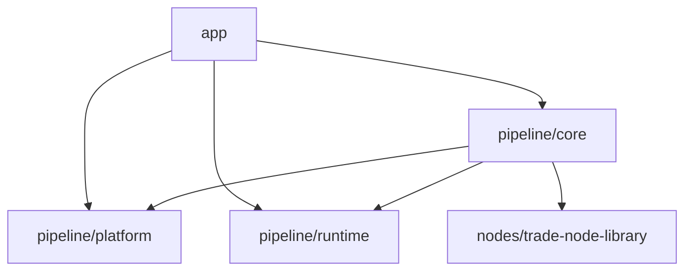

# Pipeline Processing System

<cite>
**Referenced Files in This Document**
- [PipelineGraph.java](file://pipeline/core/src/main/java/com/tradej/pipeline/graph/PipelineGraph.java)
- [PipelineNodeDef.java](file://pipeline/core/src/main/java/com/tradej/pipeline/graph/PipelineNodeDef.java)
- [PipelineEdgeDef.java](file://pipeline/core/src/main/java/com/tradej/pipeline/graph/PipelineEdgeDef.java)
- [GraphNormalizer.java](file://pipeline/core/src/main/java/com/tradej/pipeline/compiler/GraphNormalizer.java)
- [CompilationResult.java](file://pipeline/core/src/main/java/com/tradej/pipeline/compiler/CompilationResult.java)
- [GraphCompiler.java](file://pipeline/core/src/main/java/com/tradej/pipeline/runtime/GraphCompiler.java)
- [GraphRuntime.java](file://pipeline/core/src/main/java/com/tradej/pipeline/runtime/GraphRuntime.java)
- [BasePipelineNode.java](file://pipeline/core/src/main/java/com/tradej/pipeline/runtime/BasePipelineNode.java)
- [PipelineRuntime.java](file://pipeline/core/src/main/java/com/tradej/pipeline/runtime/PipelineRuntime.java)
- [NodeMetrics.java](file://pipeline/core/src/main/java/com/tradej/pipeline/runtime/NodeMetrics.java)
- [NodeState.java](file://pipeline/core/src/main/java/com/tradej/pipeline/runtime/NodeState.java)
- [PipelineContext.java](file://pipeline/core/src/main/java/com/tradej/pipeline/runtime/PipelineContext.java)
- [PipelineRuntimeBridge.java](file://pipeline/core/src/main/java/com/tradej/pipeline/runtime/PipelineRuntimeBridge.java)
- [ReactivePipelineNode.java](file://pipeline/core/src/main/java/com/tradej/pipeline/runtime/ReactivePipelineNode.java)
- [IngressNode.java](file://pipeline/core/src/main/java/com/tradej/pipeline/runtime/IngressNode.java)
- [PartitionedNode.java](file://pipeline/core/src/main/java/com/tradej/pipeline/runtime/PartitionedNode.java)
- [ExecutionPlan.java](file://pipeline/core/src/main/java/com/tradej/pipeline/runtime/ExecutionPlan.java)
- [PipelineNodeTypes.java](file://pipeline/core/src/main/java/com/tradej/pipeline/runtime/PipelineNodeTypes.java)
- [NodeRegistry.java](file://pipeline/core/src/main/java/com/tradej/pipeline/registry/NodeRegistry.java)
- [NodeTypeDescriptor.java](file://pipeline/core/src/main/java/com/tradej/pipeline/registry/NodeTypeDescriptor.java)
- [NodeDescriptor.java](file://nodes/trade-node-library/src/main/java/com/tradej/node/NodeDescriptor.java)
- [NodeExecutor.java](file://nodes/trade-node-library/src/main/java/com/tradej/node/NodeExecutor.java)
- [NodeResult.java](file://nodes/trade-node-library/src/main/java/com/tradej/node/NodeResult.java)
- [NodeContext.java](file://nodes/trade-node-library/src/main/java/com/tradej/node/NodeContext.java)
- [PortDescriptor.java](file://nodes/trade-node-library/src/main/java/com/tradej/node/PortDescriptor.java)
- [NodeCategory.java](file://nodes/trade-node-library/src/main/java/com/tradej/node/NodeCategory.java)
- [PipelineDefinition.java](file://pipeline/platform/trade-pipeline-platform/src/main/java/com/tradej/pipeline/platform/PipelineDefinition.java)
- [PipelineTemplate.java](file://pipeline/platform/trade-pipeline-platform/src/main/java/com/tradej/pipeline/platform/PipelineTemplate.java)
- [PipelineTemplateService.java](file://pipeline/platform/trade-pipeline-platform/src/main/java/com/tradej/pipeline/platform/PipelineTemplateService.java)
- [PipelineStatus.java](file://pipeline/platform/trade-pipeline-platform/src/main/java/com/tradej/pipeline/platform/PipelineStatus.java)
- [PipelineVersion.java](file://pipeline/platform/trade-pipeline-platform/src/main/java/com/tradej/pipeline/platform/PipelineVersion.java)
- [PipelineSnapshot.java](file://pipeline/platform/trade-pipeline-platform/src/main/java/com/tradej/pipeline/platform/PipelineSnapshot.java)
- [DagPipelineRuntimeService.java](file://pipeline/runtime/src/main/java/com/tradej/pipeline/service/DagPipelineRuntimeService.java)
- [DagPipelineInstance.java](file://pipeline/runtime/src/main/java/com/tradej/pipeline/service/DagPipelineInstance.java)
- [DagPipelineIngressBridge.java](file://pipeline/runtime/src/main/java/com/tradej/pipeline/service/DagPipelineIngressBridge.java)
- [PipelineCompileContexts.java](file://pipeline/runtime/src/main/java/com/tradej/pipeline/service/PipelineCompileContexts.java)
- [PipelineNodeFactory.java](file://pipeline/runtime/src/main/java/com/tradej/pipeline/service/PipelineNodeFactory.java)
- [PipelineRuntimeService.java](file://pipeline/runtime/src/main/java/com/tradej/pipeline/service/PipelineRuntimeService.java)
- [PipelineController.java](file://app/src/main/java/com/tradej/app/api/PipelineController.java)
- [PipelineConfiguration.java](file://app/src/main/java/com/tradej/app/pipeline/PipelineConfiguration.java)
- [StartupConfiguration.java](file://app/src/main/java/com/tradej/app/config/StartupConfiguration.java)
- [EventBusConfiguration.java](file://app/src/main/java/com/tradej/app/config/EventBusConfiguration.java)
- [OrderPipelineHealthIndicator.java](file://app/src/main/java/com/tradej/app/health/OrderPipelineHealthIndicator.java)
- [HistoricalDataNode.java](file://nodes/trade-node-library/src/main/java/com/tradej/node/data/HistoricalDataNode.java)
- [FeatureNode.java](file://nodes/trade-node-library/src/main/java/com/tradej/node/feature/FeatureNode.java)
- [ScannerNode.java](file://nodes/trade-node-library/src/main/java/com/tradej/node/scanner/ScannerNode.java)
- [DefaultPerformanceAnalytics.java](file://pipeline/analytics/trade-analytics/src/main/java/com/tradej/analytics/DefaultPerformanceAnalytics.java)
- [PerformanceAnalytics.java](file://pipeline/analytics/trade-analytics/src/main/java/com/tradej/analytics/PerformanceAnalytics.java)
- [PerformanceReport.java](file://pipeline/analytics/trade-analytics/src/main/java/com/tradej/analytics/PerformanceReport.java)
- [BacktestFillModel.java](file://pipeline/core/src/main/java/com/tradej/pipeline/runtime/BacktestFillModel.java)
- [DefaultBacktestFillModel.java](file://pipeline/core/src/main/java/com/tradej/pipeline/runtime/DefaultBacktestFillModel.java)
- [VirtualClock.java](file://pipeline/core/src/main/java/com/tradej/pipeline/clock/VirtualClock.java)
- [EventTimestamps.java](file://pipeline/core/src/main/java/com/tradej/pipeline/clock/EventTimestamps.java)
- [InMemoryStateStore.java](file://pipeline/core/src/main/java/com/tradej/pipeline/state/InMemoryStateStore.java)
- [ReactorBridge.java](file://pipeline/core/src/main/java/com/tradej/pipeline/reactor/ReactorBridge.java)
- [ReactorBridgeMetrics.java](file://pipeline/runtime/src/main/java/com/tradej/pipeline/service/reactor/ReactorBridgeMetrics.java)
</cite>

## Table of Contents
1. [Introduction](#introduction)
2. [Project Structure](#project-structure)
3. [Core Components](#core-components)
4. [Architecture Overview](#architecture-overview)
5. [Detailed Component Analysis](#detailed-component-analysis)
6. [Dependency Analysis](#dependency-analysis)
7. [Performance Considerations](#performance-considerations)
8. [Troubleshooting Guide](#troubleshooting-guide)
9. [Conclusion](#conclusion)
10. [Appendices](#appendices)

## Introduction
This document describes the pipeline processing system that powers DAG-based workflow execution, node-based processing, and analytics orchestration. It explains how pipelines are defined, compiled, executed, tracked, and monitored. It also documents the node type system, custom node development framework, and integration points with trading workflows and data processing. Practical examples illustrate pipeline creation, node development, and workflow orchestration, along with performance optimization and debugging guidance.

## Project Structure
The pipeline system spans several modules:
- pipeline/core: Graph modeling, compilation, runtime, registry, state, and clock utilities
- pipeline/platform: Pipeline definition language, templates, snapshots, and status/versioning
- pipeline/runtime: Runtime services, ingress bridges, factories, and compile contexts
- nodes/trade-node-library: Node abstractions, descriptors, executors, and built-in nodes
- app: API controllers, configuration, and health indicators integrating the pipeline runtime
- pipeline/analytics: Analytics execution and reporting for performance and drawdown

**Diagram sources**
- [PipelineGraph.java](file://pipeline/core/src/main/java/com/tradej/pipeline/graph/PipelineGraph.java)
- [PipelineNodeDef.java](file://pipeline/core/src/main/java/com/tradej/pipeline/graph/PipelineNodeDef.java)
- [PipelineEdgeDef.java](file://pipeline/core/src/main/java/com/tradej/pipeline/graph/PipelineEdgeDef.java)
- [GraphCompiler.java](file://pipeline/core/src/main/java/com/tradej/pipeline/runtime/GraphCompiler.java)
- [GraphRuntime.java](file://pipeline/core/src/main/java/com/tradej/pipeline/runtime/GraphRuntime.java)
- [PipelineRuntimeBridge.java](file://pipeline/core/src/main/java/com/tradej/pipeline/runtime/PipelineRuntimeBridge.java)
- [PipelineDefinition.java](file://pipeline/platform/trade-pipeline-platform/src/main/java/com/tradej/pipeline/platform/PipelineDefinition.java)
- [PipelineTemplate.java](file://pipeline/platform/trade-pipeline-platform/src/main/java/com/tradej/pipeline/platform/PipelineTemplate.java)
- [PipelineSnapshot.java](file://pipeline/platform/trade-pipeline-platform/src/main/java/com/tradej/pipeline/platform/PipelineSnapshot.java)
- [PipelineStatus.java](file://pipeline/platform/trade-pipeline-platform/src/main/java/com/tradej/pipeline/platform/PipelineStatus.java)
- [PipelineVersion.java](file://pipeline/platform/trade-pipeline-platform/src/main/java/com/tradej/pipeline/platform/PipelineVersion.java)
- [DagPipelineRuntimeService.java](file://pipeline/runtime/src/main/java/com/tradej/pipeline/service/DagPipelineRuntimeService.java)
- [DagPipelineInstance.java](file://pipeline/runtime/src/main/java/com/tradej/pipeline/service/DagPipelineInstance.java)
- [DagPipelineIngressBridge.java](file://pipeline/runtime/src/main/java/com/tradej/pipeline/service/DagPipelineIngressBridge.java)
- [PipelineCompileContexts.java](file://pipeline/runtime/src/main/java/com/tradej/pipeline/service/PipelineCompileContexts.java)
- [PipelineNodeFactory.java](file://pipeline/runtime/src/main/java/com/tradej/pipeline/service/PipelineNodeFactory.java)
- [NodeDescriptor.java](file://nodes/trade-node-library/src/main/java/com/tradej/node/NodeDescriptor.java)
- [NodeExecutor.java](file://nodes/trade-node-library/src/main/java/com/tradej/node/NodeExecutor.java)
- [HistoricalDataNode.java](file://nodes/trade-node-library/src/main/java/com/tradej/node/data/HistoricalDataNode.java)
- [FeatureNode.java](file://nodes/trade-node-library/src/main/java/com/tradej/node/feature/FeatureNode.java)
- [ScannerNode.java](file://nodes/trade-node-library/src/main/java/com/tradej/node/scanner/ScannerNode.java)
- [PipelineController.java](file://app/src/main/java/com/tradej/app/api/PipelineController.java)
- [PipelineConfiguration.java](file://app/src/main/java/com/tradej/app/pipeline/PipelineConfiguration.java)
- [StartupConfiguration.java](file://app/src/main/java/com/tradej/app/config/StartupConfiguration.java)
- [EventBusConfiguration.java](file://app/src/main/java/com/tradej/app/config/EventBusConfiguration.java)

**Section sources**
- [PipelineGraph.java](file://pipeline/core/src/main/java/com/tradej/pipeline/graph/PipelineGraph.java)
- [PipelineNodeDef.java](file://pipeline/core/src/main/java/com/tradej/pipeline/graph/PipelineNodeDef.java)
- [PipelineEdgeDef.java](file://pipeline/core/src/main/java/com/tradej/pipeline/graph/PipelineEdgeDef.java)
- [GraphCompiler.java](file://pipeline/core/src/main/java/com/tradej/pipeline/runtime/GraphCompiler.java)
- [GraphRuntime.java](file://pipeline/core/src/main/java/com/tradej/pipeline/runtime/GraphRuntime.java)
- [PipelineRuntimeBridge.java](file://pipeline/core/src/main/java/com/tradej/pipeline/runtime/PipelineRuntimeBridge.java)
- [PipelineDefinition.java](file://pipeline/platform/trade-pipeline-platform/src/main/java/com/tradej/pipeline/platform/PipelineDefinition.java)
- [PipelineTemplate.java](file://pipeline/platform/trade-pipeline-platform/src/main/java/com/tradej/pipeline/platform/PipelineTemplate.java)
- [PipelineSnapshot.java](file://pipeline/platform/trade-pipeline-platform/src/main/java/com/tradej/pipeline/platform/PipelineSnapshot.java)
- [PipelineStatus.java](file://pipeline/platform/trade-pipeline-platform/src/main/java/com/tradej/pipeline/platform/PipelineStatus.java)
- [PipelineVersion.java](file://pipeline/platform/trade-pipeline-platform/src/main/java/com/tradej/pipeline/platform/PipelineVersion.java)
- [DagPipelineRuntimeService.java](file://pipeline/runtime/src/main/java/com/tradej/pipeline/service/DagPipelineRuntimeService.java)
- [DagPipelineInstance.java](file://pipeline/runtime/src/main/java/com/tradej/pipeline/service/DagPipelineInstance.java)
- [DagPipelineIngressBridge.java](file://pipeline/runtime/src/main/java/com/tradej/pipeline/service/DagPipelineIngressBridge.java)
- [PipelineCompileContexts.java](file://pipeline/runtime/src/main/java/com/tradej/pipeline/service/PipelineCompileContexts.java)
- [PipelineNodeFactory.java](file://pipeline/runtime/src/main/java/com/tradej/pipeline/service/PipelineNodeFactory.java)
- [NodeDescriptor.java](file://nodes/trade-node-library/src/main/java/com/tradej/node/NodeDescriptor.java)
- [NodeExecutor.java](file://nodes/trade-node-library/src/main/java/com/tradej/node/NodeExecutor.java)
- [HistoricalDataNode.java](file://nodes/trade-node-library/src/main/java/com/tradej/node/data/HistoricalDataNode.java)
- [FeatureNode.java](file://nodes/trade-node-library/src/main/java/com/tradej/node/feature/FeatureNode.java)
- [ScannerNode.java](file://nodes/trade-node-library/src/main/java/com/tradej/node/scanner/ScannerNode.java)
- [PipelineController.java](file://app/src/main/java/com/tradej/app/api/PipelineController.java)
- [PipelineConfiguration.java](file://app/src/main/java/com/tradej/app/pipeline/PipelineConfiguration.java)
- [StartupConfiguration.java](file://app/src/main/java/com/tradej/app/config/StartupConfiguration.java)
- [EventBusConfiguration.java](file://app/src/main/java/com/tradej/app/config/EventBusConfiguration.java)

## Core Components
- Graph model: Defines nodes, edges, and execution mode for pipelines
- Compiler: Normalizes and compiles the graph into an executable form
- Runtime: Executes nodes, manages state, metrics, and reactive bridging
- Registry: Maintains node types and descriptors for discovery and instantiation
- Platform: Provides pipeline definition language, templates, snapshots, and lifecycle metadata
- Runtime services: Orchestrates DAG instances, ingress, and compile contexts
- Nodes library: Abstractions and built-in nodes for data, features, and scanners
- Analytics: Performance and drawdown analytics for backtesting and evaluation

**Section sources**
- [PipelineGraph.java](file://pipeline/core/src/main/java/com/tradej/pipeline/graph/PipelineGraph.java)
- [GraphNormalizer.java](file://pipeline/core/src/main/java/com/tradej/pipeline/compiler/GraphNormalizer.java)
- [CompilationResult.java](file://pipeline/core/src/main/java/com/tradej/pipeline/compiler/CompilationResult.java)
- [GraphCompiler.java](file://pipeline/core/src/main/java/com/tradej/pipeline/runtime/GraphCompiler.java)
- [GraphRuntime.java](file://pipeline/core/src/main/java/com/tradej/pipeline/runtime/GraphRuntime.java)
- [BasePipelineNode.java](file://pipeline/core/src/main/java/com/tradej/pipeline/runtime/BasePipelineNode.java)
- [NodeMetrics.java](file://pipeline/core/src/main/java/com/tradej/pipeline/runtime/NodeMetrics.java)
- [NodeState.java](file://pipeline/core/src/main/java/com/tradej/pipeline/runtime/NodeState.java)
- [PipelineContext.java](file://pipeline/core/src/main/java/com/tradej/pipeline/runtime/PipelineContext.java)
- [PipelineRuntimeBridge.java](file://pipeline/core/src/main/java/com/tradej/pipeline/runtime/PipelineRuntimeBridge.java)
- [ReactivePipelineNode.java](file://pipeline/core/src/main/java/com/tradej/pipeline/runtime/ReactivePipelineNode.java)
- [IngressNode.java](file://pipeline/core/src/main/java/com/tradej/pipeline/runtime/IngressNode.java)
- [PartitionedNode.java](file://pipeline/core/src/main/java/com/tradej/pipeline/runtime/PartitionedNode.java)
- [ExecutionPlan.java](file://pipeline/core/src/main/java/com/tradej/pipeline/runtime/ExecutionPlan.java)
- [PipelineNodeTypes.java](file://pipeline/core/src/main/java/com/tradej/pipeline/runtime/PipelineNodeTypes.java)
- [NodeRegistry.java](file://pipeline/core/src/main/java/com/tradej/pipeline/registry/NodeRegistry.java)
- [NodeTypeDescriptor.java](file://pipeline/core/src/main/java/com/tradej/pipeline/registry/NodeTypeDescriptor.java)
- [NodeDescriptor.java](file://nodes/trade-node-library/src/main/java/com/tradej/node/NodeDescriptor.java)
- [NodeExecutor.java](file://nodes/trade-node-library/src/main/java/com/tradej/node/NodeExecutor.java)
- [NodeResult.java](file://nodes/trade-node-library/src/main/java/com/tradej/node/NodeResult.java)
- [NodeContext.java](file://nodes/trade-node-library/src/main/java/com/tradej/node/NodeContext.java)
- [PortDescriptor.java](file://nodes/trade-node-library/src/main/java/com/tradej/node/PortDescriptor.java)
- [NodeCategory.java](file://nodes/trade-node-library/src/main/java/com/tradej/node/NodeCategory.java)
- [PipelineDefinition.java](file://pipeline/platform/trade-pipeline-platform/src/main/java/com/tradej/pipeline/platform/PipelineDefinition.java)
- [PipelineTemplate.java](file://pipeline/platform/trade-pipeline-platform/src/main/java/com/tradej/pipeline/platform/PipelineTemplate.java)
- [PipelineTemplateService.java](file://pipeline/platform/trade-pipeline-platform/src/main/java/com/tradej/pipeline/platform/PipelineTemplateService.java)
- [PipelineStatus.java](file://pipeline/platform/trade-pipeline-platform/src/main/java/com/tradej/pipeline/platform/PipelineStatus.java)
- [PipelineVersion.java](file://pipeline/platform/trade-pipeline-platform/src/main/java/com/tradej/pipeline/platform/PipelineVersion.java)
- [PipelineSnapshot.java](file://pipeline/platform/trade-pipeline-platform/src/main/java/com/tradej/pipeline/platform/PipelineSnapshot.java)
- [DagPipelineRuntimeService.java](file://pipeline/runtime/src/main/java/com/tradej/pipeline/service/DagPipelineRuntimeService.java)
- [DagPipelineInstance.java](file://pipeline/runtime/src/main/java/com/tradej/pipeline/service/DagPipelineInstance.java)
- [DagPipelineIngressBridge.java](file://pipeline/runtime/src/main/java/com/tradej/pipeline/service/DagPipelineIngressBridge.java)
- [PipelineCompileContexts.java](file://pipeline/runtime/src/main/java/com/tradej/pipeline/service/PipelineCompileContexts.java)
- [PipelineNodeFactory.java](file://pipeline/runtime/src/main/java/com/tradej/pipeline/service/PipelineNodeFactory.java)
- [PipelineRuntimeService.java](file://pipeline/runtime/src/main/java/com/tradej/pipeline/service/PipelineRuntimeService.java)
- [DefaultPerformanceAnalytics.java](file://pipeline/analytics/trade-analytics/src/main/java/com/tradej/analytics/DefaultPerformanceAnalytics.java)
- [PerformanceAnalytics.java](file://pipeline/analytics/trade-analytics/src/main/java/com/tradej/analytics/PerformanceAnalytics.java)
- [PerformanceReport.java](file://pipeline/analytics/trade-analytics/src/main/java/com/tradej/analytics/PerformanceReport.java)
- [BacktestFillModel.java](file://pipeline/core/src/main/java/com/tradej/pipeline/runtime/BacktestFillModel.java)
- [DefaultBacktestFillModel.java](file://pipeline/core/src/main/java/com/tradej/pipeline/runtime/DefaultBacktestFillModel.java)
- [VirtualClock.java](file://pipeline/core/src/main/java/com/tradej/pipeline/clock/VirtualClock.java)
- [EventTimestamps.java](file://pipeline/core/src/main/java/com/tradej/pipeline/clock/EventTimestamps.java)
- [InMemoryStateStore.java](file://pipeline/core/src/main/java/com/tradej/pipeline/state/InMemoryStateStore.java)
- [ReactorBridge.java](file://pipeline/core/src/main/java/com/tradej/pipeline/reactor/ReactorBridge.java)
- [ReactorBridgeMetrics.java](file://pipeline/runtime/src/main/java/com/tradej/pipeline/service/reactor/ReactorBridgeMetrics.java)

## Architecture Overview
The pipeline system is a DAG-based workflow engine with a clear separation of concerns:
- Definition and modeling: Graph nodes and edges define the pipeline structure
- Compilation: Normalization and compilation transform the graph into an executable runtime representation
- Execution: Runtime executes nodes with state management, metrics, and reactive bridging
- Registry and factory: Node types are registered and instantiated via factory and registry
- Platform: Definition language and template management enable declarative pipeline creation
- Runtime services: Orchestrate DAG instances, ingress, and compile contexts
- Analytics: Performance and drawdown analytics evaluate outcomes

**Diagram sources**
- [PipelineController.java](file://app/src/main/java/com/tradej/app/api/PipelineController.java)
- [DagPipelineRuntimeService.java](file://pipeline/runtime/src/main/java/com/tradej/pipeline/service/DagPipelineRuntimeService.java)
- [DagPipelineIngressBridge.java](file://pipeline/runtime/src/main/java/com/tradej/pipeline/service/DagPipelineIngressBridge.java)
- [GraphCompiler.java](file://pipeline/core/src/main/java/com/tradej/pipeline/runtime/GraphCompiler.java)
- [GraphRuntime.java](file://pipeline/core/src/main/java/com/tradej/pipeline/runtime/GraphRuntime.java)
- [PipelineNodeFactory.java](file://pipeline/runtime/src/main/java/com/tradej/pipeline/service/PipelineNodeFactory.java)
- [NodeDescriptor.java](file://nodes/trade-node-library/src/main/java/com/tradej/node/NodeDescriptor.java)
- [NodeExecutor.java](file://nodes/trade-node-library/src/main/java/com/tradej/node/NodeExecutor.java)

## Detailed Component Analysis

### Graph Model and Compilation
- PipelineGraph defines the DAG structure with nodes and edges
- PipelineNodeDef and PipelineEdgeDef describe node metadata and connectivity
- GraphNormalizer normalizes the graph to ensure validity and consistency
- GraphCompiler transforms the normalized graph into an executable runtime representation
- CompilationResult encapsulates compilation artifacts and diagnostics

**Diagram sources**
- [PipelineGraph.java](file://pipeline/core/src/main/java/com/tradej/pipeline/graph/PipelineGraph.java)
- [PipelineNodeDef.java](file://pipeline/core/src/main/java/com/tradej/pipeline/graph/PipelineNodeDef.java)
- [PipelineEdgeDef.java](file://pipeline/core/src/main/java/com/tradej/pipeline/graph/PipelineEdgeDef.java)
- [GraphNormalizer.java](file://pipeline/core/src/main/java/com/tradej/pipeline/compiler/GraphNormalizer.java)
- [GraphCompiler.java](file://pipeline/core/src/main/java/com/tradej/pipeline/runtime/GraphCompiler.java)
- [CompilationResult.java](file://pipeline/core/src/main/java/com/tradej/pipeline/compiler/CompilationResult.java)

**Section sources**
- [PipelineGraph.java](file://pipeline/core/src/main/java/com/tradej/pipeline/graph/PipelineGraph.java)
- [PipelineNodeDef.java](file://pipeline/core/src/main/java/com/tradej/pipeline/graph/PipelineNodeDef.java)
- [PipelineEdgeDef.java](file://pipeline/core/src/main/java/com/tradej/pipeline/graph/PipelineEdgeDef.java)
- [GraphNormalizer.java](file://pipeline/core/src/main/java/com/tradej/pipeline/compiler/GraphNormalizer.java)
- [GraphCompiler.java](file://pipeline/core/src/main/java/com/tradej/pipeline/runtime/GraphCompiler.java)
- [CompilationResult.java](file://pipeline/core/src/main/java/com/tradej/pipeline/compiler/CompilationResult.java)

### Runtime Execution and State Management
- GraphRuntime executes the compiled graph, managing node lifecycles and execution order
- BasePipelineNode provides the base implementation for pipeline nodes
- NodeMetrics tracks per-node metrics; NodeState manages node state
- PipelineContext carries execution context; PipelineRuntimeBridge connects to external systems
- ReactivePipelineNode integrates reactive streams; IngressNode handles pipeline input; PartitionedNode supports partitioning
- ExecutionPlan defines execution order and scheduling

**Diagram sources**
- [GraphRuntime.java](file://pipeline/core/src/main/java/com/tradej/pipeline/runtime/GraphRuntime.java)
- [BasePipelineNode.java](file://pipeline/core/src/main/java/com/tradej/pipeline/runtime/BasePipelineNode.java)
- [NodeMetrics.java](file://pipeline/core/src/main/java/com/tradej/pipeline/runtime/NodeMetrics.java)
- [NodeState.java](file://pipeline/core/src/main/java/com/tradej/pipeline/runtime/NodeState.java)
- [PipelineContext.java](file://pipeline/core/src/main/java/com/tradej/pipeline/runtime/PipelineContext.java)
- [PipelineRuntimeBridge.java](file://pipeline/core/src/main/java/com/tradej/pipeline/runtime/PipelineRuntimeBridge.java)
- [ReactivePipelineNode.java](file://pipeline/core/src/main/java/com/tradej/pipeline/runtime/ReactivePipelineNode.java)
- [IngressNode.java](file://pipeline/core/src/main/java/com/tradej/pipeline/runtime/IngressNode.java)
- [PartitionedNode.java](file://pipeline/core/src/main/java/com/tradej/pipeline/runtime/PartitionedNode.java)
- [ExecutionPlan.java](file://pipeline/core/src/main/java/com/tradej/pipeline/runtime/ExecutionPlan.java)

**Section sources**
- [GraphRuntime.java](file://pipeline/core/src/main/java/com/tradej/pipeline/runtime/GraphRuntime.java)
- [BasePipelineNode.java](file://pipeline/core/src/main/java/com/tradej/pipeline/runtime/BasePipelineNode.java)
- [NodeMetrics.java](file://pipeline/core/src/main/java/com/tradej/pipeline/runtime/NodeMetrics.java)
- [NodeState.java](file://pipeline/core/src/main/java/com/tradej/pipeline/runtime/NodeState.java)
- [PipelineContext.java](file://pipeline/core/src/main/java/com/tradej/pipeline/runtime/PipelineContext.java)
- [PipelineRuntimeBridge.java](file://pipeline/core/src/main/java/com/tradej/pipeline/runtime/PipelineRuntimeBridge.java)
- [ReactivePipelineNode.java](file://pipeline/core/src/main/java/com/tradej/pipeline/runtime/ReactivePipelineNode.java)
- [IngressNode.java](file://pipeline/core/src/main/java/com/tradej/pipeline/runtime/IngressNode.java)
- [PartitionedNode.java](file://pipeline/core/src/main/java/com/tradej/pipeline/runtime/PartitionedNode.java)
- [ExecutionPlan.java](file://pipeline/core/src/main/java/com/tradej/pipeline/runtime/ExecutionPlan.java)

### Node Type System and Custom Node Development
- NodeRegistry maintains node types and descriptors for discovery
- NodeTypeDescriptor describes node metadata and capabilities
- NodeDescriptor defines node identity, ports, and category
- NodeExecutor executes node logic and produces NodeResult
- Built-in nodes include HistoricalDataNode, FeatureNode, and ScannerNode
- NodeCategory classifies nodes for grouping and filtering

**Diagram sources**
- [NodeRegistry.java](file://pipeline/core/src/main/java/com/tradej/pipeline/registry/NodeRegistry.java)
- [NodeTypeDescriptor.java](file://pipeline/core/src/main/java/com/tradej/pipeline/registry/NodeTypeDescriptor.java)
- [NodeDescriptor.java](file://nodes/trade-node-library/src/main/java/com/tradej/node/NodeDescriptor.java)
- [NodeExecutor.java](file://nodes/trade-node-library/src/main/java/com/tradej/node/NodeExecutor.java)
- [NodeResult.java](file://nodes/trade-node-library/src/main/java/com/tradej/node/NodeResult.java)
- [HistoricalDataNode.java](file://nodes/trade-node-library/src/main/java/com/tradej/node/data/HistoricalDataNode.java)
- [FeatureNode.java](file://nodes/trade-node-library/src/main/java/com/tradej/node/feature/FeatureNode.java)
- [ScannerNode.java](file://nodes/trade-node-library/src/main/java/com/tradej/node/scanner/ScannerNode.java)

**Section sources**
- [NodeRegistry.java](file://pipeline/core/src/main/java/com/tradej/pipeline/registry/NodeRegistry.java)
- [NodeTypeDescriptor.java](file://pipeline/core/src/main/java/com/tradej/pipeline/registry/NodeTypeDescriptor.java)
- [NodeDescriptor.java](file://nodes/trade-node-library/src/main/java/com/tradej/node/NodeDescriptor.java)
- [NodeExecutor.java](file://nodes/trade-node-library/src/main/java/com/tradej/node/NodeExecutor.java)
- [NodeResult.java](file://nodes/trade-node-library/src/main/java/com/tradej/node/NodeResult.java)
- [HistoricalDataNode.java](file://nodes/trade-node-library/src/main/java/com/tradej/node/data/HistoricalDataNode.java)
- [FeatureNode.java](file://nodes/trade-node-library/src/main/java/com/tradej/node/feature/FeatureNode.java)
- [ScannerNode.java](file://nodes/trade-node-library/src/main/java/com/tradej/node/scanner/ScannerNode.java)

### Pipeline Definition Language and Templates
- PipelineDefinition captures the declarative pipeline specification
- PipelineTemplate and PipelineTemplateService manage reusable templates
- PipelineSnapshot stores pipeline snapshots for versioning and rollback
- PipelineStatus and PipelineVersion track lifecycle and version metadata

**Diagram sources**
- [PipelineDefinition.java](file://pipeline/platform/trade-pipeline-platform/src/main/java/com/tradej/pipeline/platform/PipelineDefinition.java)
- [PipelineTemplate.java](file://pipeline/platform/trade-pipeline-platform/src/main/java/com/tradej/pipeline/platform/PipelineTemplate.java)
- [PipelineTemplateService.java](file://pipeline/platform/trade-pipeline-platform/src/main/java/com/tradej/pipeline/platform/PipelineTemplateService.java)
- [PipelineSnapshot.java](file://pipeline/platform/trade-pipeline-platform/src/main/java/com/tradej/pipeline/platform/PipelineSnapshot.java)
- [PipelineStatus.java](file://pipeline/platform/trade-pipeline-platform/src/main/java/com/tradej/pipeline/platform/PipelineStatus.java)
- [PipelineVersion.java](file://pipeline/platform/trade-pipeline-platform/src/main/java/com/tradej/pipeline/platform/PipelineVersion.java)

**Section sources**
- [PipelineDefinition.java](file://pipeline/platform/trade-pipeline-platform/src/main/java/com/tradej/pipeline/platform/PipelineDefinition.java)
- [PipelineTemplate.java](file://pipeline/platform/trade-pipeline-platform/src/main/java/com/tradej/pipeline/platform/PipelineTemplate.java)
- [PipelineTemplateService.java](file://pipeline/platform/trade-pipeline-platform/src/main/java/com/tradej/pipeline/platform/PipelineTemplateService.java)
- [PipelineSnapshot.java](file://pipeline/platform/trade-pipeline-platform/src/main/java/com/tradej/pipeline/platform/PipelineSnapshot.java)
- [PipelineStatus.java](file://pipeline/platform/trade-pipeline-platform/src/main/java/com/tradej/pipeline/platform/PipelineStatus.java)
- [PipelineVersion.java](file://pipeline/platform/trade-pipeline-platform/src/main/java/com/tradej/pipeline/platform/PipelineVersion.java)

### Runtime Services and Ingress
- DagPipelineRuntimeService orchestrates DAG instances and exposes runtime APIs
- DagPipelineInstance represents a running pipeline instance
- DagPipelineIngressBridge ingests pipeline definitions and triggers compilation and execution
- PipelineCompileContexts holds compilation-time context
- PipelineNodeFactory creates node instances from descriptors

**Diagram sources**
- [DagPipelineRuntimeService.java](file://pipeline/runtime/src/main/java/com/tradej/pipeline/service/DagPipelineRuntimeService.java)
- [DagPipelineInstance.java](file://pipeline/runtime/src/main/java/com/tradej/pipeline/service/DagPipelineInstance.java)
- [DagPipelineIngressBridge.java](file://pipeline/runtime/src/main/java/com/tradej/pipeline/service/DagPipelineIngressBridge.java)
- [PipelineCompileContexts.java](file://pipeline/runtime/src/main/java/com/tradej/pipeline/service/PipelineCompileContexts.java)
- [PipelineNodeFactory.java](file://pipeline/runtime/src/main/java/com/tradej/pipeline/service/PipelineNodeFactory.java)

**Section sources**
- [DagPipelineRuntimeService.java](file://pipeline/runtime/src/main/java/com/tradej/pipeline/service/DagPipelineRuntimeService.java)
- [DagPipelineInstance.java](file://pipeline/runtime/src/main/java/com/tradej/pipeline/service/DagPipelineInstance.java)
- [DagPipelineIngressBridge.java](file://pipeline/runtime/src/main/java/com/tradej/pipeline/service/DagPipelineIngressBridge.java)
- [PipelineCompileContexts.java](file://pipeline/runtime/src/main/java/com/tradej/pipeline/service/PipelineCompileContexts.java)
- [PipelineNodeFactory.java](file://pipeline/runtime/src/main/java/com/tradej/pipeline/service/PipelineNodeFactory.java)

### Application Integration and Health
- PipelineController exposes REST endpoints for pipeline management
- PipelineConfiguration wires runtime services into the application
- StartupConfiguration initializes ingress bridges and runtime components
- EventBusConfiguration integrates runtime events into the event bus
- OrderPipelineHealthIndicator monitors pipeline health

**Diagram sources**
- [PipelineController.java](file://app/src/main/java/com/tradej/app/api/PipelineController.java)
- [PipelineConfiguration.java](file://app/src/main/java/com/tradej/app/pipeline/PipelineConfiguration.java)
- [StartupConfiguration.java](file://app/src/main/java/com/tradej/app/config/StartupConfiguration.java)
- [EventBusConfiguration.java](file://app/src/main/java/com/tradej/app/config/EventBusConfiguration.java)
- [OrderPipelineHealthIndicator.java](file://app/src/main/java/com/tradej/app/health/OrderPipelineHealthIndicator.java)
- [DagPipelineRuntimeService.java](file://pipeline/runtime/src/main/java/com/tradej/pipeline/service/DagPipelineRuntimeService.java)
- [PipelineRuntimeService.java](file://pipeline/runtime/src/main/java/com/tradej/pipeline/service/PipelineRuntimeService.java)

**Section sources**
- [PipelineController.java](file://app/src/main/java/com/tradej/app/api/PipelineController.java)
- [PipelineConfiguration.java](file://app/src/main/java/com/tradej/app/pipeline/PipelineConfiguration.java)
- [StartupConfiguration.java](file://app/src/main/java/com/tradej/app/config/StartupConfiguration.java)
- [EventBusConfiguration.java](file://app/src/main/java/com/tradej/app/config/EventBusConfiguration.java)
- [OrderPipelineHealthIndicator.java](file://app/src/main/java/com/tradej/app/health/OrderPipelineHealthIndicator.java)

### Analytics Execution
- DefaultPerformanceAnalytics and PerformanceAnalytics compute performance metrics
- PerformanceReport aggregates results for evaluation
- BacktestFillModel and DefaultBacktestFillModel simulate fills during backtests

**Diagram sources**
- [DefaultPerformanceAnalytics.java](file://pipeline/analytics/trade-analytics/src/main/java/com/tradej/analytics/DefaultPerformanceAnalytics.java)
- [PerformanceAnalytics.java](file://pipeline/analytics/trade-analytics/src/main/java/com/tradej/analytics/PerformanceAnalytics.java)
- [PerformanceReport.java](file://pipeline/analytics/trade-analytics/src/main/java/com/tradej/analytics/PerformanceReport.java)
- [BacktestFillModel.java](file://pipeline/core/src/main/java/com/tradej/pipeline/runtime/BacktestFillModel.java)
- [DefaultBacktestFillModel.java](file://pipeline/core/src/main/java/com/tradej/pipeline/runtime/DefaultBacktestFillModel.java)

**Section sources**
- [DefaultPerformanceAnalytics.java](file://pipeline/analytics/trade-analytics/src/main/java/com/tradej/analytics/DefaultPerformanceAnalytics.java)
- [PerformanceAnalytics.java](file://pipeline/analytics/trade-analytics/src/main/java/com/tradej/analytics/PerformanceAnalytics.java)
- [PerformanceReport.java](file://pipeline/analytics/trade-analytics/src/main/java/com/tradej/analytics/PerformanceReport.java)
- [BacktestFillModel.java](file://pipeline/core/src/main/java/com/tradej/pipeline/runtime/BacktestFillModel.java)
- [DefaultBacktestFillModel.java](file://pipeline/core/src/main/java/com/tradej/pipeline/runtime/DefaultBacktestFillModel.java)

## Dependency Analysis
The pipeline system exhibits layered dependencies:
- Core graph and runtime depend on registry and node abstractions
- Platform depends on core runtime for execution semantics
- Runtime services depend on platform for definitions and templates
- Nodes library depends on node abstractions and descriptors
- App integration depends on runtime services and configuration

**Diagram sources**
- [GraphRuntime.java](file://pipeline/core/src/main/java/com/tradej/pipeline/runtime/GraphRuntime.java)
- [PipelineRuntimeBridge.java](file://pipeline/core/src/main/java/com/tradej/pipeline/runtime/PipelineRuntimeBridge.java)
- [PipelineDefinition.java](file://pipeline/platform/trade-pipeline-platform/src/main/java/com/tradej/pipeline/platform/PipelineDefinition.java)
- [DagPipelineRuntimeService.java](file://pipeline/runtime/src/main/java/com/tradej/pipeline/service/DagPipelineRuntimeService.java)
- [NodeDescriptor.java](file://nodes/trade-node-library/src/main/java/com/tradej/node/NodeDescriptor.java)
- [PipelineController.java](file://app/src/main/java/com/tradej/app/api/PipelineController.java)

**Section sources**
- [GraphRuntime.java](file://pipeline/core/src/main/java/com/tradej/pipeline/runtime/GraphRuntime.java)
- [PipelineRuntimeBridge.java](file://pipeline/core/src/main/java/com/tradej/pipeline/runtime/PipelineRuntimeBridge.java)
- [PipelineDefinition.java](file://pipeline/platform/trade-pipeline-platform/src/main/java/com/tradej/pipeline/platform/PipelineDefinition.java)
- [DagPipelineRuntimeService.java](file://pipeline/runtime/src/main/java/com/tradej/pipeline/service/DagPipelineRuntimeService.java)
- [NodeDescriptor.java](file://nodes/trade-node-library/src/main/java/com/tradej/node/NodeDescriptor.java)
- [PipelineController.java](file://app/src/main/java/com/tradej/app/api/PipelineController.java)

## Performance Considerations
- Minimize node fan-out/fan-in to reduce contention and memory pressure
- Use PartitionedNode for parallelizable workloads
- Prefer ReactivePipelineNode for stream processing to reduce latency
- Monitor NodeMetrics and adjust batch sizes or concurrency
- Use VirtualClock and EventTimestamps for deterministic backtests
- Optimize InMemoryStateStore access patterns and cache keys
- Tune ReactorBridgeMetrics for throughput and latency targets

[No sources needed since this section provides general guidance]

## Troubleshooting Guide
Common issues and resolutions:
- Compilation errors: Validate graph normalization and node descriptors; inspect CompilationResult diagnostics
- Runtime failures: Check NodeState persistence and restore; review NodeMetrics for anomalies
- Execution stalls: Verify ExecutionPlan scheduling and ReactivePipelineNode backpressure
- Template mismatches: Confirm PipelineTemplateService parameter binding and PipelineSnapshot consistency
- Health alerts: Inspect OrderPipelineHealthIndicator and runtime service status

**Section sources**
- [GraphNormalizer.java](file://pipeline/core/src/main/java/com/tradej/pipeline/compiler/GraphNormalizer.java)
- [CompilationResult.java](file://pipeline/core/src/main/java/com/tradej/pipeline/compiler/CompilationResult.java)
- [NodeState.java](file://pipeline/core/src/main/java/com/tradej/pipeline/runtime/NodeState.java)
- [NodeMetrics.java](file://pipeline/core/src/main/java/com/tradej/pipeline/runtime/NodeMetrics.java)
- [ExecutionPlan.java](file://pipeline/core/src/main/java/com/tradej/pipeline/runtime/ExecutionPlan.java)
- [ReactivePipelineNode.java](file://pipeline/core/src/main/java/com/tradej/pipeline/runtime/ReactivePipelineNode.java)
- [PipelineTemplateService.java](file://pipeline/platform/trade-pipeline-platform/src/main/java/com/tradej/pipeline/platform/PipelineTemplateService.java)
- [PipelineSnapshot.java](file://pipeline/platform/trade-pipeline-platform/src/main/java/com/tradej/pipeline/platform/PipelineSnapshot.java)
- [OrderPipelineHealthIndicator.java](file://app/src/main/java/com/tradej/app/health/OrderPipelineHealthIndicator.java)

## Conclusion
The pipeline processing system provides a robust, extensible framework for building and operating DAG-based workflows. Its modular design separates definition, compilation, execution, and analytics, enabling efficient development, testing, and deployment of trading and data processing pipelines. The node type system and custom node development framework facilitate rapid innovation, while runtime services and platform abstractions streamline operational concerns.

[No sources needed since this section summarizes without analyzing specific files]

## Appendices

### Practical Examples

- Creating a pipeline definition
  - Define nodes and edges using PipelineDefinition
  - Apply a PipelineTemplate via PipelineTemplateService
  - Persist a PipelineSnapshot for versioning

- Developing a custom node
  - Implement NodeExecutor to process inputs and produce NodeResult
  - Register the node via NodeRegistry and NodeTypeDescriptor
  - Use NodeDescriptor to declare ports and categories

- Running a pipeline
  - Ingest the pipeline via DagPipelineIngressBridge
  - Compile with GraphCompiler and GraphNormalizer
  - Execute with GraphRuntime and monitor NodeMetrics

- Integrating with trading workflows
  - Use IngressNode to accept market data feeds
  - Employ ReactivePipelineNode for low-latency processing
  - Utilize BacktestFillModel for simulated fills

**Section sources**
- [PipelineDefinition.java](file://pipeline/platform/trade-pipeline-platform/src/main/java/com/tradej/pipeline/platform/PipelineDefinition.java)
- [PipelineTemplateService.java](file://pipeline/platform/trade-pipeline-platform/src/main/java/com/tradej/pipeline/platform/PipelineTemplateService.java)
- [PipelineSnapshot.java](file://pipeline/platform/trade-pipeline-platform/src/main/java/com/tradej/pipeline/platform/PipelineSnapshot.java)
- [NodeExecutor.java](file://nodes/trade-node-library/src/main/java/com/tradej/node/NodeExecutor.java)
- [NodeRegistry.java](file://pipeline/core/src/main/java/com/tradej/pipeline/registry/NodeRegistry.java)
- [NodeTypeDescriptor.java](file://pipeline/core/src/main/java/com/tradej/pipeline/registry/NodeTypeDescriptor.java)
- [NodeDescriptor.java](file://nodes/trade-node-library/src/main/java/com/tradej/node/NodeDescriptor.java)
- [DagPipelineIngressBridge.java](file://pipeline/runtime/src/main/java/com/tradej/pipeline/service/DagPipelineIngressBridge.java)
- [GraphCompiler.java](file://pipeline/core/src/main/java/com/tradej/pipeline/runtime/GraphCompiler.java)
- [GraphNormalizer.java](file://pipeline/core/src/main/java/com/tradej/pipeline/compiler/GraphNormalizer.java)
- [GraphRuntime.java](file://pipeline/core/src/main/java/com/tradej/pipeline/runtime/GraphRuntime.java)
- [NodeMetrics.java](file://pipeline/core/src/main/java/com/tradej/pipeline/runtime/NodeMetrics.java)
- [IngressNode.java](file://pipeline/core/src/main/java/com/tradej/pipeline/runtime/IngressNode.java)
- [ReactivePipelineNode.java](file://pipeline/core/src/main/java/com/tradej/pipeline/runtime/ReactivePipelineNode.java)
- [BacktestFillModel.java](file://pipeline/core/src/main/java/com/tradej/pipeline/runtime/BacktestFillModel.java)