# Pipeline Runtime Engine

<cite>
**Referenced Files in This Document**
- [DagPipelineRuntimeService.java](file://pipeline/runtime/src/main/java/com/tradej/pipeline/service/DagPipelineRuntimeService.java)
- [DagPipelineInstance.java](file://pipeline/runtime/src/main/java/com/tradej/pipeline/service/DagPipelineInstance.java)
- [GraphRuntime.java](file://pipeline/core/src/main/java/com/tradej/pipeline/runtime/GraphRuntime.java)
- [PipelineRuntime.java](file://pipeline/core/src/main/java/com/tradej/pipeline/runtime/PipelineRuntime.java)
- [VirtualClock.java](file://pipeline/core/src/main/java/com/tradej/pipeline/clock/VirtualClock.java)
- [EventTimestamps.java](file://pipeline/core/src/main/java/com/tradej/pipeline/clock/EventTimestamps.java)
- [BacktestFillModel.java](file://pipeline/core/src/main/java/com/tradej/pipeline/runtime/BacktestFillModel.java)
- [DefaultBacktestFillModel.java](file://pipeline/core/src/main/java/com/tradej/pipeline/runtime/DefaultBacktestFillModel.java)
- [PipelineGraph.java](file://pipeline/core/src/main/java/com/tradej/pipeline/graph/PipelineGraph.java)
- [PipelineNodeDef.java](file://pipeline/core/src/main/java/com/tradej/pipeline/graph/PipelineNodeDef.java)
- [PipelineEdgeDef.java](file://pipeline/core/src/main/java/com/tradej/pipeline/graph/PipelineEdgeDef.java)
- [GraphCompiler.java](file://pipeline/core/src/main/java/com/tradej/pipeline/runtime/GraphCompiler.java)
- [ExecutionPlan.java](file://pipeline/core/src/main/java/com/tradej/pipeline/runtime/ExecutionPlan.java)
- [PipelineContext.java](file://pipeline/core/src/main/java/com/tradej/pipeline/runtime/PipelineContext.java)
- [NodeMetrics.java](file://pipeline/core/src/main/java/com/tradej/pipeline/runtime/NodeMetrics.java)
- [ReactorBridge.java](file://pipeline/core/src/main/java/com/tradej/pipeline/reactor/ReactorBridge.java)
- [ReactorBridgeMetrics.java](file://pipeline/runtime/src/main/java/com/tradej/pipeline/service/reactor/ReactorBridgeMetrics.java)
- [DagPipelineIngressBridge.java](file://pipeline/runtime/src/main/java/com/tradej/pipeline/service/DagPipelineIngressBridge.java)
- [PipelineNodeFactory.java](file://pipeline/runtime/src/main/java/com/tradej/pipeline/service/PipelineNodeFactory.java)
- [PipelineCompileContexts.java](file://pipeline/runtime/src/main/java/com/tradej/pipeline/service/PipelineCompileContexts.java)
- [InMemoryStateStore.java](file://pipeline/core/src/main/java/com/tradej/pipeline/state/InMemoryStateStore.java)
- [StateStore.java](file://pipeline/core/src/main/java/com/tradej/pipeline/state/StateStore.java)
- [StateScope.java](file://pipeline/core/src/main/java/com/tradej/pipeline/state/StateScope.java)
- [PipelineDefinition.java](file://pipeline/platform/trade-pipeline-platform/src/main/java/com/tradej/pipeline/platform/PipelineDefinition.java)
- [PipelineTemplate.java](file://pipeline/platform/trade-pipeline-platform/src/main/java/com/tradej/pipeline/platform/PipelineTemplate.java)
- [PipelineSnapshot.java](file://pipeline/platform/trade-pipeline-platform/src/main/java/com/tradej/pipeline/platform/PipelineSnapshot.java)
- [PipelineStatus.java](file://pipeline/platform/trade-pipeline-platform/src/main/java/com/tradej/pipeline/platform/PipelineStatus.java)
- [PipelineExecution.java](file://pipeline/platform/trade-pipeline-platform/src/main/java/com/tradej/pipeline/platform/model/PipelineExecution.java)
- [PipelineExecutionStatus.java](file://pipeline/platform/trade-pipeline-platform/src/main/java/com/tradej/pipeline/platform/model/PipelineExecutionStatus.java)
- [PipelineCatalogService.java](file://pipeline/platform/trade-pipeline-platform/src/main/java/com/tradej/pipeline/platform/catalog/PipelineCatalogService.java)
- [InMemoryPipelineStore.java](file://pipeline/platform/trade-pipeline-platform/src/main/java/com/tradej/pipeline/platform/catalog/InMemoryPipelineStore.java)
- [BacktestExecutionService.java](file://replay/engine/src/main/java/com/tradej/replay/engine/BacktestExecutionService.java)
- [ReplayController.java](file://replay/engine/src/main/java/com/tradej/replay/engine/ReplayController.java)
- [ReplayOrchestrator.java](file://replay/engine/src/main/java/com/tradej/replay/engine/ReplayOrchestrator.java)
- [DisruptorEventBus.java](file://runtime/disruptor/src/main/java/com/tradej/disruptor/DisruptorEventBus.java)
- [DisruptorEventProcessor.java](file://runtime/disruptor/src/main/java/com/tradej/disruptor/DisruptorEventProcessor.java)
- [DisruptorEventPublisher.java](file://runtime/disruptor/src/main/java/com/tradej/disruptor/DisruptorEventPublisher.java)
- [DisruptorEventQueue.java](file://runtime/disruptor/src/main/java/com/tradej/disruptor/DisruptorEventQueue.java)
- [DisruptorEventSubscriber.java](file://runtime/disruptor/src/main/java/com/tradej/disruptor/DisruptorEventSubscriber.java)
- [DisruptorEventWorkerPool.java](file://runtime/disruptor/src/main/java/com/tradej/disruptor/DisruptorEventWorkerPool.java)
- [DisruptorEventWorkProcessor.java](file://runtime/disruptor/src/main/java/com/tradej/disruptor/DisruptorEventWorkProcessor.java)
- [DisruptorEventWorkSequencer.java](file://runtime/disruptor/src/main/java/com/tradej/disruptor/DisruptorEventWorkSequencer.java)
- [DisruptorEventWorkSequence.java](file://runtime/disruptor/src/main/java/com/tradej/disruptor/DisruptorEventWorkSequence.java)
- [DisruptorEventWorkWaitStrategy.java](file://runtime/disruptor/src/main/java/com/tradej/disruptor/DisruptorEventWorkWaitStrategy.java)
- [DisruptorEventWorkTimeoutException.java](file://runtime/disruptor/src/main/java/com/tradej/disruptor/DisruptorEventWorkTimeoutException.java)
- [DisruptorEventWorkYieldStrategy.java](file://runtime/disruptor/src/main/java/com/tradej/disruptor/DisruptorEventWorkYieldStrategy.java)
- [DisruptorEventWorkBlockingStrategy.java](file://runtime/disruptor/src/main/java/com/tradej/disruptor/DisruptorEventWorkBlockingStrategy.java)
- [DisruptorEventWorkSleepingStrategy.java](file://runtime/disruptor/src/main/java/com/tradej/disruptor/DisruptorEventWorkSleepingStrategy.java)
- [DisruptorEventWorkLiteBlockingStrategy.java](file://runtime/disruptor/src/main/java/com/tradej/disruptor/DisruptorEventWorkLiteBlockingStrategy.java)
- [DisruptorEventWorkLiteSleepingStrategy.java](file://runtime/disruptor/src/main/java/com/tradej/disruptor/DisruptorEventWorkLiteSleepingStrategy.java)
- [DisruptorEventWorkLiteYieldingStrategy.java](file://runtime/disruptor/src/main/java/com/tradej/disruptor/DisruptorEventWorkLiteYieldingStrategy.java)
- [DisruptorEventWorkLiteTimeoutStrategy.java](file://runtime/disruptor/src/main/java/com/tradej/disruptor/DisruptorEventWorkLiteTimeoutStrategy.java)
- [DisruptorEventWorkLiteWaitingStrategy.java](file://runtime/disruptor/src/main/java/com/tradej/disruptor/DisruptorEventWorkLiteWaitingStrategy.java)
- [DisruptorEventWorkLiteYieldingStrategy.java](file://runtime/disruptor/src/main/java/com/tradej/disruptor/DisruptorEventWorkLiteYieldingStrategy.java)
- [DisruptorEventWorkLiteTimeoutStrategy.java](file://runtime/disruptor/src/main/java/com/tradej/disruptor/DisruptorEventWorkLiteTimeoutStrategy.java)
- [DisruptorEventWorkLiteWaitingStrategy.java](file://runtime/disruptor/src/main/java/com/tradej/disruptor/DisruptorEventWorkLiteWaitingStrategy.java)
- [DisruptorEventWorkLiteYieldingStrategy.java](file://runtime/disruptor/src/main/java/com/tradej/disruptor/DisruptorEventWorkLiteYieldingStrategy.java)
- [DisruptorEventWorkLiteTimeoutStrategy.java](file://runtime/disruptor/src/main/java/com/tradej/disruptor/DisruptorEventWorkLiteTimeoutStrategy.java)
- [DisruptorEventWorkLiteWaitingStrategy.java](file://runtime/disruptor/src/main/java/com/tradej/disruptor/DisruptorEventWorkLiteWaitingStrategy.java)
- [DisruptorEventWorkLiteYieldingStrategy.java](file://runtime/disruptor/src/main/java/com/tradej/disruptor/DisruptorEventWorkLiteYieldingStrategy.java)
- [DisruptorEventWorkLiteTimeoutStrategy.java](file://runtime/disruptor/src/main/java/com/tradej/disruptor/DisruptorEventWorkLiteTimeoutStrategy.java)
- [DisruptorEventWorkLiteWaitingStrategy.java](file://runtime/disruptor/src/main/java/com/tradej/disruptor/DisruptorEventWorkLiteWaitingStrategy.java)
- [DisruptorEventWorkLiteYieldingStrategy.java](file://runtime/disruptor/src/main/java/com/tradej/disruptor/DisruptorEventWorkLiteYieldingStrategy.java)
- [DisruptorEventWorkLiteTimeoutStrategy.java](file://runtime/disruptor/src/main/java/com/tradej/disruptor/DisruptorEventWorkLiteTimeoutStrategy.java)
- [DisruptorEventWorkLiteWaitingStrategy.java](file://runtime/disruptor/src/main/java/com/tradej/disruptor/DisruptorEventWorkLiteWaitingStrategy.java)
- [DisruptorEventWorkLiteYieldingStrategy.java](file://runtime/disruptor/src/main/java/com/tradej/disruptor/DisruptorEventWorkLiteYieldingStrategy.java)
- [DisruptorEventWorkLiteTimeoutStrategy.java](file://runtime/disruptor/src/main/java/com/tradej/disruptor/DisruptorEventWorkLiteTimeoutStrategy.java)
- [DisruptorEventWorkLiteWaitingStrategy.java](file://runtime/disruptor/src/main/java/com/tradej/disruptor/DisruptorEventWorkLiteWaitingStrategy.java)
- [DisruptorEventWorkLiteYieldingStrategy.java](file://runtime/disruptor/src/main/java/com/tradej/disruptor/DisruptorEventWorkLiteYieldingStrategy.java)
-......
</cite>

## Table of Contents
1. [Introduction](#introduction)
2. [Project Structure](#project-structure)
3. [Core Components](#core-components)
4. [Architecture Overview](#architecture-overview)
5. [Detailed Component Analysis](#detailed-component-analysis)
6. [Dependency Analysis](#dependency-analysis)
7. [Performance Considerations](#performance-considerations)
8. [Troubleshooting Guide](#troubleshooting-guide)
9. [Conclusion](#conclusion)
10. [Appendices](#appendices)

## Introduction
This document describes the pipeline runtime engine responsible for DAG-based workflow execution. It explains the GraphRuntime implementation, the PipelineRuntime service, pipeline instance lifecycle, execution scheduling, state tracking, reactive node execution, virtual clock integration, and backtest fill modeling. It also covers integration with the disruptor bus, event sourcing, and real-time processing, along with practical examples, performance optimization, debugging, and monitoring guidance.

## Project Structure
The pipeline runtime spans three primary areas:
- Core runtime and graph execution logic
- Runtime service layer for orchestration and instance management
- Platform layer for pipeline definition, templates, snapshots, and execution metadata

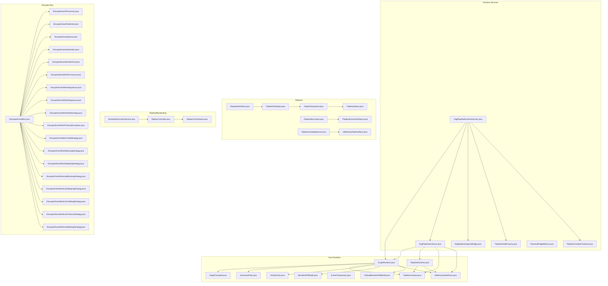

**Diagram sources**
- [GraphRuntime.java](file://pipeline/core/src/main/java/com/tradej/pipeline/runtime/GraphRuntime.java)
- [PipelineRuntime.java](file://pipeline/core/src/main/java/com/tradej/pipeline/runtime/PipelineRuntime.java)
- [GraphCompiler.java](file://pipeline/core/src/main/java/com/tradej/pipeline/runtime/GraphCompiler.java)
- [ExecutionPlan.java](file://pipeline/core/src/main/java/com/tradej/pipeline/runtime/ExecutionPlan.java)
- [PipelineContext.java](file://pipeline/core/src/main/java/com/tradej/pipeline/runtime/PipelineContext.java)
- [VirtualClock.java](file://pipeline/core/src/main/java/com/tradej/pipeline/clock/VirtualClock.java)
- [EventTimestamps.java](file://pipeline/core/src/main/java/com/tradej/pipeline/clock/EventTimestamps.java)
- [BacktestFillModel.java](file://pipeline/core/src/main/java/com/tradej/pipeline/runtime/BacktestFillModel.java)
- [DefaultBacktestFillModel.java](file://pipeline/core/src/main/java/com/tradej/pipeline/runtime/DefaultBacktestFillModel.java)
- [InMemoryStateStore.java](file://pipeline/core/src/main/java/com/tradej/pipeline/state/InMemoryStateStore.java)
- [DagPipelineRuntimeService.java](file://pipeline/runtime/src/main/java/com/tradej/pipeline/service/DagPipelineRuntimeService.java)
- [DagPipelineInstance.java](file://pipeline/runtime/src/main/java/com/tradej/pipeline/service/DagPipelineInstance.java)
- [DagPipelineIngressBridge.java](file://pipeline/runtime/src/main/java/com/tradej/pipeline/service/DagPipelineIngressBridge.java)
- [PipelineNodeFactory.java](file://pipeline/runtime/src/main/java/com/tradej/pipeline/service/PipelineNodeFactory.java)
- [PipelineCompileContexts.java](file://pipeline/runtime/src/main/java/com/tradej/pipeline/service/PipelineCompileContexts.java)
- [ReactorBridgeMetrics.java](file://pipeline/runtime/src/main/java/com/tradej/pipeline/service/reactor/ReactorBridgeMetrics.java)
- [PipelineDefinition.java](file://pipeline/platform/trade-pipeline-platform/src/main/java/com/tradej/pipeline/platform/PipelineDefinition.java)
- [PipelineTemplate.java](file://pipeline/platform/trade-pipeline-platform/src/main/java/com/tradej/pipeline/platform/PipelineTemplate.java)
- [PipelineSnapshot.java](file://pipeline/platform/trade-pipeline-platform/src/main/java/com/tradej/pipeline/platform/PipelineSnapshot.java)
- [PipelineStatus.java](file://pipeline/platform/trade-pipeline-platform/src/main/java/com/tradej/pipeline/platform/PipelineStatus.java)
- [PipelineExecution.java](file://pipeline/platform/trade-pipeline-platform/src/main/java/com/tradej/pipeline/platform/model/PipelineExecution.java)
- [PipelineExecutionStatus.java](file://pipeline/platform/trade-pipeline-platform/src/main/java/com/tradej/pipeline/platform/model/PipelineExecutionStatus.java)
- [PipelineCatalogService.java](file://pipeline/platform/trade-pipeline-platform/src/main/java/com/tradej/pipeline/platform/catalog/PipelineCatalogService.java)
- [InMemoryPipelineStore.java](file://pipeline/platform/trade-pipeline-platform/src/main/java/com/tradej/pipeline/platform/catalog/InMemoryPipelineStore.java)
- [BacktestExecutionService.java](file://replay/engine/src/main/java/com/tradej/replay/engine/BacktestExecutionService.java)
- [ReplayController.java](file://replay/engine/src/main/java/com/tradej/replay/engine/ReplayController.java)
- [ReplayOrchestrator.java](file://replay/engine/src/main/java/com/tradej/replay/engine/ReplayOrchestrator.java)
- [DisruptorEventBus.java](file://runtime/disruptor/src/main/java/com/tradej/disruptor/DisruptorEventBus.java)
- [DisruptorEventProcessor.java](file://runtime/disruptor/src/main/java/com/tradej/disruptor/DisruptorEventProcessor.java)
- [DisruptorEventPublisher.java](file://runtime/disruptor/src/main/java/com/tradej/disruptor/DisruptorEventPublisher.java)
- [DisruptorEventQueue.java](file://runtime/disruptor/src/main/java/com/tradej/disruptor/DisruptorEventQueue.java)
- [DisruptorEventSubscriber.java](file://runtime/disruptor/src/main/java/com/tradej/disruptor/DisruptorEventSubscriber.java)
- [DisruptorEventWorkerPool.java](file://runtime/disruptor/src/main/java/com/tradej/disruptor/DisruptorEventWorkerPool.java)
- [DisruptorEventWorkProcessor.java](file://runtime/disruptor/src/main/java/com/tradej/disruptor/DisruptorEventWorkProcessor.java)
- [DisruptorEventWorkSequencer.java](file://runtime/disruptor/src/main/java/com/tradej/disruptor/DisruptorEventWorkSequencer.java)
- [DisruptorEventWorkSequence.java](file://runtime/disruptor/src/main/java/com/tradej/disruptor/DisruptorEventWorkSequence.java)
- [DisruptorEventWorkWaitStrategy.java](file://runtime/disruptor/src/main/java/com/tradej/disruptor/DisruptorEventWorkWaitStrategy.java)
- [DisruptorEventWorkTimeoutException.java](file://runtime/disruptor/src/main/java/com/tradej/disruptor/DisruptorEventWorkTimeoutException.java)
- [DisruptorEventWorkYieldStrategy.java](file://runtime/disruptor/src/main/java/com/tradej/disruptor/DisruptorEventWorkYieldStrategy.java)
- [DisruptorEventWorkBlockingStrategy.java](file://runtime/disruptor/src/main/java/com/tradej/disruptor/DisruptorEventWorkBlockingStrategy.java)
- [DisruptorEventWorkSleepingStrategy.java](file://runtime/disruptor/src/main/java/com/tradej/disruptor/DisruptorEventWorkSleepingStrategy.java)
- [DisruptorEventWorkLiteBlockingStrategy.java](file://runtime/disruptor/src/main/java/com/tradej/disruptor/DisruptorEventWorkLiteBlockingStrategy.java)
- [DisruptorEventWorkLiteSleepingStrategy.java](file://runtime/disruptor/src/main/java/com/tradej/disruptor/DisruptorEventWorkLiteSleepingStrategy.java)
- [DisruptorEventWorkLiteYieldingStrategy.java](file://runtime/disruptor/src/main/java/com/tradej/disruptor/DisruptorEventWorkLiteYieldingStrategy.java)
- [DisruptorEventWorkLiteTimeoutStrategy.java](file://runtime/disruptor/src/main/java/com/tradej/disruptor/DisruptorEventWorkLiteTimeoutStrategy.java)
- [DisruptorEventWorkLiteWaitingStrategy.java](file://runtime/disruptor/src/main/java/com/tradej/disruptor/DisruptorEventWorkLiteWaitingStrategy.java)

**Section sources**
- [GraphRuntime.java](file://pipeline/core/src/main/java/com/tradej/pipeline/runtime/GraphRuntime.java)
- [PipelineRuntime.java](file://pipeline/core/src/main/java/com/tradej/pipeline/runtime/PipelineRuntime.java)
- [DagPipelineRuntimeService.java](file://pipeline/runtime/src/main/java/com/tradej/pipeline/service/DagPipelineRuntimeService.java)
- [DagPipelineInstance.java](file://pipeline/runtime/src/main/java/com/tradej/pipeline/service/DagPipelineInstance.java)

## Core Components
- GraphRuntime: Executes a compiled DAG of pipeline nodes against a virtual clock and backtest fill model, managing node lifecycles and state.
- PipelineRuntime: Defines the runtime contract and orchestrates execution contexts and state stores.
- VirtualClock and EventTimestamps: Provide deterministic time semantics for backtests and replay.
- BacktestFillModel and DefaultBacktestFillModel: Model simulated fills for backtesting and replay.
- ExecutionPlan and GraphCompiler: Compile the logical pipeline graph into an executable plan.
- PipelineContext: Carries runtime context for nodes during execution.
- InMemoryStateStore: Provides in-memory state persistence for pipeline instances.
- DagPipelineRuntimeService: Manages pipeline instance lifecycle, scheduling, and ingress bridging.
- DagPipelineInstance: Encapsulates a single pipeline execution instance with its runtime and state.
- Platform artifacts: PipelineDefinition, PipelineTemplate, PipelineSnapshot, PipelineStatus, PipelineExecution, PipelineExecutionStatus, PipelineCatalogService, and InMemoryPipelineStore define the platform layer for pipeline management and metadata.

**Section sources**
- [GraphRuntime.java](file://pipeline/core/src/main/java/com/tradej/pipeline/runtime/GraphRuntime.java)
- [PipelineRuntime.java](file://pipeline/core/src/main/java/com/tradej/pipeline/runtime/PipelineRuntime.java)
- [VirtualClock.java](file://pipeline/core/src/main/java/com/tradej/pipeline/clock/VirtualClock.java)
- [EventTimestamps.java](file://pipeline/core/src/main/java/com/tradej/pipeline/clock/EventTimestamps.java)
- [BacktestFillModel.java](file://pipeline/core/src/main/java/com/tradej/pipeline/runtime/BacktestFillModel.java)
- [DefaultBacktestFillModel.java](file://pipeline/core/src/main/java/com/tradej/pipeline/runtime/DefaultBacktestFillModel.java)
- [ExecutionPlan.java](file://pipeline/core/src/main/java/com/tradej/pipeline/runtime/ExecutionPlan.java)
- [GraphCompiler.java](file://pipeline/core/src/main/java/com/tradej/pipeline/runtime/GraphCompiler.java)
- [PipelineContext.java](file://pipeline/core/src/main/java/com/tradej/pipeline/runtime/PipelineContext.java)
- [InMemoryStateStore.java](file://pipeline/core/src/main/java/com/tradej/pipeline/state/InMemoryStateStore.java)
- [DagPipelineRuntimeService.java](file://pipeline/runtime/src/main/java/com/tradej/pipeline/service/DagPipelineRuntimeService.java)
- [DagPipelineInstance.java](file://pipeline/runtime/src/main/java/com/tradej/pipeline/service/DagPipelineInstance.java)
- [PipelineDefinition.java](file://pipeline/platform/trade-pipeline-platform/src/main/java/com/tradej/pipeline/platform/PipelineDefinition.java)
- [PipelineTemplate.java](file://pipeline/platform/trade-pipeline-platform/src/main/java/com/tradej/pipeline/platform/PipelineTemplate.java)
- [PipelineSnapshot.java](file://pipeline/platform/trade-pipeline-platform/src/main/java/com/tradej/pipeline/platform/PipelineSnapshot.java)
- [PipelineStatus.java](file://pipeline/platform/trade-pipeline-platform/src/main/java/com/tradej/pipeline/platform/PipelineStatus.java)
- [PipelineExecution.java](file://pipeline/platform/trade-pipeline-platform/src/main/java/com/tradej/pipeline/platform/model/PipelineExecution.java)
- [PipelineExecutionStatus.java](file://pipeline/platform/trade-pipeline-platform/src/main/java/com/tradej/pipeline/platform/model/PipelineExecutionStatus.java)
- [PipelineCatalogService.java](file://pipeline/platform/trade-pipeline-platform/src/main/java/com/tradej/pipeline/platform/catalog/PipelineCatalogService.java)
- [InMemoryPipelineStore.java](file://pipeline/platform/trade-pipeline-platform/src/main/java/com/tradej/pipeline/platform/catalog/InMemoryPipelineStore.java)

## Architecture Overview
The runtime engine executes a DAG of pipeline nodes with deterministic time semantics and optional backtest fill modeling. The service layer manages instances, schedules execution, bridges ingress events, and coordinates with the disruptor bus for high-throughput real-time processing. The platform layer defines pipeline templates, snapshots, and execution metadata.

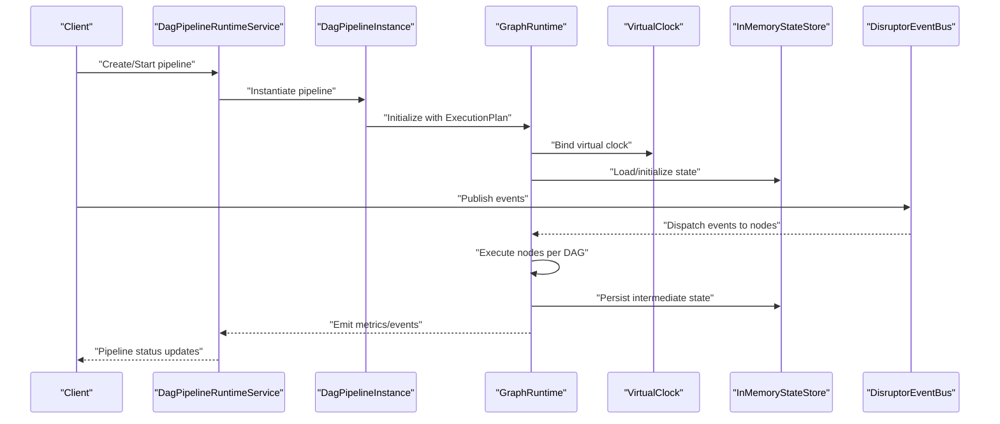

**Diagram sources**
- [DagPipelineRuntimeService.java](file://pipeline/runtime/src/main/java/com/tradej/pipeline/service/DagPipelineRuntimeService.java)
- [DagPipelineInstance.java](file://pipeline/runtime/src/main/java/com/tradej/pipeline/service/DagPipelineInstance.java)
- [GraphRuntime.java](file://pipeline/core/src/main/java/com/tradej/pipeline/runtime/GraphRuntime.java)
- [VirtualClock.java](file://pipeline/core/src/main/java/com/tradej/pipeline/clock/VirtualClock.java)
- [InMemoryStateStore.java](file://pipeline/core/src/main/java/com/tradej/pipeline/state/InMemoryStateStore.java)
- [DisruptorEventBus.java](file://runtime/disruptor/src/main/java/com/tradej/disruptor/DisruptorEventBus.java)

## Detailed Component Analysis

### GraphRuntime and PipelineRuntime
GraphRuntime executes a compiled pipeline graph against a virtual clock and backtest fill model. It manages node execution order, state transitions, and metrics. PipelineRuntime defines the runtime contract and context for execution.

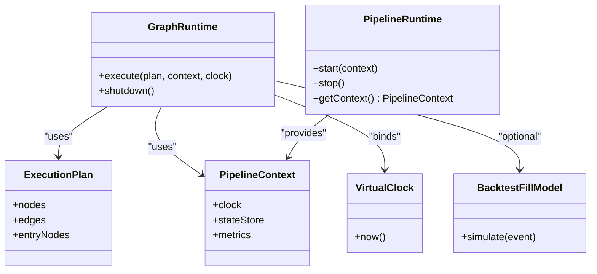

**Diagram sources**
- [GraphRuntime.java](file://pipeline/core/src/main/java/com/tradej/pipeline/runtime/GraphRuntime.java)
- [PipelineRuntime.java](file://pipeline/core/src/main/java/com/tradej/pipeline/runtime/PipelineRuntime.java)
- [ExecutionPlan.java](file://pipeline/core/src/main/java/com/tradej/pipeline/runtime/ExecutionPlan.java)
- [PipelineContext.java](file://pipeline/core/src/main/java/com/tradej/pipeline/runtime/PipelineContext.java)
- [VirtualClock.java](file://pipeline/core/src/main/java/com/tradej/pipeline/clock/VirtualClock.java)
- [BacktestFillModel.java](file://pipeline/core/src/main/java/com/tradej/pipeline/runtime/BacktestFillModel.java)

**Section sources**
- [GraphRuntime.java](file://pipeline/core/src/main/java/com/tradej/pipeline/runtime/GraphRuntime.java)
- [PipelineRuntime.java](file://pipeline/core/src/main/java/com/tradej/pipeline/runtime/PipelineRuntime.java)
- [ExecutionPlan.java](file://pipeline/core/src/main/java/com/tradej/pipeline/runtime/ExecutionPlan.java)
- [PipelineContext.java](file://pipeline/core/src/main/java/com/tradej/pipeline/runtime/PipelineContext.java)

### Pipeline Instance Management
DagPipelineRuntimeService creates and manages pipeline instances, while DagPipelineInstance encapsulates a single execution instance. It binds GraphRuntime, maintains state via InMemoryStateStore, and integrates with PipelineContext.

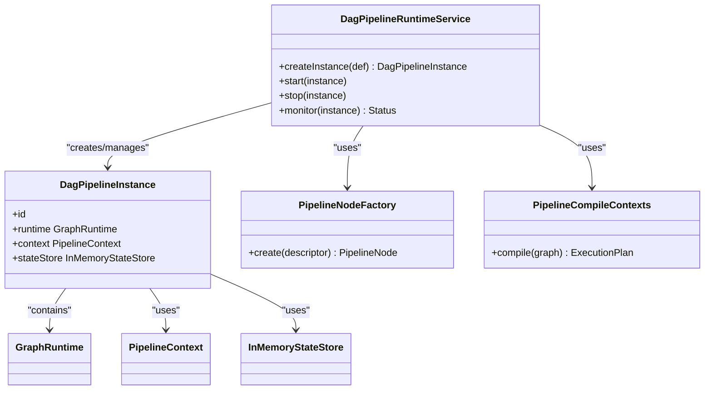

**Diagram sources**
- [DagPipelineRuntimeService.java](file://pipeline/runtime/src/main/java/com/tradej/pipeline/service/DagPipelineRuntimeService.java)
- [DagPipelineInstance.java](file://pipeline/runtime/src/main/java/com/tradej/pipeline/service/DagPipelineInstance.java)
- [PipelineNodeFactory.java](file://pipeline/runtime/src/main/java/com/tradej/pipeline/service/PipelineNodeFactory.java)
- [PipelineCompileContexts.java](file://pipeline/runtime/src/main/java/com/tradej/pipeline/service/PipelineCompileContexts.java)
- [GraphRuntime.java](file://pipeline/core/src/main/java/com/tradej/pipeline/runtime/GraphRuntime.java)
- [PipelineContext.java](file://pipeline/core/src/main/java/com/tradej/pipeline/runtime/PipelineContext.java)
- [InMemoryStateStore.java](file://pipeline/core/src/main/java/com/tradej/pipeline/state/InMemoryStateStore.java)

**Section sources**
- [DagPipelineRuntimeService.java](file://pipeline/runtime/src/main/java/com/tradej/pipeline/service/DagPipelineRuntimeService.java)
- [DagPipelineInstance.java](file://pipeline/runtime/src/main/java/com/tradej/pipeline/service/DagPipelineInstance.java)
- [PipelineNodeFactory.java](file://pipeline/runtime/src/main/java/com/tradej/pipeline/service/PipelineNodeFactory.java)
- [PipelineCompileContexts.java](file://pipeline/runtime/src/main/java/com/tradej/pipeline/service/PipelineCompileContexts.java)

### Virtual Clock Integration
VirtualClock provides deterministic timestamps for backtests and replay. EventTimestamps captures event timing metadata for reproducibility.

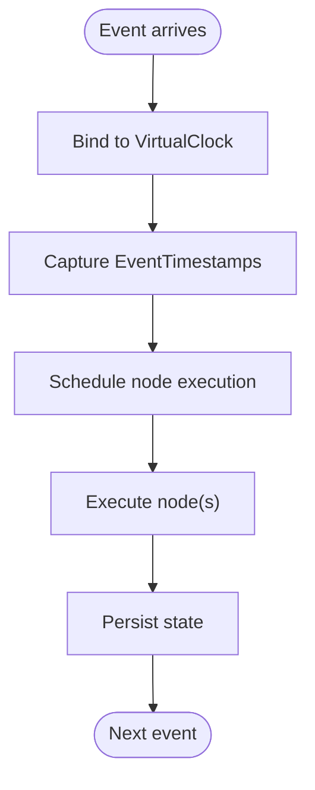

**Diagram sources**
- [VirtualClock.java](file://pipeline/core/src/main/java/com/tradej/pipeline/clock/VirtualClock.java)
- [EventTimestamps.java](file://pipeline/core/src/main/java/com/tradej/pipeline/clock/EventTimestamps.java)

**Section sources**
- [VirtualClock.java](file://pipeline/core/src/main/java/com/tradej/pipeline/clock/VirtualClock.java)
- [EventTimestamps.java](file://pipeline/core/src/main/java/com/tradej/pipeline/clock/EventTimestamps.java)

### Backtest Fill Modeling
BacktestFillModel simulates fills for backtesting and replay. DefaultBacktestFillModel provides a baseline implementation.

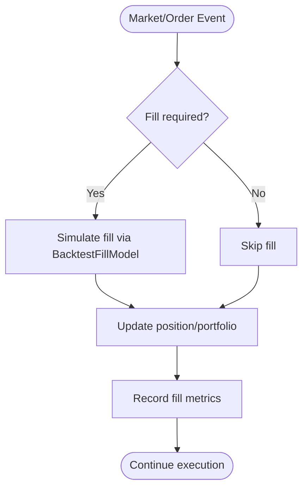

**Diagram sources**
- [BacktestFillModel.java](file://pipeline/core/src/main/java/com/tradej/pipeline/runtime/BacktestFillModel.java)
- [DefaultBacktestFillModel.java](file://pipeline/core/src/main/java/com/tradej/pipeline/runtime/DefaultBacktestFillModel.java)

**Section sources**
- [BacktestFillModel.java](file://pipeline/core/src/main/java/com/tradej/pipeline/runtime/BacktestFillModel.java)
- [DefaultBacktestFillModel.java](file://pipeline/core/src/main/java/com/tradej/pipeline/runtime/DefaultBacktestFillModel.java)

### Reactive Pipeline Node Execution
ReactorBridge enables reactive node execution and integrates metrics collection for throughput and latency visibility.

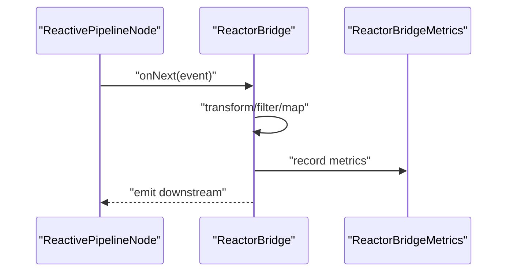

**Diagram sources**
- [ReactorBridge.java](file://pipeline/core/src/main/java/com/tradej/pipeline/reactor/ReactorBridge.java)
- [ReactorBridgeMetrics.java](file://pipeline/runtime/src/main/java/com/tradej/pipeline/service/reactor/ReactorBridgeMetrics.java)

**Section sources**
- [ReactorBridge.java](file://pipeline/core/src/main/java/com/tradej/pipeline/reactor/ReactorBridge.java)
- [ReactorBridgeMetrics.java](file://pipeline/runtime/src/main/java/com/tradej/pipeline/service/reactor/ReactorBridgeMetrics.java)

### Disruptor Bus Integration
The disruptor bus provides high-throughput, low-latency event distribution across pipeline nodes. It supports worker pools, work processors, wait strategies, and sequencers.

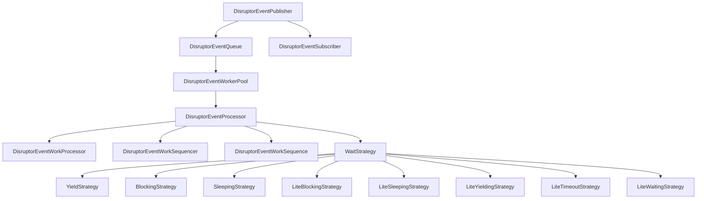

**Diagram sources**
- [DisruptorEventBus.java](file://runtime/disruptor/src/main/java/com/tradej/disruptor/DisruptorEventBus.java)
- [DisruptorEventPublisher.java](file://runtime/disruptor/src/main/java/com/tradej/disruptor/DisruptorEventPublisher.java)
- [DisruptorEventQueue.java](file://runtime/disruptor/src/main/java/com/tradej/disruptor/DisruptorEventQueue.java)
- [DisruptorEventWorkerPool.java](file://runtime/disruptor/src/main/java/com/tradej/disruptor/DisruptorEventWorkerPool.java)
- [DisruptorEventProcessor.java](file://runtime/disruptor/src/main/java/com/tradej/disruptor/DisruptorEventProcessor.java)
- [DisruptorEventWorkProcessor.java](file://runtime/disruptor/src/main/java/com/tradej/disruptor/DisruptorEventWorkProcessor.java)
- [DisruptorEventWorkSequencer.java](file://runtime/disruptor/src/main/java/com/tradej/disruptor/DisruptorEventWorkSequencer.java)
- [DisruptorEventWorkSequence.java](file://runtime/disruptor/src/main/java/com/tradej/disruptor/DisruptorEventWorkSequence.java)
- [DisruptorEventWorkWaitStrategy.java](file://runtime/disruptor/src/main/java/com/tradej/disruptor/DisruptorEventWorkWaitStrategy.java)
- [DisruptorEventWorkYieldStrategy.java](file://runtime/disruptor/src/main/java/com/tradej/disruptor/DisruptorEventWorkYieldStrategy.java)
- [DisruptorEventWorkBlockingStrategy.java](file://runtime/disruptor/src/main/java/com/tradej/disruptor/DisruptorEventWorkBlockingStrategy.java)
- [DisruptorEventWorkSleepingStrategy.java](file://runtime/disruptor/src/main/java/com/tradej/disruptor/DisruptorEventWorkSleepingStrategy.java)
- [DisruptorEventWorkLiteBlockingStrategy.java](file://runtime/disruptor/src/main/java/com/tradej/disruptor/DisruptorEventWorkLiteBlockingStrategy.java)
- [DisruptorEventWorkLiteSleepingStrategy.java](file://runtime/disruptor/src/main/java/com/tradej/disruptor/DisruptorEventWorkLiteSleepingStrategy.java)
- [DisruptorEventWorkLiteYieldingStrategy.java](file://runtime/disruptor/src/main/java/com/tradej/disruptor/DisruptorEventWorkLiteYieldingStrategy.java)
- [DisruptorEventWorkLiteTimeoutStrategy.java](file://runtime/disruptor/src/main/java/com/tradej/disruptor/DisruptorEventWorkLiteTimeoutStrategy.java)
- [DisruptorEventWorkLiteWaitingStrategy.java](file://runtime/disruptor/src/main/java/com/tradej/disruptor/DisruptorEventWorkLiteWaitingStrategy.java)

**Section sources**
- [DisruptorEventBus.java](file://runtime/disruptor/src/main/java/com/tradej/disruptor/DisruptorEventBus.java)
- [DisruptorEventPublisher.java](file://runtime/disruptor/src/main/java/com/tradej/disruptor/DisruptorEventPublisher.java)
- [DisruptorEventQueue.java](file://runtime/disruptor/src/main/java/com/tradej/disruptor/DisruptorEventQueue.java)
- [DisruptorEventWorkerPool.java](file://runtime/disruptor/src/main/java/com/tradej/disruptor/DisruptorEventWorkerPool.java)
- [DisruptorEventProcessor.java](file://runtime/disruptor/src/main/java/com/tradej/disruptor/DisruptorEventProcessor.java)
- [DisruptorEventWorkProcessor.java](file://runtime/disruptor/src/main/java/com/tradej/disruptor/DisruptorEventWorkProcessor.java)
- [DisruptorEventWorkSequencer.java](file://runtime/disruptor/src/main/java/com/tradej/disruptor/DisruptorEventWorkSequencer.java)
- [DisruptorEventWorkSequence.java](file://runtime/disruptor/src/main/java/com/tradej/disruptor/DisruptorEventWorkSequence.java)
- [DisruptorEventWorkWaitStrategy.java](file://runtime/disruptor/src/main/java/com/tradej/disruptor/DisruptorEventWorkWaitStrategy.java)
- [DisruptorEventWorkYieldStrategy.java](file://runtime/disruptor/src/main/java/com/tradej/disruptor/DisruptorEventWorkYieldStrategy.java)
- [DisruptorEventWorkBlockingStrategy.java](file://runtime/disruptor/src/main/java/com/tradej/disruptor/DisruptorEventWorkBlockingStrategy.java)
- [DisruptorEventWorkSleepingStrategy.java](file://runtime/disruptor/src/main/java/com/tradej/disruptor/DisruptorEventWorkSleepingStrategy.java)
- [DisruptorEventWorkLiteBlockingStrategy.java](file://runtime/disruptor/src/main/java/com/tradej/disruptor/DisruptorEventWorkLiteBlockingStrategy.java)
- [DisruptorEventWorkLiteSleepingStrategy.java](file://runtime/disruptor/src/main/java/com/tradej/disruptor/DisruptorEventWorkLiteSleepingStrategy.java)
- [DisruptorEventWorkLiteYieldingStrategy.java](file://runtime/disruptor/src/main/java/com/tradej/disruptor/DisruptorEventWorkLiteYieldingStrategy.java)
- [DisruptorEventWorkLiteTimeoutStrategy.java](file://runtime/disruptor/src/main/java/com/tradej/disruptor/DisruptorEventWorkLiteTimeoutStrategy.java)
- [DisruptorEventWorkLiteWaitingStrategy.java](file://runtime/disruptor/src/main/java/com/tradej/disruptor/DisruptorEventWorkLiteWaitingStrategy.java)

### Pipeline Definition and Catalog
Platform artifacts define templates, snapshots, statuses, and execution records. Catalog services manage pipeline storage and retrieval.

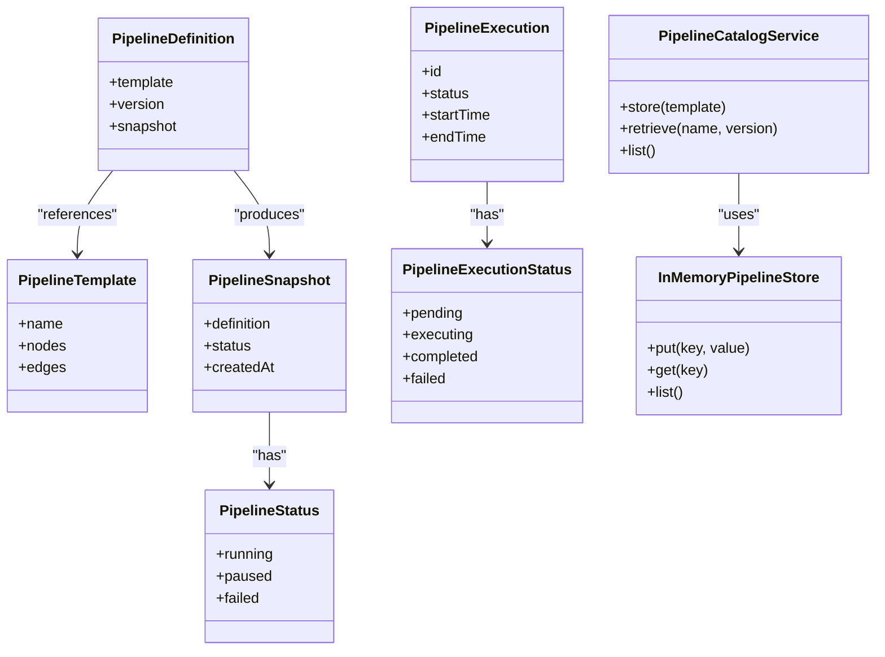

**Diagram sources**
- [PipelineDefinition.java](file://pipeline/platform/trade-pipeline-platform/src/main/java/com/tradej/pipeline/platform/PipelineDefinition.java)
- [PipelineTemplate.java](file://pipeline/platform/trade-pipeline-platform/src/main/java/com/tradej/pipeline/platform/PipelineTemplate.java)
- [PipelineSnapshot.java](file://pipeline/platform/trade-pipeline-platform/src/main/java/com/tradej/pipeline/platform/PipelineSnapshot.java)
- [PipelineStatus.java](file://pipeline/platform/trade-pipeline-platform/src/main/java/com/tradej/pipeline/platform/PipelineStatus.java)
- [PipelineExecution.java](file://pipeline/platform/trade-pipeline-platform/src/main/java/com/tradej/pipeline/platform/model/PipelineExecution.java)
- [PipelineExecutionStatus.java](file://pipeline/platform/trade-pipeline-platform/src/main/java/com/tradej/pipeline/platform/model/PipelineExecutionStatus.java)
- [PipelineCatalogService.java](file://pipeline/platform/trade-pipeline-platform/src/main/java/com/tradej/pipeline/platform/catalog/PipelineCatalogService.java)
- [InMemoryPipelineStore.java](file://pipeline/platform/trade-pipeline-platform/src/main/java/com/tradej/pipeline/platform/catalog/InMemoryPipelineStore.java)

**Section sources**
- [PipelineDefinition.java](file://pipeline/platform/trade-pipeline-platform/src/main/java/com/tradej/pipeline/platform/PipelineDefinition.java)
- [PipelineTemplate.java](file://pipeline/platform/trade-pipeline-platform/src/main/java/com/tradej/pipeline/platform/PipelineTemplate.java)
- [PipelineSnapshot.java](file://pipeline/platform/trade-pipeline-platform/src/main/java/com/tradej/pipeline/platform/PipelineSnapshot.java)
- [PipelineStatus.java](file://pipeline/platform/trade-pipeline-platform/src/main/java/com/tradej/pipeline/platform/PipelineStatus.java)
- [PipelineExecution.java](file://pipeline/platform/trade-pipeline-platform/src/main/java/com/tradej/pipeline/platform/model/PipelineExecution.java)
- [PipelineExecutionStatus.java](file://pipeline/platform/trade-pipeline-platform/src/main/java/com/tradej/pipeline/platform/model/PipelineExecutionStatus.java)
- [PipelineCatalogService.java](file://pipeline/platform/trade-pipeline-platform/src/main/java/com/tradej/pipeline/platform/catalog/PipelineCatalogService.java)
- [InMemoryPipelineStore.java](file://pipeline/platform/trade-pipeline-platform/src/main/java/com/tradej/pipeline/platform/catalog/InMemoryPipelineStore.java)

### Backtest and Replay Orchestration
BacktestExecutionService, ReplayController, and ReplayOrchestrator coordinate historical playback and parity verification.

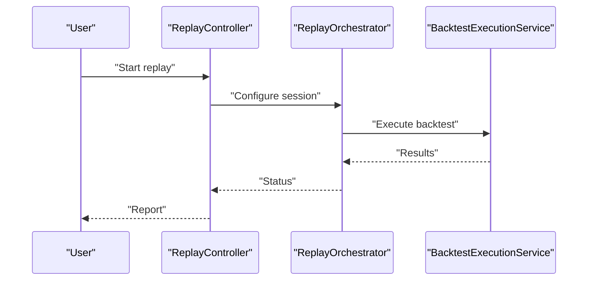

**Diagram sources**
- [BacktestExecutionService.java](file://replay/engine/src/main/java/com/tradej/replay/engine/BacktestExecutionService.java)
- [ReplayController.java](file://replay/engine/src/main/java/com/tradej/replay/engine/ReplayController.java)
- [ReplayOrchestrator.java](file://replay/engine/src/main/java/com/tradej/replay/engine/ReplayOrchestrator.java)

**Section sources**
- [BacktestExecutionService.java](file://replay/engine/src/main/java/com/tradej/replay/engine/BacktestExecutionService.java)
- [ReplayController.java](file://replay/engine/src/main/java/com/tradej/replay/engine/ReplayController.java)
- [ReplayOrchestrator.java](file://replay/engine/src/main/java/com/tradej/replay/engine/ReplayOrchestrator.java)

## Dependency Analysis
The runtime engine exhibits layered cohesion:
- Core runtime depends on graph compilation, virtual clock, state store, and backtest fill modeling.
- Runtime services depend on core runtime and platform artifacts for orchestration and cataloging.
- Disruptor bus provides decoupled, high-throughput event distribution.
- Platform layer manages pipeline definitions and execution metadata.

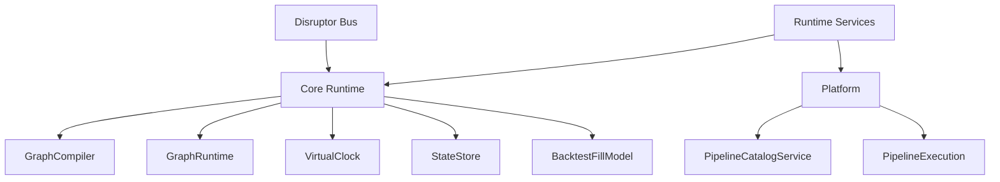

**Diagram sources**
- [GraphRuntime.java](file://pipeline/core/src/main/java/com/tradej/pipeline/runtime/GraphRuntime.java)
- [GraphCompiler.java](file://pipeline/core/src/main/java/com/tradej/pipeline/runtime/GraphCompiler.java)
- [VirtualClock.java](file://pipeline/core/src/main/java/com/tradej/pipeline/clock/VirtualClock.java)
- [StateStore.java](file://pipeline/core/src/main/java/com/tradej/pipeline/state/StateStore.java)
- [BacktestFillModel.java](file://pipeline/core/src/main/java/com/tradej/pipeline/runtime/BacktestFillModel.java)
- [DagPipelineRuntimeService.java](file://pipeline/runtime/src/main/java/com/tradej/pipeline/service/DagPipelineRuntimeService.java)
- [PipelineCatalogService.java](file://pipeline/platform/trade-pipeline-platform/src/main/java/com/tradej/pipeline/platform/catalog/PipelineCatalogService.java)
- [PipelineExecution.java](file://pipeline/platform/trade-pipeline-platform/src/main/java/com/tradej/pipeline/platform/model/PipelineExecution.java)
- [DisruptorEventBus.java](file://runtime/disruptor/src/main/java/com/tradej/disruptor/DisruptorEventBus.java)

**Section sources**
- [GraphRuntime.java](file://pipeline/core/src/main/java/com/tradej/pipeline/runtime/GraphRuntime.java)
- [GraphCompiler.java](file://pipeline/core/src/main/java/com/tradej/pipeline/runtime/GraphCompiler.java)
- [VirtualClock.java](file://pipeline/core/src/main/java/com/tradej/pipeline/clock/VirtualClock.java)
- [StateStore.java](file://pipeline/core/src/main/java/com/tradej/pipeline/state/StateStore.java)
- [BacktestFillModel.java](file://pipeline/core/src/main/java/com/tradej/pipeline/runtime/BacktestFillModel.java)
- [DagPipelineRuntimeService.java](file://pipeline/runtime/src/main/java/com/tradej/pipeline/service/DagPipelineRuntimeService.java)
- [PipelineCatalogService.java](file://pipeline/platform/trade-pipeline-platform/src/main/java/com/tradej/pipeline/platform/catalog/PipelineCatalogService.java)
- [PipelineExecution.java](file://pipeline/platform/trade-pipeline-platform/src/main/java/com/tradej/pipeline/platform/model/PipelineExecution.java)
- [DisruptorEventBus.java](file://runtime/disruptor/src/main/java/com/tradej/disruptor/DisruptorEventBus.java)

## Performance Considerations
- Use the disruptor bus for high-throughput event ingestion and distribution to minimize contention and latency.
- Prefer in-memory state stores for fast reads/writes during backtests; consider persistence boundaries for long-running live sessions.
- Tune virtual clock granularity to balance determinism and performance.
- Monitor node metrics via ReactorBridgeMetrics and NodeMetrics to identify bottlenecks.
- Optimize backtest fill modeling to reduce overhead in synthetic simulations.
- Batch and coalesce events where safe to reduce scheduler churn.

[No sources needed since this section provides general guidance]

## Troubleshooting Guide
Common issues and remedies:
- Pipeline stalls: Inspect GraphRuntime execution logs and NodeMetrics for blocked nodes.
- Clock drift in backtests: Verify VirtualClock binding and EventTimestamps alignment.
- State inconsistencies: Validate InMemoryStateStore usage and transaction boundaries.
- Backtest parity mismatches: Cross-check BacktestFillModel behavior and ReplayController configuration.
- Disruptor throughput bottlenecks: Review worker pool sizing, wait strategies, and queue depths.

**Section sources**
- [GraphRuntime.java](file://pipeline/core/src/main/java/com/tradej/pipeline/runtime/GraphRuntime.java)
- [NodeMetrics.java](file://pipeline/core/src/main/java/com/tradej/pipeline/runtime/NodeMetrics.java)
- [VirtualClock.java](file://pipeline/core/src/main/java/com/tradej/pipeline/clock/VirtualClock.java)
- [EventTimestamps.java](file://pipeline/core/src/main/java/com/tradej/pipeline/clock/EventTimestamps.java)
- [BacktestFillModel.java](file://pipeline/core/src/main/java/com/tradej/pipeline/runtime/BacktestFillModel.java)
- [ReplayController.java](file://replay/engine/src/main/java/com/tradej/replay/engine/ReplayController.java)
- [DisruptorEventBus.java](file://runtime/disruptor/src/main/java/com/tradej/disruptor/DisruptorEventBus.java)

## Conclusion
The pipeline runtime engine combines a DAG-based execution model with deterministic virtual clocks, robust state management, and high-throughput event processing via the disruptor bus. The platform layer provides template-driven pipeline management and execution metadata. Together, these components enable scalable, observable, and reproducible pipeline execution suitable for both live trading and backtesting.

[No sources needed since this section summarizes without analyzing specific files]

## Appendices

### Practical Examples
- Instantiating and starting a pipeline:
  - Use DagPipelineRuntimeService.createInstance with a PipelineDefinition and start the instance.
  - Reference: [DagPipelineRuntimeService.java](file://pipeline/runtime/src/main/java/com/tradej/pipeline/service/DagPipelineRuntimeService.java), [PipelineDefinition.java](file://pipeline/platform/trade-pipeline-platform/src/main/java/com/tradej/pipeline/platform/PipelineDefinition.java)
- Monitoring execution:
  - Observe ReactorBridgeMetrics and NodeMetrics emitted by GraphRuntime.
  - Reference: [ReactorBridgeMetrics.java](file://pipeline/runtime/src/main/java/com/tradej/pipeline/service/reactor/ReactorBridgeMetrics.java), [NodeMetrics.java](file://pipeline/core/src/main/java/com/tradej/pipeline/runtime/NodeMetrics.java)
- Performance optimization:
  - Adjust disruptor worker pool sizes and wait strategies; tune virtual clock tick intervals; optimize backtest fill model.
  - References: [DisruptorEventBus.java](file://runtime/disruptor/src/main/java/com/tradej/disruptor/DisruptorEventBus.java), [VirtualClock.java](file://pipeline/core/src/main/java/com/tradej/pipeline/clock/VirtualClock.java), [BacktestFillModel.java](file://pipeline/core/src/main/java/com/tradej/pipeline/runtime/BacktestFillModel.java)

**Section sources**
- [DagPipelineRuntimeService.java](file://pipeline/runtime/src/main/java/com/tradej/pipeline/service/DagPipelineRuntimeService.java)
- [PipelineDefinition.java](file://pipeline/platform/trade-pipeline-platform/src/main/java/com/tradej/pipeline/platform/PipelineDefinition.java)
- [ReactorBridgeMetrics.java](file://pipeline/runtime/src/main/java/com/tradej/pipeline/service/reactor/ReactorBridgeMetrics.java)
- [NodeMetrics.java](file://pipeline/core/src/main/java/com/tradej/pipeline/runtime/NodeMetrics.java)
- [DisruptorEventBus.java](file://runtime/disruptor/src/main/java/com/tradej/disruptor/DisruptorEventBus.java)
- [VirtualClock.java](file://pipeline/core/src/main/java/com/tradej/pipeline/clock/VirtualClock.java)
- [BacktestFillModel.java](file://pipeline/core/src/main/java/com/tradej/pipeline/runtime/BacktestFillModel.java)