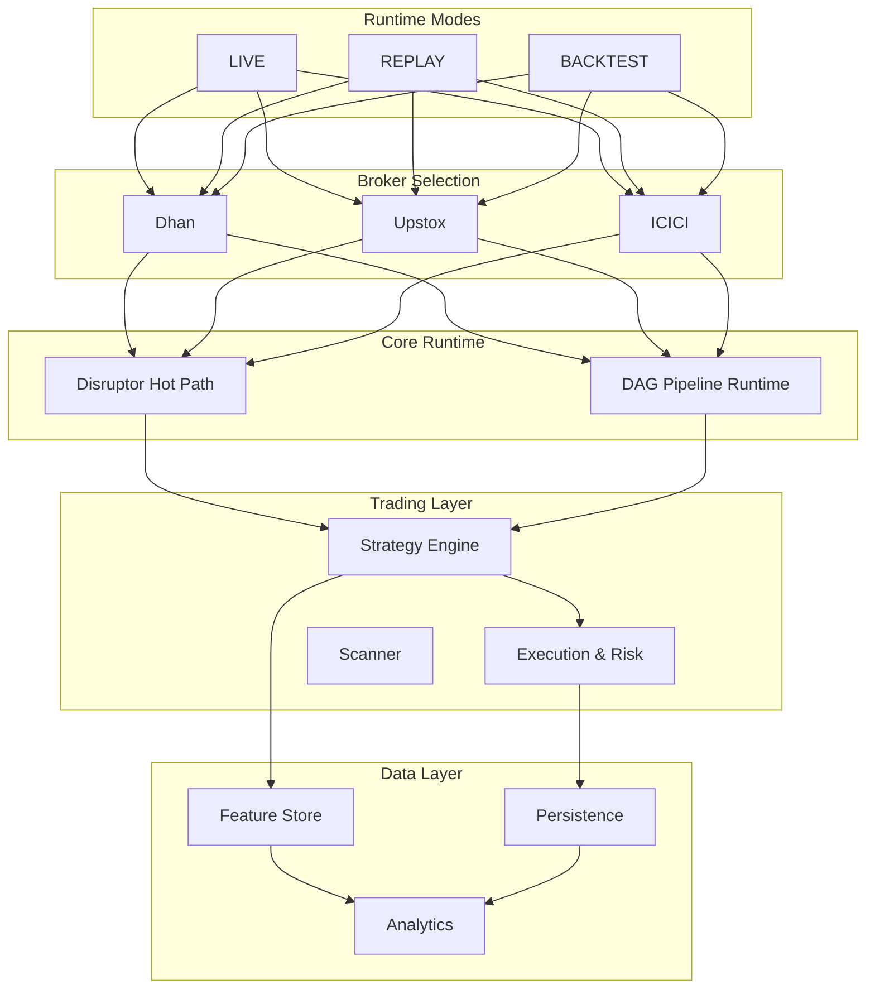
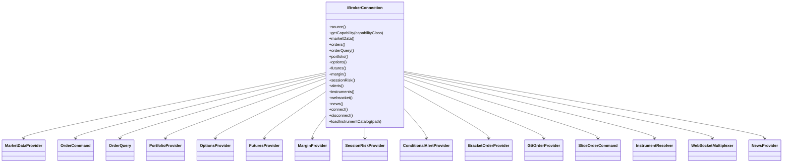
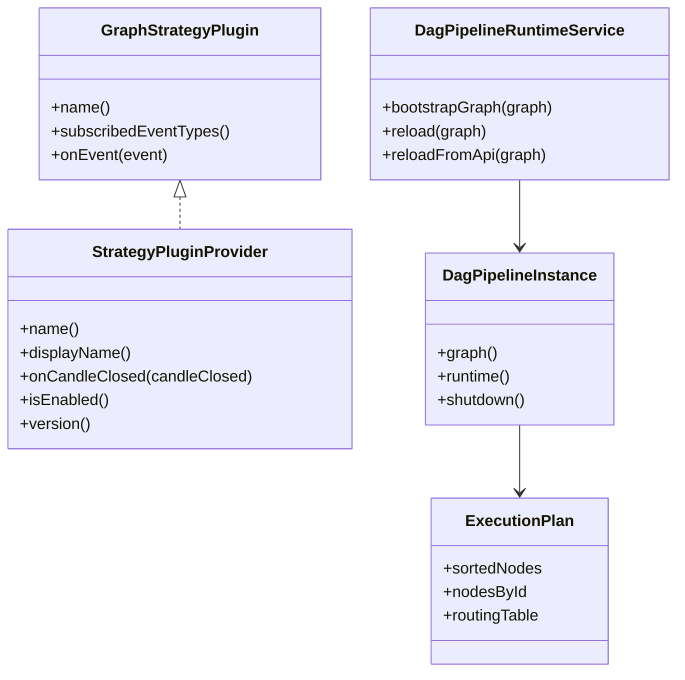
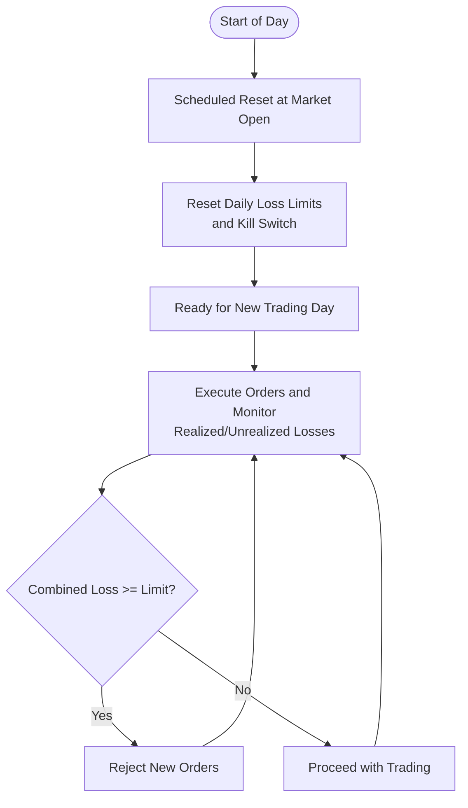
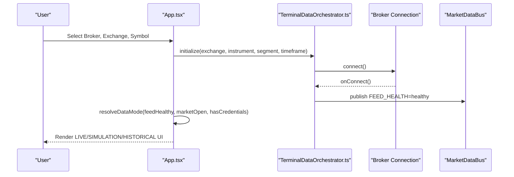
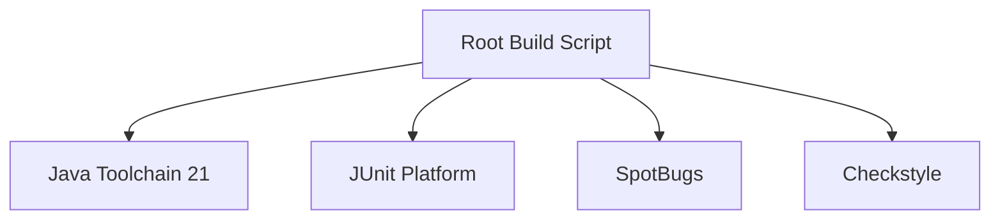

# Project Overview

<cite>
**Referenced Files in This Document**
- [README.md](file://README.md)
- [docs/ARCHITECTURE.md](file://docs/ARCHITECTURE.md)
- [app/src/main/resources/application.yml](file://app/src/main/resources/application.yml)
- [build.gradle](file://build.gradle)
- [settings.gradle](file://settings.gradle)
- [broker/api/src/main/java/com/tradej/broker/api/IBrokerConnection.java](file://broker/api/src/main/java/com/tradej/broker/api/IBrokerConnection.java)
- [trading/strategy/src/main/java/com/tradej/strategy/api/GraphStrategyPlugin.java](file://trading/strategy/src/main/java/com/tradej/strategy/api/GraphStrategyPlugin.java)
- [trading/strategy/src/main/java/com/tradej/strategy/api/StrategyPluginProvider.java](file://trading/strategy/src/main/java/com/tradej/strategy/api/StrategyPluginProvider.java)
- [trading/execution/src/main/java/com/tradej/execution/risk/DailyRiskResetScheduler.java](file://trading/execution/src/main/java/com/tradej/execution/risk/DailyRiskResetScheduler.java)
- [trading/execution/src/main/java/com/tradej/execution/risk/DailyLossRiskCheck.java](file://trading/execution/src/main/java/com/tradej/execution/risk/DailyLossRiskCheck.java)
- [pipeline/runtime/src/main/java/com/tradej/pipeline/service/DagPipelineRuntimeService.java](file://pipeline/runtime/src/main/java/com/tradej/pipeline/service/DagPipelineRuntimeService.java)
- [pipeline/runtime/src/main/java/com/tradej/pipeline/service/DagPipelineInstance.java](file://pipeline/runtime/src/main/java/com/tradej/pipeline/service/DagPipelineInstance.java)
- [pipeline/core/src/main/java/com/tradej/pipeline/runtime/ExecutionPlan.java](file://pipeline/core/src/main/java/com/tradej/pipeline/runtime/ExecutionPlan.java)
- [trade_j_frontend/src/App.tsx](file://trade_j_frontend/src/App.tsx)
- [trade_j_frontend/src/api/DataModeResolver.ts](file://trade_j_frontend/src/api/DataModeResolver.ts)
- [trade_j_frontend/src/api/TerminalDataOrchestrator.ts](file://trade_j_frontend/src/api/TerminalDataOrchestrator.ts)
</cite>

## Table of Contents
1. [Introduction](#introduction)
2. [Project Structure](#project-structure)
3. [Core Components](#core-components)
4. [Architecture Overview](#architecture-overview)
5. [Detailed Component Analysis](#detailed-component-analysis)
6. [Dependency Analysis](#dependency-analysis)
7. [Performance Considerations](#performance-considerations)
8. [Troubleshooting Guide](#troubleshooting-guide)
9. [Conclusion](#conclusion)
10. [Appendices](#appendices)

## Introduction
Trade-J is a Java 21 trading platform designed to deliver a modern, modular, and extensible solution for live market data ingestion, order management, risk control, strategy plugins, and multi-broker integration. It supports live feeds from Dhan and Upstox, with optional analytics-only mode for Upstox via REST, and provides a robust foundation for building trading strategies, performing backtesting, and operating in replay mode for deterministic analysis.

Key platform goals:
- Unified brokerage abstraction with pluggable adapters
- Real-time and historical market data pipelines
- Order Management System (OMS) with configurable risk controls
- Extensible strategy plugin framework
- Advanced analytics and scanning capabilities
- Replay/backtest engines for validation and research

Target audience:
- Quantitative traders, hedge funds, and proprietary trading firms requiring multi-broker support and advanced analytics
- Developers building trading applications, research tools, and automated strategies
- Firms needing replay/backtest environments for strategy development and compliance

## Project Structure
The repository follows a multi-module Gradle layout with clear separation of concerns across core, trading, data, runtime, broker, gateway, and CLI layers. Modules are organized by responsibility and layered dependencies to minimize cross-cutting concerns.

```mermaid
graph TB
subgraph "Entry Points"
APP["app"]
GW["gateway"]
CLI["cli"]
end
subgraph "Core"
CORE["core"]
PIPE_CORE["pipeline-core"]
end
subgraph "Runtime"
DISRUPTOR["runtime-disruptor"]
HOTPATH["runtime-hotpath"]
PIPE_RT["pipeline-runtime"]
end
subgraph "Trading"
STRAT["trading-strategy"]
EXEC["trading-execution"]
SCNR["trading-scanner"]
INST_SCNR["trading-institutional-scanner"]
IND["trading-indicators"]
SIM["trading-simulation"]
OPT_ANALYTICS["trading-options-analytics"]
end
subgraph "Data"
PERSIST["data-persistence"]
FEAT_STORE["data-feature-store"]
HIST_INGEST["data-historical-ingest"]
DATA_ANALYTICS["data-analytics"]
end
subgraph "Broker Layer"
BR_API["broker-api"]
BR_CORE["broker-core"]
BR_DHN["broker-dhan"]
BR_USTX["broker-upstox"]
BR_ICI["broker-icici"]
BR_GATE["broker-gateway"]
end
subgraph "Pipeline Platform"
TP_PLATFORM["trade-pipeline-platform"]
NODE_LIB["trade-node-library"]
TRADE_ANALYTICS["trade-analytics"]
end
subgraph "Research"
RES_CORE["research-core"]
RES_LAB["research-lab"]
RES_API["research-api"]
end
subgraph "Replay"
REPLAY["replay-engine"]
end
APP --> CORE
APP --> PIPE_CORE
APP --> PIPE_RT
APP --> BR_API
APP --> BR_CORE
APP --> BR_DHN
APP --> BR_USTX
APP --> BR_ICI
APP --> BR_GATE
APP --> STRAT
APP --> EXEC
APP --> SCNR
APP --> INST_SCNR
APP --> IND
APP --> SIM
APP --> OPT_ANALYTICS
APP --> PERSIST
APP --> FEAT_STORE
APP --> HIST_INGEST
APP --> DATA_ANALYTICS
APP --> GW
APP --> CLI
PIPE_RT --> PIPE_CORE
PIPE_RT --> NODE_LIB
PIPE_RT --> TP_PLATFORM
PIPE_RT --> TRADE_ANALYTICS
STRAT --> CORE
EXEC --> CORE
SCNR --> CORE
INST_SCNR --> CORE
IND --> CORE
SIM --> CORE
OPT_ANALYTICS --> CORE
PERSIST --> CORE
FEAT_STORE --> CORE
HIST_INGEST --> CORE
DATA_ANALYTICS --> CORE
BR_API --> CORE
BR_CORE --> CORE
BR_DHN --> BR_API
BR_USTX --> BR_API
BR_ICI --> BR_API
BR_GATE --> BR_API
HOTPATH --> DISRUPTOR
GW --> APP
CLI --> APP
REPLAY --> APP
```

**Diagram sources**
- [settings.gradle:1-105](file://settings.gradle#L1-L105)
- [build.gradle:1-551](file://build.gradle#L1-L551)

**Section sources**
- [README.md:38-48](file://README.md#L38-L48)
- [docs/ARCHITECTURE.md:24-49](file://docs/ARCHITECTURE.md#L24-L49)
- [settings.gradle:1-105](file://settings.gradle#L1-L105)
- [build.gradle:41-74](file://build.gradle#L41-L74)

## Core Components
- Broker Abstraction and Adapters
  - A unified contract defines capabilities such as market data, order placement/query, portfolio, options/futures, margin, session risk, news, and advanced order types. This enables pluggable broker integrations for Dhan, Upstox, ICICI, and others.
  - Capabilities are accessed via capability lookup, allowing adapters to opt-in to features dynamically.

- Order Management System (OMS)
  - Centralized order lifecycle orchestration with query and command ports, supporting slice orders, bracket orders, and GTT orders where supported by the broker.

- Risk Management
  - Configurable risk controls including daily loss limits, position caps, and kill switches. Reset schedules align with market sessions to maintain disciplined trading.

- Strategy Engine
  - Pluggable strategy framework supporting both legacy hot-path and modern DAG pipeline runtimes. Strategies can subscribe to specific event types and generate signals for downstream execution.

- Data Pipeline and Analytics
  - Dual runtime modes: legacy Disruptor-based hot path and composable DAG runtime. Supports historical ingestion, feature store, and DuckDB-backed analytics.

- Frontend Terminal
  - A React-based terminal with real-time charts, order book, watchlists, risk calculator, and replay controls. Supports LIVE, SIMULATION, and HISTORICAL modes.

**Section sources**
- [broker/api/src/main/java/com/tradej/broker/api/IBrokerConnection.java:25-112](file://broker/api/src/main/java/com/tradej/broker/api/IBrokerConnection.java#L25-L112)
- [trading/execution/src/main/java/com/tradej/execution/risk/DailyRiskResetScheduler.java:1-32](file://trading/execution/src/main/java/com/tradej/execution/risk/DailyRiskResetScheduler.java#L1-L32)
- [trading/execution/src/main/java/com/tradej/execution/risk/DailyLossRiskCheck.java:1-13](file://trading/execution/src/main/java/com/tradej/execution/risk/DailyLossRiskCheck.java#L1-L13)
- [trading/strategy/src/main/java/com/tradej/strategy/api/GraphStrategyPlugin.java:1-34](file://trading/strategy/src/main/java/com/tradej/strategy/api/GraphStrategyPlugin.java#L1-L34)
- [trading/strategy/src/main/java/com/tradej/strategy/api/StrategyPluginProvider.java:1-54](file://trading/strategy/src/main/java/com/tradej/strategy/api/StrategyPluginProvider.java#L1-L54)
- [pipeline/runtime/src/main/java/com/tradej/pipeline/service/DagPipelineRuntimeService.java:1-72](file://pipeline/runtime/src/main/java/com/tradej/pipeline/service/DagPipelineRuntimeService.java#L1-L72)
- [pipeline/runtime/src/main/java/com/tradej/pipeline/service/DagPipelineInstance.java:1-32](file://pipeline/runtime/src/main/java/com/tradej/pipeline/service/DagPipelineInstance.java#L1-L32)
- [pipeline/core/src/main/java/com/tradej/pipeline/runtime/ExecutionPlan.java:1-14](file://pipeline/core/src/main/java/com/tradej/pipeline/runtime/ExecutionPlan.java#L1-L14)
- [trade_j_frontend/src/App.tsx:1-626](file://trade_j_frontend/src/App.tsx#L1-L626)
- [trade_j_frontend/src/api/DataModeResolver.ts:1-22](file://trade_j_frontend/src/api/DataModeResolver.ts#L1-L22)

## Architecture Overview
Trade-J employs a layered architecture with a strong emphasis on modularity, event-driven processing, and runtime flexibility. Two primary runtime paths coexist:
- Legacy hot path: Fixed-stage pipeline orchestrated by Disruptor for high-throughput tick processing.
- DAG pipeline runtime: Composable graph runtime enabling dynamic strategy composition and testing.

Broker integration is achieved through a SPI-based provider model and Spring-managed composition, enabling multi-broker routing and seamless switching between live, replay, and simulation modes.

**Diagram sources**
- [docs/ARCHITECTURE.md:11-13](file://docs/ARCHITECTURE.md#L11-L13)
- [docs/ARCHITECTURE.md:15-22](file://docs/ARCHITECTURE.md#L15-L22)
- [docs/ARCHITECTURE.md:64-71](file://docs/ARCHITECTURE.md#L64-L71)

**Section sources**
- [docs/ARCHITECTURE.md:11-22](file://docs/ARCHITECTURE.md#L11-L22)
- [docs/ARCHITECTURE.md:64-71](file://docs/ARCHITECTURE.md#L64-L71)

## Detailed Component Analysis

### Broker Abstraction and Multi-Broker Integration
The broker abstraction defines a capability-based interface for market data, orders, portfolio, options, futures, margin, session risk, news, and advanced order types. This allows adapters to selectively expose features and simplifies multi-broker routing and failover.

**Diagram sources**
- [broker/api/src/main/java/com/tradej/broker/api/IBrokerConnection.java:25-112](file://broker/api/src/main/java/com/tradej/broker/api/IBrokerConnection.java#L25-L112)

**Section sources**
- [broker/api/src/main/java/com/tradej/broker/api/IBrokerConnection.java:25-112](file://broker/api/src/main/java/com/tradej/broker/api/IBrokerConnection.java#L25-L112)

### Strategy Plugin Framework
Trade-J supports two strategy interfaces:
- Legacy hot path: Strategy plugins integrated into a fixed-stage pipeline
- DAG runtime: Pluggable strategies evaluated against a composable graph with explicit event subscription

**Diagram sources**
- [trading/strategy/src/main/java/com/tradej/strategy/api/GraphStrategyPlugin.java:1-34](file://trading/strategy/src/main/java/com/tradej/strategy/api/GraphStrategyPlugin.java#L1-L34)
- [trading/strategy/src/main/java/com/tradej/strategy/api/StrategyPluginProvider.java:1-54](file://trading/strategy/src/main/java/com/tradej/strategy/api/StrategyPluginProvider.java#L1-L54)
- [pipeline/runtime/src/main/java/com/tradej/pipeline/service/DagPipelineRuntimeService.java:1-72](file://pipeline/runtime/src/main/java/com/tradej/pipeline/service/DagPipelineRuntimeService.java#L1-L72)
- [pipeline/runtime/src/main/java/com/tradej/pipeline/service/DagPipelineInstance.java:1-32](file://pipeline/runtime/src/main/java/com/tradej/pipeline/service/DagPipelineInstance.java#L1-L32)
- [pipeline/core/src/main/java/com/tradej/pipeline/runtime/ExecutionPlan.java:1-14](file://pipeline/core/src/main/java/com/tradej/pipeline/runtime/ExecutionPlan.java#L1-L14)

**Section sources**
- [trading/strategy/src/main/java/com/tradej/strategy/api/GraphStrategyPlugin.java:1-34](file://trading/strategy/src/main/java/com/tradej/strategy/api/GraphStrategyPlugin.java#L1-L34)
- [trading/strategy/src/main/java/com/tradej/strategy/api/StrategyPluginProvider.java:1-54](file://trading/strategy/src/main/java/com/tradej/strategy/api/StrategyPluginProvider.java#L1-L54)
- [pipeline/runtime/src/main/java/com/tradej/pipeline/service/DagPipelineRuntimeService.java:1-72](file://pipeline/runtime/src/main/java/com/tradej/pipeline/service/DagPipelineRuntimeService.java#L1-L72)
- [pipeline/runtime/src/main/java/com/tradej/pipeline/service/DagPipelineInstance.java:1-32](file://pipeline/runtime/src/main/java/com/tradej/pipeline/service/DagPipelineInstance.java#L1-L32)
- [pipeline/core/src/main/java/com/tradej/pipeline/runtime/ExecutionPlan.java:1-14](file://pipeline/core/src/main/java/com/tradej/pipeline/runtime/ExecutionPlan.java#L1-L14)

### Risk Controls and Daily Reset
Risk controls are enforced via configurable limits and scheduled resets aligned with market sessions. The daily reset ensures clean state at market open, preventing carry-over of loss counters and kill switches.

**Diagram sources**
- [trading/execution/src/main/java/com/tradej/execution/risk/DailyRiskResetScheduler.java:1-32](file://trading/execution/src/main/java/com/tradej/execution/risk/DailyRiskResetScheduler.java#L1-L32)
- [trading/execution/src/main/java/com/tradej/execution/risk/DailyLossRiskCheck.java:1-13](file://trading/execution/src/main/java/com/tradej/execution/risk/DailyLossRiskCheck.java#L1-L13)

**Section sources**
- [trading/execution/src/main/java/com/tradej/execution/risk/DailyRiskResetScheduler.java:1-32](file://trading/execution/src/main/java/com/tradej/execution/risk/DailyRiskResetScheduler.java#L1-L32)
- [trading/execution/src/main/java/com/tradej/execution/risk/DailyLossRiskCheck.java:1-13](file://trading/execution/src/main/java/com/tradej/execution/risk/DailyLossRiskCheck.java#L1-L13)

### Frontend Terminal and Runtime Modes
The terminal resolves runtime mode based on feed health, market open status, and credential presence. It supports LIVE, SIMULATION, and HISTORICAL modes, with controls for replay and paper trading.

**Diagram sources**
- [trade_j_frontend/src/App.tsx:134-169](file://trade_j_frontend/src/App.tsx#L134-L169)
- [trade_j_frontend/src/api/TerminalDataOrchestrator.ts:209-225](file://trade_j_frontend/src/api/TerminalDataOrchestrator.ts#L209-L225)
- [trade_j_frontend/src/api/DataModeResolver.ts:1-22](file://trade_j_frontend/src/api/DataModeResolver.ts#L1-L22)

**Section sources**
- [trade_j_frontend/src/App.tsx:1-626](file://trade_j_frontend/src/App.tsx#L1-L626)
- [trade_j_frontend/src/api/DataModeResolver.ts:1-22](file://trade_j_frontend/src/api/DataModeResolver.ts#L1-L22)
- [trade_j_frontend/src/api/TerminalDataOrchestrator.ts:209-225](file://trade_j_frontend/src/api/TerminalDataOrchestrator.ts#L209-L225)

## Dependency Analysis
The project’s Gradle configuration enforces a consistent Java 21 toolchain and standardized quality gates. The module dependency graph reflects a layered architecture with clear boundaries between core, runtime, trading, data, broker, and pipeline components.

**Diagram sources**
- [build.gradle:48-54](file://build.gradle#L48-L54)
- [build.gradle:70-83](file://build.gradle#L70-L83)
- [build.gradle:110-134](file://build.gradle#L110-L134)

**Section sources**
- [build.gradle:48-54](file://build.gradle#L48-L54)
- [build.gradle:70-83](file://build.gradle#L70-L83)
- [build.gradle:110-134](file://build.gradle#L110-L134)

## Performance Considerations
- Hot Path Throughput: The legacy Disruptor-based hot path is optimized for high-frequency tick processing and fixed-stage ordering, suitable for production live feeds.
- DAG Runtime Flexibility: The DAG pipeline runtime offers composability and easier testing but may incur overhead compared to the hot path; validate performance parity for your use case.
- Virtual Threads and Concurrency: Virtual threads can improve concurrency characteristics; tune max concurrency and shard counts per deployment needs.
- Data Persistence and Analytics: DuckDB-backed analytics and feature store enable fast queries; ensure storage sizing and indexing align with workload.

[No sources needed since this section provides general guidance]

## Troubleshooting Guide
Common operational checks and diagnostics:
- Runtime Mode Validation: Confirm active profile and runtime mode in application configuration to ensure correct broker routing and data source selection.
- Feed Health Monitoring: Use terminal status indicators to detect feed connectivity issues and switch modes accordingly.
- Risk Control Alerts: Review daily reset logs and loss counters to diagnose unexpected rejections.
- Broker Capability Mismatch: Verify adapter capabilities and ensure required ports are exposed by the selected broker.

**Section sources**
- [app/src/main/resources/application.yml:76-83](file://app/src/main/resources/application.yml#L76-L83)
- [trade_j_frontend/src/api/DataModeResolver.ts:1-22](file://trade_j_frontend/src/api/DataModeResolver.ts#L1-L22)
- [trading/execution/src/main/java/com/tradej/execution/risk/DailyRiskResetScheduler.java:1-32](file://trading/execution/src/main/java/com/tradej/execution/risk/DailyRiskResetScheduler.java#L1-L32)

## Conclusion
Trade-J provides a robust, modular, and extensible trading platform tailored for modern markets. Its dual runtime architecture, broker abstraction, and comprehensive risk and analytics toolkits make it suitable for both live trading and rigorous research. By leveraging SPI-based broker integration and DAG-based strategy composition, teams can rapidly prototype, validate, and operate trading systems at scale.

[No sources needed since this section summarizes without analyzing specific files]

## Appendices

### Technology Stack Overview
- Language and Toolchain: Java 21 with Gradle, JUnit 5, SpotBugs, Checkstyle
- Core Framework: Spring Boot 3.x
- Event Bus and Concurrency: LMAX Disruptor, Virtual Threads
- Data Stores: Chronicle Queue, DuckDB
- Frontend: React with TypeScript
- Testing: Comprehensive test pyramid with tagged test suites

**Section sources**
- [build.gradle:48-54](file://build.gradle#L48-L54)
- [build.gradle:70-83](file://build.gradle#L70-L83)
- [build.gradle:110-134](file://build.gradle#L110-L134)
- [docs/ARCHITECTURE.md:11-13](file://docs/ARCHITECTURE.md#L11-L13)

### System Capabilities
- Multi-broker integration (Dhan, Upstox, ICICI)
- Real-time market data streaming and historical ingestion
- Order Management System with advanced order types
- Risk controls and kill switches
- Strategy plugins and scanning
- Replay/backtest engines
- Analytics and feature store

**Section sources**
- [docs/ARCHITECTURE.md:15-22](file://docs/ARCHITECTURE.md#L15-L22)
- [docs/ARCHITECTURE.md:73-82](file://docs/ARCHITECTURE.md#L73-L82)

### Target Audience
- Quantitative traders and hedge funds
- Developers building trading applications
- Firms requiring replay/backtest environments
- Organizations needing multi-broker support and advanced analytics

**Section sources**
- [README.md:1-4](file://README.md#L1-L4)

### Practical Examples and Use Cases
- Live Market Data Terminal
  - Select broker and exchange, monitor feed health, and switch between LIVE and SIMULATION modes based on credentials and market hours.
  - Reference: [trade_j_frontend/src/App.tsx:134-169](file://trade_j_frontend/src/App.tsx#L134-L169), [trade_j_frontend/src/api/DataModeResolver.ts:1-22](file://trade_j_frontend/src/api/DataModeResolver.ts#L1-L22)

- Strategy Plugin Development
  - Implement a pluggable strategy using either the legacy hot path or DAG runtime, subscribing to desired event types and generating signals.
  - Reference: [trading/strategy/src/main/java/com/tradej/strategy/api/GraphStrategyPlugin.java:1-34](file://trading/strategy/src/main/java/com/tradej/strategy/api/GraphStrategyPlugin.java#L1-L34), [trading/strategy/src/main/java/com/tradej/strategy/api/StrategyPluginProvider.java:1-54](file://trading/strategy/src/main/java/com/tradej/strategy/api/StrategyPluginProvider.java#L1-L54)

- Risk-Controlled Trading
  - Configure daily loss limits and position caps; rely on scheduled resets to maintain disciplined trading.
  - Reference: [app/src/main/resources/application.yml:58-67](file://app/src/main/resources/application.yml#L58-L67), [trading/execution/src/main/java/com/tradej/execution/risk/DailyRiskResetScheduler.java:1-32](file://trading/execution/src/main/java/com/tradej/execution/risk/DailyRiskResetScheduler.java#L1-L32)

- Replay/Backtest Workflow
  - Switch to replay mode, configure timeframe and date range, and analyze historical candles and events deterministically.
  - Reference: [trade_j_frontend/src/App.tsx:215-277](file://trade_j_frontend/src/App.tsx#L215-L277)