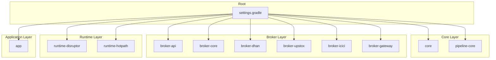
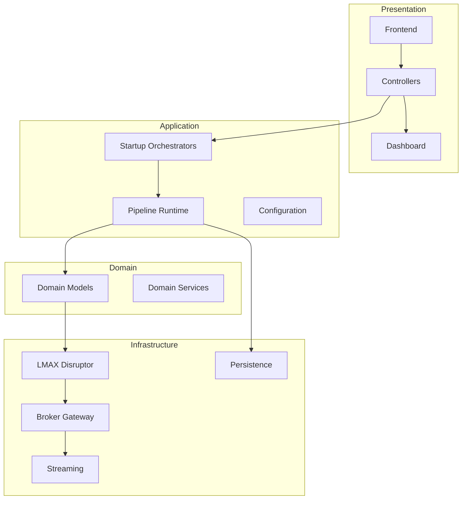
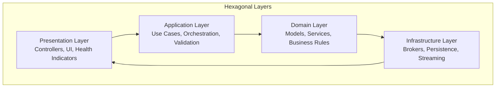
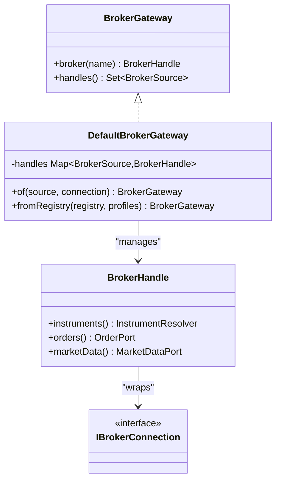
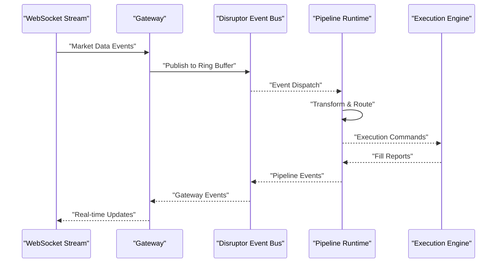
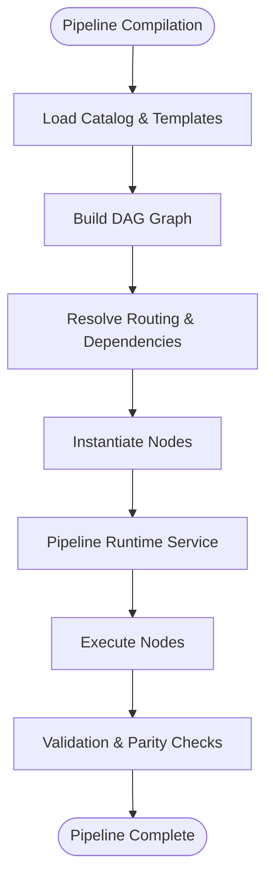
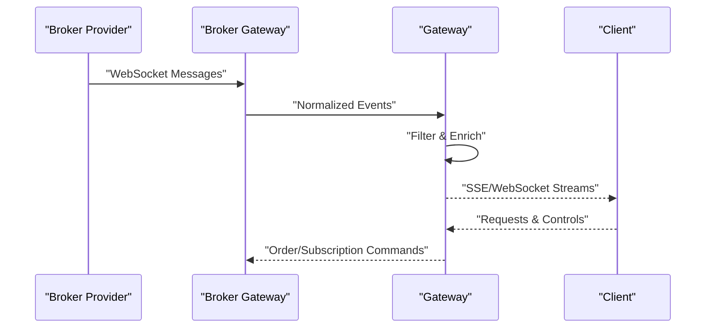
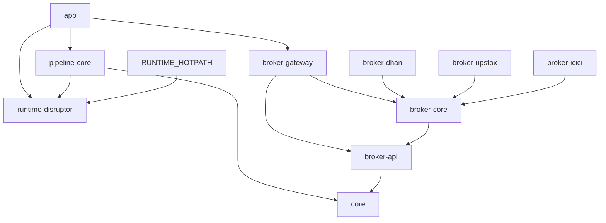

# Architecture Overview

<cite>
**Referenced Files in This Document**
- [settings.gradle](file://settings.gradle)
- [ARCHITECTURE.md](file://ARCHITECTURE.md)
- [DesignPatternArchitectureTest.java](file://architecture-test/src/test/java/com/tradej/architecture/DesignPatternArchitectureTest.java)
- [CliArchitectureCommand.java](file://cli/src/main/java/com/tradej/cli/command/CliArchitectureCommand.java)
- [Trade-J-Architecture-Visual.html](file://docs/visuals/Trade-J-Architecture-Visual.html)
- [BROKER_GATEWAY_ARCHITECTURE_REVIEW.md](file://docs/BROKER_GATEWAY_ARCHITECTURE_REVIEW.md)
- [DefaultBrokerGateway.java](file://broker-gateway/src/main/java/com/tradej/brokergateway/DefaultBrokerGateway.java)
- [GatewayAppConfiguration.java](file://app/src/main/java/com/tradej/app/config/GatewayAppConfiguration.java)
- [REACTIVE_ADOPTION_REVIEW_2026-06-06.md](file://docs/reports/REACTIVE_ADOPTION_REVIEW_2026-06-06.md)
- [build.gradle](file://app/build.gradle)
- [GatewayRouterTest.java](file://broker-gateway/src/test/java/com/tradej/brokergateway/BrokerRouterTest.java)
- [BrokerExplorerTest.java](file://broker-gateway/src/test/java/com/tradej/brokergateway/BrokerExplorerTest.java)
- [BrokerGatewayTest.java](file://broker-gateway/src/test/java/com/tradej/brokergateway/BrokerGatewayTest.java)
- [BrokerHandleAdvancedTest.java](file://broker-gateway/src/test/java/com/tradej/brokergateway/BrokerHandleAdvancedTest.java)
- [BrokerHandleInvokeTest.java](file://broker-gateway/src/test/java/com/tradej/brokergateway/BrokerHandleInvokeTest.java)
- [BrokerHandleRawCaptureTest.java](file://broker-gateway/src/test/java/com/tradej/brokergateway/BrokerHandleRawCaptureTest.java)
- [BrokerRouterTest.java](file://broker-gateway/src/test/java/com/tradej/brokergateway/BrokerRouterTest.java)
- [OptionAnalyticsTest.java](file://broker-gateway/src/test/java/com/tradej/brokergateway/OptionAnalyticsTest.java)
- [BrokerCertificationTest.java](file://broker-gateway/src/test/java/com/tradej/brokergateway/BrokerCertificationTest.java)
- [BrokerStartupOrchestratorAnalyticsTest.java](file://app/src/test/java/com/tradej/app/integration/BrokerStartupOrchestratorAnalyticsTest.java)
- [BrokerStartupValidatorTest.java](file://app/src/test/java/com/tradej/app/integration/BrokerStartupValidatorTest.java)
- [GatewayWebSocketLifecycleTest.java](file://app/src/test/java/com/tradej/app/integration/GatewayWebSocketLifecycleTest.java)
- [GatewayLiveBenchmark.java](file://app/src/test/java/com/tradej/app/integration/GatewayLiveBenchmark.java)
- [GatewayReplaySmokeTest.java](file://app/src/test/java/com/tradej/app/integration/GatewayReplaySmokeTest.java)
- [LiveUpstoxTestSupport.java](file://app/src/test/java/com/tradej/app/integration/LiveUpstoxTestSupport.java)
- [LiveIciciTestSupport.java](file://app/src/test/java/com/tradej/app/integration/LiveIciciTestSupport.java)
- [LiveDhanTestSupport.java](file://app/src/test/java/com/tradej/app/integration/LiveDhanTestSupport.java)
- [DisruptorSignalToExecutionComponentTest.java](file://app/src/test/java/com/tradej/app/integration/DisruptorSignalToExecutionComponentTest.java)
- [DisruptorTickToCandleComponentTest.java](file://app/src/test/java/com/tradej/app/integration/DisruptorTickToCandleComponentTest.java)
- [PipelineNodeParityComponentTest.java](file://app/src/test/java/com/tradej/app/pipeline/PipelineNodeParityComponentTest.java)
- [TradingHotPathE2EComponentTest.java](file://app/src/test/java/com/tradej/app/integration/TradingHotPathE2EComponentTest.java)
- [TradingRuntimeReconciliationIntegrationTest.java](file://app/src/test/java/com/tradej/app/integration/TradingRuntimeReconciliationIntegrationTest.java)
- [TripleModePNLParityTest.java](file://app/src/test/java/com/tradej/app/integration/TripleModePNLParityTest.java)
- [HistoricalRangeIntegrationTest.java](file://app/src/test/java/com/tradej/app/integration/HistoricalRangeIntegrationTest.java)
- [ScanEngineIntegrationTest.java](file://app/src/test/java/com/tradej/app/integration/ScanEngineIntegrationTest.java)
- [StudioChartIntegrationTest.java](file://app/src/test/java/com/tradej/app/integration/StudioChartIntegrationTest.java)
- [SymbolControllerIntegrationTest.java](file://app/src/test/java/com/tradej/app/integration/SymbolControllerIntegrationTest.java)
- [OrderControllerComponentTest.java](file://app/src/test/java/com/tradej/app/api/OrderControllerComponentTest.java)
- [StudioControllerContractTest.java](file://app/src/test/java/com/tradej/app/api/StudioControllerContractTest.java)
- [GatewayProfileContextComponentTest.java](file://app/src/test/java/com/tradej/app/config/GatewayProfileContextComponentTest.java)
- [RuntimeConfigurationTest.java](file://app/src/test/java/com/tradej/app/config/RuntimeConfigurationTest.java)
- [RuntimeModeStartupOrderComponentTest.java](file://app/src/test/java/com/tradej/app/config/RuntimeModeStartupOrderComponentTest.java)
- [AlertManagerTest.java](file://app/src/test/java/com/tradej/app/health/AlertManagerTest.java)
- [BrokerErrorTrackerTest.java](file://app/src/test/java/com/tradej/app/health/BrokerErrorTrackerTest.java)
- [MarketDataHealthIndicatorTest.java](file://app/src/test/java/com/tradej/app/health/MarketDataHealthIndicatorTest.java)
- [OrderPipelineHealthIndicatorTest.java](file://app/src/test/java/com/tradej/app/health/OrderPipelineHealthIndicatorTest.java)
- [UpstoxHealthIndicatorTest.java](file://app/src/test/java/com/tradej/app/health/UpstoxHealthIndicatorTest.java)
- [McxFullSessionSoakTest.java](file://app/src/test/java/com/tradej/app/metrics/McxFullSessionSoakTest.java)
- [NseFullSessionSoakTest.java](file://app/src/test/java/com/tradej/app/metrics/NseFullSessionSoakTest.java)
- [ObservableMarketDataProviderTest.java](file://app/src/test/java/com/tradej/app/metrics/ObservableMarketDataProviderTest.java)
- [ObservableOrderCommandTest.java](file://app/src/test/java/com/tradej/app/metrics/ObservableOrderCommandTest.java)
- [TickReconciliationLiveSessionTest.java](file://app/src/test/java/com/tradej/app/metrics/TickReconciliationLiveSessionTest.java)
- [DagPipelineIngressTest.java](file://app/src/test/java/com/tradej/app/pipeline/DagPipelineIngressTest.java)
- [PipelineCompileRoutingTest.java](file://app/src/test/java/com/tradej/app/pipeline/PipelineCompileRoutingTest.java)
- [ReplayMarketTickParityTest.java](file://app/src/test/java/com/tradej/app/pipeline/ReplayMarketTickParityTest.java)
- [ScanServiceInstitutionalComponentTest.java](file://app/src/test/java/com/tradej/app/scanner/ScanServiceInstitutionalComponentTest.java)
- [Dashboard.html](file://app/src/main/resources/static/dashboard.html)
</cite>

## Table of Contents
1. [Introduction](#introduction)
2. [Project Structure](#project-structure)
3. [Core Components](#core-components)
4. [Architecture Overview](#architecture-overview)
5. [Detailed Component Analysis](#detailed-component-analysis)
6. [Dependency Analysis](#dependency-analysis)
7. [Performance Considerations](#performance-considerations)
8. [Troubleshooting Guide](#troubleshooting-guide)
9. [Conclusion](#conclusion)

## Introduction
Trade-J follows a hexagonal architecture with clear layer separation and modular organization. The system emphasizes:
- Hexagonal architecture with Presentation, Application, Domain, and Infrastructure layers
- Event-driven processing powered by LMAX Disruptor for high-throughput scenarios
- A broker gateway pattern enabling unified access to multiple brokerage providers
- Pipeline-based workflow processing for trading logic
- Real-time data streaming and replay capabilities
- Domain-driven design principles applied across modules

## Project Structure
The project is organized into multiple Gradle modules grouped by responsibility and bounded contexts. The module list below reflects the current structure and interdependencies.

**Diagram sources**
- [settings.gradle:1-26](file://settings.gradle#L1-L26)

Key module responsibilities:
- core: Domain models, domain services, and core business logic
- broker-api: Broker-agnostic interfaces and shared abstractions
- broker-core: Broker-agnostic implementations, resilience, routing, and observability
- broker-dhan, broker-upstox, broker-icici: Broker-specific adapters and integrations
- broker-gateway: Unified broker access, SPI-based plugin model, and dynamic invocation
- runtime-disruptor: LMAX Disruptor-based event bus and high-throughput processing
- runtime-hotpath: Hot-path optimizations and latency-sensitive components
- pipeline-core: Pipeline orchestration, DAG execution, and runtime services
- app: Spring Boot application, controllers, configuration, and health monitoring

**Section sources**
- [settings.gradle:1-26](file://settings.gradle#L1-L26)

## Core Components
This section outlines the primary architectural components and their roles within the hexagonal design.

- Presentation Layer
  - Controllers and UI components expose system capabilities to users and external systems
  - Health indicators and metrics endpoints monitor runtime state
  - Example: Gateway health broadcasting and dashboard metrics

- Application Layer
  - Orchestration of use cases, pipeline compilation, and runtime coordination
  - Startup validators and orchestrators ensure safe initialization across brokers and pipelines

- Domain Layer
  - Core business entities, value objects, and domain services encapsulate trading logic
  - Domain-driven design principles guide model boundaries and invariants

- Infrastructure Layer
  - External integrations (brokers), event bus (Disruptor), persistence, and streaming
  - SPI-based broker plugins enable extensibility without coupling to specific providers

Design patterns evidenced across the system:
- Adapter pattern: Broker adapters implement a common interface for diverse providers
- Registry pattern: Broker plugin registry enables dynamic discovery and instantiation
- Pipeline pattern: Workflow orchestration through DAG-based pipelines
- Hexagonal architecture: Clear separation of concerns with ports and adapters

**Section sources**
- [DesignPatternArchitectureTest.java:156-189](file://architecture-test/src/test/java/com/tradej/architecture/DesignPatternArchitectureTest.java#L156-L189)
- [CliArchitectureCommand.java:110-132](file://cli/src/main/java/com/tradej/cli/command/CliArchitectureCommand.java#L110-L132)

## Architecture Overview
Trade-J employs a layered hexagonal architecture with event-driven processing and modular composition. The system is designed around:
- Clean layer separation: Presentation, Application, Domain, Infrastructure
- Event-driven architecture using LMAX Disruptor for high-throughput, low-latency processing
- Broker gateway pattern for unified broker access and extensible plugin model
- Pipeline-based workflow processing for trading logic
- Real-time data streaming and replay capabilities

System boundaries and responsibilities:
- Presentation boundary: Exposes APIs and UI for user interaction and monitoring
- Application boundary: Coordinates workflows, validates preconditions, and manages runtime state
- Domain boundary: Encapsulates business rules and maintains invariants
- Infrastructure boundary: Integrates with external systems (brokers, storage, messaging)

Data flow patterns:
- Event-driven ingestion via Disruptor ring buffers
- Pipeline-based transformations and routing
- Real-time streaming to clients and downstream systems
- Replay and historical ingestion for testing and validation

**Diagram sources**
- [Trade-J-Architecture-Visual.html:105-173](file://docs/visuals/Trade-J-Architecture-Visual.html#L105-L173)

## Detailed Component Analysis

### Hexagonal Architecture Layers
The hexagonal architecture separates concerns into four layers, each with distinct responsibilities and interfaces.

- Presentation Layer
  - Responsibilities: Expose APIs, render dashboards, publish health metrics
  - Examples: Gateway health broadcaster, dashboard metrics, controller tests

- Application Layer
  - Responsibilities: Orchestrate workflows, compile pipelines, validate runtime modes
  - Examples: Startup validators, runtime configuration tests, pipeline ingress tests

- Domain Layer
  - Responsibilities: Define core business entities and services
  - Examples: Domain models and services in core module

- Infrastructure Layer
  - Responsibilities: Integrate with external systems and provide cross-cutting services
  - Examples: Broker gateway, Disruptor event bus, persistence modules

**Section sources**
- [GatewayAppConfiguration.java:58-90](file://app/src/main/java/com/tradej/app/config/GatewayAppConfiguration.java#L58-L90)
- [Dashboard.html:324-373](file://app/src/main/resources/static/dashboard.html#L324-L373)

### Broker Gateway Pattern
The broker gateway provides a unified abstraction over multiple brokerage providers using an adapter pattern and SPI-based plugin model.

Key characteristics:
- Adapter pattern: Broker adapters implement a common interface for diverse providers
- SPI-based plugin model: Dynamic discovery and instantiation of broker providers
- Unified access: Single entry point for broker operations across multiple providers

**Diagram sources**
- [DefaultBrokerGateway.java:39-66](file://broker-gateway/src/main/java/com/tradej/brokergateway/DefaultBrokerGateway.java#L39-L66)

**Section sources**
- [BROKER_GATEWAY_ARCHITECTURE_REVIEW.md:470-488](file://docs/BROKER_GATEWAY_ARCHITECTURE_REVIEW.md#L470-L488)
- [BrokerRouterTest.java:39-50](file://broker-gateway/src/test/java/com/tradej/brokergateway/BrokerRouterTest.java#L39-L50)

### Event-Driven Architecture with LMAX Disruptor
Trade-J leverages LMAX Disruptor for high-throughput, low-latency event processing. The system uses Disruptor for:
- Tick-to-candle generation
- Signal-to-execution processing
- Pipeline event distribution

Design rationale:
- Deterministic ordering and low latency for replay and production
- Single-writer model reduces contention and false sharing
- Pre-allocated envelopes minimize GC pressure

**Diagram sources**
- [REACTIVE_ADOPTION_REVIEW_2026-06-06.md:196-214](file://docs/reports/REACTIVE_ADOPTION_REVIEW_2026-06-06.md#L196-L214)

**Section sources**
- [DisruptorSignalToExecutionComponentTest.java](file://app/src/test/java/com/tradej/app/integration/DisruptorSignalToExecutionComponentTest.java)
- [DisruptorTickToCandleComponentTest.java](file://app/src/test/java/com/tradej/app/integration/DisruptorTickToCandleComponentTest.java)

### Pipeline-Based Workflow Processing
The pipeline platform orchestrates complex trading workflows using a DAG-based approach. Pipelines compile routing and execute nodes in dependency order.

Key benefits:
- Deterministic execution order across nodes
- Replay and parity testing for validation
- Scalable throughput via Disruptor-backed event bus

**Section sources**
- [PipelineNodeParityComponentTest.java](file://app/src/test/java/com/tradej/app/pipeline/PipelineNodeParityComponentTest.java)
- [DagPipelineIngressTest.java](file://app/src/test/java/com/tradej/app/pipeline/DagPipelineIngressTest.java)
- [PipelineCompileRoutingTest.java](file://app/src/test/java/com/tradej/app/pipeline/PipelineCompileRoutingTest.java)

### Real-Time Data Streaming Architecture
The system streams real-time market data and operational metrics to clients and internal components.

Operational visibility:
- Dashboard metrics for ring buffer utilization, dispatch queue depth, and dropped events
- Health broadcasts for pipeline and broker status
- Live benchmarking and smoke tests for performance validation

**Section sources**
- [GatewayWebSocketLifecycleTest.java](file://app/src/test/java/com/tradej/app/integration/GatewayWebSocketLifecycleTest.java)
- [GatewayLiveBenchmark.java](file://app/src/test/java/com/tradej/app/integration/GatewayLiveBenchmark.java)
- [Dashboard.html:324-373](file://app/src/main/resources/static/dashboard.html#L324-L373)

## Dependency Analysis
The module dependency graph illustrates how components interact and maintain layer separation.

Observations:
- Presentation depends on application and runtime modules
- Application orchestrates pipeline and broker gateway
- Pipeline core depends on core domain and runtime
- Broker gateway composes broker-specific modules via SPI
- Runtime modules provide shared infrastructure for high-performance processing

**Diagram sources**
- [settings.gradle:1-26](file://settings.gradle#L1-L26)

**Section sources**
- [settings.gradle:1-26](file://settings.gradle#L1-L26)

## Performance Considerations
Trade-J prioritizes performance and determinism for mission-critical workflows:
- LMAX Disruptor for single-writer, cache-line aligned event processing
- Pre-allocated event envelopes to minimize allocation overhead
- Deterministic replay for validation and regression testing
- Hot-path optimizations in runtime-hotpath module
- Comprehensive benchmarking and soak tests across major exchanges

Recommendations:
- Monitor ring buffer utilization and adjust capacity for peak loads
- Use replay sessions to validate performance regressions
- Leverage parity tests to ensure deterministic behavior across environments

**Section sources**
- [REACTIVE_ADOPTION_REVIEW_2026-06-06.md:196-214](file://docs/reports/REACTIVE_ADOPTION_REVIEW_2026-06-06.md#L196-L214)
- [McxFullSessionSoakTest.java](file://app/src/test/java/com/tradej/app/metrics/McxFullSessionSoakTest.java)
- [NseFullSessionSoakTest.java](file://app/src/test/java/com/tradej/app/metrics/NseFullSessionSoakTest.java)

## Troubleshooting Guide
Common areas to investigate during incidents:
- Broker connectivity and subscription health
- Pipeline runtime health and event bus saturation
- Replay and parity validation failures
- Startup orchestration and configuration issues

Diagnostic steps:
- Review gateway health broadcasts and dashboard metrics
- Validate broker gateway SPI registration and provider availability
- Confirm pipeline DAG compilation and node execution
- Run targeted integration tests for affected modules

**Section sources**
- [GatewayAppConfiguration.java:58-90](file://app/src/main/java/com/tradej/app/config/GatewayAppConfiguration.java#L58-L90)
- [BrokerStartupOrchestratorAnalyticsTest.java](file://app/src/test/java/com/tradej/app/integration/BrokerStartupOrchestratorAnalyticsTest.java)
- [BrokerStartupValidatorTest.java](file://app/src/test/java/com/tradej/app/integration/BrokerStartupValidatorTest.java)
- [TradingHotPathE2EComponentTest.java](file://app/src/test/java/com/tradej/app/integration/TradingHotPathE2EComponentTest.java)
- [TradingRuntimeReconciliationIntegrationTest.java](file://app/src/test/java/com/tradej/app/integration/TradingRuntimeReconciliationIntegrationTest.java)
- [TripleModePNLParityTest.java](file://app/src/test/java/com/tradej/app/integration/TripleModePNLParityTest.java)

## Conclusion
Trade-J demonstrates a mature, layered architecture optimized for performance, reliability, and extensibility. The hexagonal design enforces clear boundaries, while the broker gateway pattern and pipeline framework enable flexible, scalable trading workflows. The event-driven architecture with LMAX Disruptor ensures deterministic, high-throughput processing essential for real-time trading applications.