# Getting Started

<cite>
**Referenced Files in This Document**
- [README.md](file://README.md)
- [CONFIG.md](file://CONFIG.md)
- [dhan-sandbox.properties.example](file://config/dhan-sandbox.properties.example)
- [upstox-sandbox.properties.example](file://config/upstox-sandbox.properties.example)
- [upstox-live.properties.example](file://config/upstox-live.properties.example)
- [application.yml](file://app/src/main/resources/application.yml)
- [application-dev.yml](file://app/src/main/resources/application-dev.yml)
- [application-upstox-analytics.yml](file://app/src/main/resources/application-upstox-analytics.yml)
- [application-dev-live.yml](file://app/src/main/resources/application-dev-live.yml)
- [application-icici-prod.yml](file://app/src/main/resources/application-icici-prod.yml)
- [application-prod.yml](file://app/src/main/resources/application-prod.yml)
- [application-replay.yml](file://app/src/main/resources/application-replay.yml)
- [application-test.yml](file://app/src/main/resources/application-test.yml)
- [application-upstox-dev.yml](file://app/src/main/resources/application-upstox-dev.yml)
- [application-upstox-prod.yml](file://app/src/main/resources/application-upstox-prod.yml)
- [application-gateway.yml](file://app/src/main/resources/application-gateway.yml)
- [build.gradle](file://app/build.gradle)
- [gradlew.bat](file://gradlew.bat)
- [scripts/console-smoke.sh](file://scripts/console-smoke.sh)
- [scripts/dhan-smoke.sh](file://scripts/dhan-smoke.sh)
- [scripts/upstox-smoke.sh](file://scripts/upstox-smoke.sh)
- [scripts/test-api.sh](file://scripts/test-api.sh)
- [scripts/test-websocket-connections.sh](file://scripts/test-websocket-connections.sh)
- [test-backend-connection.sh](file://test-backend-connection.sh)
- [CLI.md](file://CLI.md)
- [docs/USAGE_GUIDE.md](file://docs/USAGE_GUIDE.md)
- [docs/API_DOCUMENTATION.md](file://docs/API_DOCUMENTATION.md)
- [docs/CONSOLE_SMOKE.md](file://docs/CONSOLE_SMOKE.md)
- [docs/E2E_VERIFICATION.md](file://docs/E2E_VERIFICATION.md)
- [docs/runtime-mode-audit.md](file://docs/runtime-mode-audit.md)
- [docs/BROKER_CAPABILITY_MATRIX.md](file://docs/BROKER_CAPABILITY_MATRIX.md)
- [docs/ARCHITECTURE.md](file://docs/ARCHITECTURE.md)
- [docs/PIPELINE_DESIGN.md](file://docs/PIPELINE_DESIGN.md)
- [docs/TERMINAL_SCALABILITY_REVIEW.md](file://docs/TERMINAL_SCALABILITY_REVIEW.md)
- [docs/TRADEJ_INSTITUTIONAL_ARCHITECTURE.md](file://docs/TRADEJ_INSTITUTIONAL_ARCHITECTURE.md)
- [docs/openapi.yaml](file://docs/openapi.yaml)
</cite>

## Table of Contents
1. [Introduction](#introduction)
2. [Project Structure](#project-structure)
3. [Prerequisites](#prerequisites)
4. [Installation](#installation)
5. [Environment Setup](#environment-setup)
6. [Initial Configuration](#initial-configuration)
7. [Quick Start Options](#quick-start-options)
8. [First Run](#first-run)
9. [Basic Trading Operations](#basic-trading-operations)
10. [Verification Steps](#verification-steps)
11. [Development Workflow](#development-workflow)
12. [Running Tests](#running-tests)
13. [Accessing the Trading Terminal](#accessing-the-trading-terminal)
14. [Troubleshooting Guide](#troubleshooting-guide)
15. [Conclusion](#conclusion)

## Introduction
Trade-J is a modular trading platform supporting multiple brokers and runtime modes. It provides:
- Sandbox environments for safe experimentation
- Live market data and order routing
- Analytics-only mode for research and monitoring
- A comprehensive CLI and web terminal for operational tasks

This guide walks you through installation, environment setup, configuration, and first-run operations across the three quick start options.

## Project Structure
The repository is organized into modules covering application runtime, broker integrations, pipeline processing, research, and documentation. Key areas for getting started:
- Application runtime and profiles under app/src/main/resources
- Broker configuration examples under config/
- Scripts for smoke testing and connectivity checks under scripts/
- CLI documentation under CLI.md
- Usage and API documentation under docs/

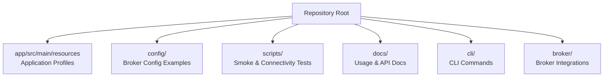

**Section sources**
- [README.md](file://README.md)
- [CONFIG.md](file://CONFIG.md)

## Prerequisites
Before installing Trade-J, ensure the following are available:
- Java 21 JDK
- Git
- Gradle wrapper (already included)

These tools are required to build, run, and test the platform locally.

**Section sources**
- [README.md](file://README.md)
- [CONFIG.md](file://CONFIG.md)

## Installation
Follow these steps to install Trade-J:

1. Clone the repository using Git.
2. Navigate to the repository root.
3. Build the application using the Gradle wrapper script.

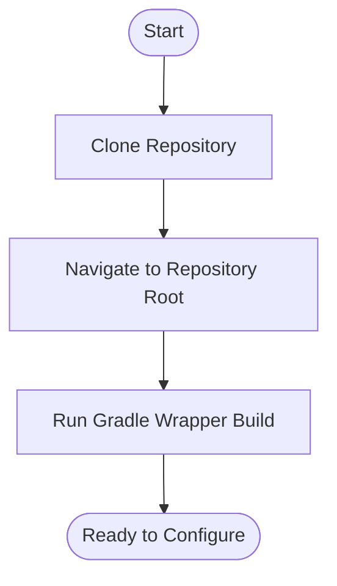

**Section sources**
- [README.md](file://README.md)
- [gradlew.bat](file://gradlew.bat)

## Environment Setup
Trade-J uses Spring Boot profiles to configure runtime behavior. The primary application configuration is located at:
- [application.yml](file://app/src/main/resources/application.yml)

Commonly used profiles include:
- Development sandbox: [application-dev.yml](file://app/src/main/resources/application-dev.yml)
- Upstox analytics-only: [application-upstox-analytics.yml](file://app/src/main/resources/application-upstox-analytics.yml)
- Development live: [application-dev-live.yml](file://app/src/main/resources/application-dev-live.yml)
- Production variants: [application-prod.yml](file://app/src/main/resources/application-prod.yml), [application-icici-prod.yml](file://app/src/main/resources/application-icici-prod.yml), [application-upstox-prod.yml](file://app/src/main/resources/application-upstox-prod.yml)
- Replay/testing: [application-replay.yml](file://app/src/main/resources/application-replay.yml), [application-test.yml](file://app/src/main/resources/application-test.yml)
- Gateway-specific: [application-gateway.yml](file://app/src/main/resources/application-gateway.yml)

Select a profile appropriate for your quick start option during launch.

**Section sources**
- [application.yml](file://app/src/main/resources/application.yml)
- [application-dev.yml](file://app/src/main/resources/application-dev.yml)
- [application-upstox-analytics.yml](file://app/src/main/resources/application-upstox-analytics.yml)
- [application-dev-live.yml](file://app/src/main/resources/application-dev-live.yml)
- [application-prod.yml](file://app/src/main/resources/application-prod.yml)
- [application-icici-prod.yml](file://app/src/main/resources/application-icici-prod.yml)
- [application-upstox-prod.yml](file://app/src/main/resources/application-upstox-prod.yml)
- [application-replay.yml](file://app/src/main/resources/application-replay.yml)
- [application-test.yml](file://app/src/main/resources/application-test.yml)
- [application-gateway.yml](file://app/src/main/resources/application-gateway.yml)

## Initial Configuration
Configure credentials by copying the provided examples from the config directory:
- Dhan sandbox: [dhan-sandbox.properties.example](file://config/dhan-sandbox.properties.example)
- Upstox sandbox: [upstox-sandbox.properties.example](file://config/upstox-sandbox.properties.example)
- Upstox live: [upstox-live.properties.example](file://config/upstox-live.properties.example)

Steps:
1. Copy the relevant example file to a new .properties file without the .example suffix.
2. Populate the copied file with your broker credentials and preferences.
3. Reference the configuration in your chosen Spring profile.

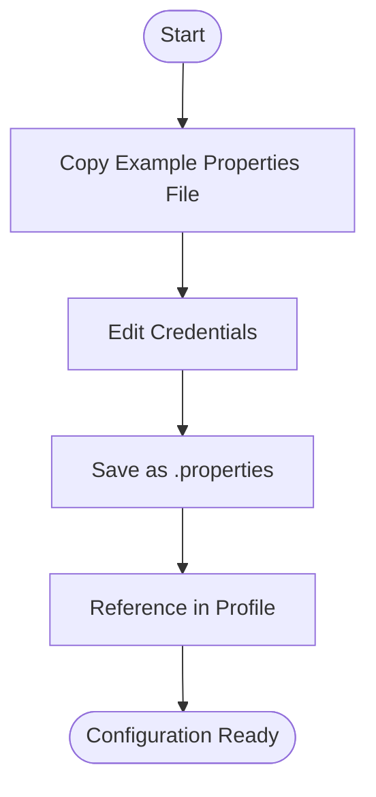

**Section sources**
- [dhan-sandbox.properties.example](file://config/dhan-sandbox.properties.example)
- [upstox-sandbox.properties.example](file://config/upstox-sandbox.properties.example)
- [upstox-live.properties.example](file://config/upstox-live.properties.example)

## Quick Start Options
Choose one of the following quick start configurations:

### Option 1: Default Dhan Sandbox
- Purpose: Experiment with Dhan sandbox credentials and market data without risk.
- Configuration: Use the Dhan sandbox example and the development profile.
- Verification: Run the Dhan smoke test script.

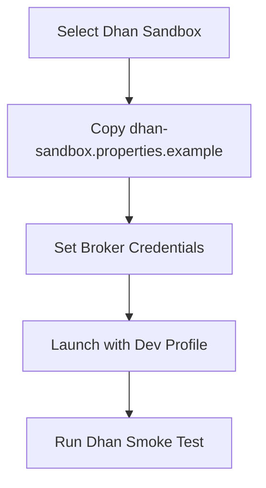

**Section sources**
- [dhan-sandbox.properties.example](file://config/dhan-sandbox.properties.example)
- [application-dev.yml](file://app/src/main/resources/application-dev.yml)
- [scripts/dhan-smoke.sh](file://scripts/dhan-smoke.sh)

### Option 2: Live Market Data Mode
- Purpose: Connect to real-time market data feeds and optionally place test orders.
- Configuration: Use the development live profile and appropriate broker credentials.
- Verification: Use the console smoke test and backend connection script.

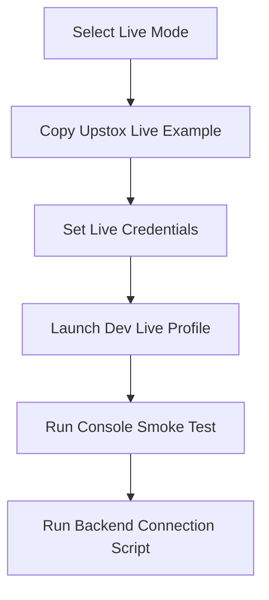

**Section sources**
- [upstox-live.properties.example](file://config/upstox-live.properties.example)
- [application-dev-live.yml](file://app/src/main/resources/application-dev-live.yml)
- [scripts/console-smoke.sh](file://scripts/console-smoke.sh)
- [test-backend-connection.sh](file://test-backend-connection.sh)

### Option 3: Upstox Analytics-Only Mode
- Purpose: Monitor and analyze market data without placing live orders.
- Configuration: Use the Upstox analytics profile and sandbox credentials.
- Verification: Use the Upstox smoke test script.

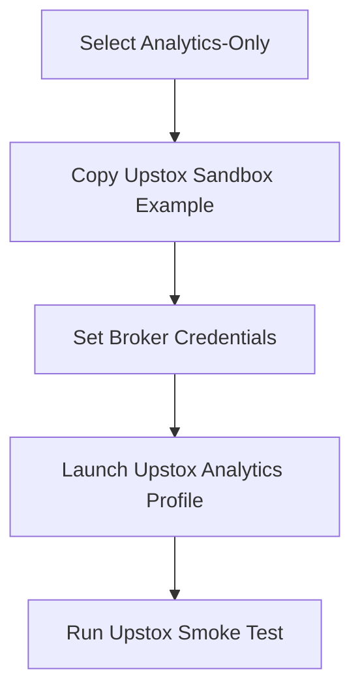

**Section sources**
- [upstox-sandbox.properties.example](file://config/upstox-sandbox.properties.example)
- [application-upstox-analytics.yml](file://app/src/main/resources/application-upstox-analytics.yml)
- [scripts/upstox-smoke.sh](file://scripts/upstox-smoke.sh)

## First Run
After configuration:
1. Launch the application with your selected profile.
2. Verify broker connectivity using the appropriate smoke test script.
3. Confirm that market data streams are received and displayed.

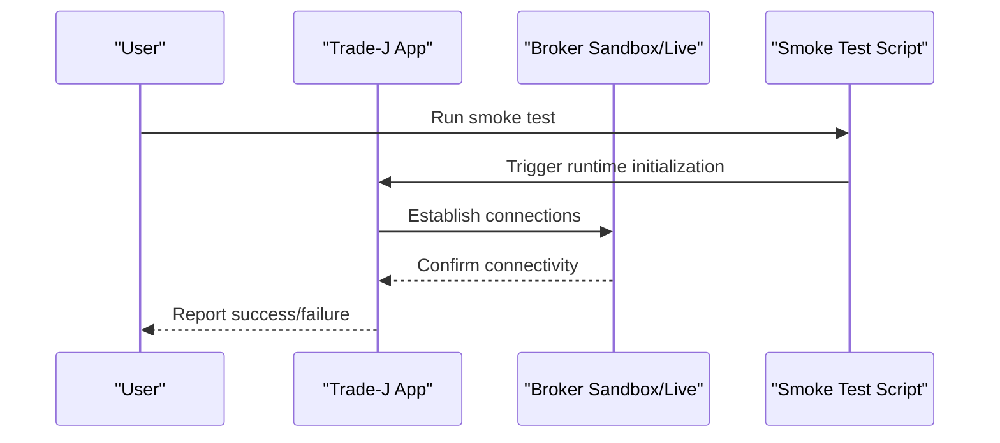

**Section sources**
- [scripts/dhan-smoke.sh](file://scripts/dhan-smoke.sh)
- [scripts/upstox-smoke.sh](file://scripts/upstox-smoke.sh)
- [scripts/console-smoke.sh](file://scripts/console-smoke.sh)

## Basic Trading Operations
Operational tasks are documented in:
- CLI usage: [CLI.md](file://CLI.md)
- General usage guide: [docs/USAGE_GUIDE.md](file://docs/USAGE_GUIDE.md)
- API documentation: [docs/API_DOCUMENTATION.md](file://docs/API_DOCUMENTATION.md)

Typical operations include:
- Listing available commands via the CLI
- Querying market data and portfolio information
- Executing simple order commands in supported modes

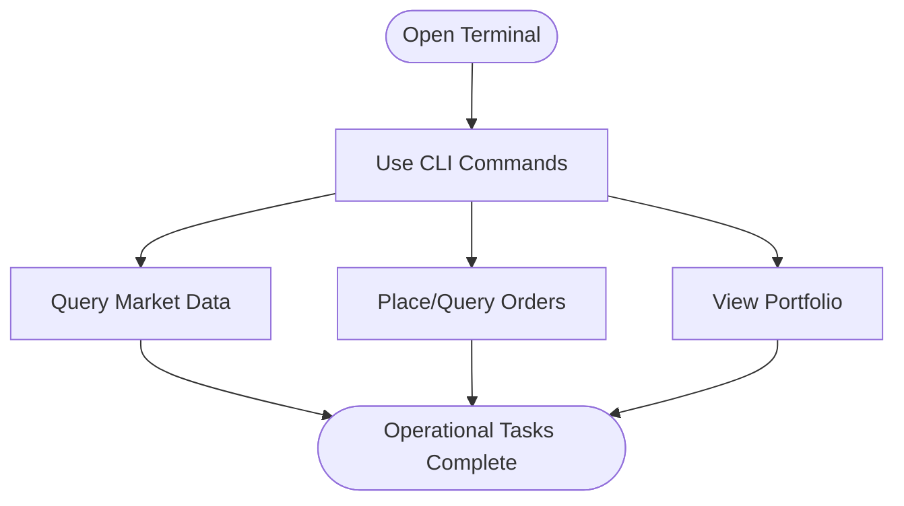

**Section sources**
- [CLI.md](file://CLI.md)
- [docs/USAGE_GUIDE.md](file://docs/USAGE_GUIDE.md)
- [docs/API_DOCUMENTATION.md](file://docs/API_DOCUMENTATION.md)

## Verification Steps
Perform these checks after first run:
- Confirm broker connectivity using the smoke test scripts
- Validate backend connections with the dedicated script
- Review runtime mode audit and capability matrix for supported features

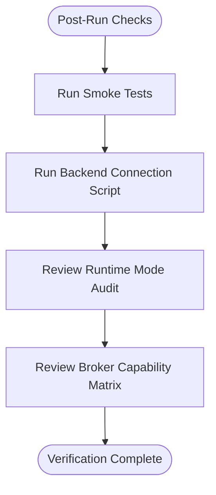

**Section sources**
- [scripts/test-api.sh](file://scripts/test-api.sh)
- [scripts/test-websocket-connections.sh](file://scripts/test-websocket-connections.sh)
- [test-backend-connection.sh](file://test-backend-connection.sh)
- [docs/runtime-mode-audit.md](file://docs/runtime-mode-audit.md)
- [docs/BROKER_CAPABILITY_MATRIX.md](file://docs/BROKER_CAPABILITY_MATRIX.md)

## Development Workflow
Recommended workflow:
- Use development profiles for local experimentation
- Switch to production profiles when preparing for live trading
- Leverage replay and test profiles for regression and validation
- Keep configuration files separate from source control

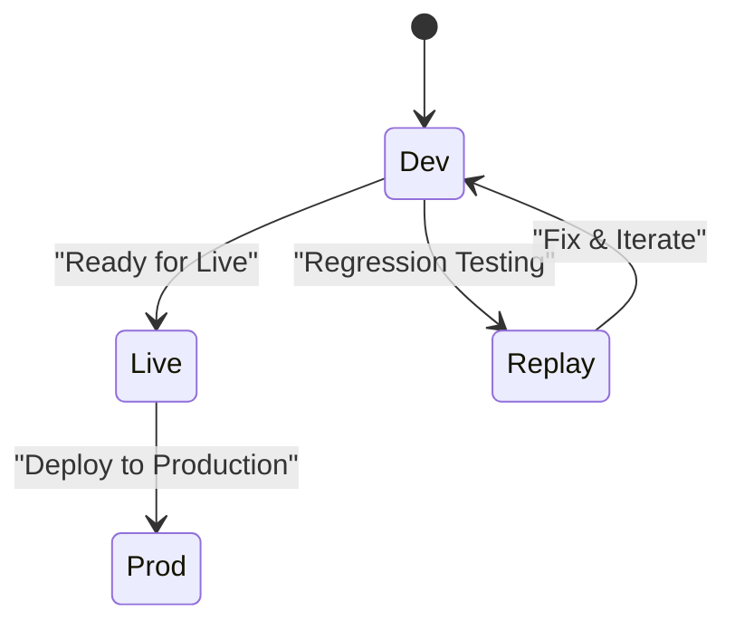

**Section sources**
- [application-dev.yml](file://app/src/main/resources/application-dev.yml)
- [application-dev-live.yml](file://app/src/main/resources/application-dev-live.yml)
- [application-replay.yml](file://app/src/main/resources/application-replay.yml)
- [application-prod.yml](file://app/src/main/resources/application-prod.yml)

## Running Tests
Execute tests using the Gradle wrapper and shell scripts:
- Backend API tests: [scripts/test-api.sh](file://scripts/test-api.sh)
- WebSocket connection tests: [scripts/test-websocket-connections.sh](file://scripts/test-websocket-connections.sh)
- Console smoke tests: [scripts/console-smoke.sh](file://scripts/console-smoke.sh)
- Broker-specific smoke tests: [scripts/dhan-smoke.sh](file://scripts/dhan-smoke.sh), [scripts/upstox-smoke.sh](file://scripts/upstox-smoke.sh)

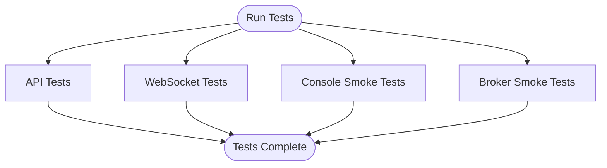

**Section sources**
- [scripts/test-api.sh](file://scripts/test-api.sh)
- [scripts/test-websocket-connections.sh](file://scripts/test-websocket-connections.sh)
- [scripts/console-smoke.sh](file://scripts/console-smoke.sh)
- [scripts/dhan-smoke.sh](file://scripts/dhan-smoke.sh)
- [scripts/upstox-smoke.sh](file://scripts/upstox-smoke.sh)

## Accessing the Trading Terminal
Access the terminal through:
- Web-based terminal UI (frontend integration)
- CLI commands for operational tasks
- API endpoints for programmatic access

Documentation references:
- Terminal usage guide: [docs/USAGE_GUIDE.md](file://docs/USAGE_GUIDE.md)
- Console smoke procedures: [docs/CONSOLE_SMOKE.md](file://docs/CONSOLE_SMOKE.md)
- End-to-end verification: [docs/E2E_VERIFICATION.md](file://docs/E2E_VERIFICATION.md)

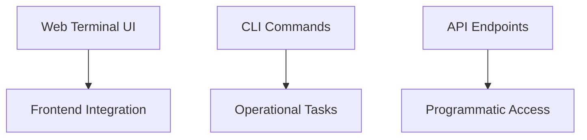

**Section sources**
- [docs/USAGE_GUIDE.md](file://docs/USAGE_GUIDE.md)
- [docs/CONSOLE_SMOKE.md](file://docs/CONSOLE_SMOKE.md)
- [docs/E2E_VERIFICATION.md](file://docs/E2E_VERIFICATION.md)

## Troubleshooting Guide
Common setup issues and resolutions:
- Java version mismatch: Ensure Java 21 is installed and configured.
- Missing broker credentials: Copy and edit the appropriate .example file in config/.
- Profile selection errors: Verify the active Spring profile matches your intended mode.
- Network connectivity: Use the backend connection script to validate outbound access.
- Smoke test failures: Re-run with verbose logging and confirm broker endpoints.

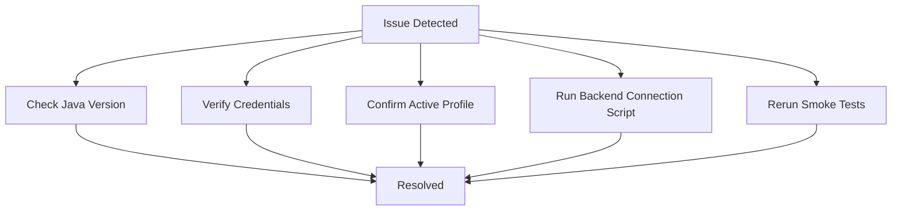

**Section sources**
- [README.md](file://README.md)
- [CONFIG.md](file://CONFIG.md)
- [test-backend-connection.sh](file://test-backend-connection.sh)

## Conclusion
You are now ready to use Trade-J:
- Choose a quick start option aligned with your goals
- Configure credentials from the example files
- Launch with the appropriate profile
- Verify connectivity and run basic operations
- Explore the CLI and terminal for daily tasks

For deeper insights, refer to the architecture and design documents.