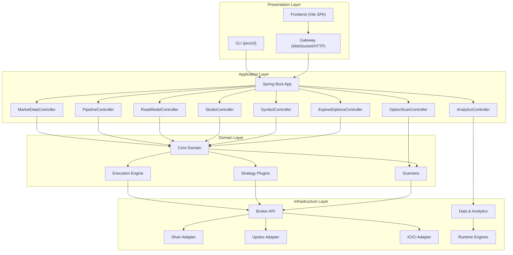
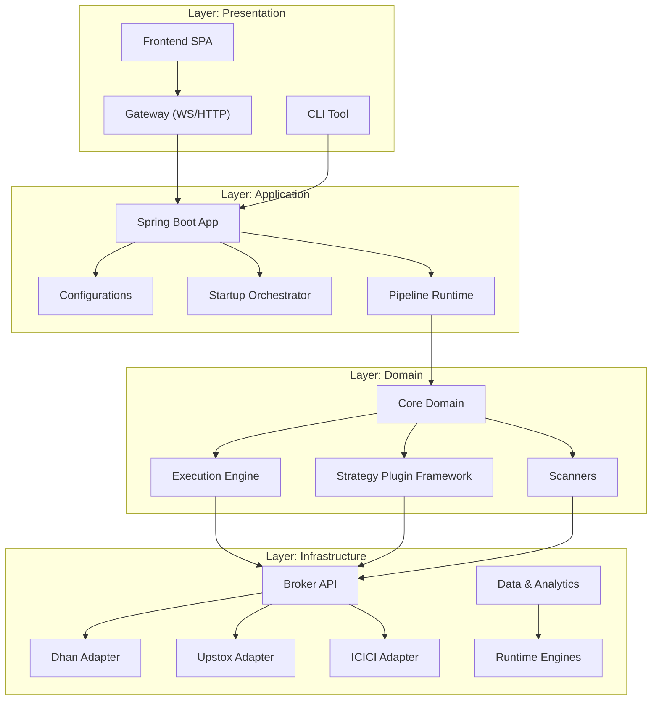
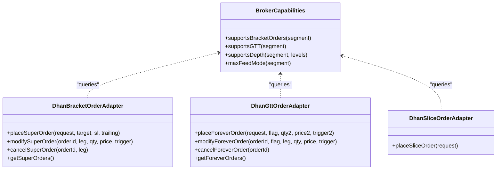
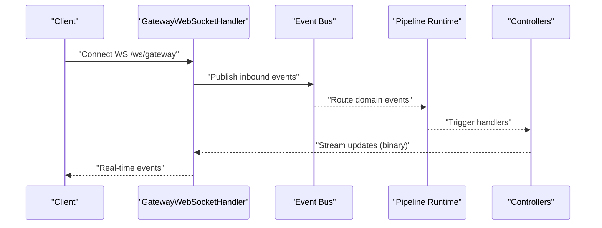
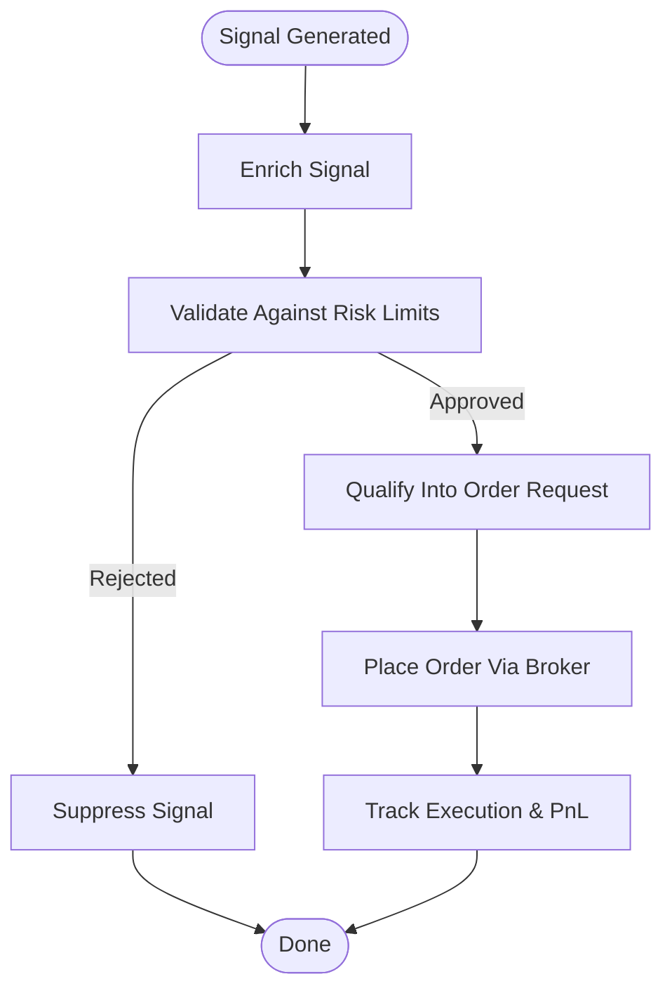
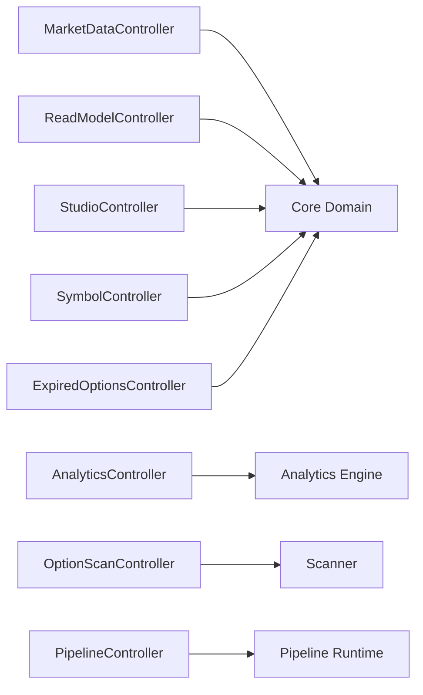
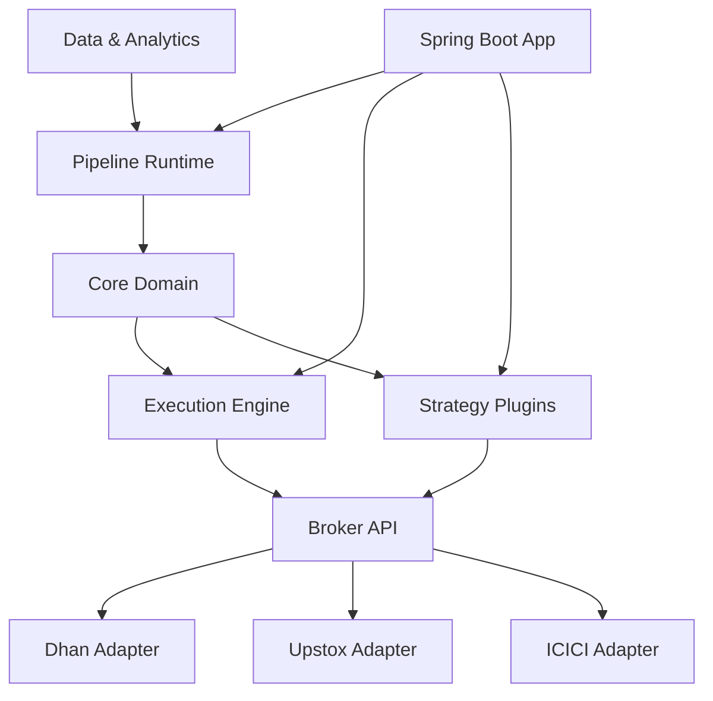

# Introduction

<cite>
**Referenced Files in This Document**
- [README.md](file://README.md)
- [ARCHITECTURE.md](file://ARCHITECTURE.md)
- [docs/USAGE_GUIDE.md](file://docs/USAGE_GUIDE.md)
- [docs/API_DOCUMENTATION.md](file://docs/API_DOCUMENTATION.md)
- [config/dhan-local.properties.example](file://config/dhan-local.properties.example)
- [config/upstox-live.properties.example](file://config/upstox-live.properties.example)
- [broker/api/src/main/java/com/tradej/broker/api/model/BrokerCapabilities.java](file://broker/api/src/main/java/com/tradej/broker/api/model/BrokerCapabilities.java)
- [broker/dhan/src/main/java/com/tradej/broker/dhan/adapter/DhanBracketOrderAdapter.java](file://broker/dhan/src/main/java/com/tradej/broker/dhan/adapter/DhanBracketOrderAdapter.java)
- [broker/dhan/src/main/java/com/tradej/broker/dhan/adapter/DhanGttOrderAdapter.java](file://broker/dhan/src/main/java/com/tradej/broker/dhan/adapter/DhanGttOrderAdapter.java)
- [broker/dhan/src/main/java/com/tradej/broker/dhan/adapter/DhanSliceOrderAdapter.java](file://broker/dhan/src/main/java/com/tradej/broker/dhan/adapter/DhanSliceOrderAdapter.java)
- [trading/strategy/src/main/java/com/tradej/strategy/api/StrategyPlugin.java](file://trading/strategy/src/main/java/com/tradej/strategy/api/StrategyPlugin.java)
- [trading/execution/src/main/java/com/tradej/execution/node/RiskNode.java](file://trading/execution/src/main/java/com/tradej/execution/node/RiskNode.java)
- [gateway/src/main/java/com/tradej/gateway/websocket/GatewayWebSocketHandler.java](file://gateway/src/main/java/com/tradej/gateway/websocket/GatewayWebSocketHandler.java)
- [app/src/main/java/com/tradej/app/api/MarketDataController.java](file://app/src/main/java/com/tradej/app/api/MarketDataController.java)
- [app/src/main/java/com/tradej/app/api/AnalyticsController.java](file://app/src/main/java/com/tradej/app/api/AnalyticsController.java)
- [app/src/main/java/com/tradej/app/api/OptionScanController.java](file://app/src/main/java/com/tradej/app/api/OptionScanController.java)
- [app/src/main/java/com/tradej/app/api/PipelineController.java](file://app/src/main/java/com/tradej/app/api/PipelineController.java)
- [app/src/main/java/com/tradej/app/api/ReadModelController.java](file://app/src/main/java/com/tradej/app/api/ReadModelController.java)
- [app/src/main/java/com/tradej/app/api/StudioController.java](file://app/src/main/java/com/tradej/app/api/StudioController.java)
- [app/src/main/java/com/tradej/app/api/SymbolController.java](file://app/src/main/java/com/tradej/app/api/SymbolController.java)
- [app/src/main/java/com/tradej/app/api/ExpiredOptionsController.java](file://app/src/main/java/com/tradej/app/api/ExpiredOptionsController.java)
- [app/src/main/java/com/tradej/app/api/GlobalExceptionHandler.java](file://app/src/main/java/com/tradej/app/api/GlobalExceptionHandler.java)
- [app/src/main/java/com/tradej/app/config/BrokerConfiguration.java](file://app/src/main/java/com/tradej/app/config/BrokerConfiguration.java)
- [app/src/main/java/com/tradej/app/config/ExecutionConfiguration.java](file://app/src/main/java/com/tradej/app/config/ExecutionConfiguration.java)
- [app/src/main/java/com/tradej/app/config/RiskConfiguration.java](file://app/src/main/java/com/tradej/app/config/RiskConfiguration.java)
- [app/src/main/java/com/tradej/app/config/StrategyConfiguration.java](file://app/src/main/java/com/tradej/app/config/StrategyConfiguration.java)
- [app/src/main/java/com/tradej/app/config/StartupConfiguration.java](file://app/src/main/java/com/tradej/app/config/StartupConfiguration.java)
- [app/src/main/java/com/tradej/app/startup/BrokerStartupOrchestrator.java](file://app/src/main/java/com/tradej/app/startup/BrokerStartupOrchestrator.java)
- [app/src/main/java/com/tradej/app/service/broker/LivePnlService.java](file://app/src/main/java/com/tradej/app/service/broker/LivePnlService.java)
- [app/src/main/java/com/tradej/app/service/broker/MarketDepthOrchestrator.java](file://app/src/main/java/com/tradej/app/service/broker/MarketDepthOrchestrator.java)
- [app/src/main/java/com/tradej/app/service/broker/OptionStrikeResolver.java](file://app/src/main/java/com/tradej/app/service/broker/OptionStrikeResolver.java)
- [app/src/main/java/com/tradej/app/service/broker/BrokerExpiredOptionQueryService.java](file://app/src/main/java/com/tradej/app/service/broker/BrokerExpiredOptionQueryService.java)
- [app/src/main/java/com/tradej/app/service/broker/BrokerHistoricalQueryService.java](file://app/src/main/java/com/tradej/app/service/broker/BrokerHistoricalQueryService.java)
- [app/src/main/java/com/tradej/app/scanner/OptionScanService.java](file://app/src/main/java/com/tradej/app/scanner/OptionScanService.java)
- [app/src/main/java/com/tradej/app/scanner/RuntimeSubscriptionManager.java](file://app/src/main/java/com/tradej/app/scanner/RuntimeSubscriptionManager.java)
- [app/src/main/java/com/tradej/app/scanner/ScanProfileCatalog.java](file://app/src/main/java/com/tradej/app/scanner/ScanProfileCatalog.java)
- [app/src/main/java/com/tradej/app/scanner/ScanProfileMapper.java](file://app/src/main/java/com/tradej/app/scanner/ScanProfileMapper.java)
- [app/src/main/java/com/tradej/app/scanner/ScanResultStore.java](file://app/src/main/java/com/tradej/app/scanner/ScanResultStore.java)
- [app/src/main/java/com/tradej/app/scanner/ScanScheduler.java](file://app/src/main/java/com/tradej/app/scanner/ScanScheduler.java)
- [app/src/main/java/com/tradej/app/scanner/ScanService.java](file://app/src/main/java/com/tradej/app/scanner/ScanService.java)
- [app/src/main/java/com/tradej/app/studio/StudioChartService.java](file://app/src/main/java/com/tradej/app/studio/StudioChartService.java)
- [app/src/main/java/com/tradej/app/subscription/SubscriptionCoordinator.java](file://app/src/main/java/com/tradej/app/subscription/SubscriptionCoordinator.java)
- [app/src/main/java/com/tradej/app/subscription/SubscriptionManager.java](file://app/src/main/java/com/tradej/app/subscription/SubscriptionManager.java)
- [app/src/main/java/com/tradej/app/subscription/SubscriptionRecoveryManager.java](file://app/src/main/java/com/tradej/app/subscription/SubscriptionRecoveryManager.java)
- [app/src/main/java/com/tradej/app/pipeline/DagPipelineRuntimeService.java](file://app/src/main/java/com/tradej/app/pipeline/DagPipelineRuntimeService.java)
- [app/src/main/java/com/tradej/app/pipeline/PipelineRuntimeService.java](file://app/src/main/java/com/tradej/app/pipeline/PipelineRuntimeService.java)
- [app/src/main/java/com/tradej/app/metrics/ObservableMarketDataProvider.java](file://app/src/main/java/com/tradej/app/metrics/ObservableMarketDataProvider.java)
- [app/src/main/java/com/tradej/app/metrics/ObservableOrderCommand.java](file://app/src/main/java/com/tradej/app/metrics/ObservableOrderCommand.java)
- [app/src/main/java/com/tradej/app/health/MarketDataHealthIndicator.java](file://app/src/main/java/com/tradej/app/health/MarketDataHealthIndicator.java)
- [app/src/main/java/com/tradej/app/health/OrderPipelineHealthIndicator.java](file://app/src/main/java/com/tradej/app/health/OrderPipelineHealthIndicator.java)
- [app/src/main/java/com/tradej/app/health/UpstoxHealthIndicator.java](file://app/src/main/java/com/tradej/app/health/UpstoxHealthIndicator.java)
- [app/src/main/java/com/tradej/app/health/BrokerHealthIndicator.java](file://app/src/main/java/com/tradej/app/health/BrokerHealthIndicator.java)
- [app/src/main/java/com/tradej/app/health/DisruptorReadinessHealthIndicator.java](file://app/src/main/java/com/tradej/app/health/DisruptorReadinessHealthIndicator.java)
- [app/src/main/java/com/tradej/app/health/BrokerErrorTracker.java](file://app/src/main/java/com/tradej/app/health/BrokerErrorTracker.java)
- [app/src/main/java/com/tradej/app/health/AnalyticsHealthIndicator.java](file://app/src/main/java/com/tradej/app/health/AnalyticsHealthIndicator.java)
- [app/src/main/java/com/tradej/app/security/AuthValidationService.java](file://app/src/main/java/com/tradej/app/security/AuthValidationService.java)
- [app/src/main/java/com/tradej/app/security/DefaultAuthValidationService.java](file://app/src/main/java/com/tradej/app/security/DefaultAuthValidationService.java)
- [app/src/main/java/com/tradej/app/service/OrderEventJournal.java](file://app/src/main/java/com/tradej/app/service/OrderEventJournal.java)
- [app/src/main/java/com/tradej/app/readmodel/ReadModelStore.java](file://app/src/main/java/com/tradej/app/readmodel/ReadModelStore.java)
- [app/src/main/java/com/tradej/app/admin/AdminController.java](file://app/src/main/java/com/tradej/app/admin/AdminController.java)
- [app/src/main/java/com/tradej/app/admin/DashboardRedirectController.java](file://app/src/main/java/com/tradej/app/admin/DashboardRedirectController.java)
- [app/src/main/java/com/tradej/app/admin/HistoricalDownloadController.java](file://app/src/main/java/com/tradej/app/admin/HistoricalDownloadController.java)
- [app/src/main/java/com/tradej/app/admin/RuntimeHealthState.java](file://app/src/main/java/com/tradej/app/admin/RuntimeHealthState.java)
- [app/src/main/java/com/tradej/app/TradingApplication.java](file://app/src/main/java/com/tradej/app/TradingApplication.java)
</cite>

## Table of Contents
1. [Introduction](#introduction)
2. [Project Structure](#project-structure)
3. [Core Components](#core-components)
4. [Architecture Overview](#architecture-overview)
5. [Detailed Component Analysis](#detailed-component-analysis)
6. [Dependency Analysis](#dependency-analysis)
7. [Performance Considerations](#performance-considerations)
8. [Troubleshooting Guide](#troubleshooting-guide)
9. [Conclusion](#conclusion)
10. [Appendices](#appendices)

## Introduction
Trade-J is a Java 21 trading platform designed for live market data processing, order management (OMS), risk management, strategy plugins, and multi-broker adapters supporting Dhan, Upstox, and ICICI Direct. It targets traders seeking automated execution and analytics, developers building extensible trading systems, and institutions requiring unified access to multiple brokers with robust operational observability.

Key value propositions:
- Unified broker access: A single integration surface for multiple brokers with capability-aware routing and load-balancing.
- Real-time data streaming: WebSocket-driven feeds with binary protocol, event bus, and SSE streams for low-latency updates.
- Advanced order types: Native support for bracket orders, GTT (good-'til-time), slice orders, and synthetic orchestration where providers lack direct support.
- Comprehensive analytics: DuckDB-backed analytics engine, SQL guardrails, and historical catalogs for research and production insights.
- Extensibility: Strategy plugin framework, pipeline graph runtime, and modular components enabling custom workflows.

Practical examples:
- Live market data: Subscribe to LTP, depth, and OHLC events via WebSocket gateway.
- Strategy execution: Emit signals through the pipeline and enforce risk limits before order placement.
- Broker-agnostic operations: Place bracket orders on Dhan or GTT orders on platforms that support them.
- Analytics workflows: Query rolling option bars and Nifty 500 universes with SQL.

## Project Structure
Trade-J is organized as a multi-module Gradle project with clear separation across presentation, application orchestration, domain logic, and infrastructure layers. The platform emphasizes modularity, testability, and operational resilience.

**Diagram sources**
- [ARCHITECTURE.md](file://ARCHITECTURE.md)
- [docs/USAGE_GUIDE.md](file://docs/USAGE_GUIDE.md)
- [app/src/main/java/com/tradej/app/TradingApplication.java](file://app/src/main/java/com/tradej/app/TradingApplication.java)
- [app/src/main/java/com/tradej/app/api/MarketDataController.java](file://app/src/main/java/com/tradej/app/api/MarketDataController.java)
- [app/src/main/java/com/tradej/app/api/AnalyticsController.java](file://app/src/main/java/com/tradej/app/api/AnalyticsController.java)
- [app/src/main/java/com/tradej/app/api/OptionScanController.java](file://app/src/main/java/com/tradej/app/api/OptionScanController.java)
- [app/src/main/java/com/tradej/app/api/PipelineController.java](file://app/src/main/java/com/tradej/app/api/PipelineController.java)
- [app/src/main/java/com/tradej/app/api/ReadModelController.java](file://app/src/main/java/com/tradej/app/api/ReadModelController.java)
- [app/src/main/java/com/tradej/app/api/StudioController.java](file://app/src/main/java/com/tradej/app/api/StudioController.java)
- [app/src/main/java/com/tradej/app/api/SymbolController.java](file://app/src/main/java/com/tradej/app/api/SymbolController.java)
- [app/src/main/java/com/tradej/app/api/ExpiredOptionsController.java](file://app/src/main/java/com/tradej/app/api/ExpiredOptionsController.java)
- [broker/api/src/main/java/com/tradej/broker/api/model/BrokerCapabilities.java](file://broker/api/src/main/java/com/tradej/broker/api/model/BrokerCapabilities.java)
- [broker/dhan/src/main/java/com/tradej/broker/dhan/adapter/DhanBracketOrderAdapter.java](file://broker/dhan/src/main/java/com/tradej/broker/dhan/adapter/DhanBracketOrderAdapter.java)
- [broker/dhan/src/main/java/com/tradej/broker/dhan/adapter/DhanGttOrderAdapter.java](file://broker/dhan/src/main/java/com/tradej/broker/dhan/adapter/DhanGttOrderAdapter.java)
- [broker/dhan/src/main/java/com/tradej/broker/dhan/adapter/DhanSliceOrderAdapter.java](file://broker/dhan/src/main/java/com/tradej/broker/dhan/adapter/DhanSliceOrderAdapter.java)
- [trading/strategy/src/main/java/com/tradej/strategy/api/StrategyPlugin.java](file://trading/strategy/src/main/java/com/tradej/strategy/api/StrategyPlugin.java)
- [trading/execution/src/main/java/com/tradej/execution/node/RiskNode.java](file://trading/execution/src/main/java/com/tradej/execution/node/RiskNode.java)

**Section sources**
- [README.md](file://README.md)
- [ARCHITECTURE.md](file://ARCHITECTURE.md)
- [docs/USAGE_GUIDE.md](file://docs/USAGE_GUIDE.md)

## Core Components
- Broker integration modules: SPI and adapters for Dhan, Upstox, and ICICI Direct, including capability detection, authentication, market depth, historical data, and order management.
- Strategy plugin framework: Pluggable strategies integrated into the pipeline runtime with optional ML support.
- Execution engine: Pre-trade risk checks, position risk enforcement, and order placement service.
- Data and analytics: DuckDB-backed analytics, feature store, historical ingestion, and event-sourced persistence.
- Runtime engines: Disruptor-based event bus and hot-path runtime for high-throughput processing.
- Gateway and presentation: WebSocket gateway, REST controllers, and frontend console for real-time dashboards and controls.

**Section sources**
- [ARCHITECTURE.md](file://ARCHITECTURE.md)
- [docs/API_DOCUMENTATION.md](file://docs/API_DOCUMENTATION.md)

## Architecture Overview
Trade-J follows a layered architecture with clear boundaries between presentation, application, domain, and infrastructure. The application orchestrates startup, broker connections, pipeline execution, and analytics while the domain encapsulates trading logic and the infrastructure handles external integrations.

**Diagram sources**
- [ARCHITECTURE.md](file://ARCHITECTURE.md)
- [app/src/main/java/com/tradej/app/TradingApplication.java](file://app/src/main/java/com/tradej/app/TradingApplication.java)
- [app/src/main/java/com/tradej/app/startup/BrokerStartupOrchestrator.java](file://app/src/main/java/com/tradej/app/startup/BrokerStartupOrchestrator.java)
- [app/src/main/java/com/tradej/app/pipeline/DagPipelineRuntimeService.java](file://app/src/main/java/com/tradej/app/pipeline/DagPipelineRuntimeService.java)
- [app/src/main/java/com/tradej/app/config/StartupConfiguration.java](file://app/src/main/java/com/tradej/app/config/StartupConfiguration.java)
- [app/src/main/java/com/tradej/app/config/StrategyConfiguration.java](file://app/src/main/java/com/tradej/app/config/StrategyConfiguration.java)
- [app/src/main/java/com/tradej/app/config/ExecutionConfiguration.java](file://app/src/main/java/com/tradej/app/config/ExecutionConfiguration.java)
- [app/src/main/java/com/tradej/app/config/RiskConfiguration.java](file://app/src/main/java/com/tradej/app/config/RiskConfiguration.java)
- [broker/api/src/main/java/com/tradej/broker/api/model/BrokerCapabilities.java](file://broker/api/src/main/java/com/tradej/broker/api/model/BrokerCapabilities.java)

## Detailed Component Analysis

### Unified Broker Access and Advanced Orders
Trade-J exposes a capability-aware broker abstraction that selects native or synthetic order orchestration based on provider support. Dhan adapters implement bracket orders, GTT orders, and slice orders, enabling advanced strategies across sessions.

**Diagram sources**
- [broker/api/src/main/java/com/tradej/broker/api/model/BrokerCapabilities.java](file://broker/api/src/main/java/com/tradej/broker/api/model/BrokerCapabilities.java)
- [broker/dhan/src/main/java/com/tradej/broker/dhan/adapter/DhanBracketOrderAdapter.java](file://broker/dhan/src/main/java/com/tradej/broker/dhan/adapter/DhanBracketOrderAdapter.java)
- [broker/dhan/src/main/java/com/tradej/broker/dhan/adapter/DhanGttOrderAdapter.java](file://broker/dhan/src/main/java/com/tradej/broker/dhan/adapter/DhanGttOrderAdapter.java)
- [broker/dhan/src/main/java/com/tradej/broker/dhan/adapter/DhanSliceOrderAdapter.java](file://broker/dhan/src/main/java/com/tradej/broker/dhan/adapter/DhanSliceOrderAdapter.java)

**Section sources**
- [broker/api/src/main/java/com/tradej/broker/api/model/BrokerCapabilities.java](file://broker/api/src/main/java/com/tradej/broker/api/model/BrokerCapabilities.java)
- [broker/dhan/src/main/java/com/tradej/broker/dhan/adapter/DhanBracketOrderAdapter.java](file://broker/dhan/src/main/java/com/tradej/broker/dhan/adapter/DhanBracketOrderAdapter.java)
- [broker/dhan/src/main/java/com/tradej/broker/dhan/adapter/DhanGttOrderAdapter.java](file://broker/dhan/src/main/java/com/tradej/broker/dhan/adapter/DhanGttOrderAdapter.java)
- [broker/dhan/src/main/java/com/tradej/broker/dhan/adapter/DhanSliceOrderAdapter.java](file://broker/dhan/src/main/java/com/tradej/broker/dhan/adapter/DhanSliceOrderAdapter.java)

### Real-Time Data Streaming and WebSocket Gateway
The WebSocket gateway streams market data, order lifecycle events, positions, PnL snapshots, signals, and scan results. The gateway bridges binary protocol messages to the internal event bus and pipeline runtime.

**Diagram sources**
- [gateway/src/main/java/com/tradej/gateway/websocket/GatewayWebSocketHandler.java](file://gateway/src/main/java/com/tradej/gateway/websocket/GatewayWebSocketHandler.java)
- [app/src/main/java/com/tradej/app/pipeline/DagPipelineRuntimeService.java](file://app/src/main/java/com/tradej/app/pipeline/DagPipelineRuntimeService.java)
- [docs/USAGE_GUIDE.md](file://docs/USAGE_GUIDE.md)

**Section sources**
- [docs/USAGE_GUIDE.md](file://docs/USAGE_GUIDE.md)
- [gateway/src/main/java/com/tradej/gateway/websocket/GatewayWebSocketHandler.java](file://gateway/src/main/java/com/tradej/gateway/websocket/GatewayWebSocketHandler.java)

### Strategy Plugins and Pipeline Execution
Strategies emit signals that are filtered, enriched, and validated by the pipeline runtime. Risk checks are enforced before order placement, ensuring compliance with capital and exposure limits.

**Diagram sources**
- [trading/strategy/src/main/java/com/tradej/strategy/api/StrategyPlugin.java](file://trading/strategy/src/main/java/com/tradej/strategy/api/StrategyPlugin.java)
- [trading/execution/src/main/java/com/tradej/execution/node/RiskNode.java](file://trading/execution/src/main/java/com/tradej/execution/node/RiskNode.java)
- [app/src/main/java/com/tradej/app/pipeline/DagPipelineRuntimeService.java](file://app/src/main/java/com/tradej/app/pipeline/DagPipelineRuntimeService.java)

**Section sources**
- [trading/strategy/src/main/java/com/tradej/strategy/api/StrategyPlugin.java](file://trading/strategy/src/main/java/com/tradej/strategy/api/StrategyPlugin.java)
- [trading/execution/src/main/java/com/tradej/execution/node/RiskNode.java](file://trading/execution/src/main/java/com/tradej/execution/node/RiskNode.java)
- [app/src/main/java/com/tradej/app/pipeline/DagPipelineRuntimeService.java](file://app/src/main/java/com/tradej/app/pipeline/DagPipelineRuntimeService.java)

### REST API Surface and Operational Controls
Trade-J exposes REST endpoints for market data, analytics, scans, pipelines, studio, symbols, and administrative controls. These endpoints integrate with controllers and services to deliver unified functionality.

**Diagram sources**
- [app/src/main/java/com/tradej/app/api/MarketDataController.java](file://app/src/main/java/com/tradej/app/api/MarketDataController.java)
- [app/src/main/java/com/tradej/app/api/AnalyticsController.java](file://app/src/main/java/com/tradej/app/api/AnalyticsController.java)
- [app/src/main/java/com/tradej/app/api/OptionScanController.java](file://app/src/main/java/com/tradej/app/api/OptionScanController.java)
- [app/src/main/java/com/tradej/app/api/PipelineController.java](file://app/src/main/java/com/tradej/app/api/PipelineController.java)
- [app/src/main/java/com/tradej/app/api/ReadModelController.java](file://app/src/main/java/com/tradej/app/api/ReadModelController.java)
- [app/src/main/java/com/tradej/app/api/StudioController.java](file://app/src/main/java/com/tradej/app/api/StudioController.java)
- [app/src/main/java/com/tradej/app/api/SymbolController.java](file://app/src/main/java/com/tradej/app/api/SymbolController.java)
- [app/src/main/java/com/tradej/app/api/ExpiredOptionsController.java](file://app/src/main/java/com/tradej/app/api/ExpiredOptionsController.java)

**Section sources**
- [docs/API_DOCUMENTATION.md](file://docs/API_DOCUMENTATION.md)
- [app/src/main/java/com/tradej/app/api/MarketDataController.java](file://app/src/main/java/com/tradej/app/api/MarketDataController.java)
- [app/src/main/java/com/tradej/app/api/AnalyticsController.java](file://app/src/main/java/com/tradej/app/api/AnalyticsController.java)
- [app/src/main/java/com/tradej/app/api/OptionScanController.java](file://app/src/main/java/com/tradej/app/api/OptionScanController.java)
- [app/src/main/java/com/tradej/app/api/PipelineController.java](file://app/src/main/java/com/tradej/app/api/PipelineController.java)
- [app/src/main/java/com/tradej/app/api/ReadModelController.java](file://app/src/main/java/com/tradej/app/api/ReadModelController.java)
- [app/src/main/java/com/tradej/app/api/StudioController.java](file://app/src/main/java/com/tradej/app/api/StudioController.java)
- [app/src/main/java/com/tradej/app/api/SymbolController.java](file://app/src/main/java/com/tradej/app/api/SymbolController.java)
- [app/src/main/java/com/tradej/app/api/ExpiredOptionsController.java](file://app/src/main/java/com/tradej/app/api/ExpiredOptionsController.java)

### Practical Examples and Use Cases
- Live market data: Use WebSocket gateway to subscribe to LTP, depth, and OHLC events; query REST endpoints for on-demand data.
- Strategy execution: Emit signals from strategy plugins; pipeline validates and enforces risk; orders are placed via broker adapters.
- Advanced orders: Place bracket orders on Dhan or GTT orders on supported brokers; fallback to synthetic orchestration when native support is absent.
- Analytics: Query rolling option bars and Nifty 500 universes via analytics endpoints; run guarded SQL for research.
- Administrative controls: Toggle kill switches, reconcile positions, and manage download jobs for historical data.

**Section sources**
- [docs/USAGE_GUIDE.md](file://docs/USAGE_GUIDE.md)
- [docs/API_DOCUMENTATION.md](file://docs/API_DOCUMENTATION.md)
- [config/dhan-local.properties.example](file://config/dhan-local.properties.example)
- [config/upstox-live.properties.example](file://config/upstox-live.properties.example)

## Dependency Analysis
Trade-J employs a layered dependency model with clear module boundaries. Broker adapters depend on the broker API, which defines ports and capabilities. The application layer orchestrates startup, pipeline execution, and controller wiring. Domain components (execution, strategy, scanners) depend on core domain abstractions and broker capabilities.

**Diagram sources**
- [broker/api/src/main/java/com/tradej/broker/api/model/BrokerCapabilities.java](file://broker/api/src/main/java/com/tradej/broker/api/model/BrokerCapabilities.java)
- [broker/dhan/src/main/java/com/tradej/broker/dhan/adapter/DhanBracketOrderAdapter.java](file://broker/dhan/src/main/java/com/tradej/broker/dhan/adapter/DhanBracketOrderAdapter.java)
- [broker/dhan/src/main/java/com/tradej/broker/dhan/adapter/DhanGttOrderAdapter.java](file://broker/dhan/src/main/java/com/tradej/broker/dhan/adapter/DhanGttOrderAdapter.java)
- [broker/dhan/src/main/java/com/tradej/broker/dhan/adapter/DhanSliceOrderAdapter.java](file://broker/dhan/src/main/java/com/tradej/broker/dhan/adapter/DhanSliceOrderAdapter.java)
- [app/src/main/java/com/tradej/app/TradingApplication.java](file://app/src/main/java/com/tradej/app/TradingApplication.java)
- [app/src/main/java/com/tradej/app/pipeline/DagPipelineRuntimeService.java](file://app/src/main/java/com/tradej/app/pipeline/DagPipelineRuntimeService.java)
- [trading/execution/src/main/java/com/tradej/execution/node/RiskNode.java](file://trading/execution/src/main/java/com/tradej/execution/node/RiskNode.java)

**Section sources**
- [ARCHITECTURE.md](file://ARCHITECTURE.md)
- [broker/api/src/main/java/com/tradej/broker/api/model/BrokerCapabilities.java](file://broker/api/src/main/java/com/tradej/broker/api/model/BrokerCapabilities.java)
- [broker/dhan/src/main/java/com/tradej/broker/dhan/adapter/DhanBracketOrderAdapter.java](file://broker/dhan/src/main/java/com/tradej/broker/dhan/adapter/DhanBracketOrderAdapter.java)
- [broker/dhan/src/main/java/com/tradej/broker/dhan/adapter/DhanGttOrderAdapter.java](file://broker/dhan/src/main/java/com/tradej/broker/dhan/adapter/DhanGttOrderAdapter.java)
- [broker/dhan/src/main/java/com/tradej/broker/dhan/adapter/DhanSliceOrderAdapter.java](file://broker/dhan/src/main/java/com/tradej/broker/dhan/adapter/DhanSliceOrderAdapter.java)
- [app/src/main/java/com/tradej/app/TradingApplication.java](file://app/src/main/java/com/tradej/app/TradingApplication.java)
- [app/src/main/java/com/tradej/app/pipeline/DagPipelineRuntimeService.java](file://app/src/main/java/com/tradej/app/pipeline/DagPipelineRuntimeService.java)
- [trading/execution/src/main/java/com/tradej/execution/node/RiskNode.java](file://trading/execution/src/main/java/com/tradej/execution/node/RiskNode.java)

## Performance Considerations
- Event bus and hot path: LMAX Disruptor-based event bus and hot-path runtime minimize contention and latency for high-frequency market data and order events.
- Capability-aware routing: Load-balanced broker gateway and capability registries reduce retries and improve throughput.
- Rate limiting and resilience: Token bucket and retry policies protect downstream systems under bursty loads.
- Observability: Metrics and health indicators expose bottlenecks and readiness states for proactive tuning.

[No sources needed since this section provides general guidance]

## Troubleshooting Guide
Common operational checks and remedies:
- Health endpoints: Use admin endpoints to inspect runtime status, pipeline metrics, and broker connectivity.
- WebSocket connectivity: Verify gateway connection and subscription status; ensure proper authentication tokens for each broker.
- Broker capabilities: Confirm feed modes and advanced order support; fall back to synthetic orchestration when native support is missing.
- Error tracking: Review broker error tracker and health indicators to diagnose transient failures and circuit breaker states.
- Startup orchestration: Validate broker startup steps and preflight checks to ensure catalog loading and subscription recovery succeed.

**Section sources**
- [docs/USAGE_GUIDE.md](file://docs/USAGE_GUIDE.md)
- [app/src/main/java/com/tradej/app/health/MarketDataHealthIndicator.java](file://app/src/main/java/com/tradej/app/health/MarketDataHealthIndicator.java)
- [app/src/main/java/com/tradej/app/health/OrderPipelineHealthIndicator.java](file://app/src/main/java/com/tradej/app/health/OrderPipelineHealthIndicator.java)
- [app/src/main/java/com/tradej/app/health/UpstoxHealthIndicator.java](file://app/src/main/java/com/tradej/app/health/UpstoxHealthIndicator.java)
- [app/src/main/java/com/tradej/app/health/BrokerHealthIndicator.java](file://app/src/main/java/com/tradej/app/health/BrokerHealthIndicator.java)
- [app/src/main/java/com/tradej/app/health/DisruptorReadinessHealthIndicator.java](file://app/src/main/java/com/tradej/app/health/DisruptorReadinessHealthIndicator.java)
- [app/src/main/java/com/tradej/app/health/BrokerErrorTracker.java](file://app/src/main/java/com/tradej/app/health/BrokerErrorTracker.java)

## Conclusion
Trade-J delivers a cohesive, extensible trading platform with unified broker access, real-time streaming, advanced order capabilities, and comprehensive analytics. Its modular design and capability-aware architecture enable traders to focus on strategy execution while developers extend functionality through plugins and pipelines. Institutions benefit from operational controls, observability, and resilient infrastructure tailored for live markets.

[No sources needed since this section summarizes without analyzing specific files]

## Appendices

### Credentials and Profiles
- Dhan: Copy example properties to gitignored files and configure clientId, accessToken, authMode, and environment.
- Upstox: Configure clientId, clientSecret, redirectUri, accessToken, and analyticsToken for read-only market data.

**Section sources**
- [config/dhan-local.properties.example](file://config/dhan-local.properties.example)
- [config/upstox-live.properties.example](file://config/upstox-live.properties.example)