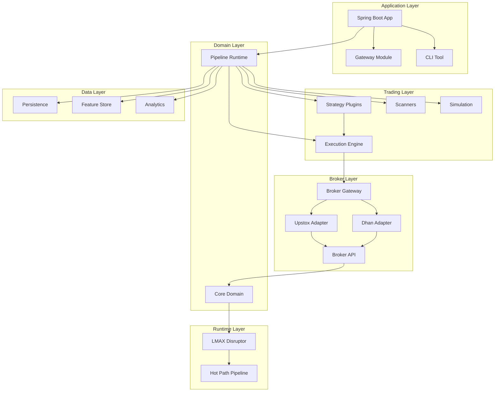
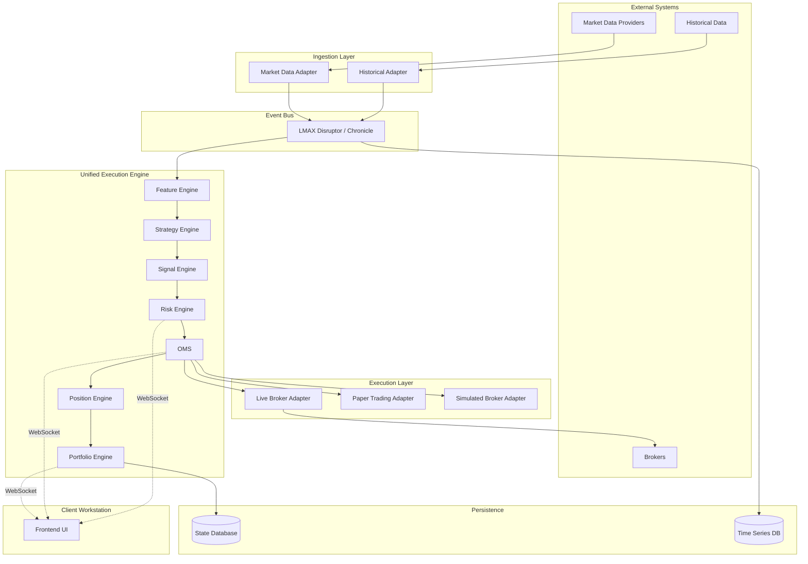
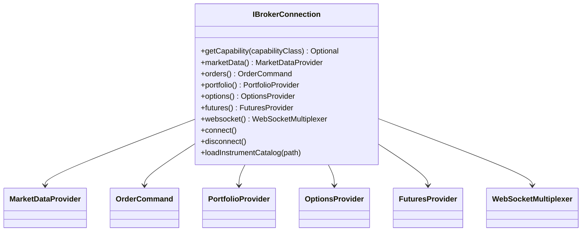
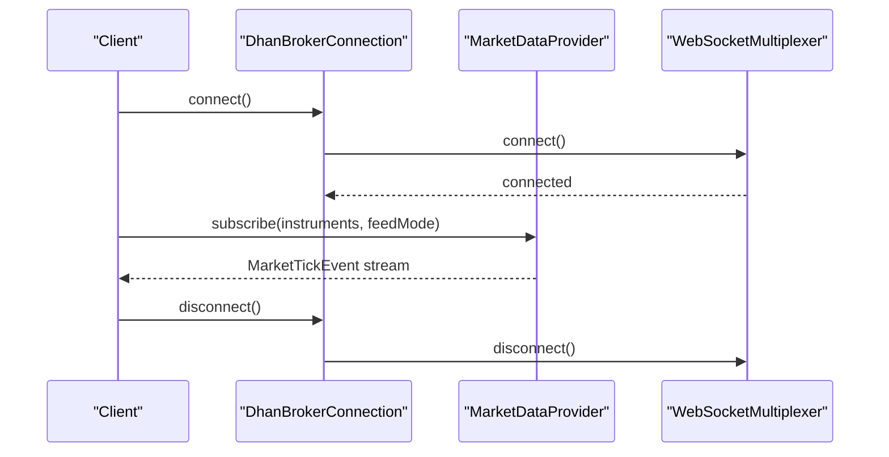
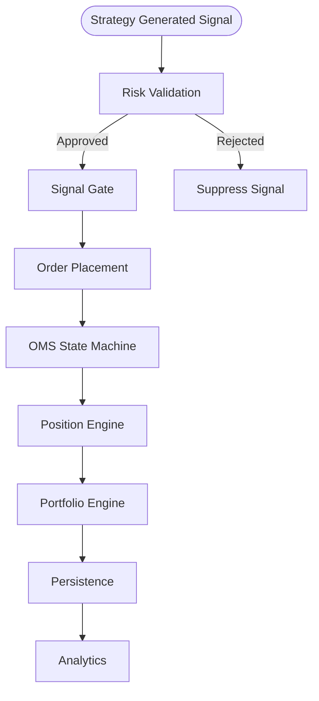
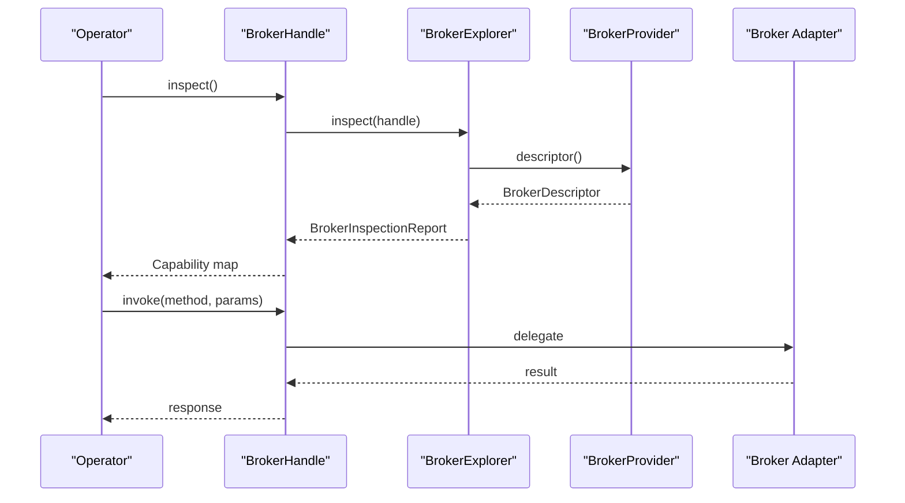
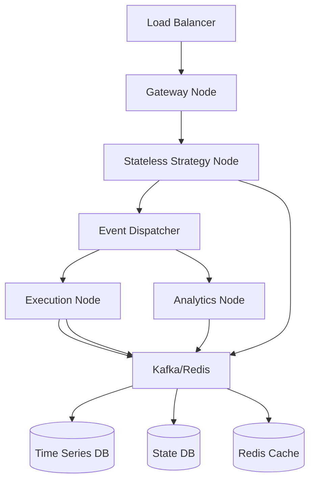
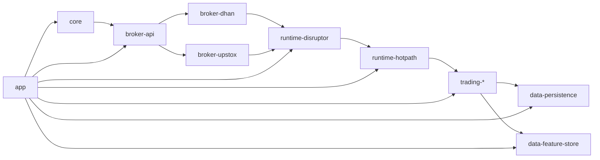

# Project Overview

<cite>
**Referenced Files in This Document**
- [README.md](file://README.md)
- [ARCHITECTURE.md](file://ARCHITECTURE.md)
- [docs/TRADEJ_INSTITUTIONAL_ARCHITECTURE.md](file://docs/TRADEJ_INSTITUTIONAL_ARCHITECTURE.md)
- [docs/HORIZONTAL_SCALING_DESIGN.md](file://docs/HORIZONTAL_SCALING_DESIGN.md)
- [docs/PIPELINE_DESIGN.md](file://docs/PIPELINE_DESIGN.md)
- [docs/E2E_VERIFICATION.md](file://docs/E2E_VERIFICATION.md)
- [docs/BROKER_GATEWAY_ARCHITECTURE_REVIEW.md](file://docs/BROKER_GATEWAY_ARCHITECTURE_REVIEW.md)
- [build.gradle](file://build.gradle)
- [settings.gradle](file://settings.gradle)
- [app/src/main/resources/application.yml](file://app/src/main/resources/application.yml)
- [broker/api/src/main/java/com/tradej/broker/api/IBrokerConnection.java](file://broker/api/src/main/java/com/tradej/broker/api/IBrokerConnection.java)
- [broker/dhan/src/main/java/com/tradej/broker/dhan/DhanBrokerConnection.java](file://broker/dhan/src/main/java/com/tradej/broker/dhan/DhanBrokerConnection.java)
- [broker/upstox/src/main/java/com/tradej/broker/upstox/websocket/UpstoxWebSocketMultiplexer.java](file://broker/upstox/src/main/java/com/tradej/broker/upstox/websocket/UpstoxWebSocketMultiplexer.java)
</cite>

## Table of Contents
1. [Introduction](#introduction)
2. [Project Structure](#project-structure)
3. [Core Components](#core-components)
4. [Architecture Overview](#architecture-overview)
5. [Detailed Component Analysis](#detailed-component-analysis)
6. [Dependency Analysis](#dependency-analysis)
7. [Performance Considerations](#performance-considerations)
8. [Troubleshooting Guide](#troubleshooting-guide)
9. [Conclusion](#conclusion)
10. [Appendices](#appendices)

## Introduction
Trade-J is a Java 21 trading platform designed for institutional and advanced retail traders. It provides live market data ingestion, a unified Order Management System (OMS), configurable risk management, extensible strategy plugins, and multi-broker adapters for Dhan and Upstox. The platform emphasizes correctness, scalability, and maintainability through a hexagonal architecture, event-driven design, and strict separation of concerns. It supports multiple runtime modes—Live Trading, Paper Trading, Replay, and Backtesting—without duplicating strategy or core engine logic.

Practical capabilities demonstrated by the platform include:
- Real-time market data via WebSocket multiplexers with automatic reconnect and health monitoring
- Order lifecycle management through a strict OMS state machine with reconciliation against broker feeds
- Risk enforcement via mandatory interceptors that validate pre-trade and post-trade constraints
- Strategy plugin framework enabling composable, testable trading logic
- Multi-broker abstraction enabling seamless switching and load-balancing across Dhan and Upstox

**Section sources**
- [README.md:1-47](file://README.md#L1-L47)
- [docs/TRADEJ_INSTITUTIONAL_ARCHITECTURE.md:1-364](file://docs/TRADEJ_INSTITUTIONAL_ARCHITECTURE.md#L1-L364)

## Project Structure
Trade-J is organized as a multi-module Gradle project with clear layering and responsibility segregation:
- Core domain and ports define the business models and interfaces
- Broker modules implement adapters for Dhan and Upstox
- Trading modules encapsulate strategies, execution, scanners, and simulations
- Data modules provide persistence, feature stores, and analytics
- Runtime modules implement the high-throughput event bus and hot path processing
- Application, gateway, and CLI modules provide user-facing entry points

**Diagram sources**
- [ARCHITECTURE.md:28-62](file://ARCHITECTURE.md#L28-L62)
- [docs/TRADEJ_INSTITUTIONAL_ARCHITECTURE.md:160-182](file://docs/TRADEJ_INSTITUTIONAL_ARCHITECTURE.md#L160-L182)

**Section sources**
- [ARCHITECTURE.md:24-62](file://ARCHITECTURE.md#L24-L62)
- [settings.gradle:1-95](file://settings.gradle#L1-L95)
- [build.gradle:1-301](file://build.gradle#L1-L301)

## Core Components
- Core domain: Defines canonical models (Instrument, Position, Order, Trade, Portfolio) and domain events, ensuring business logic independence from infrastructure
- Broker API: Provides a capability-based SPI for market data, orders, portfolio, options, futures, and advanced order types
- Broker adapters: Implementations for Dhan and Upstox, exposing standardized capabilities while handling broker-specific protocols
- Trading engine: Composed of strategy plugins, execution engine, scanners, and simulation modules
- Data and analytics: DuckDB-backed persistence, feature store, and analytics engine
- Runtime: LMAX Disruptor-based event bus and hot path pipeline for high-frequency processing
- Application, gateway, and CLI: REST/WebSocket controllers, WebSocket bridge, and operator CLI for operational tasks

Key runtime configuration and profiles are defined in application YAML, enabling mode selection (LIVE, REPLAY, BACKTEST), broker routing, and feature toggles.

**Section sources**
- [docs/TRADEJ_INSTITUTIONAL_ARCHITECTURE.md:85-156](file://docs/TRADEJ_INSTITUTIONAL_ARCHITECTURE.md#L85-L156)
- [app/src/main/resources/application.yml:1-165](file://app/src/main/resources/application.yml#L1-L165)

## Architecture Overview
Trade-J employs a hexagonal architecture with clear ports and adapters, enabling:
- Clean separation between domain logic and external systems
- Pluggable broker adapters without modifying the OMS or strategies
- Event-driven processing via an append-only event log
- Multiple runtime modes sharing the same engine logic

**Diagram sources**
- [docs/TRADEJ_INSTITUTIONAL_ARCHITECTURE.md:8-81](file://docs/TRADEJ_INSTITUTIONAL_ARCHITECTURE.md#L8-L81)

**Section sources**
- [docs/TRADEJ_INSTITUTIONAL_ARCHITECTURE.md:1-364](file://docs/TRADEJ_INSTITUTIONAL_ARCHITECTURE.md#L1-L364)

## Detailed Component Analysis

### Hexagonal Architecture and Ports
The platform’s hexagonal design centers on capability-based ports defined in the broker API. The IBrokerConnection interface aggregates capability accessors for market data, orders, portfolio, options, futures, and advanced order types. This enables:
- Decoupled domain logic from broker specifics
- Capability discovery and optional feature gating
- Extensible broker ecosystem via SPI

**Diagram sources**
- [broker/api/src/main/java/com/tradej/broker/api/IBrokerConnection.java:23-107](file://broker/api/src/main/java/com/tradej/broker/api/IBrokerConnection.java#L23-L107)

**Section sources**
- [broker/api/src/main/java/com/tradej/broker/api/IBrokerConnection.java:1-108](file://broker/api/src/main/java/com/tradej/broker/api/IBrokerConnection.java#L1-L108)

### Multi-Broker Adapters: Dhan and Upstox
Dhan adapter:
- Implements comprehensive capabilities including market data, options, futures, bracket orders, GTT orders, slice orders, portfolio, margin, session risk, alerts, and instrument resolution
- Provides WebSocket multiplexer, REST clients, and historical data mapping
- Supports advanced features like 20-level depth, rolling options, and kill switch via capability markers

Upstox adapter:
- Implements market data, options, portfolio, and news providers
- Uses a sophisticated WebSocket multiplexer with dual streams (market data and order/portfolio updates)
- Includes health monitoring, automatic reconnect with exponential backoff, and duplicate event filtering

**Diagram sources**
- [broker/dhan/src/main/java/com/tradej/broker/dhan/DhanBrokerConnection.java:340-354](file://broker/dhan/src/main/java/com/tradej/broker/dhan/DhanBrokerConnection.java#L340-L354)

**Section sources**
- [broker/dhan/src/main/java/com/tradej/broker/dhan/DhanBrokerConnection.java:1-443](file://broker/dhan/src/main/java/com/tradej/broker/dhan/DhanBrokerConnection.java#L1-L443)
- [broker/upstox/src/main/java/com/tradej/broker/upstox/websocket/UpstoxWebSocketMultiplexer.java:118-190](file://broker/upstox/src/main/java/com/tradej/broker/upstox/websocket/UpstoxWebSocketMultiplexer.java#L118-L190)

### Pipeline and Strategy Execution
The pipeline runtime enforces a safe topology requiring risk and OMS/order placement when strategies are present. The event flow progresses from strategy-generated signals through risk validation to order placement and OMS state transitions.

**Diagram sources**
- [docs/PIPELINE_DESIGN.md:1-17](file://docs/PIPELINE_DESIGN.md#L1-L17)

**Section sources**
- [docs/PIPELINE_DESIGN.md:1-17](file://docs/PIPELINE_DESIGN.md#L1-L17)

### Broker Gateway and Capability Discovery
The Broker Gateway provides a facade for discovering and invoking broker capabilities dynamically. It supports capability inspection, broker-specific extras, and load-balanced routing across multiple brokers. The gateway currently exposes most capabilities but has room for improvement in dynamic invocation and metadata-rich discovery.

**Diagram sources**
- [docs/BROKER_GATEWAY_ARCHITECTURE_REVIEW.md:9-25](file://docs/BROKER_GATEWAY_ARCHITECTURE_REVIEW.md#L9-L25)

**Section sources**
- [docs/BROKER_GATEWAY_ARCHITECTURE_REVIEW.md:1-497](file://docs/BROKER_GATEWAY_ARCHITECTURE_REVIEW.md#L1-L497)

### Horizontal Scaling Design
Trade-J outlines a roadmap to scale from a single-node deployment to a horizontally distributed system:
- Event transport abstraction enabling in-memory, Kafka, or Redis Streams
- Symbol-based sharding for partitioning by instrument
- Stateless node specialization for market data, strategy, execution, analytics, and gateway
- Externalized state using PostgreSQL, ClickHouse, Redis, and Kafka/Redis Streams

**Diagram sources**
- [docs/HORIZONTAL_SCALING_DESIGN.md:34-64](file://docs/HORIZONTAL_SCALING_DESIGN.md#L34-L64)

**Section sources**
- [docs/HORIZONTAL_SCALING_DESIGN.md:1-250](file://docs/HORIZONTAL_SCALING_DESIGN.md#L1-L250)

## Dependency Analysis
The module dependency flow reflects a layered architecture with clear boundaries:
- Core domain and ports form the foundation
- Broker API and core provide shared infrastructure
- Broker adapters implement concrete integrations
- Trading modules consume the pipeline and runtime
- Data modules persist and analyze events
- Application composes all modules

**Diagram sources**
- [ARCHITECTURE.md:51-62](file://ARCHITECTURE.md#L51-L62)

**Section sources**
- [ARCHITECTURE.md:51-62](file://ARCHITECTURE.md#L51-L62)
- [settings.gradle:1-95](file://settings.gradle#L1-L95)

## Performance Considerations
- Event bus: LMAX Disruptor provides high-throughput, low-latency inter-thread communication for the hot path
- Runtime: Dedicated hot path pipeline optimizes market data and order processing stages
- Persistence: DuckDB for analytics and event store, with Chronicle Queue for durable event logs
- Resilience: Circuit breakers, retry executors, and exponential backoff mitigate broker failures
- Reconnect: Robust reconnect managers with jitter prevent thundering herds and maintain continuity
- Scaling: Horizontal scaling roadmap targets multi-node deployment with event transport abstraction and symbol-based partitioning

[No sources needed since this section provides general guidance]

## Troubleshooting Guide
Common operational areas and diagnostics:
- Health indicators: Market data, broker, order pipeline, and Upstox health checks
- Startup orchestration: Broker startup orchestrator validates catalogs, preflights, and WebSocket connectivity
- Reconnect and recovery: Reconnect listeners notify recovery; subscription recovery manager reconciles after reconnect
- Gateway routing: Load-balanced broker gateway and failover mechanisms ensure resilience
- Test coverage: Incremental verification across unit, component, and integration tiers ensures correctness

**Section sources**
- [docs/E2E_VERIFICATION.md:1-60](file://docs/E2E_VERIFICATION.md#L1-L60)

## Conclusion
Trade-J delivers a production-grade, hexagonally-architected trading platform that separates domain logic from infrastructure, supports multiple brokers, and scales from single-node to distributed deployments. Its event-driven design, strict OMS state machine, and capability-based broker abstraction enable reliable, testable, and extensible trading systems. The platform’s runtime modes and comprehensive test pyramid ensure correctness across Live, Replay, and Backtest scenarios.

[No sources needed since this section summarizes without analyzing specific files]

## Appendices

### Technology Stack
- Java 21, Spring Boot 3.5.0, Gradle
- LMAX Disruptor, Chronicle Queue, DuckDB
- WebSocket, REST, Micrometer metrics, Prometheus

**Section sources**
- [ARCHITECTURE.md:3-6](file://ARCHITECTURE.md#L3-L6)
- [build.gradle:1-301](file://build.gradle#L1-L301)

### Practical Examples
- Live market data: Configure broker profiles and run the Spring Boot app with selected runtime mode
- Broker capability inspection: Use CLI commands to inspect and validate broker capabilities
- Strategy execution: Compose strategies in the pipeline runtime and observe risk validation and order placement
- Replay/backtest: Use historical data and replay engine to validate strategy parity

**Section sources**
- [README.md:5-16](file://README.md#L5-L16)
- [docs/BROKER_GATEWAY_ARCHITECTURE_REVIEW.md:184-210](file://docs/BROKER_GATEWAY_ARCHITECTURE_REVIEW.md#L184-L210)
- [docs/PIPELINE_DESIGN.md:10-17](file://docs/PIPELINE_DESIGN.md#L10-L17)