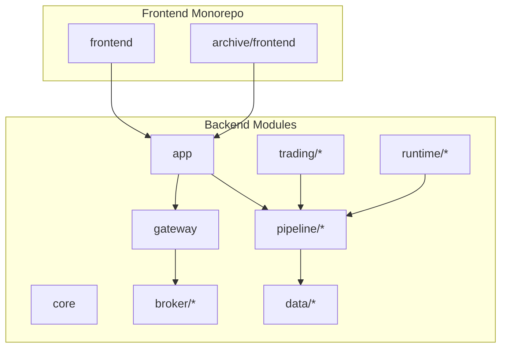
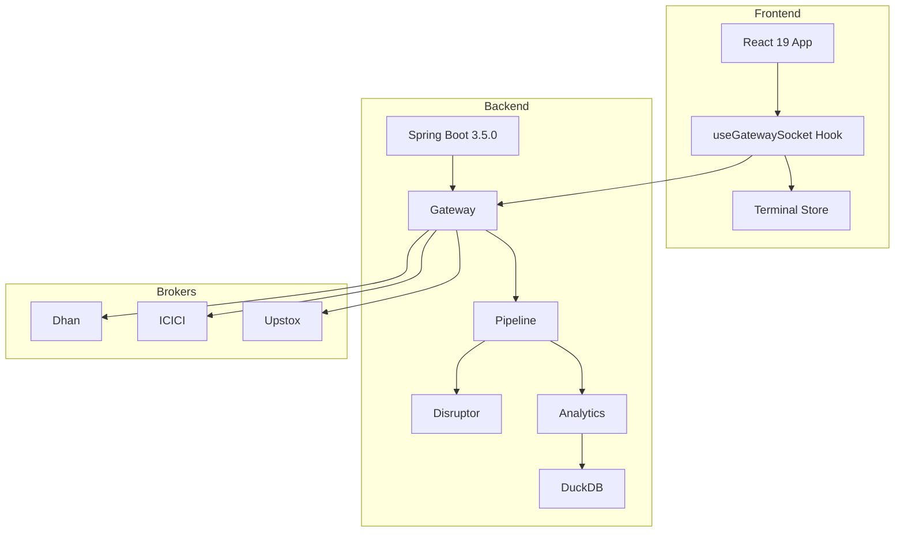
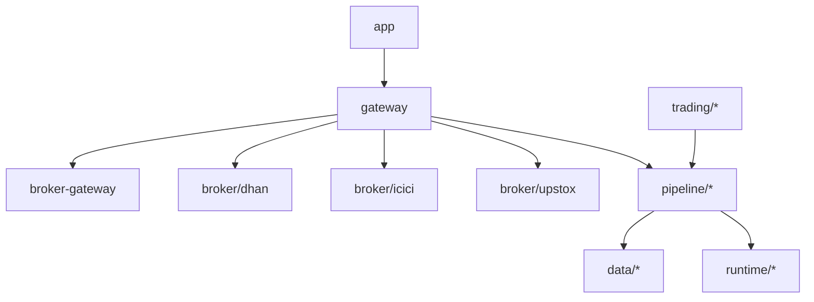
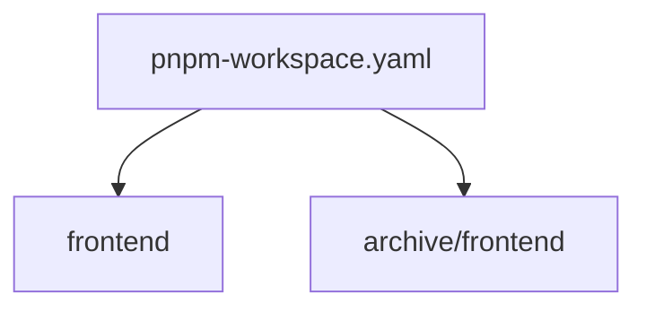
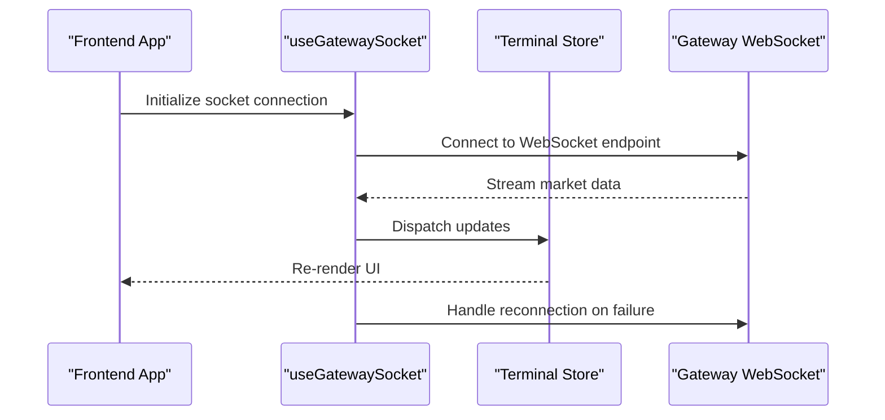
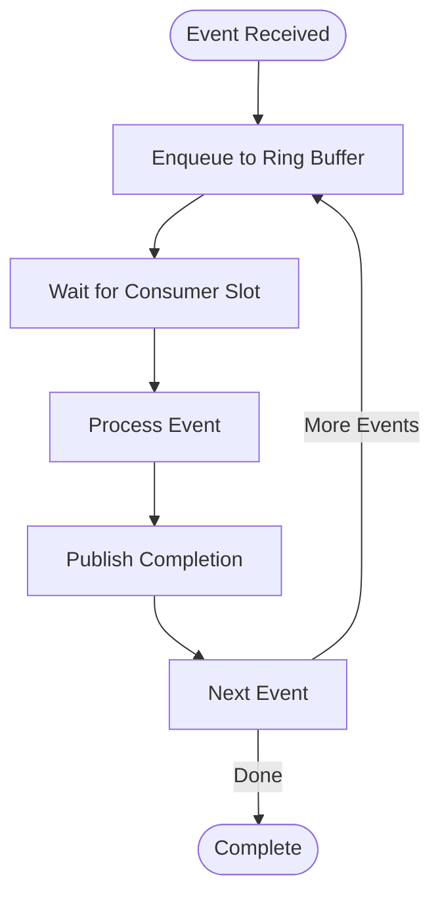
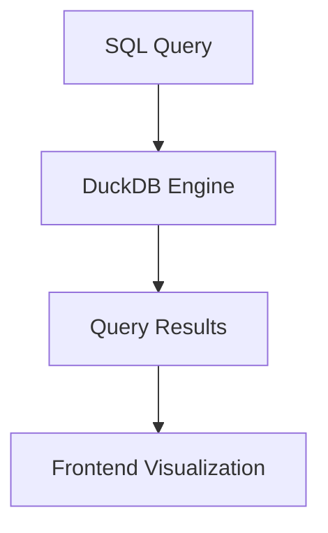

# Technology Stack

<cite>
**Referenced Files in This Document**
- [build.gradle](file://build.gradle)
- [settings.gradle](file://settings.gradle)
- [gradle.properties](file://gradle.properties)
- [pnpm-workspace.yaml](file://pnpm-workspace.yaml)
- [frontend/package.json](file://frontend/package.json)
- [archive/frontend/package.json](file://archive/frontend/package.json)
- [frontend/vite.config.ts](file://frontend/vite.config.ts)
- [app/src/main/resources/application.yml](file://app/src/main/resources/application.yml)
- [runtime/disruptor/build.gradle](file://runtime/disruptor/build.gradle)
- [data/analytics/build.gradle](file://data/analytics/build.gradle)
- [gateway/src/main/java/com/tradej/gateway/websocket/WebSocketConfig.java](file://gateway/src/main/java/com/tradej/gateway/websocket/WebSocketConfig.java)
- [frontend/src/hooks/useGatewaySocket.ts](file://frontend/src/hooks/useGatewaySocket.ts)
- [frontend/src/state/terminalStore.ts](file://frontend/src/state/terminalStore.ts)
- [docs/ARCHITECTURE.md](file://docs/ARCHITECTURE.md)
- [README.md](file://README.md)
</cite>

## Table of Contents
1. [Introduction](#introduction)
2. [Project Structure](#project-structure)
3. [Core Technologies](#core-technologies)
4. [Architecture Overview](#architecture-overview)
5. [Detailed Component Analysis](#detailed-component-analysis)
6. [Dependency Management](#dependency-management)
7. [Development Environment Setup](#development-environment-setup)
8. [Performance and Scalability](#performance-and-scalability)
9. [Troubleshooting Guide](#troubleshooting-guide)
10. [Conclusion](#conclusion)

## Introduction
This document provides a comprehensive overview of the Trade-J technology stack, focusing on the core technologies that power the system: Java 21, Spring Boot 3.5.0, LMAX Disruptor for high-performance event processing, DuckDB for embedded analytics, React 19 with Vite 6 for the frontend, and WebSocket for real-time communication. It explains the rationale behind each choice, their roles in the system architecture, version compatibility requirements, and integration patterns between backend and frontend components. Guidance on setting up development environments and understanding the tech stack's impact on performance and scalability is also included.

## Project Structure
Trade-J follows a modular, multi-module Gradle-based backend architecture with a frontend monorepo managed via pnpm. The backend is organized into cohesive modules representing distinct domains (broker integration, gateway, pipeline, trading, data, etc.), while the frontend is structured around React 19 with Vite 6 and a clear separation of concerns for state, hooks, and UI components.

**Diagram sources**
- [settings.gradle](file://settings.gradle)
- [pnpm-workspace.yaml](file://pnpm-workspace.yaml)

**Section sources**
- [settings.gradle](file://settings.gradle)
- [pnpm-workspace.yaml](file://pnpm-workspace.yaml)

## Core Technologies

### Java 21
Java 21 is selected as the primary runtime for the backend due to its performance improvements, stability, and strong support for reactive programming and concurrency. It enables efficient utilization of modern JVM features and aligns with the project's focus on high-throughput systems.

Rationale:
- Performance: Enhanced JIT compiler and vectorized runtime improve throughput.
- Concurrency: Structured concurrency and virtual threads reduce latency under load.
- Stability: LTS alignment ensures long-term maintainability.

Version Compatibility:
- Java 21 is configured as the toolchain and target compatibility level across modules.

**Section sources**
- [gradle.properties](file://gradle.properties)
- [build.gradle](file://build.gradle)

### Spring Boot 3.5.0
Spring Boot 3.5.0 provides a robust foundation for building microservice-style backend components, offering auto-configuration, embedded servers, and comprehensive ecosystem integration. It supports reactive programming and integrates seamlessly with WebSocket for real-time features.

Rationale:
- Rapid development: Auto-configuration reduces boilerplate.
- Observability: Built-in actuator endpoints and metrics.
- Ecosystem: Rich set of starters and integrations.

Version Compatibility:
- Spring Boot 3.5.0 is used consistently across modules.

**Section sources**
- [app/src/main/resources/application.yml](file://app/src/main/resources/application.yml)
- [build.gradle](file://build.gradle)

### LMAX Disruptor for High-Performance Event Processing
The Disruptor library is integrated to achieve lock-free, high-throughput event processing in hot paths. It minimizes contention and maximizes throughput for scenarios such as market data ingestion and order execution routing.

Rationale:
- Throughput: Lock-free ring buffer architecture.
- Latency: Predictable low-latency event delivery.
- Scalability: Efficient producer-consumer patterns.

Module Integration:
- The disruptor module encapsulates event processing logic and is consumed by pipeline and gateway components.

**Section sources**
- [runtime/disruptor/build.gradle](file://runtime/disruptor/build.gradle)
- [docs/ARCHITECTURE.md](file://docs/ARCHITECTURE.md)

### DuckDB for Embedded Analytics
DuckDB is used for embedded analytics workloads, enabling fast analytical queries against historical and real-time datasets without external dependencies. It integrates with the analytics module to support ad-hoc analysis and reporting.

Rationale:
- Speed: Columnar storage and SIMD acceleration.
- Simplicity: Zero-configuration embedded engine.
- SQL: Familiar SQL interface for analysts and developers.

Module Integration:
- The analytics module leverages DuckDB for query execution and result aggregation.

**Section sources**
- [data/analytics/build.gradle](file://data/analytics/build.gradle)
- [docs/ARCHITECTURE.md](file://docs/ARCHITECTURE.md)

### React 19 with Vite 6 for Frontend
The frontend is built with React 19 and Vite 6, providing a modern development experience with fast builds, hot module replacement, and optimized production bundles. The monorepo setup allows maintaining both current and archived frontend versions.

Rationale:
- Developer Experience: Fast cold starts and HMR.
- Performance: Optimized bundling and tree-shaking.
- Modern Tooling: TypeScript support and plugin ecosystem.

Monorepo Setup:
- pnpm workspace coordinates multiple packages and shared dependencies.

**Section sources**
- [pnpm-workspace.yaml](file://pnpm-workspace.yaml)
- [frontend/package.json](file://frontend/package.json)
- [frontend/vite.config.ts](file://frontend/vite.config.ts)

### WebSocket for Real-Time Communication
WebSocket is used for real-time market data streaming and bidirectional communication between the frontend and backend. The gateway exposes WebSocket endpoints, while the frontend consumes them via dedicated hooks and stores.

Rationale:
- Efficiency: Persistent connection reduces overhead.
- Responsiveness: Low-latency updates for market data and alerts.
- Scalability: Horizontal scaling with proper load balancing.

**Section sources**
- [gateway/src/main/java/com/tradej/gateway/websocket/WebSocketConfig.java](file://gateway/src/main/java/com/tradej/gateway/websocket/WebSocketConfig.java)
- [frontend/src/hooks/useGatewaySocket.ts](file://frontend/src/hooks/useGatewaySocket.ts)
- [frontend/src/state/terminalStore.ts](file://frontend/src/state/terminalStore.ts)

## Architecture Overview
The system architecture centers around a modular backend and a modern frontend, with real-time WebSocket streams bridging the two. The Disruptor handles high-frequency events, while DuckDB powers analytics. The gateway orchestrates broker connections and exposes unified APIs and WebSocket endpoints.

**Diagram sources**
- [docs/ARCHITECTURE.md](file://docs/ARCHITECTURE.md)
- [gateway/src/main/java/com/tradej/gateway/websocket/WebSocketConfig.java](file://gateway/src/main/java/com/tradej/gateway/websocket/WebSocketConfig.java)
- [runtime/disruptor/build.gradle](file://runtime/disruptor/build.gradle)
- [data/analytics/build.gradle](file://data/analytics/build.gradle)

## Detailed Component Analysis

### Backend Module Organization
Modules are organized by domain and responsibility, promoting separation of concerns and maintainability. Key modules include:
- app: Application entrypoints and profiles
- broker/*: Broker-specific integrations (Dhan, ICICI, Upstox)
- gateway: Transport and routing layer
- pipeline/*: Event processing and orchestration
- runtime/*: Hot-path and performance-critical components
- data/*: Persistence, analytics, and feature store
- trading/*: Strategy, scanner, and execution logic

**Diagram sources**
- [settings.gradle](file://settings.gradle)

**Section sources**
- [settings.gradle](file://settings.gradle)

### Frontend Monorepo Setup
The frontend monorepo uses pnpm workspace to manage multiple packages and shared dependencies. Two frontend directories exist:
- frontend: Current React 19 implementation with Vite 6
- archive/frontend: Legacy frontend for reference and migration

**Diagram sources**
- [pnpm-workspace.yaml](file://pnpm-workspace.yaml)

**Section sources**
- [pnpm-workspace.yaml](file://pnpm-workspace.yaml)
- [frontend/package.json](file://frontend/package.json)
- [archive/frontend/package.json](file://archive/frontend/package.json)

### WebSocket Integration Pattern
WebSocket endpoints are exposed by the gateway and consumed by the frontend through a dedicated hook. The hook manages connection lifecycle, reconnection logic, and state synchronization.

**Diagram sources**
- [frontend/src/hooks/useGatewaySocket.ts](file://frontend/src/hooks/useGatewaySocket.ts)
- [frontend/src/state/terminalStore.ts](file://frontend/src/state/terminalStore.ts)
- [gateway/src/main/java/com/tradej/gateway/websocket/WebSocketConfig.java](file://gateway/src/main/java/com/tradej/gateway/websocket/WebSocketConfig.java)

**Section sources**
- [frontend/src/hooks/useGatewaySocket.ts](file://frontend/src/hooks/useGatewaySocket.ts)
- [frontend/src/state/terminalStore.ts](file://frontend/src/state/terminalStore.ts)
- [gateway/src/main/java/com/tradej/gateway/websocket/WebSocketConfig.java](file://gateway/src/main/java/com/tradej/gateway/websocket/WebSocketConfig.java)

### Disruptor-Based Event Processing
The Disruptor module implements a high-throughput, lock-free event processing pipeline. It is integrated into the pipeline runtime to handle market data ticks and order events efficiently.

**Diagram sources**
- [runtime/disruptor/build.gradle](file://runtime/disruptor/build.gradle)

**Section sources**
- [runtime/disruptor/build.gradle](file://runtime/disruptor/build.gradle)

### DuckDB Analytics Integration
The analytics module leverages DuckDB for embedded analytical queries. It provides a lightweight, zero-dependency solution for ad-hoc analysis and reporting.

**Diagram sources**
- [data/analytics/build.gradle](file://data/analytics/build.gradle)

**Section sources**
- [data/analytics/build.gradle](file://data/analytics/build.gradle)

## Dependency Management
Gradle manages backend dependencies with centralized version catalogs and module-specific configurations. The root build script defines common plugins and repositories, while individual modules declare their dependencies.

Key aspects:
- Centralized property management for versions
- Modular build scripts for each domain
- Lock files for reproducible builds

**Section sources**
- [build.gradle](file://build.gradle)
- [gradle.properties](file://gradle.properties)

## Development Environment Setup
Prerequisites:
- Java 21 JDK
- Node.js and pnpm for frontend
- Git for version control

Backend setup:
- Clone repository and import into IDE
- Sync Gradle projects
- Configure application profiles as needed

Frontend setup:
- Install pnpm globally
- Navigate to frontend directory
- Install dependencies and start dev server

Verification:
- Run integration tests to validate WebSocket connectivity
- Use smoke scripts for broker connections

**Section sources**
- [README.md](file://README.md)
- [scripts/test-websocket-connections.sh](file://scripts/test-websocket-connections.sh)

## Performance and Scalability
Technology choices are aligned with performance and scalability goals:
- Java 21 and Spring Boot 3.5.0 enable efficient resource utilization and reactive programming.
- LMAX Disruptor minimizes contention and maximizes throughput for event-driven systems.
- DuckDB provides fast analytical queries with minimal operational overhead.
- React 19 with Vite 6 ensures a responsive frontend with optimized builds.
- WebSocket enables scalable real-time communication with proper connection management.

Impact:
- Reduced latency through lock-free event processing and persistent connections.
- Improved scalability via horizontal scaling of gateway and broker components.
- Enhanced developer productivity with modern tooling and modular architecture.

**Section sources**
- [docs/ARCHITECTURE.md](file://docs/ARCHITECTURE.md)
- [runtime/disruptor/build.gradle](file://runtime/disruptor/build.gradle)
- [data/analytics/build.gradle](file://data/analytics/build.gradle)

## Troubleshooting Guide
Common issues and resolutions:
- WebSocket connection failures: Verify gateway configuration and network connectivity; check frontend hook reconnection logic.
- Build failures: Ensure Java 21 is set as the toolchain; sync Gradle projects and resolve dependency conflicts.
- Frontend build errors: Confirm pnpm installation and workspace configuration; clear node_modules if necessary.
- Performance bottlenecks: Profile backend hot paths using Disruptor metrics; optimize frontend rendering with React DevTools.

**Section sources**
- [gateway/src/main/java/com/tradej/gateway/websocket/WebSocketConfig.java](file://gateway/src/main/java/com/tradej/gateway/websocket/WebSocketConfig.java)
- [frontend/src/hooks/useGatewaySocket.ts](file://frontend/src/hooks/useGatewaySocket.ts)
- [runtime/disruptor/build.gradle](file://runtime/disruptor/build.gradle)

## Conclusion
Trade-J leverages a modern, high-performance technology stack tailored for financial trading applications. Java 21 and Spring Boot 3.5.0 provide a robust backend foundation, while LMAX Disruptor and DuckDB deliver exceptional performance for event processing and analytics. The React 19 frontend with Vite 6 ensures a responsive user experience, and WebSocket enables seamless real-time communication. Together, these technologies create a scalable, maintainable, and high-throughput system suitable for demanding trading environments.