# Testing Strategy

<cite>
**Referenced Files in This Document**
- [TESTING.md](file://TESTING.md)
- [.github/workflows/ci.yml](file://.github/workflows/ci.yml)
- [app/src/test/java/com/tradej/app/integration/AdminTestBase.java](file://app/src/test/java/com/tradej/app/integration/AdminTestBase.java)
- [app/src/test/java/com/tradej/app/integration/ConsoleApiContractIntegrationTest.java](file://app/src/test/java/com/tradej/app/integration/ConsoleApiContractIntegrationTest.java)
- [app/src/test/java/com/tradej/app/integration/ConsoleApiContractTestConfig.java](file://app/src/test/java/com/tradej/app/integration/ConsoleApiContractTestConfig.java)
- [app/src/test/java/com/tradej/app/integration/ConsoleFeIntegrationTest.java](file://app/src/test/java/com/tradej/app/integration/ConsoleFeIntegrationTest.java)
- [app/src/test/java/com/tradej/app/integration/ConsoleFeTestConfig.java](file://app/src/test/java/com/tradej/app/integration/ConsoleFeTestConfig.java)
- [app/src/test/java/com/tradej/app/integration/DhanOrderLifecycleIntegrationTest.java](file://app/src/test/java/com/tradej/app/integration/DhanOrderLifecycleIntegrationTest.java)
- [app/src/test/java/com/tradej/app/integration/IciciOrderLifecycleIntegrationTest.java](file://app/src/test/java/com/tradej/app/integration/IciciOrderLifecycleIntegrationTest.java)
- [app/src/test/java/com/tradej/app/integration/UpstoxMarketFeedIntegrationTest.java](file://app/src/test/java/com/tradej/app/integration/UpstoxMarketFeedIntegrationTest.java)
- [app/src/test/java/com/tradej/app/integration/TradingHotPathE2EComponentTest.java](file://app/src/test/java/com/tradej/app/integration/TradingHotPathE2EComponentTest.java)
- [app/src/test/java/com/tradej/app/integration/KillSwitchE2EComponentTest.java](file://app/src/test/java/com/tradej/app/integration/KillSwitchE2EComponentTest.java)
- [app/src/test/java/com/tradej/app/integration/RegressionPreflightIntegrationTest.java](file://app/src/test/java/com/tradej/app/integration/RegressionPreflightIntegrationTest.java)
- [app/src/test/java/com/tradej/app/integration/UpstoxRegressionPreflightIntegrationTest.java](file://app/src/test/java/com/tradej/app/integration/UpstoxRegressionPreflightIntegrationTest.java)
- [app/src/test/java/com/tradej/app/integration/GatewayLiveBenchmark.java](file://app/src/test/java/com/tradej/app/integration/GatewayLiveBenchmark.java)
- [app/src/test/java/com/tradej/app/integration/GatewayReplaySmokeTest.java](file://app/src/test/java/com/tradej/app/integration/GatewayReplaySmokeTest.java)
- [app/src/test/java/com/tradej/app/integration/CheckSpeedLiveTest.java](file://app/src/test/java/com/tradej/app/integration/CheckSpeedLiveTest.java)
- [app/src/test/java/com/tradej/app/integration/ChronicleReplayParityIntegrationTest.java](file://app/src/test/java/com/tradej/app/integration/ChronicleReplayParityIntegrationTest.java)
- [app/src/test/java/com/tradej/app/integration/TripleModePNLParityTest.java](file://app/src/test/java/com/tradej/app/integration/TripleModePNLParityTest.java)
- [app/src/test/java/com/tradej/app/integration/ReplayParityHashTest.java](file://app/src/test/java/com/tradej/app/integration/ReplayParityHashTest.java)
- [app/src/test/java/com/tradej/app/integration/PipelineNodeParityComponentTest.java](file://app/src/test/java/com/tradej/app/integration/PipelineNodeParityComponentTest.java)
- [app/src/test/java/com/tradej/app/integration/OrderReplayIntegrationTest.java](file://app/src/test/java/com/tradej/app/integration/OrderReplayIntegrationTest.java)
- [app/src/test/java/com/tradej/app/integration/FillReplayIntegrationTest.java](file://app/src/test/java/com/tradej/app/integration/FillReplayIntegrationTest.java)
- [app/src/test/java/com/tradej/app/integration/TradingRuntimeReconciliationIntegrationTest.java](file://app/src/test/java/com/tradej/app/integration/TradingRuntimeReconciliationIntegrationTest.java)
- [app/src/test/java/com/tradej/app/integration/DisruptorSignalToExecutionComponentTest.java](file://app/src/test/java/com/tradej/app/integration/DisruptorSignalToExecutionComponentTest.java)
- [app/src/test/java/com/tradej/app/integration/DisruptorTickToCandleComponentTest.java](file://app/src/test/java/com/tradej/app/integration/DisruptorTickToCandleComponentTest.java)
- [app/src/test/java/com/tradej/app/integration/MarginEnforcementComponentTest.java](file://app/src/test/java/com/tradej/app/integration/MarginEnforcementComponentTest.java)
- [app/src/test/java/com/tradej/app/integration/PositionRiskHandlerComponentTest.java](file://app/src/test/java/com/tradej/app/integration/PositionRiskHandlerComponentTest.java)
- [app/src/test/java/com/tradej/app/integration/OrderPartiallyFilledHotPathComponentTest.java](file://app/src/test/java/com/tradej/app/integration/OrderPartiallyFilledHotPathComponentTest.java)
- [app/src/test/java/com/tradej/app/integration/OmsToExecutionSandboxIntegrationTest.java](file://app/src/test/java/com/tradej/app/integration/OmsToExecutionSandboxIntegrationTest.java)
- [app/src/test/java/com/tradej/app/integration/ExecutionToSandboxBrokerIntegrationTest.java](file://app/src/test/java/com/tradej/app/integration/ExecutionToSandboxBrokerIntegrationTest.java)
- [app/src/test/java/com/tradej/app/integration/ScanEngineIntegrationTest.java](file://app/src/test/java/com/tradej/app/integration/ScanEngineIntegrationTest.java)
- [app/src/test/java/com/tradej/app/integration/InstitutionalScanIntegrationTest.java](file://app/src/test/java/com/tradej/app/integration/InstitutionalScanIntegrationTest.java)
- [app/src/test/java/com/tradej/app/integration/LivePnlIntegrationTest.java](file://app/src/test/java/com/tradej/app/integration/LivePnlIntegrationTest.java)
- [app/src/test/java/com/tradej/app/integration/AnalyticsFederationIntegrationTest.java](file://app/src/test/java/com/tradej/app/integration/AnalyticsFederationIntegrationTest.java)
- [app/src/test/java/com/tradej/app/integration/HistoricalRangeIntegrationTest.java](file://app/src/test/java/com/tradej/app/integration/HistoricalRangeIntegrationTest.java)
- [app/src/test/java/com/tradej/app/integration/SymbolControllerIntegrationTest.java](file://app/src/test/java/com/tradej/app/integration/SymbolControllerIntegrationTest.java)
- [app/src/test/java/com/tradej/app/integration/StudioChartIntegrationTest.java](file://app/src/test/java/com/tradej/app/integration/StudioChartIntegrationTest.java)
- [app/src/test/java/com/tradej/app/integration/StudioControllerContractTest.java](file://app/src/test/java/com/tradej/app/integration/StudioControllerContractTest.java)
- [app/src/test/java/com/tradej/app/integration/OrderControllerComponentTest.java](file://app/src/test/java/com/tradej/app/integration/OrderControllerComponentTest.java)
- [app/src/test/java/com/tradej/app/integration/GatewayWebSocketLifecycleTest.java](file://app/src/test/java/com/tradej/app/integration/GatewayWebSocketLifecycleTest.java)
- [app/src/test/java/com/tradej/app/integration/GatewayCheckSpeedLiveTest.java](file://app/src/test/java/com/tradej/app/integration/GatewayCheckSpeedLiveTest.java)
- [app/src/test/java/com/tradej/app/integration/DhanRuntimeSmokeIntegrationTest.java](file://app/src/test/java/com/tradej/app/integration/DhanRuntimeSmokeIntegrationTest.java)
- [app/src/test/java/com/tradej/app/integration/IciciRuntimeSmokeIntegrationTest.java](file://app/src/test/java/com/tradej/app/integration/IciciRuntimeSmokeIntegrationTest.java)
- [app/src/test/java/com/tradej/app/integration/UpstoxRuntimeSmokeIntegrationTest.java](file://app/src/test/java/com/tradej/app/integration/UpstoxRuntimeSmokeIntegrationTest.java)
- [app/src/test/java/com/tradej/app/integration/LiveDhanTestSupport.java](file://app/src/test/java/com/tradej/app/integration/LiveDhanTestSupport.java)
- [app/src/test/java/com/tradej/app/integration/LiveIciciTestSupport.java](file://app/src/test/java/com/tradej/app/integration/LiveIciciTestSupport.java)
- [app/src/test/java/com/tradej/app/integration/LiveUpstoxTestSupport.java](file://app/src/test/java/com/tradej/app/integration/LiveUpstoxTestSupport.java)
- [app/src/test/java/com/tradej/app/integration/LiveDhanAuthSession.java](file://app/src/test/java/com/tradej/app/integration/LiveDhanAuthSession.java)
- [app/src/test/java/com/tradej/app/startup/BrokerStartupOrchestratorAnalyticsTest.java](file://app/src/test/java/com/tradej/app/startup/BrokerStartupOrchestratorAnalyticsTest.java)
- [app/src/test/java/com/tradej/app/startup/BrokerStartupValidatorTest.java](file://app/src/test/java/com/tradej/app/startup/BrokerStartupValidatorTest.java)
- [app/src/test/java/com/tradej/app/subscription/SubscriptionCoordinatorTest.java](file://app/src/test/java/com/tradej/app/subscription/SubscriptionCoordinatorTest.java)
- [app/src/test/java/com/tradej/app/subscription/SubscriptionManagerTest.java](file://app/src/test/java/com/tradej/app/subscription/SubscriptionManagerTest.java)
- [app/src/test/java/com/tradej/app/subscription/SubscriptionRecoveryReconnectComponentTest.java](file://app/src/test/java/com/tradej/app/subscription/SubscriptionRecoveryReconnectComponentTest.java)
- [app/src/test/java/com/tradej/app/pipeline/DagPipelineIngressTest.java](file://app/src/test/java/com/tradej/app/pipeline/DagPipelineIngressTest.java)
- [app/src/test/java/com/tradej/app/pipeline/PipelineCompileRoutingTest.java](file://app/src/test/java/com/tradej/app/pipeline/PipelineCompileRoutingTest.java)
- [app/src/test/java/com/tradej/app/pipeline/ReplayMarketTickParityTest.java](file://app/src/test/java/com/tradej/app/pipeline/ReplayMarketTickParityTest.java)
- [app/src/test/java/com/tradej/app/metrics/TickReconciliationLiveSessionTest.java](file://app/src/test/java/com/tradej/app/metrics/TickReconciliationLiveSessionTest.java)
- [app/src/test/java/com/tradej/app/metrics/ObservableMarketDataProviderTest.java](file://app/src/test/java/com/tradej/app/metrics/ObservableMarketDataProviderTest.java)
- [app/src/test/java/com/tradej/app/metrics/ObservableOrderCommandTest.java](file://app/src/test/java/com/tradej/app/metrics/ObservableOrderCommandTest.java)
- [app/src/test/java/com/tradej/app/metrics/NseFullSessionSoakTest.java](file://app/src/test/java/com/tradej/app/metrics/NseFullSessionSoakTest.java)
- [app/src/test/java/com/tradej/app/metrics/McxFullSessionSoakTest.java](file://app/src/test/java/com/tradej/app/metrics/McxFullSessionSoakTest.java)
- [app/src/test/java/com/tradej/app/metrics/MetricsLoggerHarnessTest.java](file://app/src/test/java/com/tradej/app/metrics/MetricsLoggerHarnessTest.java)
- [app/src/test/java/com/tradej/app/health/BrokerErrorTrackerTest.java](file://app/src/test/java/com/tradej/app/health/BrokerErrorTrackerTest.java)
- [app/src/test/java/com/tradej/app/health/MarketDataHealthIndicatorTest.java](file://app/src/test/java/com/tradej/app/health/MarketDataHealthIndicatorTest.java)
- [app/src/test/java/com/tradej/app/health/OrderPipelineHealthIndicatorTest.java](file://app/src/test/java/com/tradej/app/health/OrderPipelineHealthIndicatorTest.java)
- [app/src/test/java/com/tradej/app/health/UpstoxHealthIndicatorTest.java](file://app/src/test/java/com/tradej/app/health/UpstoxHealthIndicatorTest.java)
- [app/src/test/java/com/tradej/app/config/GatewayProfileContextComponentTest.java](file://app/src/test/java/com/tradej/app/config/GatewayProfileContextComponentTest.java)
- [app/src/test/java/com/tradej/app/config/RuntimeConfigurationTest.java](file://app/src/test/java/com/tradej/app/config/RuntimeConfigurationTest.java)
- [app/src/test/java/com/tradej/app/config/RuntimeModeStartupOrderComponentTest.java](file://app/src/test/java/com/tradej/app/config/RuntimeModeStartupOrderComponentTest.java)
- [app/src/test/java/com/tradej/app/api/OrderControllerComponentTest.java](file://app/src/test/java/com/tradej/app/api/OrderControllerComponentTest.java)
- [app/src/test/java/com/tradej/app/api/StudioControllerContractTest.java](file://app/src/test/java/com/tradej/app/api/StudioControllerContractTest.java)
- [architecture-test/src/test/java/com/tradej/architecture/ModuleBoundaryArchitectureTest.java](file://architecture-test/src/test/java/com/tradej/architecture/ModuleBoundaryArchitectureTest.java)
- [architecture-test/src/test/java/com/tradej/architecture/ProfileIsolationArchitectureTest.java](file://architecture-test/src/test/java/com/tradej/architecture/ProfileIsolationArchitectureTest.java)
- [architecture-test/src/test/java/com/tradej/architecture/SpringFreeArchitectureTest.java](file://architecture-test/src/test/java/com/tradej/architecture/SpringFreeArchitectureTest.java)
- [broker/api/src/test/java/com/tradej/broker/api/IBrokerConnectionContractTest.java](file://broker/api/src/test/java/com/tradej/broker/api/IBrokerConnectionContractTest.java)
- [broker/core/src/test/java/com/tradej/broker/core/auth/DefaultTokenLifecycleServiceTest.java](file://broker/core/src/test/java/com/tradej/broker/core/auth/DefaultTokenLifecycleServiceTest.java)
- [broker/core/src/test/java/com/tradej/broker/core/routing/LoadBalancedBrokerGatewayTest.java](file://broker/core/src/test/java/com/tradej/broker/core/routing/LoadBalancedBrokerGatewayTest.java)
- [broker/core/src/test/java/com/tradej/broker/core/resilience/RetryExecutorTest.java](file://broker/core/src/test/java/com/tradej/broker/core/resilience/RetryExecutorTest.java)
- [broker/core/src/test/java/com/tradej/broker/core/rate/TokenBucketRateLimiterUnitTest.java](file://broker/core/src/test/java/com/tradej/broker/core/rate/TokenBucketRateLimiterUnitTest.java)
- [broker/core/src/test/java/com/tradej/broker/core/historical/HistoricalDateWindowSplitterTest.java](file://broker/core/src/test/java/com/tradej/broker/core/historical/HistoricalDateWindowSplitterTest.java)
- [frontend/src/components/AdminPanel.test.tsx](file://frontend/src/components/AdminPanel.test.tsx)
- [frontend/src/components/CommandPalette.test.tsx](file://frontend/src/components/CommandPalette.test.tsx)
- [frontend/src/components/ErrorBoundary.test.tsx](file://frontend/src/components/ErrorBoundary.test.tsx)
- [frontend/src/components/LeftSidebar.test.tsx](file://frontend/src/components/LeftSidebar.test.tsx)
- [frontend/src/components/PipelinePanel.test.tsx](file://frontend/src/components/PipelinePanel.test.tsx)
- [frontend/src/components/ScannerPanel.test.tsx](file://frontend/src/components/ScannerPanel.test.tsx)
- [frontend/src/components/TradingPanel.test.tsx](file://frontend/src/components/TradingPanel.test.tsx)
- [frontend/src/store/useStudioStore.test.ts](file://frontend/src/store/useStudioStore.test.ts)
- [frontend/src/dto/types.test.ts](file://frontend/src/dto/types.test.ts)
- [scripts/run-full-regression.sh](file://scripts/run-full-regression.sh)
- [scripts/production-smoke-test.sh](file://scripts/production-smoke-test.sh)
- [scripts/console-smoke.sh](file://scripts/console-smoke.sh)
- [scripts/dhan-smoke.sh](file://scripts/dhan-smoke.sh)
- [scripts/upstox-smoke.sh](file://scripts/upstox-smoke.sh)
- [REGRESSION_MANIFEST.md](file://REGRESSION_MANIFEST.md)
- [docs/E2E_VERIFICATION.md](file://docs/E2E_VERIFICATION.md)
- [docs/PIPELINE_DESIGN.md](file://docs/PIPELINE_DESIGN.md)
- [docs/PRODUCTION_DEPLOYMENT.md](file://docs/PRODUCTION_DEPLOYMENT.md)
- [docs/CONSOLE_SMOKE.md](file://docs/CONSOLE_SMOKE.md)
- [docs/UPSTOX_API_GAP_ANALYSIS.md](file://docs/UPSTOX_API_GAP_ANALYSIS.md)
- [docs/ARCHITECTURE.md](file://docs/ARCHITECTURE.md)
- [docs/contracts/INSTRUMENT_NAMING_CONTRACT.md](file://docs/contracts/INSTRUMENT_NAMING_CONTRACT.md)
- [docs/contracts/HISTORICAL_BAR_CONTRACT.md](file://docs/contracts/HISTORICAL_BAR_CONTRACT.md)
- [docs/contracts/ANALYTICS_CATALOG.md](file://docs/contracts/ANALYTICS_CATALOG.md)
- [docs/BROKER_INTEGRATION_AUDIT_REPORT.md](file://docs/BROKER_INTEGRATION_AUDIT_REPORT.md)
- [docs/runtime-mode-audit.md](file://docs/runtime-mode-audit.md)
- [docs/API_DOCUMENTATION.md](file://docs/API_DOCUMENTATION.md)
- [docs/openapi.yaml](file://docs/openapi.yaml)
</cite>

## Table of Contents
1. [Introduction](#introduction)
2. [Project Structure](#project-structure)
3. [Core Components](#core-components)
4. [Architecture Overview](#architecture-overview)
5. [Detailed Component Analysis](#detailed-component-analysis)
6. [Dependency Analysis](#dependency-analysis)
7. [Performance Considerations](#performance-considerations)
8. [Troubleshooting Guide](#troubleshooting-guide)
9. [Conclusion](#conclusion)
10. [Appendices](#appendices)

## Introduction
This document presents the comprehensive testing strategy and quality assurance approach for the project. It covers the multi-level testing pyramid (unit, component, integration, and end-to-end), specialized categories such as broker integration tests, pipeline validation tests, performance benchmarking, and regression testing. It also explains architecture tests, contract testing, and test automation strategies, along with best practices, continuous integration workflows, and quality gates for production deployments.

## Project Structure
The testing landscape spans multiple modules:
- Backend Java tests under app/src/test/java/com/tradej/app and related modules (broker, core, pipeline, runtime, trading, data, gateway, etc.).
- Architecture tests under architecture-test.
- Frontend React tests under frontend/src/components and stores.
- Scripts for smoke and regression runs under scripts/.
- Documentation artifacts for contracts, verification, and deployment under docs/.

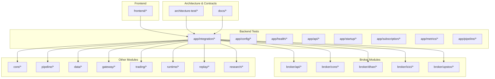

**Diagram sources**
- [app/src/test/java/com/tradej/app/integration/AdminTestBase.java](file://app/src/test/java/com/tradej/app/integration/AdminTestBase.java)
- [architecture-test/src/test/java/com/tradej/architecture/ModuleBoundaryArchitectureTest.java](file://architecture-test/src/test/java/com/tradej/architecture/ModuleBoundaryArchitectureTest.java)
- [frontend/src/components/AdminPanel.test.tsx](file://frontend/src/components/AdminPanel.test.tsx)

**Section sources**
- [TESTING.md](file://TESTING.md)
- [.github/workflows/ci.yml](file://.github/workflows/ci.yml)

## Core Components
- Unit tests: Focused on individual units (classes, methods) with isolated dependencies. Examples include broker core unit tests and frontend component tests.
- Component tests: Validate behavior of cohesive subsystems (e.g., API controllers, startup orchestrators, subscription managers).
- Integration tests: Verify interactions across modules and external systems (brokers, gateways, pipelines).
- End-to-end tests: Validate complete user journeys and system-wide workflows.

Key examples:
- Broker integration tests for Dhan, ICICI, and Upstox covering order lifecycle, market data, portfolio, and token lifecycle.
- Pipeline validation tests for parity and ingress behavior.
- Metrics and soak tests validating throughput and reconciliation.
- Contract tests ensuring API and data contracts remain stable.
- Architecture tests enforcing module boundaries and profile isolation.

**Section sources**
- [app/src/test/java/com/tradej/app/integration/DhanOrderLifecycleIntegrationTest.java](file://app/src/test/java/com/tradej/app/integration/DhanOrderLifecycleIntegrationTest.java)
- [app/src/test/java/com/tradej/app/integration/IciciOrderLifecycleIntegrationTest.java](file://app/src/test/java/com/tradej/app/integration/IciciOrderLifecycleIntegrationTest.java)
- [app/src/test/java/com/tradej/app/integration/UpstoxMarketFeedIntegrationTest.java](file://app/src/test/java/com/tradej/app/integration/UpstoxMarketFeedIntegrationTest.java)
- [app/src/test/java/com/tradej/app/pipeline/DagPipelineIngressTest.java](file://app/src/test/java/com/tradej/app/pipeline/DagPipelineIngressTest.java)
- [app/src/test/java/com/tradej/app/metrics/NseFullSessionSoakTest.java](file://app/src/test/java/com/tradej/app/metrics/NseFullSessionSoakTest.java)
- [app/src/test/java/com/tradej/app/api/OrderControllerComponentTest.java](file://app/src/test/java/com/tradej/app/api/OrderControllerComponentTest.java)
- [app/src/test/java/com/tradej/app/startup/BrokerStartupOrchestratorAnalyticsTest.java](file://app/src/test/java/com/tradej/app/startup/BrokerStartupOrchestratorAnalyticsTest.java)
- [app/src/test/java/com/tradej/app/subscription/SubscriptionCoordinatorTest.java](file://app/src/test/java/com/tradej/app/subscription/SubscriptionCoordinatorTest.java)

## Architecture Overview
The testing architecture aligns with a multi-layered approach:
- Unit layer: Fast, deterministic tests for pure logic and small units.
- Component layer: Behavioral tests for bounded contexts (controllers, services).
- Integration layer: Cross-module and cross-system tests with real or simulated dependencies.
- End-to-end layer: User-centric workflows spanning UI and backend.

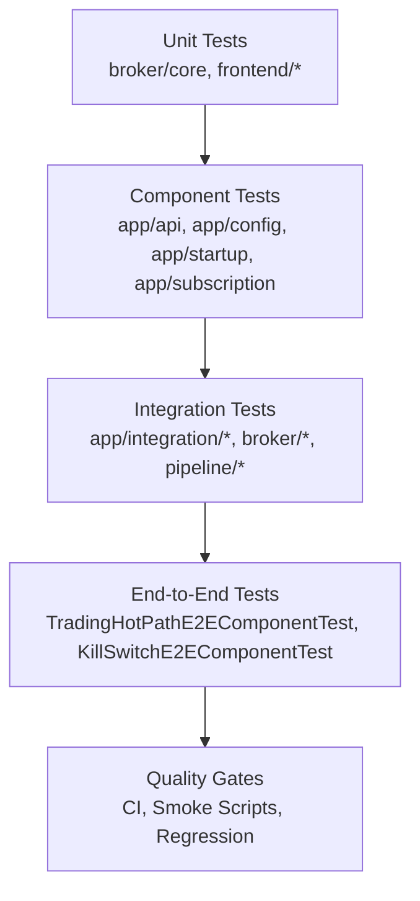

**Diagram sources**
- [app/src/test/java/com/tradej/app/integration/TradingHotPathE2EComponentTest.java](file://app/src/test/java/com/tradej/app/integration/TradingHotPathE2EComponentTest.java)
- [app/src/test/java/com/tradej/app/integration/KillSwitchE2EComponentTest.java](file://app/src/test/java/com/tradej/app/integration/KillSwitchE2EComponentTest.java)
- [.github/workflows/ci.yml](file://.github/workflows/ci.yml)

## Detailed Component Analysis

### Multi-Level Testing Pyramid
- Unit testing:
  - Broker core unit tests (authentication, routing, resilience, rate limiting, historical splitting).
  - Frontend component tests (AdminPanel, CommandPalette, ErrorBoundary, LeftSidebar, PipelinePanel, ScannerPanel, TradingPanel).
  - DTO and store unit tests.
- Component testing:
  - API controller tests (OrderController, StudioController).
  - Startup orchestration and runtime configuration tests.
  - Subscription coordinator and manager tests.
- Integration testing:
  - Broker integration tests for Dhan, ICICI, Upstox (order lifecycle, market data, portfolio, risk, session/token lifecycle).
  - Gateway and pipeline integration tests (parity, replay, reconciliation).
  - Health indicator tests.
- End-to-end testing:
  - Trading hot-path E2E and kill-switch E2E tests.
  - Console FE integration tests.
  - Contract tests for API surfaces.

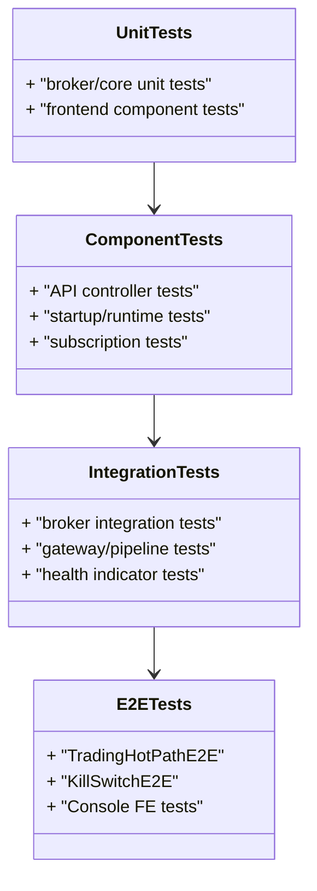

**Diagram sources**
- [broker/core/src/test/java/com/tradej/broker/core/auth/DefaultTokenLifecycleServiceTest.java](file://broker/core/src/test/java/com/tradej/broker/core/auth/DefaultTokenLifecycleServiceTest.java)
- [frontend/src/components/AdminPanel.test.tsx](file://frontend/src/components/AdminPanel.test.tsx)
- [app/src/test/java/com/tradej/app/integration/DhanOrderLifecycleIntegrationTest.java](file://app/src/test/java/com/tradej/app/integration/DhanOrderLifecycleIntegrationTest.java)
- [app/src/test/java/com/tradej/app/integration/TradingHotPathE2EComponentTest.java](file://app/src/test/java/com/tradej/app/integration/TradingHotPathE2EComponentTest.java)

**Section sources**
- [broker/core/src/test/java/com/tradej/broker/core/auth/DefaultTokenLifecycleServiceTest.java](file://broker/core/src/test/java/com/tradej/broker/core/auth/DefaultTokenLifecycleServiceTest.java)
- [frontend/src/components/AdminPanel.test.tsx](file://frontend/src/components/AdminPanel.test.tsx)
- [app/src/test/java/com/tradej/app/integration/DhanOrderLifecycleIntegrationTest.java](file://app/src/test/java/com/tradej/app/integration/DhanOrderLifecycleIntegrationTest.java)
- [app/src/test/java/com/tradej/app/integration/TradingHotPathE2EComponentTest.java](file://app/src/test/java/com/tradej/app/integration/TradingHotPathE2EComponentTest.java)

### Broker Integration Tests
Coverage includes:
- Order lifecycle across Dhan, ICICI, and Upstox.
- Market data ingestion and depth feeds.
- Portfolio and margin handling.
- Session and token lifecycle management.
- Risk controls and enforcement.

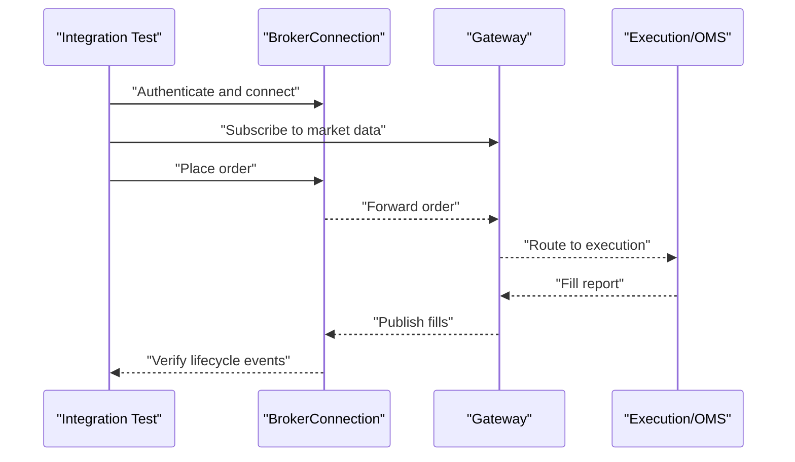

**Diagram sources**
- [app/src/test/java/com/tradej/app/integration/DhanOrderLifecycleIntegrationTest.java](file://app/src/test/java/com/tradej/app/integration/DhanOrderLifecycleIntegrationTest.java)
- [app/src/test/java/com/tradej/app/integration/IciciOrderLifecycleIntegrationTest.java](file://app/src/test/java/com/tradej/app/integration/IciciOrderLifecycleIntegrationTest.java)
- [app/src/test/java/com/tradej/app/integration/UpstoxMarketFeedIntegrationTest.java](file://app/src/test/java/com/tradej/app/integration/UpstoxMarketFeedIntegrationTest.java)

**Section sources**
- [app/src/test/java/com/tradej/app/integration/DhanOrderLifecycleIntegrationTest.java](file://app/src/test/java/com/tradej/app/integration/DhanOrderLifecycleIntegrationTest.java)
- [app/src/test/java/com/tradej/app/integration/IciciOrderLifecycleIntegrationTest.java](file://app/src/test/java/com/tradej/app/integration/IciciOrderLifecycleIntegrationTest.java)
- [app/src/test/java/com/tradej/app/integration/UpstoxMarketFeedIntegrationTest.java](file://app/src/test/java/com/tradej/app/integration/UpstoxMarketFeedIntegrationTest.java)

### Pipeline Validation Tests
Validates correctness and performance of the pipeline runtime:
- DAG ingress behavior.
- Routing and compilation checks.
- Replay parity and tick reconciliation.

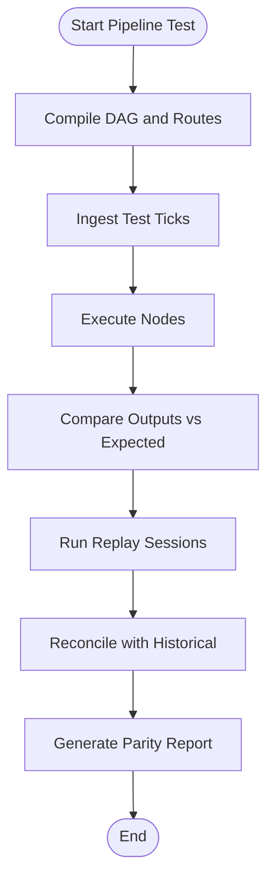

**Diagram sources**
- [app/src/test/java/com/tradej/app/pipeline/DagPipelineIngressTest.java](file://app/src/test/java/com/tradej/app/pipeline/DagPipelineIngressTest.java)
- [app/src/test/java/com/tradej/app/pipeline/PipelineCompileRoutingTest.java](file://app/src/test/java/com/tradej/app/pipeline/PipelineCompileRoutingTest.java)
- [app/src/test/java/com/tradej/app/pipeline/ReplayMarketTickParityTest.java](file://app/src/test/java/com/tradej/app/pipeline/ReplayMarketTickParityTest.java)

**Section sources**
- [app/src/test/java/com/tradej/app/pipeline/DagPipelineIngressTest.java](file://app/src/test/java/com/tradej/app/pipeline/DagPipelineIngressTest.java)
- [app/src/test/java/com/tradej/app/pipeline/PipelineCompileRoutingTest.java](file://app/src/test/java/com/tradej/app/pipeline/PipelineCompileRoutingTest.java)
- [app/src/test/java/com/tradej/app/pipeline/ReplayMarketTickParityTest.java](file://app/src/test/java/com/tradej/app/pipeline/ReplayMarketTickParityTest.java)

### Performance Benchmarking
Includes live benchmarks and smoke tests:
- Gateway live benchmark.
- Gateway replay smoke test.
- Speed checks and throughput validations.

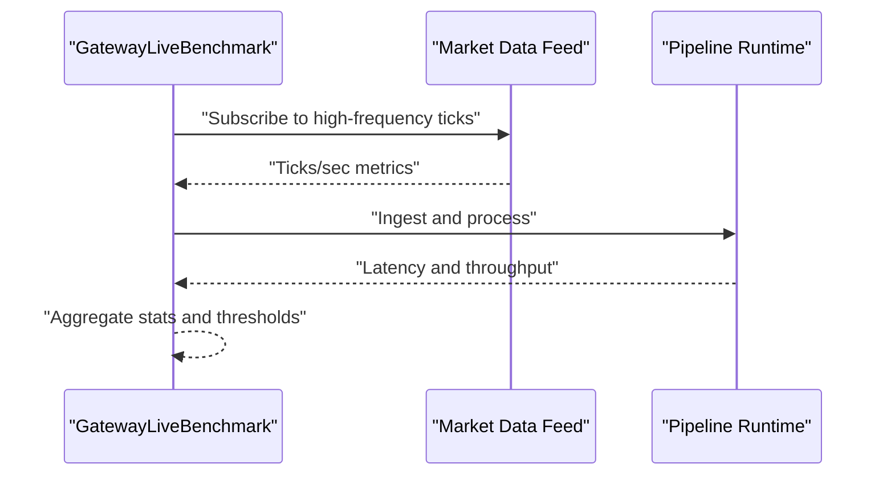

**Diagram sources**
- [app/src/test/java/com/tradej/app/integration/GatewayLiveBenchmark.java](file://app/src/test/java/com/tradej/app/integration/GatewayLiveBenchmark.java)
- [app/src/test/java/com/tradej/app/integration/GatewayReplaySmokeTest.java](file://app/src/test/java/com/tradej/app/integration/GatewayReplaySmokeTest.java)
- [app/src/test/java/com/tradej/app/integration/CheckSpeedLiveTest.java](file://app/src/test/java/com/tradej/app/integration/CheckSpeedLiveTest.java)

**Section sources**
- [app/src/test/java/com/tradej/app/integration/GatewayLiveBenchmark.java](file://app/src/test/java/com/tradej/app/integration/GatewayLiveBenchmark.java)
- [app/src/test/java/com/tradej/app/integration/GatewayReplaySmokeTest.java](file://app/src/test/java/com/tradej/app/integration/GatewayReplaySmokeTest.java)
- [app/src/test/java/com/tradej/app/integration/CheckSpeedLiveTest.java](file://app/src/test/java/com/tradej/app/integration/CheckSpeedLiveTest.java)

### Regression Testing
Pre-flight regression suites and full regression scripts:
- Pre-flight regression for general and Upstox-specific environments.
- Full regression script to run comprehensive suites.

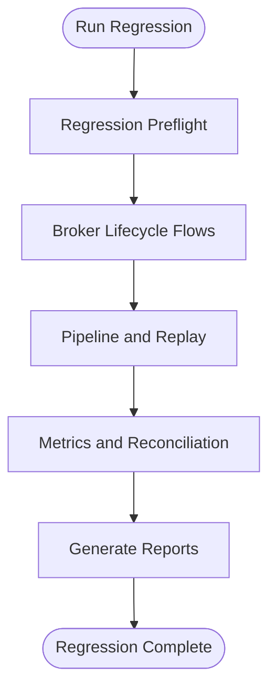

**Diagram sources**
- [app/src/test/java/com/tradej/app/integration/RegressionPreflightIntegrationTest.java](file://app/src/test/java/com/tradej/app/integration/RegressionPreflightIntegrationTest.java)
- [app/src/test/java/com/tradej/app/integration/UpstoxRegressionPreflightIntegrationTest.java](file://app/src/test/java/com/tradej/app/integration/UpstoxRegressionPreflightIntegrationTest.java)
- [scripts/run-full-regression.sh](file://scripts/run-full-regression.sh)

**Section sources**
- [app/src/test/java/com/tradej/app/integration/RegressionPreflightIntegrationTest.java](file://app/src/test/java/com/tradej/app/integration/RegressionPreflightIntegrationTest.java)
- [app/src/test/java/com/tradej/app/integration/UpstoxRegressionPreflightIntegrationTest.java](file://app/src/test/java/com/tradej/app/integration/UpstoxRegressionPreflightIntegrationTest.java)
- [scripts/run-full-regression.sh](file://scripts/run-full-regression.sh)

### Architecture Tests
Enforce structural and behavioral constraints:
- Module boundary tests.
- Profile isolation tests.
- Spring-free architecture tests.

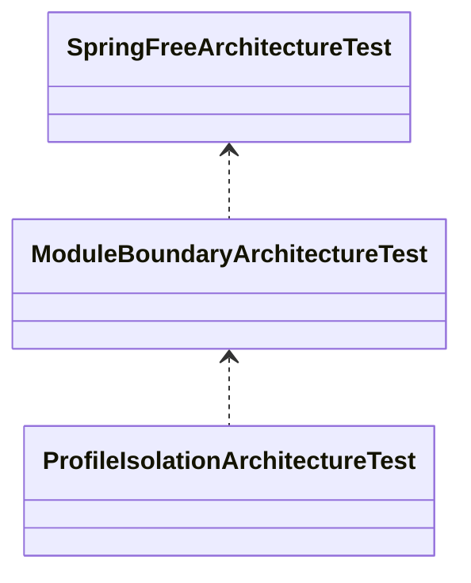

**Diagram sources**
- [architecture-test/src/test/java/com/tradej/architecture/ModuleBoundaryArchitectureTest.java](file://architecture-test/src/test/java/com/tradej/architecture/ModuleBoundaryArchitectureTest.java)
- [architecture-test/src/test/java/com/tradej/architecture/ProfileIsolationArchitectureTest.java](file://architecture-test/src/test/java/com/tradej/architecture/ProfileIsolationArchitectureTest.java)
- [architecture-test/src/test/java/com/tradej/architecture/SpringFreeArchitectureTest.java](file://architecture-test/src/test/java/com/tradej/architecture/SpringFreeArchitectureTest.java)

**Section sources**
- [architecture-test/src/test/java/com/tradej/architecture/ModuleBoundaryArchitectureTest.java](file://architecture-test/src/test/java/com/tradej/architecture/ModuleBoundaryArchitectureTest.java)
- [architecture-test/src/test/java/com/tradej/architecture/ProfileIsolationArchitectureTest.java](file://architecture-test/src/test/java/com/tradej/architecture/ProfileIsolationArchitectureTest.java)
- [architecture-test/src/test/java/com/tradej/architecture/SpringFreeArchitectureTest.java](file://architecture-test/src/test/java/com/tradej/architecture/SpringFreeArchitectureTest.java)

### Contract Testing
Ensures API and data contracts remain stable:
- Console API contract tests.
- Broker connection contract tests.
- Contract documents for instruments, historical bars, and analytics catalog.

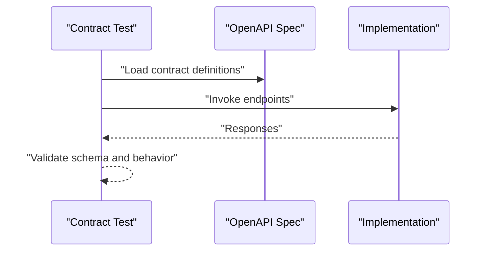

**Diagram sources**
- [app/src/test/java/com/tradej/app/integration/ConsoleApiContractIntegrationTest.java](file://app/src/test/java/com/tradej/app/integration/ConsoleApiContractIntegrationTest.java)
- [app/src/test/java/com/tradej/app/integration/ConsoleApiContractTestConfig.java](file://app/src/test/java/com/tradej/app/integration/ConsoleApiContractTestConfig.java)
- [broker/api/src/test/java/com/tradej/broker/api/IBrokerConnectionContractTest.java](file://broker/api/src/test/java/com/tradej/broker/api/IBrokerConnectionContractTest.java)
- [docs/openapi.yaml](file://docs/openapi.yaml)

**Section sources**
- [app/src/test/java/com/tradej/app/integration/ConsoleApiContractIntegrationTest.java](file://app/src/test/java/com/tradej/app/integration/ConsoleApiContractIntegrationTest.java)
- [app/src/test/java/com/tradej/app/integration/ConsoleApiContractTestConfig.java](file://app/src/test/java/com/tradej/app/integration/ConsoleApiContractTestConfig.java)
- [broker/api/src/test/java/com/tradej/broker/api/IBrokerConnectionContractTest.java](file://broker/api/src/test/java/com/tradej/broker/api/IBrokerConnectionContractTest.java)
- [docs/openapi.yaml](file://docs/openapi.yaml)

### Test Automation Strategies
- Smoke tests for production readiness and console connectivity.
- Broker-specific smoke scripts for Dhan, Upstox, and general console.
- Automated regression runs via shell scripts.

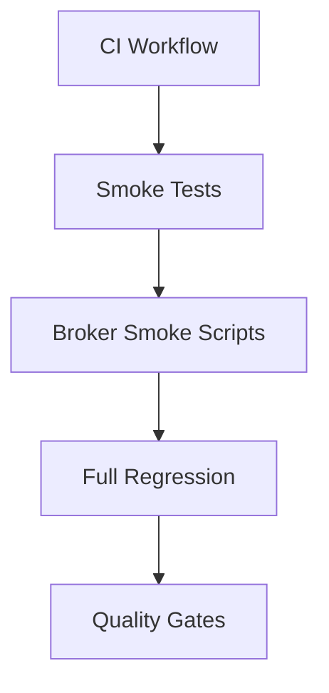

**Diagram sources**
- [.github/workflows/ci.yml](file://.github/workflows/ci.yml)
- [scripts/production-smoke-test.sh](file://scripts/production-smoke-test.sh)
- [scripts/console-smoke.sh](file://scripts/console-smoke.sh)
- [scripts/dhan-smoke.sh](file://scripts/dhan-smoke.sh)
- [scripts/upstox-smoke.sh](file://scripts/upstox-smoke.sh)
- [scripts/run-full-regression.sh](file://scripts/run-full-regression.sh)

**Section sources**
- [.github/workflows/ci.yml](file://.github/workflows/ci.yml)
- [scripts/production-smoke-test.sh](file://scripts/production-smoke-test.sh)
- [scripts/console-smoke.sh](file://scripts/console-smoke.sh)
- [scripts/dhan-smoke.sh](file://scripts/dhan-smoke.sh)
- [scripts/upstox-smoke.sh](file://scripts/upstox-smoke.sh)
- [scripts/run-full-regression.sh](file://scripts/run-full-regression.sh)

## Dependency Analysis
Testing dependencies span across modules and brokers, with clear separation of concerns:
- Integration tests depend on broker implementations and gateway/pipeline runtime.
- Frontend tests depend on UI components and stores.
- Architecture tests enforce module boundaries and prevent circular dependencies.

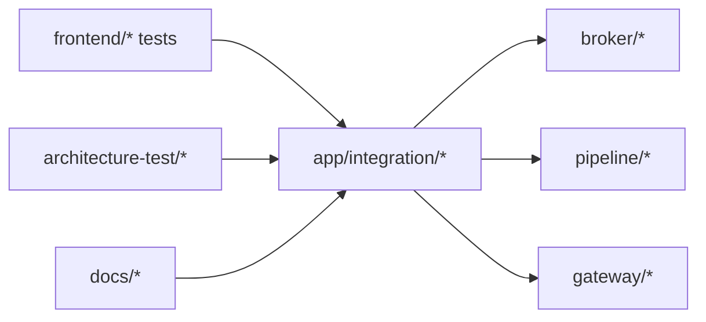

**Diagram sources**
- [frontend/src/components/AdminPanel.test.tsx](file://frontend/src/components/AdminPanel.test.tsx)
- [app/src/test/java/com/tradej/app/integration/AdminTestBase.java](file://app/src/test/java/com/tradej/app/integration/AdminTestBase.java)
- [architecture-test/src/test/java/com/tradej/architecture/ModuleBoundaryArchitectureTest.java](file://architecture-test/src/test/java/com/tradej/architecture/ModuleBoundaryArchitectureTest.java)

**Section sources**
- [frontend/src/components/AdminPanel.test.tsx](file://frontend/src/components/AdminPanel.test.tsx)
- [app/src/test/java/com/tradej/app/integration/AdminTestBase.java](file://app/src/test/java/com/tradej/app/integration/AdminTestBase.java)
- [architecture-test/src/test/java/com/tradej/architecture/ModuleBoundaryArchitectureTest.java](file://architecture-test/src/test/java/com/tradej/architecture/ModuleBoundaryArchitectureTest.java)

## Performance Considerations
- Use benchmark tests to measure latency and throughput under load.
- Employ replay and parity tests to validate correctness and performance consistency.
- Soak tests simulate extended live sessions to uncover stability issues.

[No sources needed since this section provides general guidance]

## Troubleshooting Guide
Common areas to investigate during failures:
- Broker integration tests failing due to authentication or session issues.
- Pipeline parity discrepancies indicating runtime or replay inconsistencies.
- Gateway speed checks failing due to network or feed issues.
- Frontend component tests failing due to UI state or prop mismatches.

Recommended steps:
- Review test logs and assertions in failing tests.
- Validate broker credentials and endpoints.
- Confirm pipeline DAG compilation and node execution.
- Re-run smoke and regression scripts to isolate flakiness.

**Section sources**
- [app/src/test/java/com/tradej/app/integration/GatewayCheckSpeedLiveTest.java](file://app/src/test/java/com/tradej/app/integration/GatewayCheckSpeedLiveTest.java)
- [app/src/test/java/com/tradej/app/integration/ChronicleReplayParityIntegrationTest.java](file://app/src/test/java/com/tradej/app/integration/ChronicleReplayParityIntegrationTest.java)
- [app/src/test/java/com/tradej/app/integration/ReplayParityHashTest.java](file://app/src/test/java/com/tradej/app/integration/ReplayParityHashTest.java)

## Conclusion
The testing strategy employs a robust multi-level approach with strong emphasis on broker integration, pipeline validation, performance benchmarking, and regression testing. Architecture and contract tests ensure structural integrity and API stability. Automation and quality gates integrated with CI workflows provide reliable production deployments.

## Appendices

### Continuous Integration and Quality Gates
- CI workflow triggers builds and tests on pull requests and merges.
- Smoke and regression scripts serve as quality gates for production readiness.

**Section sources**
- [.github/workflows/ci.yml](file://.github/workflows/ci.yml)
- [scripts/production-smoke-test.sh](file://scripts/production-smoke-test.sh)
- [scripts/run-full-regression.sh](file://scripts/run-full-regression.sh)

### Regression Manifest and Verification
- Regression manifest enumerates test suites included in regression runs.
- End-to-end verification outlines acceptance criteria for user workflows.

**Section sources**
- [REGRESSION_MANIFEST.md](file://REGRESSION_MANIFEST.md)
- [docs/E2E_VERIFICATION.md](file://docs/E2E_VERIFICATION.md)

### Additional References
- Pipeline design and runtime documentation.
- Production deployment guidelines.
- Broker integration audit reports and API gap analyses.
- Architecture and contract documents.

**Section sources**
- [docs/PIPELINE_DESIGN.md](file://docs/PIPELINE_DESIGN.md)
- [docs/PRODUCTION_DEPLOYMENT.md](file://docs/PRODUCTION_DEPLOYMENT.md)
- [docs/BROKER_INTEGRATION_AUDIT_REPORT.md](file://docs/BROKER_INTEGRATION_AUDIT_REPORT.md)
- [docs/UPSTOX_API_GAP_ANALYSIS.md](file://docs/UPSTOX_API_GAP_ANALYSIS.md)
- [docs/ARCHITECTURE.md](file://docs/ARCHITECTURE.md)
- [docs/contracts/INSTRUMENT_NAMING_CONTRACT.md](file://docs/contracts/INSTRUMENT_NAMING_CONTRACT.md)
- [docs/contracts/HISTORICAL_BAR_CONTRACT.md](file://docs/contracts/HISTORICAL_BAR_CONTRACT.md)
- [docs/contracts/ANALYTICS_CATALOG.md](file://docs/contracts/ANALYTICS_CATALOG.md)
- [docs/runtime-mode-audit.md](file://docs/runtime-mode-audit.md)
- [docs/API_DOCUMENTATION.md](file://docs/API_DOCUMENTATION.md)