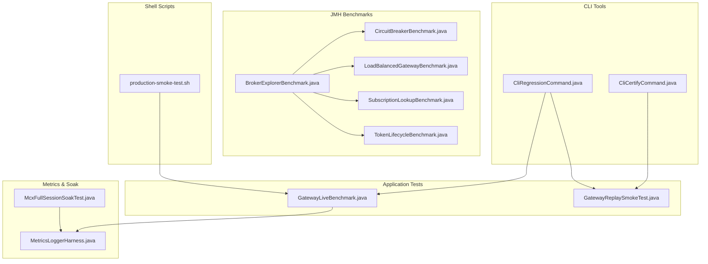
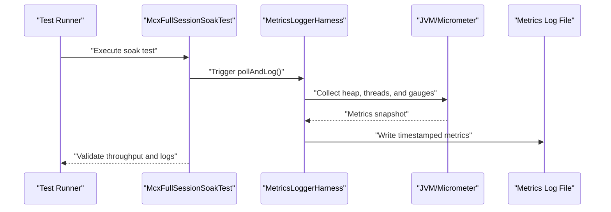
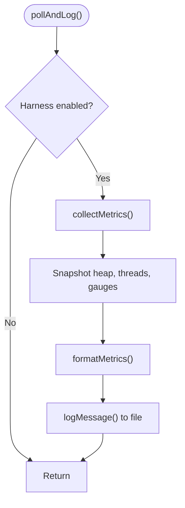
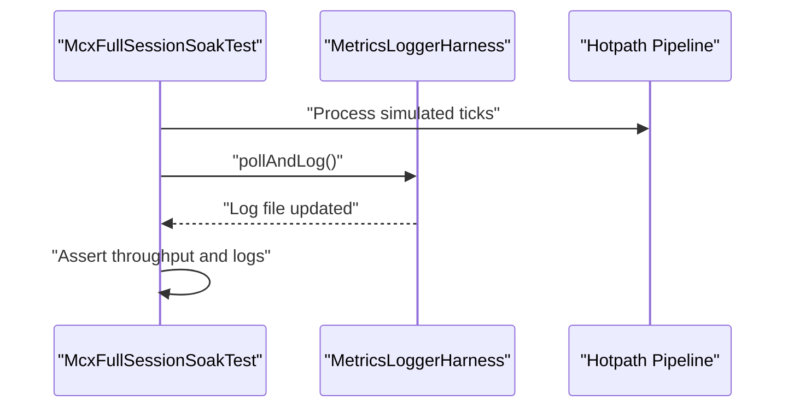
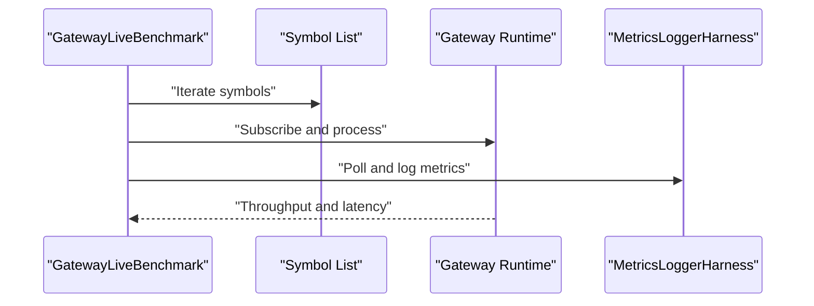
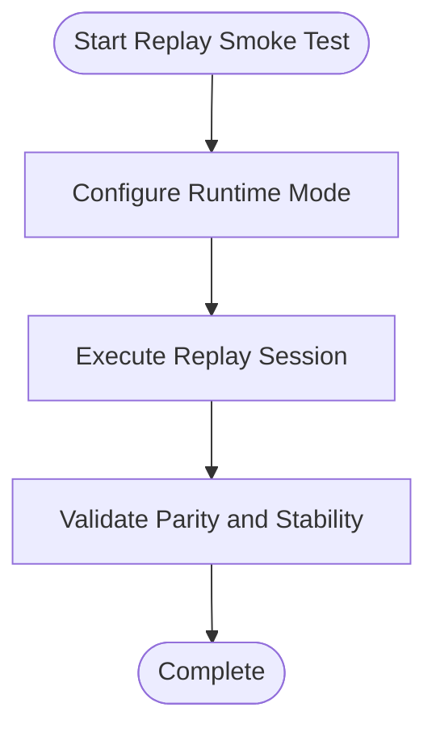
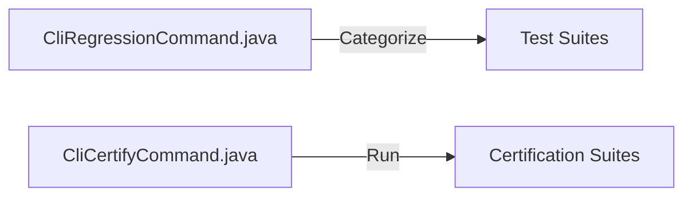
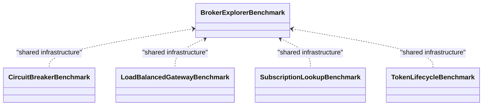
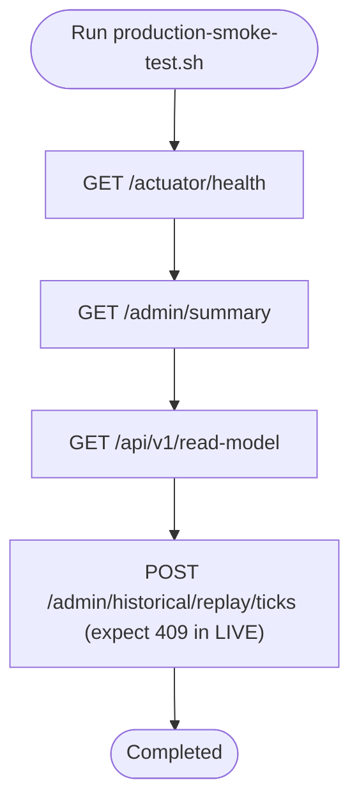
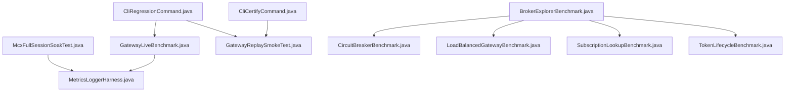

# Performance Testing

<cite>
**Referenced Files in This Document**
- [GatewayLiveBenchmark.java](file://app/src/test/java/com/tradej/app/integration/GatewayLiveBenchmark.java)
- [GatewayReplaySmokeTest.java](file://app/src/test/java/com/tradej/app/integration/GatewayReplaySmokeTest.java)
- [MetricsLoggerHarness.java](file://app/src/main/java/com/tradej/app/metrics/MetricsLoggerHarness.java)
- [McxFullSessionSoakTest.java](file://app/src/test/java/com/tradej/app/metrics/McxFullSessionSoakTest.java)
- [MetricsLoggerHarnessTest.java](file://app/src/test/java/com/tradej/app/metrics/MetricsLoggerHarnessTest.java)
- [BROKER_INTEGRATION_AUDIT_REPORT.md](file://docs/BROKER_INTEGRATION_AUDIT_REPORT.md)
- [production-smoke-test.sh](file://scripts/production-smoke-test.sh)
- [CliRegressionCommand.java](file://cli/src/main/java/com/tradej/cli/command/CliRegressionCommand.java)
- [CliCertifyCommand.java](file://cli/src/main/java/com/tradej/cli/command/CliCertifyCommand.java)
- [BrokerExplorerBenchmark.java](file://broker/core/src/jmh/java/com/tradej/broker/core/benchmark/BrokerExplorerBenchmark.java)
- [CircuitBreakerBenchmark.java](file://broker/core/src/jmh/java/com/tradej/broker/core/benchmark/CircuitBreakerBenchmark.java)
- [LoadBalancedGatewayBenchmark.java](file://broker/core/src/jmh/java/com/tradej/broker/core/benchmark/LoadBalancedGatewayBenchmark.java)
- [SubscriptionLookupBenchmark.java](file://broker/core/src/jmh/java/com/tradej/broker/core/benchmark/SubscriptionLookupBenchmark.java)
- [TokenLifecycleBenchmark.java](file://broker/core/src/jmh/java/com/tradej/broker/core/benchmark/TokenLifecycleBenchmark.java)
</cite>

## Table of Contents
1. [Introduction](#introduction)
2. [Project Structure](#project-structure)
3. [Core Components](#core-components)
4. [Architecture Overview](#architecture-overview)
5. [Detailed Component Analysis](#detailed-component-analysis)
6. [Dependency Analysis](#dependency-analysis)
7. [Performance Considerations](#performance-considerations)
8. [Troubleshooting Guide](#troubleshooting-guide)
9. [Conclusion](#conclusion)
10. [Appendices](#appendices)

## Introduction
This document explains the performance testing and benchmarking systems in the project. It covers:
- Load testing and soak testing frameworks
- Benchmarking tools and strategies
- Metrics collection and reporting
- JMH micro-benchmarks for hot-path components
- Live gateway benchmarking and replay smoke tests
- Methodologies for stress testing, scalability validation, and performance regression detection
- Practical guidance for running tests, interpreting results, and optimizing performance

## Project Structure
Performance testing spans several modules:
- Application integration tests for live benchmarking and replay smoke tests
- Metrics harness for continuous monitoring during soak tests
- CLI tools for regression and certification workflows
- JMH benchmarks for micro-benchmarks in broker core
- Shell scripts for smoke checks against production-like endpoints

**Diagram sources**
- [GatewayLiveBenchmark.java](file://app/src/test/java/com/tradej/app/integration/GatewayLiveBenchmark.java)
- [GatewayReplaySmokeTest.java](file://app/src/test/java/com/tradej/app/integration/GatewayReplaySmokeTest.java)
- [MetricsLoggerHarness.java](file://app/src/main/java/com/tradej/app/metrics/MetricsLoggerHarness.java)
- [McxFullSessionSoakTest.java](file://app/src/test/java/com/tradej/app/metrics/McxFullSessionSoakTest.java)
- [CliRegressionCommand.java](file://cli/src/main/java/com/tradej/cli/command/CliRegressionCommand.java)
- [CliCertifyCommand.java](file://cli/src/main/java/com/tradej/cli/command/CliCertifyCommand.java)
- [BrokerExplorerBenchmark.java](file://broker/core/src/jmh/java/com/tradej/broker/core/benchmark/BrokerExplorerBenchmark.java)
- [CircuitBreakerBenchmark.java](file://broker/core/src/jmh/java/com/tradej/broker/core/benchmark/CircuitBreakerBenchmark.java)
- [LoadBalancedGatewayBenchmark.java](file://broker/core/src/jmh/java/com/tradej/broker/core/benchmark/LoadBalancedGatewayBenchmark.java)
- [SubscriptionLookupBenchmark.java](file://broker/core/src/jmh/java/com/tradej/broker/core/benchmark/SubscriptionLookupBenchmark.java)
- [TokenLifecycleBenchmark.java](file://broker/core/src/jmh/java/com/tradej/broker/core/benchmark/TokenLifecycleBenchmark.java)
- [production-smoke-test.sh](file://scripts/production-smoke-test.sh)

**Section sources**
- [GatewayLiveBenchmark.java](file://app/src/test/java/com/tradej/app/integration/GatewayLiveBenchmark.java)
- [GatewayReplaySmokeTest.java](file://app/src/test/java/com/tradej/app/integration/GatewayReplaySmokeTest.java)
- [MetricsLoggerHarness.java](file://app/src/main/java/com/tradej/app/metrics/MetricsLoggerHarness.java)
- [McxFullSessionSoakTest.java](file://app/src/test/java/com/tradej/app/metrics/McxFullSessionSoakTest.java)
- [CliRegressionCommand.java](file://cli/src/main/java/com/tradej/cli/command/CliRegressionCommand.java)
- [CliCertifyCommand.java](file://cli/src/main/java/com/tradej/cli/command/CliCertifyCommand.java)
- [BrokerExplorerBenchmark.java](file://broker/core/src/jmh/java/com/tradej/broker/core/benchmark/BrokerExplorerBenchmark.java)
- [CircuitBreakerBenchmark.java](file://broker/core/src/jmh/java/com/tradej/broker/core/benchmark/CircuitBreakerBenchmark.java)
- [LoadBalancedGatewayBenchmark.java](file://broker/core/src/jmh/java/com/tradej/broker/core/benchmark/LoadBalancedGatewayBenchmark.java)
- [SubscriptionLookupBenchmark.java](file://broker/core/src/jmh/java/com/tradej/broker/core/benchmark/SubscriptionLookupBenchmark.java)
- [TokenLifecycleBenchmark.java](file://broker/core/src/jmh/java/com/tradej/broker/core/benchmark/TokenLifecycleBenchmark.java)
- [production-smoke-test.sh](file://scripts/production-smoke-test.sh)

## Core Components
- MetricsLoggerHarness: Periodically collects JVM and Micrometer metrics and logs them to a file for soak testing.
- McxFullSessionSoakTest: Exercises high-throughput processing and validates metrics logging and throughput targets.
- GatewayLiveBenchmark: Live gateway benchmarking against a curated symbol set to measure end-to-end performance.
- GatewayReplaySmokeTest: Validates replay behavior and runtime modes under controlled conditions.
- CLI regression and certification commands: Categorize and run targeted suites for performance and parity validation.
- JMH benchmarks: Micro-benchmarks for hot-path components such as broker exploration, circuit breakers, gateway load balancing, subscription lookup, and token lifecycle.

**Section sources**
- [MetricsLoggerHarness.java](file://app/src/main/java/com/tradej/app/metrics/MetricsLoggerHarness.java)
- [McxFullSessionSoakTest.java](file://app/src/test/java/com/tradej/app/metrics/McxFullSessionSoakTest.java)
- [GatewayLiveBenchmark.java](file://app/src/test/java/com/tradej/app/integration/GatewayLiveBenchmark.java)
- [GatewayReplaySmokeTest.java](file://app/src/test/java/com/tradej/app/integration/GatewayReplaySmokeTest.java)
- [CliRegressionCommand.java](file://cli/src/main/java/com/tradej/cli/command/CliRegressionCommand.java)
- [CliCertifyCommand.java](file://cli/src/main/java/com/tradej/cli/command/CliCertifyCommand.java)
- [BrokerExplorerBenchmark.java](file://broker/core/src/jmh/java/com/tradej/broker/core/benchmark/BrokerExplorerBenchmark.java)
- [CircuitBreakerBenchmark.java](file://broker/core/src/jmh/java/com/tradej/broker/core/benchmark/CircuitBreakerBenchmark.java)
- [LoadBalancedGatewayBenchmark.java](file://broker/core/src/jmh/java/com/tradej/broker/core/benchmark/LoadBalancedGatewayBenchmark.java)
- [SubscriptionLookupBenchmark.java](file://broker/core/src/jmh/java/com/tradej/broker/core/benchmark/SubscriptionLookupBenchmark.java)
- [TokenLifecycleBenchmark.java](file://broker/core/src/jmh/java/com/tradej/broker/core/benchmark/TokenLifecycleBenchmark.java)

## Architecture Overview
The performance testing architecture integrates:
- Continuous metrics logging during soak sessions
- Live gateway benchmarking against real-time feeds
- Replay smoke tests for deterministic validation
- CLI-driven regression and certification workflows
- JMH micro-benchmarks for low-level hot-path evaluation

**Diagram sources**
- [McxFullSessionSoakTest.java](file://app/src/test/java/com/tradej/app/metrics/McxFullSessionSoakTest.java)
- [MetricsLoggerHarness.java](file://app/src/main/java/com/tradej/app/metrics/MetricsLoggerHarness.java)

## Detailed Component Analysis

### MetricsLoggerHarness
- Purpose: Periodically poll and log JVM and Micrometer metrics to a file for soak testing.
- Scheduling: Runs on a fixed interval configured via a property.
- Metrics collected: Heap usage, thread counts, and registered gauges (e.g., hotpath tick counters).
- Behavior: Creates log directory if missing; errors are logged but do not fail the process.

**Diagram sources**
- [MetricsLoggerHarness.java](file://app/src/main/java/com/tradej/app/metrics/MetricsLoggerHarness.java)

**Section sources**
- [MetricsLoggerHarness.java](file://app/src/main/java/com/tradej/app/metrics/MetricsLoggerHarness.java)
- [MetricsLoggerHarnessTest.java](file://app/src/test/java/com/tradej/app/metrics/MetricsLoggerHarnessTest.java)

### McxFullSessionSoakTest
- Purpose: Simulate a high-throughput session and validate metrics logging and processing rates.
- Validation: Ensures zero tick loss, sub-second processing duration, and presence of expected log fields.
- Integration: Uses MetricsLoggerHarness to emit periodic metrics snapshots.

**Diagram sources**
- [McxFullSessionSoakTest.java](file://app/src/test/java/com/tradej/app/metrics/McxFullSessionSoakTest.java)
- [MetricsLoggerHarness.java](file://app/src/main/java/com/tradej/app/metrics/MetricsLoggerHarness.java)

**Section sources**
- [McxFullSessionSoakTest.java](file://app/src/test/java/com/tradej/app/metrics/McxFullSessionSoakTest.java)

### GatewayLiveBenchmark
- Purpose: Measure gateway performance under realistic symbol sets and live-like conditions.
- Scope: Iterates over a predefined list of symbols to simulate market data ingestion and processing.
- Output: Provides timing and throughput insights suitable for capacity planning and regression detection.

**Diagram sources**
- [GatewayLiveBenchmark.java](file://app/src/test/java/com/tradej/app/integration/GatewayLiveBenchmark.java)
- [MetricsLoggerHarness.java](file://app/src/main/java/com/tradej/app/metrics/MetricsLoggerHarness.java)

**Section sources**
- [GatewayLiveBenchmark.java](file://app/src/test/java/com/tradej/app/integration/GatewayLiveBenchmark.java)

### GatewayReplaySmokeTest
- Purpose: Validate replay behavior and runtime mode transitions under controlled scenarios.
- Outcome: Ensures deterministic parity and stability across replay sessions.

**Diagram sources**
- [GatewayReplaySmokeTest.java](file://app/src/test/java/com/tradej/app/integration/GatewayReplaySmokeTest.java)

**Section sources**
- [GatewayReplaySmokeTest.java](file://app/src/test/java/com/tradej/app/integration/GatewayReplaySmokeTest.java)

### CLI Regression and Certification Commands
- CliRegressionCommand: Categorizes tests by type (architecture, integration, concurrency, replay, etc.) and prints a regression catalog for targeted runs.
- CliCertifyCommand: Orchestrates certification suites including replay and simulation validations.

**Diagram sources**
- [CliRegressionCommand.java](file://cli/src/main/java/com/tradej/cli/command/CliRegressionCommand.java)
- [CliCertifyCommand.java](file://cli/src/main/java/com/tradej/cli/command/CliCertifyCommand.java)

**Section sources**
- [CliRegressionCommand.java](file://cli/src/main/java/com/tradej/cli/command/CliRegressionCommand.java)
- [CliCertifyCommand.java](file://cli/src/main/java/com/tradej/cli/command/CliCertifyCommand.java)

### JMH Micro-Benchmarks
- BrokerExplorerBenchmark: Evaluates broker exploration operations.
- CircuitBreakerBenchmark: Measures circuit breaker behavior and thresholds.
- LoadBalancedGatewayBenchmark: Assesses gateway load-balancing performance.
- SubscriptionLookupBenchmark: Benchmarks subscription lookup operations.
- TokenLifecycleBenchmark: Profiles token acquisition and lifecycle operations.

**Diagram sources**
- [BrokerExplorerBenchmark.java](file://broker/core/src/jmh/java/com/tradej/broker/core/benchmark/BrokerExplorerBenchmark.java)
- [CircuitBreakerBenchmark.java](file://broker/core/src/jmh/java/com/tradej/broker/core/benchmark/CircuitBreakerBenchmark.java)
- [LoadBalancedGatewayBenchmark.java](file://broker/core/src/jmh/java/com/tradej/broker/core/benchmark/LoadBalancedGatewayBenchmark.java)
- [SubscriptionLookupBenchmark.java](file://broker/core/src/jmh/java/com/tradej/broker/core/benchmark/SubscriptionLookupBenchmark.java)
- [TokenLifecycleBenchmark.java](file://broker/core/src/jmh/java/com/tradej/broker/core/benchmark/TokenLifecycleBenchmark.java)

**Section sources**
- [BrokerExplorerBenchmark.java](file://broker/core/src/jmh/java/com/tradej/broker/core/benchmark/BrokerExplorerBenchmark.java)
- [CircuitBreakerBenchmark.java](file://broker/core/src/jmh/java/com/tradej/broker/core/benchmark/CircuitBreakerBenchmark.java)
- [LoadBalancedGatewayBenchmark.java](file://broker/core/src/jmh/java/com/tradej/broker/core/benchmark/LoadBalancedGatewayBenchmark.java)
- [SubscriptionLookupBenchmark.java](file://broker/core/src/jmh/java/com/tradej/broker/core/benchmark/SubscriptionLookupBenchmark.java)
- [TokenLifecycleBenchmark.java](file://broker/core/src/jmh/java/com/tradej/broker/core/benchmark/TokenLifecycleBenchmark.java)

### Production Smoke Test Script
- Validates health endpoints, admin summaries, and read-model endpoints.
- Confirms replay guard behavior in live mode.

**Diagram sources**
- [production-smoke-test.sh](file://scripts/production-smoke-test.sh)

**Section sources**
- [production-smoke-test.sh](file://scripts/production-smoke-test.sh)

## Dependency Analysis
- Soak tests depend on MetricsLoggerHarness for continuous metrics emission.
- GatewayLiveBenchmark coordinates with MetricsLoggerHarness for live performance logging.
- CLI tools orchestrate test categories and certification suites.
- JMH benchmarks are independent and focus on micro-level hot-path operations.

**Diagram sources**
- [McxFullSessionSoakTest.java](file://app/src/test/java/com/tradej/app/metrics/McxFullSessionSoakTest.java)
- [MetricsLoggerHarness.java](file://app/src/main/java/com/tradej/app/metrics/MetricsLoggerHarness.java)
- [GatewayLiveBenchmark.java](file://app/src/test/java/com/tradej/app/integration/GatewayLiveBenchmark.java)
- [GatewayReplaySmokeTest.java](file://app/src/test/java/com/tradej/app/integration/GatewayReplaySmokeTest.java)
- [CliRegressionCommand.java](file://cli/src/main/java/com/tradej/cli/command/CliRegressionCommand.java)
- [CliCertifyCommand.java](file://cli/src/main/java/com/tradej/cli/command/CliCertifyCommand.java)
- [BrokerExplorerBenchmark.java](file://broker/core/src/jmh/java/com/tradej/broker/core/benchmark/BrokerExplorerBenchmark.java)
- [CircuitBreakerBenchmark.java](file://broker/core/src/jmh/java/com/tradej/broker/core/benchmark/CircuitBreakerBenchmark.java)
- [LoadBalancedGatewayBenchmark.java](file://broker/core/src/jmh/java/com/tradej/broker/core/benchmark/LoadBalancedGatewayBenchmark.java)
- [SubscriptionLookupBenchmark.java](file://broker/core/src/jmh/java/com/tradej/broker/core/benchmark/SubscriptionLookupBenchmark.java)
- [TokenLifecycleBenchmark.java](file://broker/core/src/jmh/java/com/tradej/broker/core/benchmark/TokenLifecycleBenchmark.java)

**Section sources**
- [McxFullSessionSoakTest.java](file://app/src/test/java/com/tradej/app/metrics/McxFullSessionSoakTest.java)
- [MetricsLoggerHarness.java](file://app/src/main/java/com/tradej/app/metrics/MetricsLoggerHarness.java)
- [GatewayLiveBenchmark.java](file://app/src/test/java/com/tradej/app/integration/GatewayLiveBenchmark.java)
- [GatewayReplaySmokeTest.java](file://app/src/test/java/com/tradej/app/integration/GatewayReplaySmokeTest.java)
- [CliRegressionCommand.java](file://cli/src/main/java/com/tradej/cli/command/CliRegressionCommand.java)
- [CliCertifyCommand.java](file://cli/src/main/java/com/tradej/cli/command/CliCertifyCommand.java)
- [BrokerExplorerBenchmark.java](file://broker/core/src/jmh/java/com/tradej/broker/core/benchmark/BrokerExplorerBenchmark.java)
- [CircuitBreakerBenchmark.java](file://broker/core/src/jmh/java/com/tradej/broker/core/benchmark/CircuitBreakerBenchmark.java)
- [LoadBalancedGatewayBenchmark.java](file://broker/core/src/jmh/java/com/tradej/broker/core/benchmark/LoadBalancedGatewayBenchmark.java)
- [SubscriptionLookupBenchmark.java](file://broker/core/src/jmh/java/com/tradej/broker/core/benchmark/SubscriptionLookupBenchmark.java)
- [TokenLifecycleBenchmark.java](file://broker/core/src/jmh/java/com/tradej/broker/core/benchmark/TokenLifecycleBenchmark.java)

## Performance Considerations
- Soak testing: Use MetricsLoggerHarness to continuously monitor heap, threads, and hotpath metrics; validate throughput targets and absence of tick loss.
- Live benchmarking: Execute GatewayLiveBenchmark to estimate end-to-end latency and throughput under realistic symbol sets.
- Replay validation: Run GatewayReplaySmokeTest to confirm deterministic parity and runtime stability.
- Micro-benchmarks: Use JMH suites to isolate and optimize hot-path operations (exploration, circuit breakers, load balancing, subscription lookup, token lifecycle).
- Regression detection: Leverage CLI regression and certification commands to categorize and rerun targeted suites after changes.

[No sources needed since this section provides general guidance]

## Troubleshooting Guide
- Metrics log file not created: Verify harness enabled flag and log file path; ensure parent directories are writable.
- Soak test failures: Confirm tick processing completeness and that throughput thresholds are met; inspect metrics log for anomalies.
- Live benchmark stalls: Review gateway subscriptions and symbol list; ensure network connectivity and broker credentials.
- Replay smoke test mismatches: Validate runtime mode configuration and event parity; re-run with deterministic seeds.
- CLI suite execution: Use regression command to filter suites by category; use certification command to run replay and simulation suites.

**Section sources**
- [MetricsLoggerHarness.java](file://app/src/main/java/com/tradej/app/metrics/MetricsLoggerHarness.java)
- [McxFullSessionSoakTest.java](file://app/src/test/java/com/tradej/app/metrics/McxFullSessionSoakTest.java)
- [GatewayLiveBenchmark.java](file://app/src/test/java/com/tradej/app/integration/GatewayLiveBenchmark.java)
- [GatewayReplaySmokeTest.java](file://app/src/test/java/com/tradej/app/integration/GatewayReplaySmokeTest.java)
- [CliRegressionCommand.java](file://cli/src/main/java/com/tradej/cli/command/CliRegressionCommand.java)
- [CliCertifyCommand.java](file://cli/src/main/java/com/tradej/cli/command/CliCertifyCommand.java)

## Conclusion
The project provides a robust performance testing stack combining continuous metrics logging, live gateway benchmarking, replay smoke tests, and JMH micro-benchmarks. By leveraging CLI tools for regression and certification, teams can validate scalability, detect regressions, and optimize hot-path components effectively.

[No sources needed since this section summarizes without analyzing specific files]

## Appendices

### Practical Examples
- Running soak tests: Execute McxFullSessionSoakTest and inspect MetricsLoggerHarness output for throughput and resource utilization.
- Running live gateway benchmark: Execute GatewayLiveBenchmark to measure end-to-end performance across the symbol list.
- Running replay smoke test: Execute GatewayReplaySmokeTest to validate deterministic parity and runtime stability.
- Running JMH benchmarks: Execute individual JMH benchmark classes to profile hot-path operations.
- Regression and certification: Use CLI regression and certification commands to categorize and run targeted suites.

**Section sources**
- [McxFullSessionSoakTest.java](file://app/src/test/java/com/tradej/app/metrics/McxFullSessionSoakTest.java)
- [GatewayLiveBenchmark.java](file://app/src/test/java/com/tradej/app/integration/GatewayLiveBenchmark.java)
- [GatewayReplaySmokeTest.java](file://app/src/test/java/com/tradej/app/integration/GatewayReplaySmokeTest.java)
- [BrokerExplorerBenchmark.java](file://broker/core/src/jmh/java/com/tradej/broker/core/benchmark/BrokerExplorerBenchmark.java)
- [CircuitBreakerBenchmark.java](file://broker/core/src/jmh/java/com/tradej/broker/core/benchmark/CircuitBreakerBenchmark.java)
- [LoadBalancedGatewayBenchmark.java](file://broker/core/src/jmh/java/com/tradej/broker/core/benchmark/LoadBalancedGatewayBenchmark.java)
- [SubscriptionLookupBenchmark.java](file://broker/core/src/jmh/java/com/tradej/broker/core/benchmark/SubscriptionLookupBenchmark.java)
- [TokenLifecycleBenchmark.java](file://broker/core/src/jmh/java/com/tradej/broker/core/benchmark/TokenLifecycleBenchmark.java)
- [CliRegressionCommand.java](file://cli/src/main/java/com/tradej/cli/command/CliRegressionCommand.java)
- [CliCertifyCommand.java](file://cli/src/main/java/com/tradej/cli/command/CliCertifyCommand.java)

### Interpreting Results and Identifying Bottlenecks
- Throughput and latency: Compare measured throughput against targets; investigate latency spikes in metrics logs.
- Resource utilization: Monitor heap and thread metrics; address contention or memory pressure.
- Parity validation: Ensure replay smoke tests produce identical outcomes across runs.
- Hot-path profiling: Use JMH results to identify slow operations and optimize accordingly.

**Section sources**
- [MetricsLoggerHarness.java](file://app/src/main/java/com/tradej/app/metrics/MetricsLoggerHarness.java)
- [McxFullSessionSoakTest.java](file://app/src/test/java/com/tradej/app/metrics/McxFullSessionSoakTest.java)
- [GatewayLiveBenchmark.java](file://app/src/test/java/com/tradej/app/integration/GatewayLiveBenchmark.java)
- [GatewayReplaySmokeTest.java](file://app/src/test/java/com/tradej/app/integration/GatewayReplaySmokeTest.java)
- [BrokerExplorerBenchmark.java](file://broker/core/src/jmh/java/com/tradej/broker/core/benchmark/BrokerExplorerBenchmark.java)
- [CircuitBreakerBenchmark.java](file://broker/core/src/jmh/java/com/tradej/broker/core/benchmark/CircuitBreakerBenchmark.java)
- [LoadBalancedGatewayBenchmark.java](file://broker/core/src/jmh/java/com/tradej/broker/core/benchmark/LoadBalancedGatewayBenchmark.java)
- [SubscriptionLookupBenchmark.java](file://broker/core/src/jmh/java/com/tradej/broker/core/benchmark/SubscriptionLookupBenchmark.java)
- [TokenLifecycleBenchmark.java](file://broker/core/src/jmh/java/com/tradej/broker/core/benchmark/TokenLifecycleBenchmark.java)

### Guidelines for Optimization, Capacity Planning, and Regression Detection
- Optimize hot-path components using JMH feedback.
- Plan capacity based on live benchmark results and soak test throughput ceilings.
- Detect regressions by running regression suites and comparing metrics and timings.
- Validate production readiness with smoke test script and certification suites.

**Section sources**
- [CliRegressionCommand.java](file://cli/src/main/java/com/tradej/cli/command/CliRegressionCommand.java)
- [CliCertifyCommand.java](file://cli/src/main/java/com/tradej/cli/command/CliCertifyCommand.java)
- [production-smoke-test.sh](file://scripts/production-smoke-test.sh)
- [BROKER_INTEGRATION_AUDIT_REPORT.md](file://docs/BROKER_INTEGRATION_AUDIT_REPORT.md)