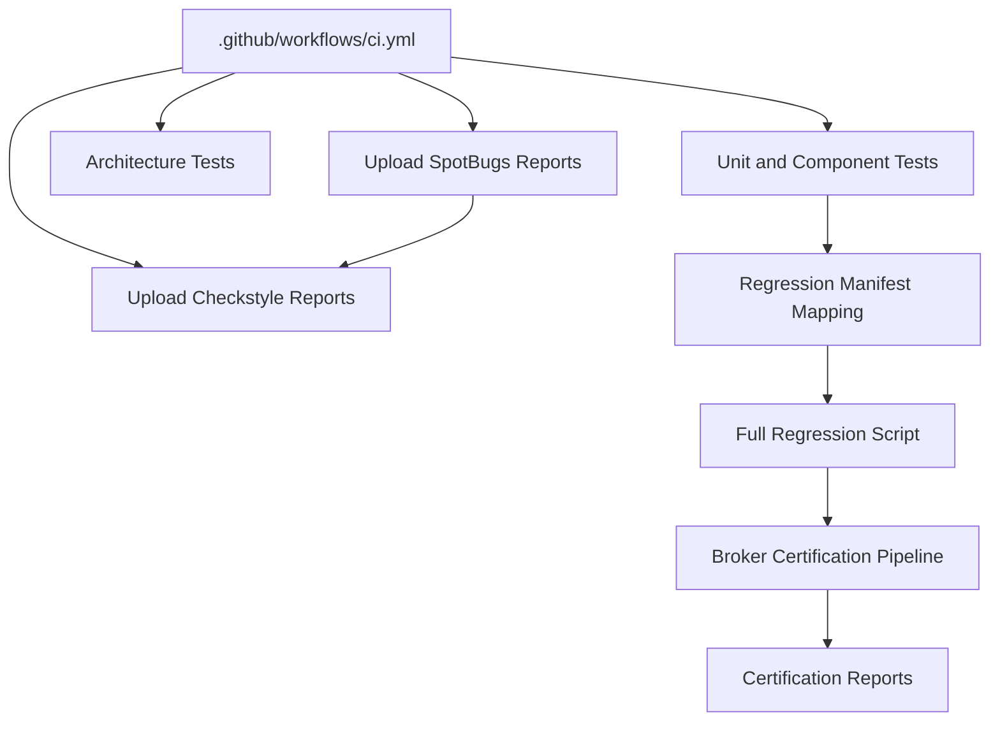
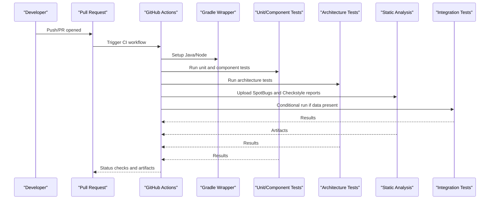
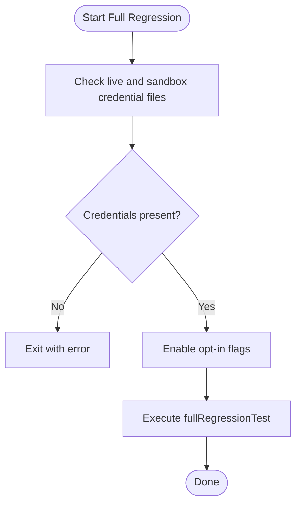
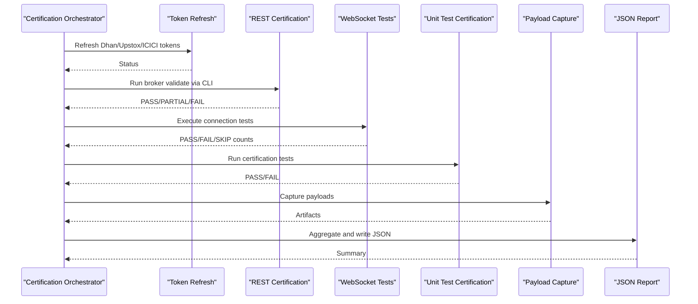
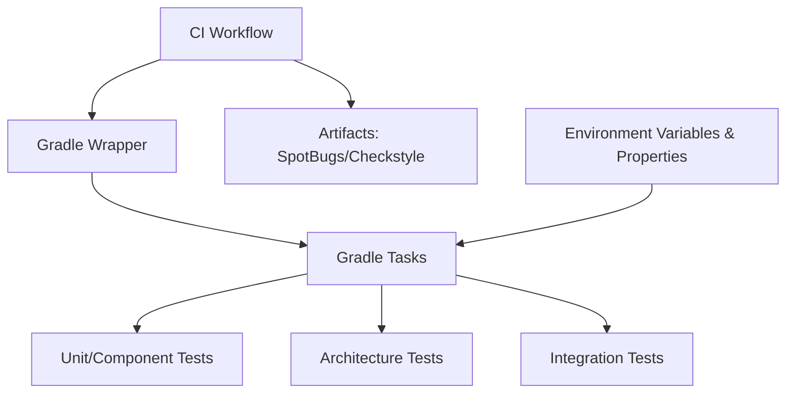

# Quality Gates and CI/CD

<cite>
**Referenced Files in This Document**
- [.github/workflows/ci.yml](file://.github/workflows/ci.yml)
- [REGRESSION_MANIFEST.md](file://REGRESSION_MANIFEST.md)
- [TESTING.md](file://TESTING.md)
- [scripts/run-full-regression.sh](file://scripts/run-full-regression.sh)
- [scripts/broker-certify-all.sh](file://scripts/broker-certify-all.sh)
- [config/checkstyle/checkstyle.xml](file://config/checkstyle/checkstyle.xml)
- [docs/reports/TEST_COVERAGE_CHAOS_REVIEW_2026-06-06.md](file://docs/reports/TEST_COVERAGE_CHAOS_REVIEW_2026-06-06.md)
</cite>

## Table of Contents
1. [Introduction](#introduction)
2. [Project Structure](#project-structure)
3. [Core Components](#core-components)
4. [Architecture Overview](#architecture-overview)
5. [Detailed Component Analysis](#detailed-component-analysis)
6. [Dependency Analysis](#dependency-analysis)
7. [Performance Considerations](#performance-considerations)
8. [Troubleshooting Guide](#troubleshooting-guide)
9. [Conclusion](#conclusion)
10. [Appendices](#appendices)

## Introduction
This document explains the quality gates and continuous integration/deployment processes for the project. It covers the GitHub Actions workflow configuration, automated testing pipeline, and quality gate enforcement. It documents the regression testing framework, full regression execution, and automated certification processes. It also details quality metrics collection, test coverage analysis, and chaos testing integration. Practical examples illustrate CI/CD pipeline configuration, quality gate triggers, and failure handling procedures. Finally, it provides guidelines for maintaining quality standards, handling test flakiness, and optimizing CI/CD performance, including integration with external systems, notifications, and deployment validation.

## Project Structure
The CI/CD and quality system is composed of:
- GitHub Actions workflow orchestrating unit, component, architecture, and selected integration tests.
- Regression manifest mapping tests to tasks, environments, and architecture invariants.
- Scripts for full regression runs and broker certification pipelines.
- Static analysis configurations for checkstyle and spotbugs artifacts.
- Reports and reviews that define quality metrics and chaos testing expectations.

**Diagram sources**
- [.github/workflows/ci.yml:1-52](file://.github/workflows/ci.yml#L1-L52)
- [REGRESSION_MANIFEST.md:1-107](file://REGRESSION_MANIFEST.md#L1-L107)
- [scripts/run-full-regression.sh:1-39](file://scripts/run-full-regression.sh#L1-L39)
- [scripts/broker-certify-all.sh:1-225](file://scripts/broker-certify-all.sh#L1-L225)

**Section sources**
- [.github/workflows/ci.yml:1-52](file://.github/workflows/ci.yml#L1-L52)
- [REGRESSION_MANIFEST.md:1-107](file://REGRESSION_MANIFEST.md#L1-L107)
- [TESTING.md:1-273](file://TESTING.md#L1-L273)
- [scripts/run-full-regression.sh:1-39](file://scripts/run-full-regression.sh#L1-L39)
- [scripts/broker-certify-all.sh:1-225](file://scripts/broker-certify-all.sh#L1-L225)
- [config/checkstyle/checkstyle.xml:1-151](file://config/checkstyle/checkstyle.xml#L1-L151)

## Core Components
- GitHub Actions CI workflow:
  - Triggers on pushes to main/master and pull requests.
  - Runs unit and component tests, architecture tests, and uploads static analysis reports.
  - Conditionally runs integration tests when a specific data artifact is present.
- Regression framework:
  - Defines tasks for unit, component, preflight, broker REST/WebSocket/order, runtime E2E, cross-layer, and full regression.
  - Provides environment and opt-in flags for live and sandbox credentials.
- Full regression script:
  - Validates presence of live and sandbox credential files.
  - Enables a set of opt-in flags and executes the full regression task.
- Broker certification pipeline:
  - Orchestrates token refresh, REST certification, WebSocket certification, unit test certification, payload capture, and generates a JSON summary report.
- Static analysis:
  - Checkstyle configuration defines style rules and severity.
  - SpotBugs and Checkstyle reports are uploaded as workflow artifacts.

**Section sources**
- [.github/workflows/ci.yml:1-52](file://.github/workflows/ci.yml#L1-L52)
- [REGRESSION_MANIFEST.md:1-107](file://REGRESSION_MANIFEST.md#L1-L107)
- [TESTING.md:1-273](file://TESTING.md#L1-L273)
- [scripts/run-full-regression.sh:1-39](file://scripts/run-full-regression.sh#L1-L39)
- [scripts/broker-certify-all.sh:1-225](file://scripts/broker-certify-all.sh#L1-L225)
- [config/checkstyle/checkstyle.xml:1-151](file://config/checkstyle/checkstyle.xml#L1-L151)

## Architecture Overview
The CI/CD and quality architecture integrates GitHub Actions with Gradle tasks, environment variables, and certification scripts. Quality gates are enforced by mandatory unit/component/architecture tests and optional integration tests gated by data availability. Regression and certification scripts enforce environment prerequisites and produce structured reports.

**Diagram sources**
- [.github/workflows/ci.yml:1-52](file://.github/workflows/ci.yml#L1-L52)

## Detailed Component Analysis

### GitHub Actions Workflow Configuration
- Triggers:
  - On push to main/master and pull_request events.
- Jobs:
  - unit-and-component:
    - Checks out code, sets up Java 21 and Node 20.
    - Executes unit, component, and frontend tests.
    - Executes architecture tests.
    - Uploads SpotBugs and Checkstyle HTML reports as artifacts regardless of test outcome.
  - integration:
    - Checks out code, sets up Java 21.
    - Conditionally runs integration tests only if a specific parquet file exists in the data warehouse.

Quality gate enforcement:
- Unit, component, and architecture tests must pass to satisfy basic quality gates.
- Integration tests are gated by data availability and thus optional for PRs without the data artifact.

**Section sources**
- [.github/workflows/ci.yml:1-52](file://.github/workflows/ci.yml#L1-L52)

### Automated Testing Pipeline and Orchestration
- Task-driven orchestration:
  - Unit tests: fast, deterministic logic.
  - Component tests: in-process multi-module wiring without mocks.
  - Integration tests: live broker connectivity and order lifecycle tests gated by credentials.
- Frontend testing:
  - Node setup and frontend test execution are included in the unit-and-component job.
- Static analysis:
  - SpotBugs and Checkstyle reports are produced and uploaded as artifacts.

Parallel execution:
- The workflow runs jobs in parallel across separate matrices implicitly defined by the runner environment.
- Within a single job, Gradle tasks are executed sequentially; parallelism is achieved across jobs.

Result aggregation:
- Test results and static analysis artifacts are uploaded as artifacts for inspection.

**Section sources**
- [.github/workflows/ci.yml:1-52](file://.github/workflows/ci.yml#L1-L52)
- [TESTING.md:1-273](file://TESTING.md#L1-L273)

### Regression Testing Framework
- Task mapping:
  - unitTest, componentTest, regressionPreflightTest, brokerRestTest, brokerWsTest, brokerOrderTest, runtimeE2eTest, crossLayerRegressionTest, fullRegressionTest.
- Required vs optional:
  - Required: unitTest/componentTest plus regression preflight and live/sandbox tests as applicable.
  - Optional: certain broker tests gated by environment variables and feature flags.
- Test inventory:
  - Each test class is mapped to a task, environment, opt-in flags, and architecture invariants.
- Full regression execution:
  - The full regression script validates credential files and enables multiple opt-in flags before invoking the full regression task.

**Diagram sources**
- [scripts/run-full-regression.sh:1-39](file://scripts/run-full-regression.sh#L1-L39)
- [REGRESSION_MANIFEST.md:1-107](file://REGRESSION_MANIFEST.md#L1-L107)

**Section sources**
- [REGRESSION_MANIFEST.md:1-107](file://REGRESSION_MANIFEST.md#L1-L107)
- [TESTING.md:64-81](file://TESTING.md#L64-L81)
- [scripts/run-full-regression.sh:1-39](file://scripts/run-full-regression.sh#L1-L39)

### Automated Certification Processes
- Token refresh:
  - Dhan TOTP auto-refresh and Upstox token validity checks; ICICI session validation.
- REST certification:
  - CLI-based broker validation producing PASS/PARTIAL/FAIL outcomes per broker.
- WebSocket certification:
  - Connection tests with PASS/FAIL/SKIP counts.
- Unit test certification:
  - Specific certification tests for subscription and reconnect behavior, plus URL encoding tests.
- Payload capture:
  - Captures broker payloads for artifact retention.
- Report generation:
  - JSON report with timestamps, per-broker statuses, WebSocket results, and unit test certifications.

**Diagram sources**
- [scripts/broker-certify-all.sh:1-225](file://scripts/broker-certify-all.sh#L1-L225)

**Section sources**
- [scripts/broker-certify-all.sh:1-225](file://scripts/broker-certify-all.sh#L1-L225)

### Quality Metrics Collection and Test Coverage Analysis
- Static analysis:
  - SpotBugs and Checkstyle reports are uploaded as artifacts for review.
- Test coverage and chaos:
  - A dedicated report highlights the importance of coverage and identifies gaps, especially in newer components.
  - Chaos testing is recognized as a critical area needing reinforcement.

**Section sources**
- [.github/workflows/ci.yml:24-35](file://.github/workflows/ci.yml#L24-L35)
- [docs/reports/TEST_COVERAGE_CHAOS_REVIEW_2026-06-06.md:296-304](file://docs/reports/TEST_COVERAGE_CHAOS_REVIEW_2026-06-06.md#L296-L304)

### Chaos Testing Integration
- Chaos testing is acknowledged as a gap in recent architectural changes.
- Recommendations emphasize reinforcing chaos targets, particularly in newly introduced components, to ensure tests fail fast during incidents.

**Section sources**
- [docs/reports/TEST_COVERAGE_CHAOS_REVIEW_2026-06-06.md:296-304](file://docs/reports/TEST_COVERAGE_CHAOS_REVIEW_2026-06-06.md#L296-L304)

### Practical Examples
- CI/CD pipeline configuration:
  - Use the provided workflow to trigger unit, component, architecture tests, and upload static analysis reports.
  - Gate integration tests behind the presence of a data artifact.
- Quality gate triggers:
  - Basic quality gates: unit, component, and architecture tests.
  - Optional integration gate: presence of the data artifact.
- Failure handling:
  - Integration tests are skipped when the data artifact is absent; ensure the artifact is staged for full runs.
  - Certification failures are surfaced in the JSON report; address token/session issues and re-run targeted certification steps.

**Section sources**
- [.github/workflows/ci.yml:1-52](file://.github/workflows/ci.yml#L1-L52)
- [scripts/broker-certify-all.sh:1-225](file://scripts/broker-certify-all.sh#L1-L225)

## Dependency Analysis
The CI/CD and quality system depends on:
- GitHub Actions runners for job execution.
- Gradle wrapper for task orchestration and test execution.
- Environment variables and property files for broker credentials and configuration.
- Static analysis tools producing HTML reports for SpotBugs and Checkstyle.

**Diagram sources**
- [.github/workflows/ci.yml:1-52](file://.github/workflows/ci.yml#L1-L52)

**Section sources**
- [.github/workflows/ci.yml:1-52](file://.github/workflows/ci.yml#L1-L52)
- [TESTING.md:87-162](file://TESTING.md#L87-L162)

## Performance Considerations
- Keep integration tests optional by default to reduce CI runtime when the data artifact is not present.
- Use environment variable gating for live and sandbox tests to avoid unnecessary network calls in PRs.
- Parallelize jobs across separate matrices where appropriate and rely on Gradle’s internal task parallelism for multi-module builds.
- Cache dependencies and build artifacts to minimize cold-start overhead in CI.

## Troubleshooting Guide
Common issues and resolutions:
- Missing credentials:
  - Ensure live and sandbox credential files exist before running full regression or certification.
- Token/session expiration:
  - Refresh Dhan TOTP tokens and Upstox tokens; verify ICICI session state.
- Data artifact missing:
  - Integration tests are skipped when the parquet warehouse file is absent; stage the artifact for full runs.
- Static analysis failures:
  - Review SpotBugs and Checkstyle HTML reports uploaded as artifacts.

**Section sources**
- [scripts/run-full-regression.sh:16-23](file://scripts/run-full-regression.sh#L16-L23)
- [scripts/broker-certify-all.sh:60-92](file://scripts/broker-certify-all.sh#L60-L92)
- [.github/workflows/ci.yml:45-51](file://.github/workflows/ci.yml#L45-L51)
- [.github/workflows/ci.yml:24-35](file://.github/workflows/ci.yml#L24-L35)

## Conclusion
The CI/CD and quality system enforces quality gates through unit, component, and architecture tests, with optional integration tests gated by data availability. The regression framework and certification pipeline provide comprehensive coverage for brokers, runtime, and connectivity. Static analysis reports and structured certification summaries support continuous improvement. By adhering to environment gating, enabling chaos testing, and optimizing CI performance, teams can maintain high-quality standards while accelerating delivery.

## Appendices

### Appendix A: CI/CD Pipeline Configuration Example
- Workflow triggers on push to main/master and pull requests.
- Jobs:
  - unit-and-component: runs unit, component, and frontend tests; runs architecture tests; uploads SpotBugs and Checkstyle reports.
  - integration: conditionally runs integration tests if the data artifact is present.

**Section sources**
- [.github/workflows/ci.yml:1-52](file://.github/workflows/ci.yml#L1-L52)

### Appendix B: Quality Gate Triggers and Failure Handling
- Quality gates:
  - Unit, component, and architecture tests are mandatory.
  - Integration tests are optional and gated by data availability.
- Failure handling:
  - Integration tests are skipped when the data artifact is missing.
  - Certification failures are captured in the JSON report; address token/session issues and rerun targeted steps.

**Section sources**
- [.github/workflows/ci.yml:45-51](file://.github/workflows/ci.yml#L45-L51)
- [scripts/broker-certify-all.sh:177-225](file://scripts/broker-certify-all.sh#L177-L225)

### Appendix C: Regression Execution and Environment Prerequisites
- Full regression:
  - Validates credential files and enables opt-in flags before running the full regression task.
- Environment prerequisites:
  - Live and sandbox credential files must be present.
  - Optional flags enable specific broker tests.

**Section sources**
- [scripts/run-full-regression.sh:13-39](file://scripts/run-full-regression.sh#L13-L39)
- [REGRESSION_MANIFEST.md:19-30](file://REGRESSION_MANIFEST.md#L19-L30)

### Appendix D: Static Analysis Configuration
- Checkstyle configuration defines style rules and severity tailored for the trading platform.
- SpotBugs and Checkstyle reports are uploaded as artifacts for inspection.

**Section sources**
- [config/checkstyle/checkstyle.xml:1-151](file://config/checkstyle/checkstyle.xml#L1-L151)
- [.github/workflows/ci.yml:24-35](file://.github/workflows/ci.yml#L24-L35)