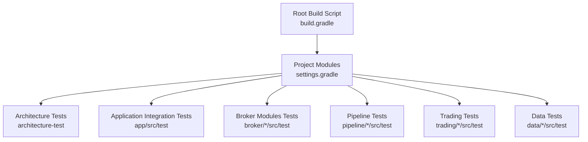
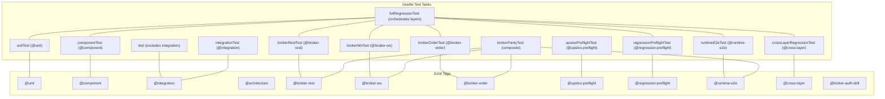
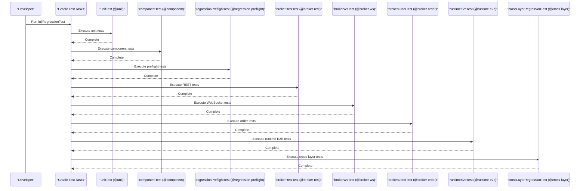
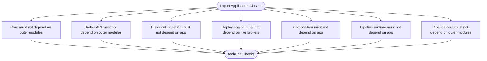
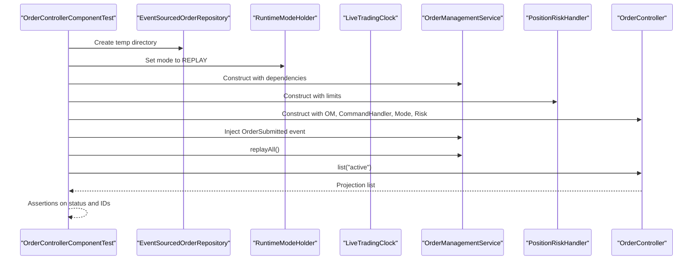
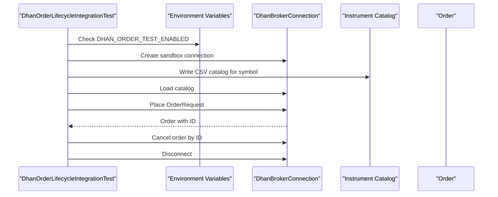
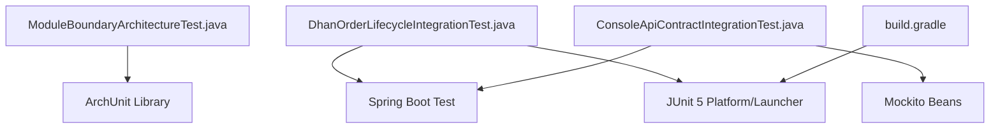

# Testing Architecture

<cite>
**Referenced Files in This Document**
- [TESTING.md](file://TESTING.md)
- [build.gradle](file://build.gradle)
- [settings.gradle](file://settings.gradle)
- [gradle.properties](file://gradle.properties)
- [ModuleBoundaryArchitectureTest.java](file://architecture-test/src/test/java/com/tradej/architecture/ModuleBoundaryArchitectureTest.java)
- [OrderControllerComponentTest.java](file://app/src/test/java/com/tradej/app/api/OrderControllerComponentTest.java)
- [DhanOrderLifecycleIntegrationTest.java](file://app/src/test/java/com/tradej/app/integration/DhanOrderLifecycleIntegrationTest.java)
- [ConsoleApiContractIntegrationTest.java](file://app/src/test/java/com/tradej/app/integration/ConsoleApiContractIntegrationTest.java)
</cite>

## Table of Contents
1. [Introduction](#introduction)
2. [Project Structure](#project-structure)
3. [Core Components](#core-components)
4. [Architecture Overview](#architecture-overview)
5. [Detailed Component Analysis](#detailed-component-analysis)
6. [Dependency Analysis](#dependency-analysis)
7. [Performance Considerations](#performance-considerations)
8. [Troubleshooting Guide](#troubleshooting-guide)
9. [Conclusion](#conclusion)
10. [Appendices](#appendices)

## Introduction
This document explains the testing architecture and framework used across the multi-module Trade-J project. It covers the multi-layer testing strategy (unit, component, integration, and architecture tests), the JUnit 5 tag-based classification system, Gradle test task configuration and execution order, practical examples of test tagging and execution commands, CI/CD integration guidance, and architectural validation tests. It also provides guidelines for writing effective tests, maintaining test isolation, and ensuring reliability across the modular codebase.

## Project Structure
The repository is a multi-module Gradle project organized by functional domains (core, broker, trading, data, pipeline, runtime, etc.). Testing is distributed across modules, with dedicated architecture tests in a dedicated module and extensive integration tests in the application module. The Gradle build defines reusable test tasks and tags to classify and execute tests efficiently.

**Diagram sources**
- [build.gradle:1-301](file://build.gradle#L1-L301)
- [settings.gradle:1-95](file://settings.gradle#L1-L95)

**Section sources**
- [settings.gradle:1-95](file://settings.gradle#L1-L95)
- [build.gradle:1-301](file://build.gradle#L1-L301)

## Core Components
- Multi-layer testing strategy:
  - Unit tests: fast, deterministic checks for pure logic.
  - Component tests: in-process composition across modules without mocks or fake broker adapters.
  - Integration tests: live broker connectivity and order lifecycle tests gated by credentials.
  - Architecture tests: static validation of module boundaries, Spring-free constraints, design patterns, and code quality.
- JUnit 5 tag-based classification:
  - @unit, @component, @integration, @architecture, plus broker-specific tags like @broker-rest, @broker-ws, @broker-order, @upstox-preflight, @regression-preflight, @runtime-e2e, @cross-layer, and @broker-auth-drill.
- Gradle test tasks:
  - Centralized task registration with include/exclude tag filters and execution ordering guarantees.
  - A full regression task orchestrating unit, component, preflight, broker, runtime, and cross-layer suites.

**Section sources**
- [TESTING.md:1-273](file://TESTING.md#L1-L273)
- [build.gradle:130-301](file://build.gradle#L130-L301)

## Architecture Overview
The testing architecture leverages Gradle’s Test task customization and JUnit 5 tags to enforce a layered approach. The root build script configures shared test infrastructure, registers specialized tasks per layer, and enforces execution order. Architecture tests use ArchUnit to validate module boundaries and design constraints.

**Diagram sources**
- [build.gradle:140-301](file://build.gradle#L140-L301)

**Section sources**
- [build.gradle:140-301](file://build.gradle#L140-L301)

## Detailed Component Analysis

### JUnit 5 Tag-Based Classification System
- Purpose: Enforce test categorization and enable targeted execution.
- Categories:
  - Layer tags: @unit, @component, @integration, @architecture.
  - Broker tags: @broker-rest, @broker-ws, @broker-order, @upstox-preflight, @regression-preflight, @runtime-e2e, @cross-layer.
  - Special: @broker-auth-drill for manual, destructive token drills.
- Examples in code:
  - Architecture tests use @Tag("architecture").
  - Component tests use @Tag("component").
  - Integration tests use @Tag("integration") and optionally @Tag("broker-order"), @Tag("api"), @Tag("console").

**Section sources**
- [ModuleBoundaryArchitectureTest.java:12-13](file://architecture-test/src/test/java/com/tradej/architecture/ModuleBoundaryArchitectureTest.java#L12-L13)
- [OrderControllerComponentTest.java:25-26](file://app/src/test/java/com/tradej/app/api/OrderControllerComponentTest.java#L25-L26)
- [DhanOrderLifecycleIntegrationTest.java:23-25](file://app/src/test/java/com/tradej/app/integration/DhanOrderLifecycleIntegrationTest.java#L23-L25)
- [ConsoleApiContractIntegrationTest.java:30-33](file://app/src/test/java/com/tradej/app/integration/ConsoleApiContractIntegrationTest.java#L30-L33)

### Gradle Test Task Configuration and Execution Order
- Default test task excludes @integration by default to keep regular builds fast.
- Dedicated tasks register include/exclude filters and ordering:
  - unitTest → componentTest → regressionPreflightTest → brokerRestTest → brokerWsTest → brokerOrderTest → runtimeE2eTest → crossLayerRegressionTest.
- Composite tasks:
  - brokerParityTest depends on brokerRestTest, brokerWsTest, brokerOrderTest, and runtimeE2eTest.
  - fullRegressionTest orchestrates the entire stack across subprojects.

**Diagram sources**
- [build.gradle:288-301](file://build.gradle#L288-L301)
- [build.gradle:146-279](file://build.gradle#L146-L279)

**Section sources**
- [build.gradle:140-301](file://build.gradle#L140-L301)

### Practical Examples of Test Tagging and Execution
- Tagging examples:
  - Architecture tests: @Tag("architecture").
  - Component tests: @Tag("component").
  - Integration tests: @Tag("integration"); broker order: @Tag("integration") and @Tag("broker-order"); API/console: @Tag("api") and @Tag("console").
- Execution commands:
  - Run all tests excluding integration: ./gradlew test
  - Run unit tests only: ./gradlew unitTest
  - Run component tests only: ./gradlew componentTest
  - Run integration tests only: ./gradlew integrationTest
  - Run broker REST tests: ./gradlew :app:brokerRestTest
  - Run broker WebSocket tests: ./gradlew :app:brokerWsTest
  - Run broker order tests: ./gradlew :app:brokerOrderTest
  - Run runtime E2E tests: ./gradlew :app:runtimeE2eTest
  - Run regression preflight: ./gradlew :app:regressionPreflightTest
  - Run Upstox preflight: ./gradlew :app:upstoxPreflightTest
  - Run cross-layer regression: ./gradlew :app:crossLayerRegressionTest
  - Run parity suite: ./gradlew :app:brokerParityTest
  - Run full regression: ./gradlew fullRegressionTest

**Section sources**
- [TESTING.md:14-273](file://TESTING.md#L14-L273)
- [build.gradle:146-279](file://build.gradle#L146-L279)

### CI/CD Integration Guidance
- Recommended CI stages:
  - Unit tests: fast feedback on PRs.
  - Component tests: validate in-process composition after unit tests.
  - Regression preflight: verify credentials and environment readiness.
  - Broker REST/WebSocket/order tests: gated by credentials; run in protected CI jobs.
  - Runtime E2E and cross-layer tests: run with sufficient heap and credentials.
  - Full regression: nightly or scheduled long-running job.
- Credential management:
  - Store secrets in CI secure variables and pass via environment or Gradle properties.
  - Prefer --no-daemon for live runs to ensure workers see current environment.
- Parallelization:
  - Gradle parallelism is enabled; ensure test isolation to avoid flakiness.

**Section sources**
- [TESTING.md:64-194](file://TESTING.md#L64-L194)
- [gradle.properties:1-7](file://gradle.properties#L1-L7)

### Architectural Validation Tests
- Module boundary validation:
  - Core modules must not depend on outer modules (broker, execution, strategy, etc.).
  - Historical ingestion must not depend on the app module.
  - Replay engine must not depend on live brokers.
  - Composition and pipeline runtime must not depend on the app module.
  - Pipeline core must not depend on outer modules.
- Spring-free architecture:
  - Architecture tests enforce Spring-free constraints to maintain testability and decoupling.
- Design patterns and code quality:
  - Additional architecture tests validate design patterns and enforce code quality constraints.

**Diagram sources**
- [ModuleBoundaryArchitectureTest.java:26-134](file://architecture-test/src/test/java/com/tradej/architecture/ModuleBoundaryArchitectureTest.java#L26-L134)

**Section sources**
- [ModuleBoundaryArchitectureTest.java:1-136](file://architecture-test/src/test/java/com/tradej/architecture/ModuleBoundaryArchitectureTest.java#L1-L136)

### Example: Component Test (OrderControllerComponentTest)
- Purpose: Validates controller behavior in a component context without external broker adapters.
- Approach: Uses in-memory repositories and runtime mode holders to simulate order lifecycles.
- Tagging: @Tag("component").

**Diagram sources**
- [OrderControllerComponentTest.java:31-77](file://app/src/test/java/com/tradej/app/api/OrderControllerComponentTest.java#L31-L77)

**Section sources**
- [OrderControllerComponentTest.java:1-78](file://app/src/test/java/com/tradej/app/api/OrderControllerComponentTest.java#L1-L78)

### Example: Integration Test (DhanOrderLifecycleIntegrationTest)
- Purpose: Live sandbox order placement and cancellation via Dhan broker.
- Approach: Conditional execution based on environment variables; creates a temporary instrument catalog; cleans up tracked orders.
- Tagging: @Tag("integration"), @Tag("broker-order").

**Diagram sources**
- [DhanOrderLifecycleIntegrationTest.java:36-94](file://app/src/test/java/com/tradej/app/integration/DhanOrderLifecycleIntegrationTest.java#L36-L94)

**Section sources**
- [DhanOrderLifecycleIntegrationTest.java:1-95](file://app/src/test/java/com/tradej/app/integration/DhanOrderLifecycleIntegrationTest.java#L1-L95)

### Example: Integration Test (Console API Contract)
- Purpose: Verify REST shapes used by the React console against real controllers (mocked services).
- Approach: Spring Boot test with randomized server port and ActiveProfiles.
- Tagging: @Tag("integration"), @Tag("api"), @Tag("console").

**Section sources**
- [ConsoleApiContractIntegrationTest.java:1-140](file://app/src/test/java/com/tradej/app/integration/ConsoleApiContractIntegrationTest.java#L1-L140)

## Dependency Analysis
- Internal dependencies:
  - Architecture tests depend on ArchUnit and import application packages without tests or JARs.
  - Application integration tests depend on Spring Boot test and mock services for contract validation.
- External dependencies:
  - JUnit 5 BOM and platform launcher are managed centrally.
  - SpotBugs and Checkstyle are integrated into the check lifecycle.
- Coupling and cohesion:
  - Test tasks are cohesive per layer and minimize cross-task coupling via tag-based filtering.
  - Architecture tests isolate validation from runtime concerns.

**Diagram sources**
- [ModuleBoundaryArchitectureTest.java:3-12](file://architecture-test/src/test/java/com/tradej/architecture/ModuleBoundaryArchitectureTest.java#L3-L12)
- [DhanOrderLifecycleIntegrationTest.java:12-16](file://app/src/test/java/com/tradej/app/integration/DhanOrderLifecycleIntegrationTest.java#L12-L16)
- [ConsoleApiContractIntegrationTest.java:12-15](file://app/src/test/java/com/tradej/app/integration/ConsoleApiContractIntegrationTest.java#L12-L15)
- [build.gradle:281-285](file://build.gradle#L281-L285)

**Section sources**
- [build.gradle:70-135](file://build.gradle#L70-L135)
- [ModuleBoundaryArchitectureTest.java:3-12](file://architecture-test/src/test/java/com/tradej/architecture/ModuleBoundaryArchitectureTest.java#L3-L12)
- [DhanOrderLifecycleIntegrationTest.java:12-16](file://app/src/test/java/com/tradej/app/integration/DhanOrderLifecycleIntegrationTest.java#L12-L16)
- [ConsoleApiContractIntegrationTest.java:12-15](file://app/src/test/java/com/tradej/app/integration/ConsoleApiContractIntegrationTest.java#L12-L15)

## Performance Considerations
- Keep default test task fast by excluding integration tests.
- Use dedicated tasks for heavy suites (REST, WS, order, runtime E2E, cross-layer) with appropriate heap sizing.
- Leverage Gradle parallelism and avoid shared mutable state between tests.
- Cache and reuse tokens where possible to reduce repeated auth overhead in live tests.

[No sources needed since this section provides general guidance]

## Troubleshooting Guide
- Credential failures:
  - Ensure environment variables for live and sandbox tests are set; use --no-daemon for live runs.
  - Refresh production tokens before full regression runs.
- Flaky live tests:
  - Add jitter and retries judiciously; avoid shared state between tests.
  - Use cleanup helpers to cancel tracked sandbox orders.
- Tag mismatches:
  - Confirm test classes use the correct tags; verify task include/exclude filters.
- Heap exhaustion:
  - Increase max heap for heavy broker and runtime E2E tasks as configured in tasks.

**Section sources**
- [TESTING.md:171-194](file://TESTING.md#L171-L194)
- [DhanOrderLifecycleIntegrationTest.java:28-34](file://app/src/test/java/com/tradej/app/integration/DhanOrderLifecycleIntegrationTest.java#L28-L34)
- [build.gradle:179-236](file://build.gradle#L179-L236)

## Conclusion
The Trade-J testing architecture combines a multi-layer strategy with JUnit 5 tags and Gradle tasks to deliver fast unit tests, robust component validations, live integration tests, and strong architectural constraints. The configuration ensures predictable execution order, clear separation of concerns, and scalable CI/CD integration while maintaining reliability across the multi-module structure.

[No sources needed since this section summarizes without analyzing specific files]

## Appendices

### Appendix A: Test Execution Commands Reference
- Run default tests (excludes integration): ./gradlew test
- Run unit tests: ./gradlew unitTest
- Run component tests: ./gradlew componentTest
- Run integration tests: ./gradlew integrationTest
- Run broker REST tests: ./gradlew :app:brokerRestTest
- Run broker WebSocket tests: ./gradlew :app:brokerWsTest
- Run broker order tests: ./gradlew :app:brokerOrderTest
- Run runtime E2E tests: ./gradlew :app:runtimeE2eTest
- Run regression preflight: ./gradlew :app:regressionPreflightTest
- Run Upstox preflight: ./gradlew :app:upstoxPreflightTest
- Run cross-layer regression: ./gradlew :app:crossLayerRegressionTest
- Run parity suite: ./gradlew :app:brokerParityTest
- Run full regression: ./gradlew fullRegressionTest

**Section sources**
- [TESTING.md:14-273](file://TESTING.md#L14-L273)
- [build.gradle:146-279](file://build.gradle#L146-L279)