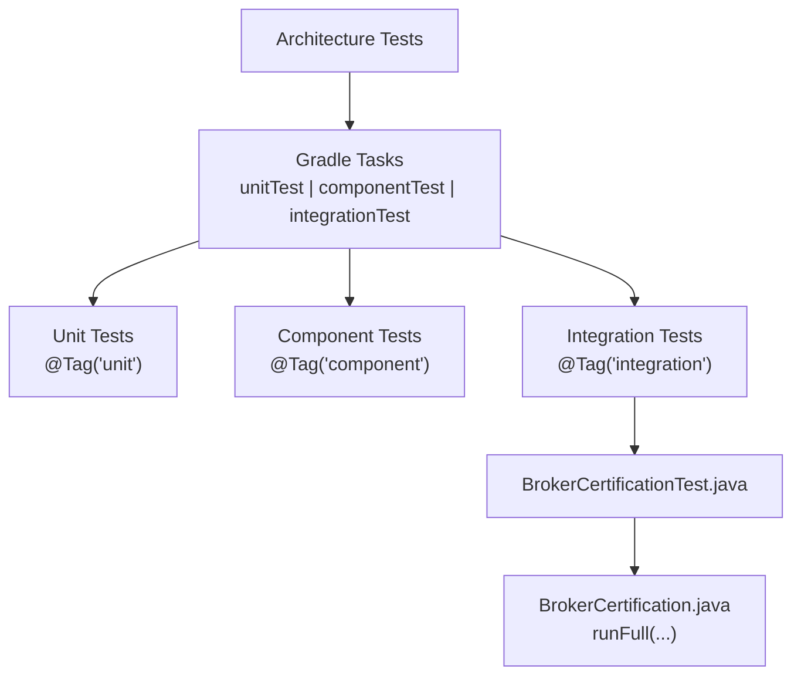
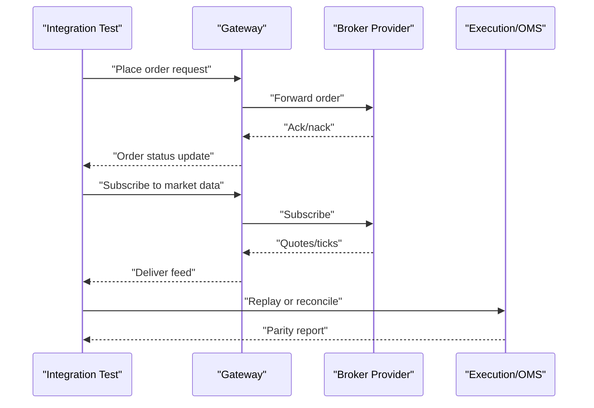
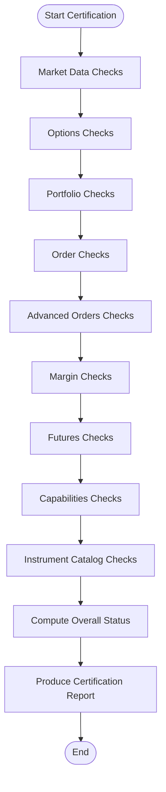
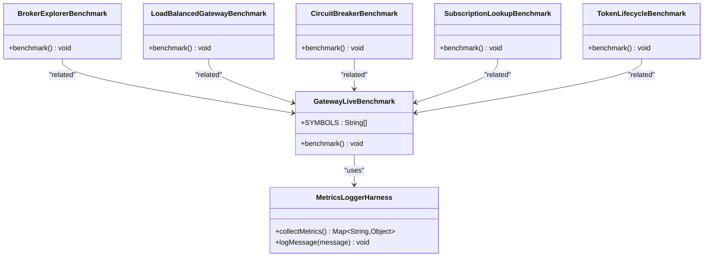
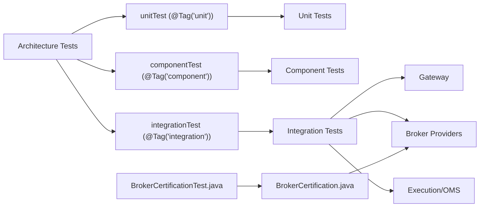

# Testing and Quality Assurance

<cite>
**Referenced Files in This Document**
- [build.gradle](file://build.gradle)
- [TESTING.md](file://TESTING.md)
- [BrokerCertification.java](file://broker-gateway/src/main/java/com/tradej/brokergateway/certification/BrokerCertification.java)
- [BrokerCertificationTest.java](file://broker-gateway/src/test/java/com/tradej/brokergateway/BrokerCertificationTest.java)
- [DhanOrderLifecycleIntegrationTest.java](file://app/src/test/java/com/tradej/app/integration/DhanOrderLifecycleIntegrationTest.java)
- [IciciOrderLifecycleIntegrationTest.java](file://app/src/test/java/com/tradej/app/integration/IciciOrderLifecycleIntegrationTest.java)
- [UpstoxOrderLifecycleIntegrationTest.java](file://app/src/test/java/com/tradej/app/integration/UpstoxOrderLifecycleIntegrationTest.java)
- [GatewayLiveBenchmark.java](file://app/src/test/java/com/tradej/app/integration/GatewayLiveBenchmark.java)
- [MetricsLoggerHarness.java](file://app/src/main/java/com/tradej/app/metrics/MetricsLoggerHarness.java)
- [GatewayWebSocketLifecycleTest.java](file://app/src/test/java/com/tradej/app/integration/GatewayWebSocketLifecycleTest.java)
- [GatewayReplaySmokeTest.java](file://app/src/test/java/com/tradej/app/integration/GatewayReplaySmokeTest.java)
- [ReplayEndToEndCertificationTest.java](file://app/src/test/java/com/tradej/app/integration/ReplayEndToEndCertificationTest.java)
- [MarketDataValidationTest.java](file://app/src/test/java/com/tradej/app/integration/MarketDataValidationTest.java)
- [TripleModePNLParityTest.java](file://app/src/test/java/com/tradej/app/integration/TripleModePNLParityTest.java)
- [PipelineNodeParityComponentTest.java](file://app/src/test/java/com/tradej/app/integration/PipelineNodeParityComponentTest.java)
- [OrderReplayIntegrationTest.java](file://app/src/test/java/com/tradej/app/integration/OrderReplayIntegrationTest.java)
- [ReplayParityHashTest.java](file://app/src/test/java/com/tradej/app/integration/ReplayParityHashTest.java)
- [AdminRuntimeAndReconcileTest.java](file://app/src/test/java/com/tradej/app/integration/AdminRuntimeAndReconcileTest.java)
- [TradingRuntimeReconciliationIntegrationTest.java](file://app/src/test/java/com/tradej/app/integration/TradingRuntimeReconciliationIntegrationTest.java)
- [CodeQualityArchitectureTest.java](file://architecture-test/src/test/java/com/tradej/architecture/CodeQualityArchitectureTest.java)
- [ModuleBoundaryArchitectureTest.java](file://architecture-test/src/test/java/com/tradej/architecture/ModuleBoundaryArchitectureTest.java)
- [ProfileIsolationArchitectureTest.java](file://architecture-test/src/test/java/com/tradej/architecture/ProfileIsolationArchitectureTest.java)
- [DesignPatternArchitectureTest.java](file://architecture-test/src/test/java/com/tradej/architecture/DesignPatternArchitectureTest.java)
- [SpringFreeArchitectureTest.java](file://architecture-test/src/test/java/com/tradej/architecture/SpringFreeArchitectureTest.java)
- [ci.yml](file://github/workflows/ci.yml)
- [BrokerGatewayTest.java](file://broker-gateway/src/test/java/com/tradej/brokergateway/BrokerGatewayTest.java)
- [BrokerExplorerTest.java](file://broker-gateway/src/test/java/com/tradej/brokergateway/BrokerExplorerTest.java)
- [BrokerExplorerBenchmark.java](file://broker/core/src/jmh/java/com/tradej/broker/core/benchmark/BrokerExplorerBenchmark.java)
- [LoadBalancedGatewayBenchmark.java](file://broker/core/src/jmh/java/com/tradej/broker/core/benchmark/LoadBalancedGatewayBenchmark.java)
- [CircuitBreakerBenchmark.java](file://broker/core/src/jmh/java/com/tradej/broker/core/benchmark/CircuitBreakerBenchmark.java)
- [SubscriptionLookupBenchmark.java](file://broker/core/src/jmh/java/com/tradej/broker/core/benchmark/SubscriptionLookupBenchmark.java)
- [TokenLifecycleBenchmark.java](file://broker/core/src/jmh/java/com/tradej/broker/core/benchmark/TokenLifecycleBenchmark.java)
- [ConcurrentStressTester.java](file://core/src/testFixtures/java/com/tradej/core/testing/ConcurrentStressTester.java)
- [ParityVerifier.java](file://core/src/testFixtures/java/com/tradej/core/testing/ParityVerifier.java)
- [CliRegressionCommand.java](file://cli/src/main/java/com/tradej/cli/command/CliRegressionCommand.java)
- [CliGatewayCommands.java](file://cli/src/main/java/com/tradej/cli/command/CliGatewayCommands.java)
- [dhan-smoke.sh](file://scripts/dhan-smoke.sh)
- [upstox-smoke.sh](file://scripts/upstox-smoke.sh)
- [production-smoke-test.sh](file://scripts/production-smoke-test.sh)
- [run-full-regression.sh](file://scripts/run-full-regression.sh)
- [test-websocket-connections.sh](file://scripts/test-websocket-connections.sh)
- [test-api.sh](file://scripts/test-api.sh)
- [console-smoke.sh](file://scripts/console-smoke.sh)
- [refresh-dhan-token.sh](file://scripts/refresh-dhan-token.sh)
- [refresh-icici-session.sh](file://scripts/refresh-icici-session.sh)
- [refresh-upstox-token.sh](file://scripts/refresh-upstox-token.sh)
- [capture-broker-payload.sh](file://scripts/capture-broker-payload.sh)
- [broker-certify-all.sh](file://scripts/broker-certify-all.sh)
- [REGRESSION_MANIFEST.md](file://REGRESSION_MANIFEST.md)
- [BROKER_CERTIFICATION_REPORT.md](file://docs/BROKER_CERTIFICATION_REPORT.md)
- [01_DHAN_MARKET_DATA_CERTIFICATION_REPORT.md](file://docs/reports/reports_broker_2026-06-08/01_DHAN_MARKET_DATA_CERTIFICATION_REPORT.md)
- [02_UPSTOX_MARKET_DATA_CERTIFICATION_REPORT.md](file://docs/reports/reports_broker_2026-06-08/02_UPSTOX_MARKET_DATA_CERTIFICATION_REPORT.md)
- [03_ICICI_MARKET_DATA_CERTIFICATION_REPORT.md](file://docs/reports/reports_broker_2026-06-08/03_ICICI_MARKET_DATA_CERTIFICATION_REPORT.md)
- [04_CAPABILITY_MATRIX.md](file://docs/reports/reports_broker_2026-06-08/04_CAPABILITY_MATRIX.md)
- [05_SCALING_REPORT.md](file://docs/reports/reports_broker_2026-06-08/05_SCALING_REPORT.md)
- [06_SUBSCRIPTION_MANAGEMENT_REPORT.md](file://docs/reports/reports_broker_2026-06-08/06_SUBSCRIPTION_MANAGEMENT_REPORT.md)
- [07_RESUBSCRIPTION_REPORT.md](file://docs/reports/reports_broker_2026-06-08/07_RESUBSCRIPTION_REPORT.md)
- [08_RATE_LIMIT_ANALYSIS.md](file://docs/reports/reports_broker_2026-06-08/08_RATE_LIMIT_ANALYSIS.md)
- [09_STRATEGY_READINESS_REPORT.md](file://docs/reports/reports_broker_2026-06-08/09_STRATEGY_READINESS_REPORT.md)
- [10_CANDLE_GENERATION_REPORT.md](file://docs/reports/reports_broker_2026-06-08/10_CANDLE_GENERATION_REPORT.md)
- [11_STABILITY_REPORT.md](file://docs/reports/reports_broker_2026-06-08/11_STABILITY_REPORT.md)
- [12_MARKET_OPEN_SCALE_SIMULATION_REPORT.md](file://docs/reports/reports_broker_2026-06-08/12_MARKET_OPEN_SCALE_SIMULATION_REPORT.md)
- [13_MULTI_BROKER_ISOLATION_REPORT.md](file://docs/reports/reports_broker_2026-06-08/13_MULTI_BROKER_ISOLATION_REPORT.md)
- [14_OBSERVABILITY_REPORT.md](file://docs/reports/reports_broker_2026-06-08/14_OBSERVABILITY_REPORT.md)
- [15_TEST_COVERAGE_REPORT.md](file://docs/reports/reports_broker_2026-06-08/15_TEST_COVERAGE_REPORT.md)
- [16_RISK_REGISTER.md](file://docs/reports/reports_broker_2026-06-08/16_RISK_REGISTER.md)
- [17_REFACTORING_RECOMMENDATIONS.md](file://docs/reports/reports_broker_2026-06-08/17_REFACTORING_RECOMMENDATIONS.md)
</cite>

## Table of Contents
1. [Introduction](#introduction)
2. [Project Structure](#project-structure)
3. [Core Components](#core-components)
4. [Architecture Overview](#architecture-overview)
5. [Detailed Component Analysis](#detailed-component-analysis)
6. [Dependency Analysis](#dependency-analysis)
7. [Performance Considerations](#performance-considerations)
8. [Troubleshooting Guide](#troubleshooting-guide)
9. [Conclusion](#conclusion)
10. [Appendices](#appendices)

## Introduction
This document describes the testing and quality assurance system for the TradeJ platform. It explains the multi-layer testing strategy (unit, component, integration), the integration testing framework, and the certification test suite for brokers. It documents market data validation and order lifecycle testing across multiple broker providers, the load testing and benchmarking framework, and performance metrics collection. Practical examples of test execution, certification processes, and quality gates are included, along with guidance for CI/CD integration, regression testing, and architectural validation. The goal is to help both technical and non-technical stakeholders understand how quality is ensured and how to operate the system effectively.

## Project Structure
The testing ecosystem spans multiple modules:
- Unit and layered test tasks are configured via Gradle, enabling selective execution by test tag.
- Integration tests reside primarily under app/src/test/java/com/tradej/app/integration and cover broker connectivity, market data, order lifecycle, replay, and reconciliation.
- Broker gateway certification tests and artifacts provide end-to-end certification reporting.
- Architecture tests enforce design and quality rules.
- Scripts support smoke tests, certification runs, and payload capture.
- Reports document certification outcomes and operational insights.

```mermaid
graph TB
subgraph "Build and Tasks"
BG["Gradle build<br/>Tasks: unitTest, componentTest, integrationTest"]
end
subgraph "Integration Tests"
IT["app/src/test/integration/*"]
DL["Dhan Lifecycle"]
IL["Icici Lifecycle"]
UL["Upstox Lifecycle"]
MD["Market Data Validation"]
RL["Replay & Parity"]
TR["Trading Reconciliation"]
end
subgraph "Broker Gateway"
BGT["BrokerCertificationTest.java"]
BGC["BrokerCertification.java"]
end
subgraph "Architecture Tests"
AT1["CodeQualityArchitectureTest.java"]
AT2["ModuleBoundaryArchitectureTest.java"]
AT3["ProfileIsolationArchitectureTest.java"]
AT4["DesignPatternArchitectureTest.java"]
AT5["SpringFreeArchitectureTest.java"]
end
subgraph "Load & Benchmarks"
BLB["GatewayLiveBenchmark.java"]
MLH["MetricsLoggerHarness.java"]
BM1["BrokerExplorerBenchmark.java"]
BM2["LoadBalancedGatewayBenchmark.java"]
BM3["CircuitBreakerBenchmark.java"]
BM4["SubscriptionLookupBenchmark.java"]
BM5["TokenLifecycleBenchmark.java"]
end
subgraph "Scripts"
S1["dhan-smoke.sh"]
S2["upstox-smoke.sh"]
S3["production-smoke-test.sh"]
S4["run-full-regression.sh"]
S5["test-websocket-connections.sh"]
S6["test-api.sh"]
S7["console-smoke.sh"]
S8["broker-certify-all.sh"]
end
BG --> IT
IT --> DL
IT --> IL
IT --> UL
IT --> MD
IT --> RL
IT --> TR
BGT --> BGC
AT1 --> BG
AT2 --> BG
AT3 --> BG
AT4 --> BG
AT5 --> BG
BLB --> MLH
BM1 --> BG
BM2 --> BG
BM3 --> BG
BM4 --> BG
BM5 --> BG
S1 --> IT
S2 --> IT
S3 --> IT
S4 --> IT
S5 --> IT
S6 --> IT
S7 --> IT
S8 --> BGC
```

**Diagram sources**
- [build.gradle:140-177](file://build.gradle#L140-L177)
- [BrokerCertificationTest.java](file://broker-gateway/src/test/java/com/tradej/brokergateway/BrokerCertificationTest.java)
- [BrokerCertification.java:37-66](file://broker-gateway/src/main/java/com/tradej/brokergateway/certification/BrokerCertification.java#L37-L66)
- [DhanOrderLifecycleIntegrationTest.java](file://app/src/test/java/com/tradej/app/integration/DhanOrderLifecycleIntegrationTest.java)
- [IciciOrderLifecycleIntegrationTest.java](file://app/src/test/java/com/tradej/app/integration/IciciOrderLifecycleIntegrationTest.java)
- [UpstoxOrderLifecycleIntegrationTest.java](file://app/src/test/java/com/tradej/app/integration/UpstoxOrderLifecycleIntegrationTest.java)
- [MarketDataValidationTest.java](file://app/src/test/java/com/tradej/app/integration/MarketDataValidationTest.java)
- [OrderReplayIntegrationTest.java](file://app/src/test/java/com/tradej/app/integration/OrderReplayIntegrationTest.java)
- [TradingRuntimeReconciliationIntegrationTest.java](file://app/src/test/java/com/tradej/app/integration/TradingRuntimeReconciliationIntegrationTest.java)
- [GatewayLiveBenchmark.java:23-39](file://app/src/test/java/com/tradej/app/integration/GatewayLiveBenchmark.java#L23-L39)
- [MetricsLoggerHarness.java:102-179](file://app/src/main/java/com/tradej/app/metrics/MetricsLoggerHarness.java#L102-L179)
- [BrokerExplorerBenchmark.java](file://broker/core/src/jmh/java/com/tradej/broker/core/benchmark/BrokerExplorerBenchmark.java)
- [LoadBalancedGatewayBenchmark.java](file://broker/core/src/jmh/java/com/tradej/broker/core/benchmark/LoadBalancedGatewayBenchmark.java)
- [CircuitBreakerBenchmark.java](file://broker/core/src/jmh/java/com/tradej/broker/core/benchmark/CircuitBreakerBenchmark.java)
- [SubscriptionLookupBenchmark.java](file://broker/core/src/jmh/java/com/tradej/broker/core/benchmark/SubscriptionLookupBenchmark.java)
- [TokenLifecycleBenchmark.java](file://broker/core/src/jmh/java/com/tradej/broker/core/benchmark/TokenLifecycleBenchmark.java)
- [CodeQualityArchitectureTest.java](file://architecture-test/src/test/java/com/tradej/architecture/CodeQualityArchitectureTest.java)
- [ModuleBoundaryArchitectureTest.java](file://architecture-test/src/test/java/com/tradej/architecture/ModuleBoundaryArchitectureTest.java)
- [ProfileIsolationArchitectureTest.java](file://architecture-test/src/test/java/com/tradej/architecture/ProfileIsolationArchitectureTest.java)
- [DesignPatternArchitectureTest.java](file://architecture-test/src/test/java/com/tradej/architecture/DesignPatternArchitectureTest.java)
- [SpringFreeArchitectureTest.java](file://architecture-test/src/test/java/com/tradej/architecture/SpringFreeArchitectureTest.java)
- [dhan-smoke.sh](file://scripts/dhan-smoke.sh)
- [upstox-smoke.sh](file://scripts/upstox-smoke.sh)
- [production-smoke-test.sh](file://scripts/production-smoke-test.sh)
- [run-full-regression.sh](file://scripts/run-full-regression.sh)
- [test-websocket-connections.sh](file://scripts/test-websocket-connections.sh)
- [test-api.sh](file://scripts/test-api.sh)
- [console-smoke.sh](file://scripts/console-smoke.sh)
- [broker-certify-all.sh](file://scripts/broker-certify-all.sh)

**Section sources**
- [build.gradle:140-177](file://build.gradle#L140-L177)
- [TESTING.md](file://TESTING.md)

## Core Components
- Multi-layer test tasks:
  - unitTest: executes tests tagged as unit.
  - componentTest: executes tests tagged as component.
  - integrationTest: executes tests tagged as integration.
- Integration test categories:
  - Broker order lifecycle (Dhan, ICICI, Upstox).
  - Market data validation and WebSocket lifecycle.
  - Replay parity and reconciliation.
  - Gateway live benchmarking and metrics logging.
- Broker certification:
  - Centralized certification runner aggregates checks for market data, options, portfolio, orders, advanced orders, margin, futures, capabilities, and instrument catalog.
  - Produces certification reports and status.
- Architecture tests:
  - Enforce code quality, module boundaries, profile isolation, design patterns, and Spring-free constraints.

**Section sources**
- [build.gradle:140-177](file://build.gradle#L140-L177)
- [BrokerCertification.java:37-66](file://broker-gateway/src/main/java/com/tradej/brokergateway/certification/BrokerCertification.java#L37-L66)
- [CodeQualityArchitectureTest.java](file://architecture-test/src/test/java/com/tradej/architecture/CodeQualityArchitectureTest.java)
- [ModuleBoundaryArchitectureTest.java](file://architecture-test/src/test/java/com/tradej/architecture/ModuleBoundaryArchitectureTest.java)
- [ProfileIsolationArchitectureTest.java](file://architecture-test/src/test/java/com/tradej/architecture/ProfileIsolationArchitectureTest.java)
- [DesignPatternArchitectureTest.java](file://architecture-test/src/test/java/com/tradej/architecture/DesignPatternArchitectureTest.java)
- [SpringFreeArchitectureTest.java](file://architecture-test/src/test/java/com/tradej/architecture/SpringFreeArchitectureTest.java)

## Architecture Overview
The testing architecture separates concerns across layers and domains:
- Layered execution via Gradle tasks ensures focused runs.
- Integration tests exercise real broker connections and pipelines.
- Certification orchestrates cross-domain validations and produces standardized reports.
- Architecture tests guard design and quality rules.
- Scripts automate smoke tests and certification runs.

**Diagram sources**
- [build.gradle:140-177](file://build.gradle#L140-L177)
- [BrokerCertificationTest.java](file://broker-gateway/src/test/java/com/tradej/brokergateway/BrokerCertificationTest.java)
- [BrokerCertification.java:37-66](file://broker-gateway/src/main/java/com/tradej/brokergateway/certification/BrokerCertification.java#L37-L66)
- [CodeQualityArchitectureTest.java](file://architecture-test/src/test/java/com/tradej/architecture/CodeQualityArchitectureTest.java)

## Detailed Component Analysis

### Multi-Layer Testing Strategy
- Task segregation:
  - unitTest: selects @Tag("unit").
  - componentTest: selects @Tag("component").
  - integrationTest: selects @Tag("integration").
- Benefits:
  - Faster local feedback loops.
  - Controlled CI stages for each layer.
  - Reduced flakiness by isolating environmental dependencies.

**Section sources**
- [build.gradle:140-177](file://build.gradle#L140-L177)

### Integration Testing Framework
- Scope:
  - Broker connectivity and lifecycle (orders, quotes, depths).
  - Market data validation and WebSocket lifecycle.
  - Replay parity and reconciliation.
  - Gateway benchmarking and metrics logging.
- Examples:
  - DhanOrderLifecycleIntegrationTest.java
  - IciciOrderLifecycleIntegrationTest.java
  - UpstoxOrderLifecycleIntegrationTest.java
  - MarketDataValidationTest.java
  - GatewayWebSocketLifecycleTest.java
  - GatewayReplaySmokeTest.java
  - ReplayEndToEndCertificationTest.java
  - OrderReplayIntegrationTest.java
  - TradingRuntimeReconciliationIntegrationTest.java
  - GatewayLiveBenchmark.java
  - MetricsLoggerHarness.java

**Diagram sources**
- [DhanOrderLifecycleIntegrationTest.java](file://app/src/test/java/com/tradej/app/integration/DhanOrderLifecycleIntegrationTest.java)
- [IciciOrderLifecycleIntegrationTest.java](file://app/src/test/java/com/tradej/app/integration/IciciOrderLifecycleIntegrationTest.java)
- [UpstoxOrderLifecycleIntegrationTest.java](file://app/src/test/java/com/tradej/app/integration/UpstoxOrderLifecycleIntegrationTest.java)
- [GatewayWebSocketLifecycleTest.java](file://app/src/test/java/com/tradej/app/integration/GatewayWebSocketLifecycleTest.java)
- [OrderReplayIntegrationTest.java](file://app/src/test/java/com/tradej/app/integration/OrderReplayIntegrationTest.java)
- [TradingRuntimeReconciliationIntegrationTest.java](file://app/src/test/java/com/tradej/app/integration/TradingRuntimeReconciliationIntegrationTest.java)

**Section sources**
- [DhanOrderLifecycleIntegrationTest.java](file://app/src/test/java/com/tradej/app/integration/DhanOrderLifecycleIntegrationTest.java)
- [IciciOrderLifecycleIntegrationTest.java](file://app/src/test/java/com/tradej/app/integration/IciciOrderLifecycleIntegrationTest.java)
- [UpstoxOrderLifecycleIntegrationTest.java](file://app/src/test/java/com/tradej/app/integration/UpstoxOrderLifecycleIntegrationTest.java)
- [MarketDataValidationTest.java](file://app/src/test/java/com/tradej/app/integration/MarketDataValidationTest.java)
- [GatewayWebSocketLifecycleTest.java](file://app/src/test/java/com/tradej/app/integration/GatewayWebSocketLifecycleTest.java)
- [GatewayReplaySmokeTest.java](file://app/src/test/java/com/tradej/app/integration/GatewayReplaySmokeTest.java)
- [ReplayEndToEndCertificationTest.java](file://app/src/test/java/com/tradej/app/integration/ReplayEndToEndCertificationTest.java)
- [OrderReplayIntegrationTest.java](file://app/src/test/java/com/tradej/app/integration/OrderReplayIntegrationTest.java)
- [TradingRuntimeReconciliationIntegrationTest.java](file://app/src/test/java/com/tradej/app/integration/TradingRuntimeReconciliationIntegrationTest.java)
- [GatewayLiveBenchmark.java:23-39](file://app/src/test/java/com/tradej/app/integration/GatewayLiveBenchmark.java#L23-L39)
- [MetricsLoggerHarness.java:102-179](file://app/src/main/java/com/tradej/app/metrics/MetricsLoggerHarness.java#L102-L179)

### Component Testing Approach
- Component tests validate bounded contexts and integrations without external systems.
- Examples include:
  - Broker gateway tests (BrokerGatewayTest.java, BrokerExplorerTest.java).
  - Pipeline parity and node routing tests.
  - Risk and margin enforcement tests.
- These tests are tagged as component and executed via componentTest.

**Section sources**
- [BrokerGatewayTest.java](file://broker-gateway/src/test/java/com/tradej/brokergateway/BrokerGatewayTest.java)
- [BrokerExplorerTest.java](file://broker-gateway/src/test/java/com/tradej/brokergateway/BrokerExplorerTest.java)
- [PipelineNodeParityComponentTest.java](file://app/src/test/java/com/tradej/app/integration/PipelineNodeParityComponentTest.java)

### Broker Certification Test Suite
- Central orchestration:
  - runFull(...) aggregates checks for market data, options, portfolio, orders, advanced orders, margin, futures, capabilities, and instrument catalog.
  - Computes overall certification status and total latency.
- Artifacts and reports:
  - Certification artifacts and reports provide detailed outcomes per broker and domain.
- Example runner:
  - BrokerCertificationTest.java validates the certification workflow.

**Diagram sources**
- [BrokerCertification.java:37-66](file://broker-gateway/src/main/java/com/tradej/brokergateway/certification/BrokerCertification.java#L37-L66)
- [BrokerCertificationTest.java](file://broker-gateway/src/test/java/com/tradej/brokergateway/BrokerCertificationTest.java)
- [BROKER_CERTIFICATION_REPORT.md](file://docs/BROKER_CERTIFICATION_REPORT.md)
- [01_DHAN_MARKET_DATA_CERTIFICATION_REPORT.md](file://docs/reports/reports_broker_2026-06-08/01_DHAN_MARKET_DATA_CERTIFICATION_REPORT.md)
- [02_UPSTOX_MARKET_DATA_CERTIFICATION_REPORT.md](file://docs/reports/reports_broker_2026-06-08/02_UPSTOX_MARKET_DATA_CERTIFICATION_REPORT.md)
- [03_ICICI_MARKET_DATA_CERTIFICATION_REPORT.md](file://docs/reports/reports_broker_2026-06-08/03_ICICI_MARKET_DATA_CERTIFICATION_REPORT.md)
- [04_CAPABILITY_MATRIX.md](file://docs/reports/reports_broker_2026-06-08/04_CAPABILITY_MATRIX.md)

**Section sources**
- [BrokerCertification.java:37-66](file://broker-gateway/src/main/java/com/tradej/brokergateway/certification/BrokerCertification.java#L37-L66)
- [BrokerCertificationTest.java](file://broker-gateway/src/test/java/com/tradej/brokergateway/BrokerCertificationTest.java)
- [BROKER_CERTIFICATION_REPORT.md](file://docs/BROKER_CERTIFICATION_REPORT.md)

### Market Data Validation
- Validates correctness and completeness of market data feeds across brokers.
- Includes LTP, OHLC, depth, candles, and quote validation.
- Supports WebSocket lifecycle and subscription management.

**Section sources**
- [MarketDataValidationTest.java](file://app/src/test/java/com/tradej/app/integration/MarketDataValidationTest.java)
- [GatewayWebSocketLifecycleTest.java](file://app/src/test/java/com/tradej/app/integration/GatewayWebSocketLifecycleTest.java)

### Order Lifecycle Testing
- End-to-end order lifecycle across Dhan, ICICI, and Upstox.
- Covers creation, modification, cancellation, partial fills, and query flows.
- Includes live and replay variants.

**Section sources**
- [DhanOrderLifecycleIntegrationTest.java](file://app/src/test/java/com/tradej/app/integration/DhanOrderLifecycleIntegrationTest.java)
- [IciciOrderLifecycleIntegrationTest.java](file://app/src/test/java/com/tradej/app/integration/IciciOrderLifecycleIntegrationTest.java)
- [UpstoxOrderLifecycleIntegrationTest.java](file://app/src/test/java/com/tradej/app/integration/UpstoxOrderLifecycleIntegrationTest.java)

### Load Testing Framework and Benchmarking
- GatewayLiveBenchmark.java benchmarks throughput across a basket of symbols.
- MetricsLoggerHarness.java collects JVM and system metrics for soak tests.
- JMH benchmarks measure hot-path components (BrokerExplorer, LoadBalancedGateway, CircuitBreaker, SubscriptionLookup, TokenLifecycle).

**Diagram sources**
- [GatewayLiveBenchmark.java:23-39](file://app/src/test/java/com/tradej/app/integration/GatewayLiveBenchmark.java#L23-L39)
- [MetricsLoggerHarness.java:102-179](file://app/src/main/java/com/tradej/app/metrics/MetricsLoggerHarness.java#L102-L179)
- [BrokerExplorerBenchmark.java](file://broker/core/src/jmh/java/com/tradej/broker/core/benchmark/BrokerExplorerBenchmark.java)
- [LoadBalancedGatewayBenchmark.java](file://broker/core/src/jmh/java/com/tradej/broker/core/benchmark/LoadBalancedGatewayBenchmark.java)
- [CircuitBreakerBenchmark.java](file://broker/core/src/jmh/java/com/tradej/broker/core/benchmark/CircuitBreakerBenchmark.java)
- [SubscriptionLookupBenchmark.java](file://broker/core/src/jmh/java/com/tradej/broker/core/benchmark/SubscriptionLookupBenchmark.java)
- [TokenLifecycleBenchmark.java](file://broker/core/src/jmh/java/com/tradej/broker/core/benchmark/TokenLifecycleBenchmark.java)

**Section sources**
- [GatewayLiveBenchmark.java:23-39](file://app/src/test/java/com/tradej/app/integration/GatewayLiveBenchmark.java#L23-L39)
- [MetricsLoggerHarness.java:102-179](file://app/src/main/java/com/tradej/app/metrics/MetricsLoggerHarness.java#L102-L179)
- [BrokerExplorerBenchmark.java](file://broker/core/src/jmh/java/com/tradej/broker/core/benchmark/BrokerExplorerBenchmark.java)
- [LoadBalancedGatewayBenchmark.java](file://broker/core/src/jmh/java/com/tradej/broker/core/benchmark/LoadBalancedGatewayBenchmark.java)
- [CircuitBreakerBenchmark.java](file://broker/core/src/jmh/java/com/tradej/broker/core/benchmark/CircuitBreakerBenchmark.java)
- [SubscriptionLookupBenchmark.java](file://broker/core/src/jmh/java/com/tradej/broker/core/benchmark/SubscriptionLookupBenchmark.java)
- [TokenLifecycleBenchmark.java](file://broker/core/src/jmh/java/com/tradej/broker/core/benchmark/TokenLifecycleBenchmark.java)

### Performance Metrics Collection
- MetricsLoggerHarness aggregates GC stats, disruptor ring buffer metrics, hotpath tick counters/rates, execution queue depth, and broker WebSocket metrics.
- Outputs structured metrics lines and persists them to a log file for soak testing.

**Section sources**
- [MetricsLoggerHarness.java:102-179](file://app/src/main/java/com/tradej/app/metrics/MetricsLoggerHarness.java#L102-L179)

### CI/CD Integration and Quality Gates
- CI workflow:
  - GitHub Actions workflow orchestrates builds, tests, and reports.
- Quality gates:
  - Architecture tests enforce design rules.
  - Broker certification reports gate release readiness.
  - Regression manifests and scripts define preflight checks.

**Section sources**
- [ci.yml](file://github/workflows/ci.yml)
- [CodeQualityArchitectureTest.java](file://architecture-test/src/test/java/com/tradej/architecture/CodeQualityArchitectureTest.java)
- [BROKER_CERTIFICATION_REPORT.md](file://docs/BROKER_CERTIFICATION_REPORT.md)
- [REGRESSION_MANIFEST.md](file://REGRESSION_MANIFEST.md)

### Regression Testing and Architectural Validation
- Regression catalog:
  - CLI command enumerates and categorizes tests by module and tag.
- Architectural validation:
  - Module boundary, profile isolation, design pattern, and Spring-free tests ensure structural integrity.

**Section sources**
- [CliRegressionCommand.java:93-200](file://cli/src/main/java/com/tradej/cli/command/CliRegressionCommand.java#L93-L200)
- [ModuleBoundaryArchitectureTest.java](file://architecture-test/src/test/java/com/tradej/architecture/ModuleBoundaryArchitectureTest.java)
- [ProfileIsolationArchitectureTest.java](file://architecture-test/src/test/java/com/tradej/architecture/ProfileIsolationArchitectureTest.java)
- [DesignPatternArchitectureTest.java](file://architecture-test/src/test/java/com/tradej/architecture/DesignPatternArchitectureTest.java)
- [SpringFreeArchitectureTest.java](file://architecture-test/src/test/java/com/tradej/architecture/SpringFreeArchitectureTest.java)

### Practical Examples of Test Execution
- Smoke tests:
  - dhan-smoke.sh, upstox-smoke.sh, production-smoke-test.sh, console-smoke.sh.
- API and WebSocket tests:
  - test-api.sh, test-websocket-connections.sh.
- Full regression:
  - run-full-regression.sh.
- Broker certification:
  - broker-certify-all.sh.
- Token/session refresh:
  - refresh-dhan-token.sh, refresh-icici-session.sh, refresh-upstox-token.sh.
- Payload capture:
  - capture-broker-payload.sh.

**Section sources**
- [dhan-smoke.sh](file://scripts/dhan-smoke.sh)
- [upstox-smoke.sh](file://scripts/upstox-smoke.sh)
- [production-smoke-test.sh](file://scripts/production-smoke-test.sh)
- [console-smoke.sh](file://scripts/console-smoke.sh)
- [test-api.sh](file://scripts/test-api.sh)
- [test-websocket-connections.sh](file://scripts/test-websocket-connections.sh)
- [run-full-regression.sh](file://scripts/run-full-regression.sh)
- [broker-certify-all.sh](file://scripts/broker-certify-all.sh)
- [refresh-dhan-token.sh](file://scripts/refresh-dhan-token.sh)
- [refresh-icici-session.sh](file://scripts/refresh-icici-session.sh)
- [refresh-upstox-token.sh](file://scripts/refresh-upstox-token.sh)
- [capture-broker-payload.sh](file://scripts/capture-broker-payload.sh)

## Dependency Analysis
- Test tagging and Gradle tasks:
  - Tests are tagged unit/component/integration; Gradle tasks filter by tag.
- Broker certification depends on broker gateway and provider-specific implementations.
- Integration tests depend on gateway, broker providers, and execution subsystems.
- Architecture tests depend on ArchUnit and enforce module boundaries and design rules.

**Diagram sources**
- [build.gradle:140-177](file://build.gradle#L140-L177)
- [BrokerCertificationTest.java](file://broker-gateway/src/test/java/com/tradej/brokergateway/BrokerCertificationTest.java)
- [BrokerCertification.java:37-66](file://broker-gateway/src/main/java/com/tradej/brokergateway/certification/BrokerCertification.java#L37-L66)
- [CodeQualityArchitectureTest.java](file://architecture-test/src/test/java/com/tradej/architecture/CodeQualityArchitectureTest.java)

**Section sources**
- [build.gradle:140-177](file://build.gradle#L140-L177)
- [BrokerCertification.java:37-66](file://broker-gateway/src/main/java/com/tradej/brokergateway/certification/BrokerCertification.java#L37-L66)
- [CodeQualityArchitectureTest.java](file://architecture-test/src/test/java/com/tradej/architecture/CodeQualityArchitectureTest.java)

## Performance Considerations
- Prefer component and unit tests for hot-path development to reduce flakiness.
- Use JMH benchmarks for microbenchmarks of critical paths.
- Apply MetricsLoggerHarness during soak tests to monitor resource usage.
- Limit integration tests to essential flows; leverage replay parity to reduce live broker dependency.

[No sources needed since this section provides general guidance]

## Troubleshooting Guide
- Flaky integration tests:
  - Narrow scope using componentTest or integrationTest tasks.
  - Verify broker credentials and network connectivity.
- Certification failures:
  - Review certification reports and artifacts for failing checks.
  - Re-run broker-certify-all.sh after resolving provider issues.
- Metrics anomalies:
  - Inspect SOAK_TEST_METRICS logs produced by MetricsLoggerHarness.
  - Correlate with GC and queue depth spikes.
- CI failures:
  - Check ci.yml logs and ensure architecture tests pass.
  - Validate regression manifest and run run-full-regression.sh locally.

**Section sources**
- [BrokerCertification.java:37-66](file://broker-gateway/src/main/java/com/tradej/brokergateway/certification/BrokerCertification.java#L37-L66)
- [MetricsLoggerHarness.java:102-179](file://app/src/main/java/com/tradej/app/metrics/MetricsLoggerHarness.java#L102-L179)
- [ci.yml](file://github/workflows/ci.yml)
- [REGRESSION_MANIFEST.md](file://REGRESSION_MANIFEST.md)

## Conclusion
The TradeJ testing and QA system combines layered execution, robust integration tests, comprehensive broker certification, and architectural validation. It supports scalable performance evaluation through benchmarks and metrics logging, and integrates with CI/CD to enforce quality gates. The provided scripts and reports streamline daily operations and long-term reliability.

[No sources needed since this section summarizes without analyzing specific files]

## Appendices

### Appendix A: Test Execution Examples
- Run unit tests only:
  - gradle unitTest
- Run component tests only:
  - gradle componentTest
- Run integration tests only:
  - gradle integrationTest
- Execute smoke tests:
  - ./scripts/dhan-smoke.sh
  - ./scripts/upstox-smoke.sh
  - ./scripts/production-smoke-test.sh
  - ./scripts/console-smoke.sh
- Run full regression:
  - ./scripts/run-full-regression.sh
- Certify all brokers:
  - ./scripts/broker-certify-all.sh

**Section sources**
- [build.gradle:140-177](file://build.gradle#L140-L177)
- [dhan-smoke.sh](file://scripts/dhan-smoke.sh)
- [upstox-smoke.sh](file://scripts/upstox-smoke.sh)
- [production-smoke-test.sh](file://scripts/production-smoke-test.sh)
- [console-smoke.sh](file://scripts/console-smoke.sh)
- [run-full-regression.sh](file://scripts/run-full-regression.sh)
- [broker-certify-all.sh](file://scripts/broker-certify-all.sh)

### Appendix B: Quality Gates and Reports
- Broker certification reports:
  - BROKER_CERTIFICATION_REPORT.md
  - 01_DHAN_MARKET_DATA_CERTIFICATION_REPORT.md
  - 02_UPSTOX_MARKET_DATA_CERTIFICATION_REPORT.md
  - 03_ICICI_MARKET_DATA_CERTIFICATION_REPORT.md
  - 04_CAPABILITY_MATRIX.md
  - 05_SCALING_REPORT.md
  - 06_SUBSCRIPTION_MANAGEMENT_REPORT.md
  - 07_RESUBSCRIPTION_REPORT.md
  - 08_RATE_LIMIT_ANALYSIS.md
  - 09_STRATEGY_READINESS_REPORT.md
  - 10_CANDLE_GENERATION_REPORT.md
  - 11_STABILITY_REPORT.md
  - 12_MARKET_OPEN_SCALE_SIMULATION_REPORT.md
  - 13_MULTI_BROKER_ISOLATION_REPORT.md
  - 14_OBSERVABILITY_REPORT.md
  - 15_TEST_COVERAGE_REPORT.md
  - 16_RISK_REGISTER.md
  - 17_REFACTORING_RECOMMENDATIONS.md
- Regression manifest:
  - REGRESSION_MANIFEST.md

**Section sources**
- [BROKER_CERTIFICATION_REPORT.md](file://docs/BROKER_CERTIFICATION_REPORT.md)
- [01_DHAN_MARKET_DATA_CERTIFICATION_REPORT.md](file://docs/reports/reports_broker_2026-06-08/01_DHAN_MARKET_DATA_CERTIFICATION_REPORT.md)
- [02_UPSTOX_MARKET_DATA_CERTIFICATION_REPORT.md](file://docs/reports/reports_broker_2026-06-08/02_UPSTOX_MARKET_DATA_CERTIFICATION_REPORT.md)
- [03_ICICI_MARKET_DATA_CERTIFICATION_REPORT.md](file://docs/reports/reports_broker_2026-06-08/03_ICICI_MARKET_DATA_CERTIFICATION_REPORT.md)
- [04_CAPABILITY_MATRIX.md](file://docs/reports/reports_broker_2026-06-08/04_CAPABILITY_MATRIX.md)
- [05_SCALING_REPORT.md](file://docs/reports/reports_broker_2026-06-08/05_SCALING_REPORT.md)
- [06_SUBSCRIPTION_MANAGEMENT_REPORT.md](file://docs/reports/reports_broker_2026-06-08/06_SUBSCRIPTION_MANAGEMENT_REPORT.md)
- [07_RESUBSCRIPTION_REPORT.md](file://docs/reports/reports_broker_2026-06-08/07_RESUBSCRIPTION_REPORT.md)
- [08_RATE_LIMIT_ANALYSIS.md](file://docs/reports/reports_broker_2026-06-08/08_RATE_LIMIT_ANALYSIS.md)
- [09_STRATEGY_READINESS_REPORT.md](file://docs/reports/reports_broker_2026-06-08/09_STRATEGY_READINESS_REPORT.md)
- [10_CANDLE_GENERATION_REPORT.md](file://docs/reports/reports_broker_2026-06-08/10_CANDLE_GENERATION_REPORT.md)
- [11_STABILITY_REPORT.md](file://docs/reports/reports_broker_2026-06-08/11_STABILITY_REPORT.md)
- [12_MARKET_OPEN_SCALE_SIMULATION_REPORT.md](file://docs/reports/reports_broker_2026-06-08/12_MARKET_OPEN_SCALE_SIMULATION_REPORT.md)
- [13_MULTI_BROKER_ISOLATION_REPORT.md](file://docs/reports/reports_broker_2026-06-08/13_MULTI_BROKER_ISOLATION_REPORT.md)
- [14_OBSERVABILITY_REPORT.md](file://docs/reports/reports_broker_2026-06-08/14_OBSERVABILITY_REPORT.md)
- [15_TEST_COVERAGE_REPORT.md](file://docs/reports/reports_broker_2026-06-08/15_TEST_COVERAGE_REPORT.md)
- [16_RISK_REGISTER.md](file://docs/reports/reports_broker_2026-06-08/16_RISK_REGISTER.md)
- [17_REFACTORING_RECOMMENDATIONS.md](file://docs/reports/reports_broker_2026-06-08/17_REFACTORING_RECOMMENDATIONS.md)
- [REGRESSION_MANIFEST.md](file://REGRESSION_MANIFEST.md)

### Appendix C: Best Practices
- Tag tests appropriately to enable targeted runs.
- Keep integration tests minimal and deterministic; rely on replay parity for heavy validation.
- Use JMH for hot-path microbenchmarks; collect metrics during soak tests.
- Automate smoke and regression runs; gate releases on certification and architecture tests.

[No sources needed since this section provides general guidance]