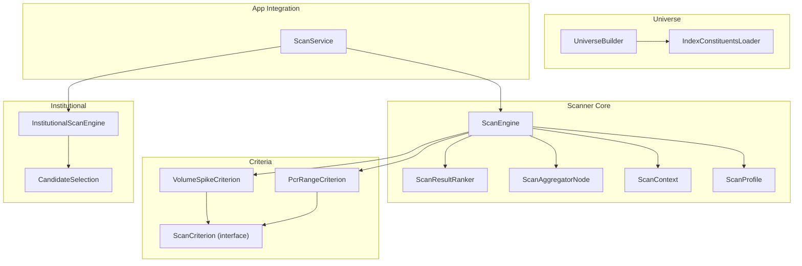
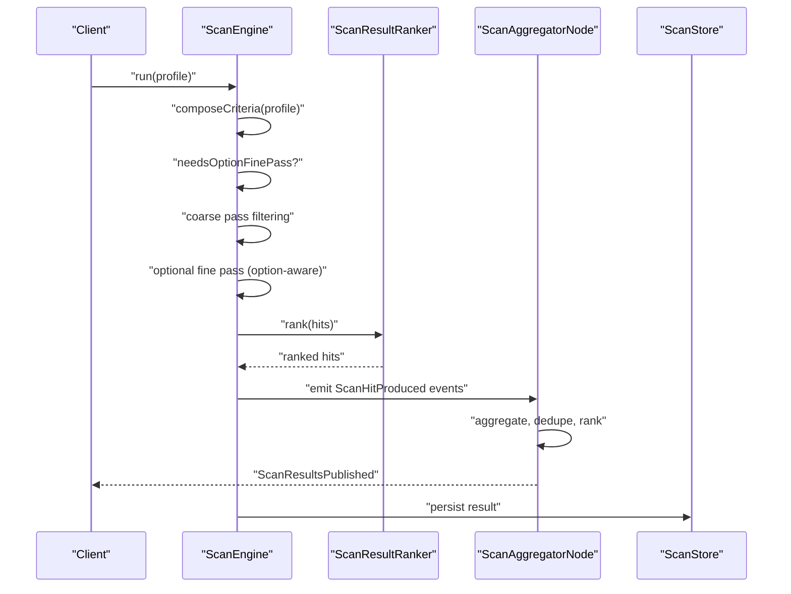
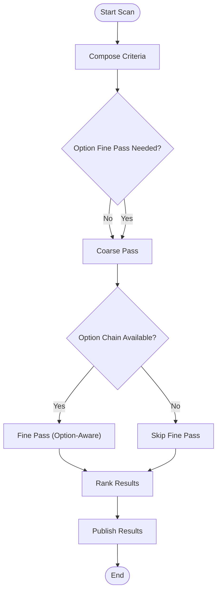
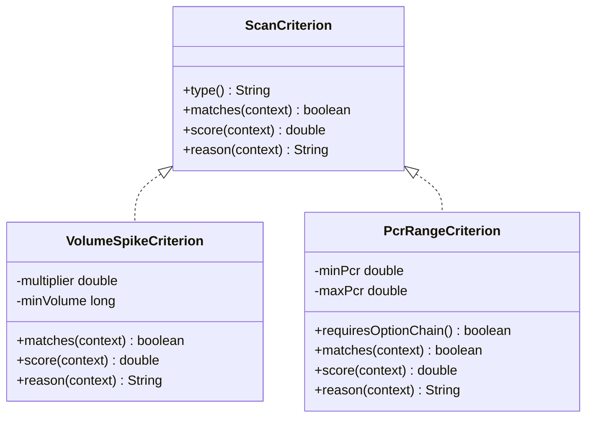
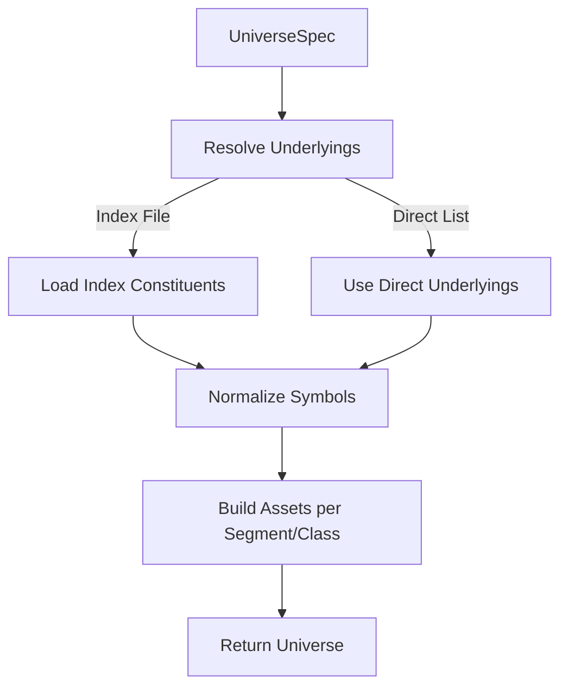
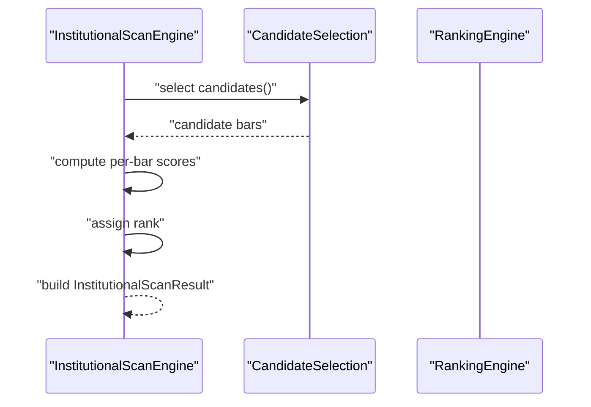
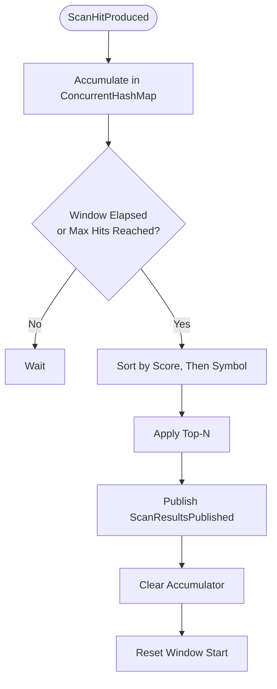
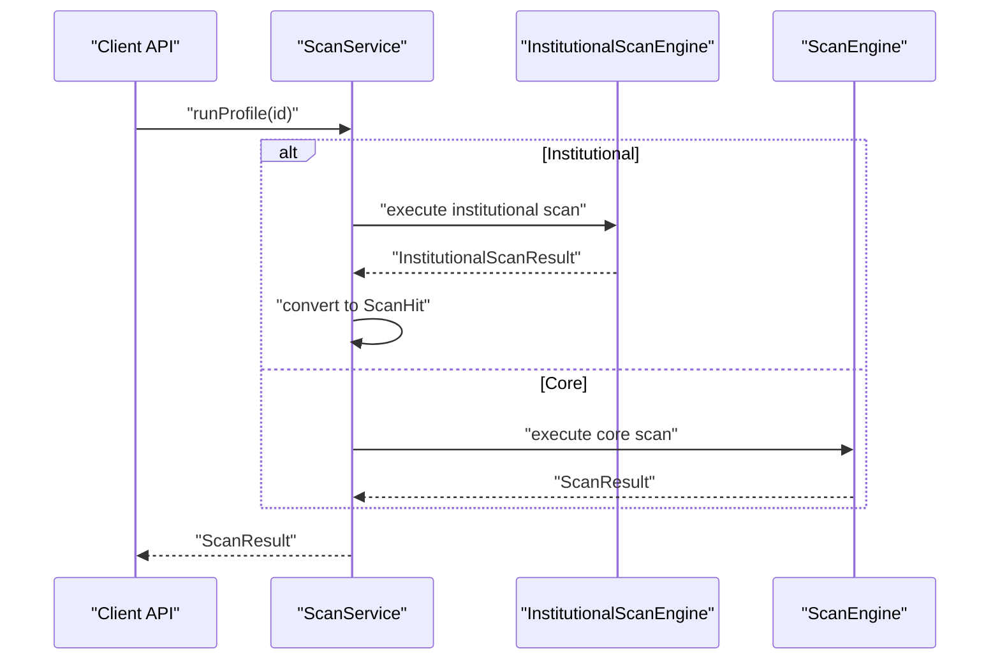
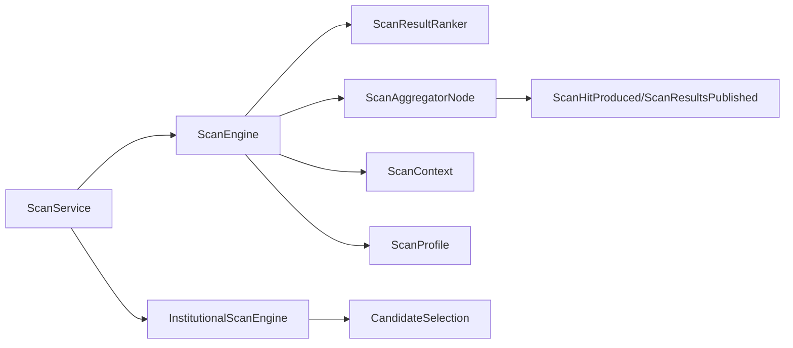

# Market Scanner System

<cite>
**Referenced Files in This Document**
- [ScanEngine.java](file://trading/scanner/src/main/java/com/tradej/scanner/engine/ScanEngine.java)
- [ScanResultRanker.java](file://trading/scanner/src/main/java/com/tradej/scanner/engine/ScanResultRanker.java)
- [ScanAggregatorNode.java](file://trading/scanner/src/main/java/com/tradej/scanner/node/ScanAggregatorNode.java)
- [ScanCriterion.java](file://trading/scanner/src/main/java/com/tradej/scanner/criterion/ScanCriterion.java)
- [VolumeSpikeCriterion.java](file://trading/scanner/src/main/java/com/tradej/scanner/criterion/VolumeSpikeCriterion.java)
- [PcrRangeCriterion.java](file://trading/scanner/src/main/java/com/tradej/scanner/criterion/PcrRangeCriterion.java)
- [IndexConstituentsLoader.java](file://trading/scanner/src/main/java/com/tradej/scanner/universe/IndexConstituentsLoader.java)
- [UniverseBuilder.java](file://trading/scanner/src/main/java/com/tradej/scanner/universe/UniverseBuilder.java)
- [ScanProfile.java](file://trading/scanner/src/main/java/com/tradej/scanner/model/ScanProfile.java)
- [ScanContext.java](file://trading/scanner/src/main/java/com/tradej/scanner/model/ScanContext.java)
- [InstitutionalScanEngine.java](file://trading/institutional-scanner/src/main/java/com/tradej/institutional/InstitutionalScanEngine.java)
- [CandidateSelection.java](file://trading/institutional-scanner/src/main/java/com/tradej/institutional/selection/CandidateSelection.java)
- [ScanService.java](file://app/src/main/java/com/tradej/app/scanner/ScanService.java)
- [scan-profiles.json](file://config/scan-profiles.json)
- [nifty50-sample.txt](file://config/indices/nifty50-sample.txt)
</cite>

## Table of Contents
1. [Introduction](#introduction)
2. [Project Structure](#project-structure)
3. [Core Components](#core-components)
4. [Architecture Overview](#architecture-overview)
5. [Detailed Component Analysis](#detailed-component-analysis)
6. [Dependency Analysis](#dependency-analysis)
7. [Performance Considerations](#performance-considerations)
8. [Troubleshooting Guide](#troubleshooting-guide)
9. [Conclusion](#conclusion)
10. [Appendices](#appendices)

## Introduction
This document describes the Market Scanner System, focusing on the scan engine architecture, criterion-based filtering, and candidate selection mechanisms. It explains institutional scanner functionality for market flow detection and screening, covering scan criteria such as volume spikes, option chain analysis, put-call ratio (PCR) computations, and price movement filters. It also documents scan result ranking, aggregation processes, alert generation, universe building, index constituent loading, and real-time scanning capabilities. Practical guidance is included for configuring scans, developing custom criteria, and integrating results into trading workflows.

## Project Structure
The scanner system spans several modules:
- Core scanner engine and criteria under trading/scanner
- Institutional scanner under trading/institutional-scanner
- Application integration under app/src/main/java/com/tradej/app/scanner
- Configuration under config/

Key areas:
- Engine: orchestration, ranking, and aggregation
- Criteria: reusable filters for volume, PCR, price movement, and option-aware checks
- Universe: building the asset universe from index constituents and specs
- Institutional: specialized ranking and candidate selection for market flow
- App integration: publishing results and exposing APIs

**Diagram sources**
- [ScanEngine.java:71-106](file://trading/scanner/src/main/java/com/tradej/scanner/engine/ScanEngine.java#L71-L106)
- [ScanResultRanker.java:12-23](file://trading/scanner/src/main/java/com/tradej/scanner/engine/ScanResultRanker.java#L12-L23)
- [ScanAggregatorNode.java:21-99](file://trading/scanner/src/main/java/com/tradej/scanner/node/ScanAggregatorNode.java#L21-L99)
- [ScanCriterion.java:5-15](file://trading/scanner/src/main/java/com/tradej/scanner/criterion/ScanCriterion.java#L5-L15)
- [VolumeSpikeCriterion.java:5-54](file://trading/scanner/src/main/java/com/tradej/scanner/criterion/VolumeSpikeCriterion.java#L5-L54)
- [PcrRangeCriterion.java:7-66](file://trading/scanner/src/main/java/com/tradej/scanner/criterion/PcrRangeCriterion.java#L7-L66)
- [UniverseBuilder.java:32-53](file://trading/scanner/src/main/java/com/tradej/scanner/universe/UniverseBuilder.java#L32-L53)
- [IndexConstituentsLoader.java:13-34](file://trading/scanner/src/main/java/com/tradej/scanner/universe/IndexConstituentsLoader.java#L13-L34)
- [InstitutionalScanEngine.java:89-117](file://trading/institutional-scanner/src/main/java/com/tradej/institutional/InstitutionalScanEngine.java#L89-L117)
- [CandidateSelection.java](file://trading/institutional-scanner/src/main/java/com/tradej/institutional/selection/CandidateSelection.java)
- [ScanService.java:101-135](file://app/src/main/java/com/tradej/app/scanner/ScanService.java#L101-L135)

**Section sources**
- [ScanEngine.java:71-106](file://trading/scanner/src/main/java/com/tradej/scanner/engine/ScanEngine.java#L71-L106)
- [ScanAggregatorNode.java:21-99](file://trading/scanner/src/main/java/com/tradej/scanner/node/ScanAggregatorNode.java#L21-L99)
- [UniverseBuilder.java:32-53](file://trading/scanner/src/main/java/com/tradej/scanner/universe/UniverseBuilder.java#L32-L53)
- [InstitutionalScanEngine.java:89-117](file://trading/institutional-scanner/src/main/java/com/tradej/institutional/InstitutionalScanEngine.java#L89-L117)

## Core Components
- ScanEngine: orchestrates coarse pass filtering, optional fine pass for option-aware criteria, ranking, and result packaging.
- ScanResultRanker: sorts hits by score and symbol, supports top-N truncation.
- ScanAggregatorNode: aggregates ScanHitProduced events, deduplicates by symbol, applies time-window/max-hits flushing, and publishes ScanResultsPublished.
- ScanCriterion and implementations: reusable filters (volume spike, PCR range, price movement).
- UniverseBuilder and IndexConstituentsLoader: construct the asset universe from index constituents and specification.
- InstitutionalScanEngine and CandidateSelection: compute scores and select candidates for institutional flow detection.
- ScanService: application-facing integration for running profiles and converting institutional results to scan hits.

**Section sources**
- [ScanEngine.java:71-106](file://trading/scanner/src/main/java/com/tradej/scanner/engine/ScanEngine.java#L71-L106)
- [ScanResultRanker.java:12-23](file://trading/scanner/src/main/java/com/tradej/scanner/engine/ScanResultRanker.java#L12-L23)
- [ScanAggregatorNode.java:21-99](file://trading/scanner/src/main/java/com/tradej/scanner/node/ScanAggregatorNode.java#L21-L99)
- [ScanCriterion.java:5-15](file://trading/scanner/src/main/java/com/tradej/scanner/criterion/ScanCriterion.java#L5-L15)
- [VolumeSpikeCriterion.java:5-54](file://trading/scanner/src/main/java/com/tradej/scanner/criterion/VolumeSpikeCriterion.java#L5-L54)
- [PcrRangeCriterion.java:7-66](file://trading/scanner/src/main/java/com/tradej/scanner/criterion/PcrRangeCriterion.java#L7-L66)
- [UniverseBuilder.java:32-53](file://trading/scanner/src/main/java/com/tradej/scanner/universe/UniverseBuilder.java#L32-L53)
- [IndexConstituentsLoader.java:13-34](file://trading/scanner/src/main/java/com/tradej/scanner/universe/IndexConstituentsLoader.java#L13-L34)
- [InstitutionalScanEngine.java:89-117](file://trading/institutional-scanner/src/main/java/com/tradej/institutional/InstitutionalScanEngine.java#L89-L117)
- [CandidateSelection.java](file://trading/institutional-scanner/src/main/java/com/tradej/institutional/selection/CandidateSelection.java)
- [ScanService.java:101-135](file://app/src/main/java/com/tradej/app/scanner/ScanService.java#L101-L135)

## Architecture Overview
The scanner architecture separates concerns across engine orchestration, criterion evaluation, universe construction, and result aggregation. Institutional scanning augments the core with multi-factor scoring and candidate selection.

**Diagram sources**
- [ScanEngine.java:71-106](file://trading/scanner/src/main/java/com/tradej/scanner/engine/ScanEngine.java#L71-L106)
- [ScanResultRanker.java:12-23](file://trading/scanner/src/main/java/com/tradej/scanner/engine/ScanResultRanker.java#L12-L23)
- [ScanAggregatorNode.java:21-99](file://trading/scanner/src/main/java/com/tradej/scanner/node/ScanAggregatorNode.java#L21-L99)

## Detailed Component Analysis

### Scan Engine
Responsibilities:
- Compose criteria from a profile
- Determine whether an option-aware fine pass is needed
- Execute coarse and optional fine passes
- Rank results and produce a ScanResult

Key behaviors:
- Criteria composition via a group wrapper
- Option-aware pass detection using criterion metadata
- Ranking and failure handling with structured results

**Diagram sources**
- [ScanEngine.java:81-106](file://trading/scanner/src/main/java/com/tradej/scanner/engine/ScanEngine.java#L81-L106)
- [ScanResultRanker.java:12-23](file://trading/scanner/src/main/java/com/tradej/scanner/engine/ScanResultRanker.java#L12-L23)

**Section sources**
- [ScanEngine.java:71-106](file://trading/scanner/src/main/java/com/tradej/scanner/engine/ScanEngine.java#L71-L106)

### Criterion-Based Filtering
The system defines a criterion interface and several built-in criteria:
- VolumeSpikeCriterion: compares current volume against intraday average with a multiplier threshold and minimum volume.
- PcrRangeCriterion: computes put-call ratio from option chain OI and checks against a configured range.

**Diagram sources**
- [ScanCriterion.java:5-15](file://trading/scanner/src/main/java/com/tradej/scanner/criterion/ScanCriterion.java#L5-L15)
- [VolumeSpikeCriterion.java:5-54](file://trading/scanner/src/main/java/com/tradej/scanner/criterion/VolumeSpikeCriterion.java#L5-L54)
- [PcrRangeCriterion.java:7-66](file://trading/scanner/src/main/java/com/tradej/scanner/criterion/PcrRangeCriterion.java#L7-L66)

**Section sources**
- [VolumeSpikeCriterion.java:5-54](file://trading/scanner/src/main/java/com/tradej/scanner/criterion/VolumeSpikeCriterion.java#L5-L54)
- [PcrRangeCriterion.java:7-66](file://trading/scanner/src/main/java/com/tradej/scanner/criterion/PcrRangeCriterion.java#L7-L66)

### Universe Building and Index Constituents Loading
UniverseBuilder constructs the set of ScanAsset entries from:
- Underlyings resolved from specification or index constituents file
- Asset classes and exchange segments
- Lot-size constraints

IndexConstituentsLoader reads a newline-delimited file of symbols, skipping comments and empty lines.

**Diagram sources**
- [UniverseBuilder.java:32-53](file://trading/scanner/src/main/java/com/tradej/scanner/universe/UniverseBuilder.java#L32-L53)
- [IndexConstituentsLoader.java:13-34](file://trading/scanner/src/main/java/com/tradej/scanner/universe/IndexConstituentsLoader.java#L13-L34)

**Section sources**
- [UniverseBuilder.java:32-53](file://trading/scanner/src/main/java/com/tradej/scanner/universe/UniverseBuilder.java#L32-L53)
- [IndexConstituentsLoader.java:13-34](file://trading/scanner/src/main/java/com/tradej/scanner/universe/IndexConstituentsLoader.java#L13-L34)
- [nifty50-sample.txt](file://config/indices/nifty50-sample.txt)

### Institutional Scanner and Candidate Selection
The institutional scanner computes multiple scores per bar and ranks candidates:
- rsScore, volumeExpansionScore, trendEfficiencyScore, openingDriveScore
- masterScore as the composite rank metric
- CandidateSelection drives the candidate pool
- InstitutionalScanEngine packages results with metadata

**Diagram sources**
- [InstitutionalScanEngine.java:89-117](file://trading/institutional-scanner/src/main/java/com/tradej/institutional/InstitutionalScanEngine.java#L89-L117)
- [CandidateSelection.java](file://trading/institutional-scanner/src/main/java/com/tradej/institutional/selection/CandidateSelection.java)

**Section sources**
- [InstitutionalScanEngine.java:89-117](file://trading/institutional-scanner/src/main/java/com/tradej/institutional/InstitutionalScanEngine.java#L89-L117)
- [CandidateSelection.java](file://trading/institutional-scanner/src/main/java/com/tradej/institutional/selection/CandidateSelection.java)

### Real-Time Scanning and Alert Generation
ScanAggregatorNode aggregates ScanHitProduced events, deduplicates by symbol, and emits ScanResultsPublished on time windows or hit thresholds. This enables real-time alerts and downstream consumption.

**Diagram sources**
- [ScanAggregatorNode.java:21-99](file://trading/scanner/src/main/java/com/tradej/scanner/node/ScanAggregatorNode.java#L21-L99)

**Section sources**
- [ScanAggregatorNode.java:21-99](file://trading/scanner/src/main/java/com/tradej/scanner/node/ScanAggregatorNode.java#L21-L99)

### Application Integration and Workflow
ScanService integrates scanning into the application:
- Converts institutional results to ScanHit for unified downstream processing
- Exposes runProfile and latest queries
- Bridges institutional and core scanner outputs

**Diagram sources**
- [ScanService.java:101-135](file://app/src/main/java/com/tradej/app/scanner/ScanService.java#L101-L135)
- [InstitutionalScanEngine.java:89-117](file://trading/institutional-scanner/src/main/java/com/tradej/institutional/InstitutionalScanEngine.java#L89-L117)
- [ScanEngine.java:71-106](file://trading/scanner/src/main/java/com/tradej/scanner/engine/ScanEngine.java#L71-L106)

**Section sources**
- [ScanService.java:101-135](file://app/src/main/java/com/tradej/app/scanner/ScanService.java#L101-L135)

## Dependency Analysis
The scanner system exhibits layered dependencies:
- Core engine depends on criteria and context
- Aggregation depends on event types and ranking
- Institutional engine depends on candidate selection and feature computation
- App integration depends on both engines and persistence

**Diagram sources**
- [ScanEngine.java:71-106](file://trading/scanner/src/main/java/com/tradej/scanner/engine/ScanEngine.java#L71-L106)
- [ScanResultRanker.java:12-23](file://trading/scanner/src/main/java/com/tradej/scanner/engine/ScanResultRanker.java#L12-L23)
- [ScanAggregatorNode.java:21-99](file://trading/scanner/src/main/java/com/tradej/scanner/node/ScanAggregatorNode.java#L21-L99)
- [InstitutionalScanEngine.java:89-117](file://trading/institutional-scanner/src/main/java/com/tradej/institutional/InstitutionalScanEngine.java#L89-L117)
- [CandidateSelection.java](file://trading/institutional-scanner/src/main/java/com/tradej/institutional/selection/CandidateSelection.java)
- [ScanService.java:101-135](file://app/src/main/java/com/tradej/app/scanner/ScanService.java#L101-L135)

**Section sources**
- [ScanEngine.java:71-106](file://trading/scanner/src/main/java/com/tradej/scanner/engine/ScanEngine.java#L71-L106)
- [ScanAggregatorNode.java:21-99](file://trading/scanner/src/main/java/com/tradej/scanner/node/ScanAggregatorNode.java#L21-L99)
- [InstitutionalScanEngine.java:89-117](file://trading/institutional-scanner/src/main/java/com/tradej/institutional/InstitutionalScanEngine.java#L89-L117)
- [ScanService.java:101-135](file://app/src/main/java/com/tradej/app/scanner/ScanService.java#L101-L135)

## Performance Considerations
- Criterion evaluation cost: minimize heavy option-chain computations by gating fine passes behind option-aware criteria detection.
- Ranking overhead: keep top-N bounded to reduce sorting costs.
- Aggregation window tuning: balance latency vs throughput by adjusting windowMs and maxHits.
- Universe size: constrain underlyings and segments to reduce scan scope.
- Caching: reuse intraday averages and option chain snapshots where appropriate.

## Troubleshooting Guide
Common issues and resolutions:
- No results due to missing option chains: verify option fine pass is enabled and option-aware criteria are present.
- Empty universe: ensure index constituents file exists and underlyings are specified.
- Duplicate symbols in results: rely on aggregator deduplication; confirm single source of ScanHitProduced events.
- Slow ranking: reduce topN or pre-filter hits aggressively in criteria.
- Institutional conversion errors: validate ScoredBar fields and ensure ScanService mapping aligns with output.

**Section sources**
- [ScanEngine.java:88-106](file://trading/scanner/src/main/java/com/tradej/scanner/engine/ScanEngine.java#L88-L106)
- [IndexConstituentsLoader.java:13-34](file://trading/scanner/src/main/java/com/tradej/scanner/universe/IndexConstituentsLoader.java#L13-L34)
- [ScanAggregatorNode.java:21-99](file://trading/scanner/src/main/java/com/tradej/scanner/node/ScanAggregatorNode.java#L21-L99)
- [ScanService.java:101-135](file://app/src/main/java/com/tradej/app/scanner/ScanService.java#L101-L135)

## Conclusion
The Market Scanner System provides a modular, extensible framework for criterion-based equity screening, option-aware analysis, and institutional flow detection. Its engine, criteria, universe builder, and aggregation pipeline enable robust real-time scanning and alerting. Institutional extensions add multi-factor scoring and candidate selection tailored for market flow identification. With proper configuration and tuning, the system supports efficient integration into trading workflows.

## Appendices

### Scan Configuration Examples
- Scan profiles: define criteria, mode, and option chain preferences in the configuration file.
- Index constituents: specify a newline-delimited list of symbols for universe building.
- Example references:
  - [scan-profiles.json](file://config/scan-profiles.json)
  - [nifty50-sample.txt](file://config/indices/nifty50-sample.txt)

**Section sources**
- [scan-profiles.json](file://config/scan-profiles.json)
- [nifty50-sample.txt](file://config/indices/nifty50-sample.txt)

### Custom Criterion Development
Steps to add a new criterion:
- Implement ScanCriterion or extend OptionAwareCriterion if option chain data is required.
- Define match conditions, scoring, and reasons.
- Register via ScanCriterionRegistry or include in ScanProfile criteria.
- Integrate with ScanEngine by composing criteria from the profile.

**Section sources**
- [ScanCriterion.java:5-15](file://trading/scanner/src/main/java/com/tradej/scanner/criterion/ScanCriterion.java#L5-L15)
- [ScanEngine.java:81-86](file://trading/scanner/src/main/java/com/tradej/scanner/engine/ScanEngine.java#L81-L86)

### Integration with Trading Workflows
- Use ScanService to run profiles and consume ScanResult.
- Convert institutional results to ScanHit for unified downstream processing.
- Subscribe to ScanResultsPublished events for real-time alerts.

**Section sources**
- [ScanService.java:101-135](file://app/src/main/java/com/tradej/app/scanner/ScanService.java#L101-L135)
- [ScanAggregatorNode.java:21-99](file://trading/scanner/src/main/java/com/tradej/scanner/node/ScanAggregatorNode.java#L21-L99)