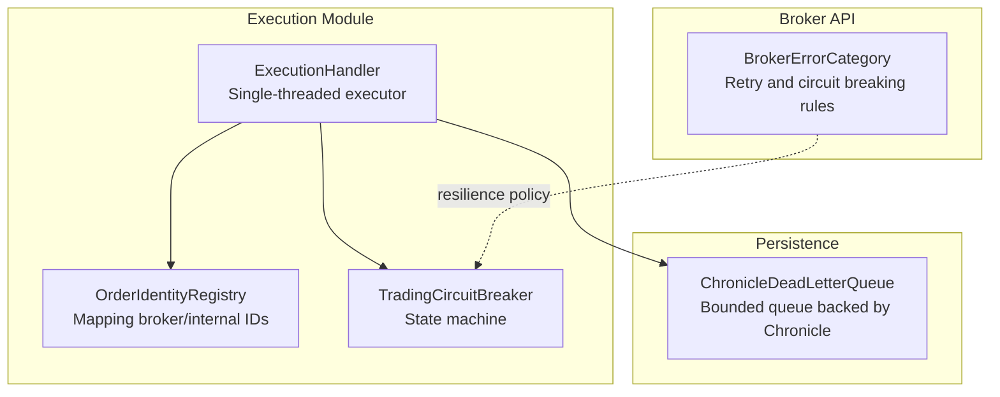
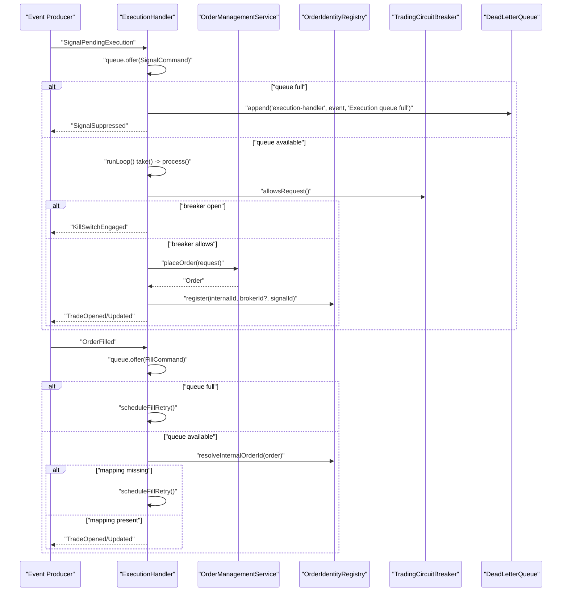
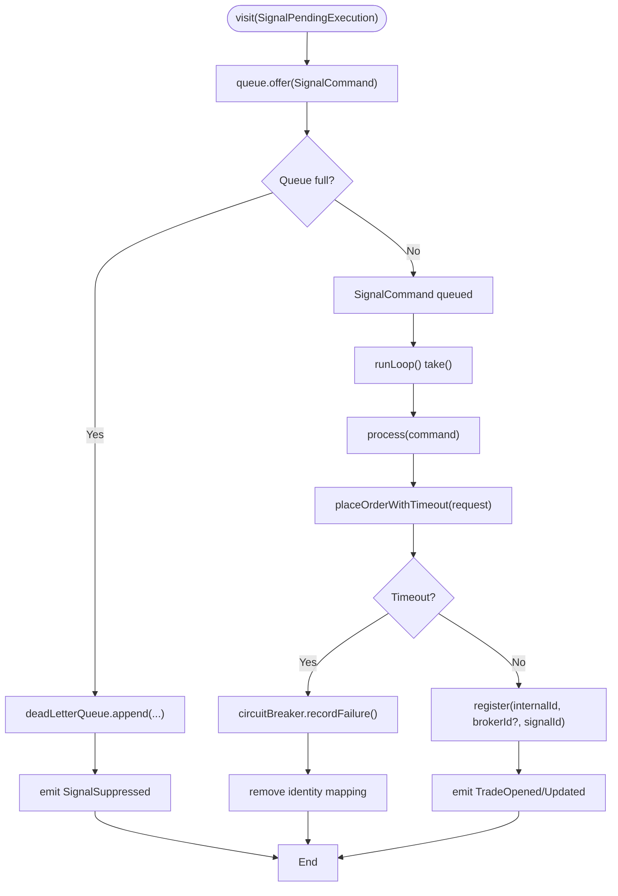
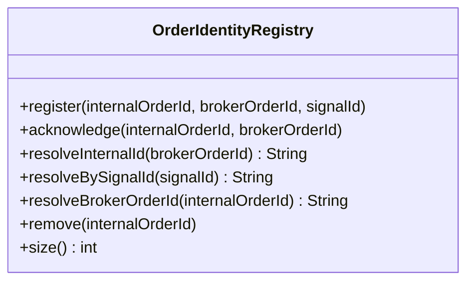
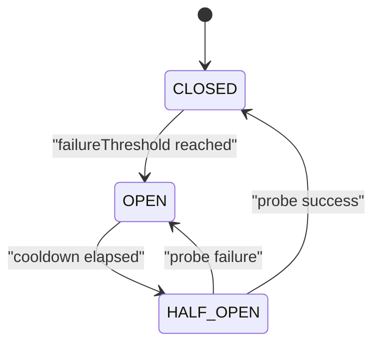
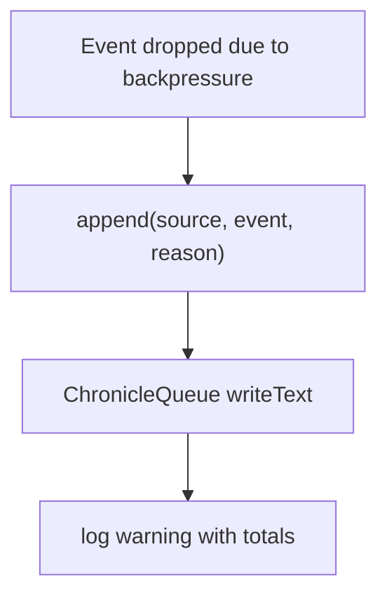
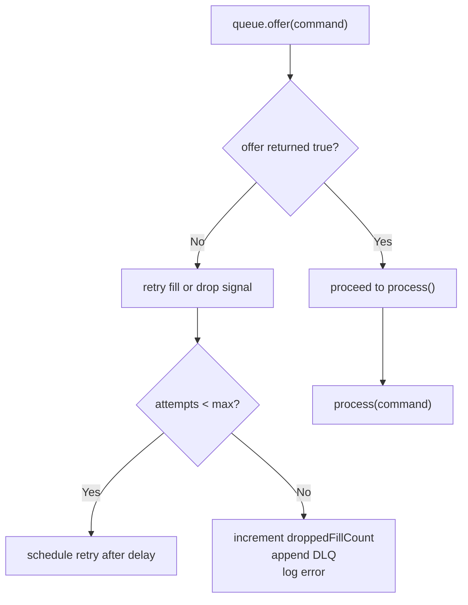
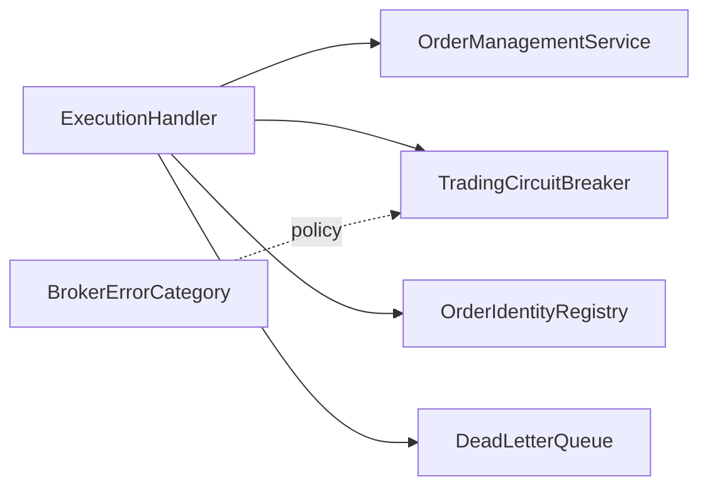

# Execution Coordination

<cite>
**Referenced Files in This Document**
- [ExecutionHandler.java](file://trading/execution/src/main/java/com/tradej/execution/service/ExecutionHandler.java)
- [OrderIdentityRegistry.java](file://trading/execution/src/main/java/com/tradej/execution/identity/OrderIdentityRegistry.java)
- [TradingCircuitBreaker.java](file://trading/execution/src/main/java/com/tradej/execution/service/TradingCircuitBreaker.java)
- [ChronicleDeadLetterQueue.java](file://data/persistence/src/main/java/com/tradej/persistence/chronicle/ChronicleDeadLetterQueue.java)
- [BrokerErrorCategory.java](file://broker/api/src/main/java/com/tradej/broker/api/resilience/BrokerErrorCategory.java)
- [CODE_LEVEL_REVIEW.md](file://docs/archive/CODE_LEVEL_REVIEW.md)
- [ExecutionHandlerUnitTest.java](file://trading/execution/src/test/java/com/tradej/execution/service/ExecutionHandlerUnitTest.java)
- [OrderIdentityRegistryTest.java](file://trading/execution/src/test/java/com/tradej/execution/identity/OrderIdentityRegistryTest.java)
- [OrderIdentityRegistryStressTest.java](file://trading/execution/src/test/java/com/tradej/execution/identity/OrderIdentityRegistryStressTest.java)
- [TradingCircuitBreakerStressTest.java](file://trading/execution/src/test/java/com/tradej/execution/service/TradingCircuitBreakerStressTest.java)
</cite>

## Table of Contents
1. [Introduction](#introduction)
2. [Project Structure](#project-structure)
3. [Core Components](#core-components)
4. [Architecture Overview](#architecture-overview)
5. [Detailed Component Analysis](#detailed-component-analysis)
6. [Dependency Analysis](#dependency-analysis)
7. [Performance Considerations](#performance-considerations)
8. [Troubleshooting Guide](#troubleshooting-guide)
9. [Conclusion](#conclusion)

## Introduction
This document describes the Execution Coordination system responsible for transforming trading signals into executable orders and managing fills. It focuses on the ExecutionHandler architecture, the single-threaded execution model, blocking queue management, and the command processing pipeline. It also covers signal processing, order placement workflows, fill handling mechanisms, the OrderIdentityRegistry for broker-to-internal order mapping, circuit breaker integration, and dead letter queue handling. Additional topics include queue capacity management, backpressure handling, retry mechanisms for failed operations, performance characteristics, throughput considerations, and operational monitoring capabilities.

## Project Structure
The Execution Coordination system spans several modules:
- trading/execution: Contains the ExecutionHandler, OrderIdentityRegistry, and TradingCircuitBreaker
- data/persistence: Provides the ChronicleDeadLetterQueue implementation
- broker/api: Defines error categories used for resilience decisions
- docs: Includes a code-level review highlighting queue capacity and other critical issues

**Diagram sources**
- [ExecutionHandler.java:90-135](file://trading/execution/src/main/java/com/tradej/execution/service/ExecutionHandler.java#L90-L135)
- [OrderIdentityRegistry.java:31-59](file://trading/execution/src/main/java/com/tradej/execution/identity/OrderIdentityRegistry.java#L31-L59)
- [TradingCircuitBreaker.java:1-44](file://trading/execution/src/main/java/com/tradej/execution/service/TradingCircuitBreaker.java#L1-L44)
- [ChronicleDeadLetterQueue.java:1-70](file://data/persistence/src/main/java/com/tradej/persistence/chronicle/ChronicleDeadLetterQueue.java#L1-L70)
- [BrokerErrorCategory.java:60-82](file://broker/api/src/main/java/com/tradej/broker/api/resilience/BrokerErrorCategory.java#L60-L82)

**Section sources**
- [ExecutionHandler.java:90-135](file://trading/execution/src/main/java/com/tradej/execution/service/ExecutionHandler.java#L90-L135)
- [OrderIdentityRegistry.java:31-59](file://trading/execution/src/main/java/com/tradej/execution/identity/OrderIdentityRegistry.java#L31-L59)
- [TradingCircuitBreaker.java:1-44](file://trading/execution/src/main/java/com/tradej/execution/service/TradingCircuitBreaker.java#L1-L44)
- [ChronicleDeadLetterQueue.java:1-70](file://data/persistence/src/main/java/com/tradej/persistence/chronicle/ChronicleDeadLetterQueue.java#L1-L70)
- [BrokerErrorCategory.java:60-82](file://broker/api/src/main/java/com/tradej/broker/api/resilience/BrokerErrorCategory.java#L60-L82)

## Core Components
- ExecutionHandler: Single-threaded command processor that accepts signals and fills, places orders with timeouts, and emits trade lifecycle events. It manages a bounded blocking queue and schedules fill retries with exponential-like deferral.
- OrderIdentityRegistry: Maintains mappings between internal order IDs, broker order IDs, and signal IDs, enabling fill identity resolution and preventing duplicate trade events.
- TradingCircuitBreaker: Three-state breaker (CLOSED, OPEN, HALF_OPEN) that protects the order placement subsystem under failure conditions.
- ChronicleDeadLetterQueue: Persistent dead letter queue for events dropped due to queue overflow or deferred processing limits.

Key responsibilities:
- Enforce single-threaded processing to avoid OMS state races
- Manage backpressure via bounded queues and controlled retries
- Resolve order identity for fills and trades
- Integrate circuit breaker decisions into order placement
- Persist dropped events for later reconciliation

**Section sources**
- [ExecutionHandler.java:176-203](file://trading/execution/src/main/java/com/tradej/execution/service/ExecutionHandler.java#L176-L203)
- [OrderIdentityRegistry.java:31-59](file://trading/execution/src/main/java/com/tradej/execution/identity/OrderIdentityRegistry.java#L31-L59)
- [TradingCircuitBreaker.java:1-44](file://trading/execution/src/main/java/com/tradej/execution/service/TradingCircuitBreaker.java#L1-L44)
- [ChronicleDeadLetterQueue.java:32-70](file://data/persistence/src/main/java/com/tradej/persistence/chronicle/ChronicleDeadLetterQueue.java#L32-L70)

## Architecture Overview
The ExecutionHandler operates as a single-threaded executor with two primary queues:
- A blocking queue for ExecutionCommand items (signals, fills, broker fills)
- A scheduled executor for fill retry deferrals

**Diagram sources**
- [ExecutionHandler.java:205-260](file://trading/execution/src/main/java/com/tradej/execution/service/ExecutionHandler.java#L205-L260)
- [ExecutionHandler.java:440-589](file://trading/execution/src/main/java/com/tradej/execution/service/ExecutionHandler.java#L440-L589)
- [TradingCircuitBreaker.java:1-44](file://trading/execution/src/main/java/com/tradej/execution/service/TradingCircuitBreaker.java#L1-L44)
- [OrderIdentityRegistry.java:31-59](file://trading/execution/src/main/java/com/tradej/execution/identity/OrderIdentityRegistry.java#L31-L59)
- [ChronicleDeadLetterQueue.java:32-70](file://data/persistence/src/main/java/com/tradej/persistence/chronicle/ChronicleDeadLetterQueue.java#L32-L70)

## Detailed Component Analysis

### ExecutionHandler: Single-threaded Execution Model and Command Pipeline
- Construction variants allow configuring queue capacity and order placement timeout.
- The handler exposes queue depth and remaining capacity for monitoring.
- Event processing:
  - SignalPendingExecution: Enqueues a SignalCommand; if the queue is full, emits SignalSuppressed and appends to DLQ.
  - OrderFilled: Enqueues a FillCommand; if the queue is full, schedules a delayed retry with capped attempts.
  - BrokerFillCommand: Internal variant for broker-originated fills with identity resolution and retry logic.
- Processing loop:
  - Continuously takes ExecutionCommand items from the queue and delegates to process().
  - Supports a CountDownLatch for deterministic testing.
- Order placement:
  - Wraps order placement in a CompletableFuture with a bounded get(timeout).
  - On timeout, cancels the future, records failure via circuit breaker, and cleans identity mapping.
- Trade emission:
  - Ensures TradeOpened is emitted only once per order via an internal guard set.
  - Emits TradeUpdated for subsequent fills.

**Diagram sources**
- [ExecutionHandler.java:205-260](file://trading/execution/src/main/java/com/tradej/execution/service/ExecutionHandler.java#L205-L260)
- [ExecutionHandler.java:539-554](file://trading/execution/src/main/java/com/tradej/execution/service/ExecutionHandler.java#L539-L554)
- [ExecutionHandler.java:556-589](file://trading/execution/src/main/java/com/tradej/execution/service/ExecutionHandler.java#L556-L589)

**Section sources**
- [ExecutionHandler.java:90-135](file://trading/execution/src/main/java/com/tradej/execution/service/ExecutionHandler.java#L90-L135)
- [ExecutionHandler.java:176-203](file://trading/execution/src/main/java/com/tradej/execution/service/ExecutionHandler.java#L176-L203)
- [ExecutionHandler.java:205-260](file://trading/execution/src/main/java/com/tradej/execution/service/ExecutionHandler.java#L205-L260)
- [ExecutionHandler.java:278-285](file://trading/execution/src/main/java/com/tradej/execution/service/ExecutionHandler.java#L278-L285)
- [ExecutionHandler.java:440-589](file://trading/execution/src/main/java/com/tradej/execution/service/ExecutionHandler.java#L440-L589)
- [ExecutionHandler.java:539-554](file://trading/execution/src/main/java/com/tradej/execution/service/ExecutionHandler.java#L539-L554)

### OrderIdentityRegistry: Broker-to-Internal Order Mapping
- Supports registering mappings with optional broker order ID and signal ID.
- Completes mappings upon acknowledgment, enabling fill identity resolution.
- Provides resolution APIs for internal ID, broker ID, and signal ID.
- Removes mappings when orders are finalized, ensuring clean state.
- Tests demonstrate concurrent registration, acknowledgment, removal, and size accuracy under load.

**Diagram sources**
- [OrderIdentityRegistry.java:31-59](file://trading/execution/src/main/java/com/tradej/execution/identity/OrderIdentityRegistry.java#L31-L59)

**Section sources**
- [OrderIdentityRegistry.java:31-59](file://trading/execution/src/main/java/com/tradej/execution/identity/OrderIdentityRegistry.java#L31-L59)
- [OrderIdentityRegistryTest.java:1-57](file://trading/execution/src/test/java/com/tradej/execution/identity/OrderIdentityRegistryTest.java#L1-L57)
- [OrderIdentityRegistryStressTest.java:1-136](file://trading/execution/src/test/java/com/tradej/execution/identity/OrderIdentityRegistryStressTest.java#L1-L136)

### TradingCircuitBreaker: Three-State Protection
- States: CLOSED → OPEN → HALF_OPEN → CLOSED
- Controls order placement based on failure thresholds and cooldown windows
- Limits concurrent probes during HALF_OPEN to prevent stampede recovery
- Lock-free atomic operations minimize contention under high throughput

**Diagram sources**
- [TradingCircuitBreaker.java:1-44](file://trading/execution/src/main/java/com/tradej/execution/service/TradingCircuitBreaker.java#L1-L44)

**Section sources**
- [TradingCircuitBreaker.java:1-44](file://trading/execution/src/main/java/com/tradej/execution/service/TradingCircuitBreaker.java#L1-L44)
- [TradingCircuitBreakerStressTest.java:1-125](file://trading/execution/src/test/java/com/tradej/execution/service/TradingCircuitBreakerStressTest.java#L1-L125)

### Dead Letter Queue: Persistent Event Preservation
- Chronicle-backed queue stores dropped events with metadata and reason
- Append operations are logged and tracked for monitoring
- Used to capture suppressed signals and exhausted fill defer attempts

**Diagram sources**
- [ChronicleDeadLetterQueue.java:32-70](file://data/persistence/src/main/java/com/tradej/persistence/chronicle/ChronicleDeadLetterQueue.java#L32-L70)
- [ExecutionHandler.java:211-218](file://trading/execution/src/main/java/com/tradej/execution/service/ExecutionHandler.java#L211-L218)
- [ExecutionHandler.java:250-252](file://trading/execution/src/main/java/com/tradej/execution/service/ExecutionHandler.java#L250-L252)

**Section sources**
- [ChronicleDeadLetterQueue.java:32-70](file://data/persistence/src/main/java/com/tradej/persistence/chronicle/ChronicleDeadLetterQueue.java#L32-L70)
- [ExecutionHandler.java:211-218](file://trading/execution/src/main/java/com/tradej/execution/service/ExecutionHandler.java#L211-L218)
- [ExecutionHandler.java:250-252](file://trading/execution/src/main/java/com/tradej/execution/service/ExecutionHandler.java#L250-L252)

### Backpressure and Retry Mechanisms
- Queue capacity: The default capacity is small, leading to suppression and DLQ append when exceeded.
- Fill deferral: When the queue is full on receiving fills, the handler schedules retries with a fixed delay and maximum attempts.
- Circuit breaker integration: Blocks order placement when open, emitting KillSwitchEngaged and recording failures.

**Diagram sources**
- [ExecutionHandler.java:224-260](file://trading/execution/src/main/java/com/tradej/execution/service/ExecutionHandler.java#L224-L260)
- [ExecutionHandler.java:247-260](file://trading/execution/src/main/java/com/tradej/execution/service/ExecutionHandler.java#L247-L260)
- [CODE_LEVEL_REVIEW.md:609-626](file://docs/archive/CODE_LEVEL_REVIEW.md#L609-L626)

**Section sources**
- [ExecutionHandler.java:224-260](file://trading/execution/src/main/java/com/tradej/execution/service/ExecutionHandler.java#L224-L260)
- [ExecutionHandler.java:247-260](file://trading/execution/src/main/java/com/tradej/execution/service/ExecutionHandler.java#L247-L260)
- [CODE_LEVEL_REVIEW.md:609-626](file://docs/archive/CODE_LEVEL_REVIEW.md#L609-L626)

## Dependency Analysis
- ExecutionHandler depends on:
  - OrderManagementService for placing orders
  - TradingCircuitBreaker for gating placement
  - OrderIdentityRegistry for mapping and identity resolution
  - DeadLetterQueue for persisting dropped events
- Circuit breaker decisions align with BrokerErrorCategory classifications for retryability and circuit-breaking.

**Diagram sources**
- [ExecutionHandler.java:90-135](file://trading/execution/src/main/java/com/tradej/execution/service/ExecutionHandler.java#L90-L135)
- [TradingCircuitBreaker.java:1-44](file://trading/execution/src/main/java/com/tradej/execution/service/TradingCircuitBreaker.java#L1-L44)
- [BrokerErrorCategory.java:60-82](file://broker/api/src/main/java/com/tradej/broker/api/resilience/BrokerErrorCategory.java#L60-L82)

**Section sources**
- [ExecutionHandler.java:90-135](file://trading/execution/src/main/java/com/tradej/execution/service/ExecutionHandler.java#L90-L135)
- [TradingCircuitBreaker.java:1-44](file://trading/execution/src/main/java/com/tradej/execution/service/TradingCircuitBreaker.java#L1-L44)
- [BrokerErrorCategory.java:60-82](file://broker/api/src/main/java/com/tradej/broker/api/resilience/BrokerErrorCategory.java#L60-L82)

## Performance Considerations
- Single-threaded execution eliminates concurrency hazards but constrains throughput to the speed of the execution thread.
- Bounded queue capacity can become a bottleneck under bursty signals or delayed broker responses.
- CompletableFuture-based placement introduces a fixed timeout; excessive timeouts increase failure counts and DLQ entries.
- Circuit breaker adds latency during OPEN/HALF_OPEN transitions but prevents overload.
- Monitoring counters (queue depth, remaining capacity, dropped fill count) enable dynamic tuning.

Recommendations:
- Increase queue capacity from the current small default to handle bursts.
- Tune order placement timeout based on broker SLAs.
- Monitor DLQ append counts and SignalSuppressed events to detect saturation.
- Consider adaptive retry delays and dynamic queue sizing for variable loads.

**Section sources**
- [CODE_LEVEL_REVIEW.md:609-626](file://docs/archive/CODE_LEVEL_REVIEW.md#L609-L626)
- [ExecutionHandler.java:176-186](file://trading/execution/src/main/java/com/tradej/execution/service/ExecutionHandler.java#L176-L186)
- [ExecutionHandler.java:539-554](file://trading/execution/src/main/java/com/tradej/execution/service/ExecutionHandler.java#L539-L554)

## Troubleshooting Guide
Common symptoms and diagnostics:
- Signals suppressed:
  - Cause: Queue full; verify queue depth and remaining capacity.
  - Action: Increase capacity or reduce upstream signal rate; inspect DLQ for suppressed events.
- Fill drops:
  - Cause: Identity mapping unavailable after max defer attempts; verify OrderIdentityRegistry state and broker acknowledgments.
  - Action: Confirm order placement completion and acknowledgment; monitor droppedFillCount.
- Placement timeouts:
  - Cause: Broker slow or overloaded; CompletableFuture timeout triggers failure recording.
  - Action: Adjust timeout, scale broker connections, or throttle signals.
- Circuit breaker engaged:
  - Cause: Failure threshold met; breaker blocks placement.
  - Action: Inspect breaker state and cooldown; address root cause before cooldown elapses.

Operational checks:
- Use unit tests to validate behavior under failure scenarios and circuit breaker states.
- Validate OrderIdentityRegistry correctness under concurrent operations.

**Section sources**
- [ExecutionHandler.java:208-218](file://trading/execution/src/main/java/com/tradej/execution/service/ExecutionHandler.java#L208-L218)
- [ExecutionHandler.java:247-260](file://trading/execution/src/main/java/com/tradej/execution/service/ExecutionHandler.java#L247-L260)
- [ExecutionHandler.java:446-458](file://trading/execution/src/main/java/com/tradej/execution/service/ExecutionHandler.java#L446-L458)
- [ExecutionHandlerUnitTest.java:182-210](file://trading/execution/src/test/java/com/tradej/execution/service/ExecutionHandlerUnitTest.java#L182-L210)
- [TradingCircuitBreakerStressTest.java:1-125](file://trading/execution/src/test/java/com/tradej/execution/service/TradingCircuitBreakerStressTest.java#L1-L125)

## Conclusion
The Execution Coordination system centers on a single-threaded ExecutionHandler that safely orchestrates order placement and fill handling while maintaining strict identity mapping and protective circuit breaker behavior. Its bounded queues and retry mechanisms provide resilience against transient failures, but the current queue capacity is small and can lead to suppression and drops under load. Operational monitoring via queue metrics and DLQ logging enables detection and remediation. Recommendations focus on increasing queue capacity, tuning timeouts, and enhancing retry strategies to improve throughput and reliability.