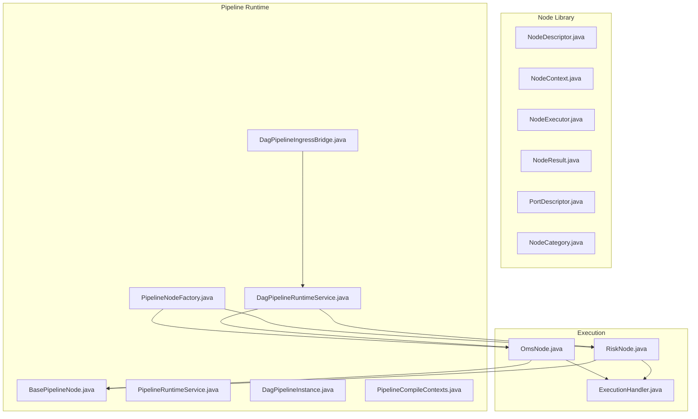
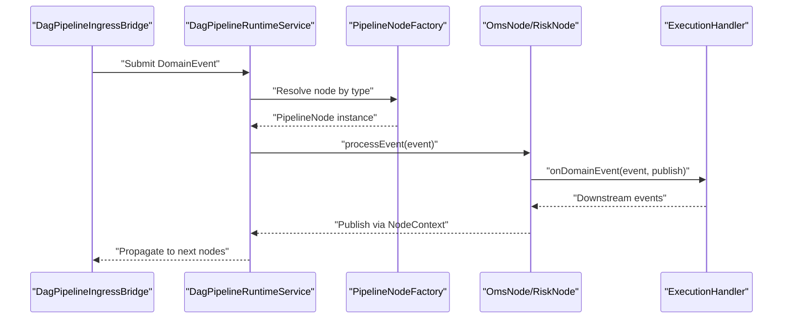
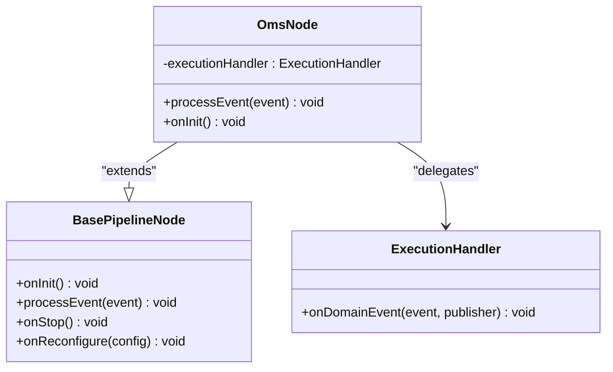
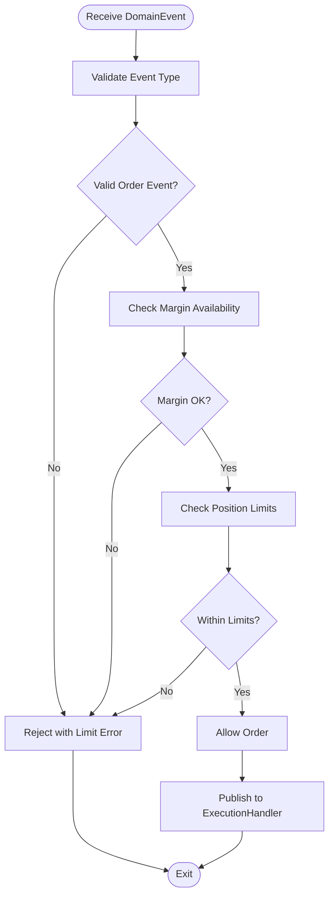
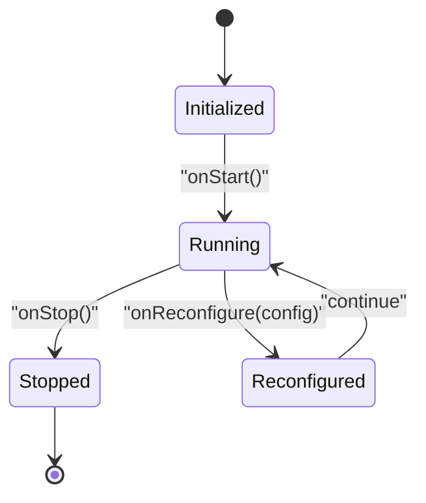
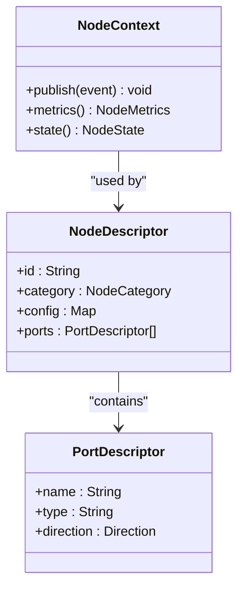
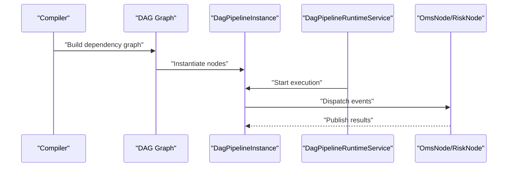
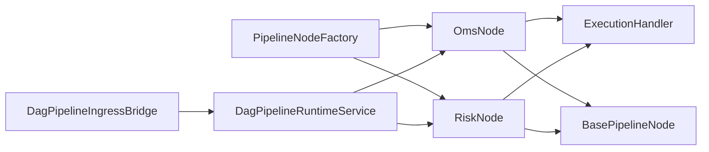

# OMS Node Processing

<cite>
**Referenced Files in This Document**
- [OmsNode.java](file://trading/execution/src/main/java/com/tradej/execution/node/OmsNode.java)
- [RiskNode.java](file://trading/execution/src/main/java/com/tradej/execution/node/RiskNode.java)
- [ExecutionHandler.java](file://trading/execution/src/main/java/com/tradej/execution/service/ExecutionHandler.java)
- [BasePipelineNode.java](file://pipeline/runtime/src/main/java/com/tradej/pipeline/runtime/BasePipelineNode.java)
- [DagPipelineRuntimeService.java](file://pipeline/runtime/src/main/java/com/tradej/pipeline/service/DagPipelineRuntimeService.java)
- [PipelineRuntimeService.java](file://pipeline/runtime/src/main/java/com/tradej/pipeline/service/PipelineRuntimeService.java)
- [NodeContext.java](file://nodes/trade-node-library/src/main/java/com/tradej/node/NodeContext.java)
- [NodeDescriptor.java](file://nodes/trade-node-library/src/main/java/com/tradej/node/NodeDescriptor.java)
- [NodeExecutor.java](file://nodes/trade-node-library/src/main/java/com/tradej/node/NodeExecutor.java)
- [NodeResult.java](file://nodes/trade-node-library/src/main/java/com/tradej/node/NodeResult.java)
- [PortDescriptor.java](file://nodes/trade-node-library/src/main/java/com/tradej/node/PortDescriptor.java)
- [NodeCategory.java](file://nodes/trade-node-library/src/main/java/com/tradej/node/NodeCategory.java)
- [PipelineNodeFactory.java](file://pipeline/runtime/src/main/java/com/tradej/pipeline/service/PipelineNodeFactory.java)
- [DagPipelineInstance.java](file://pipeline/runtime/src/main/java/com/tradej/pipeline/service/DagPipelineInstance.java)
- [DagPipelineIngressBridge.java](file://pipeline/runtime/src/main/java/com/tradej/pipeline/service/DagPipelineIngressBridge.java)
- [PipelineCompileContexts.java](file://pipeline/runtime/src/main/java/com/tradej/pipeline/service/PipelineCompileContexts.java)
- [ARCHITECTURE_EVOLUTION_PIPELINE_OS.md](file://docs/archive/ARCHITECTURE_EVOLUTION_PIPELINE_OS.md)
</cite>

## Table of Contents
1. [Introduction](#introduction)
2. [Project Structure](#project-structure)
3. [Core Components](#core-components)
4. [Architecture Overview](#architecture-overview)
5. [Detailed Component Analysis](#detailed-component-analysis)
6. [Dependency Analysis](#dependency-analysis)
7. [Performance Considerations](#performance-considerations)
8. [Troubleshooting Guide](#troubleshooting-guide)
9. [Conclusion](#conclusion)
10. [Appendices](#appendices)

## Introduction
This document describes the OMS Node Processing system within the Trade-J pipeline architecture. It focuses on the OmsNode implementation, the RiskNode for order validation and risk management, node lifecycle management, error handling, and integration with the DAG runtime. It also covers node configuration, execution context, performance monitoring, and practical guidance for developing custom OMS nodes, managing dependencies, and ensuring isolation and scalability.

## Project Structure
The OMS Node Processing system spans several modules:
- Node abstraction library defines the generic node contract and descriptors used across pipeline nodes.
- Execution module implements OmsNode and RiskNode, delegating order placement and risk checks to the ExecutionHandler.
- Pipeline runtime provides the DAG-based runtime, factory, and ingress bridge for orchestrating nodes.

**Diagram sources**
- [OmsNode.java:1-29](file://trading/execution/src/main/java/com/tradej/execution/node/OmsNode.java#L1-L29)
- [RiskNode.java](file://trading/execution/src/main/java/com/tradej/execution/node/RiskNode.java)
- [ExecutionHandler.java](file://trading/execution/src/main/java/com/tradej/execution/service/ExecutionHandler.java)
- [BasePipelineNode.java](file://pipeline/runtime/src/main/java/com/tradej/pipeline/runtime/BasePipelineNode.java)
- [PipelineRuntimeService.java](file://pipeline/runtime/src/main/java/com/tradej/pipeline/service/PipelineRuntimeService.java)
- [DagPipelineRuntimeService.java](file://pipeline/runtime/src/main/java/com/tradej/pipeline/service/DagPipelineRuntimeService.java)
- [PipelineNodeFactory.java](file://pipeline/runtime/src/main/java/com/tradej/pipeline/service/PipelineNodeFactory.java)
- [DagPipelineInstance.java](file://pipeline/runtime/src/main/java/com/tradej/pipeline/service/DagPipelineInstance.java)
- [DagPipelineIngressBridge.java](file://pipeline/runtime/src/main/java/com/tradej/pipeline/service/DagPipelineIngressBridge.java)
- [PipelineCompileContexts.java](file://pipeline/runtime/src/main/java/com/tradej/pipeline/service/PipelineCompileContexts.java)
- [NodeDescriptor.java](file://nodes/trade-node-library/src/main/java/com/tradej/node/NodeDescriptor.java)
- [NodeContext.java](file://nodes/trade-node-library/src/main/java/com/tradej/node/NodeContext.java)
- [NodeExecutor.java](file://nodes/trade-node-library/src/main/java/com/tradej/node/NodeExecutor.java)
- [NodeResult.java](file://nodes/trade-node-library/src/main/java/com/tradej/node/NodeResult.java)
- [PortDescriptor.java](file://nodes/trade-node-library/src/main/java/com/tradej/node/PortDescriptor.java)
- [NodeCategory.java](file://nodes/trade-node-library/src/main/java/com/tradej/node/NodeCategory.java)

**Section sources**
- [OmsNode.java:1-29](file://trading/execution/src/main/java/com/tradej/execution/node/OmsNode.java#L1-L29)
- [RiskNode.java](file://trading/execution/src/main/java/com/tradej/execution/node/RiskNode.java)
- [ExecutionHandler.java](file://trading/execution/src/main/java/com/tradej/execution/service/ExecutionHandler.java)
- [BasePipelineNode.java](file://pipeline/runtime/src/main/java/com/tradej/pipeline/runtime/BasePipelineNode.java)
- [PipelineRuntimeService.java](file://pipeline/runtime/src/main/java/com/tradej/pipeline/service/PipelineRuntimeService.java)
- [DagPipelineRuntimeService.java](file://pipeline/runtime/src/main/java/com/tradej/pipeline/service/DagPipelineRuntimeService.java)
- [PipelineNodeFactory.java](file://pipeline/runtime/src/main/java/com/tradej/pipeline/service/PipelineNodeFactory.java)
- [DagPipelineInstance.java](file://pipeline/runtime/src/main/java/com/tradej/pipeline/service/DagPipelineInstance.java)
- [DagPipelineIngressBridge.java](file://pipeline/runtime/src/main/java/com/tradej/pipeline/service/DagPipelineIngressBridge.java)
- [PipelineCompileContexts.java](file://pipeline/runtime/src/main/java/com/tradej/pipeline/service/PipelineCompileContexts.java)
- [NodeDescriptor.java](file://nodes/trade-node-library/src/main/java/com/tradej/node/NodeDescriptor.java)
- [NodeContext.java](file://nodes/trade-node-library/src/main/java/com/tradej/node/NodeContext.java)
- [NodeExecutor.java](file://nodes/trade-node-library/src/main/java/com/tradej/node/NodeExecutor.java)
- [NodeResult.java](file://nodes/trade-node-library/src/main/java/com/tradej/node/NodeResult.java)
- [PortDescriptor.java](file://nodes/trade-node-library/src/main/java/com/tradej/node/PortDescriptor.java)
- [NodeCategory.java](file://nodes/trade-node-library/src/main/java/com/tradej/node/NodeCategory.java)

## Core Components
- OmsNode: A thin pipeline node wrapper around the OMS execution handler. It receives domain events and delegates order placement and fill reconciliation to the ExecutionHandler while publishing downstream events via the node context.
- RiskNode: Implements pre-trade checks, margin validation, and position limit enforcement prior to order placement.
- ExecutionHandler: Central service orchestrating order lifecycle events and reconciliations with the broker/execution layer.
- BasePipelineNode: Generic base class providing lifecycle hooks and context for all pipeline nodes.
- Pipeline Runtime Services: Factory, DAG runtime, and ingress bridge orchestrate node instantiation, scheduling, and event propagation.

Key responsibilities:
- Node configuration via NodeDescriptor and ports via PortDescriptor.
- Execution context via NodeContext for publishing events and metrics.
- Lifecycle management: initialization, processing, reconfiguration, and shutdown.
- Integration with DAG runtime for dependency-aware scheduling and execution.

**Section sources**
- [OmsNode.java:1-29](file://trading/execution/src/main/java/com/tradej/execution/node/OmsNode.java#L1-L29)
- [RiskNode.java](file://trading/execution/src/main/java/com/tradej/execution/node/RiskNode.java)
- [ExecutionHandler.java](file://trading/execution/src/main/java/com/tradej/execution/service/ExecutionHandler.java)
- [BasePipelineNode.java](file://pipeline/runtime/src/main/java/com/tradej/pipeline/runtime/BasePipelineNode.java)
- [NodeDescriptor.java](file://nodes/trade-node-library/src/main/java/com/tradej/node/NodeDescriptor.java)
- [PortDescriptor.java](file://nodes/trade-node-library/src/main/java/com/tradej/node/PortDescriptor.java)
- [NodeContext.java](file://nodes/trade-node-library/src/main/java/com/tradej/node/NodeContext.java)

## Architecture Overview
The OMS Node Processing system integrates tightly with the DAG runtime. Nodes are created by the PipelineNodeFactory and scheduled by the DagPipelineRuntimeService. Events enter the pipeline via the DagPipelineIngressBridge and propagate downstream according to the compiled DAG graph.

**Diagram sources**
- [DagPipelineIngressBridge.java](file://pipeline/runtime/src/main/java/com/tradej/pipeline/service/DagPipelineIngressBridge.java)
- [DagPipelineRuntimeService.java](file://pipeline/runtime/src/main/java/com/tradej/pipeline/service/DagPipelineRuntimeService.java)
- [PipelineNodeFactory.java](file://pipeline/runtime/src/main/java/com/tradej/pipeline/service/PipelineNodeFactory.java)
- [OmsNode.java:1-29](file://trading/execution/src/main/java/com/tradej/execution/node/OmsNode.java#L1-L29)
- [RiskNode.java](file://trading/execution/src/main/java/com/tradej/execution/node/RiskNode.java)
- [ExecutionHandler.java](file://trading/execution/src/main/java/com/tradej/execution/service/ExecutionHandler.java)

## Detailed Component Analysis

### OmsNode Analysis
OmsNode is a minimal adapter that delegates all order-related processing to the ExecutionHandler. It inherits lifecycle hooks from BasePipelineNode and uses NodeContext to publish downstream events.

**Diagram sources**
- [BasePipelineNode.java](file://pipeline/runtime/src/main/java/com/tradej/pipeline/runtime/BasePipelineNode.java)
- [OmsNode.java:1-29](file://trading/execution/src/main/java/com/tradej/execution/node/OmsNode.java#L1-L29)
- [ExecutionHandler.java](file://trading/execution/src/main/java/com/tradej/execution/service/ExecutionHandler.java)

Processing logic:
- Initialization: No-op in current implementation.
- Event processing: Delegates to ExecutionHandler with a publisher bound to NodeContext.
- Lifecycle: Inherits standard lifecycle hooks from BasePipelineNode.

Error handling:
- Exceptions thrown by ExecutionHandler propagate to the runtime for handling.

Performance:
- Minimal overhead; processing latency dominated by ExecutionHandler and broker interactions.

**Section sources**
- [OmsNode.java:1-29](file://trading/execution/src/main/java/com/tradej/execution/node/OmsNode.java#L1-L29)
- [BasePipelineNode.java](file://pipeline/runtime/src/main/java/com/tradej/pipeline/runtime/BasePipelineNode.java)

### RiskNode Analysis
RiskNode performs pre-trade checks including margin validation and position limits. It acts as a gatekeeper before orders reach the ExecutionHandler.

**Diagram sources**
- [RiskNode.java](file://trading/execution/src/main/java/com/tradej/execution/node/RiskNode.java)

Processing logic:
- Validates incoming events to ensure they represent actionable orders.
- Performs margin availability checks against account and product-specific constraints.
- Enforces position limits per symbol and portfolio constraints.
- Publishes validated orders to downstream nodes (ExecutionHandler) or rejects with appropriate errors.

Error handling:
- Returns explicit errors for invalid events, insufficient margin, and exceeded position limits.
- Integrates with NodeContext for publishing error events.

Performance:
- Risk checks are fast-path validations; cost proportional to margin and position lookup complexity.

**Section sources**
- [RiskNode.java](file://trading/execution/src/main/java/com/tradej/execution/node/RiskNode.java)

### Node Lifecycle Management
Nodes follow a standardized lifecycle managed by BasePipelineNode and orchestrated by the DAG runtime.

Lifecycle stages:
- Initialization: NodeContext setup and resource allocation.
- Running: Event processing loop with metrics collection.
- Reconfiguration: Hot-reload of node configuration without restart.
- Stopped: Cleanup and resource release.

Integration with DAG runtime:
- PipelineNodeFactory resolves node instances by type.
- DagPipelineRuntimeService schedules nodes according to the compiled DAG graph.
- DagPipelineIngressBridge injects events into the pipeline.

**Section sources**
- [BasePipelineNode.java](file://pipeline/runtime/src/main/java/com/tradej/pipeline/runtime/BasePipelineNode.java)
- [PipelineNodeFactory.java](file://pipeline/runtime/src/main/java/com/tradej/pipeline/service/PipelineNodeFactory.java)
- [DagPipelineRuntimeService.java](file://pipeline/runtime/src/main/java/com/tradej/pipeline/service/DagPipelineRuntimeService.java)
- [DagPipelineIngressBridge.java](file://pipeline/runtime/src/main/java/com/tradej/pipeline/service/DagPipelineIngressBridge.java)

### Node Configuration and Execution Context
Node configuration is defined declaratively:
- NodeDescriptor: Describes node metadata, category, and configuration keys.
- PortDescriptor: Defines input/output ports and their types.
- NodeContext: Provides execution context including event publishing and metrics.

**Diagram sources**
- [NodeDescriptor.java](file://nodes/trade-node-library/src/main/java/com/tradej/node/NodeDescriptor.java)
- [PortDescriptor.java](file://nodes/trade-node-library/src/main/java/com/tradej/node/PortDescriptor.java)
- [NodeContext.java](file://nodes/trade-node-library/src/main/java/com/tradej/node/NodeContext.java)
- [NodeCategory.java](file://nodes/trade-node-library/src/main/java/com/tradej/node/NodeCategory.java)

**Section sources**
- [NodeDescriptor.java](file://nodes/trade-node-library/src/main/java/com/tradej/node/NodeDescriptor.java)
- [PortDescriptor.java](file://nodes/trade-node-library/src/main/java/com/tradej/node/PortDescriptor.java)
- [NodeContext.java](file://nodes/trade-node-library/src/main/java/com/tradej/node/NodeContext.java)
- [NodeCategory.java](file://nodes/trade-node-library/src/main/java/com/tradej/node/NodeCategory.java)

### Integration with DAG Runtime
The DAG runtime compiles the pipeline graph and manages node execution:
- PipelineCompileContexts: Holds compilation artifacts and shared state.
- DagPipelineInstance: Represents a running instance of the compiled DAG.
- DagPipelineRuntimeService: Schedules and executes nodes according to dependencies.
- PipelineNodeFactory: Creates node instances by type.

**Diagram sources**
- [PipelineCompileContexts.java](file://pipeline/runtime/src/main/java/com/tradej/pipeline/service/PipelineCompileContexts.java)
- [DagPipelineInstance.java](file://pipeline/runtime/src/main/java/com/tradej/pipeline/service/DagPipelineInstance.java)
- [DagPipelineRuntimeService.java](file://pipeline/runtime/src/main/java/com/tradej/pipeline/service/DagPipelineRuntimeService.java)
- [PipelineNodeFactory.java](file://pipeline/runtime/src/main/java/com/tradej/pipeline/service/PipelineNodeFactory.java)

**Section sources**
- [PipelineCompileContexts.java](file://pipeline/runtime/src/main/java/com/tradej/pipeline/service/PipelineCompileContexts.java)
- [DagPipelineInstance.java](file://pipeline/runtime/src/main/java/com/tradej/pipeline/service/DagPipelineInstance.java)
- [DagPipelineRuntimeService.java](file://pipeline/runtime/src/main/java/com/tradej/pipeline/service/DagPipelineRuntimeService.java)
- [PipelineNodeFactory.java](file://pipeline/runtime/src/main/java/com/tradej/pipeline/service/PipelineNodeFactory.java)

### Custom OMS Node Development Patterns
- Adapter pattern: Wrap existing services in a PipelineNode-compatible interface.
- Factory registration: Register node types in the PipelineNodeFactory mapping.
- Configuration-driven: Use NodeDescriptor config keys for dynamic behavior.
- Dependency management: Define input/output ports via PortDescriptor to express dependencies.
- Metrics and observability: Record latencies and errors via NodeContext metrics.

Reference implementation strategy:
- See the documented adapter pattern and factory mapping in the architecture guide.

**Section sources**
- [ARCHITECTURE_EVOLUTION_PIPELINE_OS.md:501-608](file://docs/archive/ARCHITECTURE_EVOLUTION_PIPELINE_OS.md#L501-L608)
- [NodeDescriptor.java](file://nodes/trade-node-library/src/main/java/com/tradej/node/NodeDescriptor.java)
- [PortDescriptor.java](file://nodes/trade-node-library/src/main/java/com/tradej/node/PortDescriptor.java)
- [PipelineNodeFactory.java](file://pipeline/runtime/src/main/java/com/tradej/pipeline/service/PipelineNodeFactory.java)

## Dependency Analysis
The OMS Node Processing system exhibits low coupling and high cohesion:
- OmsNode depends on ExecutionHandler and BasePipelineNode.
- RiskNode depends on ExecutionHandler and NodeContext for validation and publishing.
- Pipeline runtime services depend on the factory and DAG graph for orchestration.

**Diagram sources**
- [OmsNode.java:1-29](file://trading/execution/src/main/java/com/tradej/execution/node/OmsNode.java#L1-L29)
- [RiskNode.java](file://trading/execution/src/main/java/com/tradej/execution/node/RiskNode.java)
- [ExecutionHandler.java](file://trading/execution/src/main/java/com/tradej/execution/service/ExecutionHandler.java)
- [BasePipelineNode.java](file://pipeline/runtime/src/main/java/com/tradej/pipeline/runtime/BasePipelineNode.java)
- [PipelineNodeFactory.java](file://pipeline/runtime/src/main/java/com/tradej/pipeline/service/PipelineNodeFactory.java)
- [DagPipelineRuntimeService.java](file://pipeline/runtime/src/main/java/com/tradej/pipeline/service/DagPipelineRuntimeService.java)
- [DagPipelineIngressBridge.java](file://pipeline/runtime/src/main/java/com/tradej/pipeline/service/DagPipelineIngressBridge.java)

**Section sources**
- [OmsNode.java:1-29](file://trading/execution/src/main/java/com/tradej/execution/node/OmsNode.java#L1-L29)
- [RiskNode.java](file://trading/execution/src/main/java/com/tradej/execution/node/RiskNode.java)
- [ExecutionHandler.java](file://trading/execution/src/main/java/com/tradej/execution/service/ExecutionHandler.java)
- [BasePipelineNode.java](file://pipeline/runtime/src/main/java/com/tradej/pipeline/runtime/BasePipelineNode.java)
- [PipelineNodeFactory.java](file://pipeline/runtime/src/main/java/com/tradej/pipeline/service/PipelineNodeFactory.java)
- [DagPipelineRuntimeService.java](file://pipeline/runtime/src/main/java/com/tradej/pipeline/service/DagPipelineRuntimeService.java)
- [DagPipelineIngressBridge.java](file://pipeline/runtime/src/main/java/com/tradej/pipeline/service/DagPipelineIngressBridge.java)

## Performance Considerations
- Minimize node processing overhead: OmsNode and RiskNode are lightweight adapters.
- Optimize ExecutionHandler: Order placement and reconciliation latency dominate performance.
- Use asynchronous eventing: Leverage NodeContext publishing to avoid blocking.
- Monitor metrics: Track per-node latencies and error rates via NodeContext metrics.
- Scale horizontally: Increase worker threads or replicas of the DAG runtime for throughput.

[No sources needed since this section provides general guidance]

## Troubleshooting Guide
Common issues and resolutions:
- Orders rejected due to margin: Verify account balances and product-specific margin rules.
- Position limit breaches: Review exposure and adjust limits or reduce positions.
- Node failures: Inspect NodeContext metrics and logs for exceptions during processEvent.
- DAG deadlocks: Validate node dependencies and ensure acyclic graph construction.

Error handling patterns:
- RiskNode publishes explicit errors for invalid events, margin issues, and limit violations.
- OmsNode propagates exceptions from ExecutionHandler to the runtime for centralized handling.

**Section sources**
- [RiskNode.java](file://trading/execution/src/main/java/com/tradej/execution/node/RiskNode.java)
- [OmsNode.java:1-29](file://trading/execution/src/main/java/com/tradej/execution/node/OmsNode.java#L1-L29)

## Conclusion
The OMS Node Processing system leverages a clean separation of concerns: RiskNode enforces pre-trade controls, OmsNode delegates order execution, and the DAG runtime orchestrates nodes with dependency-aware scheduling. The design supports isolation, configurability, and scalability while maintaining low operational overhead.

[No sources needed since this section summarizes without analyzing specific files]

## Appendices

### Node Dependency Management Examples
- Define input/output ports via PortDescriptor to express upstream/downstream dependencies.
- Use NodeDescriptor categories to group related nodes and apply shared configurations.
- Register custom node types in PipelineNodeFactory for runtime discovery.

**Section sources**
- [PortDescriptor.java](file://nodes/trade-node-library/src/main/java/com/tradej/node/PortDescriptor.java)
- [NodeDescriptor.java](file://nodes/trade-node-library/src/main/java/com/tradej/node/NodeDescriptor.java)
- [PipelineNodeFactory.java](file://pipeline/runtime/src/main/java/com/tradej/pipeline/service/PipelineNodeFactory.java)

### Node Isolation and Resource Management
- Isolate node state: Prefer stateless nodes (like OmsNode) and keep shared state in ExecutionHandler.
- Manage resources: Use BasePipelineNode lifecycle hooks for initialization and cleanup.
- Control concurrency: Configure worker pools in the DAG runtime to match workload characteristics.

**Section sources**
- [BasePipelineNode.java](file://pipeline/runtime/src/main/java/com/tradej/pipeline/runtime/BasePipelineNode.java)
- [DagPipelineRuntimeService.java](file://pipeline/runtime/src/main/java/com/tradej/pipeline/service/DagPipelineRuntimeService.java)