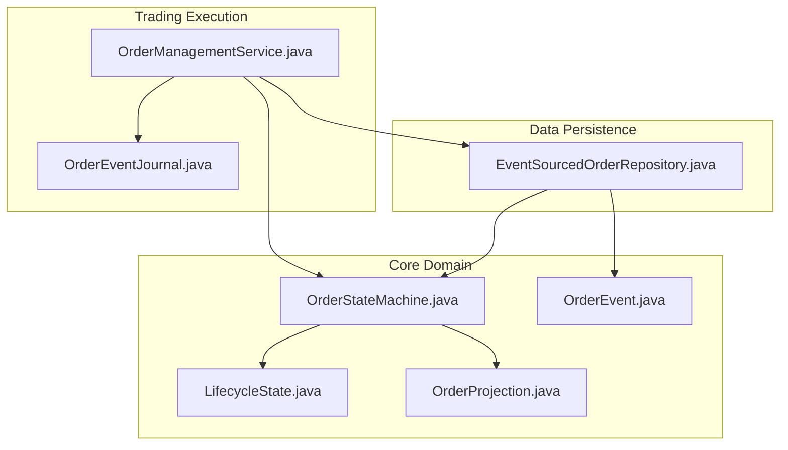
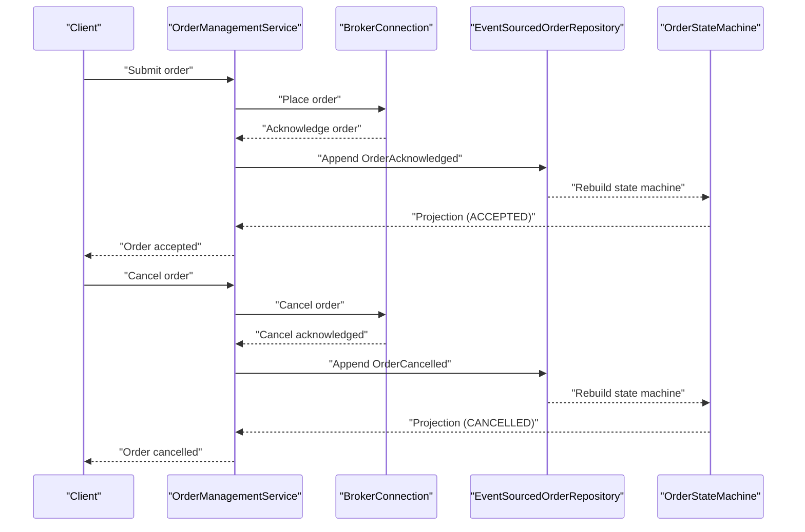
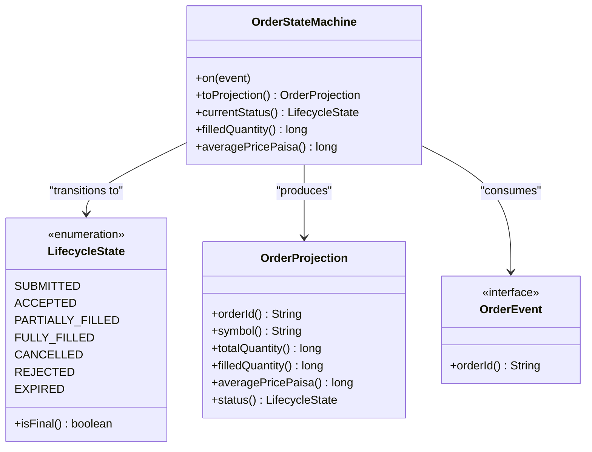
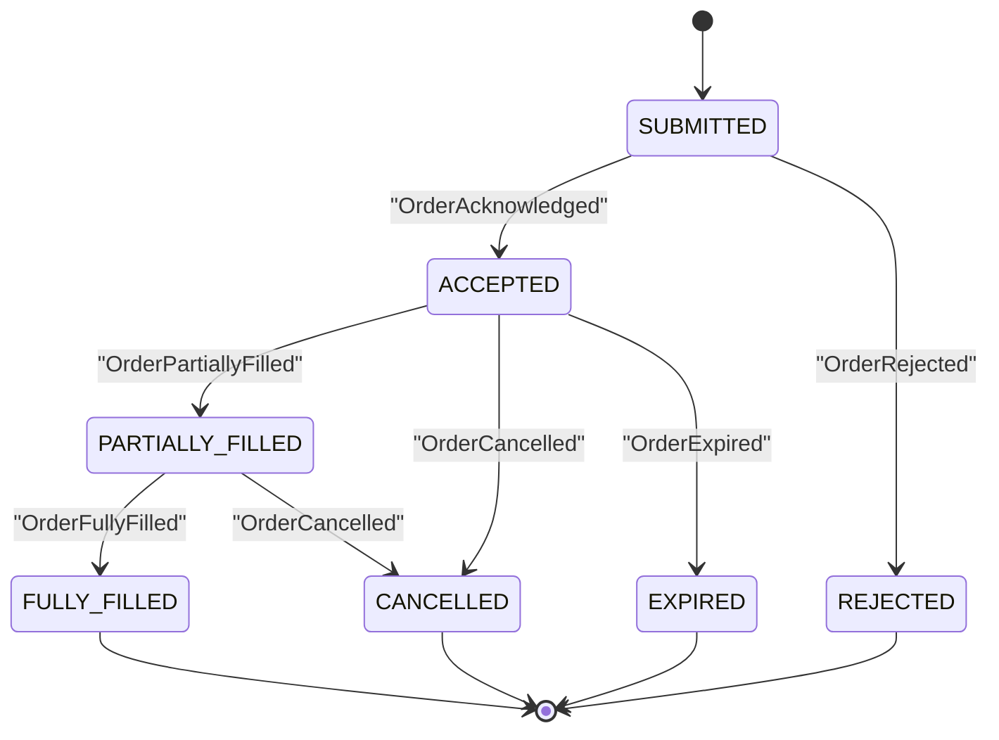
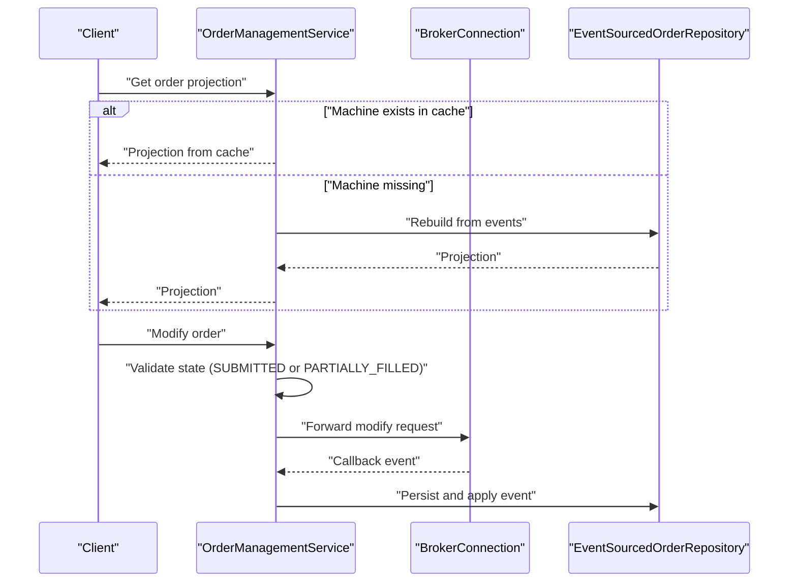
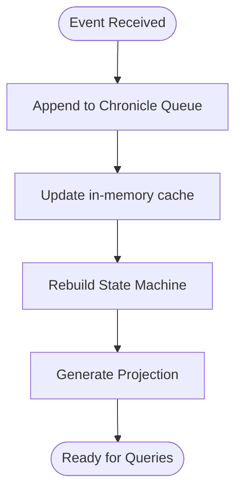
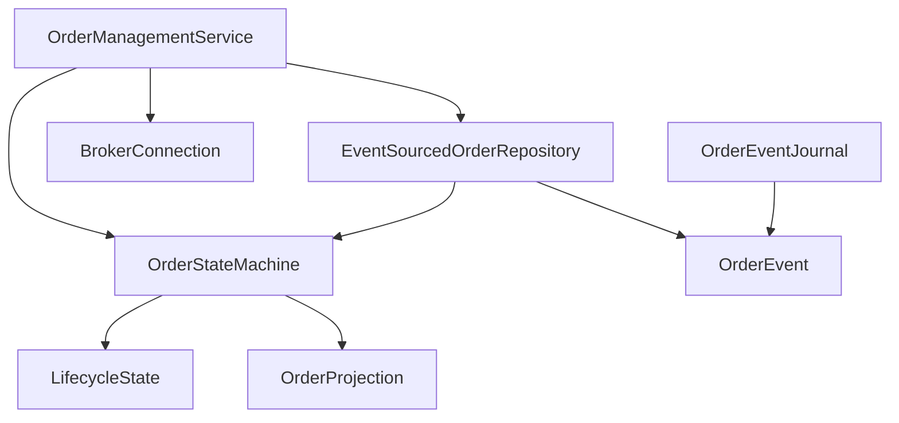

# Order Lifecycle Management

<cite>
**Referenced Files in This Document**
- [OrderStateMachine.java](file://core/src/main/java/com/tradej/core/domain/oms/OrderStateMachine.java)
- [LifecycleState.java](file://core/src/main/java/com/tradej/core/domain/oms/LifecycleState.java)
- [OrderProjection.java](file://core/src/main/java/com/tradej/core/domain/oms/OrderProjection.java)
- [OrderEvent.java](file://core/src/main/java/com/tradej/core/domain/oms/OrderEvent.java)
- [OrderManagementService.java](file://trading/execution/src/main/java/com/tradej/execution/service/OrderManagementService.java)
- [EventSourcedOrderRepository.java](file://data/persistence/src/main/java/com/tradej/persistence/oms/EventSourcedOrderRepository.java)
- [OrderEventJournal.java](file://trading/execution/src/main/java/com/tradej/execution/journal/OrderEventJournal.java)
- [EventSourcedOrderRepositoryTest.java](file://data/persistence/src/test/java/com/tradej/persistence/oms/EventSourcedOrderRepositoryTest.java)
- [EventSourcedOrderRepositoryStressTest.java](file://data/persistence/src/test/java/com/tradej/persistence/oms/EventSourcedOrderRepositoryStressTest.java)
- [IciciOrderLifecycleIntegrationTest.java](file://app/src/test/java/com/tradej/app/integration/IciciOrderLifecycleIntegrationTest.java)
- [DhanOrderLifecycleIntegrationTest.java](file://app/src/test/java/com/tradej/app/integration/DhanOrderLifecycleIntegrationTest.java)
</cite>

## Table of Contents
1. [Introduction](#introduction)
2. [Project Structure](#project-structure)
3. [Core Components](#core-components)
4. [Architecture Overview](#architecture-overview)
5. [Detailed Component Analysis](#detailed-component-analysis)
6. [Dependency Analysis](#dependency-analysis)
7. [Performance Considerations](#performance-considerations)
8. [Troubleshooting Guide](#troubleshooting-guide)
9. [Conclusion](#conclusion)

## Introduction
This document provides comprehensive documentation for the Order Lifecycle Management system. It details the complete order state machine implementation, including all lifecycle states (SUBMITTED, ACCEPTED, PARTIALLY_FILLED, FULLY_FILLED, CANCELLED, REJECTED, EXPIRED), state transition rules, event-driven state changes, and the immutable nature of order state. It also explains the OrderStateMachine architecture, state validation logic, terminal state handling, examples of typical order flows, error scenarios, state recovery mechanisms, order event ordering guarantees, concurrency considerations, and state consistency patterns.

## Project Structure
The Order Lifecycle Management system spans several modules:
- Core domain module defines the state machine, lifecycle states, projections, and events.
- Trading execution module orchestrates order operations and integrates with brokers.
- Data persistence module provides event sourcing and repository capabilities.
- Tests validate state transitions, event ordering, and concurrency behavior.

**Diagram sources**
- [OrderStateMachine.java](file://core/src/main/java/com/tradej/core/domain/oms/OrderStateMachine.java)
- [LifecycleState.java](file://core/src/main/java/com/tradej/core/domain/oms/LifecycleState.java)
- [OrderProjection.java](file://core/src/main/java/com/tradej/core/domain/oms/OrderProjection.java)
- [OrderEvent.java](file://core/src/main/java/com/tradej/core/domain/oms/OrderEvent.java)
- [OrderManagementService.java](file://trading/execution/src/main/java/com/tradej/execution/service/OrderManagementService.java)
- [EventSourcedOrderRepository.java](file://data/persistence/src/main/java/com/tradej/persistence/oms/EventSourcedOrderRepository.java)
- [OrderEventJournal.java](file://trading/execution/src/main/java/com/tradej/execution/journal/OrderEventJournal.java)

**Section sources**
- [OrderStateMachine.java](file://core/src/main/java/com/tradej/core/domain/oms/OrderStateMachine.java)
- [OrderManagementService.java](file://trading/execution/src/main/java/com/tradej/execution/service/OrderManagementService.java)
- [EventSourcedOrderRepository.java](file://data/persistence/src/main/java/com/tradej/persistence/oms/EventSourcedOrderRepository.java)

## Core Components
This section introduces the primary building blocks of the Order Lifecycle Management system.

- OrderStateMachine: Implements the state machine with strict transition rules and immutable state projection.
- LifecycleState: Enumerates all valid order states and terminal state detection.
- OrderProjection: Immutable snapshot of the order's current state and derived metrics.
- OrderEvent: Event interface representing lifecycle updates.
- OrderManagementService: Orchestrates order creation, modification, cancellation, and broker callbacks.
- EventSourcedOrderRepository: Event-sourced persistence and state reconstruction.
- OrderEventJournal: Typed journal entries for persisted events.

**Section sources**
- [OrderStateMachine.java](file://core/src/main/java/com/tradej/core/domain/oms/OrderStateMachine.java)
- [LifecycleState.java](file://core/src/main/java/com/tradej/core/domain/oms/LifecycleState.java)
- [OrderProjection.java](file://core/src/main/java/com/tradej/core/domain/oms/OrderProjection.java)
- [OrderEvent.java](file://core/src/main/java/com/tradej/core/domain/oms/OrderEvent.java)
- [OrderManagementService.java](file://trading/execution/src/main/java/com/tradej/execution/service/OrderManagementService.java)
- [EventSourcedOrderRepository.java](file://data/persistence/src/main/java/com/tradej/persistence/oms/EventSourcedOrderRepository.java)
- [OrderEventJournal.java](file://trading/execution/src/main/java/com/tradej/execution/journal/OrderEventJournal.java)

## Architecture Overview
The system follows an event-driven architecture:
- Events drive state transitions within the OrderStateMachine.
- OrderManagementService coordinates broker interactions and persists events.
- EventSourcedOrderRepository stores events and reconstructs state machines for recovery.
- OrderEventJournal provides typed wrappers for persisted events.

**Diagram sources**
- [OrderManagementService.java](file://trading/execution/src/main/java/com/tradej/execution/service/OrderManagementService.java)
- [EventSourcedOrderRepository.java](file://data/persistence/src/main/java/com/tradej/persistence/oms/EventSourcedOrderRepository.java)
- [OrderStateMachine.java](file://core/src/main/java/com/tradej/core/domain/oms/OrderStateMachine.java)

## Detailed Component Analysis

### OrderStateMachine
The OrderStateMachine encapsulates the order lifecycle with strict transition rules and immutable state projection. It validates each incoming event against the current state and applies transformations to derive a new state and projection.

Key characteristics:
- Immutable state: Once constructed, the state machine produces immutable projections.
- Strict transitions: Only valid transitions are permitted; invalid transitions are rejected.
- Event-driven: Transitions occur upon receiving domain events.
- Terminal state detection: Provides isFinal() semantics for state classification.

**Diagram sources**
- [OrderStateMachine.java](file://core/src/main/java/com/tradej/core/domain/oms/OrderStateMachine.java)
- [LifecycleState.java](file://core/src/main/java/com/tradej/core/domain/oms/LifecycleState.java)
- [OrderProjection.java](file://core/src/main/java/com/tradej/core/domain/oms/OrderProjection.java)
- [OrderEvent.java](file://core/src/main/java/com/tradej/core/domain/oms/OrderEvent.java)

**Section sources**
- [OrderStateMachine.java](file://core/src/main/java/com/tradej/core/domain/oms/OrderStateMachine.java)
- [LifecycleState.java](file://core/src/main/java/com/tradej/core/domain/oms/LifecycleState.java)
- [OrderProjection.java](file://core/src/main/java/com/tradej/core/domain/oms/OrderProjection.java)

### Lifecycle States and Transitions
The system defines seven lifecycle states with explicit terminal state handling:
- SUBMITTED: Initial state after order submission.
- ACCEPTED: After broker acknowledgment.
- PARTIALLY_FILLED: Partial executions occurred.
- FULLY_FILLED: All quantity executed.
- CANCELLED: Order canceled.
- REJECTED: Order rejected by broker or system.
- EXPIRED: Order expired per validity rules.

Terminal state handling:
- isFinal() indicates completion for reporting and filtering.
- Active orders are those not in a terminal state.
- Completed orders are those in a terminal state.

**Diagram sources**
- [LifecycleState.java](file://core/src/main/java/com/tradej/core/domain/oms/LifecycleState.java)
- [OrderStateMachine.java](file://core/src/main/java/com/tradej/core/domain/oms/OrderStateMachine.java)

**Section sources**
- [LifecycleState.java](file://core/src/main/java/com/tradej/core/domain/oms/LifecycleState.java)
- [OrderStateMachine.java](file://core/src/main/java/com/tradej/core/domain/oms/OrderStateMachine.java)

### OrderManagementService
OrderManagementService orchestrates order operations:
- Creation: Submits orders and delegates to broker connection.
- Modification: Validates modifiable states (SUBMITTED or PARTIALLY_FILLED).
- Cancellation: Delegates cancellation to broker connection.
- Projection retrieval: Returns current order projection or rebuilds from repository.
- Event processing: Persists and applies broker callback events atomically.
- Recovery: Replays persisted events to rebuild in-memory state machines.

Concurrency and consistency:
- Synchronized methods protect state machine access.
- Atomic persistence ensures event ordering and durability.
- Replay on startup rebuilds state machines from repository.

**Diagram sources**
- [OrderManagementService.java](file://trading/execution/src/main/java/com/tradej/execution/service/OrderManagementService.java)
- [EventSourcedOrderRepository.java](file://data/persistence/src/main/java/com/tradej/persistence/oms/EventSourcedOrderRepository.java)

**Section sources**
- [OrderManagementService.java](file://trading/execution/src/main/java/com/tradej/execution/service/OrderManagementService.java)

### Event Ordering Guarantees and Persistence
EventSourcedOrderRepository provides:
- Event ordering: Maintains per-order event lists preserving temporal sequence.
- Atomic append: Persists events to Chronicle Queue and updates in-memory cache.
- Reconstruction: Rebuilds state machines by replaying events in order.
- Known order IDs: Enumerates tracked orders for monitoring and reporting.
- Counts: Reports active and rejected counts for operational dashboards.

**Diagram sources**
- [EventSourcedOrderRepository.java](file://data/persistence/src/main/java/com/tradej/persistence/oms/EventSourcedOrderRepository.java)

**Section sources**
- [EventSourcedOrderRepository.java](file://data/persistence/src/main/java/com/tradej/persistence/oms/EventSourcedOrderRepository.java)
- [EventSourcedOrderRepositoryTest.java](file://data/persistence/src/test/java/com/tradej/persistence/oms/EventSourcedOrderRepositoryTest.java)

### Concurrency Considerations and State Consistency
Concurrency patterns:
- Thread-safe repository: Uses ConcurrentHashMap and CopyOnWriteArrayList for concurrent appends.
- Per-order isolation: Different order IDs are isolated, preventing cross-interference.
- Atomic operations: Append operations are atomic per event, ensuring durability.
- Replay safety: Startup replay clears cache and rebuilds state machines deterministically.

Stress testing demonstrates:
- Concurrent appends for different order IDs do not interfere.
- Concurrent appends followed by rebuild remain consistent.
- Multiple order IDs can be appended concurrently without corruption.

**Section sources**
- [EventSourcedOrderRepository.java](file://data/persistence/src/main/java/com/tradej/persistence/oms/EventSourcedOrderRepository.java)
- [EventSourcedOrderRepositoryStressTest.java](file://data/persistence/src/test/java/com/tradej/persistence/oms/EventSourcedOrderRepositoryStressTest.java)

### Typical Order Flows and Examples
Common flows validated by tests:
- Submitted → Acknowledged → Partially Filled → Fully Filled.
- Submitted → Acknowledged → Cancelled.
- Submitted → Rejected.
- Submitted → Acknowledged → Expired.

These flows are verified through serialization roundtrips and state reconstruction.

**Section sources**
- [EventSourcedOrderRepositoryTest.java](file://data/persistence/src/test/java/com/tradej/persistence/oms/EventSourcedOrderRepositoryTest.java)

### Error Scenarios and State Recovery
Error handling and recovery mechanisms:
- Unknown order IDs: Modification requests for unknown orders delegate to broker connection.
- Invalid state transitions: Modification attempts outside allowed states throw exceptions.
- Silent failures: GraphRuntime onEvent() swallowing exceptions is flagged as a concern.
- Recovery: Startup replay rebuilds state machines from persisted events.

Operational safeguards:
- Active vs completed filtering: Services distinguish active and completed orders using terminal state detection.
- Event journaling: Typed journal entries wrap persisted events for reliable reconstruction.

**Section sources**
- [OrderManagementService.java](file://trading/execution/src/main/java/com/tradej/execution/service/OrderManagementService.java)
- [EventSourcedOrderRepository.java](file://data/persistence/src/main/java/com/tradej/persistence/oms/EventSourcedOrderRepository.java)
- [OrderEventJournal.java](file://trading/execution/src/main/java/com/tradej/execution/journal/OrderEventJournal.java)
- [TRADE_J_ARCHITECTURE_REVIEW.md](file://plans/TRADE_J_ARCHITECTURE_REVIEW.md)

### Integration Tests for Real Brokers
Integration tests validate end-to-end order lifecycle behavior with real broker connections:
- IciciOrderLifecycleIntegrationTest: Exercises lifecycle with ICICI broker.
- DhanOrderLifecycleIntegrationTest: Exercises lifecycle with DHAN broker.

These tests ensure real-world compatibility and robustness.

**Section sources**
- [IciciOrderLifecycleIntegrationTest.java](file://app/src/test/java/com/tradej/app/integration/IciciOrderLifecycleIntegrationTest.java)
- [DhanOrderLifecycleIntegrationTest.java](file://app/src/test/java/com/tradej/app/integration/DhanOrderLifecycleIntegrationTest.java)

## Dependency Analysis
The following diagram shows key dependencies among components:

**Diagram sources**
- [OrderManagementService.java](file://trading/execution/src/main/java/com/tradej/execution/service/OrderManagementService.java)
- [EventSourcedOrderRepository.java](file://data/persistence/src/main/java/com/tradej/persistence/oms/EventSourcedOrderRepository.java)
- [OrderStateMachine.java](file://core/src/main/java/com/tradej/core/domain/oms/OrderStateMachine.java)
- [LifecycleState.java](file://core/src/main/java/com/tradej/core/domain/oms/LifecycleState.java)
- [OrderProjection.java](file://core/src/main/java/com/tradej/core/domain/oms/OrderProjection.java)
- [OrderEvent.java](file://core/src/main/java/com/tradej/core/domain/oms/OrderEvent.java)
- [OrderEventJournal.java](file://trading/execution/src/main/java/com/tradej/execution/journal/OrderEventJournal.java)

**Section sources**
- [OrderManagementService.java](file://trading/execution/src/main/java/com/tradej/execution/service/OrderManagementService.java)
- [EventSourcedOrderRepository.java](file://data/persistence/src/main/java/com/tradej/persistence/oms/EventSourcedOrderRepository.java)
- [OrderStateMachine.java](file://core/src/main/java/com/tradej/core/domain/oms/OrderStateMachine.java)

## Performance Considerations
- Event sourcing: Efficient reconstruction via replay minimizes memory footprint.
- Concurrency: ConcurrentHashMap and CopyOnWriteArrayList enable high-throughput concurrent appends.
- Atomic persistence: Ensures durability without blocking the main execution path.
- Filtering: Active and completed order filtering leverages terminal state detection for fast queries.

## Troubleshooting Guide
Common issues and resolutions:
- Modification errors: Verify order state is SUBMITTED or PARTIALLY_FILLED before attempting modifications.
- Unknown order IDs: Ensure order exists in repository or cache; otherwise, handle gracefully by delegating to broker.
- Silent failures: Monitor GraphRuntime onEvent() for swallowed exceptions and route to dead-letter queues or error events.
- State inconsistencies: Trigger repository replay on startup to rebuild state machines from persisted events.

**Section sources**
- [OrderManagementService.java](file://trading/execution/src/main/java/com/tradej/execution/service/OrderManagementService.java)
- [EventSourcedOrderRepository.java](file://data/persistence/src/main/java/com/tradej/persistence/oms/EventSourcedOrderRepository.java)
- [TRADE_J_ARCHITECTURE_REVIEW.md](file://plans/TRADE_J_ARCHITECTURE_REVIEW.md)

## Conclusion
The Order Lifecycle Management system provides a robust, event-driven architecture for managing orders across submission, acceptance, partial fills, full fills, cancellations, rejections, and expirations. Its state machine enforces strict transitions, immutability ensures predictable projections, and event sourcing guarantees recoverability and auditability. With strong concurrency controls and comprehensive integration tests, the system supports high-throughput, resilient trading operations.