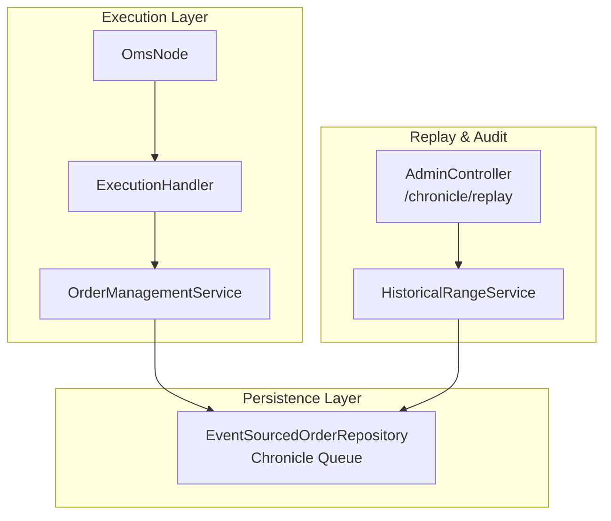
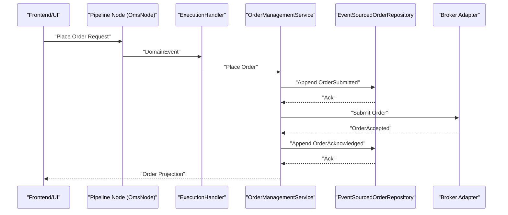
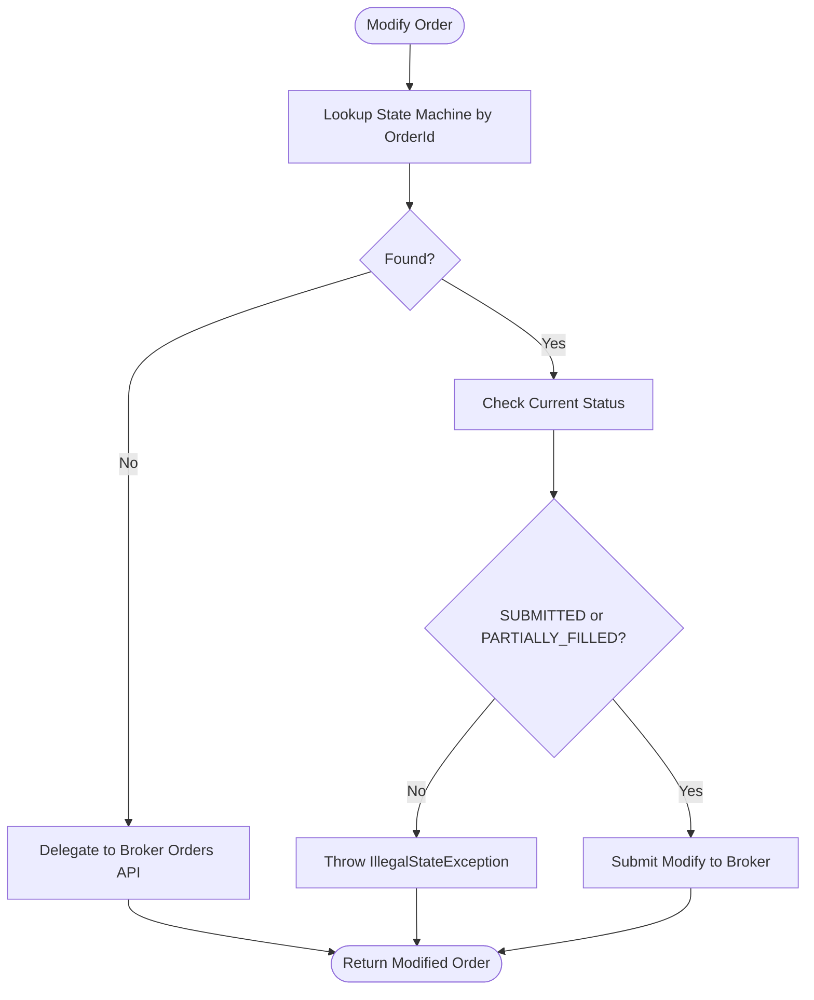
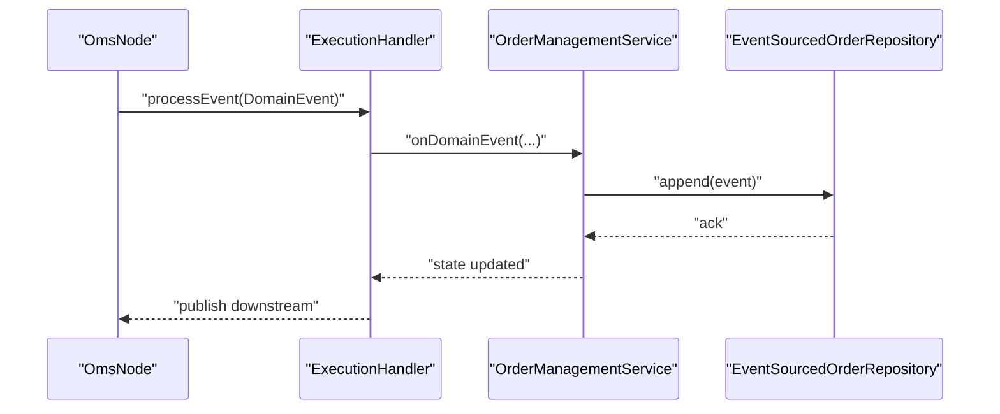
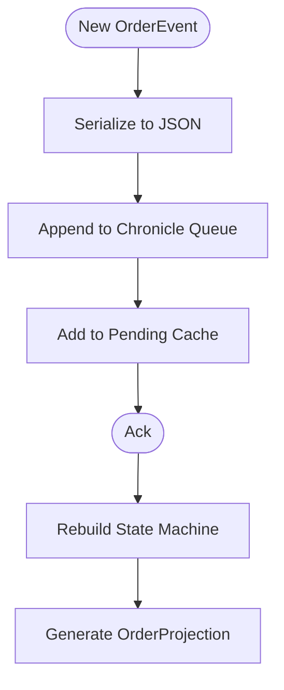
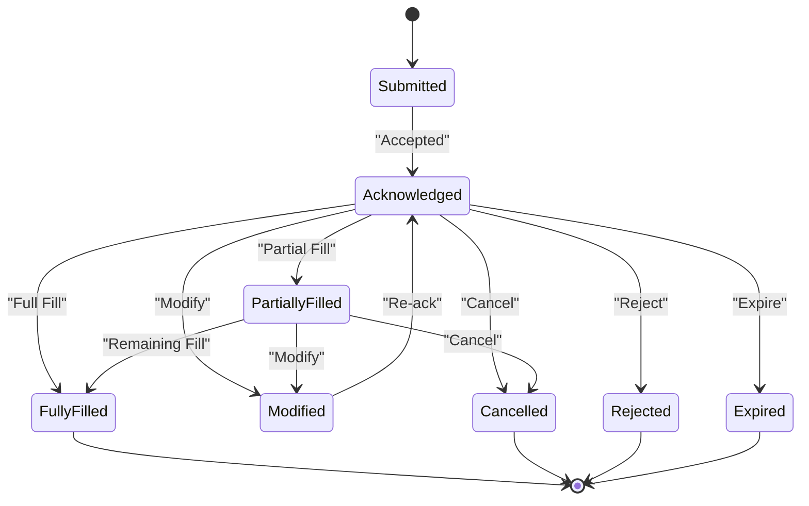
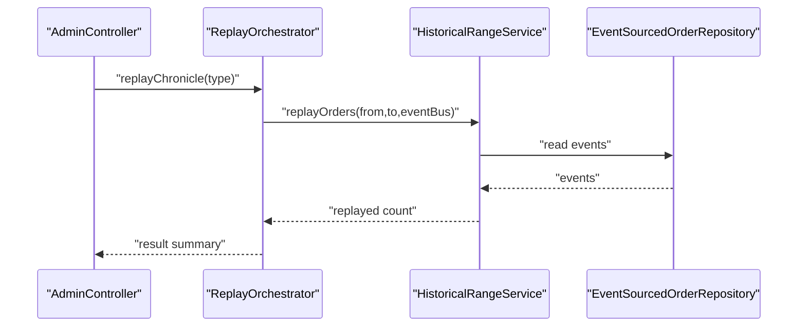
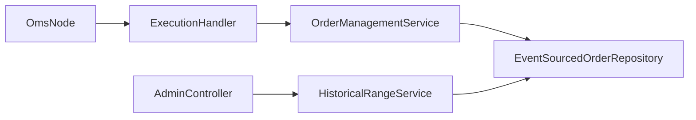

# Order Management System

<cite>
**Referenced Files in This Document**
- [OrderManagementService.java](file://trading/execution/src/main/java/com/tradej/execution/service/OrderManagementService.java)
- [OmsNode.java](file://trading/execution/src/main/java/com/tradej/execution/node/OmsNode.java)
- [ExecutionHandler.java](file://trading/execution/src/main/java/com/tradej/execution/service/ExecutionHandler.java)
- [EventSourcedOrderRepository.java](file://data/persistence/src/main/java/com/tradej/persistence/oms/EventSourcedOrderRepository.java)
- [OrderEventJournal.java](file://trading/execution/src/main/java/com/tradej/execution/journal/OrderEventJournal.java)
- [AdminController.java](file://app/src/main/java/com/tradej/app/admin/AdminController.java)
- [OrderReplayIntegrationTest.java](file://app/src/test/java/com/tradej/app/integration/OrderReplayIntegrationTest.java)
- [FillReplayIntegrationTest.java](file://app/src/test/java/com/tradej/app/integration/FillReplayIntegrationTest.java)
- [HistoricalRangeService.java](file://data/persistence/src/main/java/com/tradej/persistence/replay/HistoricalRangeService.java)
- [Trade-J-Architecture-Visual.html](file://docs/visuals/Trade-J-Architecture-Visual.html)
</cite>

## Table of Contents
1. [Introduction](#introduction)
2. [Project Structure](#project-structure)
3. [Core Components](#core-components)
4. [Architecture Overview](#architecture-overview)
5. [Detailed Component Analysis](#detailed-component-analysis)
6. [Dependency Analysis](#dependency-analysis)
7. [Performance Considerations](#performance-considerations)
8. [Troubleshooting Guide](#troubleshooting-guide)
9. [Conclusion](#conclusion)
10. [Appendices](#appendices)

## Introduction
This document describes the Order Management System (OMS) within the trading platform. It explains the complete order lifecycle from placement to completion, including state transitions, event sourcing, validation, persistence, replay, and audit. It documents the OrderManagementService architecture, ExecutionHandler coordination, and OMS node processing. It also covers order types, modifications, cancellations, partial fills, routing, broker-specific adaptations, and order tracking patterns. Practical examples and integration patterns with the broader trading system are included.

## Project Structure
The OMS spans several modules:
- Execution module: OrderManagementService, ExecutionHandler, OMS pipeline node
- Persistence module: Event-sourced order repository backed by Chronicle Queue
- Replay module: Historical range service and tests for replay scenarios
- Application module: Admin controller for audit replay and tests

**Diagram sources**
- [OrderManagementService.java:151-227](file://trading/execution/src/main/java/com/tradej/execution/service/OrderManagementService.java#L151-L227)
- [OmsNode.java:1-29](file://trading/execution/src/main/java/com/tradej/execution/node/OmsNode.java#L1-L29)
- [ExecutionHandler.java](file://trading/execution/src/main/java/com/tradej/execution/service/ExecutionHandler.java)
- [EventSourcedOrderRepository.java:56-86](file://data/persistence/src/main/java/com/tradej/persistence/oms/EventSourcedOrderRepository.java#L56-L86)
- [HistoricalRangeService.java:822-841](file://data/persistence/src/main/java/com/tradej/persistence/replay/HistoricalRangeService.java#L822-L841)
- [AdminController.java:459-487](file://app/src/main/java/com/tradej/app/admin/AdminController.java#L459-L487)

**Section sources**
- [OrderManagementService.java:151-227](file://trading/execution/src/main/java/com/tradej/execution/service/OrderManagementService.java#L151-L227)
- [OmsNode.java:1-29](file://trading/execution/src/main/java/com/tradej/execution/node/OmsNode.java#L1-L29)
- [EventSourcedOrderRepository.java:56-86](file://data/persistence/src/main/java/com/tradej/persistence/oms/EventSourcedOrderRepository.java#L56-L86)
- [HistoricalRangeService.java:822-841](file://data/persistence/src/main/java/com/tradej/persistence/replay/HistoricalRangeService.java#L822-L841)
- [AdminController.java:459-487](file://app/src/main/java/com/tradej/app/admin/AdminController.java#L459-L487)

## Core Components
- OrderManagementService: Central orchestrator for order placement, modification, cancellation, and state projections. Persists and replays events, maintains in-memory state machines, and coordinates with broker adapters.
- ExecutionHandler: Bridges domain events to OMS actions and executes broker commands for placement/modification/cancellation.
- OmsNode: Pipeline node wrapper delegating all order processing to ExecutionHandler.
- EventSourcedOrderRepository: Event store using Chronicle Queue, supports atomic append, rebuild, and replay.
- OrderEventJournal: In-memory journal of recent order events for quick lookup and audit.
- HistoricalRangeService: Provides replay of historical orders and fills for testing and audit.
- AdminController: Exposes administrative endpoints for replaying Chronicle audit trails.

**Section sources**
- [OrderManagementService.java:151-227](file://trading/execution/src/main/java/com/tradej/execution/service/OrderManagementService.java#L151-L227)
- [OmsNode.java:1-29](file://trading/execution/src/main/java/com/tradej/execution/node/OmsNode.java#L1-L29)
- [EventSourcedOrderRepository.java:56-86](file://data/persistence/src/main/java/com/tradej/persistence/oms/EventSourcedOrderRepository.java#L56-L86)
- [OrderEventJournal.java:28-48](file://trading/execution/src/main/java/com/tradej/execution/journal/OrderEventJournal.java#L28-L48)
- [HistoricalRangeService.java:822-841](file://data/persistence/src/main/java/com/tradej/persistence/replay/HistoricalRangeService.java#L822-L841)
- [AdminController.java:459-487](file://app/src/main/java/com/tradej/app/admin/AdminController.java#L459-L487)

## Architecture Overview
The OMS integrates with the broader trading pipeline and execution stack. Orders enter via the OMS pipeline node, which delegates to ExecutionHandler. ExecutionHandler interacts with OrderManagementService, which persists events and updates state machines. Events are stored in Chronicle Queue and can be replayed for reconstruction and audit.

**Diagram sources**
- [OmsNode.java:25-28](file://trading/execution/src/main/java/com/tradej/execution/node/OmsNode.java#L25-L28)
- [ExecutionHandler.java](file://trading/execution/src/main/java/com/tradej/execution/service/ExecutionHandler.java)
- [OrderManagementService.java:151-227](file://trading/execution/src/main/java/com/tradej/execution/service/OrderManagementService.java#L151-L227)
- [EventSourcedOrderRepository.java:56-86](file://data/persistence/src/main/java/com/tradej/persistence/oms/EventSourcedOrderRepository.java#L56-L86)

**Section sources**
- [Trade-J-Architecture-Visual.html:691-696](file://docs/visuals/Trade-J-Architecture-Visual.html#L691-L696)
- [OmsNode.java:1-29](file://trading/execution/src/main/java/com/tradej/execution/node/OmsNode.java#L1-L29)
- [OrderManagementService.java:151-227](file://trading/execution/src/main/java/com/tradej/execution/service/OrderManagementService.java#L151-L227)

## Detailed Component Analysis

### OrderManagementService
Responsibilities:
- Place, modify, cancel orders with state validation
- Maintain in-memory state machines keyed by order ID
- Persist events atomically and rebuild state on startup
- Provide order projections and active/completed order listings
- Handle broker callbacks and apply events to state machines

Key behaviors:
- Modification allowed only when order is SUBMITTED or PARTIALLY_FILLED
- Rebuilds state machines from persisted events on replayAll
- Applies broker events atomically via persistAndApply

**Diagram sources**
- [OrderManagementService.java:157-172](file://trading/execution/src/main/java/com/tradej/execution/service/OrderManagementService.java#L157-L172)

**Section sources**
- [OrderManagementService.java:151-227](file://trading/execution/src/main/java/com/tradej/execution/service/OrderManagementService.java#L151-L227)

### OmsNode and ExecutionHandler Coordination
- OmsNode wraps the OMS pipeline node and delegates all processing to ExecutionHandler
- ExecutionHandler receives domain events and routes them to OrderManagementService
- ExecutionHandler coordinates broker-specific adaptations and command dispatch

**Diagram sources**
- [OmsNode.java:25-28](file://trading/execution/src/main/java/com/tradej/execution/node/OmsNode.java#L25-L28)
- [ExecutionHandler.java](file://trading/execution/src/main/java/com/tradej/execution/service/ExecutionHandler.java)
- [OrderManagementService.java:210-212](file://trading/execution/src/main/java/com/tradej/execution/service/OrderManagementService.java#L210-L212)
- [EventSourcedOrderRepository.java:56-86](file://data/persistence/src/main/java/com/tradej/persistence/oms/EventSourcedOrderRepository.java#L56-L86)

**Section sources**
- [OmsNode.java:1-29](file://trading/execution/src/main/java/com/tradej/execution/node/OmsNode.java#L1-L29)
- [ExecutionHandler.java](file://trading/execution/src/main/java/com/tradej/execution/service/ExecutionHandler.java)

### Event Sourcing and Persistence
- EventSourcedOrderRepository writes events to Chronicle Queue and caches pending events per order
- Supports atomic appendAll and rebuilds state machines by replaying events
- Startup loads queue entries into memory, skipping corrupt entries with counters

**Diagram sources**
- [EventSourcedOrderRepository.java:56-86](file://data/persistence/src/main/java/com/tradej/persistence/oms/EventSourcedOrderRepository.java#L56-L86)
- [EventSourcedOrderRepository.java:166-190](file://data/persistence/src/main/java/com/tradej/persistence/oms/EventSourcedOrderRepository.java#L166-L190)

**Section sources**
- [EventSourcedOrderRepository.java:56-86](file://data/persistence/src/main/java/com/tradej/persistence/oms/EventSourcedOrderRepository.java#L56-L86)
- [EventSourcedOrderRepository.java:163-195](file://data/persistence/src/main/java/com/tradej/persistence/oms/EventSourcedOrderRepository.java#L163-L195)

### Order Lifecycle and State Transitions
Common lifecycle events include:
- Placement: OrderSubmitted → OrderAcknowledged
- Filling: OrderAcknowledged → OrderPartiallyFilled → OrderFullyFilled
- Modifications: OrderAcknowledged → OrderModified
- Cancellations: OrderAcknowledged → OrderCancelled
- Rejections: OrderSubmitted → OrderRejected
- Expirations: OrderSubmitted → OrderExpired

OrderEventJournal records recent events per order for quick retrieval and audit.

**Diagram sources**
- [OrderEventJournal.java:28-48](file://trading/execution/src/main/java/com/tradej/execution/journal/OrderEventJournal.java#L28-L48)

**Section sources**
- [OrderEventJournal.java:28-48](file://trading/execution/src/main/java/com/tradej/execution/journal/OrderEventJournal.java#L28-L48)

### Replay, Audit, and Historical Range
- HistoricalRangeService constructs synthetic fills and orders for replay testing
- Integration tests demonstrate partial fill distribution and trade reconstruction
- AdminController exposes /chronicle/replay endpoint to replay Chronicle audit trails

**Diagram sources**
- [AdminController.java:459-487](file://app/src/main/java/com/tradej/app/admin/AdminController.java#L459-L487)
- [HistoricalRangeService.java:822-841](file://data/persistence/src/main/java/com/tradej/persistence/replay/HistoricalRangeService.java#L822-L841)
- [EventSourcedOrderRepository.java:166-190](file://data/persistence/src/main/java/com/tradej/persistence/oms/EventSourcedOrderRepository.java#L166-L190)

**Section sources**
- [OrderReplayIntegrationTest.java:272-322](file://app/src/test/java/com/tradej/app/integration/OrderReplayIntegrationTest.java#L272-L322)
- [FillReplayIntegrationTest.java:256-277](file://app/src/test/java/com/tradej/app/integration/FillReplayIntegrationTest.java#L256-L277)
- [AdminController.java:459-487](file://app/src/main/java/com/tradej/app/admin/AdminController.java#L459-L487)

### Order Types, Routing, and Broker Adaptations
- Order types and product types are modeled in replay construction for synthetic orders
- Broker-specific adaptations occur in ExecutionHandler and broker adapters; OMS coordinates command dispatch
- Routing and execution are orchestrated through the pipeline node and ExecutionHandler

[No sources needed since this section provides general guidance]

## Dependency Analysis
- OmsNode depends on ExecutionHandler
- ExecutionHandler coordinates OrderManagementService and broker adapters
- OrderManagementService depends on EventSourcedOrderRepository for persistence
- HistoricalRangeService reads from EventSourcedOrderRepository for replay
- AdminController triggers replay orchestration

**Diagram sources**
- [OmsNode.java:1-29](file://trading/execution/src/main/java/com/tradej/execution/node/OmsNode.java#L1-L29)
- [ExecutionHandler.java](file://trading/execution/src/main/java/com/tradej/execution/service/ExecutionHandler.java)
- [OrderManagementService.java:151-227](file://trading/execution/src/main/java/com/tradej/execution/service/OrderManagementService.java#L151-L227)
- [EventSourcedOrderRepository.java:56-86](file://data/persistence/src/main/java/com/tradej/persistence/oms/EventSourcedOrderRepository.java#L56-L86)
- [HistoricalRangeService.java:822-841](file://data/persistence/src/main/java/com/tradej/persistence/replay/HistoricalRangeService.java#L822-L841)
- [AdminController.java:459-487](file://app/src/main/java/com/tradej/app/admin/AdminController.java#L459-L487)

**Section sources**
- [OmsNode.java:1-29](file://trading/execution/src/main/java/com/tradej/execution/node/OmsNode.java#L1-L29)
- [OrderManagementService.java:151-227](file://trading/execution/src/main/java/com/tradej/execution/service/OrderManagementService.java#L151-L227)
- [EventSourcedOrderRepository.java:56-86](file://data/persistence/src/main/java/com/tradej/persistence/oms/EventSourcedOrderRepository.java#L56-L86)
- [HistoricalRangeService.java:822-841](file://data/persistence/src/main/java/com/tradej/persistence/replay/HistoricalRangeService.java#L822-L841)
- [AdminController.java:459-487](file://app/src/main/java/com/tradej/app/admin/AdminController.java#L459-L487)

## Performance Considerations
- Event serialization/deserialization overhead is minimized by per-call appenders and concurrent hash maps
- Pending event caching reduces repeated disk reads during active order lifecycles
- Replay skips corrupt entries and counts them to maintain system stability
- In-memory state machines enable fast lookups and projections for active orders

[No sources needed since this section provides general guidance]

## Troubleshooting Guide
- Unknown order ID during modification: OMS logs a warning and delegates to broker orders API
- Non-modifiable order state: Throws an IllegalStateException with the current status
- Corrupt Chronicle entries: Startup logs and counts skipped entries; verify queue integrity
- Replay discrepancies: Use admin /chronicle/replay endpoint and verify replay counts and completeness

**Section sources**
- [OrderManagementService.java:157-172](file://trading/execution/src/main/java/com/tradej/execution/service/OrderManagementService.java#L157-L172)
- [EventSourcedOrderRepository.java:175-185](file://data/persistence/src/main/java/com/tradej/persistence/oms/EventSourcedOrderRepository.java#L175-L185)
- [AdminController.java:459-487](file://app/src/main/java/com/tradej/app/admin/AdminController.java#L459-L487)

## Conclusion
The Order Management System provides a robust, event-sourced order lifecycle with strong persistence, replay, and audit capabilities. OrderManagementService centralizes order operations, ExecutionHandler coordinates broker interactions, and OmsNode integrates seamlessly into the pipeline. The system supports order modifications, cancellations, partial fills, and comprehensive replay for verification and auditing.

## Appendices

### Practical Examples and Integration Patterns
- Placing an order: OmsNode → ExecutionHandler → OrderManagementService → EventSourcedOrderRepository → Broker
- Modifying an order: OrderManagementService validates state and delegates to broker orders API
- Replay audit: AdminController /chronicle/replay → HistoricalRangeService → EventSourcedOrderRepository → Replay Orchestration

**Section sources**
- [OmsNode.java:25-28](file://trading/execution/src/main/java/com/tradej/execution/node/OmsNode.java#L25-L28)
- [OrderManagementService.java:157-172](file://trading/execution/src/main/java/com/tradej/execution/service/OrderManagementService.java#L157-L172)
- [HistoricalRangeService.java:822-841](file://data/persistence/src/main/java/com/tradej/persistence/replay/HistoricalRangeService.java#L822-L841)
- [AdminController.java:459-487](file://app/src/main/java/com/tradej/app/admin/AdminController.java#L459-L487)