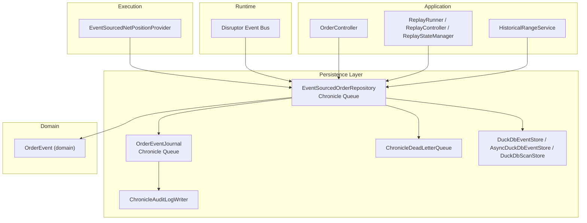
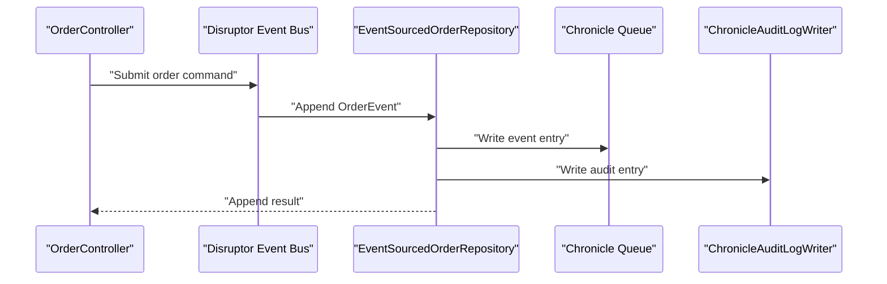
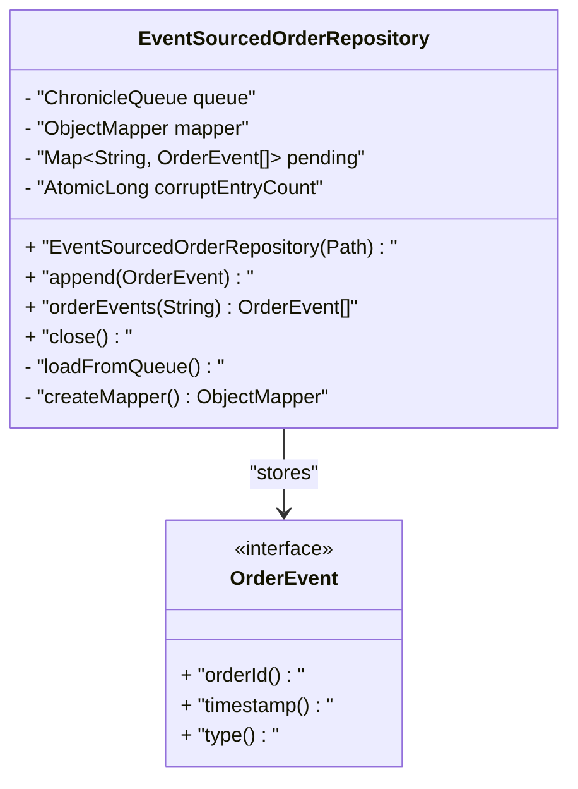
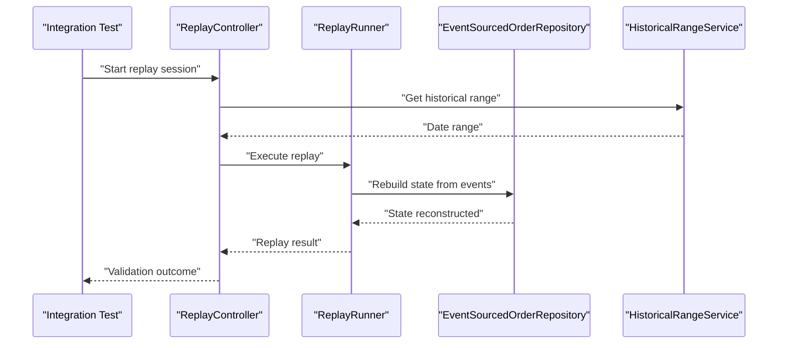
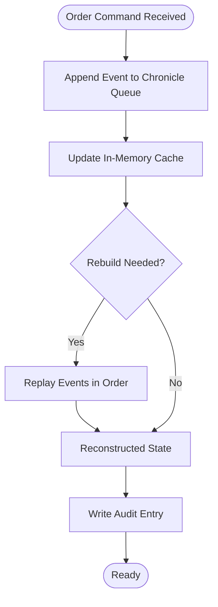
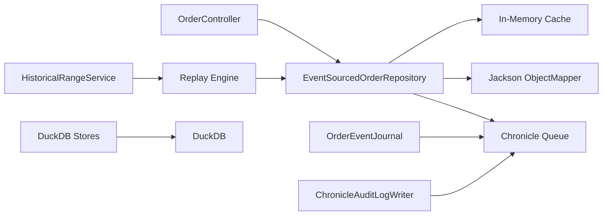

# Order Persistence

<cite>
**Referenced Files in This Document**
- [EventSourcedOrderRepository.java](file://data/persistence/src/main/java/com/tradej/persistence/oms/EventSourcedOrderRepository.java)
- [EventSourcedOrderRepositoryTest.java](file://data/persistence/src/test/java/com/tradej/persistence/oms/EventSourcedOrderRepositoryTest.java)
- [EventSourcedOrderRepositoryStressTest.java](file://data/persistence/src/test/java/com/tradej/persistence/oms/EventSourcedOrderRepositoryStressTest.java)
- [OrderEvent.java](file://core/src/main/java/com/tradej/core/domain/oms/OrderEvent.java)
- [OrderEventJournal.java](file://trading/execution/src/main/java/com/tradej/execution/journal/OrderEventJournal.java)
- [ChronicleAuditLogWriter.java](file://data/persistence/src/main/java/com/tradej/persistence/chronicle/ChronicleAuditLogWriter.java)
- [ChronicleDeadLetterQueue.java](file://data/persistence/src/main/java/com/tradej/persistence/chronicle/ChronicleDeadLetterQueue.java)
- [OrderController.java](file://app/src/main/java/com/tradej/app/api/OrderController.java)
- [OrderReplayIntegrationTest.java](file://app/src/test/java/com/tradej/app/integration/OrderReplayIntegrationTest.java)
- [ChronicleReplayParityIntegrationTest.java](file://app/src/test/java/com/tradej/app/integration/ChronicleReplayParityIntegrationTest.java)
- [ReplayRunner.java](file://replay/engine/src/main/java/com/tradej/replay/engine/ReplayRunner.java)
- [ReplayController.java](file://replay/engine/src/main/java/com/tradej/replay/engine/ReplayController.java)
- [ReplayStateManager.java](file://replay/engine/src/main/java/com/tradej/replay/engine/ReplayStateManager.java)
- [HistoricalRangeService.java](file://data/persistence/src/main/java/com/tradej/persistence/replay/HistoricalRangeService.java)
- [DuckDbEventStore.java](file://data/persistence/src/main/java/com/tradej/persistence/duckdb/DuckDbEventStore.java)
- [AsyncDuckDbEventStore.java](file://data/persistence/src/main/java/com/tradej/persistence/duckdb/AsyncDuckDbEventStore.java)
- [DuckDbScanStore.java](file://data/persistence/src/main/java/com/tradej/persistence/duckdb/DuckDbScanStore.java)
</cite>

## Table of Contents
1. [Introduction](#introduction)
2. [Project Structure](#project-structure)
3. [Core Components](#core-components)
4. [Architecture Overview](#architecture-overview)
5. [Detailed Component Analysis](#detailed-component-analysis)
6. [Dependency Analysis](#dependency-analysis)
7. [Performance Considerations](#performance-considerations)
8. [Troubleshooting Guide](#troubleshooting-guide)
9. [Conclusion](#conclusion)
10. [Appendices](#appendices)

## Introduction
This document describes the Order Persistence system with a focus on event sourcing for order lifecycle tracking. It explains how order events are stored, replayed, and used to reconstruct order state incrementally. It documents the EventSourcedOrderRepository architecture, append-only event logging, replay mechanisms, snapshot capabilities, and recovery procedures. It also covers performance characteristics, query patterns for order history, integration with the disruptor event bus, and data integrity guarantees for audit trails and compliance.

## Project Structure
The Order Persistence system spans several modules:
- data/persistence: Event stores, replay infrastructure, and auxiliary Chronicle utilities
- core: Domain models and event abstractions
- trading/execution: Journaling and position providers
- app: API surface for order operations and integration tests
- replay/engine: Replay orchestration and state management
- runtime/disruptor: Event bus integration for high-throughput order processing

**Diagram sources**
- [EventSourcedOrderRepository.java](file://data/persistence/src/main/java/com/tradej/persistence/oms/EventSourcedOrderRepository.java)
- [OrderEventJournal.java](file://trading/execution/src/main/java/com/tradej/execution/journal/OrderEventJournal.java)
- [ChronicleAuditLogWriter.java](file://data/persistence/src/main/java/com/tradej/persistence/chronicle/ChronicleAuditLogWriter.java)
- [ChronicleDeadLetterQueue.java](file://data/persistence/src/main/java/com/tradej/persistence/chronicle/ChronicleDeadLetterQueue.java)
- [DuckDbEventStore.java](file://data/persistence/src/main/java/com/tradej/persistence/duckdb/DuckDbEventStore.java)
- [AsyncDuckDbEventStore.java](file://data/persistence/src/main/java/com/tradej/persistence/duckdb/AsyncDuckDbEventStore.java)
- [DuckDbScanStore.java](file://data/persistence/src/main/java/com/tradej/persistence/duckdb/DuckDbScanStore.java)
- [OrderEvent.java](file://core/src/main/java/com/tradej/core/domain/oms/OrderEvent.java)
- [EventSourcedNetPositionProvider.java](file://trading/execution/src/main/java/com/tradej/execution/position/EventSourcedNetPositionProvider.java)
- [OrderController.java](file://app/src/main/java/com/tradej/app/api/OrderController.java)
- [ReplayRunner.java](file://replay/engine/src/main/java/com/tradej/replay/engine/ReplayRunner.java)
- [ReplayController.java](file://replay/engine/src/main/java/com/tradej/replay/engine/ReplayController.java)
- [ReplayStateManager.java](file://replay/engine/src/main/java/com/tradej/replay/engine/ReplayStateManager.java)
- [HistoricalRangeService.java](file://data/persistence/src/main/java/com/tradej/persistence/replay/HistoricalRangeService.java)

**Section sources**
- [EventSourcedOrderRepository.java:41-54](file://data/persistence/src/main/java/com/tradej/persistence/oms/EventSourcedOrderRepository.java#L41-L54)
- [OrderEvent.java](file://core/src/main/java/com/tradej/core/domain/oms/OrderEvent.java)

## Core Components
- EventSourcedOrderRepository: Append-only event storage using Chronicle Queue, in-memory caching for fast rebuild, and JSON serialization via Jackson. It loads existing events on startup and exposes methods to append events and retrieve order event lists.
- OrderEventJournal: Separate Chronicle-backed journal for order events, supporting audit and replay.
- ChronicleAuditLogWriter: Writes audit entries to Chronicle Queue for compliance and traceability.
- ChronicleDeadLetterQueue: Dead-letter handling for failed event writes.
- DuckDbEventStore and AsyncDuckDbEventStore: Persistent event store backed by DuckDB for analytics and historical queries.
- DuckDbScanStore: Scanning and range-query support for historical data.
- Replay infrastructure: ReplayRunner, ReplayController, ReplayStateManager orchestrate replay sessions and state reconstruction.
- HistoricalRangeService: Provides historical date/time ranges for replay and analytics.
- EventSourcedNetPositionProvider: Demonstrates event-sourced state reconstruction for positions.

**Section sources**
- [EventSourcedOrderRepository.java:41-54](file://data/persistence/src/main/java/com/tradej/persistence/oms/EventSourcedOrderRepository.java#L41-L54)
- [OrderEventJournal.java](file://trading/execution/src/main/java/com/tradej/execution/journal/OrderEventJournal.java)
- [ChronicleAuditLogWriter.java](file://data/persistence/src/main/java/com/tradej/persistence/chronicle/ChronicleAuditLogWriter.java)
- [ChronicleDeadLetterQueue.java](file://data/persistence/src/main/java/com/tradej/persistence/chronicle/ChronicleDeadLetterQueue.java)
- [DuckDbEventStore.java](file://data/persistence/src/main/java/com/tradej/persistence/duckdb/DuckDbEventStore.java)
- [AsyncDuckDbEventStore.java](file://data/persistence/src/main/java/com/tradej/persistence/duckdb/AsyncDuckDbEventStore.java)
- [DuckDbScanStore.java](file://data/persistence/src/main/java/com/tradej/persistence/duckdb/DuckDbScanStore.java)
- [ReplayRunner.java](file://replay/engine/src/main/java/com/tradej/replay/engine/ReplayRunner.java)
- [ReplayController.java](file://replay/engine/src/main/java/com/tradej/replay/engine/ReplayController.java)
- [ReplayStateManager.java](file://replay/engine/src/main/java/com/tradej/replay/engine/ReplayStateManager.java)
- [HistoricalRangeService.java](file://data/persistence/src/main/java/com/tradej/persistence/replay/HistoricalRangeService.java)

## Architecture Overview
The Order Persistence system follows an event-sourcing pattern:
- Events are appended to a Chronicle Queue in write order.
- An in-memory cache groups events per order ID for fast rebuild.
- State is reconstructed by replaying events in sequence.
- Audit and compliance are supported via a dedicated audit log writer.
- Historical analytics leverage DuckDB-backed stores.
- Replay subsystem reconstructs historical states for validation and debugging.

**Diagram sources**
- [OrderController.java](file://app/src/main/java/com/tradej/app/api/OrderController.java)
- [EventSourcedOrderRepository.java](file://data/persistence/src/main/java/com/tradej/persistence/oms/EventSourcedOrderRepository.java)
- [ChronicleAuditLogWriter.java](file://data/persistence/src/main/java/com/tradej/persistence/chronicle/ChronicleAuditLogWriter.java)

## Detailed Component Analysis

### EventSourcedOrderRepository
Responsibilities:
- Append order events to an append-only journal (Chronicle Queue)
- Maintain in-memory cache keyed by order ID for fast event retrieval
- Deserialize events on startup and populate cache
- Expose order events for replay and state reconstruction
- Track corruption counters for diagnostics

Key behaviors:
- Initialization loads existing entries and populates the in-memory cache
- Append operation serializes and writes events to the queue
- Retrieval returns cached event lists per order ID
- Concurrency tests demonstrate safe concurrent appends across threads

**Diagram sources**
- [EventSourcedOrderRepository.java:41-54](file://data/persistence/src/main/java/com/tradej/persistence/oms/EventSourcedOrderRepository.java#L41-L54)
- [OrderEvent.java](file://core/src/main/java/com/tradej/core/domain/oms/OrderEvent.java)

**Section sources**
- [EventSourcedOrderRepository.java:41-54](file://data/persistence/src/main/java/com/tradej/persistence/oms/EventSourcedOrderRepository.java#L41-L54)
- [EventSourcedOrderRepositoryTest.java:33-36](file://data/persistence/src/test/java/com/tradej/persistence/oms/EventSourcedOrderRepositoryTest.java#L33-L36)
- [EventSourcedOrderRepositoryStressTest.java:27-46](file://data/persistence/src/test/java/com/tradej/persistence/oms/EventSourcedOrderRepositoryStressTest.java#L27-L46)

### OrderEventJournal
Responsibilities:
- Maintain a separate Chronicle-backed journal for order events
- Support replay and audit workflows
- Decouple event storage from other persistence concerns

Integration:
- Works alongside EventSourcedOrderRepository for audit and replay
- Used by replay engine components for historical reconstruction

**Section sources**
- [OrderEventJournal.java](file://trading/execution/src/main/java/com/tradej/execution/journal/OrderEventJournal.java)

### ChronicleAuditLogWriter
Responsibilities:
- Write audit entries to a Chronicle Queue for compliance and traceability
- Provide immutable audit trail for regulatory and internal audits

**Section sources**
- [ChronicleAuditLogWriter.java](file://data/persistence/src/main/java/com/tradej/persistence/chronicle/ChronicleAuditLogWriter.java)

### ChronicleDeadLetterQueue
Responsibilities:
- Capture failed event writes for later inspection and retry
- Maintain system reliability under transient failures

**Section sources**
- [ChronicleDeadLetterQueue.java](file://data/persistence/src/main/java/com/tradej/persistence/chronicle/ChronicleDeadLetterQueue.java)

### DuckDB Event Stores
Responsibilities:
- Persist events and enable analytical queries over time ranges
- Provide asynchronous event ingestion for high throughput
- Support scanning and range queries for historical analysis

**Section sources**
- [DuckDbEventStore.java](file://data/persistence/src/main/java/com/tradej/persistence/duckdb/DuckDbEventStore.java)
- [AsyncDuckDbEventStore.java](file://data/persistence/src/main/java/com/tradej/persistence/duckdb/AsyncDuckDbEventStore.java)
- [DuckDbScanStore.java](file://data/persistence/src/main/java/com/tradej/persistence/duckdb/DuckDbScanStore.java)

### Replay Infrastructure
Components:
- ReplayRunner: Executes replay sessions against historical data
- ReplayController: Orchestrates replay lifecycle and coordination
- ReplayStateManager: Manages state during replay for validation and verification

**Diagram sources**
- [OrderReplayIntegrationTest.java](file://app/src/test/java/com/tradej/app/integration/OrderReplayIntegrationTest.java)
- [ChronicleReplayParityIntegrationTest.java](file://app/src/test/java/com/tradej/app/integration/ChronicleReplayParityIntegrationTest.java)
- [ReplayRunner.java](file://replay/engine/src/main/java/com/tradej/replay/engine/ReplayRunner.java)
- [ReplayController.java](file://replay/engine/src/main/java/com/tradej/replay/engine/ReplayController.java)
- [ReplayStateManager.java](file://replay/engine/src/main/java/com/tradej/replay/engine/ReplayStateManager.java)
- [HistoricalRangeService.java](file://data/persistence/src/main/java/com/tradej/persistence/replay/HistoricalRangeService.java)

**Section sources**
- [ReplayRunner.java](file://replay/engine/src/main/java/com/tradej/replay/engine/ReplayRunner.java)
- [ReplayController.java](file://replay/engine/src/main/java/com/tradej/replay/engine/ReplayController.java)
- [ReplayStateManager.java](file://replay/engine/src/main/java/com/tradej/replay/engine/ReplayStateManager.java)
- [HistoricalRangeService.java](file://data/persistence/src/main/java/com/tradej/persistence/replay/HistoricalRangeService.java)

### Event Sourcing Workflow

**Diagram sources**
- [EventSourcedOrderRepository.java](file://data/persistence/src/main/java/com/tradej/persistence/oms/EventSourcedOrderRepository.java)
- [OrderEventJournal.java](file://trading/execution/src/main/java/com/tradej/execution/journal/OrderEventJournal.java)
- [ChronicleAuditLogWriter.java](file://data/persistence/src/main/java/com/tradej/persistence/chronicle/ChronicleAuditLogWriter.java)

## Dependency Analysis
- EventSourcedOrderRepository depends on:
  - Chronicle Queue for append-only storage
  - Jackson ObjectMapper for JSON serialization
  - In-memory cache for fast access
- OrderEventJournal and AuditLogWriter depend on Chronicle Queue
- DuckDB stores depend on DuckDB connectivity and schema
- Replay subsystem depends on HistoricalRangeService and EventSourcedOrderRepository
- Application controller integrates with the event bus and repository

**Diagram sources**
- [EventSourcedOrderRepository.java](file://data/persistence/src/main/java/com/tradej/persistence/oms/EventSourcedOrderRepository.java)
- [OrderEventJournal.java](file://trading/execution/src/main/java/com/tradej/execution/journal/OrderEventJournal.java)
- [ChronicleAuditLogWriter.java](file://data/persistence/src/main/java/com/tradej/persistence/chronicle/ChronicleAuditLogWriter.java)
- [DuckDbEventStore.java](file://data/persistence/src/main/java/com/tradej/persistence/duckdb/DuckDbEventStore.java)
- [AsyncDuckDbEventStore.java](file://data/persistence/src/main/java/com/tradej/persistence/duckdb/AsyncDuckDbEventStore.java)
- [DuckDbScanStore.java](file://data/persistence/src/main/java/com/tradej/persistence/duckdb/DuckDbScanStore.java)
- [ReplayRunner.java](file://replay/engine/src/main/java/com/tradej/replay/engine/ReplayRunner.java)
- [HistoricalRangeService.java](file://data/persistence/src/main/java/com/tradej/persistence/replay/HistoricalRangeService.java)

**Section sources**
- [EventSourcedOrderRepository.java:41-54](file://data/persistence/src/main/java/com/tradej/persistence/oms/EventSourcedOrderRepository.java#L41-L54)
- [OrderEventJournal.java](file://trading/execution/src/main/java/com/tradej/execution/journal/OrderEventJournal.java)
- [DuckDbEventStore.java](file://data/persistence/src/main/java/com/tradej/persistence/duckdb/DuckDbEventStore.java)
- [ReplayRunner.java](file://replay/engine/src/main/java/com/tradej/replay/engine/ReplayRunner.java)

## Performance Considerations
- Append-only design: Minimizes write contention and supports high-throughput ingestion
- In-memory cache: Reduces disk reads for frequent queries by order ID
- Asynchronous ingestion: DuckDB async store enables non-blocking writes for analytics
- Batched reads: Replay subsystem leverages chronological ordering for efficient reconstruction
- Serialization overhead: Jackson-based JSON serialization should be monitored for large event volumes
- Disk I/O: Chronicle Queue performance scales with queue segment sizing and disk throughput
- Memory footprint: Cache growth proportional to number of active orders; consider eviction policies if needed

[No sources needed since this section provides general guidance]

## Troubleshooting Guide
Common issues and remedies:
- Corrupted entries: Repository tracks corruption counts; inspect queue segments and re-index as needed
- Dead-letter events: Use dead letter queue for failed writes to diagnose and retry
- Audit gaps: Verify audit log writer is enabled and queue availability
- Replay mismatches: Compare reconstructed state with expected outcomes using replay controller and runner
- Historical queries: Validate DuckDB store connectivity and schema alignment

**Section sources**
- [EventSourcedOrderRepository.java:47-48](file://data/persistence/src/main/java/com/tradej/persistence/oms/EventSourcedOrderRepository.java#L47-L48)
- [ChronicleDeadLetterQueue.java](file://data/persistence/src/main/java/com/tradej/persistence/chronicle/ChronicleDeadLetterQueue.java)
- [ChronicleAuditLogWriter.java](file://data/persistence/src/main/java/com/tradej/persistence/chronicle/ChronicleAuditLogWriter.java)
- [ReplayController.java](file://replay/engine/src/main/java/com/tradej/replay/engine/ReplayController.java)
- [ReplayRunner.java](file://replay/engine/src/main/java/com/tradej/replay/engine/ReplayRunner.java)

## Conclusion
The Order Persistence system employs event sourcing with Chronicle Queue for high-performance, append-only event storage and in-memory caching for fast state reconstruction. The design supports robust replay, audit, and analytics through dedicated journals and DuckDB stores. Replay infrastructure ensures historical parity and validation, while dead-letter handling and audit logging provide reliability and compliance. Together, these components deliver a scalable, auditable, and replayable order lifecycle persistence solution.

[No sources needed since this section summarizes without analyzing specific files]

## Appendices

### Compliance and Audit Trail
- Immutable event logs enable audit trails for regulatory compliance
- Dedicated audit writer ensures non-repudiation of events
- Replay subsystem validates historical state reconstruction for audit parity

**Section sources**
- [ChronicleAuditLogWriter.java](file://data/persistence/src/main/java/com/tradej/persistence/chronicle/ChronicleAuditLogWriter.java)
- [OrderReplayIntegrationTest.java](file://app/src/test/java/com/tradej/app/integration/OrderReplayIntegrationTest.java)
- [ChronicleReplayParityIntegrationTest.java](file://app/src/test/java/com/tradej/app/integration/ChronicleReplayParityIntegrationTest.java)

### Query Patterns for Order History
- Chronological retrieval by order ID from in-memory cache and queue
- DuckDB-backed range queries for historical analytics
- Replay-based reconstruction for validation and debugging

**Section sources**
- [EventSourcedOrderRepository.java](file://data/persistence/src/main/java/com/tradej/persistence/oms/EventSourcedOrderRepository.java)
- [DuckDbScanStore.java](file://data/persistence/src/main/java/com/tradej/persistence/duckdb/DuckDbScanStore.java)
- [HistoricalRangeService.java](file://data/persistence/src/main/java/com/tradej/persistence/replay/HistoricalRangeService.java)