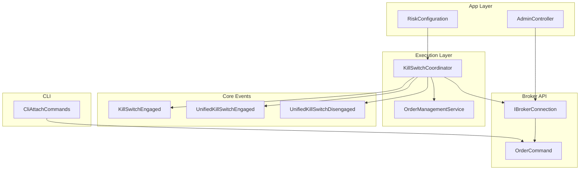
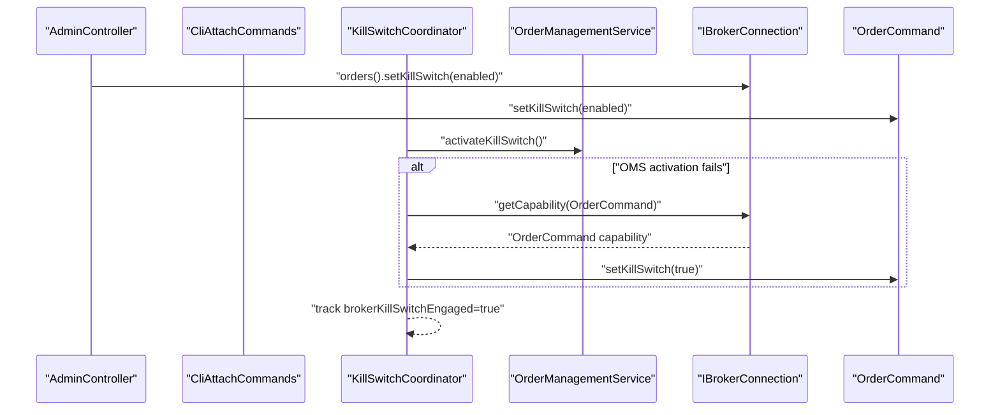
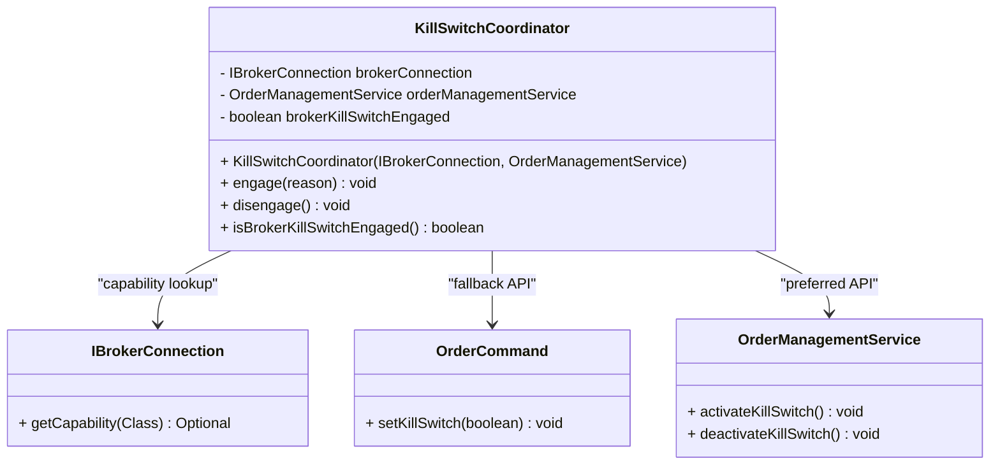
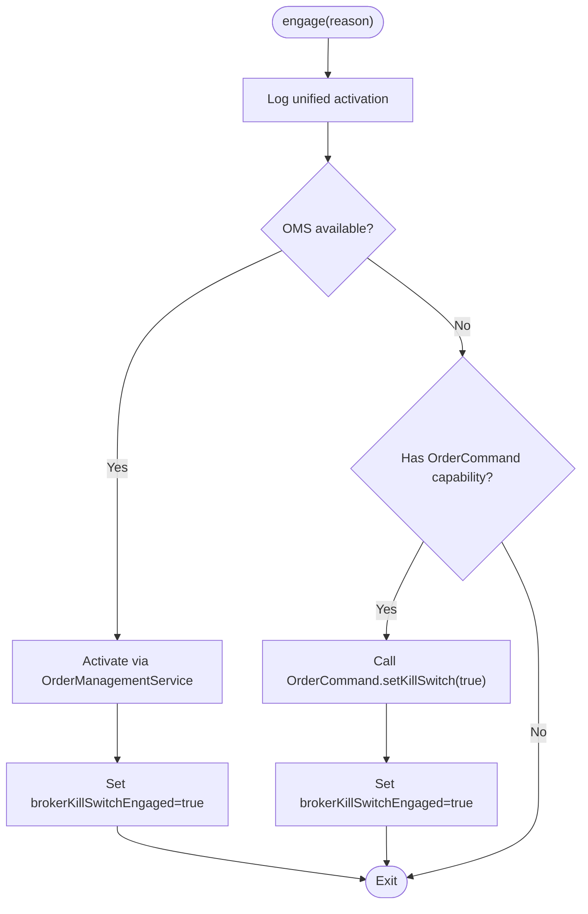
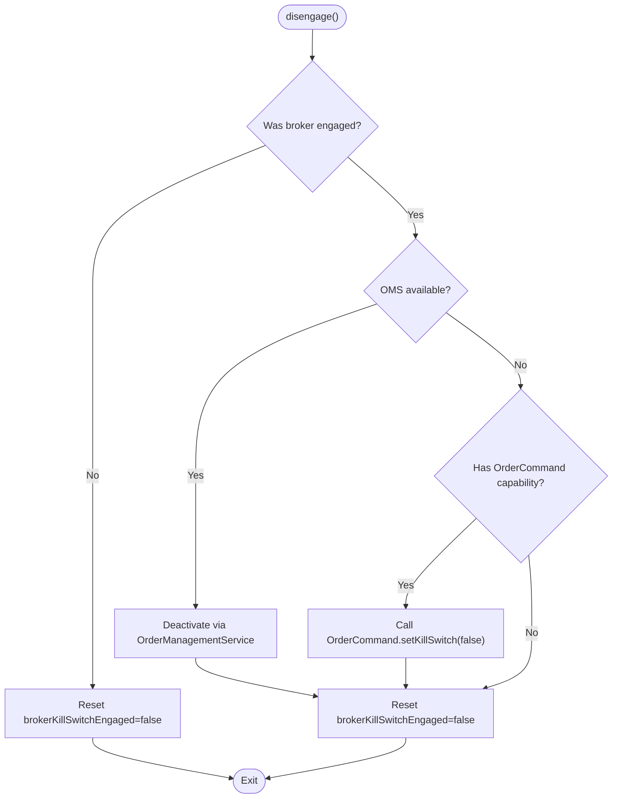
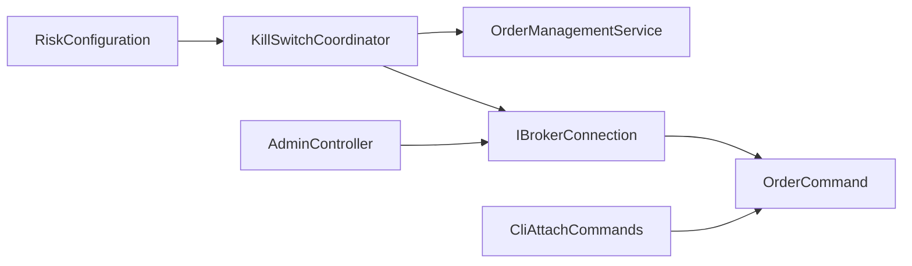

# Kill Switch Coordination

<cite>
**Referenced Files in This Document**
- [KillSwitchCoordinator.java](file://trading/execution/src/main/java/com/tradej/execution/risk/KillSwitchCoordinator.java)
- [KillSwitchEngaged.java](file://core/src/main/java/com/tradej/core/domain/event/KillSwitchEngaged.java)
- [UnifiedKillSwitchEngaged.java](file://core/src/main/java/com/tradej/core/domain/event/UnifiedKillSwitchEngaged.java)
- [UnifiedKillSwitchDisengaged.java](file://core/src/main/java/com/tradej/core/domain/event/UnifiedKillSwitchDisengaged.java)
- [OrderManagementService.java](file://trading/execution/src/main/java/com/tradej/execution/service/OrderManagementService.java)
- [IBrokerConnection.java](file://broker/api/src/main/java/com/tradej/broker/api/IBrokerConnection.java)
- [OrderCommand.java](file://broker/api/src/main/java/com/tradej/broker/api/port/OrderCommand.java)
- [RiskConfiguration.java](file://app/src/main/java/com/tradej/app/config/RiskConfiguration.java)
- [AdminController.java](file://app/src/main/java/com/tradej/app/admin/AdminController.java)
- [DhanKillSwitchIntegrationTest.java](file://app/src/test/java/com/tradej/app/integration/DhanKillSwitchIntegrationTest.java)
- [KillSwitchE2EComponentTest.java](file://app/src/test/java/com/tradej/app/integration/KillSwitchE2EComponentTest.java)
- [CliAttachCommands.java](file://cli/src/main/java/com/tradej/cli/command/CliAttachCommands.java)
</cite>

## Table of Contents
1. [Introduction](#introduction)
2. [Project Structure](#project-structure)
3. [Core Components](#core-components)
4. [Architecture Overview](#architecture-overview)
5. [Detailed Component Analysis](#detailed-component-analysis)
6. [Dependency Analysis](#dependency-analysis)
7. [Performance Considerations](#performance-considerations)
8. [Troubleshooting Guide](#troubleshooting-guide)
9. [Conclusion](#conclusion)

## Introduction
This document describes the Kill Switch Coordination system that synchronizes platform-wide kill switch activation with broker-side kill switch APIs. It explains the unified kill switch activation flow, broker integration patterns, coordinated shutdown procedures, engagement/disengagement logic, capability detection, fallback mechanisms, state management, event propagation, recovery procedures, escalation and manual override capabilities, and practical scenarios for activation and deactivation.

## Project Structure
The Kill Switch Coordination spans several modules:
- Execution module: KillSwitchCoordinator orchestrates kill switch state and integrates with OrderManagementService and broker capabilities.
- Core module: Domain events represent kill switch state transitions for cross-system visibility.
- App module: Configuration wires the coordinator, admin endpoints toggle kill switches, and tests validate end-to-end behavior.
- Broker API module: Defines broker connection and order command capabilities used by the coordinator.
- CLI module: Provides manual override commands for kill switch control.

**Diagram sources**
- [KillSwitchCoordinator.java:12-72](file://trading/execution/src/main/java/com/tradej/execution/risk/KillSwitchCoordinator.java#L12-L72)
- [OrderManagementService.java](file://trading/execution/src/main/java/com/tradej/execution/service/OrderManagementService.java)
- [IBrokerConnection.java](file://broker/api/src/main/java/com/tradej/broker/api/IBrokerConnection.java)
- [OrderCommand.java](file://broker/api/src/main/java/com/tradej/broker/api/port/OrderCommand.java)
- [RiskConfiguration.java:62-77](file://app/src/main/java/com/tradej/app/config/RiskConfiguration.java#L62-L77)
- [AdminController.java:103-106](file://app/src/main/java/com/tradej/app/admin/AdminController.java#L103-L106)
- [CliAttachCommands.java:96-106](file://cli/src/main/java/com/tradej/cli/command/CliAttachCommands.java#L96-L106)
- [KillSwitchEngaged.java](file://core/src/main/java/com/tradej/core/domain/event/KillSwitchEngaged.java)
- [UnifiedKillSwitchEngaged.java](file://core/src/main/java/com/tradej/core/domain/event/UnifiedKillSwitchEngaged.java)
- [UnifiedKillSwitchDisengaged.java](file://core/src/main/java/com/tradej/core/domain/event/UnifiedKillSwitchDisengaged.java)

**Section sources**
- [KillSwitchCoordinator.java:12-72](file://trading/execution/src/main/java/com/tradej/execution/risk/KillSwitchCoordinator.java#L12-L72)
- [RiskConfiguration.java:62-77](file://app/src/main/java/com/tradej/app/config/RiskConfiguration.java#L62-L77)

## Core Components
- KillSwitchCoordinator: Central component that activates/deactivates kill switches via OrderManagementService or broker OrderCommand capabilities, tracks broker-side engagement state, and logs outcomes.
- OrderManagementService: Provides platform kill switch activation/deactivation APIs.
- IBrokerConnection and OrderCommand: Broker abstraction and order command capability used to set kill switches on supported brokers.
- Core Events: KillSwitchEngaged, UnifiedKillSwitchEngaged, UnifiedKillSwitchDisengaged represent kill switch state transitions propagated across the system.
- RiskConfiguration: Wires KillSwitchCoordinator into the application context.
- AdminController: Exposes admin endpoint to toggle kill switches via broker OrderCommand.
- CliAttachCommands: Provides CLI command to manually enable/disable kill switches in standalone mode.

Key responsibilities:
- Unified activation: Prefer OMS activation; fallback to broker OrderCommand when OMS is unavailable.
- State tracking: Tracks whether a broker kill switch was engaged to ensure proper disengagement.
- Event propagation: Produces domain events indicating kill switch state changes.
- Recovery: On failure during activation, logs warnings and continues; disengagement attempts broker-side cleanup.

**Section sources**
- [KillSwitchCoordinator.java:28-67](file://trading/execution/src/main/java/com/tradej/execution/risk/KillSwitchCoordinator.java#L28-L67)
- [OrderManagementService.java](file://trading/execution/src/main/java/com/tradej/execution/service/OrderManagementService.java)
- [IBrokerConnection.java](file://broker/api/src/main/java/com/tradej/broker/api/IBrokerConnection.java)
- [OrderCommand.java](file://broker/api/src/main/java/com/tradej/broker/api/port/OrderCommand.java)
- [KillSwitchEngaged.java](file://core/src/main/java/com/tradej/core/domain/event/KillSwitchEngaged.java)
- [UnifiedKillSwitchEngaged.java](file://core/src/main/java/com/tradej/core/domain/event/UnifiedKillSwitchEngaged.java)
- [UnifiedKillSwitchDisengaged.java](file://core/src/main/java/com/tradej/core/domain/event/UnifiedKillSwitchDisengaged.java)
- [RiskConfiguration.java:62-77](file://app/src/main/java/com/tradej/app/config/RiskConfiguration.java#L62-L77)
- [AdminController.java:103-106](file://app/src/main/java/com/tradej/app/admin/AdminController.java#L103-L106)
- [CliAttachCommands.java:96-106](file://cli/src/main/java/com/tradej/cli/command/CliAttachCommands.java#L96-L106)

## Architecture Overview
The Kill Switch Coordination system follows a layered pattern:
- Application wiring (RiskConfiguration) instantiates KillSwitchCoordinator with dependencies.
- AdminController and CLI commands trigger kill switch operations against broker OrderCommand.
- KillSwitchCoordinator prefers OrderManagementService for activation; otherwise uses broker OrderCommand capability.
- Core events propagate kill switch state changes for observability and downstream consumers.

**Diagram sources**
- [AdminController.java:103-106](file://app/src/main/java/com/tradej/app/admin/AdminController.java#L103-L106)
- [CliAttachCommands.java:96-106](file://cli/src/main/java/com/tradej/cli/command/CliAttachCommands.java#L96-L106)
- [KillSwitchCoordinator.java:28-47](file://trading/execution/src/main/java/com/tradej/execution/risk/KillSwitchCoordinator.java#L28-L47)
- [IBrokerConnection.java](file://broker/api/src/main/java/com/tradej/broker/api/IBrokerConnection.java)
- [OrderCommand.java](file://broker/api/src/main/java/com/tradej/broker/api/port/OrderCommand.java)

## Detailed Component Analysis

### KillSwitchCoordinator Implementation
Responsibilities:
- Activation: Log unified activation, attempt OMS activation, fallback to broker OrderCommand if OMS fails, track engagement state.
- Deactivation: If broker kill switch was engaged, attempt OMS deactivation; otherwise use broker OrderCommand; reset engagement flag.
- Capability detection: Uses IBrokerConnection.getCapability(OrderCommand.class) to detect and use broker kill switch API.
- Fallback mechanisms: Graceful degradation when OMS is unavailable or when broker API fails; logs warnings and continues.
- State management: Maintains a volatile boolean to track whether a broker kill switch was engaged.

**Diagram sources**
- [KillSwitchCoordinator.java:12-72](file://trading/execution/src/main/java/com/tradej/execution/risk/KillSwitchCoordinator.java#L12-L72)
- [IBrokerConnection.java](file://broker/api/src/main/java/com/tradej/broker/api/IBrokerConnection.java)
- [OrderCommand.java](file://broker/api/src/main/java/com/tradej/broker/api/port/OrderCommand.java)
- [OrderManagementService.java](file://trading/execution/src/main/java/com/tradej/execution/service/OrderManagementService.java)

Activation flow:

**Diagram sources**
- [KillSwitchCoordinator.java:28-47](file://trading/execution/src/main/java/com/tradej/execution/risk/KillSwitchCoordinator.java#L28-L47)

Deactivation flow:

**Diagram sources**
- [KillSwitchCoordinator.java:49-67](file://trading/execution/src/main/java/com/tradej/execution/risk/KillSwitchCoordinator.java#L49-L67)

**Section sources**
- [KillSwitchCoordinator.java:12-72](file://trading/execution/src/main/java/com/tradej/execution/risk/KillSwitchCoordinator.java#L12-L72)

### Broker Integration Patterns
- Capability detection: Uses IBrokerConnection.getCapability(OrderCommand.class) to safely check for kill switch support before invoking.
- Fallback mechanism: If OMS is unavailable or fails, coordinator attempts broker OrderCommand.setKillSwitch.
- Direct API usage: AdminController and CLI bypass the coordinator and call broker OrderCommand directly for immediate control.

Integration touchpoints:
- AdminController: POST /admin/risk/kill-switch/{enabled} delegates to broker OrderCommand.
- CLI: killSwitch(enabled) calls orderCommand().setKillSwitch(enabled) in standalone mode.
- Coordinator: Centralized logic for unified activation and state tracking.

**Section sources**
- [IBrokerConnection.java](file://broker/api/src/main/java/com/tradej/broker/api/IBrokerConnection.java)
- [OrderCommand.java](file://broker/api/src/main/java/com/tradej/broker/api/port/OrderCommand.java)
- [AdminController.java:103-106](file://app/src/main/java/com/tradej/app/admin/AdminController.java#L103-L106)
- [CliAttachCommands.java:96-106](file://cli/src/main/java/com/tradej/cli/command/CliAttachCommands.java#L96-L106)

### Coordinated Shutdown Procedures
- Deactivation ensures broker-side kill switch is cleared when previously engaged.
- State tracking prevents redundant disengagements and ensures cleanup on failures.
- Integration tests validate toggling behavior on supported brokers.

**Section sources**
- [KillSwitchCoordinator.java:49-67](file://trading/execution/src/main/java/com/tradej/execution/risk/KillSwitchCoordinator.java#L49-L67)
- [DhanKillSwitchIntegrationTest.java:32-43](file://app/src/test/java/com/tradej/app/integration/DhanKillSwitchIntegrationTest.java#L32-L43)

### Kill Switch State Management and Event Propagation
- Internal state: brokerKillSwitchEngaged tracks whether a broker kill switch was successfully engaged.
- Domain events: KillSwitchEngaged, UnifiedKillSwitchEngaged, UnifiedKillSwitchDisengaged indicate state changes for cross-module visibility.
- Tests demonstrate suppression of signals and risk handler behavior under kill switch conditions.

**Section sources**
- [KillSwitchCoordinator.java:18-19](file://trading/execution/src/main/java/com/tradej/execution/risk/KillSwitchCoordinator.java#L18-L19)
- [KillSwitchEngaged.java](file://core/src/main/java/com/tradej/core/domain/event/KillSwitchEngaged.java)
- [UnifiedKillSwitchEngaged.java](file://core/src/main/java/com/tradej/core/domain/event/UnifiedKillSwitchEngaged.java)
- [UnifiedKillSwitchDisengaged.java](file://core/src/main/java/com/tradej/core/domain/event/UnifiedKillSwitchDisengaged.java)
- [KillSwitchE2EComponentTest.java:26-46](file://app/src/test/java/com/tradej/app/integration/KillSwitchE2EComponentTest.java#L26-L46)

### Recovery Procedures
- On activation failure: Coordinator logs a warning and continues; subsequent operations can still attempt broker API.
- On deactivation failure: Coordinator logs a warning but resets internal state to avoid stale engagement flags.
- Tests verify that kill switch can be toggled and that risk handlers respond appropriately.

**Section sources**
- [KillSwitchCoordinator.java:34-36](file://trading/execution/src/main/java/com/tradej/execution/risk/KillSwitchCoordinator.java#L34-L36)
- [KillSwitchCoordinator.java:54-56](file://trading/execution/src/main/java/com/tradej/execution/risk/KillSwitchCoordinator.java#L54-L56)
- [DhanKillSwitchIntegrationTest.java:32-43](file://app/src/test/java/com/tradej/app/integration/DhanKillSwitchIntegrationTest.java#L32-L43)

### Escalation and Manual Override Capabilities
- Admin endpoint: POST /admin/risk/kill-switch/{enabled} allows immediate kill switch toggling via broker OrderCommand.
- CLI command: killSwitch(enabled) enables manual override in standalone mode with optional confirmation for live profiles.
- These bypass the coordinator for direct control when needed.

**Section sources**
- [AdminController.java:103-106](file://app/src/main/java/com/tradej/app/admin/AdminController.java#L103-L106)
- [CliAttachCommands.java:96-106](file://cli/src/main/java/com/tradej/cli/command/CliAttachCommands.java#L96-L106)

### Examples of Kill Switch Scenarios
- Scenario 1: Consecutive losses trigger kill switch and signal suppression (verified by end-to-end test).
- Scenario 2: Admin toggles kill switch on supported broker via endpoint.
- Scenario 3: CLI enables kill switch in standalone mode for testing or emergency actions.
- Scenario 4: Coordinator engages via OMS; on failure, falls back to broker OrderCommand.

**Section sources**
- [KillSwitchE2EComponentTest.java:26-46](file://app/src/test/java/com/tradej/app/integration/KillSwitchE2EComponentTest.java#L26-L46)
- [DhanKillSwitchIntegrationTest.java:32-43](file://app/src/test/java/com/tradej/app/integration/DhanKillSwitchIntegrationTest.java#L32-L43)
- [CliAttachCommands.java:96-106](file://cli/src/main/java/com/tradej/cli/command/CliAttachCommands.java#L96-L106)

## Dependency Analysis
KillSwitchCoordinator depends on:
- IBrokerConnection for capability detection.
- OrderCommand for broker-side kill switch API.
- OrderManagementService for platform kill switch activation/deactivation.
RiskConfiguration wires the coordinator into the application context.

**Diagram sources**
- [RiskConfiguration.java:62-77](file://app/src/main/java/com/tradej/app/config/RiskConfiguration.java#L62-L77)
- [KillSwitchCoordinator.java:16-26](file://trading/execution/src/main/java/com/tradej/execution/risk/KillSwitchCoordinator.java#L16-L26)
- [IBrokerConnection.java](file://broker/api/src/main/java/com/tradej/broker/api/IBrokerConnection.java)
- [OrderCommand.java](file://broker/api/src/main/java/com/tradej/broker/api/port/OrderCommand.java)
- [AdminController.java:103-106](file://app/src/main/java/com/tradej/app/admin/AdminController.java#L103-L106)
- [CliAttachCommands.java:96-106](file://cli/src/main/java/com/tradej/cli/command/CliAttachCommands.java#L96-L106)

**Section sources**
- [RiskConfiguration.java:62-77](file://app/src/main/java/com/tradej/app/config/RiskConfiguration.java#L62-L77)
- [KillSwitchCoordinator.java:16-26](file://trading/execution/src/main/java/com/tradej/execution/risk/KillSwitchCoordinator.java#L16-L26)

## Performance Considerations
- Minimal overhead: Coordinator performs simple capability checks and API calls; logging is used for operational insights.
- Fail-fast fallback: On OMS failure, the system immediately attempts broker API to minimize delay.
- Idempotent operations: Disengagement resets internal state regardless of API outcome to prevent stale flags.

## Troubleshooting Guide
Common issues and resolutions:
- Activation fails via OMS: Verify OrderManagementService availability; coordinator logs a warning and proceeds to broker API.
- Broker API failure: Coordinator logs a warning and resets internal state on disengagement to avoid stale engagement flags.
- Admin endpoint not working: Confirm broker supports kill switch via OrderCommand capability; verify endpoint path and permissions.
- CLI override not effective: Ensure standalone mode and that orderCommand().setKillSwitch(enabled) returns acknowledgment.

**Section sources**
- [KillSwitchCoordinator.java:34-36](file://trading/execution/src/main/java/com/tradej/execution/risk/KillSwitchCoordinator.java#L34-L36)
- [KillSwitchCoordinator.java:54-56](file://trading/execution/src/main/java/com/tradej/execution/risk/KillSwitchCoordinator.java#L54-L56)
- [AdminController.java:103-106](file://app/src/main/java/com/tradej/app/admin/AdminController.java#L103-L106)
- [CliAttachCommands.java:96-106](file://cli/src/main/java/com/tradej/cli/command/CliAttachCommands.java#L96-L106)

## Conclusion
The Kill Switch Coordination system provides a robust, layered approach to managing kill switches across the platform and broker integrations. It prioritizes platform activation via OrderManagementService while maintaining a reliable fallback to broker OrderCommand capabilities. The system tracks engagement state, propagates domain events, and offers manual override capabilities through admin endpoints and CLI commands. Integration tests validate toggling behavior, ensuring coordinated shutdown and recovery procedures are dependable under real-world conditions.