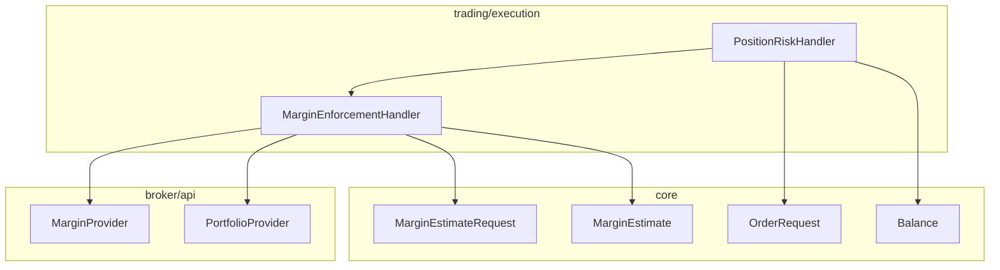
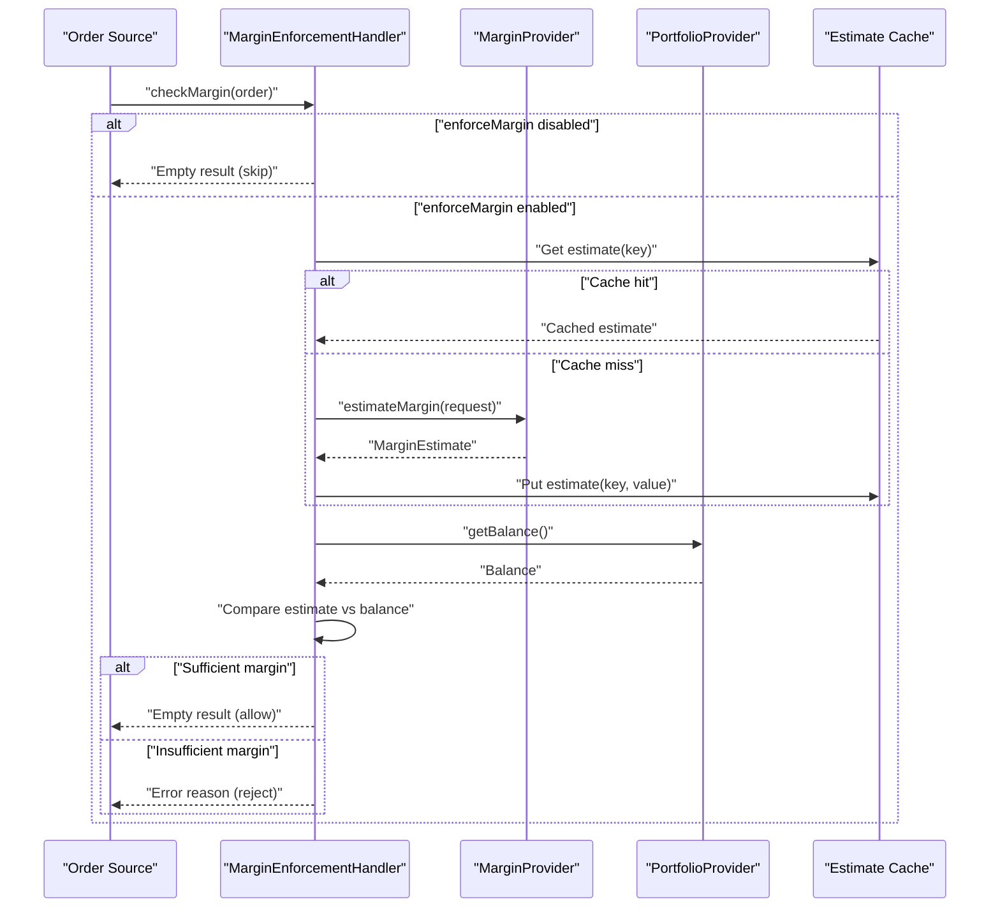
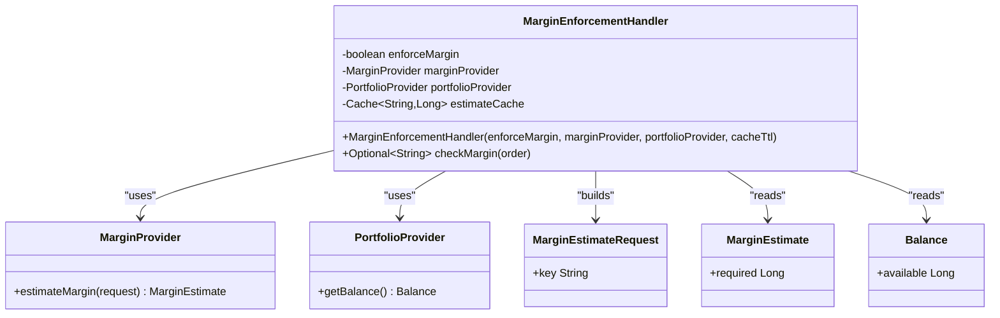
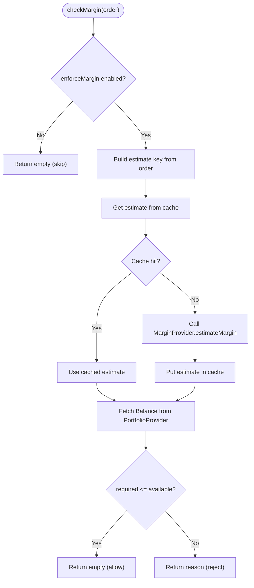
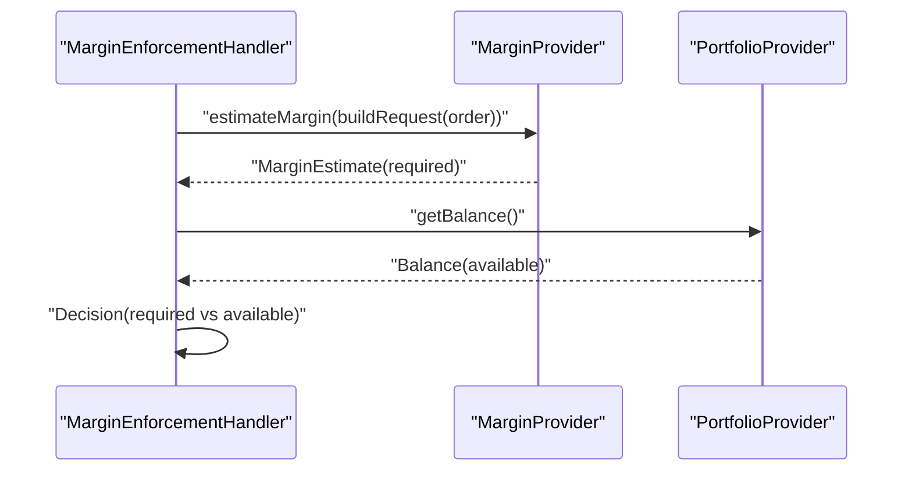
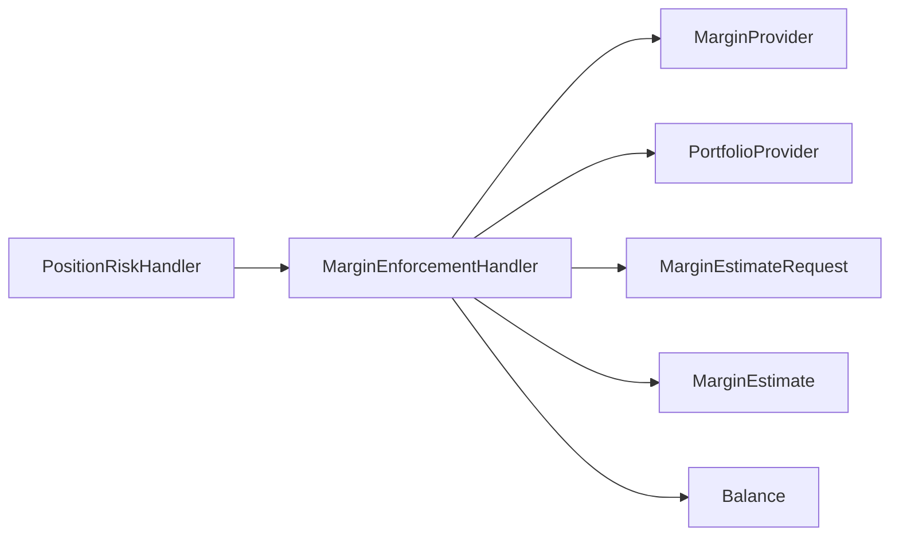

# Margin Enforcement

<cite>
**Referenced Files in This Document**
- [MarginEnforcementHandler.java](file://trading/execution/src/main/java/com/tradej/execution/risk/MarginEnforcementHandler.java)
- [MarginEnforcementHandlerTest.java](file://trading/execution/src/test/java/com/tradej/execution/risk/MarginEnforcementHandlerTest.java)
- [MarginEnforcementComponentTest.java](file://app/src/test/java/com/tradej/app/integration/MarginEnforcementComponentTest.java)
- [MarginProvider.java](file://broker/api/src/main/java/com/tradej/broker/api/port/MarginProvider.java)
- [PortfolioProvider.java](file://broker/api/src/main/java/com/tradej/broker/api/port/PortfolioProvider.java)
- [MarginEstimate.java](file://core/src/main/java/com/tradej/core/domain/model/MarginEstimate.java)
- [MarginEstimateRequest.java](file://core/src/main/java/com/tradej/core/domain/model/MarginEstimateRequest.java)
- [OrderRequest.java](file://core/src/main/java/com/tradej/core/domain/model/OrderRequest.java)
- [Balance.java](file://core/src/main/java/com/tradej/core/domain/model/Balance.java)
- [PositionRiskHandler.java](file://trading/execution/src/main/java/com/tradej/execution/risk/PositionRiskHandler.java)
</cite>

## Table of Contents
1. [Introduction](#introduction)
2. [Project Structure](#project-structure)
3. [Core Components](#core-components)
4. [Architecture Overview](#architecture-overview)
5. [Detailed Component Analysis](#detailed-component-analysis)
6. [Dependency Analysis](#dependency-analysis)
7. [Performance Considerations](#performance-considerations)
8. [Troubleshooting Guide](#troubleshooting-guide)
9. [Conclusion](#conclusion)

## Introduction
This document describes the Margin Enforcement system responsible for pre-trade margin validation. It explains how the system estimates required margins, integrates with broker margin providers, enforces decisions against available portfolio balances, and manages caching for performance. It also covers configuration, cache TTL settings, fallback behavior, and operational troubleshooting.

## Project Structure
The Margin Enforcement system spans three modules:
- trading/execution: Contains the enforcement handler and risk handlers that coordinate enforcement decisions.
- broker/api: Defines provider ports for broker integrations (margin and portfolio).
- core: Provides shared domain models for margin estimates, requests, balances, and order requests.

**Diagram sources**
- [MarginEnforcementHandler.java:1-120](file://trading/execution/src/main/java/com/tradej/execution/risk/MarginEnforcementHandler.java#L1-L120)
- [MarginProvider.java:1-200](file://broker/api/src/main/java/com/tradej/broker/api/port/MarginProvider.java#L1-L200)
- [PortfolioProvider.java:1-200](file://broker/api/src/main/java/com/tradej/broker/api/port/PortfolioProvider.java#L1-L200)
- [MarginEstimateRequest.java:1-200](file://core/src/main/java/com/tradej/core/domain/model/MarginEstimateRequest.java#L1-L200)
- [MarginEstimate.java:1-200](file://core/src/main/java/com/tradej/core/domain/model/MarginEstimate.java#L1-L200)
- [OrderRequest.java:1-200](file://core/src/main/java/com/tradej/core/domain/model/OrderRequest.java#L1-L200)
- [Balance.java:1-200](file://core/src/main/java/com/tradej/core/domain/model/Balance.java#L1-L200)
- [PositionRiskHandler.java:1-200](file://trading/execution/src/main/java/com/tradej/execution/risk/PositionRiskHandler.java#L1-L200)

**Section sources**
- [MarginEnforcementHandler.java:1-120](file://trading/execution/src/main/java/com/tradej/execution/risk/MarginEnforcementHandler.java#L1-L120)
- [MarginProvider.java:1-200](file://broker/api/src/main/java/com/tradej/broker/api/port/MarginProvider.java#L1-L200)
- [PortfolioProvider.java:1-200](file://broker/api/src/main/java/com/tradej/broker/api/port/PortfolioProvider.java#L1-L200)
- [MarginEstimateRequest.java:1-200](file://core/src/main/java/com/tradej/core/domain/model/MarginEstimateRequest.java#L1-L200)
- [MarginEstimate.java:1-200](file://core/src/main/java/com/tradej/core/domain/model/MarginEstimate.java#L1-L200)
- [OrderRequest.java:1-200](file://core/src/main/java/com/tradej/core/domain/model/OrderRequest.java#L1-L200)
- [Balance.java:1-200](file://core/src/main/java/com/tradej/core/domain/model/Balance.java#L1-L200)
- [PositionRiskHandler.java:1-200](file://trading/execution/src/main/java/com/tradej/execution/risk/PositionRiskHandler.java#L1-L200)

## Core Components
- MarginEnforcementHandler: Central enforcement gate that decides whether an order should be allowed based on estimated margin vs available balance. It caches estimates for performance and supports a configurable enable flag and cache TTL.
- MarginProvider: Broker-side port for margin estimation requests.
- PortfolioProvider: Broker-side port for retrieving current account balance and holdings.
- MarginEstimate and MarginEstimateRequest: Core domain models representing the broker's margin estimate response and the request payload respectively.
- PositionRiskHandler: Higher-level risk coordinator that consults the enforcement handler and participates in kill-switch logic.

Key responsibilities:
- Validate pre-trade margin eligibility using cached estimates.
- Integrate with broker APIs via provider ports.
- Enforce decisions based on available funds vs required margin.
- Provide deterministic behavior when disabled.

**Section sources**
- [MarginEnforcementHandler.java:17-120](file://trading/execution/src/main/java/com/tradej/execution/risk/MarginEnforcementHandler.java#L17-L120)
- [MarginProvider.java:1-200](file://broker/api/src/main/java/com/tradej/broker/api/port/MarginProvider.java#L1-L200)
- [PortfolioProvider.java:1-200](file://broker/api/src/main/java/com/tradej/broker/api/port/PortfolioProvider.java#L1-L200)
- [MarginEstimate.java:1-200](file://core/src/main/java/com/tradej/core/domain/model/MarginEstimate.java#L1-L200)
- [MarginEstimateRequest.java:1-200](file://core/src/main/java/com/tradej/core/domain/model/MarginEstimateRequest.java#L1-L200)
- [PositionRiskHandler.java:1-200](file://trading/execution/src/main/java/com/tradej/execution/risk/PositionRiskHandler.java#L1-L200)

## Architecture Overview
The enforcement flow connects order requests to margin estimation and portfolio balance checks, with caching to reduce broker load and latency.

**Diagram sources**
- [MarginEnforcementHandler.java:17-120](file://trading/execution/src/main/java/com/tradej/execution/risk/MarginEnforcementHandler.java#L17-L120)
- [MarginProvider.java:1-200](file://broker/api/src/main/java/com/tradej/broker/api/port/MarginProvider.java#L1-L200)
- [PortfolioProvider.java:1-200](file://broker/api/src/main/java/com/tradej/broker/api/port/PortfolioProvider.java#L1-L200)
- [MarginEstimate.java:1-200](file://core/src/main/java/com/tradej/core/domain/model/MarginEstimate.java#L1-L200)
- [MarginEstimateRequest.java:1-200](file://core/src/main/java/com/tradej/core/domain/model/MarginEstimateRequest.java#L1-L200)
- [Balance.java:1-200](file://core/src/main/java/com/tradej/core/domain/model/Balance.java#L1-L200)

## Detailed Component Analysis

### MarginEnforcementHandler Implementation
Responsibilities:
- Accepts configuration flags and cache TTL.
- Builds a bounded, time-bounded cache for margin estimates keyed by a stable identifier derived from the order.
- Estimates margin via MarginProvider and retrieves available balance via PortfolioProvider.
- Compares required margin to available funds and returns an empty optional to allow or an error reason to reject.

Implementation highlights:
- Constructor initializes enforce flag, provider dependencies, and a Caffeine cache with maximum size and write-expiry TTL.
- Estimation cache key is derived from the order request to ensure broker-specific and product-specific estimates are cached distinctly.
- When disabled, enforcement is skipped and the handler returns an empty result immediately.
- On insufficient margin, returns a reason string indicating the rejection cause.

**Diagram sources**
- [MarginEnforcementHandler.java:17-120](file://trading/execution/src/main/java/com/tradej/execution/risk/MarginEnforcementHandler.java#L17-L120)
- [MarginProvider.java:1-200](file://broker/api/src/main/java/com/tradej/broker/api/port/MarginProvider.java#L1-L200)
- [PortfolioProvider.java:1-200](file://broker/api/src/main/java/com/tradej/broker/api/port/PortfolioProvider.java#L1-L200)
- [MarginEstimateRequest.java:1-200](file://core/src/main/java/com/tradej/core/domain/model/MarginEstimateRequest.java#L1-L200)
- [MarginEstimate.java:1-200](file://core/src/main/java/com/tradej/core/domain/model/MarginEstimate.java#L1-L200)
- [Balance.java:1-200](file://core/src/main/java/com/tradej/core/domain/model/Balance.java#L1-L200)

**Section sources**
- [MarginEnforcementHandler.java:17-120](file://trading/execution/src/main/java/com/tradej/execution/risk/MarginEnforcementHandler.java#L17-L120)

### Margin Calculation Logic
- Estimate retrieval: The handler constructs a request from the order and queries MarginProvider. The returned MarginEstimate provides the required margin amount.
- Balance retrieval: The handler queries PortfolioProvider for the current Balance, focusing on available funds.
- Decision: If the required margin exceeds available funds, enforcement fails and returns a reason string. Otherwise, enforcement passes.

Validation behavior is demonstrated in unit tests:
- Skips enforcement when disabled.
- Rejects when estimate exceeds balance.
- Allows when sufficient margin is available.

**Diagram sources**
- [MarginEnforcementHandler.java:17-120](file://trading/execution/src/main/java/com/tradej/execution/risk/MarginEnforcementHandler.java#L17-L120)
- [MarginProvider.java:1-200](file://broker/api/src/main/java/com/tradej/broker/api/port/MarginProvider.java#L1-L200)
- [PortfolioProvider.java:1-200](file://broker/api/src/main/java/com/tradej/broker/api/port/PortfolioProvider.java#L1-L200)
- [MarginEstimate.java:1-200](file://core/src/main/java/com/tradej/core/domain/model/MarginEstimate.java#L1-L200)
- [Balance.java:1-200](file://core/src/main/java/com/tradej/core/domain/model/Balance.java#L1-L200)

**Section sources**
- [MarginEnforcementHandlerTest.java:28-72](file://trading/execution/src/test/java/com/tradej/execution/risk/MarginEnforcementHandlerTest.java#L28-L72)

### Cache Management Strategies
- Cache type: Caffeine cache with bounded size and write-expiry TTL.
- Capacity: Maximum 10,000 entries.
- TTL: Defaults to 5 minutes if not provided; configurable per handler instantiation.
- Keying: Derived from the order to ensure broker-specific and product-specific estimates are cached separately.

Benefits:
- Reduces repeated broker calls for identical orders.
- Bounds memory footprint and stale data retention.

**Section sources**
- [MarginEnforcementHandler.java:30-43](file://trading/execution/src/main/java/com/tradej/execution/risk/MarginEnforcementHandler.java#L30-L43)

### Integration with Broker Margin Providers and Portfolio Providers
- MarginProvider: Supplies MarginEstimate for a given MarginEstimateRequest built from the order.
- PortfolioProvider: Supplies Balance containing available funds used for comparison.
- Both are injected dependencies, enabling broker-agnostic enforcement logic.

**Diagram sources**
- [MarginEnforcementHandler.java:17-120](file://trading/execution/src/main/java/com/tradej/execution/risk/MarginEnforcementHandler.java#L17-L120)
- [MarginProvider.java:1-200](file://broker/api/src/main/java/com/tradej/broker/api/port/MarginProvider.java#L1-L200)
- [PortfolioProvider.java:1-200](file://broker/api/src/main/java/com/tradej/broker/api/port/PortfolioProvider.java#L1-L200)
- [MarginEstimate.java:1-200](file://core/src/main/java/com/tradej/core/domain/model/MarginEstimate.java#L1-L200)
- [Balance.java:1-200](file://core/src/main/java/com/tradej/core/domain/model/Balance.java#L1-L200)

**Section sources**
- [MarginProvider.java:1-200](file://broker/api/src/main/java/com/tradej/broker/api/port/MarginProvider.java#L1-L200)
- [PortfolioProvider.java:1-200](file://broker/api/src/main/java/com/tradej/broker/api/port/PortfolioProvider.java#L1-L200)

### Real-time Margin Validation and Enforcement Mechanisms
- Real-time: Each order triggers a fresh estimate lookup unless cached.
- Enforcement: Immediate decision with no retries; cache mitigates latency but does not alter correctness.
- Kill-switch coordination: PositionRiskHandler consults the enforcement handler and participates in kill-switch logic when enforcement rejects orders.

Evidence from integration tests:
- When enforcement returns a reason, PositionRiskHandler disables kill-switch protections.

**Section sources**
- [MarginEnforcementComponentTest.java:22-36](file://app/src/test/java/com/tradej/app/integration/MarginEnforcementComponentTest.java#L22-L36)
- [PositionRiskHandler.java:1-200](file://trading/execution/src/main/java/com/tradej/execution/risk/PositionRiskHandler.java#L1-L200)

### Margin Estimation Requests and Models
- MarginEstimateRequest: Built from OrderRequest and passed to MarginProvider. The key field ensures cache uniqueness per order.
- MarginEstimate: Returned by the broker, containing the required margin amount.
- OrderRequest: Core order metadata used to construct the request and derive cache keys.
- Balance: Portfolio balance used for comparison.

**Section sources**
- [MarginEstimateRequest.java:1-200](file://core/src/main/java/com/tradej/core/domain/model/MarginEstimateRequest.java#L1-L200)
- [MarginEstimate.java:1-200](file://core/src/main/java/com/tradej/core/domain/model/MarginEstimate.java#L1-L200)
- [OrderRequest.java:1-200](file://core/src/main/java/com/tradej/core/domain/model/OrderRequest.java#L1-L200)
- [Balance.java:1-200](file://core/src/main/java/com/tradej/core/domain/model/Balance.java#L1-L200)

## Dependency Analysis
- MarginEnforcementHandler depends on:
  - MarginProvider for broker margin estimates.
  - PortfolioProvider for account balance.
  - Core models for requests, estimates, and balances.
- Coupling:
  - Low to broker implementations via provider ports.
  - Cohesion around pre-trade margin enforcement.
- External dependencies:
  - Caffeine for caching.
  - SLF4J for logging.

**Diagram sources**
- [MarginEnforcementHandler.java:17-120](file://trading/execution/src/main/java/com/tradej/execution/risk/MarginEnforcementHandler.java#L17-L120)
- [MarginProvider.java:1-200](file://broker/api/src/main/java/com/tradej/broker/api/port/MarginProvider.java#L1-L200)
- [PortfolioProvider.java:1-200](file://broker/api/src/main/java/com/tradej/broker/api/port/PortfolioProvider.java#L1-L200)
- [MarginEstimateRequest.java:1-200](file://core/src/main/java/com/tradej/core/domain/model/MarginEstimateRequest.java#L1-L200)
- [MarginEstimate.java:1-200](file://core/src/main/java/com/tradej/core/domain/model/MarginEstimate.java#L1-L200)
- [Balance.java:1-200](file://core/src/main/java/com/tradej/core/domain/model/Balance.java#L1-L200)
- [PositionRiskHandler.java:1-200](file://trading/execution/src/main/java/com/tradej/execution/risk/PositionRiskHandler.java#L1-L200)

**Section sources**
- [MarginEnforcementHandler.java:17-120](file://trading/execution/src/main/java/com/tradej/execution/risk/MarginEnforcementHandler.java#L17-L120)

## Performance Considerations
- Cache sizing: Maximum 10,000 entries to bound memory usage.
- TTL: Write-expiry defaults to 5 minutes; configurable via constructor to tune freshness vs throughput.
- Bypass: When disabled, enforcement short-circuits to avoid broker calls.
- Broker calls: Minimized by caching; ensure order keys remain stable to maximize cache hits.

Recommendations:
- Monitor cache hit ratio and adjust TTL based on market activity.
- Ensure order identifiers are stable across retries to improve cache utilization.

**Section sources**
- [MarginEnforcementHandler.java:30-43](file://trading/execution/src/main/java/com/tradej/execution/risk/MarginEnforcementHandler.java#L30-L43)

## Troubleshooting Guide
Common scenarios and resolutions:
- Enforcement always passes:
  - Verify enforceMargin flag is true.
  - Confirm cache is not masking missing estimates.
- Enforcement always fails:
  - Check MarginProvider availability and response correctness.
  - Validate PortfolioProvider balance retrieval.
  - Inspect cache TTL and key derivation to ensure fresh estimates.
- Integration with PositionRiskHandler:
  - When enforcement rejects orders, PositionRiskHandler disables kill-switch protections. Confirm this behavior aligns with intended risk posture.

Operational checks:
- Unit tests demonstrate skip, insufficient margin, and sufficient margin cases.
- Integration tests show PositionRiskHandler reacts to enforcement rejections.

**Section sources**
- [MarginEnforcementHandlerTest.java:28-72](file://trading/execution/src/test/java/com/tradej/execution/risk/MarginEnforcementHandlerTest.java#L28-L72)
- [MarginEnforcementComponentTest.java:22-36](file://app/src/test/java/com/tradej/app/integration/MarginEnforcementComponentTest.java#L22-L36)

## Conclusion
The Margin Enforcement system provides a robust, configurable pre-trade gate that leverages cached broker estimates and portfolio balances to decide order acceptability. Its design emphasizes safety (disable-by-default), performance (bounded cache), and integration clarity (provider ports). Proper configuration of the enforce flag and cache TTL, combined with monitoring, ensures reliable operation across broker implementations and market conditions.