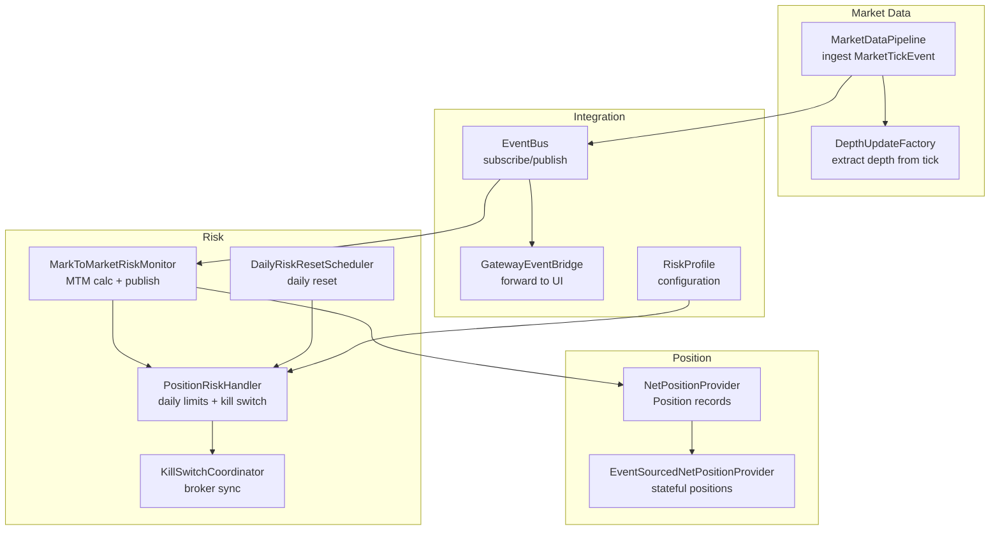
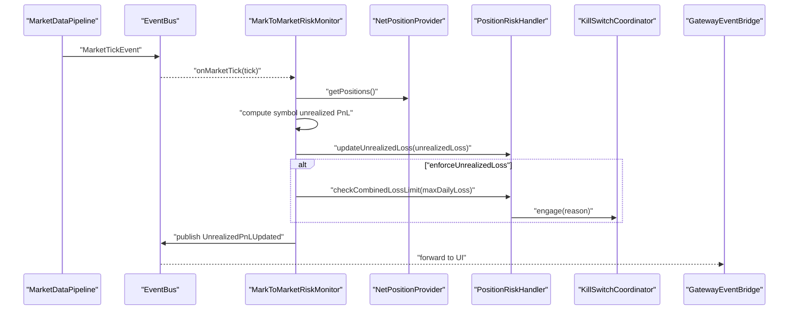
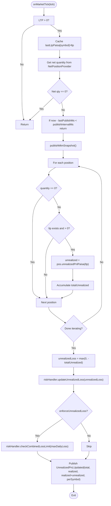
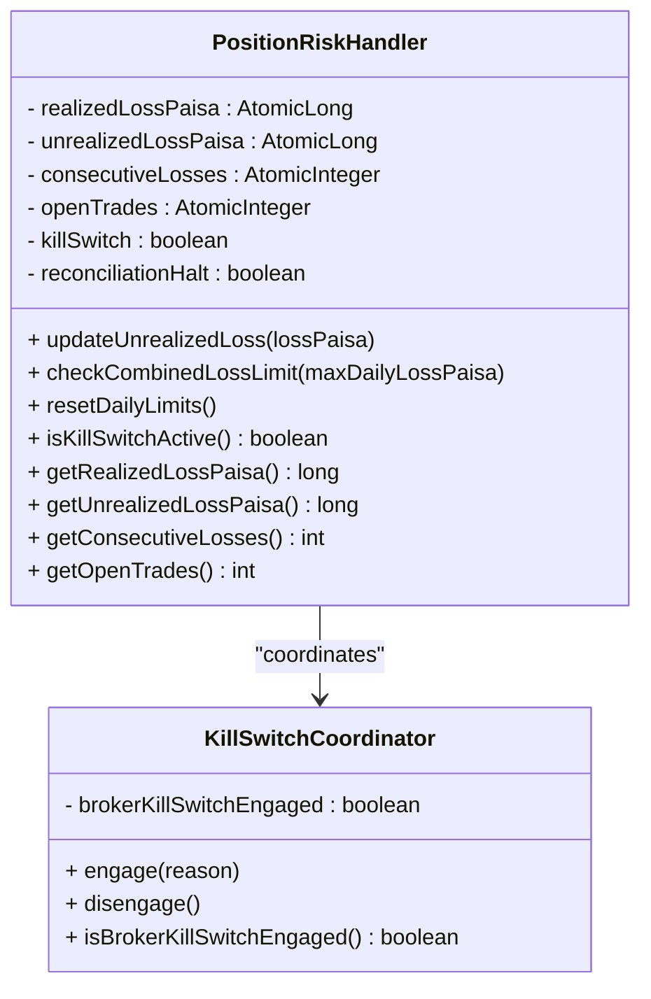
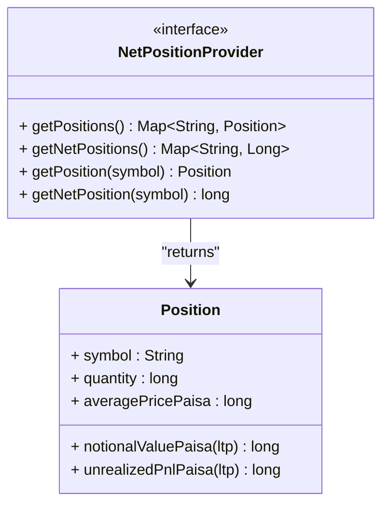
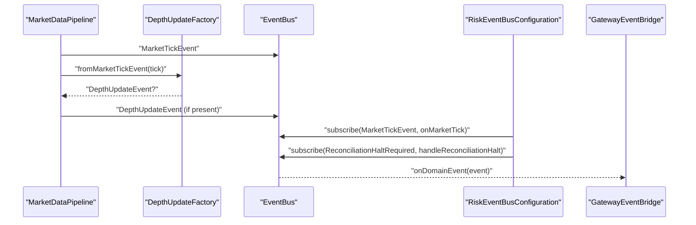
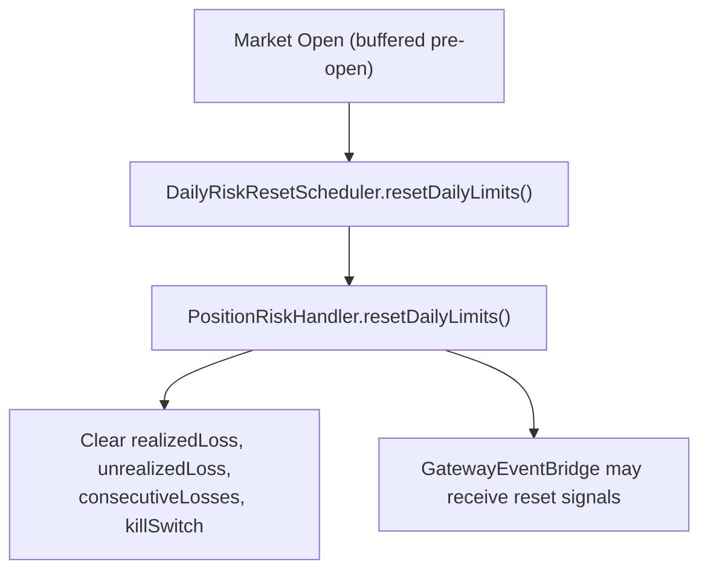
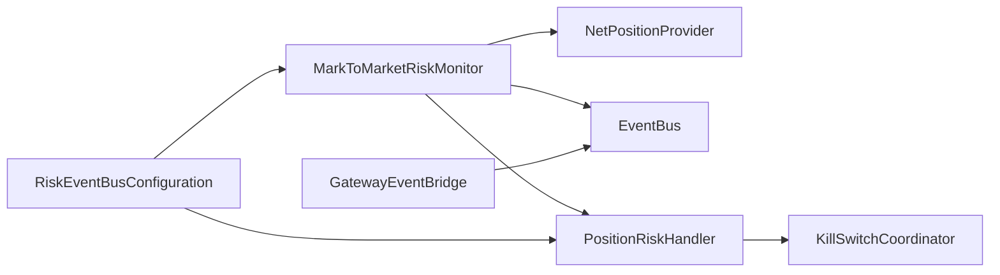

# Mark-to-Market Risk Monitoring

<cite>
**Referenced Files in This Document**
- [MarkToMarketRiskMonitor.java](file://trading/execution/src/main/java/com/tradej/execution/risk/MarkToMarketRiskMonitor.java)
- [PositionRiskHandler.java](file://trading/execution/src/main/java/com/tradej/execution/risk/PositionRiskHandler.java)
- [DailyRiskResetScheduler.java](file://trading/execution/src/main/java/com/tradej/execution/risk/DailyRiskResetScheduler.java)
- [KillSwitchCoordinator.java](file://trading/execution/src/main/java/com/tradej/execution/risk/KillSwitchCoordinator.java)
- [RiskEventBusConfiguration.java](file://app/src/main/java/com/tradej/app/config/RiskEventBusConfiguration.java)
- [NetPositionProvider.java](file://core/src/main/java/com/tradej/core/domain/port/NetPositionProvider.java)
- [EventSourcedNetPositionProvider.java](file://trading/execution/src/main/java/com/tradej/execution/position/EventSourcedNetPositionProvider.java)
- [MarketDataPipeline.java](file://runtime/hotpath/src/main/java/com/tradej/hotpath/MarketDataPipeline.java)
- [DepthUpdateFactory.java](file://runtime/hotpath/src/main/java/com/tradej/hotpath/DepthUpdateFactory.java)
- [GatewayEventBridge.java](file://gateway/src/main/java/com/tradej/gateway/bridge/GatewayEventBridge.java)
- [RiskProfile.java](file://composition/src/main/java/com/tradej/composition/config/RiskProfile.java)
- [MarkToMarketRiskMonitorTest.java](file://trading/execution/src/test/java/com/tradej/execution/risk/MarkToMarketRiskMonitorTest.java)
- [PositionRiskHandlerStressTest.java](file://trading/execution/src/test/java/com/tradej/execution/risk/PositionRiskHandlerStressTest.java)
- [KillSwitchE2EComponentTest.java](file://app/src/test/java/com/tradej/app/integration/KillSwitchE2EComponentTest.java)
</cite>

## Table of Contents
1. [Introduction](#introduction)
2. [Project Structure](#project-structure)
3. [Core Components](#core-components)
4. [Architecture Overview](#architecture-overview)
5. [Detailed Component Analysis](#detailed-component-analysis)
6. [Dependency Analysis](#dependency-analysis)
7. [Performance Considerations](#performance-considerations)
8. [Troubleshooting Guide](#troubleshooting-guide)
9. [Conclusion](#conclusion)
10. [Appendices](#appendices)

## Introduction
This document explains the Mark-to-Market (MTM) Risk Monitoring system responsible for computing unrealized profit and loss from market ticks, enforcing daily loss thresholds (including unrealized), and publishing MTM snapshots to the event bus. It covers MTM calculation algorithms, publishing cadence, position valuation logic, integration with net position providers and market data feeds, event bus publishing, unrealized loss tracking, daily limit enforcement, and performance monitoring. It also addresses MTM accuracy, market data latency, and calculation optimizations, and provides examples of MTM scenarios, threshold breaches, and monitoring configurations.

## Project Structure
The MTM monitoring spans several modules:
- Risk monitoring and enforcement in the trading execution module
- Market data ingestion and forwarding in the runtime hotpath module
- Event bus wiring and gateway bridging in the app and gateway modules
- Position state management in the execution position module
- Configuration and risk profiles in the composition module

**Diagram sources**
- [MarketDataPipeline.java:100-137](file://runtime/hotpath/src/main/java/com/tradej/hotpath/MarketDataPipeline.java#L100-L137)
- [DepthUpdateFactory.java:36-67](file://runtime/hotpath/src/main/java/com/tradej/hotpath/DepthUpdateFactory.java#L36-L67)
- [MarkToMarketRiskMonitor.java:65-116](file://trading/execution/src/main/java/com/tradej/execution/risk/MarkToMarketRiskMonitor.java#L65-L116)
- [PositionRiskHandler.java:137-317](file://trading/execution/src/main/java/com/tradej/execution/risk/PositionRiskHandler.java#L137-L317)
- [DailyRiskResetScheduler.java:14-32](file://trading/execution/src/main/java/com/tradej/execution/risk/DailyRiskResetScheduler.java#L14-L32)
- [KillSwitchCoordinator.java:12-72](file://trading/execution/src/main/java/com/tradej/execution/risk/KillSwitchCoordinator.java#L12-L72)
- [NetPositionProvider.java:15-67](file://core/src/main/java/com/tradej/core/domain/port/NetPositionProvider.java#L15-L67)
- [EventSourcedNetPositionProvider.java:27-52](file://trading/execution/src/main/java/com/tradej/execution/position/EventSourcedNetPositionProvider.java#L27-L52)
- [RiskEventBusConfiguration.java:14-39](file://app/src/main/java/com/tradej/app/config/RiskEventBusConfiguration.java#L14-L39)
- [GatewayEventBridge.java:90-146](file://gateway/src/main/java/com/tradej/gateway/bridge/GatewayEventBridge.java#L90-L146)
- [RiskProfile.java:1-17](file://composition/src/main/java/com/tradej/composition/config/RiskProfile.java#L1-L17)

**Section sources**
- [MarkToMarketRiskMonitor.java:1-116](file://trading/execution/src/main/java/com/tradej/execution/risk/MarkToMarketRiskMonitor.java#L1-L116)
- [PositionRiskHandler.java:33-317](file://trading/execution/src/main/java/com/tradej/execution/risk/PositionRiskHandler.java#L33-L317)
- [RiskEventBusConfiguration.java:14-39](file://app/src/main/java/com/tradej/app/config/RiskEventBusConfiguration.java#L14-L39)

## Core Components
- MarkToMarketRiskMonitor: Computes MTM unrealized PnL per tick, aggregates across positions, tracks unrealized loss, enforces combined daily loss limit when enabled, and publishes UnrealizedPnLUpdated events.
- PositionRiskHandler: Tracks realized loss, unrealized loss, consecutive losses, open trades, and kill switch state; enforces daily and consecutive loss limits; integrates with KillSwitchCoordinator.
- NetPositionProvider and EventSourcedNetPositionProvider: Provide current net positions and compute unrealized PnL using weighted average pricing logic.
- MarketDataPipeline and DepthUpdateFactory: Ingest market ticks and optionally extract depth updates for downstream consumers.
- RiskEventBusConfiguration: Wires MTM monitor and risk handler to the event bus.
- GatewayEventBridge: Bridges events to the gateway for UI consumption.
- DailyRiskResetScheduler: Resets daily counters at market open.
- KillSwitchCoordinator: Synchronizes platform kill-switch state with broker APIs.
- RiskProfile: Centralized risk configuration including daily limits and MTM enforcement flag.

**Section sources**
- [MarkToMarketRiskMonitor.java:16-116](file://trading/execution/src/main/java/com/tradej/execution/risk/MarkToMarketRiskMonitor.java#L16-L116)
- [PositionRiskHandler.java:33-317](file://trading/execution/src/main/java/com/tradej/execution/risk/PositionRiskHandler.java#L33-L317)
- [NetPositionProvider.java:15-67](file://core/src/main/java/com/tradej/core/domain/port/NetPositionProvider.java#L15-L67)
- [EventSourcedNetPositionProvider.java:27-52](file://trading/execution/src/main/java/com/tradej/execution/position/EventSourcedNetPositionProvider.java#L27-L52)
- [MarketDataPipeline.java:100-137](file://runtime/hotpath/src/main/java/com/tradej/hotpath/MarketDataPipeline.java#L100-L137)
- [DepthUpdateFactory.java:36-67](file://runtime/hotpath/src/main/java/com/tradej/hotpath/DepthUpdateFactory.java#L36-L67)
- [RiskEventBusConfiguration.java:14-39](file://app/src/main/java/com/tradej/app/config/RiskEventBusConfiguration.java#L14-L39)
- [GatewayEventBridge.java:90-146](file://gateway/src/main/java/com/tradej/gateway/bridge/GatewayEventBridge.java#L90-L146)
- [DailyRiskResetScheduler.java:14-32](file://trading/execution/src/main/java/com/tradej/execution/risk/DailyRiskResetScheduler.java#L14-L32)
- [KillSwitchCoordinator.java:12-72](file://trading/execution/src/main/java/com/tradej/execution/risk/KillSwitchCoordinator.java#L12-L72)
- [RiskProfile.java:1-17](file://composition/src/main/java/com/tradej/composition/config/RiskProfile.java#L1-L17)

## Architecture Overview
The MTM monitoring pipeline ingests MarketTickEvent from the market data pipeline, computes MTM unrealized PnL, updates risk counters, enforces daily limits, and publishes UnrealizedPnLUpdated events. Risk handlers coordinate with kill switches and gateways.

**Diagram sources**
- [MarketDataPipeline.java:100-137](file://runtime/hotpath/src/main/java/com/tradej/hotpath/MarketDataPipeline.java#L100-L137)
- [RiskEventBusConfiguration.java:31-38](file://app/src/main/java/com/tradej/app/config/RiskEventBusConfiguration.java#L31-L38)
- [MarkToMarketRiskMonitor.java:65-116](file://trading/execution/src/main/java/com/tradej/execution/risk/MarkToMarketRiskMonitor.java#L65-L116)
- [PositionRiskHandler.java:137-148](file://trading/execution/src/main/java/com/tradej/execution/risk/PositionRiskHandler.java#L137-L148)
- [KillSwitchCoordinator.java:28-47](file://trading/execution/src/main/java/com/tradej/execution/risk/KillSwitchCoordinator.java#L28-L47)
- [GatewayEventBridge.java:115-146](file://gateway/src/main/java/com/tradej/gateway/bridge/GatewayEventBridge.java#L115-L146)

## Detailed Component Analysis

### MarkToMarketRiskMonitor
Responsibilities:
- On each MarketTickEvent, update last LTP cache and net position lookup.
- Enforce publish interval to avoid excessive churn.
- Compute per-position unrealized PnL using NetPositionProvider.Position.unrealizedPnlPaisa.
- Aggregate total unrealized PnL and derive unrealized loss (negative portion).
- Update PositionRiskHandler unrealized loss and optionally check combined daily loss limit.
- Publish UnrealizedPnLUpdated with total, realized, combined, and per-symbol unrealized PnL.

Key behaviors:
- Publishing throttled by publishIntervalMs.
- Skips zero or negative LTP ticks.
- Skips positions with zero net quantity.
- Uses lastLtpPaisa map to ensure latest prices are applied consistently across positions.

**Diagram sources**
- [MarkToMarketRiskMonitor.java:65-116](file://trading/execution/src/main/java/com/tradej/execution/risk/MarkToMarketRiskMonitor.java#L65-L116)
- [NetPositionProvider.java:18-27](file://core/src/main/java/com/tradej/core/domain/port/NetPositionProvider.java#L18-L27)
- [PositionRiskHandler.java:137-148](file://trading/execution/src/main/java/com/tradej/execution/risk/PositionRiskHandler.java#L137-L148)

**Section sources**
- [MarkToMarketRiskMonitor.java:16-116](file://trading/execution/src/main/java/com/tradej/execution/risk/MarkToMarketRiskMonitor.java#L16-L116)
- [MarkToMarketRiskMonitorTest.java:37-83](file://trading/execution/src/test/java/com/tradej/execution/risk/MarkToMarketRiskMonitorTest.java#L37-L83)

### PositionRiskHandler
Responsibilities:
- Track realized loss, unrealized loss, consecutive losses, open trades, and kill switch state.
- Update unrealized loss from MTM monitor.
- Enforce daily realized loss limit and consecutive loss limit; activate kill switch on breach.
- Gate signal processing while kill switch or reconciliation halt is active.
- Reset daily limits at market open and synchronize with broker kill switch.

**Diagram sources**
- [PositionRiskHandler.java:33-317](file://trading/execution/src/main/java/com/tradej/execution/risk/PositionRiskHandler.java#L33-L317)
- [KillSwitchCoordinator.java:12-72](file://trading/execution/src/main/java/com/tradej/execution/risk/KillSwitchCoordinator.java#L12-L72)

**Section sources**
- [PositionRiskHandler.java:137-317](file://trading/execution/src/main/java/com/tradej/execution/risk/PositionRiskHandler.java#L137-L317)
- [PositionRiskHandlerStressTest.java:68-142](file://trading/execution/src/test/java/com/tradej/execution/risk/PositionRiskHandlerStressTest.java#L68-L142)
- [KillSwitchE2EComponentTest.java:24-66](file://app/src/test/java/com/tradej/app/integration/KillSwitchE2EComponentTest.java#L24-L66)

### NetPositionProvider and Position Valuation
NetPositionProvider exposes Position records with:
- notionalValuePaisa(ltp): absolute value of holdings at current LTP.
- unrealizedPnlPaisa(ltp): (ltp − averagePrice) × quantity, supporting long/short positions.

EventSourcedNetPositionProvider maintains event-sourced position state and supports snapshot/restore semantics.

**Diagram sources**
- [NetPositionProvider.java:15-67](file://core/src/main/java/com/tradej/core/domain/port/NetPositionProvider.java#L15-L67)
- [EventSourcedNetPositionProvider.java:27-52](file://trading/execution/src/main/java/com/tradej/execution/position/EventSourcedNetPositionProvider.java#L27-L52)

**Section sources**
- [NetPositionProvider.java:15-67](file://core/src/main/java/com/tradej/core/domain/port/NetPositionProvider.java#L15-L67)
- [EventSourcedNetPositionProvider.java:27-52](file://trading/execution/src/main/java/com/tradej/execution/position/EventSourcedNetPositionProvider.java#L27-L52)

### Market Data Integration and Publishing
- MarketDataPipeline accepts MarketTickEvent, applies optional rate limiting, forwards to downstream, and extracts depth updates via DepthUpdateFactory.
- RiskEventBusConfiguration subscribes MarkToMarketRiskMonitor to MarketTickEvent and PositionRiskHandler to ReconciliationHaltRequired.
- GatewayEventBridge forwards MarketTickEvent and other domain events to the gateway topics for UI consumption.

**Diagram sources**
- [MarketDataPipeline.java:100-137](file://runtime/hotpath/src/main/java/com/tradej/hotpath/MarketDataPipeline.java#L100-L137)
- [DepthUpdateFactory.java:36-67](file://runtime/hotpath/src/main/java/com/tradej/hotpath/DepthUpdateFactory.java#L36-L67)
- [RiskEventBusConfiguration.java:31-38](file://app/src/main/java/com/tradej/app/config/RiskEventBusConfiguration.java#L31-L38)
- [GatewayEventBridge.java:90-146](file://gateway/src/main/java/com/tradej/gateway/bridge/GatewayEventBridge.java#L90-L146)

**Section sources**
- [MarketDataPipeline.java:100-137](file://runtime/hotpath/src/main/java/com/tradej/hotpath/MarketDataPipeline.java#L100-L137)
- [DepthUpdateFactory.java:36-67](file://runtime/hotpath/src/main/java/com/tradej/hotpath/DepthUpdateFactory.java#L36-L67)
- [RiskEventBusConfiguration.java:31-38](file://app/src/main/java/com/tradej/app/config/RiskEventBusConfiguration.java#L31-L38)
- [GatewayEventBridge.java:90-146](file://gateway/src/main/java/com/tradej/gateway/bridge/GatewayEventBridge.java#L90-L146)

### Daily Limit Enforcement and Reset
- PositionRiskHandler accumulates realized losses on TradeClosed and resets counters on resetDailyLimits().
- DailyRiskResetScheduler triggers reset at market open (pre-market buffer).
- KillSwitchCoordinator synchronizes platform kill switch with broker kill switch APIs.

**Diagram sources**
- [DailyRiskResetScheduler.java:24-31](file://trading/execution/src/main/java/com/tradej/execution/risk/DailyRiskResetScheduler.java#L24-L31)
- [PositionRiskHandler.java:287-294](file://trading/execution/src/main/java/com/tradej/execution/risk/PositionRiskHandler.java#L287-L294)
- [KillSwitchCoordinator.java:49-72](file://trading/execution/src/main/java/com/tradej/execution/risk/KillSwitchCoordinator.java#L49-L72)

**Section sources**
- [DailyRiskResetScheduler.java:14-32](file://trading/execution/src/main/java/com/tradej/execution/risk/DailyRiskResetScheduler.java#L14-L32)
- [PositionRiskHandler.java:287-294](file://trading/execution/src/main/java/com/tradej/execution/risk/PositionRiskHandler.java#L287-L294)
- [KillSwitchCoordinator.java:12-72](file://trading/execution/src/main/java/com/tradej/execution/risk/KillSwitchCoordinator.java#L12-L72)

## Dependency Analysis
- Coupling: MarkToMarketRiskMonitor depends on NetPositionProvider and EventBus; PositionRiskHandler depends on NetPositionProvider and KillSwitchCoordinator; RiskEventBusConfiguration wires them to the event bus.
- Cohesion: MTM logic is encapsulated in MarkToMarketRiskMonitor; risk enforcement is encapsulated in PositionRiskHandler.
- External integrations: Broker kill switch APIs via KillSwitchCoordinator; gateway forwarding via GatewayEventBridge.

**Diagram sources**
- [MarkToMarketRiskMonitor.java:24-30](file://trading/execution/src/main/java/com/tradej/execution/risk/MarkToMarketRiskMonitor.java#L24-L30)
- [PositionRiskHandler.java:33-77](file://trading/execution/src/main/java/com/tradej/execution/risk/PositionRiskHandler.java#L33-L77)
- [RiskEventBusConfiguration.java:14-39](file://app/src/main/java/com/tradej/app/config/RiskEventBusConfiguration.java#L14-L39)
- [GatewayEventBridge.java:90-146](file://gateway/src/main/java/com/tradej/gateway/bridge/GatewayEventBridge.java#L90-L146)

**Section sources**
- [MarkToMarketRiskMonitor.java:24-30](file://trading/execution/src/main/java/com/tradej/execution/risk/MarkToMarketRiskMonitor.java#L24-L30)
- [PositionRiskHandler.java:33-77](file://trading/execution/src/main/java/com/tradej/execution/risk/PositionRiskHandler.java#L33-L77)
- [RiskEventBusConfiguration.java:14-39](file://app/src/main/java/com/tradej/app/config/RiskEventBusConfiguration.java#L14-L39)

## Performance Considerations
- Publishing throttling: publishIntervalMs prevents frequent MTM snapshots and reduces event bus load.
- Concurrency: NetPositionProvider.Position and PositionRiskHandler use atomic primitives for counters to minimize synchronization overhead.
- Rate limiting: MarketDataPipeline applies tick rate limiting to reduce downstream pressure.
- Deduplication: EventBus adapters deduplicate events to prevent redundant processing.
- Calculation efficiency: MTM loop skips zero-quantity positions and missing LTPs; per-symbol unrealized computed via simple arithmetic.

[No sources needed since this section provides general guidance]

## Troubleshooting Guide
Common issues and diagnostics:
- No MTM events published: Verify MarketDataPipeline receives MarketTickEvent and RiskEventBusConfiguration subscribed to MarketTickEvent.
- Unrealized PnL not updating: Confirm NetPositionProvider.getPositions() returns non-zero quantities and lastLtpPaisa cache is populated.
- Combined loss limit breach: Check PositionRiskHandler.checkCombinedLossLimit and KillSwitchCoordinator engagement.
- Daily reset not occurring: Ensure DailyRiskResetScheduler runs at pre-market open and PositionRiskHandler.resetDailyLimits is invoked.
- Broker kill switch not syncing: Inspect KillSwitchCoordinator engage/disengage flows and broker capabilities.

**Section sources**
- [RiskEventBusConfiguration.java:31-38](file://app/src/main/java/com/tradej/app/config/RiskEventBusConfiguration.java#L31-L38)
- [MarkToMarketRiskMonitor.java:65-116](file://trading/execution/src/main/java/com/tradej/execution/risk/MarkToMarketRiskMonitor.java#L65-L116)
- [PositionRiskHandler.java:141-148](file://trading/execution/src/main/java/com/tradej/execution/risk/PositionRiskHandler.java#L141-L148)
- [DailyRiskResetScheduler.java:24-31](file://trading/execution/src/main/java/com/tradej/execution/risk/DailyRiskResetScheduler.java#L24-L31)
- [KillSwitchCoordinator.java:28-67](file://trading/execution/src/main/java/com/tradej/execution/risk/KillSwitchCoordinator.java#L28-L67)

## Conclusion
The MTM Risk Monitoring system provides robust, low-latency unrealized PnL tracking integrated with market data ingestion, position state management, and risk enforcement. It publishes standardized MTM snapshots and enforces daily limits with kill switch coordination. The design emphasizes performance, concurrency safety, and operational reliability.

[No sources needed since this section summarizes without analyzing specific files]

## Appendices

### MTM Scenarios and Threshold Breaches
- Long position gain: Positive unrealized PnL increases total unrealized; realized remains unchanged.
- Short position loss: Negative unrealized PnL contributes to unrealized loss; combined total may exceed daily limit.
- Consecutive losses: Breach of maxConsecutiveLosses activates kill switch; further signals suppressed.
- Daily realized loss: Exceeding maxDailyLossPaisa activates kill switch.
- Depth-only ticks: MTM monitor ignores ticks without LTP; ensure depth extraction via DepthUpdateFactory is not required for MTM.

**Section sources**
- [MarkToMarketRiskMonitorTest.java:37-83](file://trading/execution/src/test/java/com/tradej/execution/risk/MarkToMarketRiskMonitorTest.java#L37-L83)
- [PositionRiskHandler.java:180-201](file://trading/execution/src/main/java/com/tradej/execution/risk/PositionRiskHandler.java#L180-L201)
- [KillSwitchE2EComponentTest.java:24-66](file://app/src/test/java/com/tradej/app/integration/KillSwitchE2EComponentTest.java#L24-L66)

### Monitoring Configurations
- RiskProfile: Centralized risk limits including daily loss, max open position quantity, max order value, and enforceUnrealizedLoss flag.
- Publish interval: Configure MarkToMarketRiskMonitor constructor with desired publishIntervalMs.
- Daily reset: Scheduled via DailyRiskResetScheduler to align with market open.

**Section sources**
- [RiskProfile.java:1-17](file://composition/src/main/java/com/tradej/composition/config/RiskProfile.java#L1-L17)
- [MarkToMarketRiskMonitor.java:32-50](file://trading/execution/src/main/java/com/tradej/execution/risk/MarkToMarketRiskMonitor.java#L32-L50)
- [DailyRiskResetScheduler.java:24-31](file://trading/execution/src/main/java/com/tradej/execution/risk/DailyRiskResetScheduler.java#L24-L31)