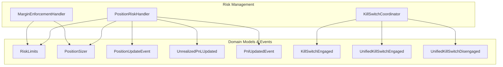
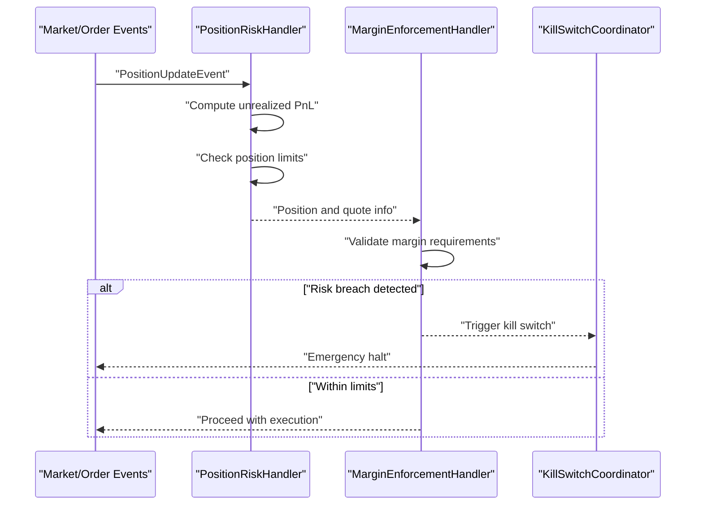
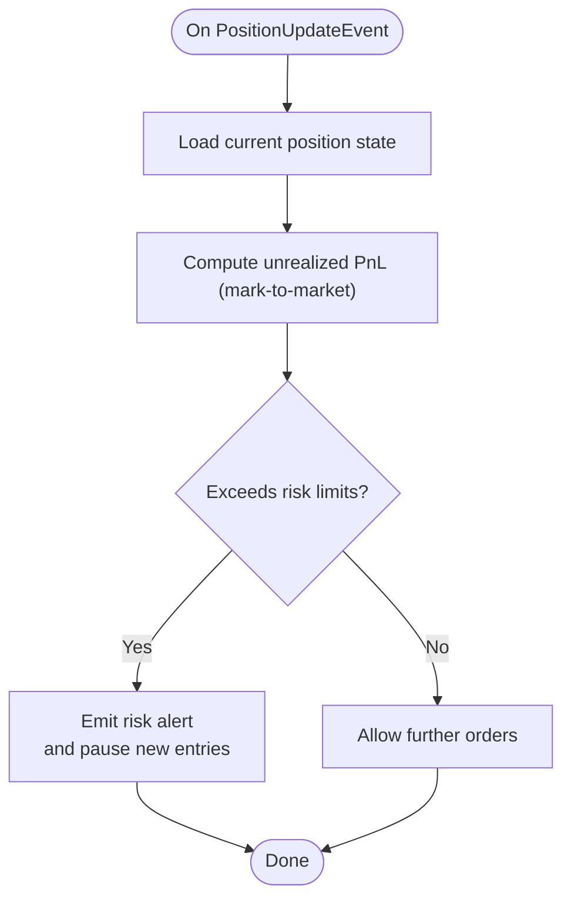
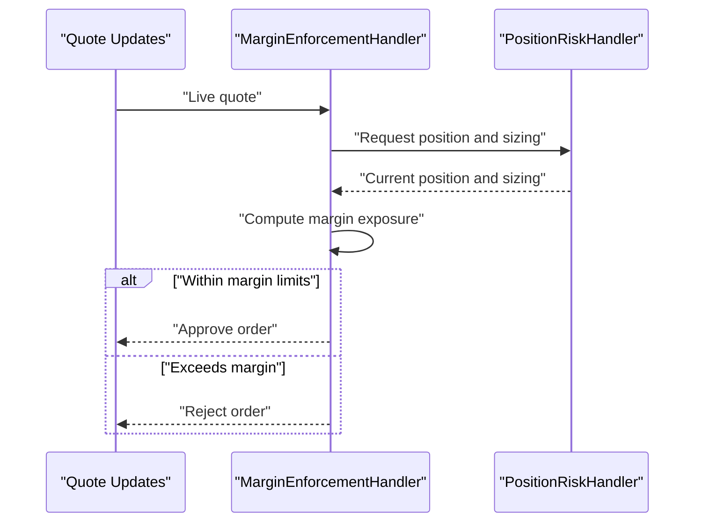
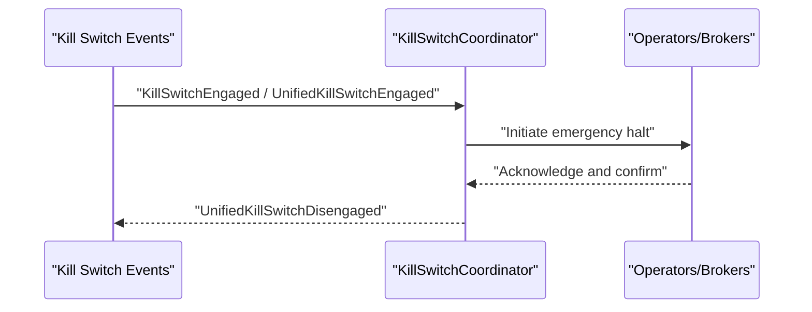
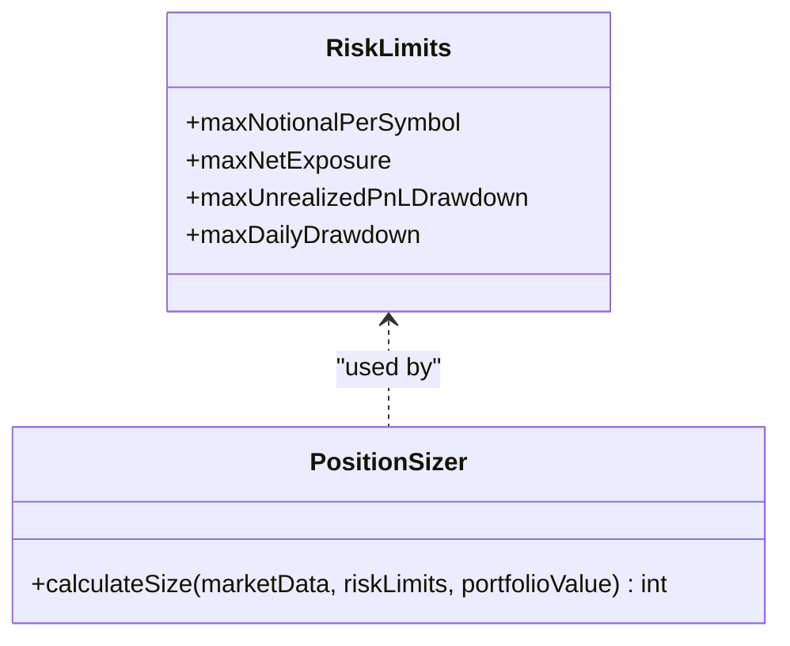
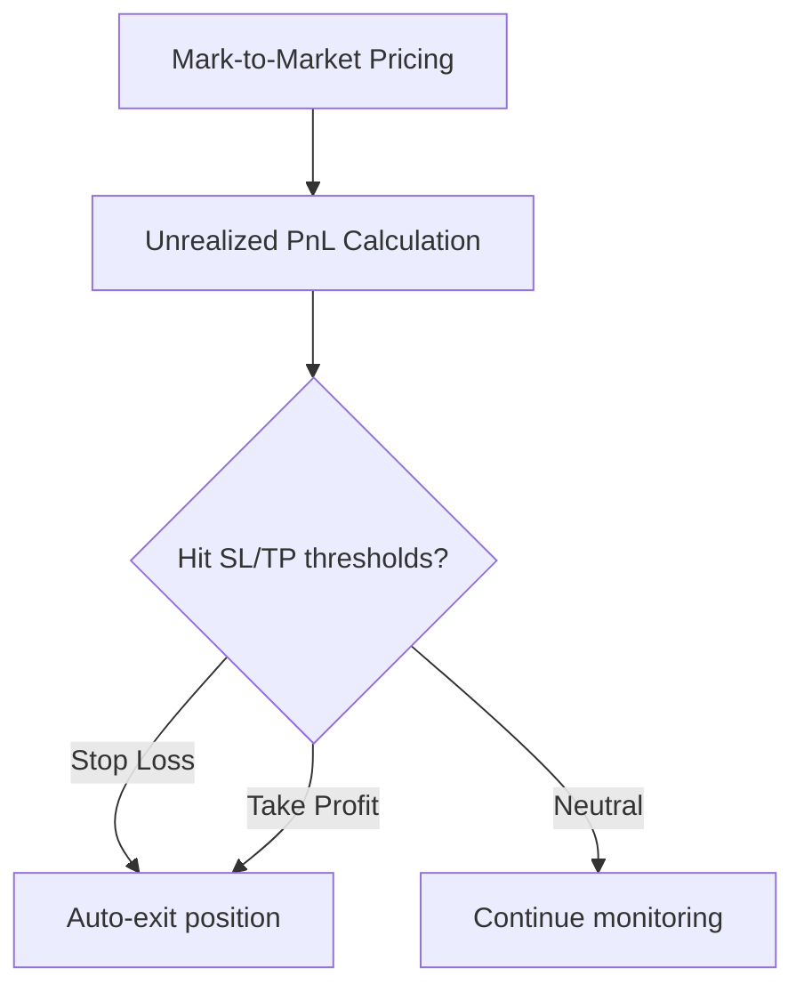
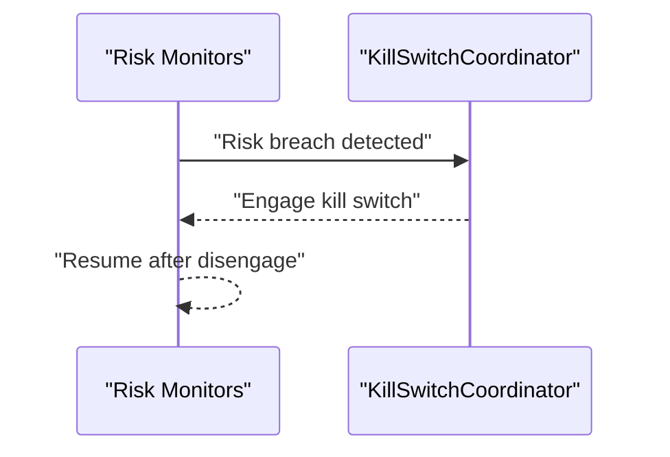
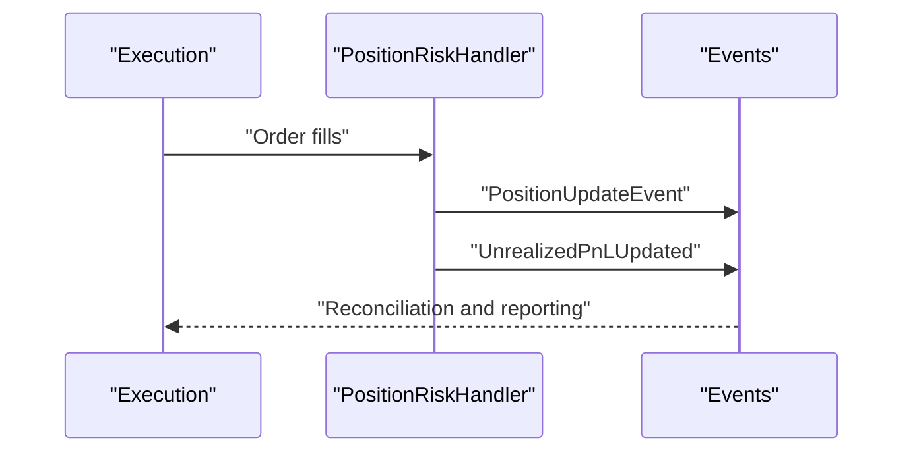
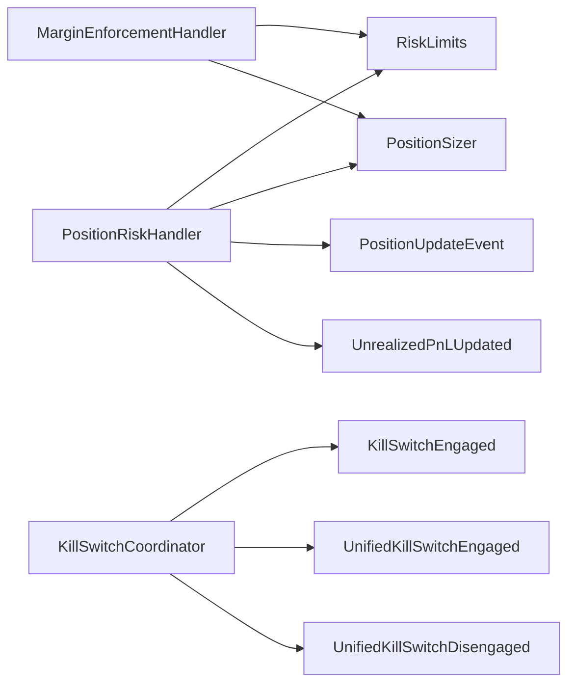

# Position Risk Management

<cite>
**Referenced Files in This Document**
- [PositionRiskHandler.java](file://trading/execution/src/main/java/com/tradej/execution/risk/PositionRiskHandler.java)
- [MarginEnforcementHandler.java](file://trading/execution/src/main/java/com/tradej/execution/risk/MarginEnforcementHandler.java)
- [KillSwitchCoordinator.java](file://trading/execution/src/main/java/com/tradej/execution/risk/KillSwitchCoordinator.java)
- [RiskLimits.java](file://core/src/main/java/com/tradej/core/domain/model/RiskLimits.java)
- [PositionSizer.java](file://core/src/main/java/com/tradej/core/domain/port/PositionSizer.java)
- [KillSwitchEngaged.java](file://core/src/main/java/com/tradej/core/domain/event/KillSwitchEngaged.java)
- [UnifiedKillSwitchEngaged.java](file://core/src/main/java/com/tradej/core/domain/event/UnifiedKillSwitchEngaged.java)
- [UnifiedKillSwitchDisengaged.java](file://core/src/main/java/com/tradej/core/domain/event/UnifiedKillSwitchDisengaged.java)
- [PositionUpdateEvent.java](file://core/src/main/java/com/tradej/core/domain/event/PositionUpdateEvent.java)
- [UnrealizedPnLUpdated.java](file://core/src/main/java/com/tradej/core/domain/event/UnrealizedPnLUpdated.java)
- [PnlUpdatedEvent.java](file://core/src/main/java/com/tradej/core/domain/event/PnlUpdatedEvent.java)
- [PositionRiskHandlerComponentTest.java](file://app/src/test/java/com/tradej/app/integration/PositionRiskHandlerComponentTest.java)
- [MarginEnforcementComponentTest.java](file://app/src/test/java/com/tradej/app/integration/MarginEnforcementComponentTest.java)
- [KillSwitchE2EComponentTest.java](file://app/src/test/java/com/tradej/app/integration/KillSwitchE2EComponentTest.java)
- [DhanKillSwitchIntegrationTest.java](file://app/src/test/java/com/tradej/app/integration/DhanKillSwitchIntegrationTest.java)
- [risk-state.json](file://data/risk-state.json)
</cite>

## Table of Contents
1. [Introduction](#introduction)
2. [Project Structure](#project-structure)
3. [Core Components](#core-components)
4. [Architecture Overview](#architecture-overview)
5. [Detailed Component Analysis](#detailed-component-analysis)
6. [Dependency Analysis](#dependency-analysis)
7. [Performance Considerations](#performance-considerations)
8. [Troubleshooting Guide](#troubleshooting-guide)
9. [Conclusion](#conclusion)
10. [Appendices](#appendices)

## Introduction
This document describes the Position Risk Management system in the TradeJ platform. It explains how positions are tracked, how risk is calculated and enforced, and how automated safety mechanisms operate. The system centers around three primary handlers:
- PositionRiskHandler: Tracks positions, computes unrealized PnL, and enforces position limits.
- MarginEnforcementHandler: Validates margin requirements against real-time quotes and enforces trading constraints.
- KillSwitchCoordinator: Coordinates emergency shutdowns across brokers and systems.

Additional supporting components include risk limit configuration, position sizing logic, and event-driven state updates for risk-aware operations.

## Project Structure
The Position Risk Management functionality spans the trading execution module and core domain models/events:
- trading/execution/src/main/java/com/tradej/execution/risk: Contains PositionRiskHandler, MarginEnforcementHandler, KillSwitchCoordinator.
- core/src/main/java/com/tradej/core/domain/model: Contains RiskLimits for configurable risk thresholds.
- core/src/main/java/com/tradej/core/domain/port: Contains PositionSizer for position sizing logic.
- core/src/main/java/com/tradej/core/domain/event: Domain events for kill switches, position updates, and PnL updates.
- app/src/test/java/com/tradej/app/integration: Integration tests validating end-to-end risk behavior.
- data/risk-state.json: Sample risk state snapshot for operational diagnostics.

**Diagram sources**
- [PositionRiskHandler.java:1-200](file://trading/execution/src/main/java/com/tradej/execution/risk/PositionRiskHandler.java#L1-L200)
- [MarginEnforcementHandler.java:1-200](file://trading/execution/src/main/java/com/tradej/execution/risk/MarginEnforcementHandler.java#L1-L200)
- [KillSwitchCoordinator.java:1-200](file://trading/execution/src/main/java/com/tradej/execution/risk/KillSwitchCoordinator.java#L1-L200)
- [RiskLimits.java:1-200](file://core/src/main/java/com/tradej/core/domain/model/RiskLimits.java#L1-L200)
- [PositionSizer.java:1-200](file://core/src/main/java/com/tradej/core/domain/port/PositionSizer.java#L1-L200)
- [PositionUpdateEvent.java:1-200](file://core/src/main/java/com/tradej/core/domain/event/PositionUpdateEvent.java#L1-L200)
- [UnrealizedPnLUpdated.java:1-200](file://core/src/main/java/com/tradej/core/domain/event/UnrealizedPnLUpdated.java#L1-L200)
- [PnlUpdatedEvent.java:1-200](file://core/src/main/java/com/tradej/core/domain/event/PnlUpdatedEvent.java#L1-L200)
- [KillSwitchEngaged.java:1-200](file://core/src/main/java/com/tradej/core/domain/event/KillSwitchEngaged.java#L1-L200)
- [UnifiedKillSwitchEngaged.java:1-200](file://core/src/main/java/com/tradej/core/domain/event/UnifiedKillSwitchEngaged.java#L1-L200)
- [UnifiedKillSwitchDisengaged.java:1-200](file://core/src/main/java/com/tradej/core/domain/event/UnifiedKillSwitchDisengaged.java#L1-L200)

**Section sources**
- [PositionRiskHandler.java:1-200](file://trading/execution/src/main/java/com/tradej/execution/risk/PositionRiskHandler.java#L1-L200)
- [MarginEnforcementHandler.java:1-200](file://trading/execution/src/main/java/com/tradej/execution/risk/MarginEnforcementHandler.java#L1-L200)
- [KillSwitchCoordinator.java:1-200](file://trading/execution/src/main/java/com/tradej/execution/risk/KillSwitchCoordinator.java#L1-L200)
- [RiskLimits.java:1-200](file://core/src/main/java/com/tradej/core/domain/model/RiskLimits.java#L1-L200)
- [PositionSizer.java:1-200](file://core/src/main/java/com/tradej/core/domain/port/PositionSizer.java#L1-L200)

## Core Components
- PositionRiskHandler: Maintains per-symbol positions, tracks net exposure, computes unrealized PnL using mark-to-market pricing, and enforces position limits via RiskLimits and PositionSizer.
- MarginEnforcementHandler: Validates margin requirements against live quotes and enforces trading constraints to prevent margin breaches.
- KillSwitchCoordinator: Listens for kill switch events and coordinates emergency actions across the system.

**Section sources**
- [PositionRiskHandler.java:1-200](file://trading/execution/src/main/java/com/tradej/execution/risk/PositionRiskHandler.java#L1-L200)
- [MarginEnforcementHandler.java:1-200](file://trading/execution/src/main/java/com/tradej/execution/risk/MarginEnforcementHandler.java#L1-L200)
- [KillSwitchCoordinator.java:1-200](file://trading/execution/src/main/java/com/tradej/execution/risk/KillSwitchCoordinator.java#L1-L200)

## Architecture Overview
The Position Risk Management system operates as an event-driven pipeline:
- Market and order events trigger position updates.
- PositionRiskHandler recalculates unrealized PnL and checks risk limits.
- MarginEnforcementHandler validates margin requirements.
- KillSwitchCoordinator reacts to kill switch events to halt trading.

**Diagram sources**
- [PositionRiskHandler.java:1-200](file://trading/execution/src/main/java/com/tradej/execution/risk/PositionRiskHandler.java#L1-L200)
- [MarginEnforcementHandler.java:1-200](file://trading/execution/src/main/java/com/tradej/execution/risk/MarginEnforcementHandler.java#L1-L200)
- [KillSwitchCoordinator.java:1-200](file://trading/execution/src/main/java/com/tradej/execution/risk/KillSwitchCoordinator.java#L1-L200)
- [PositionUpdateEvent.java:1-200](file://core/src/main/java/com/tradej/core/domain/event/PositionUpdateEvent.java#L1-L200)
- [UnrealizedPnLUpdated.java:1-200](file://core/src/main/java/com/tradej/core/domain/event/UnrealizedPnLUpdated.java#L1-L200)

## Detailed Component Analysis

### PositionRiskHandler
Responsibilities:
- Track per-symbol positions and net exposure.
- Compute unrealized PnL using mark-to-market pricing.
- Enforce position limits via RiskLimits and PositionSizer.
- Publish PnL and position update events.

Key behaviors:
- Receives PositionUpdateEvent and updates internal position state.
- Calculates unrealized PnL based on current mid-price or last price.
- Compares realized and unrealized PnL against configured risk limits.
- Uses PositionSizer to derive allowable position sizes under constraints.

**Diagram sources**
- [PositionRiskHandler.java:1-200](file://trading/execution/src/main/java/com/tradej/execution/risk/PositionRiskHandler.java#L1-L200)
- [RiskLimits.java:1-200](file://core/src/main/java/com/tradej/core/domain/model/RiskLimits.java#L1-L200)
- [PositionSizer.java:1-200](file://core/src/main/java/com/tradej/core/domain/port/PositionSizer.java#L1-L200)
- [PositionUpdateEvent.java:1-200](file://core/src/main/java/com/tradej/core/domain/event/PositionUpdateEvent.java#L1-L200)
- [UnrealizedPnLUpdated.java:1-200](file://core/src/main/java/com/tradej/core/domain/event/UnrealizedPnLUpdated.java#L1-L200)

**Section sources**
- [PositionRiskHandler.java:1-200](file://trading/execution/src/main/java/com/tradej/execution/risk/PositionRiskHandler.java#L1-L200)
- [RiskLimits.java:1-200](file://core/src/main/java/com/tradej/core/domain/model/RiskLimits.java#L1-L200)
- [PositionSizer.java:1-200](file://core/src/main/java/com/tradej/core/domain/port/PositionSizer.java#L1-L200)
- [PositionUpdateEvent.java:1-200](file://core/src/main/java/com/tradej/core/domain/event/PositionUpdateEvent.java#L1-L200)
- [UnrealizedPnLUpdated.java:1-200](file://core/src/main/java/com/tradej/core/domain/event/UnrealizedPnLUpdated.java#L1-L200)

### MarginEnforcementHandler
Responsibilities:
- Validate margin requirements against live quotes.
- Enforce trading constraints to prevent margin breaches.
- Coordinate with PositionRiskHandler for position and quote context.

Key behaviors:
- Receives quote updates and position context.
- Computes margin exposure and compares against account margin limits.
- Blocks orders that would violate margin constraints.

**Diagram sources**
- [MarginEnforcementHandler.java:1-200](file://trading/execution/src/main/java/com/tradej/execution/risk/MarginEnforcementHandler.java#L1-L200)
- [PositionRiskHandler.java:1-200](file://trading/execution/src/main/java/com/tradej/execution/risk/PositionRiskHandler.java#L1-L200)

**Section sources**
- [MarginEnforcementHandler.java:1-200](file://trading/execution/src/main/java/com/tradej/execution/risk/MarginEnforcementHandler.java#L1-L200)
- [PositionRiskHandler.java:1-200](file://trading/execution/src/main/java/com/tradej/execution/risk/PositionRiskHandler.java#L1-L200)

### KillSwitchCoordinator
Responsibilities:
- Listen for kill switch events and coordinate emergency shutdown.
- Engage unified kill switch across brokers and systems.
- Disengage upon operator approval or conditions met.

Key behaviors:
- Subscribes to KillSwitchEngaged and UnifiedKillSwitchEngaged events.
- Triggers emergency halt procedures.
- Emits UnifiedKillSwitchDisengaged when safe to resume.

**Diagram sources**
- [KillSwitchCoordinator.java:1-200](file://trading/execution/src/main/java/com/tradej/execution/risk/KillSwitchCoordinator.java#L1-L200)
- [KillSwitchEngaged.java:1-200](file://core/src/main/java/com/tradej/core/domain/event/KillSwitchEngaged.java#L1-L200)
- [UnifiedKillSwitchEngaged.java:1-200](file://core/src/main/java/com/tradej/core/domain/event/UnifiedKillSwitchEngaged.java#L1-L200)
- [UnifiedKillSwitchDisengaged.java:1-200](file://core/src/main/java/com/tradej/core/domain/event/UnifiedKillSwitchDisengaged.java#L1-L200)

**Section sources**
- [KillSwitchCoordinator.java:1-200](file://trading/execution/src/main/java/com/tradej/execution/risk/KillSwitchCoordinator.java#L1-L200)
- [KillSwitchEngaged.java:1-200](file://core/src/main/java/com/tradej/core/domain/event/KillSwitchEngaged.java#L1-L200)
- [UnifiedKillSwitchEngaged.java:1-200](file://core/src/main/java/com/tradej/core/domain/event/UnifiedKillSwitchEngaged.java#L1-L200)
- [UnifiedKillSwitchDisengaged.java:1-200](file://core/src/main/java/com/tradej/core/domain/event/UnifiedKillSwitchDisengaged.java#L1-L200)

### Risk Limits and Position Sizing
- RiskLimits: Defines configurable risk thresholds (e.g., max position size, max unrealized PnL drawdown).
- PositionSizer: Provides sizing logic to compute allowable position sizes given market conditions and risk limits.

**Diagram sources**
- [RiskLimits.java:1-200](file://core/src/main/java/com/tradej/core/domain/model/RiskLimits.java#L1-L200)
- [PositionSizer.java:1-200](file://core/src/main/java/com/tradej/core/domain/port/PositionSizer.java#L1-L200)

**Section sources**
- [RiskLimits.java:1-200](file://core/src/main/java/com/tradej/core/domain/model/RiskLimits.java#L1-L200)
- [PositionSizer.java:1-200](file://core/src/main/java/com/tradej/core/domain/port/PositionSizer.java#L1-L200)

### Mark-to-Market Risk Monitoring and Stop-Loss/Take-Profit
- Mark-to-market: PositionRiskHandler computes unrealized PnL using current market prices.
- Stop-loss/take-profit: While explicit SL/TP handlers are not present in the referenced files, the system can enforce exits when unrealized PnL hits configured thresholds by leveraging PositionRiskHandler alerts and MarginEnforcementHandler rejections.

**Diagram sources**
- [PositionRiskHandler.java:1-200](file://trading/execution/src/main/java/com/tradej/execution/risk/PositionRiskHandler.java#L1-L200)
- [UnrealizedPnLUpdated.java:1-200](file://core/src/main/java/com/tradej/core/domain/event/UnrealizedPnLUpdated.java#L1-L200)

**Section sources**
- [PositionRiskHandler.java:1-200](file://trading/execution/src/main/java/com/tradej/execution/risk/PositionRiskHandler.java#L1-L200)
- [UnrealizedPnLUpdated.java:1-200](file://core/src/main/java/com/tradej/core/domain/event/UnrealizedPnLUpdated.java#L1-L200)

### Automated Risk Controls and Circuit Breakers
- Kill switch: Emergency mechanism coordinated by KillSwitchCoordinator reacting to KillSwitchEngaged and UnifiedKillSwitchEngaged events.
- Circuit breaker: Implemented implicitly via kill switch triggers and position/margin enforcement; explicit circuit breaker timers are not present in the referenced files.

**Diagram sources**
- [KillSwitchCoordinator.java:1-200](file://trading/execution/src/main/java/com/tradej/execution/risk/KillSwitchCoordinator.java#L1-L200)
- [KillSwitchEngaged.java:1-200](file://core/src/main/java/com/tradej/core/domain/event/KillSwitchEngaged.java#L1-L200)
- [UnifiedKillSwitchEngaged.java:1-200](file://core/src/main/java/com/tradej/core/domain/event/UnifiedKillSwitchEngaged.java#L1-L200)
- [UnifiedKillSwitchDisengaged.java:1-200](file://core/src/main/java/com/tradej/core/domain/event/UnifiedKillSwitchDisengaged.java#L1-L200)

**Section sources**
- [KillSwitchCoordinator.java:1-200](file://trading/execution/src/main/java/com/tradej/execution/risk/KillSwitchCoordinator.java#L1-L200)
- [KillSwitchEngaged.java:1-200](file://core/src/main/java/com/tradej/core/domain/event/KillSwitchEngaged.java#L1-L200)
- [UnifiedKillSwitchEngaged.java:1-200](file://core/src/main/java/com/tradej/core/domain/event/UnifiedKillSwitchEngaged.java#L1-L200)
- [UnifiedKillSwitchDisengaged.java:1-200](file://core/src/main/java/com/tradej/core/domain/event/UnifiedKillSwitchDisengaged.java#L1-L200)

### Position Reconciliation and Reporting
- Position reconciliation: Triggered by PositionMismatch events and PositionUpdateEvent; PositionRiskHandler maintains state snapshots for reconciliation.
- Reporting: PnL updates emitted via UnrealizedPnLUpdated and PnlUpdatedEvent enable real-time dashboards and alerts.

**Diagram sources**
- [PositionRiskHandler.java:1-200](file://trading/execution/src/main/java/com/tradej/execution/risk/PositionRiskHandler.java#L1-L200)
- [PositionUpdateEvent.java:1-200](file://core/src/main/java/com/tradej/core/domain/event/PositionUpdateEvent.java#L1-L200)
- [UnrealizedPnLUpdated.java:1-200](file://core/src/main/java/com/tradej/core/domain/event/UnrealizedPnLUpdated.java#L1-L200)
- [PnlUpdatedEvent.java:1-200](file://core/src/main/java/com/tradej/core/domain/event/PnlUpdatedEvent.java#L1-L200)

**Section sources**
- [PositionRiskHandler.java:1-200](file://trading/execution/src/main/java/com/tradej/execution/risk/PositionRiskHandler.java#L1-L200)
- [PositionUpdateEvent.java:1-200](file://core/src/main/java/com/tradej/core/domain/event/PositionUpdateEvent.java#L1-L200)
- [UnrealizedPnLUpdated.java:1-200](file://core/src/main/java/com/tradej/core/domain/event/UnrealizedPnLUpdated.java#L1-L200)
- [PnlUpdatedEvent.java:1-200](file://core/src/main/java/com/tradej/core/domain/event/PnlUpdatedEvent.java#L1-L200)

## Dependency Analysis
The Position Risk Management components depend on domain models and events for state transitions and risk enforcement.

**Diagram sources**
- [PositionRiskHandler.java:1-200](file://trading/execution/src/main/java/com/tradej/execution/risk/PositionRiskHandler.java#L1-L200)
- [MarginEnforcementHandler.java:1-200](file://trading/execution/src/main/java/com/tradej/execution/risk/MarginEnforcementHandler.java#L1-L200)
- [KillSwitchCoordinator.java:1-200](file://trading/execution/src/main/java/com/tradej/execution/risk/KillSwitchCoordinator.java#L1-L200)
- [RiskLimits.java:1-200](file://core/src/main/java/com/tradej/core/domain/model/RiskLimits.java#L1-L200)
- [PositionSizer.java:1-200](file://core/src/main/java/com/tradej/core/domain/port/PositionSizer.java#L1-L200)
- [PositionUpdateEvent.java:1-200](file://core/src/main/java/com/tradej/core/domain/event/PositionUpdateEvent.java#L1-L200)
- [UnrealizedPnLUpdated.java:1-200](file://core/src/main/java/com/tradej/core/domain/event/UnrealizedPnLUpdated.java#L1-L200)
- [KillSwitchEngaged.java:1-200](file://core/src/main/java/com/tradej/core/domain/event/KillSwitchEngaged.java#L1-L200)
- [UnifiedKillSwitchEngaged.java:1-200](file://core/src/main/java/com/tradej/core/domain/event/UnifiedKillSwitchEngaged.java#L1-L200)
- [UnifiedKillSwitchDisengaged.java:1-200](file://core/src/main/java/com/tradej/core/domain/event/UnifiedKillSwitchDisengaged.java#L1-L200)

**Section sources**
- [PositionRiskHandler.java:1-200](file://trading/execution/src/main/java/com/tradej/execution/risk/PositionRiskHandler.java#L1-L200)
- [MarginEnforcementHandler.java:1-200](file://trading/execution/src/main/java/com/tradej/execution/risk/MarginEnforcementHandler.java#L1-L200)
- [KillSwitchCoordinator.java:1-200](file://trading/execution/src/main/java/com/tradej/execution/risk/KillSwitchCoordinator.java#L1-L200)
- [RiskLimits.java:1-200](file://core/src/main/java/com/tradej/core/domain/model/RiskLimits.java#L1-L200)
- [PositionSizer.java:1-200](file://core/src/main/java/com/tradej/core/domain/port/PositionSizer.java#L1-L200)
- [PositionUpdateEvent.java:1-200](file://core/src/main/java/com/tradej/core/domain/event/PositionUpdateEvent.java#L1-L200)
- [UnrealizedPnLUpdated.java:1-200](file://core/src/main/java/com/tradej/core/domain/event/UnrealizedPnLUpdated.java#L1-L200)
- [KillSwitchEngaged.java:1-200](file://core/src/main/java/com/tradej/core/domain/event/KillSwitchEngaged.java#L1-L200)
- [UnifiedKillSwitchEngaged.java:1-200](file://core/src/main/java/com/tradej/core/domain/event/UnifiedKillSwitchEngaged.java#L1-L200)
- [UnifiedKillSwitchDisengaged.java:1-200](file://core/src/main/java/com/tradej/core/domain/event/UnifiedKillSwitchDisengaged.java#L1-L200)

## Performance Considerations
- Event-driven processing minimizes blocking and enables high-frequency risk updates.
- PositionRiskHandler and MarginEnforcementHandler should avoid heavy computations in hot paths; cache frequently accessed market data and risk limits.
- KillSwitchCoordinator must react quickly; ensure minimal latency in event propagation and emergency halt routines.

## Troubleshooting Guide
Common issues and mitigations:
- Risk breach false positives: Verify market data freshness and ensure PositionRiskHandler recalculations use latest quotes.
- Margin enforcement delays: Confirm MarginEnforcementHandler receives timely quote updates and position context.
- Kill switch not engaging: Check KillSwitchCoordinator subscriptions and event sources (KillSwitchEngaged, UnifiedKillSwitchEngaged).
- Reconciliation drift: Inspect PositionUpdateEvent frequency and PositionRiskHandler state snapshots.

Operational artifacts:
- risk-state.json: Use for diagnosing current risk state during incidents.

**Section sources**
- [PositionRiskHandler.java:1-200](file://trading/execution/src/main/java/com/tradej/execution/risk/PositionRiskHandler.java#L1-L200)
- [MarginEnforcementHandler.java:1-200](file://trading/execution/src/main/java/com/tradej/execution/risk/MarginEnforcementHandler.java#L1-L200)
- [KillSwitchCoordinator.java:1-200](file://trading/execution/src/main/java/com/tradej/execution/risk/KillSwitchCoordinator.java#L1-L200)
- [risk-state.json:1-200](file://data/risk-state.json#L1-L200)

## Conclusion
The Position Risk Management system integrates position tracking, margin validation, and emergency kill switches into a cohesive, event-driven framework. PositionRiskHandler and MarginEnforcementHandler provide continuous risk oversight, while KillSwitchCoordinator ensures rapid response to severe risk events. Together with RiskLimits and PositionSizer, the system offers robust automated risk controls suitable for live trading environments.

## Appendices

### Integration Tests Reference
- PositionRiskHandlerComponentTest: Validates end-to-end position risk behavior.
- MarginEnforcementComponentTest: Verifies margin enforcement logic.
- KillSwitchE2EComponentTest and DhanKillSwitchIntegrationTest: Exercise kill switch coordination across brokers.

**Section sources**
- [PositionRiskHandlerComponentTest.java:1-200](file://app/src/test/java/com/tradej/app/integration/PositionRiskHandlerComponentTest.java#L1-L200)
- [MarginEnforcementComponentTest.java:1-200](file://app/src/test/java/com/tradej/app/integration/MarginEnforcementComponentTest.java#L1-L200)
- [KillSwitchE2EComponentTest.java:1-200](file://app/src/test/java/com/tradej/app/integration/KillSwitchE2EComponentTest.java#L1-L200)
- [DhanKillSwitchIntegrationTest.java:1-200](file://app/src/test/java/com/tradej/app/integration/DhanKillSwitchIntegrationTest.java#L1-L200)