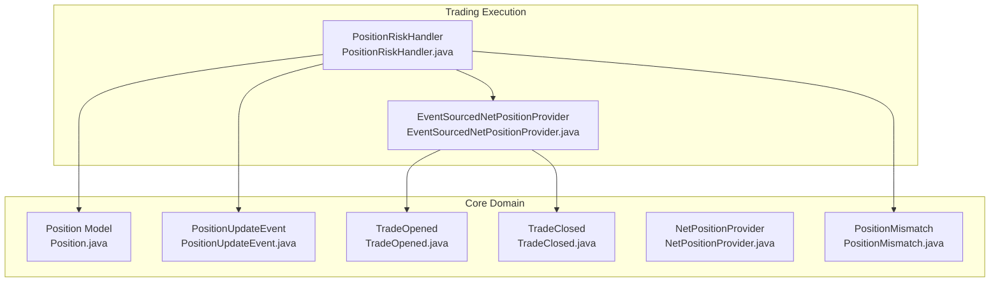
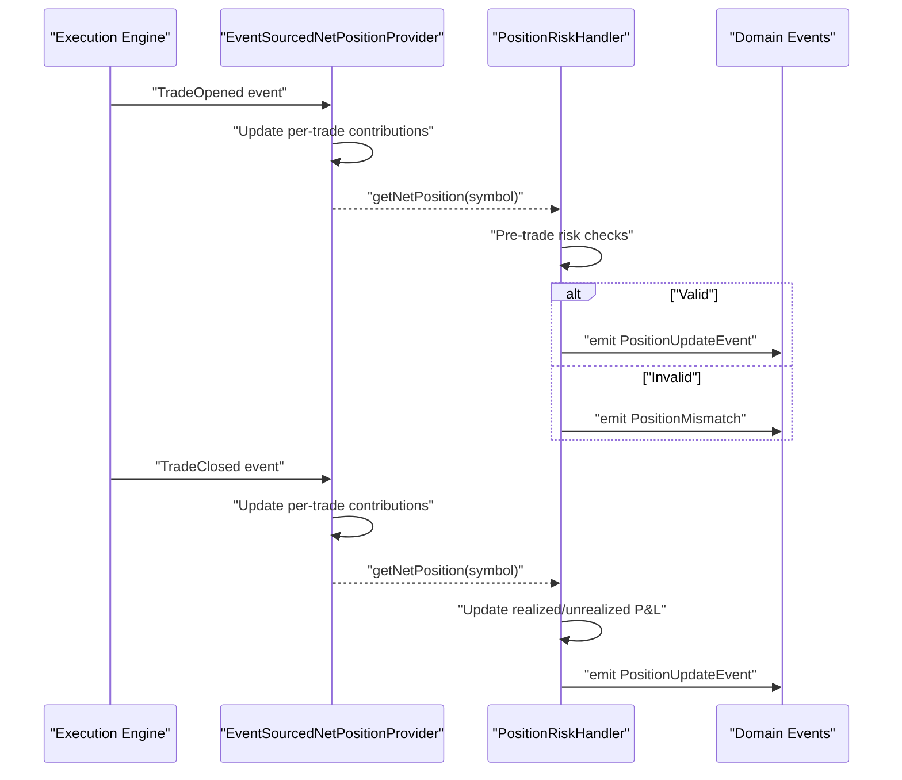
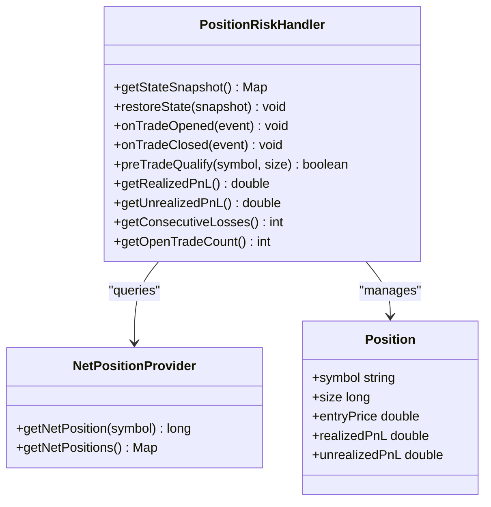
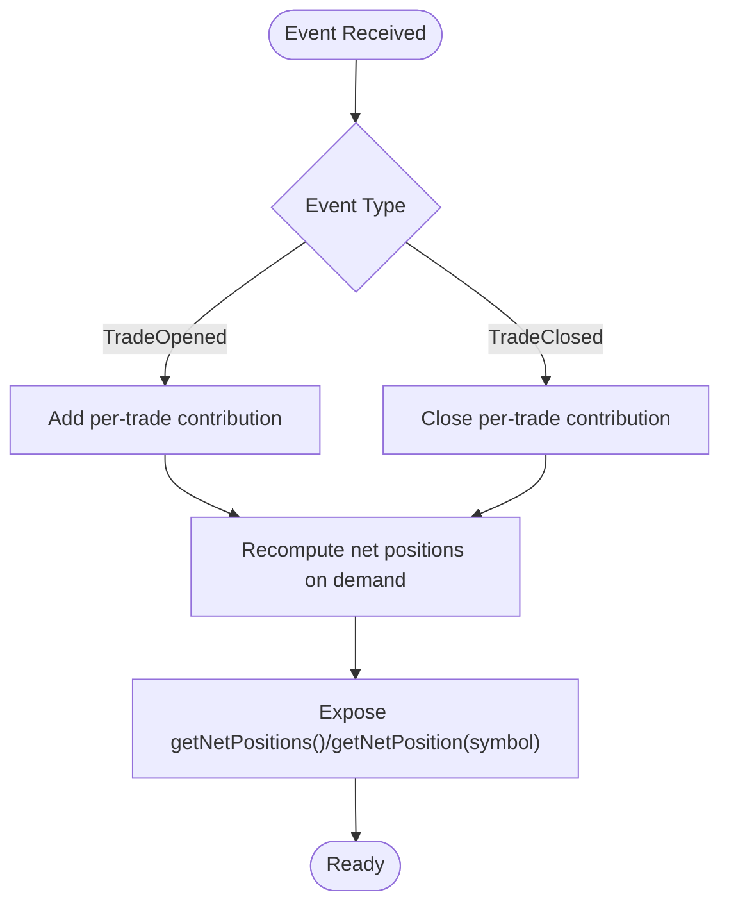
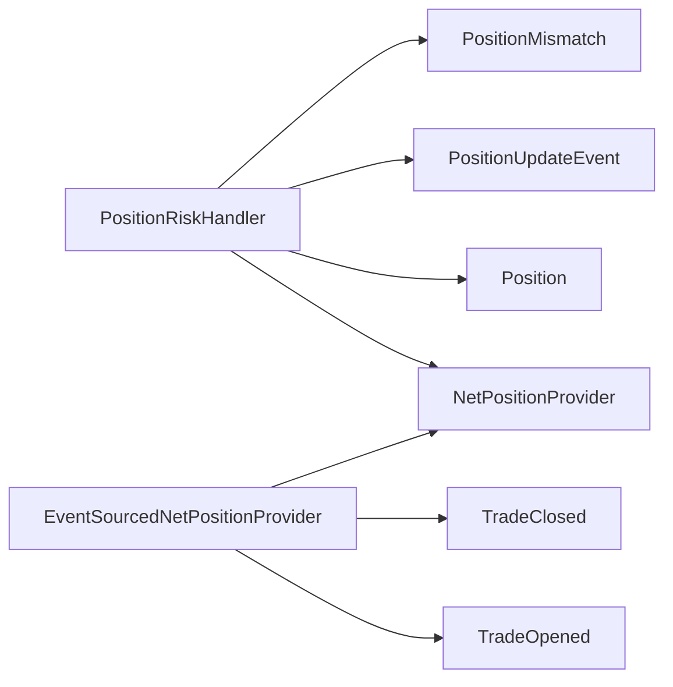

# Position Tracking System

<cite>
**Referenced Files in This Document**
- [PositionRiskHandler.java](file://trading/execution/src/main/java/com/tradej/execution/risk/PositionRiskHandler.java)
- [EventSourcedNetPositionProvider.java](file://trading/execution/src/main/java/com/tradej/execution/position/EventSourcedNetPositionProvider.java)
- [Position.java](file://core/src/main/java/com/tradej/core/domain/model/Position.java)
- [PositionUpdateEvent.java](file://core/src/main/java/com/tradej/core/domain/event/PositionUpdateEvent.java)
- [TradeOpened.java](file://core/src/main/java/com/tradej/core/domain/event/TradeOpened.java)
- [TradeClosed.java](file://core/src/main/java/com/tradej/core/domain/event/TradeClosed.java)
- [NetPositionProvider.java](file://core/src/main/java/com/tradej/core/domain/port/NetPositionProvider.java)
- [PositionMismatch.java](file://core/src/main/java/com/tradej/core/domain/event/PositionMismatch.java)
- [PositionRiskHandlerComponentTest.java](file://app/src/test/java/com/tradej/app/integration/PositionRiskHandlerComponentTest.java)
- [PositionRiskHandlerStressTest.java](file://trading/execution/src/test/java/com/tradej/execution/risk/PositionRiskHandlerStressTest.java)
</cite>

## Table of Contents
1. [Introduction](#introduction)
2. [Project Structure](#project-structure)
3. [Core Components](#core-components)
4. [Architecture Overview](#architecture-overview)
5. [Detailed Component Analysis](#detailed-component-analysis)
6. [Dependency Analysis](#dependency-analysis)
7. [Performance Considerations](#performance-considerations)
8. [Troubleshooting Guide](#troubleshooting-guide)
9. [Conclusion](#conclusion)

## Introduction
This document describes the Position Tracking System within the Position Risk Management framework. It focuses on the PositionRiskHandler implementation, including position state management, trade lifecycle tracking, and position reconciliation mechanisms. It also documents position calculation algorithms, net position determination, symbol tracking, atomic state management for realized/unrealized losses, consecutive loss tracking, open trade counters, position snapshots, state restoration, position validation rules, position updates during trade events, signal processing, and position sizing calculations. Examples of position scenarios and tracking limitations are included to aid understanding and operational guidance.

## Project Structure
The Position Tracking System spans two primary modules:
- Core domain module: Defines position models, events, and ports that represent the canonical position state and lifecycle events.
- Trading execution module: Implements the PositionRiskHandler and the EventSourcedNetPositionProvider that derive net positions from trade lifecycle events and enforce pre-trade risk checks.

**Diagram sources**
- [Position.java](file://core/src/main/java/com/tradej/core/domain/model/Position.java)
- [PositionUpdateEvent.java](file://core/src/main/java/com/tradej/core/domain/event/PositionUpdateEvent.java)
- [TradeOpened.java](file://core/src/main/java/com/tradej/core/domain/event/TradeOpened.java)
- [TradeClosed.java](file://core/src/main/java/com/tradej/core/domain/event/TradeClosed.java)
- [NetPositionProvider.java](file://core/src/main/java/com/tradej/core/domain/port/NetPositionProvider.java)
- [PositionMismatch.java](file://core/src/main/java/com/tradej/core/domain/event/PositionMismatch.java)
- [PositionRiskHandler.java](file://trading/execution/src/main/java/com/tradej/execution/risk/PositionRiskHandler.java)
- [EventSourcedNetPositionProvider.java](file://trading/execution/src/main/java/com/tradej/execution/position/EventSourcedNetPositionProvider.java)

**Section sources**
- [PositionRiskHandler.java](file://trading/execution/src/main/java/com/tradej/execution/risk/PositionRiskHandler.java)
- [EventSourcedNetPositionProvider.java](file://trading/execution/src/main/java/com/tradej/execution/position/EventSourcedNetPositionProvider.java)
- [Position.java](file://core/src/main/java/com/tradej/core/domain/model/Position.java)
- [PositionUpdateEvent.java](file://core/src/main/java/com/tradej/core/domain/event/PositionUpdateEvent.java)
- [TradeOpened.java](file://core/src/main/java/com/tradej/core/domain/event/TradeOpened.java)
- [TradeClosed.java](file://core/src/main/java/com/tradej/core/domain/event/TradeClosed.java)
- [NetPositionProvider.java](file://core/src/main/java/com/tradej/core/domain/port/NetPositionProvider.java)
- [PositionMismatch.java](file://core/src/main/java/com/tradej/core/domain/event/PositionMismatch.java)

## Core Components
- PositionRiskHandler: Central component responsible for position state management, pre-trade risk checks, realized/unrealized P&L accounting, consecutive loss tracking, open trade counters, and position snapshot/state restoration. It integrates with NetPositionProvider to compute canonical net positions and emits PositionUpdateEvent on successful position changes.
- EventSourcedNetPositionProvider: Derives net positions from trade lifecycle events (TradeOpened, TradeClosed) and exposes a canonical view keyed by plain symbol. It recomputes net positions on demand to serve as the single source of truth for pre-trade qualification.
- Position model and events: Define the position entity and lifecycle events (PositionUpdateEvent, TradeOpened, TradeClosed, PositionMismatch) that drive state transitions and validations.

Key responsibilities:
- Atomic state management for realized and unrealized losses
- Consecutive loss tracking and open trade counters
- Position snapshot and restoration
- Position validation rules and trade event updates
- Symbol-level tracking and net position computation

**Section sources**
- [PositionRiskHandler.java](file://trading/execution/src/main/java/com/tradej/execution/risk/PositionRiskHandler.java)
- [EventSourcedNetPositionProvider.java](file://trading/execution/src/main/java/com/tradej/execution/position/EventSourcedNetPositionProvider.java)
- [Position.java](file://core/src/main/java/com/tradej/core/domain/model/Position.java)
- [PositionUpdateEvent.java](file://core/src/main/java/com/tradej/core/domain/event/PositionUpdateEvent.java)
- [TradeOpened.java](file://core/src/main/java/com/tradej/core/domain/event/TradeOpened.java)
- [TradeClosed.java](file://core/src/main/java/com/tradej/core/domain/event/TradeClosed.java)
- [NetPositionProvider.java](file://core/src/main/java/com/tradej/core/domain/port/NetPositionProvider.java)
- [PositionMismatch.java](file://core/src/main/java/com/tradej/core/domain/event/PositionMismatch.java)

## Architecture Overview
The Position Tracking System follows an event-driven architecture:
- Trade lifecycle events (TradeOpened, TradeClosed) are processed by EventSourcedNetPositionProvider to maintain canonical net positions per symbol.
- PositionRiskHandler consumes these net positions and enforces pre-trade risk checks, maintaining internal state for realized/unrealized P&L, consecutive losses, and open trade counts.
- PositionRiskHandler emits PositionUpdateEvent upon successful position changes and can detect mismatches via PositionMismatch.

**Diagram sources**
- [EventSourcedNetPositionProvider.java](file://trading/execution/src/main/java/com/tradej/execution/position/EventSourcedNetPositionProvider.java)
- [PositionRiskHandler.java](file://trading/execution/src/main/java/com/tradej/execution/risk/PositionRiskHandler.java)
- [TradeOpened.java](file://core/src/main/java/com/tradej/core/domain/event/TradeOpened.java)
- [TradeClosed.java](file://core/src/main/java/com/tradej/core/domain/event/TradeClosed.java)
- [PositionUpdateEvent.java](file://core/src/main/java/com/tradej/core/domain/event/PositionUpdateEvent.java)
- [PositionMismatch.java](file://core/src/main/java/com/tradej/core/domain/event/PositionMismatch.java)

## Detailed Component Analysis

### PositionRiskHandler Implementation
PositionRiskHandler manages position state and enforces pre-trade risk checks. It maintains:
- Realized and unrealized P&L
- Consecutive loss tracking
- Open trade counters
- Position snapshots for state restoration
- Validation rules for position updates

Processing logic:
- Receives net positions from NetPositionProvider
- Validates pre-trade constraints (e.g., symbol tracking, position limits)
- Updates realized/unrealized P&L based on trade events
- Emits PositionUpdateEvent on successful updates or PositionMismatch on violations

**Diagram sources**
- [PositionRiskHandler.java](file://trading/execution/src/main/java/com/tradej/execution/risk/PositionRiskHandler.java)
- [NetPositionProvider.java](file://core/src/main/java/com/tradej/core/domain/port/NetPositionProvider.java)
- [Position.java](file://core/src/main/java/com/tradej/core/domain/model/Position.java)

**Section sources**
- [PositionRiskHandler.java](file://trading/execution/src/main/java/com/tradej/execution/risk/PositionRiskHandler.java)
- [Position.java](file://core/src/main/java/com/tradej/core/domain/model/Position.java)
- [PositionUpdateEvent.java](file://core/src/main/java/com/tradej/core/domain/event/PositionUpdateEvent.java)
- [PositionMismatch.java](file://core/src/main/java/com/tradej/core/domain/event/PositionMismatch.java)

### EventSourcedNetPositionProvider
EventSourcedNetPositionProvider derives net positions from trade lifecycle events and exposes a canonical view keyed by plain symbol. It recomputes net positions on demand to serve as the single source of truth for pre-trade qualification.

**Diagram sources**
- [EventSourcedNetPositionProvider.java](file://trading/execution/src/main/java/com/tradej/execution/position/EventSourcedNetPositionProvider.java)
- [TradeOpened.java](file://core/src/main/java/com/tradej/core/domain/event/TradeOpened.java)
- [TradeClosed.java](file://core/src/main/java/com/tradej/core/domain/event/TradeClosed.java)

**Section sources**
- [EventSourcedNetPositionProvider.java](file://trading/execution/src/main/java/com/tradej/execution/position/EventSourcedNetPositionProvider.java)
- [NetPositionProvider.java](file://core/src/main/java/com/tradej/core/domain/port/NetPositionProvider.java)

### Position Calculation and Net Position Determination
Net position per symbol is computed by aggregating per-trade contributions derived from TradeOpened and TradeClosed events. The provider recomputes positions on demand to ensure consistency with the current event state.

Key points:
- Per-symbol tracking independent of other symbols
- Zero net position for unknown symbols
- Unmodifiable snapshot exposed for external consumers

**Section sources**
- [EventSourcedNetPositionProvider.java](file://trading/execution/src/main/java/com/tradej/execution/position/EventSourcedNetPositionProvider.java)
- [TradeOpened.java](file://core/src/main/java/com/tradej/core/domain/event/TradeOpened.java)
- [TradeClosed.java](file://core/src/main/java/com/tradej/core/domain/event/TradeClosed.java)

### Atomic State Management for Realized/Unrealized Losses
PositionRiskHandler maintains atomic state for realized and unrealized P&L:
- Realized P&L accumulates profits/losses from closed trades
- Unrealized P&L reflects open positions’ current market valuation
- Updates occur atomically during trade lifecycle events

Validation ensures that realized/unrealized P&L remain consistent with net position changes.

**Section sources**
- [PositionRiskHandler.java](file://trading/execution/src/main/java/com/tradej/execution/risk/PositionRiskHandler.java)
- [Position.java](file://core/src/main/java/com/tradej/core/domain/model/Position.java)

### Consecutive Loss Tracking and Open Trade Counters
PositionRiskHandler tracks:
- Consecutive losses to enforce loss limits
- Open trade counters to manage exposure and position concentration

These metrics are updated during trade events and considered during pre-trade qualification.

**Section sources**
- [PositionRiskHandler.java](file://trading/execution/src/main/java/com/tradej/execution/risk/PositionRiskHandler.java)

### Position Snapshot Functionality and State Restoration
PositionRiskHandler supports:
- Position snapshot capture for backup/restoration
- State restoration to resume position tracking after failures

This enables resilient operation and recovery from transient errors.

**Section sources**
- [PositionRiskHandler.java](file://trading/execution/src/main/java/com/tradej/execution/risk/PositionRiskHandler.java)

### Position Validation Rules and Trade Event Updates
PositionRiskHandler enforces validation rules during pre-trade qualification:
- Symbol tracking and position limits
- Net position constraints
- Realized/unrealized P&L thresholds
- Consecutive loss and open trade count limits

On successful validation, it emits PositionUpdateEvent; otherwise, it emits PositionMismatch.

**Section sources**
- [PositionRiskHandler.java](file://trading/execution/src/main/java/com/tradej/execution/risk/PositionRiskHandler.java)
- [PositionUpdateEvent.java](file://core/src/main/java/com/tradej/core/domain/event/PositionUpdateEvent.java)
- [PositionMismatch.java](file://core/src/main/java/com/tradej/core/domain/event/PositionMismatch.java)

### Position Updates During Trade Events and Signal Processing
- TradeOpened: New position opened; PositionRiskHandler validates and updates state, emits PositionUpdateEvent.
- TradeClosed: Position closed; realized P&L updated, PositionRiskHandler validates and emits PositionUpdateEvent.
- Signals: PositionRiskHandler coordinates with signal processing to incorporate expected deltas while enforcing pre-trade constraints.

**Section sources**
- [PositionRiskHandler.java](file://trading/execution/src/main/java/com/tradej/execution/risk/PositionRiskHandler.java)
- [TradeOpened.java](file://core/src/main/java/com/tradej/core/domain/event/TradeOpened.java)
- [TradeClosed.java](file://core/src/main/java/com/tradej/core/domain/event/TradeClosed.java)
- [PositionUpdateEvent.java](file://core/src/main/java/com/tradej/core/domain/event/PositionUpdateEvent.java)

### Position Size Calculations
PositionRiskHandler integrates with PositionSizer (from core domain ports) to calculate appropriate order sizes while respecting position and risk constraints. The exact sizing algorithm is provided by the PositionSizer implementation and is applied during pre-trade qualification.

**Section sources**
- [PositionRiskHandler.java](file://trading/execution/src/main/java/com/tradej/execution/risk/PositionRiskHandler.java)
- [NetPositionProvider.java](file://core/src/main/java/com/tradej/core/domain/port/NetPositionProvider.java)

### Example Position Scenarios
- Opening a long position increases net position and unrealized P&L; pre-trade checks validate limits and emit PositionUpdateEvent.
- Closing part of a position realizes gains/losses and reduces open size; PositionRiskHandler updates realized/unrealized P&L accordingly.
- Exceeding consecutive loss limits triggers PositionMismatch and blocks further trades until conditions improve.
- Unknown symbol queries return zero net position; PositionRiskHandler treats this as a safe baseline for pre-trade checks.

**Section sources**
- [PositionRiskHandler.java](file://trading/execution/src/main/java/com/tradej/execution/risk/PositionRiskHandler.java)
- [EventSourcedNetPositionProvider.java](file://trading/execution/src/main/java/com/tradej/execution/position/EventSourcedNetPositionProvider.java)
- [PositionMismatch.java](file://core/src/main/java/com/tradej/core/domain/event/PositionMismatch.java)

### Position Tracking Limitations
- Canonical net positions are recomputed on demand; transient inconsistencies can arise if event ordering is not guaranteed.
- Pre-trade qualification depends on the latest net position snapshot; delays in event processing can temporarily misalign state.
- PositionMismatch events indicate reconciliation needs; operators should investigate and resolve discrepancies before resuming trading.

**Section sources**
- [EventSourcedNetPositionProvider.java](file://trading/execution/src/main/java/com/tradej/execution/position/EventSourcedNetPositionProvider.java)
- [PositionMismatch.java](file://core/src/main/java/com/tradej/core/domain/event/PositionMismatch.java)

## Dependency Analysis
PositionRiskHandler depends on:
- NetPositionProvider for canonical net positions
- Position model and events for state representation and lifecycle
- PositionSizer for position sizing during pre-trade qualification

EventSourcedNetPositionProvider depends on:
- TradeOpened and TradeClosed events to update per-trade contributions
- Concurrent data structures to maintain thread-safe state

**Diagram sources**
- [PositionRiskHandler.java](file://trading/execution/src/main/java/com/tradej/execution/risk/PositionRiskHandler.java)
- [EventSourcedNetPositionProvider.java](file://trading/execution/src/main/java/com/tradej/execution/position/EventSourcedNetPositionProvider.java)
- [NetPositionProvider.java](file://core/src/main/java/com/tradej/core/domain/port/NetPositionProvider.java)
- [Position.java](file://core/src/main/java/com/tradej/core/domain/model/Position.java)
- [PositionUpdateEvent.java](file://core/src/main/java/com/tradej/core/domain/event/PositionUpdateEvent.java)
- [PositionMismatch.java](file://core/src/main/java/com/tradej/core/domain/event/PositionMismatch.java)
- [TradeOpened.java](file://core/src/main/java/com/tradej/core/domain/event/TradeOpened.java)
- [TradeClosed.java](file://core/src/main/java/com/tradej/core/domain/event/TradeClosed.java)

**Section sources**
- [PositionRiskHandler.java](file://trading/execution/src/main/java/com/tradej/execution/risk/PositionRiskHandler.java)
- [EventSourcedNetPositionProvider.java](file://trading/execution/src/main/java/com/tradej/execution/position/EventSourcedNetPositionProvider.java)
- [NetPositionProvider.java](file://core/src/main/java/com/tradej/core/domain/port/NetPositionProvider.java)
- [Position.java](file://core/src/main/java/com/tradej/core/domain/model/Position.java)
- [PositionUpdateEvent.java](file://core/src/main/java/com/tradej/core/domain/event/PositionUpdateEvent.java)
- [PositionMismatch.java](file://core/src/main/java/com/tradej/core/domain/event/PositionMismatch.java)
- [TradeOpened.java](file://core/src/main/java/com/tradej/core/domain/event/TradeOpened.java)
- [TradeClosed.java](file://core/src/main/java/com/tradej/core/domain/event/TradeClosed.java)

## Performance Considerations
- Net position recomputation occurs on demand; frequent reads may trigger recomputation overhead. Consider caching strategies for high-frequency scenarios.
- Event processing throughput depends on event bus performance; ensure adequate buffering and backpressure handling.
- Pre-trade qualification should be lightweight; avoid heavy computations inside PositionRiskHandler to maintain low latency.

## Troubleshooting Guide
Common issues and resolutions:
- PositionMismatch events: Investigate event ordering and reconciliation gaps; verify TradeOpened/TradeClosed event completeness.
- Unexpected zero net positions: Confirm symbol normalization and ensure symbol tracking is enabled.
- State drift after restarts: Use getStateSnapshot and restoreState to recover position state from persistent storage.

Validation and stress tests:
- Integration tests validate PositionRiskHandler behavior under realistic scenarios.
- Stress tests evaluate PositionRiskHandler performance under load.

**Section sources**
- [PositionRiskHandlerComponentTest.java](file://app/src/test/java/com/tradej/app/integration/PositionRiskHandlerComponentTest.java)
- [PositionRiskHandlerStressTest.java](file://trading/execution/src/test/java/com/tradej/execution/risk/PositionRiskHandlerStressTest.java)
- [PositionMismatch.java](file://core/src/main/java/com/tradej/core/domain/event/PositionMismatch.java)

## Conclusion
The Position Tracking System provides robust position state management, event-driven net position derivation, and comprehensive pre-trade risk enforcement. PositionRiskHandler centralizes position accounting and validation, while EventSourcedNetPositionProvider ensures a canonical, recomputed view of net positions. Together, they enable accurate position tracking, reliable state restoration, and resilient operation under real-time trading conditions.