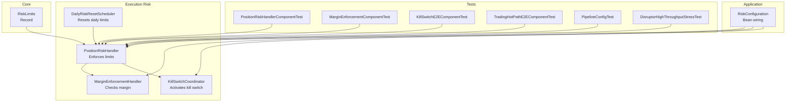
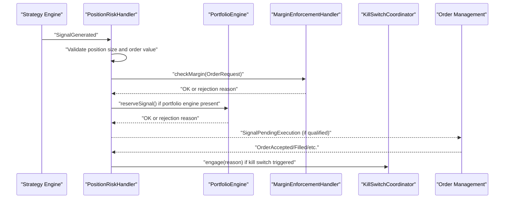
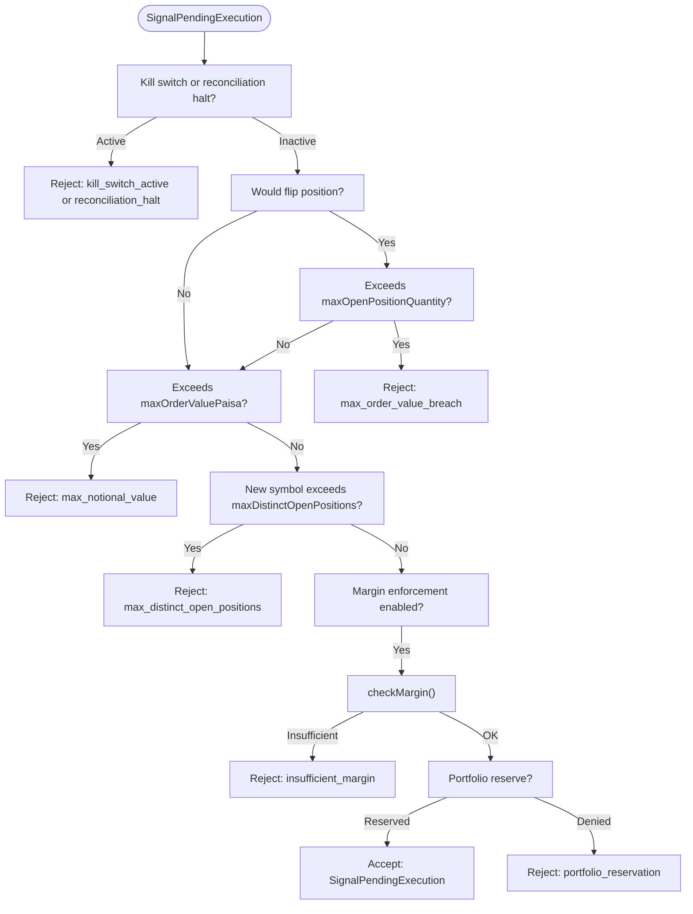
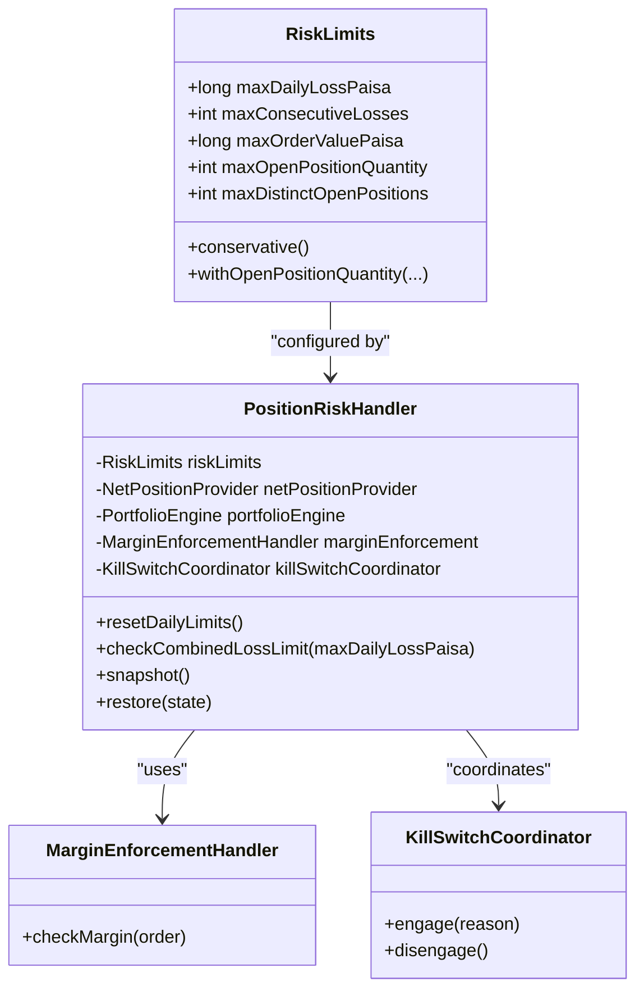

# Risk Limit Configurations

<cite>
**Referenced Files in This Document**
- [RiskLimits.java](file://core/src/main/java/com/tradej/core/domain/model/RiskLimits.java)
- [PositionRiskHandler.java](file://trading/execution/src/main/java/com/tradej/execution/risk/PositionRiskHandler.java)
- [MarginEnforcementHandler.java](file://trading/execution/src/main/java/com/tradej/execution/risk/MarginEnforcementHandler.java)
- [KillSwitchCoordinator.java](file://trading/execution/src/main/java/com/tradej/execution/risk/KillSwitchCoordinator.java)
- [DailyRiskResetScheduler.java](file://trading/execution/src/main/java/com/tradej/execution/risk/DailyRiskResetScheduler.java)
- [RiskConfiguration.java](file://app/src/main/java/com/tradej/app/config/RiskConfiguration.java)
- [PositionRiskHandlerComponentTest.java](file://app/src/test/java/com/tradej/app/integration/PositionRiskHandlerComponentTest.java)
- [MarginEnforcementComponentTest.java](file://app/src/test/java/com/tradej/app/integration/MarginEnforcementComponentTest.java)
- [KillSwitchE2EComponentTest.java](file://app/src/test/java/com/tradej/app/integration/KillSwitchE2EComponentTest.java)
- [TradingHotPathE2EComponentTest.java](file://app/src/test/java/com/tradej/app/integration/TradingHotPathE2EComponentTest.java)
- [PipelineConfigTest.java](file://runtime/hotpath/src/test/java/com/tradej/hotpath/PipelineConfigTest.java)
- [DisruptorHighThroughputStressTest.java](file://runtime/hotpath/src/test/java/com/tradej/hotpath/DisruptorHighThroughputStressTest.java)
</cite>

## Table of Contents
1. [Introduction](#introduction)
2. [Project Structure](#project-structure)
3. [Core Components](#core-components)
4. [Architecture Overview](#architecture-overview)
5. [Detailed Component Analysis](#detailed-component-analysis)
6. [Dependency Analysis](#dependency-analysis)
7. [Performance Considerations](#performance-considerations)
8. [Troubleshooting Guide](#troubleshooting-guide)
9. [Conclusion](#conclusion)
10. [Appendices](#appendices)

## Introduction
This document explains Risk Limit Configurations and Parameters in the system. It focuses on the RiskLimits model, how risk limits are enforced during signal qualification and order execution, and how they relate to position tracking, margin enforcement, and kill switch activation. It also covers configuration options across environments, parameter tuning guidelines, validation, dynamic adjustments, overrides, emergency procedures, and compliance considerations.

## Project Structure
Risk limit enforcement spans several modules:
- Core domain defines the RiskLimits model.
- Execution risk module implements PositionRiskHandler, MarginEnforcementHandler, KillSwitchCoordinator, and DailyRiskResetScheduler.
- Application configuration wires beans and exposes environment-specific risk parameters.
- Tests demonstrate behavior, including kill switch activation, margin enforcement, and scenario suppression.

**Diagram sources**
- [RiskLimits.java:3-36](file://core/src/main/java/com/tradej/core/domain/model/RiskLimits.java#L3-L36)
- [PositionRiskHandler.java:33-353](file://trading/execution/src/main/java/com/tradej/execution/risk/PositionRiskHandler.java#L33-L353)
- [MarginEnforcementHandler.java:21-118](file://trading/execution/src/main/java/com/tradej/execution/risk/MarginEnforcementHandler.java#L21-L118)
- [KillSwitchCoordinator.java:12-72](file://trading/execution/src/main/java/com/tradej/execution/risk/KillSwitchCoordinator.java#L12-L72)
- [DailyRiskResetScheduler.java:14-32](file://trading/execution/src/main/java/com/tradej/execution/risk/DailyRiskResetScheduler.java#L14-L32)
- [RiskConfiguration.java:31-104](file://app/src/main/java/com/tradej/app/config/RiskConfiguration.java#L31-L104)
- [PositionRiskHandlerComponentTest.java:63-280](file://app/src/test/java/com/tradej/app/integration/PositionRiskHandlerComponentTest.java#L63-L280)
- [MarginEnforcementComponentTest.java:22-35](file://app/src/test/java/com/tradej/app/integration/MarginEnforcementComponentTest.java#L22-L35)
- [KillSwitchE2EComponentTest.java:26-65](file://app/src/test/java/com/tradej/app/integration/KillSwitchE2EComponentTest.java#L26-L65)
- [TradingHotPathE2EComponentTest.java:84-204](file://app/src/test/java/com/tradej/app/integration/TradingHotPathE2EComponentTest.java#L84-L204)
- [PipelineConfigTest.java:48-53](file://runtime/hotpath/src/test/java/com/tradej/hotpath/PipelineConfigTest.java#L48-L53)
- [DisruptorHighThroughputStressTest.java:152-169](file://runtime/hotpath/src/test/java/com/tradej/hotpath/DisruptorHighThroughputStressTest.java#L152-L169)

**Section sources**
- [RiskLimits.java:3-36](file://core/src/main/java/com/tradej/core/domain/model/RiskLimits.java#L3-L36)
- [PositionRiskHandler.java:33-353](file://trading/execution/src/main/java/com/tradej/execution/risk/PositionRiskHandler.java#L33-L353)
- [RiskConfiguration.java:31-104](file://app/src/main/java/com/tradej/app/config/RiskConfiguration.java#L31-L104)

## Core Components
- RiskLimits: Defines the four core risk parameters and a convenience constructor for tests and legacy compatibility.
- PositionRiskHandler: Enforces risk limits during signal qualification and trade lifecycle events; manages kill switch and daily resets.
- MarginEnforcementHandler: Validates margin availability against broker endpoints and caches estimates.
- KillSwitchCoordinator: Coordinates kill switch activation/deactivation via broker or OMS.
- DailyRiskResetScheduler: Resets daily counters and kill switch at market open.

Key responsibilities:
- Daily loss limits: realized and unrealized combined loss threshold.
- Position size constraints: maximum open position quantity and distinct open positions.
- Order value restrictions: maximum notional value per order and flip constraints.
- Portfolio exposure limits: enforced via portfolio capital reservation and margin checks.
- Kill switch activation: triggered by breaches and can suppress further signals.

**Section sources**
- [RiskLimits.java:3-36](file://core/src/main/java/com/tradej/core/domain/model/RiskLimits.java#L3-L36)
- [PositionRiskHandler.java:37-77](file://trading/execution/src/main/java/com/tradej/execution/risk/PositionRiskHandler.java#L37-L77)
- [MarginEnforcementHandler.java:21-118](file://trading/execution/src/main/java/com/tradej/execution/risk/MarginEnforcementHandler.java#L21-L118)
- [KillSwitchCoordinator.java:12-72](file://trading/execution/src/main/java/com/tradej/execution/risk/KillSwitchCoordinator.java#L12-L72)
- [DailyRiskResetScheduler.java:14-32](file://trading/execution/src/main/java/com/tradej/execution/risk/DailyRiskResetScheduler.java#L14-L32)

## Architecture Overview
The risk enforcement pipeline integrates with the hot-path event bus and order lifecycle:

**Diagram sources**
- [PositionRiskHandler.java:150-261](file://trading/execution/src/main/java/com/tradej/execution/risk/PositionRiskHandler.java#L150-L261)
- [MarginEnforcementHandler.java:48-72](file://trading/execution/src/main/java/com/tradej/execution/risk/MarginEnforcementHandler.java#L48-L72)
- [KillSwitchCoordinator.java:28-47](file://trading/execution/src/main/java/com/tradej/execution/risk/KillSwitchCoordinator.java#L28-L47)

## Detailed Component Analysis

### RiskLimits Model
RiskLimits is a record encapsulating:
- maxDailyLossPaisa: Maximum realized loss per day in paisa.
- maxConsecutiveLosses: Threshold for consecutive losing trades to trigger kill switch.
- maxOrderValuePaisa: Maximum notional value per order.
- maxOpenPositionQuantity: Maximum absolute net position per symbol (flip constraint).
- maxDistinctOpenPositions: Maximum number of distinct symbols with non-zero net position.

Factory helpers:
- conservative(): Provides a baseline set of limits suitable for cautious deployment.
- withOpenPositionQuantity(...): Legacy factory for tests and backward compatibility.

Parameter validation and defaults:
- Defaults are provided in tests and stress tests; conservative() sets safe defaults.
- Legacy method retains backward compatibility while encouraging explicit configuration.

**Section sources**
- [RiskLimits.java:3-36](file://core/src/main/java/com/tradej/core/domain/model/RiskLimits.java#L3-L36)
- [PipelineConfigTest.java:48-53](file://runtime/hotpath/src/test/java/com/tradej/hotpath/PipelineConfigTest.java#L48-L53)
- [DisruptorHighThroughputStressTest.java:152-169](file://runtime/hotpath/src/test/java/com/tradej/hotpath/DisruptorHighThroughputStressTest.java#L152-L169)

### PositionRiskHandler: Risk Enforcement and Kill Switch
Responsibilities:
- Tracks realized and unrealized losses, open trades, and symbols with open positions.
- Enforces:
  - Combined loss limit (realized + unrealized) via mark-to-market monitoring.
  - Order value and flip constraints based on net position and configured limits.
  - Distinct open positions cap.
  - Optional margin enforcement and portfolio capital reservation.
- Activates kill switch on breaches and suppresses signals accordingly.
- Supports daily reset and state snapshots for replay and recovery.

Key behaviors validated by tests:
- Suppression reasons for exceeding max notional value, max order value breach, max open position quantity, and max distinct open positions.
- Kill switch activation after consecutive losses and suppression of subsequent signals.
- Reset clears counters and kill switch state.

**Diagram sources**
- [PositionRiskHandler.java:203-261](file://trading/execution/src/main/java/com/tradej/execution/risk/PositionRiskHandler.java#L203-L261)

**Section sources**
- [PositionRiskHandler.java:141-201](file://trading/execution/src/main/java/com/tradej/execution/risk/PositionRiskHandler.java#L141-L201)
- [PositionRiskHandler.java:203-261](file://trading/execution/src/main/java/com/tradej/execution/risk/PositionRiskHandler.java#L203-L261)
- [PositionRiskHandlerComponentTest.java:108-141](file://app/src/test/java/com/tradej/app/integration/PositionRiskHandlerComponentTest.java#L108-L141)
- [PositionRiskHandlerComponentTest.java:143-175](file://app/src/test/java/com/tradej/app/integration/PositionRiskHandlerComponentTest.java#L143-L175)
- [PositionRiskHandlerComponentTest.java:177-202](file://app/src/test/java/com/tradej/app/integration/PositionRiskHandlerComponentTest.java#L177-L202)
- [PositionRiskHandlerComponentTest.java:204-238](file://app/src/test/java/com/tradej/app/integration/PositionRiskHandlerComponentTest.java#L204-L238)

### MarginEnforcementHandler
Behavior:
- Skips enforcement when disabled.
- Estimates required margin per order and compares to available margin from portfolio.
- Caches estimates keyed by order attributes to reduce broker calls.
- Returns rejection reasons for insufficient margin or failures.

Integration:
- Called by PositionRiskHandler during signal qualification.
- Enabled/disabled and cache TTL controlled via configuration.

**Section sources**
- [MarginEnforcementHandler.java:21-118](file://trading/execution/src/main/java/com/tradej/execution/risk/MarginEnforcementHandler.java#L21-L118)
- [MarginEnforcementComponentTest.java:22-35](file://app/src/test/java/com/tradej/app/integration/MarginEnforcementComponentTest.java#L22-L35)
- [RiskConfiguration.java:42-60](file://app/src/main/java/com/tradej/app/config/RiskConfiguration.java#L42-L60)

### KillSwitchCoordinator
Behavior:
- Engages kill switch via OMS or broker API when available.
- Disengages kill switch and tracks engagement state.
- Used by PositionRiskHandler to coordinate global kill switch activation.

**Section sources**
- [KillSwitchCoordinator.java:12-72](file://trading/execution/src/main/java/com/tradej/execution/risk/KillSwitchCoordinator.java#L12-L72)
- [KillSwitchE2EComponentTest.java:26-65](file://app/src/test/java/com/tradej/app/integration/KillSwitchE2EComponentTest.java#L26-L65)

### DailyRiskResetScheduler
Behavior:
- Resets daily counters and kill switch at market open.
- Calls PositionRiskHandler.resetDailyLimits() to clear realized/unrealized losses, consecutive losses, and kill switch.

**Section sources**
- [DailyRiskResetScheduler.java:14-32](file://trading/execution/src/main/java/com/tradej/execution/risk/DailyRiskResetScheduler.java#L14-L32)
- [PositionRiskHandler.java:287-294](file://trading/execution/src/main/java/com/tradej/execution/risk/PositionRiskHandler.java#L287-L294)

## Dependency Analysis
PositionRiskHandler depends on:
- RiskLimits for thresholds.
- NetPositionProvider for current positions.
- PortfolioEngine for capital reservation (optional).
- MarginEnforcementHandler for margin checks (optional).
- KillSwitchCoordinator for kill switch coordination.

**Diagram sources**
- [RiskLimits.java:3-36](file://core/src/main/java/com/tradej/core/domain/model/RiskLimits.java#L3-L36)
- [PositionRiskHandler.java:37-77](file://trading/execution/src/main/java/com/tradej/execution/risk/PositionRiskHandler.java#L37-L77)
- [MarginEnforcementHandler.java:48-72](file://trading/execution/src/main/java/com/tradej/execution/risk/MarginEnforcementHandler.java#L48-L72)
- [KillSwitchCoordinator.java:28-47](file://trading/execution/src/main/java/com/tradej/execution/risk/KillSwitchCoordinator.java#L28-L47)

**Section sources**
- [PositionRiskHandler.java:37-77](file://trading/execution/src/main/java/com/tradej/execution/risk/PositionRiskHandler.java#L37-L77)
- [RiskConfiguration.java:72-90](file://app/src/main/java/com/tradej/app/config/RiskConfiguration.java#L72-L90)

## Performance Considerations
- Concurrency: PositionRiskHandler uses atomic counters and concurrent structures for thread-safe state updates during high-frequency trading.
- Caching: MarginEnforcementHandler caches estimates to reduce broker calls; cache TTL is configurable.
- Throughput: Tests validate concurrent loss accumulation and signal qualification under load.

Recommendations:
- Tune maxConsecutiveLosses and maxDailyLossPaisa conservatively for high-frequency strategies.
- Monitor margin cache hit ratio and adjust TTL for broker latency characteristics.
- Ensure NetPositionProvider and PortfolioEngine implementations are efficient for real-time lookups.

**Section sources**
- [PositionRiskHandler.java:43-51](file://trading/execution/src/main/java/com/tradej/execution/risk/PositionRiskHandler.java#L43-L51)
- [MarginEnforcementHandler.java:39-43](file://trading/execution/src/main/java/com/tradej/execution/risk/MarginEnforcementHandler.java#L39-L43)
- [PositionRiskHandlerStressTest.java:68-142](file://trading/execution/src/test/java/com/tradej/execution/risk/PositionRiskHandlerStressTest.java#L68-L142)

## Troubleshooting Guide
Common issues and resolutions:
- Signals suppressed with reasons:
  - max_notional_value: Order value exceeds maxOrderValuePaisa.
  - max_order_value_breach: Flip would exceed maxOpenPositionQuantity.
  - max_open_position_quantity: Would exceed maxOpenPositionQuantity on flip.
  - max_distinct_open_positions: New symbol exceeds maxDistinctOpenPositions.
  - kill_switch_active: Kill switch engaged; trading halted.
  - reconciliation_halt: Reconciliation mismatch; trading halted until acknowledged.
  - insufficient_margin: Margin enforcement failure.
  - invalid_signal_quantity: Signal quantity invalid.
- Kill switch activation:
  - Consecutive losses reaching maxConsecutiveLosses.
  - Combined loss limit breach (realized + unrealized).
  - Reconciliation halt triggers kill switch.
- Daily reset:
  - Use resetDailyLimits() to clear counters and kill switch at market open.

Validation references:
- Suppression scenarios and kill switch activation are covered in integration tests.
- Margin enforcement rejection is validated in dedicated tests.

**Section sources**
- [PositionRiskHandler.java:263-277](file://trading/execution/src/main/java/com/tradej/execution/risk/PositionRiskHandler.java#L263-L277)
- [PositionRiskHandlerComponentTest.java:108-141](file://app/src/test/java/com/tradej/app/integration/PositionRiskHandlerComponentTest.java#L108-L141)
- [PositionRiskHandlerComponentTest.java:143-175](file://app/src/test/java/com/tradej/app/integration/PositionRiskHandlerComponentTest.java#L143-L175)
- [PositionRiskHandlerComponentTest.java:177-202](file://app/src/test/java/com/tradej/app/integration/PositionRiskHandlerComponentTest.java#L177-L202)
- [MarginEnforcementComponentTest.java:22-35](file://app/src/test/java/com/tradej/app/integration/MarginEnforcementComponentTest.java#L22-L35)

## Conclusion
Risk limit configuration centers on a concise RiskLimits model and robust enforcement in PositionRiskHandler. Together with optional margin checks and kill switch coordination, the system enforces daily loss caps, position sizing, order value limits, and portfolio exposure controls. Configuration is environment-driven, validated by comprehensive tests, and designed for dynamic adjustment and emergency response.

## Appendices

### Configuration Options Across Environments
- Environment-specific risk parameters are exposed via TradingProperties and wired into RiskLimits and related handlers.
- Key parameters include:
  - maxDailyLossPaisa
  - maxConsecutiveLosses
  - maxOrderValuePaisa
  - effectiveMaxOpenPositionQuantity
  - maxDistinctOpenPositions
  - enforceMargin
  - marginCacheTtlMinutes
  - enforceUnrealizedLoss
- Beans are created in RiskConfiguration, enabling per-environment tuning.

**Section sources**
- [RiskConfiguration.java:31-104](file://app/src/main/java/com/tradej/app/config/RiskConfiguration.java#L31-L104)

### Parameter Tuning Guidelines
- Conservative defaults:
  - Use RiskLimits.conservative() for cautious deployments.
  - Start with low maxConsecutiveLosses and moderate maxDailyLossPaisa.
- Order sizing:
  - Align maxOrderValuePaisa with average notional capacity per symbol.
  - Ensure maxOpenPositionQuantity accommodates expected flip sizes.
- Distinct positions:
  - Cap maxDistinctOpenPositions to limit diversification risk.
- Margin enforcement:
  - Enable enforceMargin and tune marginCacheTtlMinutes for broker responsiveness.

**Section sources**
- [RiskLimits.java:12-14](file://core/src/main/java/com/tradej/core/domain/model/RiskLimits.java#L12-L14)
- [RiskConfiguration.java:42-60](file://app/src/main/java/com/tradej/app/config/RiskConfiguration.java#L42-L60)

### Dynamic Adjustment Procedures
- Runtime adjustments:
  - Modify TradingProperties at runtime to change risk limits.
  - Recreate RiskLimits bean to apply new values.
- State management:
  - Use snapshot() and restore() to preserve state across reconfiguration.
  - Reset daily limits at market open to clear counters.

**Section sources**
- [PositionRiskHandler.java:302-332](file://trading/execution/src/main/java/com/tradej/execution/risk/PositionRiskHandler.java#L302-L332)
- [DailyRiskResetScheduler.java:28-31](file://trading/execution/src/main/java/com/tradej/execution/risk/DailyRiskResetScheduler.java#L28-L31)

### Risk Limit Overrides and Emergency Procedures
- Kill switch overrides:
  - Engage via KillSwitchCoordinator; disengage after resolution.
  - Acknowledge reconciliation halt and reset daily limits to resume.
- Compliance considerations:
  - Maintain audit trails of kill switch activations and overrides.
  - Ensure margin enforcement aligns with broker policies and regulatory constraints.

**Section sources**
- [KillSwitchCoordinator.java:28-67](file://trading/execution/src/main/java/com/tradej/execution/risk/KillSwitchCoordinator.java#L28-L67)
- [PositionRiskHandler.java:113-131](file://trading/execution/src/main/java/com/tradej/execution/risk/PositionRiskHandler.java#L113-L131)

### Examples of Risk Limit Scenarios
- Exceeding max notional value:
  - An order’s notional value surpasses maxOrderValuePaisa → rejected with reason.
- Flip constraint breach:
  - A flip would exceed maxOpenPositionQuantity → rejected with reason.
- Kill switch active:
  - After consecutive losses → all signals suppressed with reason.
- Insufficient margin:
  - Required margin exceeds available → rejected with reason.

**Section sources**
- [PositionRiskHandlerComponentTest.java:108-141](file://app/src/test/java/com/tradej/app/integration/PositionRiskHandlerComponentTest.java#L108-L141)
- [PositionRiskHandlerComponentTest.java:143-175](file://app/src/test/java/com/tradej/app/integration/PositionRiskHandlerComponentTest.java#L143-L175)
- [PositionRiskHandlerComponentTest.java:177-202](file://app/src/test/java/com/tradej/app/integration/PositionRiskHandlerComponentTest.java#L177-L202)
- [MarginEnforcementComponentTest.java:22-35](file://app/src/test/java/com/tradej/app/integration/MarginEnforcementComponentTest.java#L22-L35)

### Configuration Best Practices
- Start conservative and increase gradually based on strategy performance.
- Monitor kill switch events and adjust maxConsecutiveLosses and maxDailyLossPaisa.
- Validate margin enforcement with small orders before scaling.
- Use daily reset scheduler to avoid carry-forward of stale counters.
- Keep maxDistinctOpenPositions aligned with portfolio turnover expectations.

**Section sources**
- [RiskLimits.java:12-14](file://core/src/main/java/com/tradej/core/domain/model/RiskLimits.java#L12-L14)
- [DailyRiskResetScheduler.java:28-31](file://trading/execution/src/main/java/com/tradej/execution/risk/DailyRiskResetScheduler.java#L28-L31)
- [TradingHotPathE2EComponentTest.java:84-204](file://app/src/test/java/com/tradej/app/integration/TradingHotPathE2EComponentTest.java#L84-L204)